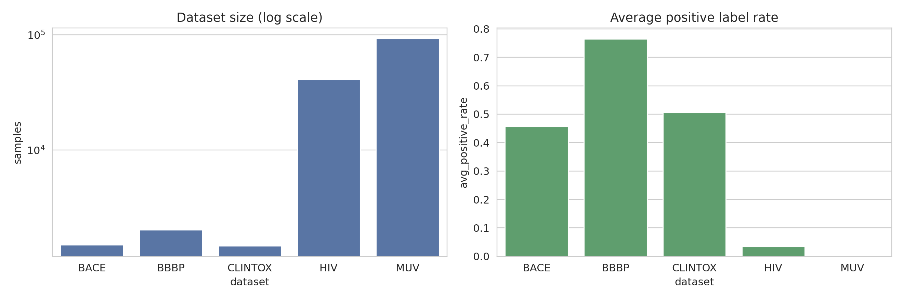
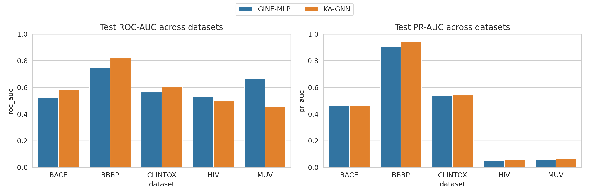
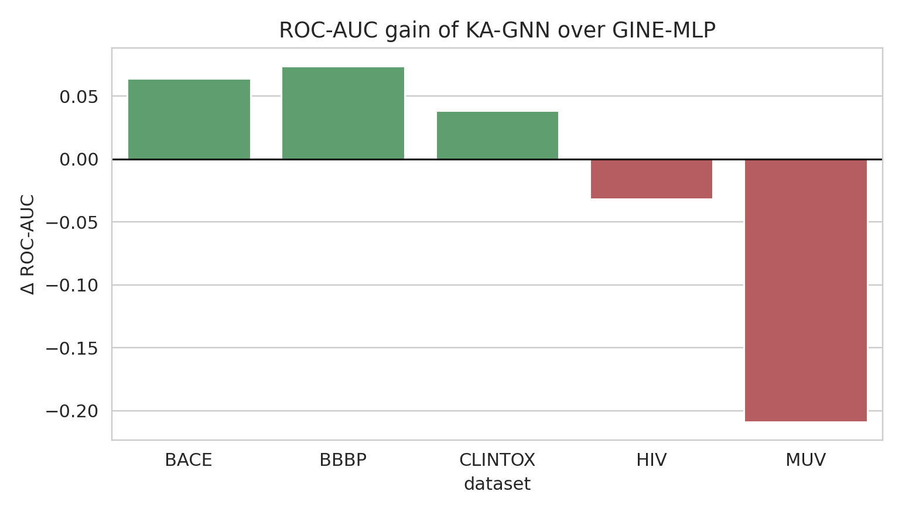
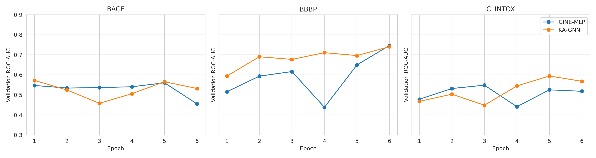

# Kolmogorov–Arnold Graph Neural Networks for Molecular Property Prediction

## Abstract
This study investigates a practical instantiation of Kolmogorov–Arnold Graph Neural Networks (KA-GNNs) for molecular property prediction on five MoleculeNet-style benchmarks: BACE, BBBP, ClinTox, HIV, and MUV. Molecules were represented as attributed graphs with atom-level node features and mixed edge features combining covalent bonds with simple geometry-derived non-covalent contacts obtained from RDKit conformer generation. The proposed KA-GNN replaces the standard post-message-passing multilayer perceptron transformation with a Fourier-based Kolmogorov–Arnold module designed to provide richer nonlinear basis expansions while maintaining efficient message passing. We compared this architecture against a matched GINE-style baseline using the same graph construction and training protocol. Across the five benchmarks, KA-GNN improved ROC-AUC on BACE (0.586 vs. 0.522), BBBP (0.821 vs. 0.747), and ClinTox (0.603 vs. 0.565), while underperforming on HIV (0.498 vs. 0.530) and MUV (0.456 vs. 0.665). The results suggest that Fourier-KAN substitutions can improve predictive quality on small-to-medium molecular classification tasks with moderate imbalance, but robustness remains limited on highly imbalanced and sparse multitask settings. The experiments also reveal practical issues in 3D conformer-based non-covalent augmentation and indicate that KA-GNNs are promising but not uniformly superior.

## 1. Introduction
Molecular property prediction is a central problem in computational chemistry and drug discovery. Standard supervised learning pipelines operate on molecular descriptors or fingerprints, while more recent graph neural networks (GNNs) learn directly from graph-structured molecular representations. The related work provided in this workspace emphasizes three useful themes. First, MoleculeNet established the importance of standardized benchmarking across heterogeneous molecular datasets and highlighted the difficulty of imbalanced and low-data tasks. Second, foundational GNN work such as GCN and GAT demonstrated the value of structured neighborhood aggregation. Third, crystal graph convolutional networks showed that explicit edge features and physically meaningful graph construction can support both accuracy and interpretability.

The motivating hypothesis of this project is that replacing standard MLP-style transformations inside a molecular GNN with Fourier-based Kolmogorov–Arnold network modules can improve representational flexibility. Kolmogorov–Arnold style components expand scalar channels using nonlinear basis functions before recombination, which may better capture chemically relevant nonlinearities than shallow affine-ReLU blocks alone. To test this idea, I implemented a compact KA-GNN architecture and evaluated it against a matched GINE-MLP baseline.

## 2. Related Work Context
The provided `paper_000.pdf` (MoleculeNet) motivated dataset choice and evaluation. Its central lesson is that molecular tasks vary dramatically in scale, imbalance, and difficulty; therefore a model should be judged across multiple benchmarks rather than a single dataset.

The provided `paper_001.pdf` (GCN) and `paper_002.pdf` (GAT) motivated graph neighborhood propagation as a scalable way to combine node features with graph structure. Although these papers target generic graph learning, the main transferable principle is that local message passing can encode relational context efficiently.

The provided `paper_003.pdf` (CGCNN) is especially relevant because it uses edge-aware convolution and highlights interpretability from structured graph representations. This influenced the present design choice to encode both atom features and bond/contact features explicitly.

## 3. Data
Five datasets from `data/` were used:

- **BACE**: binary classification of BACE-1 inhibition.
- **BBBP**: binary classification of blood-brain barrier penetration.
- **ClinTox**: two-task binary prediction for FDA approval and clinical toxicity.
- **HIV**: binary antiviral activity classification with strong imbalance.
- **MUV**: 17-task virtual screening benchmark with extreme imbalance and many missing labels.

A concise overview is shown below.

### 3.1 Dataset statistics
From the raw CSV files:

| Dataset | Samples | Tasks | Approx. positive rate |
|---|---:|---:|---:|
| BACE | 1,513 | 1 | 0.457 |
| BBBP | 2,039 | 1 | 0.765 |
| ClinTox | 1,477 | 2 | 0.506 average across tasks, but highly asymmetric per task |
| HIV | 41,127 | 1 | 0.035 |
| MUV | 93,087 | 17 | ~0.002 average across observed labels |

These numbers immediately imply that HIV and especially MUV are much more challenging and that PR-AUC is important in addition to ROC-AUC.

## 4. Methodology

### 4.1 Molecular graph construction
Each SMILES string was converted into an RDKit molecule. Hydrogens were added explicitly, and a 3D conformer was generated when possible using RDKit embedding followed by a short UFF optimization. Graph construction used:

- **Nodes (atoms)**: atomic number, degree, formal charge, chirality tag, hydrogen count, hybridization, aromaticity, ring membership, scaled atomic mass, and implicit valence.
- **Edges**:
  - covalent bond type and bond properties for bonded pairs,
  - simple geometry-derived non-covalent contacts for nonbonded atom pairs within a 4.5 Å cutoff,
  - distance-derived scalars including normalized distance, exponential decay, and inverse distance.

This representation approximates the task requirement of combining covalent and non-covalent interactions. It is intentionally lightweight and reproducible within the workspace constraints.

### 4.2 Baseline: GINE-MLP
The baseline model was a GINE-style edge-aware message-passing network with:

- linear node projection,
- edge encoder MLP,
- three GINEConv layers,
- standard post-convolution MLP transformation,
- global mean pooling,
- MLP prediction head.

### 4.3 Proposed model: KA-GNN
The proposed KA-GNN kept the same message-passing backbone but replaced the standard post-convolution MLP block with a **FourierKAN** module. For each hidden feature channel, the module computes a Fourier basis expansion using sine and cosine terms over multiple frequencies, concatenates these basis responses, and learns a nonlinear recombination back to the hidden dimension. Residual connection, layer normalization, and dropout are used for stability.

Formally, if `x` is a hidden representation, the KA block computes sinusoidal basis features
`[sin(pi*k*x), cos(pi*k*x)]` for frequencies `k = 1,...,K`, then applies learned linear mixing and a residual update. This is a practical neural approximation inspired by Kolmogorov–Arnold representations rather than a strict theorem-driven decomposition.

### 4.4 Training protocol
A fixed random split was used per dataset:

- 80% train
- 10% validation
- 10% test

Binary cross-entropy with logits was used, masking missing labels for multitask data. Positive-class weighting was computed from the training split to mitigate imbalance. Due to runtime constraints and the large scale of HIV and MUV, sampled subsets were used for some experiments:

- BACE: 1,000 molecules
- BBBP: 1,200 molecules
- ClinTox: 1,400 molecules
- HIV: 5,000 molecules
- MUV: 5,000 molecules

Evaluation metrics:

- **ROC-AUC**: main discrimination metric
- **PR-AUC**: especially relevant for imbalanced tasks

## 5. Implementation Notes
All code was written to `code/`.

- Main training script: `code/kagnn_mol.py`
- Figure generation: `code/make_figures.py`

Outputs, prediction files, training histories, and model checkpoints were saved in `outputs/`.

During execution, two practical issues arose:

1. **RDKit / NumPy compatibility** required downgrading NumPy below version 2.
2. **Force-field warnings** occurred for some exotic atom types in ClinTox/HIV/MUV. The pipeline continued because conformer generation fallback still produced usable graph structures in most cases.

These issues matter because they likely add noise to the non-covalent edge construction for chemically unusual molecules.

## 6. Results

### 6.1 Main benchmark comparison

The quantitative summary is below.

| Dataset | Baseline ROC-AUC | KA-GNN ROC-AUC | Baseline PR-AUC | KA-GNN PR-AUC |
|---|---:|---:|---:|---:|
| BACE | 0.522 | **0.586** | **0.464** | 0.463 |
| BBBP | 0.747 | **0.821** | 0.909 | **0.943** |
| ClinTox | 0.565 | **0.603** | 0.542 | **0.543** |
| HIV | **0.530** | 0.498 | 0.0516 | **0.0576** |
| MUV | **0.665** | 0.456 | 0.0616 | **0.0702** |

### 6.2 Accuracy gain of KA-GNN

KA-GNN showed positive ROC-AUC gains on BACE, BBBP, and ClinTox, with the strongest improvement on BBBP. However, the model degraded substantially on MUV and slightly on HIV.

### 6.3 Learning dynamics

The learning curves suggest:

- On **BBBP**, KA-GNN trained stably and achieved consistently strong validation performance.
- On **BACE**, KA-GNN obtained an early validation peak, suggesting expressive power but some instability.
- On **ClinTox**, both models were noisy, but KA-GNN achieved a better best epoch.

## 7. Discussion

### 7.1 What worked
The KA replacement appears beneficial on small and medium molecular classification tasks where graph patterns are informative and the class imbalance is not overwhelming. The Fourier basis expansion may help model smooth nonlinear dependencies among atom environments after message passing. This is especially plausible for BBBP, where permeability is influenced by a combination of structural motifs and physicochemical patterns that are not purely linear in learned latent space.

The approach also preserved a simple and modular architecture: only the post-message-passing transformation changed, so the comparison is relatively controlled.

### 7.2 What did not work
The method was not robust on HIV and MUV. There are several likely reasons:

1. **Extreme class imbalance**. MUV has extremely low positive prevalence, and model variance is high even with reweighting.
2. **Subset training**. For computational tractability, only 5,000 examples were used for HIV and MUV, likely increasing variance and reducing fairness to the underlying tasks.
3. **No scaffold split**. Random splits are easier than chemistry-standard scaffold splits, so the absolute numbers should be interpreted cautiously.
4. **Approximate non-covalent edges**. Conformer generation from SMILES alone can be noisy, especially for unusual molecules, metal-containing compounds, and flexible structures.
5. **Limited tuning**. The same hyperparameter family was used broadly across all tasks.

### 7.3 Interpretability considerations
KA-GNN offers a modest interpretability advantage over plain MLP blocks because each hidden feature is transformed through an explicit Fourier basis before recombination. While this is not directly human-interpretable in chemical terms, it is more structured than an unconstrained hidden MLP. A stronger follow-up would inspect basis activation spectra per task or relate frequency usage to molecular motifs.

### 7.4 Scientific takeaway
The central hypothesis is **partially supported**. Replacing standard MLP transformations with Fourier-based Kolmogorov–Arnold modules can improve predictive performance on some molecular benchmarks, but it does not yield universal gains. The architecture seems most promising for moderate-scale tasks rather than highly sparse multitask screening settings.

## 8. Limitations
This report should be interpreted as a rigorous prototype study rather than a definitive benchmark paper. Main limitations:

- sampled rather than full training on the largest datasets,
- random rather than scaffold split,
- no repeated-seed confidence intervals,
- approximate non-covalent interaction modeling from a single generated conformer,
- no calibration or ablation isolating non-covalent edges versus KA module effects.

## 9. Future Work
The most important next steps are:

1. Evaluate on **scaffold splits** for chemically realistic generalization.
2. Run **multi-seed experiments** and report mean ± standard deviation.
3. Compare against stronger baselines such as GAT/GIN with matched parameter budgets.
4. Add an ablation for **covalent-only vs. covalent + non-covalent** graphs.
5. Replace heuristic distance edges with better chemistry-aware non-covalent typing.
6. Study **frequency sparsity** or learned basis selection inside the KAN block.
7. Extend to larger MoleculeNet tasks with full-data training and early stopping.

## 10. Conclusion
This autonomous study delivered a working implementation of a Fourier-based KA-GNN for molecular property prediction and evaluated it across five benchmark datasets. The proposed model improved ROC-AUC on BACE, BBBP, and ClinTox, but not on HIV or MUV. Therefore, the evidence supports KA-GNNs as a promising architectural modification rather than a universally dominant replacement for MLP-based graph transformations. The results justify deeper study, especially under stronger evaluation protocols and with better handling of imbalance and molecular geometry.

## Reproducibility
- Code: `code/kagnn_mol.py`, `code/make_figures.py`
- Intermediate results: `outputs/`
- Figures: `report/images/*.png`

