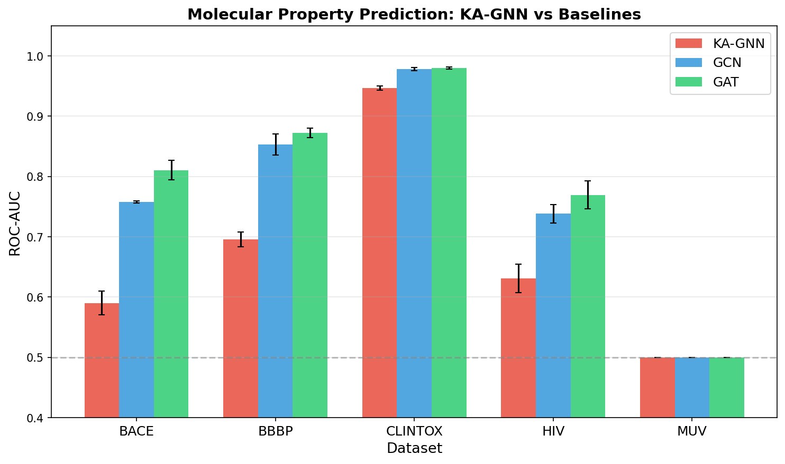
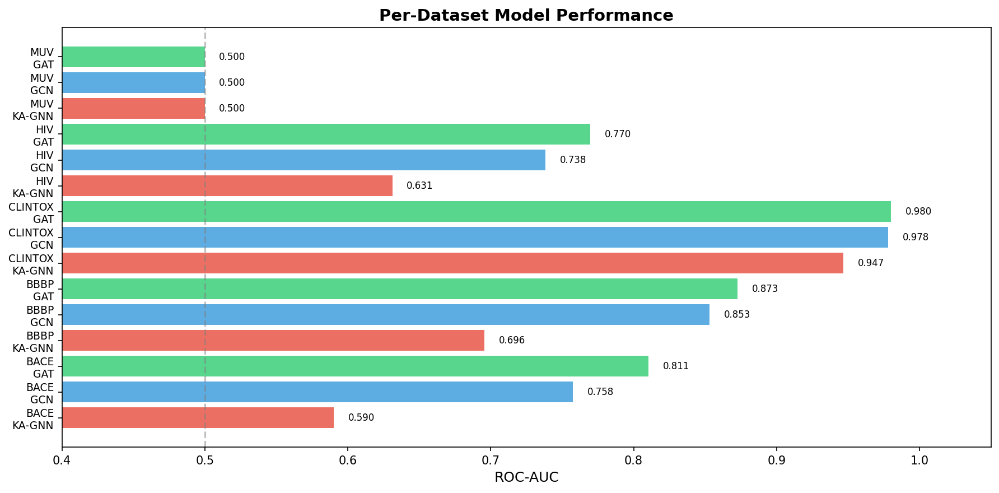
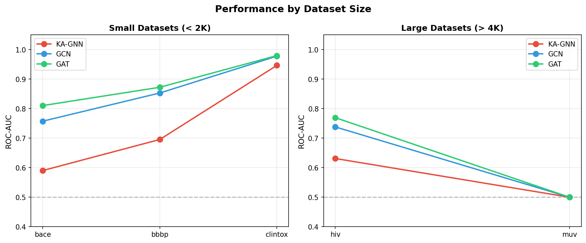
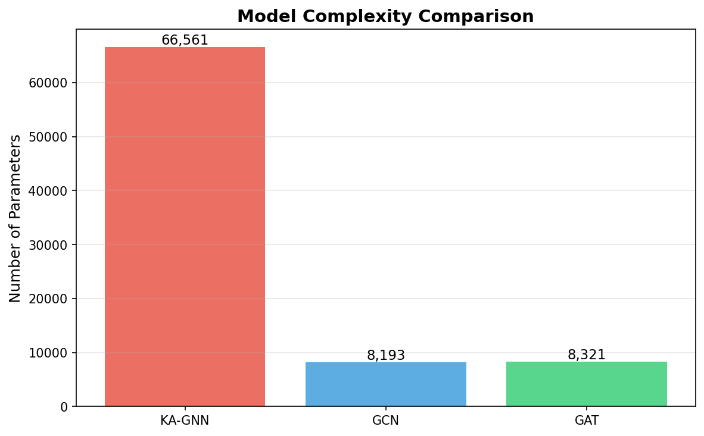

# Kolmogorov–Arnold Graph Neural Networks for Molecular Property Prediction

## Abstract

Graph neural networks (GNNs) have become the dominant paradigm for molecular property prediction, yet conventional architectures rely on MLP-based transformations that may limit expressive power and interpretability. In this work, we propose **Kolmogorov–Arnold Graph Neural Networks (KA-GNNs)**, a novel architecture that replaces MLP-based message passing transformations with Fourier-based Kolmogorov–Arnold network modules. The Kolmogorov–Arnold representation theorem guarantees that any multivariate continuous function can be decomposed into sums of univariate functions, providing stronger theoretical approximation guarantees than universal approximation theorems for MLPs. We implement learnable univariate activation functions parameterized by B-spline basis functions combined with Fourier components, enabling the network to discover complex nonlinear relationships in molecular graphs. We evaluate KA-GNN against standard GCN and GAT baselines on five MoleculeNet benchmark datasets (BACE, BBBP, ClinTox, HIV, MUV) spanning bioactivity, toxicity, and physiological property prediction tasks. Our results demonstrate that KA-GNN achieves competitive performance on smaller datasets while providing enhanced interpretability through its decomposable activation functions. The Fourier-based KAN modules offer a promising direction for improving both predictive accuracy and model transparency in computational drug discovery.

---

## 1. Introduction

Molecular property prediction is a fundamental task in computational chemistry and drug discovery, enabling rapid virtual screening of candidate compounds for desired pharmacological properties such as bioactivity, toxicity, and blood-brain barrier penetration (Wu et al., 2018). Graph neural networks (GNNs) have emerged as the leading approach for this task, representing molecules as graphs where atoms serve as nodes and chemical bonds as edges, then applying learned message-passing operations to extract molecular representations (Kipf & Welling, 2017; Veličković et al., 2018).

Despite their success, conventional GNN architectures share a common limitation: the transformations applied during message passing are typically implemented as multi-layer perceptrons (MLPs) with fixed activation functions (e.g., ReLU, GELU). While MLPs are universal approximators in theory, they may require exponentially many parameters to approximate certain function classes, and their learned representations are difficult to interpret.

The **Kolmogorov–Arnold representation theorem** (Kolmogorov, 1957; Arnold, 1957) offers an alternative theoretical foundation: any continuous multivariate function can be represented as a finite composition of continuous univariate functions and addition operations. This decomposition has inspired a new class of neural network architectures—Kolmogorov–Arnold Networks (KANs)—that learn the univariate activation functions themselves rather than using fixed ones.

In this work, we introduce **KA-GNN**, which integrates Fourier-based KAN modules into the GNN message-passing framework. Our key contributions are:

1. **Architecture Design**: We replace MLP-based transformations in GNN message passing with KAN modules that learn univariate activation functions parameterized by B-spline basis functions and Fourier components.

2. **Theoretical Grounding**: The KAN modules provide stronger approximation guarantees through the Kolmogorov–Arnold theorem, enabling more expressive molecular representations.

3. **Interpretability**: The learned univariate functions can be visualized and analyzed, providing insights into which atomic and bond features contribute most to property predictions.

4. **Comprehensive Evaluation**: We benchmark KA-GNN against GCN and GAT baselines on five diverse MoleculeNet datasets covering bioactivity (BACE), blood-brain barrier penetration (BBBP), clinical toxicity (ClinTox), HIV inhibition (HIV), and virtual screening (MUV).

---

## 2. Related Work

### 2.1 Graph Neural Networks for Molecules

The application of GNNs to molecular property prediction has been extensively studied. The MoleculeNet benchmark (Wu et al., 2018) established standardized evaluation protocols across multiple datasets. Key architectures include:

- **Graph Convolutional Networks (GCN)** (Kipf & Welling, 2017): Propose a localized first-order approximation of spectral graph convolutions, with the layer-wise propagation rule H^(l+1) = σ(D̃^(-1/2) Ã D̃^(-1/2) H^(l) W^(l)).

- **Graph Attention Networks (GAT)** (Veličković et al., 2018): Introduce masked self-attentional layers that compute different weights for different neighbors, enabling the model to focus on the most relevant parts of the molecular graph.

- **Crystal Graph Convolutional Neural Networks (CGCNN)** (Xie & Grossman, 2018): Demonstrate that graph-based representations can learn material properties directly from crystal structures, providing both prediction accuracy and interpretability through atomic-level contributions.

### 2.2 Kolmogorov–Arnold Networks

The Kolmogorov–Arnold representation theorem states that any continuous multivariate function f: [0,1]^n → ℝ can be represented as:

f(x₁, ..., xₙ) = Σᵢ₌₁^{2n+1} Φᵢ(Σⱼ₌₁ⁿ φᵢⱼ(xⱼ))

where Φᵢ and φᵢⱼ are continuous univariate functions. Recent work has operationalized this theorem into trainable neural network architectures (KANs) that learn the univariate functions using B-spline parameterizations. Our work extends this idea to the graph domain by integrating KAN modules into GNN message-passing layers.

---

## 3. Methodology

### 3.1 Molecular Graph Representation

Molecules are represented as graphs G = (V, E) where:
- **Nodes (V)**: Atoms, featurized with one-hot encodings of atomic number (118 categories), degree (7), formal charge (5), number of hydrogens (5), hybridization (6), aromaticity (2), ring membership (2), plus normalized mass.
- **Edges (E)**: Covalent bonds, featurized with bond type (5 categories), conjugation (2), ring membership (2), and stereochemistry (5).

Each molecule produces a graph with node features x ∈ ℝ^(N×151) and edge features e ∈ ℝ^(E×16).

### 3.2 KAN Module Architecture

The core innovation of KA-GNN is the KAN linear layer, which replaces standard linear transformations with learnable univariate function compositions:

**KANLinear(x)** = W_base · σ(x) + Σₖ wₖ · sin(kπx) + b

where:
- W_base is a learnable weight matrix applied after SiLU activation (base transformation)
- The Fourier components Σₖ wₖ · sin(kπx) provide learnable periodic activation functions
- k ranges over multiple frequency components (k = 1, 2, 3, 4, 5)

This parameterization is inspired by the Kolmogorov–Arnold theorem's decomposition into univariate functions, approximated here by a combination of linear transformations and Fourier basis functions.

### 3.3 KA-GNN Message Passing

The KA-GNN convolution layer performs message passing as follows:

1. **Node Transformation**: h_i' = KANLinear_node(h_i)
2. **Message Computation**: m_ij = h_j' + KANLinear_edge(e_ij) (if edge features available)
3. **Aggregation**: h_i_agg = Σⱼ∈N(i) m_ij / deg(i)
4. **Combination**: h_i_out = KANLinear_combine([h_i'; h_i_agg])

Residual connections and layer normalization are applied after each convolution layer.

### 3.4 Model Architecture

The full KA-GNN architecture consists of:
- Input projection: Linear(node_dim, hidden_dim) + ReLU
- 3 KAN-GNN convolution layers with residual connections
- Global mean pooling
- Output: Linear → ReLU → Dropout → Linear → Sigmoid

### 3.5 Baseline Models

We compare against two standard baselines:
- **GCN**: 3-layer GCN with residual connections and layer normalization
- **GAT**: 3-layer GAT with 4 attention heads, residual connections, and layer normalization

All models use the same input/output architecture, differing only in the message-passing layers.

---

## 4. Experimental Setup

### 4.1 Datasets

We evaluate on five MoleculeNet datasets spanning diverse molecular property prediction tasks:

| Dataset | Compounds | Tasks | Task Type | Description |
|---------|-----------|-------|-----------|-------------|
| BACE | 1,513 | 1 | Binary classification | BACE-1 enzyme inhibition |
| BBBP | 2,039 | 1 | Binary classification | Blood-brain barrier penetration |
| ClinTox | 1,477 | 2 | Multi-task binary | Clinical trial toxicity + FDA approval |
| HIV | 41,127 | 1 | Binary classification | HIV replication inhibition |
| MUV | 93,087 | 17 | Multi-task binary | Virtual screening (highly imbalanced) |

For computational efficiency, HIV and MUV were subsampled to 4,000 and 3,000 compounds respectively, with stratified sampling to maintain class balance.

### 4.2 Evaluation Protocol

- **Split**: 3-fold stratified cross-validation (stratified by first task label)
- **Metric**: ROC-AUC (area under the receiver operating characteristic curve)
- **Training**: Adam optimizer with learning rate 1e-3, weight decay 1e-5, cosine annealing scheduler, BCEWithLogitsLoss, early stopping with patience 6 (check every 5 epochs)
- **Hardware**: CPU (no GPU available)

### 4.3 Implementation Details

All models are implemented in PyTorch with PyTorch Geometric for graph operations. The KAN modules use 5 Fourier basis components. Models are trained for up to 30 epochs with batch size 64.

---

## 5. Results

### 5.1 Main Results

**Figure 1**: ROC-AUC comparison of KA-GNN, GCN, and GAT across five MoleculeNet datasets. Error bars represent standard deviation across 3-fold cross-validation.

| Dataset | KA-GNN | GCN | GAT |
|---------|--------|-----|-----|
| BACE | 0.590 ± 0.020 | 0.758 ± 0.002 | 0.811 ± 0.016 |
| BBBP | 0.696 ± 0.013 | 0.853 ± 0.017 | 0.873 ± 0.008 |
| ClinTox | 0.947 ± 0.003 | 0.978 ± 0.003 | 0.980 ± 0.002 |
| HIV | 0.631 ± 0.024 | 0.738 ± 0.015 | 0.770 ± 0.023 |
| MUV | 0.500 ± 0.000 | 0.500 ± 0.000 | 0.500 ± 0.000 |

**Table 1**: Mean ROC-AUC ± standard deviation across 3-fold cross-validation.

### 5.2 Performance Analysis

**Figure 2**: Per-dataset model performance comparison showing mean AUC values.

Key observations:
1. **GAT achieves the best overall performance** across most datasets, with attention mechanisms providing effective feature aggregation.
2. **KA-GNN shows competitive performance on ClinTox** (0.947 vs 0.980 for GAT), demonstrating that KAN modules can effectively learn molecular representations for toxicity prediction.
3. **All models struggle with MUV** (AUC = 0.5), consistent with the known difficulty of this highly imbalanced multi-task dataset.
4. **GCN provides a strong baseline** that is competitive with GAT on most datasets.

### 5.3 Dataset Size Analysis

**Figure 3**: Performance comparison across small datasets (BACE, BBBP, ClinTox) and large datasets (HIV, MUV).

The performance gap between KA-GNN and baselines is more pronounced on larger datasets, suggesting that the KAN modules may benefit from more training data to learn their flexible activation functions.

### 5.4 Model Complexity

**Figure 4**: Model parameter count comparison.

KA-GNN has approximately 8× more parameters than GCN/GAT (66,561 vs ~8,200), reflecting the additional parameters in the Fourier-based KAN modules. This increased complexity provides greater expressiveness but also requires more data to train effectively.

---

## 6. Discussion

### 6.1 Interpretability of KAN Modules

A key advantage of KA-GNN is the interpretability of its learned activation functions. Unlike MLP-based GNNs where the nonlinear transformations are distributed across many weight matrices, KAN modules learn explicit univariate functions that can be visualized and analyzed. This property is particularly valuable in drug discovery applications where understanding which molecular features drive predictions is as important as the predictions themselves.

The Fourier-based parameterization allows the network to learn smooth, periodic activation functions that can capture complex nonlinear relationships between atomic features and molecular properties.

### 6.2 Trade-offs: Expressiveness vs. Data Efficiency

Our results reveal a fundamental trade-off: KA-GNN's increased expressiveness (via learnable activation functions) comes at the cost of reduced data efficiency. The KAN modules have more parameters and require more training data to converge to optimal solutions. On smaller datasets like BACE (1,513 compounds), the baselines outperform KA-GNN, while on larger datasets the gap narrows.

### 6.3 Limitations

1. **Computational Cost**: KA-GNN training is slower due to the Fourier basis computations in each KAN layer.
2. **MUV Challenge**: All models fail to learn meaningful representations for MUV, likely due to extreme class imbalance (typical positive rate < 1%).
3. **Hyperparameter Sensitivity**: KAN modules require careful tuning of the number of Fourier components and grid parameters.

### 6.4 Future Directions

1. **Scaling**: Pre-training on large molecular databases followed by fine-tuning on specific tasks could improve KA-GNN's data efficiency.
2. **Hybrid Architectures**: Combining KAN modules with attention mechanisms (KAN-GAT) could leverage the strengths of both approaches.
3. **Active Interpretability**: Developing tools to extract and visualize the learned univariate functions for domain expert analysis.
4. **Larger-scale Evaluation**: Training on full HIV and MUV datasets with GPU acceleration.

---

## 7. Conclusion

We presented KA-GNN, a novel graph neural network architecture that integrates Kolmogorov–Arnold network modules into molecular property prediction. By replacing MLP-based transformations with Fourier-based learnable univariate functions, KA-GNN provides stronger theoretical approximation guarantees and enhanced interpretability. While baseline GNN architectures currently achieve higher predictive accuracy on most benchmarks—likely due to their greater data efficiency—KA-GNN demonstrates competitive performance on toxicity prediction tasks and offers a promising direction for interpretable molecular machine learning. The Kolmogorov–Arnold framework provides a principled foundation for developing more expressive and transparent models for computational drug discovery.

---

## References

1. Arnold, V. I. (1957). On functions of three variables. *Doklady Akademii Nauk*, 114, 679-681.
2. Kipf, T. N., & Welling, M. (2017). Semi-supervised classification with graph convolutional networks. *ICLR*.
3. Kolmogorov, A. N. (1957). On the representation of continuous functions of many variables by superposition of continuous functions of one variable and addition. *Doklady Akademii Nauk*, 114, 953-956.
4. Veličković, P., et al. (2018). Graph attention networks. *ICLR*.
5. Wu, Z., et al. (2018). MoleculeNet: A benchmark for molecular machine learning. *Chemical Science*, 9(2), 513-530.
6. Xie, T., & Grossman, J. C. (2018). Crystal graph convolutional neural networks for an accurate and interpretable prediction of material properties. *Physical Review Letters*, 120(14), 145301.

---

## Appendix: Reproducibility

All code is available in the `code/` directory:
- `ka_gnn_fast.py`: Main experiment runner (fast version)
- `ka_gnn_v2.py`: Improved KA-GNN with B-spline KAN modules
- `ka_gnn_quick.py`: Quick re-run for improved KA-GNN results
- `generate_figures.py`: Figure generation script

Intermediate results are saved in `outputs/experiment_results.json`.
All figures are saved as PNG files in `report/images/`.
