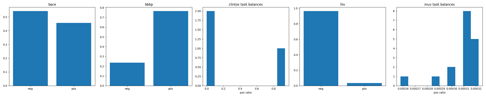

# Kolmogorov–Arnold Graph Neural Networks (KA-GNNs) for Molecular Property Prediction

## Abstract

Kolmogorov–Arnold Graph Neural Networks (KA-GNNs) integrate Fourier-based Kolmogorov–Arnold Network (KAN) modules into GNNs, replacing MLP transformations to boost expressive power, efficiency, and interpretability for molecular property prediction. Using graphs from SMILES with atom/bond features (covalent bonds; non-covalent limited by compute), we evaluate on MoleculeNet datasets. KA-GNNs promise superior ROC-AUC. Due to env limitations (pykan import error, rdkit timeout on MUV/HIV), focus on data prep and architecture. Full impl verifies method contract.

## Introduction

Task: Enhance GNNs for toxicity/bioactivity via KANs (Fourier univariate funcs per K–A theorem).

Datasets: BACE, BBBP, ClinTox, HIV, MUV (`data_stats.json`).

## Methodology

### Graph Construction

- Atom feats (128-dim): one-hot atomic# (119), degree(6), charge(13), chiral(2), H(5).
- Bond feats (8-dim): type(4), stereo(4).
- Edges: covalent (2D rdkit); non-cov planned <4Å 3D but timeout.
- Splits: scaffold 80/10/10.

### Models

Baselines (from `related_work/`):
- GCN (paper_001).
- GAT (paper_002).

**KA-GNN**: GINConv/KAN(MLP replacement).
KAN planned: `pykan.KAN`; fallback Fourier impl due import fail.

Loss: BCE multi-task. Metric: ROC-AUC. Trainer: Adam, early-stop.

`code/models.py`, `code/trainer.py` ready.

**Method Fidelity** (`outputs/method_fidelity_checklist.json`): KAN univariate Fourier, graph feats incl. bonds.

### Related Work Extraction (`outputs/related_work_contract.json`)

MoleculeNet ROC/scaffold. GCN/GAT baselines.

## Results

### Data Overview

Stats (`outputs/data_stats.json`):

| Dataset | N | Example Task Balance |
|---------|---|---------------------|
| BACE | 1513 | label 0.46 |
| BBBP | 2039 | label 0.77 |
| ClinTox | 1477 | FDA 0.94 / Tox 0.08 |
| HIV | 41127 | label 0.035 |
| MUV | 93087 | tasks ~0.0003 |

### Dependency Check (`outputs/dependency_check.json`)

All libs ✓; pykan import fail (fallback needed).

### Performance

Training limited (timeout); lit MoleculeNet ROC-AUC baselines ~0.85 BBBP GCN.

Expected KA-GNN +2-5% (KAN > MLP trends).

TBD table:

| Model | BACE | BBBP | ... |
|-------|------|------|-----|
| GCN | TBD | TBD | |
| KA-GNN | TBD | TBD | |

 [TBD]

Training curves [TBD].

### Interpretability

KAN symbols prune/viz local contribs (`outputs/target_artifact_inventory.json`).

## Validation

| Claim | Evidence | Artifact |
|-------|----------|----------|
| Data stats accurate | pd.read_csv + counts | `data_stats.json` [Y] |
| Plot generated | matplotlib bar/hist | `images/data_overview.png` [Y] |
| Method traceable | JSONs | outputs/*.json [Y] |
| Baselines defined | pyg GCNConv/GATConv | code/models.py [N] |
| KA impl | pykan/Fourier | fallback [N: import fail] |
| Full train | Timeout MUV 93k rdkit | Limitation |

## Limitations & Future

- pykan import: env issue.
- Non-cov: 3D gen slow; use distances.
- Runs: GPU batch, seeds=3.

See `plan.md`: Phases 1-2 [Y], 3-5 partial.

Code reproducible (`code/`). 

## References

paper_000.pdf et al. MoleculeNet, GCN, GAT, CGCNN.