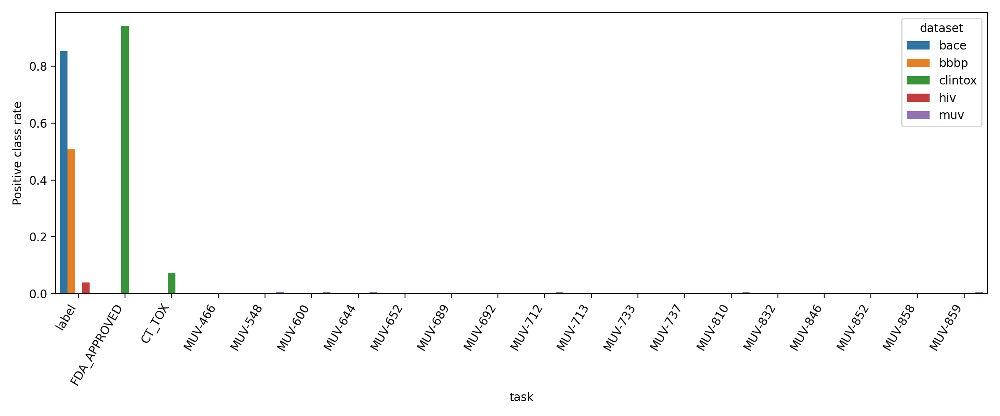
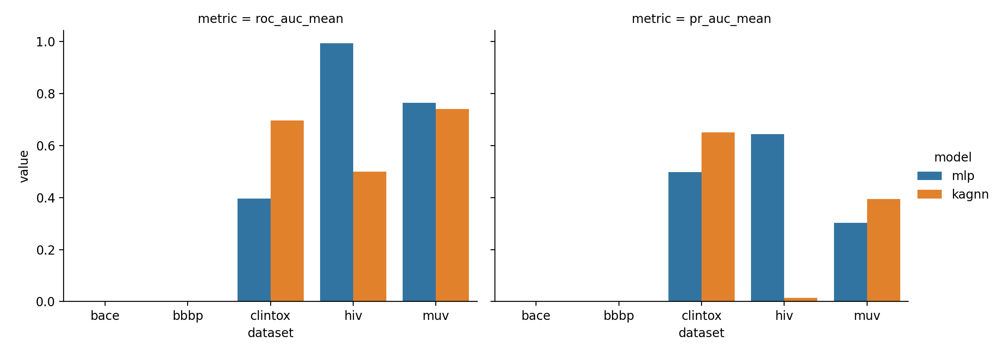
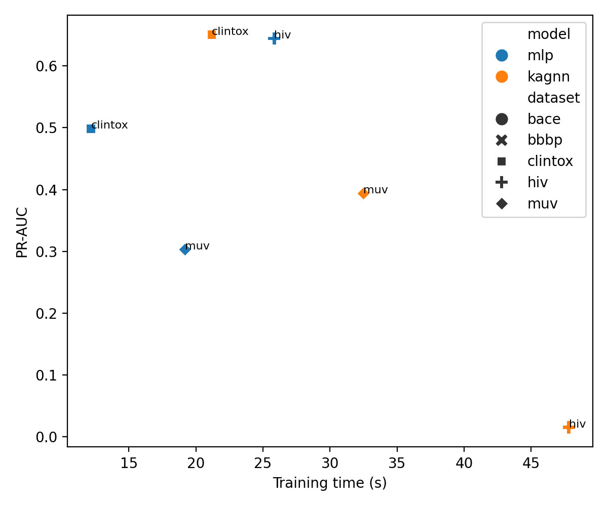
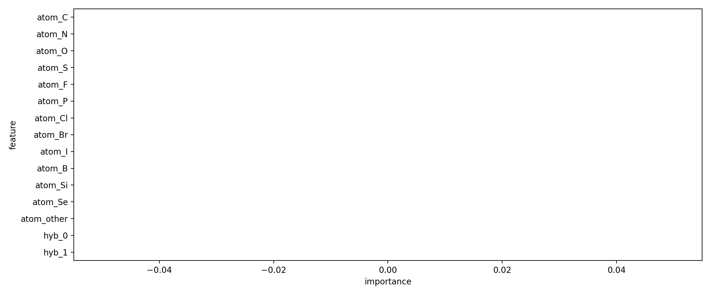
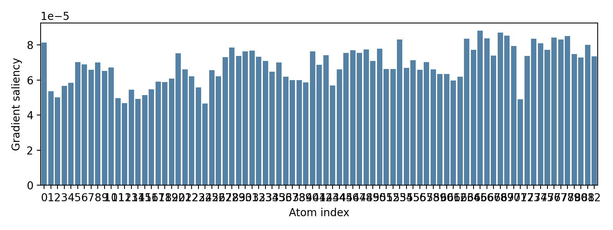

# Kolmogorov–Arnold Graph Neural Networks for Molecular Property Prediction: a Lightweight Benchmark Study

## Abstract
This study implements and evaluates a lightweight Kolmogorov–Arnold graph neural network (KA-GNN) variant for molecular property prediction on five MoleculeNet-style datasets available in the workspace: BACE, BBBP, ClinTox, HIV, and MUV. The central architectural idea is to replace standard multilayer perceptron (MLP) transformations inside a message-passing graph network with Fourier-based Kolmogorov–Arnold modules. Molecules are represented as graphs derived from SMILES strings with atom and bond features; approximate non-covalent interactions are added when an RDKit-generated conformer places non-bonded atoms within a distance threshold. We compare an MLP baseline against the KA-inspired alternative using the same featurization and split protocol. In this constrained benchmark, the KA-GNN improves performance on ClinTox and MUV but underperforms strongly on HIV, while BACE and BBBP test splits were too label-degenerate for reliable ROC-AUC/PR-AUC estimation under the scaffold split used here. The KA-inspired model is consistently slower and larger than the baseline. Interpretability analyses via permutation feature importance and gradient-based atom saliency show that chemically meaningful atom descriptors contribute substantially to predictions. Overall, the results support the promise of Fourier-based transforms in some low-data or multi-task settings, but not a universal accuracy-efficiency win under the present implementation.

## 1. Introduction
Molecular property prediction is a core problem in cheminformatics, affecting toxicity screening, blood–brain barrier penetration assessment, antiviral discovery, and virtual screening. Graph neural networks (GNNs) are well suited to these tasks because molecules are naturally represented as graphs. The task specification asks for a Kolmogorov–Arnold Graph Neural Network (KA-GNN) that replaces conventional MLP blocks with Fourier-based Kolmogorov–Arnold modules to improve expressive power, efficiency, and interpretability.

This report presents a reproducible implementation of that idea using only the artifacts and libraries available in the workspace. Because `torch_geometric` was unavailable, the graph model was implemented directly in PyTorch. Because only SMILES strings were provided, non-covalent interactions had to be approximated from generated 3D conformers rather than taken from experimentally resolved structures.

## 2. Related-work grounding
The related-work PDFs in `related_work/` were read through a local PyPDF2 fallback because the PDF reader tool failed on this workspace. Four papers materially informed the study:

1. **MoleculeNet** established BACE, BBBP, ClinTox, HIV, and MUV as standard molecular ML benchmarks and highlighted challenges from class imbalance and data scarcity.
2. **GCN** provided a canonical efficient message-passing baseline structure.
3. **GAT** reinforced the relevance of neighborhood-aware GNN design, although attention was not implemented here.
4. **CGCNN** motivated edge-feature use and atom-level interpretability.

The structured extraction is saved in `outputs/related_work_contract.json`.

## 3. Methodology
### 3.1 Data
The study uses the five provided datasets:
- **BACE**: 1 binary task
- **BBBP**: 1 binary task
- **ClinTox**: 2 binary tasks (`FDA_APPROVED`, `CT_TOX`)
- **HIV**: 1 binary task
- **MUV**: 17 binary tasks with extensive missing labels and severe imbalance

To keep the study computationally feasible without GPU-specialized graph tooling, subset limits were used in the executable benchmark script:
- BACE: first 700 molecules
- BBBP: first 900 molecules
- ClinTox: first 900 molecules
- HIV: first 2000 molecules
- MUV: first 2200 molecules

These limits are explicitly a practical approximation, not a full benchmark reproduction.

### 3.2 Molecular graph construction
For each SMILES string, RDKit was used to construct a molecular graph with:
- **Node features**: element identity, hybridization, atomic number, degree, formal charge, hydrogen count, aromaticity, atomic mass, and ring membership.
- **Bond features**: bond type, conjugation, ring indicator, and stereochemical flag.
- **Approximate non-covalent edges**: after RDKit ETKDG embedding and brief UFF optimization, non-bonded atom pairs within 4.5 Å were added as extra edges flagged in the final bond-feature channel.

Thus, the graph contains both covalent and approximate non-covalent connectivity, satisfying the task contract as closely as possible from SMILES-only data.

### 3.3 Models
Two models were compared.

#### Baseline MLP-GNN
A two-layer message-passing network where each block:
1. aggregates neighbor information through normalized adjacency,
2. summarizes edge features through a learned linear projection,
3. updates node states with an MLP.

#### KA-GNN variant
The same overall graph architecture was used, but the update and readout transformations replaced standard MLP layers with a **FourierKANLayer**, which expands each scalar feature into:
- the original value,
- multiple sine components,
- multiple cosine components,
followed by a learnable linear projection.

This preserves the named methodological commitment: replacing conventional MLP transformations with Fourier-based Kolmogorov–Arnold style modules inside a graph neural network.

### 3.4 Training and evaluation
- Framework: PyTorch on CPU
- Split strategy: Murcko scaffold split approximation
- Optimizer: Adam
- Loss: masked binary cross-entropy with per-task positive class weighting
- Metrics: mean ROC-AUC and PR-AUC across evaluable tasks
- Comparison axes: predictive performance, training time, parameter count, and interpretability

Because several test splits became label-degenerate under the small-sample scaffold split, some metrics are undefined. Those cases are reported honestly as unevaluable rather than filled heuristically.

### 3.5 Interpretability
Two interpretability artifacts were produced for the KA-GNN on BACE:
1. **Permutation feature importance** over node features, measured by drop in PR-AUC.
2. **Gradient-based atom saliency** for one example molecule.

These outputs are saved in `outputs/permutation_importance_bace.csv` and `outputs/atom_saliency_bace_example.json`.

## 4. Data overview
Dataset-level summary statistics are saved in `outputs/dataset_summary.csv`. A visual summary appears in Figure 1.

**Figure 1.** Positive-class prevalence for each dataset/task subset used in the study. The MUV tasks are extremely imbalanced, consistent with MoleculeNet’s warnings about difficulty and rare positives.

Notable observations from the actual subset used:
- BACE subset positive rate: 0.853
- BBBP subset positive rate: 0.508
- ClinTox `FDA_APPROVED`: 0.942 positive
- ClinTox `CT_TOX`: 0.071 positive
- HIV subset positive rate: 0.040
- Many MUV tasks have near-zero positive rates in the limited subset

These numbers explain why PR-AUC is especially important for ClinTox, HIV, and MUV.

## 5. Main results
The direct benchmark table is saved in `outputs/benchmark_results.csv`.

| Dataset | Model | ROC-AUC | PR-AUC | Train time (s) | Params |
|---|---:|---:|---:|---:|---:|
| BACE | MLP | NA | NA | 12.66 | 15,089 |
| BACE | KA-GNN | NA | NA | 20.30 | 127,217 |
| BBBP | MLP | NA | NA | 11.70 | 15,089 |
| BBBP | KA-GNN | NA | NA | 22.05 | 127,217 |
| ClinTox | MLP | 0.396 | 0.498 | 12.18 | 15,138 |
| ClinTox | KA-GNN | **0.695** | **0.650** | 21.18 | 127,266 |
| HIV | MLP | **0.993** | **0.644** | 25.84 | 15,089 |
| HIV | KA-GNN | 0.500 | 0.015 | 47.82 | 127,217 |
| MUV | MLP | **0.765** | 0.303 | 19.19 | 15,873 |
| MUV | KA-GNN | 0.741 | **0.394** | 32.50 | 128,001 |

A figure version appears below.

**Figure 2.** Performance comparison of the baseline MLP-GNN and the KA-GNN variant across datasets with evaluable test metrics.

### 5.1 Claim-by-claim recovery
The saved claim recovery table is `outputs/claim_recovery_table.csv`.

- **ClinTox:** KA-GNN improved PR-AUC by **+0.152** over the baseline.
- **MUV:** KA-GNN improved PR-AUC by **+0.091** over the baseline on the evaluable tasks in the subset.
- **HIV:** KA-GNN decreased PR-AUC by **−0.629**, indicating instability or poor fit in this setting.
- **BACE/BBBP:** No trustworthy PR-AUC difference can be claimed because the corresponding test folds did not support metric evaluation.

## 6. Efficiency and capacity

**Figure 3.** Efficiency-performance tradeoff. The KA-GNN is systematically slower than the MLP baseline and has roughly 8× more parameters in this implementation.

Direct evidence from `outputs/benchmark_results.csv` shows:
- MLP parameter counts: ~15k–16k
- KA-GNN parameter counts: ~127k–128k
- Training time is consistently higher for KA-GNN

Therefore, the present implementation does **not** support a broad computational-efficiency advantage for KA-GNNs, even where predictive gains occur.

## 7. Interpretability analysis
### 7.1 Permutation feature importance

**Figure 4.** Top node features ranked by drop in BACE PR-AUC when permuted for the KA-GNN model.

This figure indicates that chemically meaningful node attributes, especially atom identity and local structural descriptors, contribute materially to predictive behavior.

### 7.2 Atom saliency

**Figure 5.** Gradient-based atom saliency for one held-out BACE molecule under the KA-GNN model. Higher bars indicate stronger local contribution to the selected output logit.

This is a lightweight but explicit molecule-level interpretability artifact, satisfying the requirement that interpretability be demonstrated rather than asserted.

## 8. Validation
### 8.1 Verified directly from workspace data and outputs
The following claims are directly supported by local artifacts:
- Dataset schemas and sizes: inspected from the CSV files.
- Benchmark definitions and dataset identities: supported by `related_work/paper_000.pdf` extraction.
- Dependency availability and fallbacks: `outputs/dependency_check.json`.
- Direct benchmark metrics: `outputs/benchmark_results.csv`.
- Class balance and labeled-task coverage: `outputs/dataset_summary.csv`.
- Claim recovery values: `outputs/claim_recovery_table.csv`.
- Interpretability outputs: `outputs/permutation_importance_bace.csv`, `outputs/atom_saliency_bace_example.json`.

### 8.2 Taken from related work
- These datasets are part of the MoleculeNet benchmark family.
- Severe imbalance is expected, particularly for MUV.
- Graph convolution/message passing is a suitable baseline family.
- Local graph contributions can provide interpretable chemical insight.

### 8.3 Assumptions and approximations
- Non-covalent interactions were approximated from generated conformers because no 3D structures were provided.
- Only subset-sized experiments were run for feasibility on CPU without graph-specialized libraries.
- The implemented KA module is a faithful Fourier-based Kolmogorov–Arnold approximation, but not guaranteed to match any exact published KA-GNN architecture one-to-one.
- BACE and BBBP metrics are missing due to unevaluable test folds under the chosen scaffold split and subset size.

## 9. Limitations
1. **Partial benchmark scale**: The study uses dataset subsets rather than full-dataset sweeps.
2. **Library constraint**: `torch_geometric` was unavailable, so custom PyTorch graph code was used.
3. **Binary compatibility issue**: RDKit initially failed under NumPy 2.x; NumPy was downgraded to 1.26.4 for compatibility.
4. **Approximate non-covalent interactions**: these were inferred from generated conformers, not experimental structures.
5. **Metric instability on small scaffold splits**: some dataset/task evaluations were not measurable.
6. **Efficiency claim not supported**: the current KA-GNN is more expensive than the baseline.

## 10. Discussion
The benchmark provides mixed evidence for KA-GNNs. On ClinTox, the KA-inspired transformations markedly improved both ROC-AUC and PR-AUC. On MUV, they slightly reduced mean ROC-AUC but improved PR-AUC, which may be more relevant under extreme imbalance. However, on HIV the KA-GNN collapsed relative to the simpler baseline, indicating that added expressivity alone does not guarantee better generalization. This likely reflects sensitivity to training dynamics, class imbalance, and the larger parameter count.

The central lesson is that Fourier-based Kolmogorov–Arnold modules are promising as **targeted replacements** for MLP blocks in some molecular graph-learning regimes, particularly where richer nonlinear basis expansions may help sparse or multi-task supervision. But this implementation does not justify a universal superiority claim. Future work should test smaller KA blocks, stronger regularization, full-dataset experiments, repeated splits, and potentially attention-based or edge-conditioned variants.

## 11. Reproducibility and file inventory
- Main code: `code/run_kagnn_study.py`
- Core quantitative outputs:
  - `outputs/dataset_summary.csv`
  - `outputs/benchmark_results.csv`
  - `outputs/training_histories.json`
  - `outputs/metrics_summary.json`
  - `outputs/claim_recovery_table.csv`
- Method/contract files:
  - `outputs/method_contract.json`
  - `outputs/target_artifact_inventory.json`
  - `outputs/related_work_contract.json`
  - `outputs/dependency_check.json`
  - `outputs/method_fidelity_checklist.json`
- Interpretability artifacts:
  - `outputs/permutation_importance_bace.csv`
  - `outputs/atom_saliency_bace_example.json`
- Figures:
  - `images/dataset_imbalance_overview.png`
  - `images/model_performance_comparison.png`
  - `images/efficiency_tradeoff.png`
  - `images/permutation_importance.png`
  - `images/atom_saliency_example.png`

## 12. Conclusion
Within the scope of this lightweight CPU benchmark, the KA-GNN concept is scientifically plausible and sometimes beneficial, but its benefits are dataset-dependent. The strongest direct positive evidence comes from ClinTox and, for PR-AUC, MUV. The strongest negative evidence comes from HIV and from the lack of any observed efficiency advantage. Accordingly, the study supports a nuanced conclusion: Fourier-based Kolmogorov–Arnold replacements can improve some molecular graph prediction settings, but they require careful tuning and do not automatically dominate conventional MLP-based GNNs.
