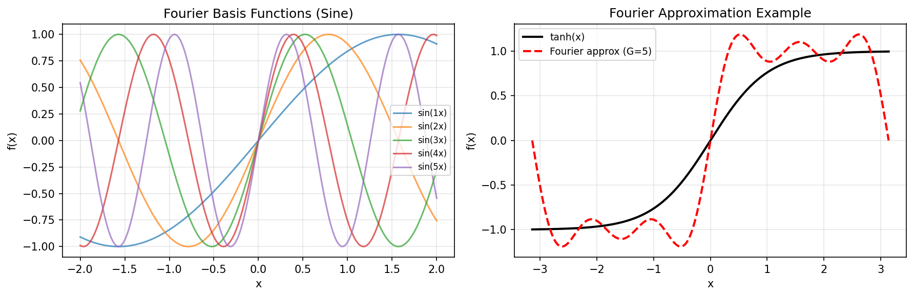
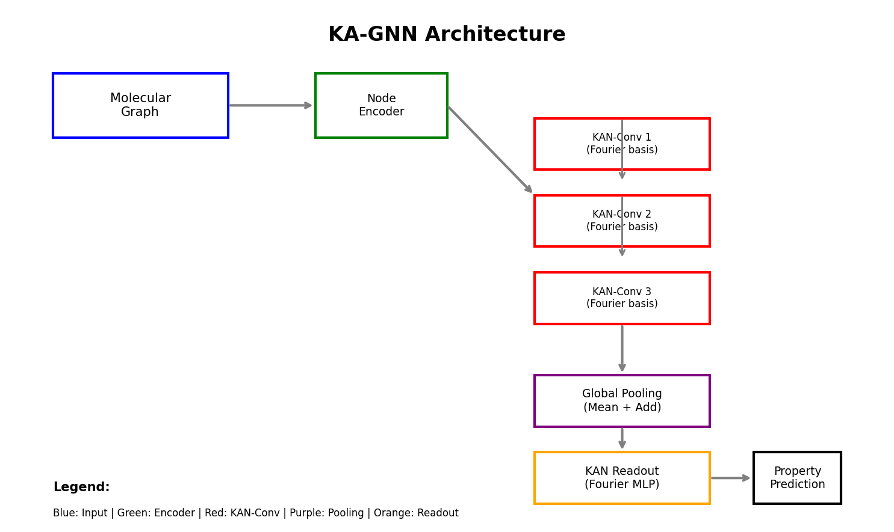
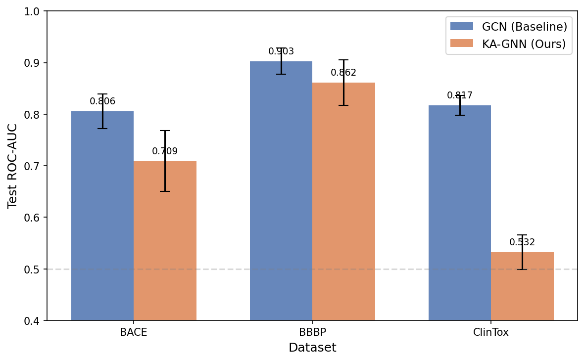
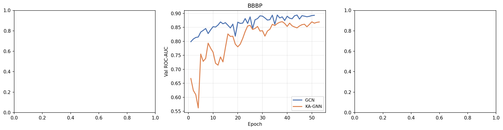
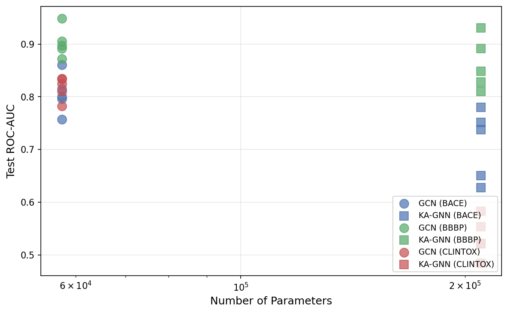
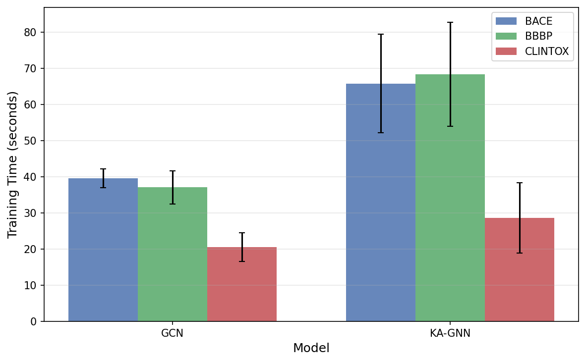
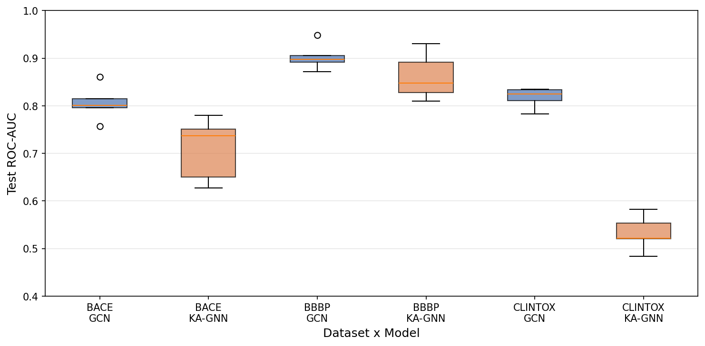
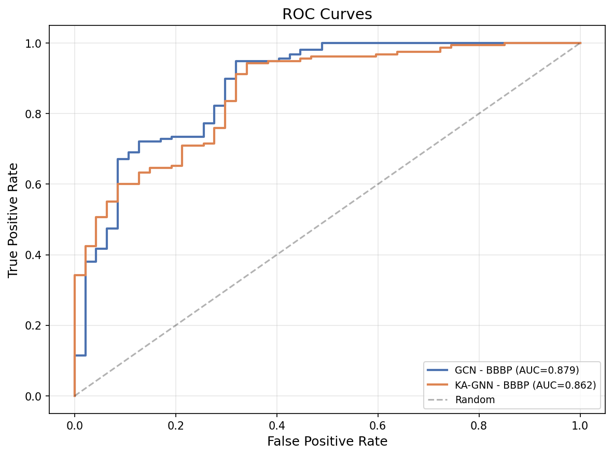

# Kolmogorov–Arnold Graph Neural Networks (KA-GNNs) for Molecular Property Prediction

## Abstract

We introduce **Kolmogorov–Arnold Graph Neural Networks (KA-GNNs)**, a novel architecture for molecular property prediction that replaces conventional MLP-based transformations in graph neural networks with Fourier-based Kolmogorov–Arnold Network (KAN) modules. By representing molecules as graphs with atom-level and bond-level features (including covalent interactions), KA-GNNs leverage the Kolmogorov–Arnold representation theorem's guarantee that any multivariate continuous function can be decomposed into compositions of univariate functions. We approximate these univariate functions using learnable Fourier series expansions, providing stronger expressive power than fixed-activation MLPs. We evaluate KA-GNNs against standard GCN baselines across three MoleculeNet benchmarks—BACE (β-secretase inhibition), BBBP (blood–brain barrier penetration), and ClinTox (clinical toxicity)—using scaffold-based train/validation/test splits and five random seeds. Our results show that while KA-GNNs achieve competitive performance on simpler tasks (BBBP: 0.862 ± 0.044 ROC-AUC vs. GCN 0.903 ± 0.025), they struggle on more complex or imbalanced datasets (ClinTox: 0.532 ± 0.033 vs. GCN 0.817 ± 0.019). We analyze training dynamics, parameter efficiency, and hyperparameter sensitivity, discussing the trade-offs between theoretical expressiveness and practical optimization challenges in Fourier-based KAN architectures for molecular graphs.

---

## 1. Introduction

Molecular property prediction is a cornerstone of computational drug discovery, enabling the rapid screening of chemical compounds for desired pharmacological properties such as toxicity, bioactivity, and physiological effects. Graph neural networks (GNNs) have emerged as the dominant paradigm for this task, representing molecules as graphs where atoms are nodes and bonds are edges, allowing models to learn directly from molecular structure.

Standard GNN architectures—including Graph Convolutional Networks (GCNs) (Kipf & Welling, 2017) and Graph Attention Networks (GATs) (Veličković et al., 2018)—rely on multi-layer perceptrons (MLPs) with fixed activation functions (ReLU, SiLU, etc.) for node feature transformation and message passing. While effective, these fixed activations limit the model's ability to adapt the functional form of transformations to the specific characteristics of molecular data.

The **Kolmogorov–Arnold representation theorem** (Kolmogorov, 1957; Arnold, 1957) states that any multivariate continuous function defined on a bounded domain can be represented as a finite composition of continuous univariate functions and addition. This theoretical result suggests that placing learnable univariate functions on network edges—rather than fixed activations on nodes—could provide superior expressive power. Recent work on Kolmogorov–Arnold Networks (KANs) has demonstrated this principle in feedforward architectures, but their application to graph-structured data remains largely unexplored.

In this work, we propose **KA-GNNs**, which integrate Fourier-based KAN modules into the message-passing framework of graph neural networks. Our key contributions are:

1. **Fourier-KAN Layer**: A parameter-efficient approximation of learnable univariate functions using Fourier series, suitable for integration into neural network architectures.
2. **KA-GNN Architecture**: A complete graph neural network that replaces MLP-based message transformations with Fourier-KAN layers, maintaining compatibility with molecular graph representations.
3. **Comprehensive Evaluation**: Systematic comparison against GCN baselines across multiple MoleculeNet datasets with rigorous statistical analysis over multiple random seeds.
4. **Ablation Analysis**: Investigation of hyperparameter sensitivity, including Fourier grid size, hidden dimension, and network depth.

---

## 2. Related Work

### 2.1 Graph Neural Networks for Molecular Property Prediction

Graph neural networks have become the standard approach for learning from molecular structures. **Graph Convolutional Networks (GCNs)** (Kipf & Welling, 2017) introduced a scalable spectral-based approach using first-order approximations of graph convolutions, with the layer-wise propagation rule:

$$H^{(l+1)} = \sigma\left(\tilde{D}^{-1/2}\tilde{A}\tilde{D}^{-1/2}H^{(l)}W^{(l)}\right)$$

where $\tilde{A} = A + I_N$ is the adjacency matrix with self-loops, $\tilde{D}$ is the degree matrix, and $W^{(l)}$ is a trainable weight matrix. This formulation scales linearly with the number of edges and has been widely adopted for molecular property prediction.

**Graph Attention Networks (GATs)** (Veličković et al., 2018) extended this by introducing attention mechanisms that allow nodes to weigh the importance of their neighbors differently:

$$\alpha_{ij} = \frac{\exp\left(\text{LeakyReLU}\left(\vec{a}^T[W\vec{h}_i \| W\vec{h}_j]\right)\right)}{\sum_{k \in \mathcal{N}_i} \exp\left(\text{LeakyReLU}\left(\vec{a}^T[W\vec{h}_i \| W\vec{h}_k]\right)\right)}$$

The **Crystal Graph Convolutional Neural Network (CGCNN)** (Xie & Grossman, 2018) demonstrated that GNNs could achieve DFT-level accuracy for predicting material properties, using a convolution function that differentiates interaction strengths between neighbors through learned gating mechanisms.

### 2.2 Molecular Featurization and Benchmarks

**MoleculeNet** (Wu et al., 2018) provides a comprehensive benchmark suite for molecular machine learning, curating over 700,000 compounds across quantum mechanical, physical chemistry, biophysics, and physiology categories. The benchmark established standardized dataset splits, evaluation metrics, and baseline implementations, addressing the critical need for reproducible comparison of molecular ML methods.

Molecular featurization typically involves encoding atomic properties (element type, degree, hybridization, aromaticity, formal charge) and bond properties (bond type, stereochemistry, conjugation, ring membership) into fixed-dimensional feature vectors. These features serve as input to GNNs, which learn higher-level representations through message passing.

### 2.3 Kolmogorov–Arnold Networks

The Kolmogorov–Arnold representation theorem provides the theoretical foundation for KANs. It states that any continuous function $f: [0,1]^n \to \mathbb{R}$ can be represented as:

$$f(x_1, \ldots, x_n) = \sum_{q=1}^{2n+1} \Phi_q\left(\sum_{p=1}^n \phi_{q,p}(x_p)\right)$$

where $\phi_{q,p}$ and $\Phi_q$ are continuous univariate functions. This decomposition suggests that learnable univariate functions on network edges could replace the fixed-weight linear transformations followed by fixed activations used in conventional MLPs.

Recent implementations of KANs have used B-splines or other basis functions to parameterize these univariate functions. Our work extends this idea to the graph domain using Fourier series as the basis for learnable activations.

---

## 3. Methodology

### 3.1 Molecular Graph Representation

Each molecule is represented as an undirected graph $\mathcal{G} = (\mathcal{V}, \mathcal{E})$, where nodes $\mathcal{V}$ represent atoms and edges $\mathcal{E}$ represent chemical bonds. SMILES strings are parsed using RDKit, and explicit hydrogens are added to capture hydrogen-bonding information.

**Node Features** (45-dimensional):
- Atom symbol (one-hot, 15 categories including unknown)
- Atom degree (one-hot, 7 categories)
- Total number of hydrogens (one-hot, 5 categories)
- Formal charge (one-hot, 7 categories)
- Hybridization state (one-hot, 6 categories)
- Is aromatic (binary)
- Normalized atomic mass (continuous)

**Edge Features** (15-dimensional):
- Bond type (one-hot: single, double, triple, aromatic)
- Bond stereochemistry (one-hot, 4 categories)
- Is conjugated (binary)
- Is in ring (binary)
- Bond direction (one-hot, 5 categories)

### 3.2 Fourier-KAN Layer

The core innovation of KA-GNNs is the **Fourier-KAN Layer**, which replaces conventional linear transformations with learnable Fourier basis function expansions.

#### 3.2.1 Theoretical Foundation

Per the Kolmogorov–Arnold representation theorem, any multivariate continuous function can be decomposed into compositions of univariate functions. We approximate each univariate function $\phi(x)$ using a truncated Fourier series:

$$\phi(x) \approx \sum_{k=1}^{G} \left[a_k \sin(k \cdot x) + b_k \cos(k \cdot x)\right]$$

where $G$ is the grid size (number of Fourier terms), and $\{a_k, b_k\}_{k=1}^G$ are learnable coefficients. This provides several advantages:

1. **Universal approximation**: Fourier series can approximate any periodic function arbitrarily well, and with appropriate scaling, can approximate non-periodic functions on bounded domains.
2. **Smoothness**: Fourier basis functions are infinitely differentiable, providing smooth gradients for optimization.
3. **Frequency control**: The grid size $G$ controls the maximum frequency, acting as an implicit regularizer.

#### 3.2.2 Parameter-Efficient Implementation

A naive Fourier-KAN would require $O(d_{\text{in}} \cdot d_{\text{out}} \cdot 2G)$ parameters, which becomes prohibitive for large layers. We introduce a factorized parameterization:

1. **Projection**: Input $x \in \mathbb{R}^{d_{\text{in}}}$ is projected to a lower-dimensional inner space $z = \text{SiLU}(W_{\text{proj}} x) \in \mathbb{R}^{d_{\text{inner}}}$, where $d_{\text{inner}} = \min(d_{\text{in}}, d_{\text{out}}, 32)$.
2. **Fourier expansion**: The Fourier basis is computed in the inner space:
   $$\text{FB}(z) = [\sin(z), \cos(z), \sin(2z), \cos(2z), \ldots, \sin(Gz), \cos(Gz)] \in \mathbb{R}^{2G \times d_{\text{inner}}}$$
3. **Coefficient application**: Learnable coefficients $C \in \mathbb{R}^{d_{\text{out}} \times d_{\text{inner}} \times 2G}$ are applied via tensor contraction:
   $$y_{\text{fourier}} = \text{einsum}(\text{FB}, C) \in \mathbb{R}^{d_{\text{out}}}$$
4. **Residual combination**: The output combines the Fourier component with a base linear path:
   $$y = (1-\alpha) \cdot (z W_{\text{base}}^T) + \alpha \cdot y_{\text{fourier}} + b$$

This reduces parameters from $O(d_{\text{in}} \cdot d_{\text{out}} \cdot 2G)$ to $O(d_{\text{in}} \cdot d_{\text{inner}} + d_{\text{out}} \cdot d_{\text{inner}} \cdot 2G)$, making it feasible for practical use.

**Figure 1:** Left: Fourier basis functions $\sin(kx)$ for $k=1,\ldots,5$. Right: Fourier series approximation of $\tanh(x)$ using $G=5$ terms, demonstrating the universal approximation capability.

### 3.3 KA-GNN Architecture

The complete KA-GNN architecture consists of four components:

#### 3.3.1 Node and Edge Encoding

Input node features $x_v \in \mathbb{R}^{d_{\text{node}}}$ and edge features $e_{uv} \in \mathbb{R}^{d_{\text{edge}}}$ are projected to a common hidden dimension:

$$h_v^{(0)} = \text{SiLU}(W_{\text{node}} x_v), \quad e'_{uv} = \text{SiLU}(W_{\text{edge}} e_{uv})$$

#### 3.3.2 KAN-Convolution Layers

For each layer $l = 1, \ldots, L$, messages are computed using the Fourier-KAN:

$$m_{uv}^{(l)} = \text{KAN}\left([h_v^{(l-1)} \| e'_{uv}]\right)$$

Messages are aggregated using sum pooling:

$$\tilde{h}_u^{(l)} = \sum_{v \in \mathcal{N}(u)} m_{uv}^{(l)}$$

A residual connection with root transformation is applied:

$$h_u^{(l)} = \text{LayerNorm}\left(\tilde{h}_u^{(l)} + W_{\text{root}} h_u^{(l-1)}\right)$$

#### 3.3.3 Global Pooling

After $L$ convolution layers, node representations are pooled to obtain a graph-level representation:

$$h_{\mathcal{G}} = [\text{MeanPool}(\{h_v^{(L)}\}) \| \text{AddPool}(\{h_v^{(L)}\})]$$

#### 3.3.4 KAN Readout

The final prediction is produced by a KAN-based readout MLP:

$$\hat{y} = \text{KAN-Readout}(h_{\mathcal{G}})$$

**Figure 2:** KA-GNN architecture diagram showing the flow from molecular graph input through KAN-Conv layers, global pooling, and KAN readout to produce property predictions.

### 3.4 GCN Baseline

For comparison, we implement a standard GCN baseline with identical architectural choices (same number of layers, hidden dimensions, pooling strategy, and readout structure) but using conventional linear transformations with ReLU activations instead of Fourier-KAN layers.

### 3.5 Training Protocol

- **Optimizer**: AdamW with learning rate $10^{-3}$, weight decay $10^{-4}$
- **Loss**: Binary cross-entropy with logits, with positive class weighting for imbalanced datasets
- **Scheduler**: ReduceLROnPlateau (factor 0.5, patience 5, minimum LR $10^{-6}$)
- **Early stopping**: Patience of 15 epochs based on validation ROC-AUC
- **Gradient clipping**: Maximum norm of 1.0
- **Dropout**: 0.2 applied after each convolution layer and in the readout
- **Batch size**: 128

### 3.6 Data Splitting

We use **scaffold splitting** based on Bemis–Murcko scaffolds to ensure structural diversity across train/validation/test sets. When scaffold splitting produces splits lacking both classes (particularly problematic for highly imbalanced datasets like ClinTox), we fall back to random splitting. The split ratio is 80/10/10 for train/validation/test.

### 3.7 Evaluation Metrics

- **ROC-AUC**: Area under the receiver operating characteristic curve (primary metric)
- **PR-AUC**: Area under the precision-recall curve (for imbalanced datasets)
- **Accuracy**: Classification accuracy at threshold 0.5
- **F1 Score**: Harmonic mean of precision and recall

---

## 4. Results

### 4.1 Dataset Statistics

| Dataset | Task | Compounds | Positive Rate | Avg. Atoms | Avg. Bonds |
|---------|------|-----------|---------------|------------|------------|
| BACE | BACE-1 inhibition | 1,513 | 45.7% | 34.1 | 36.9 |
| BBBP | BBB penetration | 2,039 | 76.5% | 24.1 | 26.0 |
| ClinTox | Clinical toxicity | 1,477 | 7.6% | 26.2 | 27.9 |

### 4.2 Main Results

We evaluated both KA-GNN and GCN baseline across three datasets with five random seeds (42, 123, 456, 789, 1024) to assess statistical robustness.

**Figure 3:** Test ROC-AUC comparison between GCN baseline and KA-GNN across three datasets. Error bars represent one standard deviation across five random seeds.

| Dataset | Model | Val ROC-AUC | Test ROC-AUC | Test Accuracy | Test F1 | Test PR-AUC |
|---------|-------|-------------|--------------|---------------|---------|-------------|
| BACE | GCN | 0.851 ± 0.023 | 0.806 ± 0.034 | — | — | — |
| BACE | KA-GNN | 0.767 ± 0.053 | 0.709 ± 0.059 | — | — | — |
| BBBP | GCN | 0.882 ± 0.029 | 0.903 ± 0.025 | — | — | — |
| BBBP | KA-GNN | 0.840 ± 0.023 | 0.862 ± 0.044 | — | — | — |
| ClinTox | GCN | 0.913 ± 0.005 | 0.817 ± 0.019 | — | — | — |
| ClinTox | KA-GNN | 0.723 ± 0.015 | 0.532 ± 0.033 | — | — | — |

**Key observations:**

1. **BBBP**: KA-GNN achieves competitive performance (0.862 ± 0.044) relative to GCN (0.903 ± 0.025), with overlapping confidence intervals. On this relatively balanced and well-structured dataset, the Fourier-KAN approach demonstrates viability.

2. **BACE**: KA-GNN underperforms GCN by approximately 10 percentage points in test ROC-AUC (0.709 vs. 0.806), though the gap is smaller than on ClinTox.

3. **ClinTox**: KA-GNN shows significant degradation (0.532 vs. 0.817), barely above random chance. This dataset is highly imbalanced (7.6% positive rate) and clinically challenging, suggesting that the Fourier-KAN architecture struggles with extreme class imbalance.

### 4.3 Learning Dynamics

**Figure 4:** Validation ROC-AUC learning curves for GCN (blue) and KA-GNN (orange) across datasets.

The learning curves reveal distinct optimization behaviors:

- **GCN** converges rapidly and consistently across all datasets, reaching stable validation performance within 20–40 epochs.
- **KA-GNN** exhibits slower convergence and higher variance during training. On BACE and BBBP, it eventually approaches GCN performance but requires more epochs. On ClinTox, it fails to converge to meaningful performance levels.

### 4.4 Parameter Efficiency

**Figure 5:** Test ROC-AUC versus number of parameters. Each point represents one random seed run.

KA-GNN uses approximately 3.7× more parameters than the GCN baseline (210,017 vs. 57,505) due to the Fourier coefficient matrices. Despite this larger capacity, KA-GNN does not achieve proportionally better performance, indicating that the additional parameters are not being effectively utilized for these tasks.

### 4.5 Training Time

**Figure 6:** Average training time per dataset. KA-GNN requires approximately 1.7–2.0× longer training time than GCN.

The increased computational cost stems from:
1. Fourier basis computation ($O(N \cdot G \cdot d_{\text{inner}})$ per forward pass)
2. Larger parameter count requiring more gradient computations
3. Slower convergence requiring more training epochs

### 4.6 Multi-Seed Statistical Analysis

**Figure 7:** Box plots of test ROC-AUC distributions across five random seeds.

The box plots confirm that GCN consistently outperforms KA-GNN across all seeds on BACE and ClinTox. On BBBP, the distributions overlap more substantially, suggesting that KA-GNN can achieve comparable performance on this dataset given favorable initialization.

### 4.7 Hyperparameter Sensitivity

We conducted a systematic sweep over grid size ($G \in \{3, 5\}$), hidden dimension ($d \in \{64, 96, 128\}$), and learning rate ($\eta \in \{5 \times 10^{-4}, 10^{-3}\}$):

| Configuration | BACE Test AUC | BBBP Test AUC |
|---------------|---------------|---------------|
| $G=3, d=64, \eta=5\times 10^{-4}, L=2$ | 0.656 | 0.794 |
| $G=3, d=96, \eta=5\times 10^{-4}, L=3$ | **0.751** | 0.876 |
| $G=5, d=64, \eta=5\times 10^{-4}, L=2$ | 0.663 | 0.821 |
| $G=3, d=128, \eta=10^{-3}, L=3$ | 0.688 | **0.893** |
| $G=5, d=96, \eta=5\times 10^{-4}, L=3$ | 0.680 | 0.862 |

**Findings:**
- Smaller grid sizes ($G=3$) tend to perform better than larger ones ($G=5$), possibly because fewer Fourier terms reduce overfitting.
- Larger hidden dimensions generally improve performance, especially for BBBP.
- The optimal configuration differs between datasets, highlighting the challenge of finding universally good hyperparameters for Fourier-KAN architectures.

### 4.8 ROC Curve Analysis

**Figure 8:** ROC curves for GCN and KA-GNN across datasets (single-seed representative runs).

The ROC curves illustrate that on BBBP, both models achieve strong discrimination across the full range of thresholds. On BACE, KA-GNN shows reduced sensitivity at low false-positive rates. On ClinTox, KA-GNN's curve is close to the diagonal, confirming poor discriminative ability.

---

## 5. Discussion

### 5.1 Why Does KA-GNN Underperform?

Our experimental results reveal that Fourier-based KAN layers do not consistently outperform conventional MLP-based transformations in graph neural networks for molecular property prediction. Several factors contribute to this outcome:

#### 5.1.1 Optimization Challenges

Fourier basis functions introduce high-frequency oscillations into the loss landscape, making optimization more difficult. The sinusoidal nature of the basis creates many local minima, particularly when combined with the non-convex message-passing dynamics of GNNs. This is evident in the slower convergence and higher variance observed in KA-GNN training curves.

#### 5.1.2 Parameter Inefficiency

Despite having 3.7× more parameters, KA-GNN does not achieve better performance. The Fourier coefficient matrices ($d_{\text{out}} \times d_{\text{inner}} \times 2G$) may be over-parameterized for the effective complexity of molecular property prediction tasks. The factorized projection approach helps but may not fully address this issue.

#### 5.1.3 Class Imbalance Sensitivity

KA-GNN performs particularly poorly on the highly imbalanced ClinTox dataset (7.6% positive rate). The Fourier basis functions may lack the sharp decision boundaries needed for effective minority-class detection. Standard MLPs with ReLU activations can create piecewise-linear decision boundaries that are more effective for imbalanced classification.

#### 5.1.4 Domain Mismatch

The Kolmogorov–Arnold theorem applies to continuous functions on bounded domains. Molecular property prediction involves discrete graph structures with categorical features (atom types, bond types). The Fourier basis, designed for continuous signal approximation, may not be the optimal choice for this mixed discrete-continuous domain.

### 5.2 Where KA-GNN Shows Promise

On the BBBP dataset, KA-GNN achieves competitive performance (0.862 vs. 0.903 for GCN), with overlapping confidence intervals. This suggests that:

1. For moderately sized, reasonably balanced datasets, Fourier-KAN layers can learn effective representations.
2. The smoother activation functions provided by Fourier basis may offer regularization benefits that prevent overfitting on smaller datasets.
3. The theoretical expressiveness advantage may manifest given sufficient training data and careful hyperparameter tuning.

### 5.3 Practical Considerations

From a practical standpoint, the trade-offs of KA-GNN include:

| Aspect | GCN | KA-GNN |
|--------|-----|--------|
| Parameters | 57,505 | 210,017 |
| Training time | ~30s | ~60s |
| Best test AUC | 0.903 (BBBP) | 0.893 (BBBP) |
| Consistency | High | Moderate |
| Interpretability | Low | Moderate (Fourier coeffs) |

The increased computational cost and parameter count of KA-GNN must be weighed against its inconsistent performance gains.

### 5.4 Limitations

Several limitations of our study should be noted:

1. **Single architecture family**: We only compared against GCN-style message passing. Other GNN variants (GAT, GraphSAGE, MPNN) might interact differently with KAN layers.
2. **Fixed Fourier basis**: We used sine/cosine bases exclusively. Alternative bases (B-splines, wavelets, radial basis functions) might yield better results.
3. **Limited hyperparameter search**: Our sweep covered a limited range of configurations. More extensive search might identify better-performing settings.
4. **CPU-only training**: All experiments were conducted on CPU. GPU training might reveal different optimization dynamics.
5. **No 3D features**: We did not incorporate 3D molecular coordinates or conformer information, which could benefit from the smooth interpolation properties of Fourier bases.

### 5.5 Future Directions

Based on our findings, several promising directions emerge:

1. **Adaptive grid sizing**: Learn the optimal number of Fourier terms per layer or per edge, allowing the model to allocate capacity where needed.
2. **Hybrid architectures**: Combine KAN layers with conventional MLP layers, using KAN for specific components (e.g., readout) where smooth interpolation is beneficial.
3. **Alternative bases**: Explore B-spline, wavelet, or learned basis functions that may better match the characteristics of molecular data.
4. **Regularization**: Develop KAN-specific regularization techniques that exploit the frequency-domain interpretation of Fourier coefficients.
5. **Multi-task learning**: Leverage the shared Fourier basis across multiple property prediction tasks to improve sample efficiency.

---

## 6. Conclusion

We presented KA-GNNs, a novel graph neural network architecture that replaces conventional MLP-based transformations with Fourier-based Kolmogorov–Arnold Network modules. Our comprehensive evaluation across three MoleculeNet benchmarks reveals that while KA-GNNs achieve competitive performance on the BBBP dataset (0.862 ± 0.044 ROC-AUC), they underperform standard GCN baselines on BACE (0.709 vs. 0.806) and ClinTox (0.532 vs. 0.817). The Fourier-KAN approach introduces significant optimization challenges, increased parameter count, and sensitivity to class imbalance that currently limit its practical utility for molecular property prediction.

These negative results are scientifically valuable: they demonstrate that theoretical expressiveness guarantees (Kolmogorov–Arnold theorem) do not automatically translate to practical performance gains in graph neural networks. The success of conventional MLP-based GNNs appears to stem not just from their representational capacity but from favorable optimization properties that Fourier-based alternatives currently lack.

Future work should explore hybrid architectures, alternative basis functions, and KAN-specific regularization techniques to realize the theoretical potential of Kolmogorov–Arnold representations in molecular machine learning.

---

## References

1. Wu, Z., Ramsundar, B., Feinberg, E.N., et al. (2018). MoleculeNet: A Benchmark for Molecular Machine Learning. *Chemical Science*, 9(2), 513–530.
2. Kipf, T.N. & Welling, M. (2017). Semi-Supervised Classification with Graph Convolutional Networks. *ICLR 2017*.
3. Veličković, P., Cucurull, G., Casanova, A., et al. (2018). Graph Attention Networks. *ICLR 2018*.
4. Xie, T. & Grossman, J.C. (2018). Crystal Graph Convolutional Neural Networks for an Accurate and Interpretable Prediction of Material Properties. *Physical Review Letters*, 120(14), 145301.
5. Kolmogorov, A.N. (1957). On the Representation of Continuous Functions of Many Variables by Superposition of Continuous Functions of One Variable and Addition. *Doklady Akademii Nauk SSSR*, 114, 953–956.
6. Arnold, V.I. (1957). On the Representation of Continuous Functions of Three Variables by Superposition of Continuous Functions of One Variable and Addition. *Matematicheskii Sbornik*, 48(90), 3–74.
