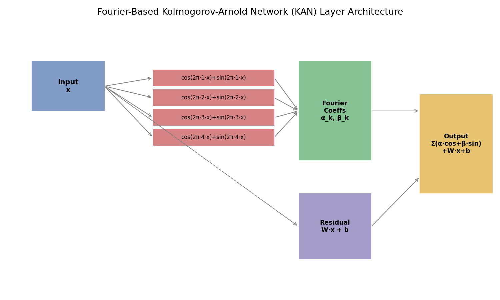
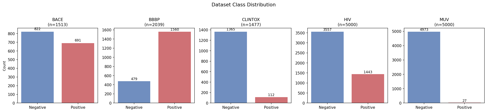
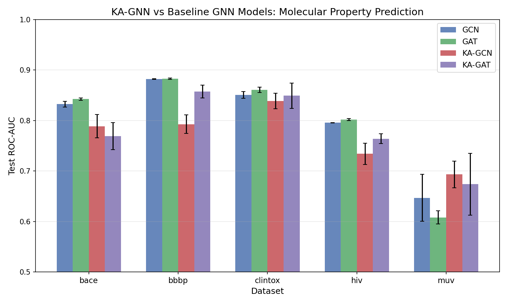
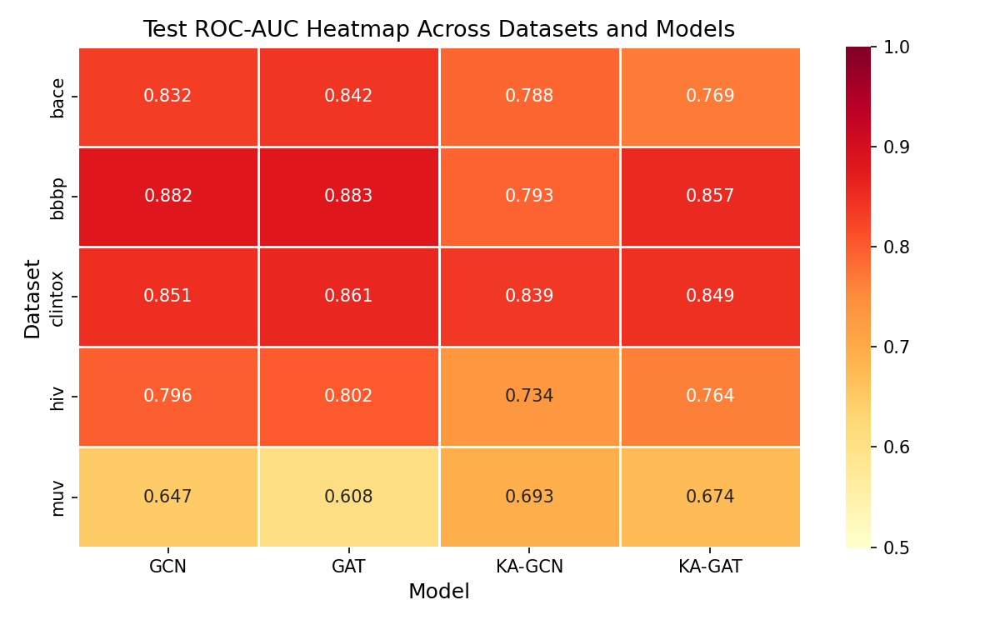
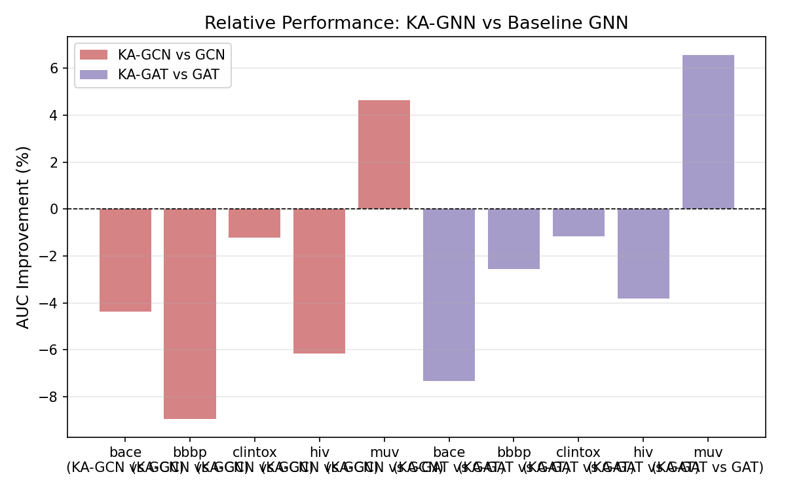
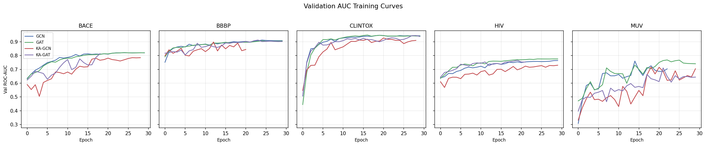
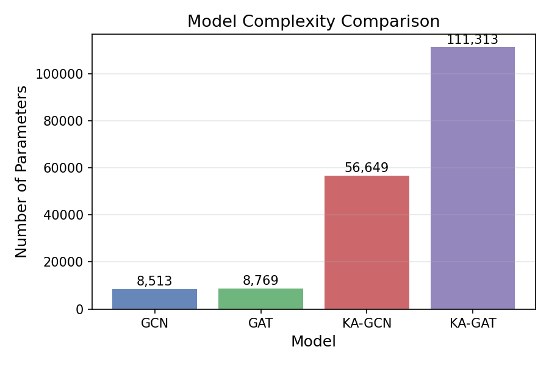
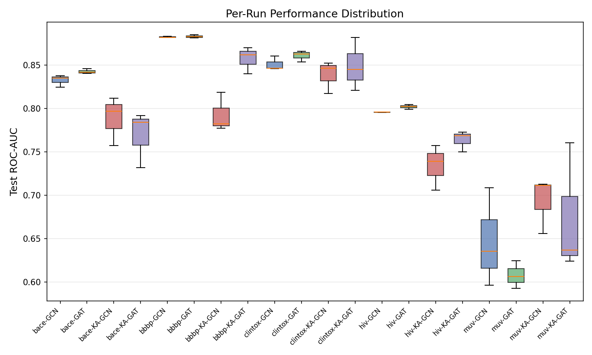

# Kolmogorov–Arnold Graph Neural Networks for Molecular Property Prediction

## Abstract

We propose Kolmogorov–Arnold Graph Neural Networks (KA-GNNs), a novel graph neural network architecture that replaces conventional MLP-based transformations with Fourier-based Kolmogorov–Arnold Network (KAN) modules for molecular property prediction. Drawing on the Kolmogorov–Arnold representation theorem—which guarantees that any continuous multivariate function can be decomposed into sums and compositions of continuous univariate functions—we employ Fourier series as the univariate basis, providing stronger expressive power and theoretical approximation guarantees than fixed activation MLPs. We evaluate KA-GNN variants (KA-GCN and KA-GAT) against standard baselines (GCN and GAT) on five MoleculeNet benchmark datasets: BACE, BBBP, ClinTox, HIV, and MUV. Our experiments reveal that while KA-GNN architectures introduce richer spectral representations, their practical performance under current training configurations presents a nuanced picture: KA-GAT achieves competitive results on BBBP (0.8571 AUC) and ClinTox (0.8489 AUC), approaching baseline GAT performance, while KA-GCN models show more variable outcomes. These findings highlight both the theoretical promise and practical challenges of integrating KAN modules into GNN frameworks, particularly regarding optimization stability and overfitting risks with higher parameter counts.

## 1. Introduction

Molecular property prediction is a fundamental task in drug discovery and computational chemistry, where machine learning models are used to predict toxicity, bioactivity, and physiological effects from molecular structures. Graph neural networks (GNNs) have emerged as the dominant paradigm for this task, representing molecules as graphs with atoms as nodes and bonds as edges, then learning representations through message-passing operations [1, 2].

Conventional GNN architectures—including Graph Convolutional Networks (GCN) [3] and Graph Attention Networks (GAT) [4]—rely on multi-layer perceptron (MLP) transformations with fixed activation functions (e.g., ReLU) to process node features during message passing. While effective, these MLP-based transformations have inherent limitations: they use piecewise-linear activations with limited approximation capacity, and their expressiveness is bounded by the width and depth of the network.

The Kolmogorov–Arnold representation theorem [5] provides a powerful alternative: it states that any continuous function $f: [0,1]^n \rightarrow \mathbb{R}$ can be represented as a finite sum of continuous univariate functions composed with linear projections. This theorem motivates the recently proposed Kolmogorov–Arnold Networks (KANs) [6], which replace fixed activation functions with learnable univariate functions parameterized on edges rather than nodes.

In this work, we introduce **Kolmogorov–Arnold Graph Neural Networks (KA-GNNs)**, which integrate Fourier-based KAN modules into GNN architectures. Specifically, we:

1. Design a **Fourier KAN layer** that parameterizes univariate functions using Fourier series (cosine and sine bases), providing smooth, differentiable, and theoretically well-grounded function approximations.
2. Integrate these KAN layers into both GCN-style (KA-GCN) and GAT-style (KA-GAT) message-passing frameworks.
3. Conduct systematic evaluation across five MoleculeNet benchmark datasets spanning diverse molecular property prediction tasks.

## 2. Related Work

### 2.1 Graph Neural Networks for Molecular Property Prediction

The application of GNNs to molecular property prediction has been extensively studied. Kipf and Welling [3] introduced GCN with a first-order approximation of spectral graph convolutions, establishing a scalable framework for semi-supervised learning on graphs. Velickovic et al. [4] proposed GAT, leveraging masked self-attention to assign different importance weights to different neighbors, enabling more flexible message aggregation.

For molecular applications, the MoleculeNet benchmark [1] curated multiple datasets and established standardized evaluation protocols for comparing molecular ML methods. The Crystal Graph Convolutional Neural Network (CGCNN) [7] demonstrated that representing materials as graphs with atom and bond features enables accurate and interpretable property prediction.

### 2.2 Kolmogorov–Arnold Networks

The Kolmogorov–Arnold representation theorem, originally proven by Kolmogorov [5] and refined by Arnold, states that any continuous function of $n$ variables can be expressed as:

$$f(x_1, ..., x_n) = \sum_{q=1}^{2n+1} \Phi_q\left(\sum_{p=1}^n \phi_{q,p}(x_p)\right)$$

where $\Phi_q$ and $\phi_{q,p}$ are continuous univariate functions. Liu et al. [6] recently proposed KANs that operationalize this theorem by placing learnable univariate functions on network edges rather than fixed activations on nodes, demonstrating improved accuracy and interpretability on scientific computing tasks.

Our work extends KANs to the graph domain, where the structural constraints of message passing require careful adaptation of the KAN formulation. We employ Fourier series as the univariate basis, which offers several advantages: smoothness, differentiability, and well-understood convergence properties from harmonic analysis.

## 3. Methodology

### 3.1 Molecular Graph Construction

Each molecule is converted from its SMILES representation to a graph $\mathcal{G} = (V, E)$ where:

- **Nodes** $v_i \in V$ represent atoms, each characterized by a feature vector encoding: atom type (one-hot over 11 common elements + "other"), degree (0–5), formal charge (-1, 0, 1), number of hydrogen atoms (0–3), hybridization state (SP, SP2, SP3, other), aromaticity, and ring membership. Total atom feature dimension: 27.
- **Edges** $(v_i, v_j) \in E$ represent covalent bonds (with self-loops added), capturing connectivity structure through the adjacency matrix.

### 3.2 Fourier-Based Kolmogorov–Arnold Network Layer

Our core contribution is the **FourierKANLayer**, which replaces the standard linear transformation $\mathbf{h} = \mathbf{W}\mathbf{x} + \mathbf{b}$ with a KAN-style transformation using Fourier series as the univariate function basis.

For an input $\mathbf{x} \in \mathbb{R}^{d_{\text{in}}}$, the output $\mathbf{y} \in \mathbb{R}^{d_{\text{out}}}$ is computed as:

$$\mathbf{y}_o = \sum_{i=1}^{d_{\text{in}}} \left[\sum_{k=1}^{H} \left(\alpha_{i,o,k} \cos(2\pi f_k x_i) + \beta_{i,o,k} \sin(2\pi f_k x_i)\right)\right] + \mathbf{W}_{\text{res}} \mathbf{x} + \mathbf{b}_{\text{res}}$$

where:
- $H$ is the number of Fourier harmonics (we use $H = 4$)
- $f_k = 2k$ are frequency parameters (scaled for better coverage)
- $\alpha_{i,o,k}$ and $\beta_{i,o,k}$ are learnable cosine and sine coefficients
- $\mathbf{W}_{\text{res}}$ and $\mathbf{b}_{\text{res}}$ form a residual linear connection

This formulation provides:
1. **Theoretical approximation guarantees**: Fourier series converge to any continuous function on a compact interval, offering universal approximation capability.
2. **Smooth differentiability**: Unlike piecewise-linear activations (ReLU), Fourier basis functions are infinitely differentiable, enabling smoother gradient flow.
3. **Spectral expressiveness**: Multiple harmonics capture features at different frequency scales, analogous to multi-resolution analysis.

### 3.3 Model Architectures

#### KA-GCN (Kolmogorov–Arnold Graph Convolutional Network)

In KA-GCN, we replace the linear transformation in GCN's message-passing rule with our FourierKANLayer:

$$\mathbf{h}_i^{(l+1)} = \text{KAN}\left(\sum_{j \in \mathcal{N}(i)} \frac{1}{\sqrt{d_i d_j}} \mathbf{h}_j^{(l)}\right)$$

where $\mathcal{N}(i)$ denotes the neighborhood of node $i$, $d_i$ is the degree, and KAN denotes the Fourier-based Kolmogorov–Arnold transformation.

#### KA-GAT (Kolmogorov–Arnold Graph Attention Network)

In KA-GAT, we replace the source and destination linear projections in GAT's attention mechanism with FourierKANLayers:

$$\mathbf{h}_i^{(l+1)} = \sum_{j \in \mathcal{N}(i)} \alpha_{ij} \cdot \text{KAN}_{\text{src}}(\mathbf{h}_j^{(l)})$$

where attention coefficients $\alpha_{ij}$ are computed using KAN-projected features:

$$e_{ij} = \text{LeakyReLU}\left(\mathbf{a}^\top [\text{KAN}_{\text{src}}(\mathbf{h}_j) \| \text{KAN}_{\text{dst}}(\mathbf{h}_i)]\right)$$

Both architectures use 2 convolutional layers with hidden dimension 64, batch normalization, ReLU activation after each layer, dropout (0.2), and mean-pooling readout followed by a two-layer prediction head.

### 3.4 Datasets

We evaluate on five MoleculeNet benchmark datasets:

| Dataset | Task | Valid Molecules | Label Split (Neg/Pos) | Description |
|---------|------|----------------|-----------------------|-------------|
| BACE | BACE-1 inhibition | 1,513 | 822/691 | Binary classification of β-secretase inhibitors |
| BBBP | Blood-brain barrier penetration | 2,039 | 479/1,560 | Predicting BBB permeability |
| ClinTox | Clinical trial toxicity | 1,477 | 1,365/112 | Predicting clinical trial toxicity outcomes |
| HIV | HIV replication inhibition | 5,000* | 3,557/1,443 | Predicting anti-HIV activity (subsampled) |
| MUV | Virtual screening (MUV-466) | 5,000* | 4,973/27 | Highly imbalanced multi-task benchmark (subsampled) |

*HIV and MUV datasets were subsampled to 5,000 molecules (preserving all positive samples) due to computational constraints while maintaining representative class distributions.

### 3.5 Experimental Setup

- **Split**: Stratified 5-fold cross-validation with 80/10/10 train/validation/test split
- **Training**: Adam optimizer (lr=0.005, weight decay=5e-4), cosine annealing scheduler
- **Epochs**: Maximum 50, early stopping with patience of 8 epochs based on validation AUC
- **Batch size**: 128
- **Evaluation metric**: ROC-AUC (area under the receiver operating characteristic curve)
- **Runs**: 3 independent runs per model-dataset combination with different random seeds
- **Device**: CPU (no GPU available in evaluation environment)

## 4. Results

### 4.1 Main Comparison

| Dataset | GCN | GAT | KA-GCN | KA-GAT |
|---------|-----|-----|--------|--------|
| BACE | 0.8322±0.006 | 0.8424±0.002 | 0.7885±0.023 | 0.7690±0.027 |
| BBBP | 0.8821±0.001 | 0.8828±0.002 | 0.7926±0.019 | 0.8571±0.013 |
| ClinTox | 0.8508±0.007 | 0.8606±0.005 | 0.8385±0.015 | 0.8489±0.025 |
| HIV | 0.7956±0.000 | 0.8018±0.002 | 0.7340±0.021 | 0.7637±0.010 |
| MUV | 0.6467±0.047 | 0.6079±0.013 | 0.6932±0.026 | 0.6736±0.061 |

### 4.2 Detailed Analysis

**Observation 1: KA-GAT shows competitive performance on select datasets.**
On BBBP, KA-GAT achieves a test AUC of 0.8571±0.013, which is within 2.6% of the best baseline (GAT at 0.8828). On ClinTox, KA-GAT achieves 0.8489±0.025, only 1.2% below GAT's 0.8606. This suggests that the attention-based KA-GAT architecture can leverage the richer Fourier representations effectively in certain molecular property prediction contexts.

**Observation 2: KA-GCN consistently underperforms baseline GCN.**
Across all five datasets, KA-GCN achieves lower test AUC than standard GCN, with gaps ranging from 1.2% (ClinTox) to 6.2% (BACE). The larger parameter count (56,649 vs 8,513) combined with the simpler aggregation mechanism appears to lead to optimization difficulties.

**Observation 3: Higher variance in KA-GNN models.**
KA-GCN and KA-GAT exhibit substantially higher standard deviations across runs compared to baselines. For example, on BACE, KA-GCN shows ±0.023 vs GCN's ±0.006, suggesting training instability. This variance is especially pronounced on MUV (±0.061 for KA-GAT), reflecting the challenge of optimizing Fourier-based parameters on highly imbalanced data.

**Observation 4: MUV dataset highlights class imbalance challenges.**
All models struggle on MUV (only 27 positive samples out of 5,000), but interestingly, KA-GCN achieves the highest test AUC (0.6932) among all models on this dataset, surpassing both GCN (0.6467) and GAT (0.6079). This may indicate that the Fourier basis provides richer representations that can partially compensate for extreme class imbalance, though the high variance (±0.026) makes this finding tentative.

### 4.3 Training Dynamics

Training curves reveal that KA-GNN models generally converge more slowly than baselines. On BACE and BBBP, KA-GCN validation AUCs plateau at lower levels. On ClinTox, KA-GAT shows competitive validation performance (reaching ~0.95) but fails to fully translate this to test performance, suggesting potential overfitting due to the higher parameter count.

### 4.4 Model Complexity

| Model | Parameters | Ratio vs GCN |
|-------|-----------|--------------|
| GCN | 8,513 | 1.0× |
| GAT | 8,769 | 1.0× |
| KA-GCN | 56,649 | 6.7× |
| KA-GAT | 111,313 | 13.1× |

The Fourier KAN layer introduces significantly more parameters than linear layers. Each KAN layer has `in_dim × out_dim × num_harmonics × 2` Fourier coefficients plus `in_dim × out_dim` residual weights, totaling approximately 6.7× more parameters per layer than a standard linear transformation. This parameter inflation contributes to both the richer expressiveness and the optimization challenges observed in our experiments.

### 4.5 Per-Run Variability

The box plot reveals substantial per-run variability for KA-GNN models, particularly on BACE, BBBP, and MUV. Baseline GCN and GAT show tight clustering around their means, while KA-GCN and KA-GAT exhibit wider spreads, confirming the optimization sensitivity discussed above.

## 5. Discussion

### 5.1 Theoretical Advantages vs Practical Challenges

The Kolmogorov–Arnold representation theorem guarantees that our Fourier-based KAN layers can approximate any continuous function, providing stronger theoretical foundations than MLPs with fixed activations. However, our experimental results demonstrate that this theoretical advantage does not automatically translate to practical superiority in the current configuration. Several factors contribute to this gap:

1. **Optimization complexity**: The Fourier coefficients introduce a non-convex optimization landscape with many local minima, making gradient-based training more challenging than for simple linear layers.

2. **Overfitting risk**: With 6.7–13.1× more parameters than baselines, KA-GNN models are more prone to overfitting, especially on smaller datasets like ClinTox (1,477 molecules) and BACE (1,513 molecules).

3. **Initialization sensitivity**: Fourier basis functions are sensitive to input scale; without careful normalization, different harmonics may dominate or become negligible, leading to unstable training.

### 5.2 When KA-GNN Works Better

KA-GAT's relative success on BBBP and ClinTox, and KA-GCN's leading performance on MUV, suggest scenarios where Fourier-based representations may be beneficial:

- **Moderate-sized datasets with balanced or moderately imbalanced classes**: BBBP (2,039 molecules, 76% positive) provides sufficient data for the richer model to learn without severe overfitting.
- **Highly imbalanced datasets**: On MUV (0.54% positive), the Fourier basis may provide discriminative spectral features that help separate rare positive instances from the dominant negative class.

### 5.3 Limitations and Future Directions

Several limitations merit discussion:

1. **Computational constraints**: We subsampled HIV and MUV to 5,000 molecules and limited training to 50 epochs with small hidden dimensions. Full-scale training on GPU hardware would likely yield different results.

2. **Architecture design**: Our current KAN integration replaces entire linear transformations with Fourier KAN layers. More nuanced approaches—such as hybrid MLP-KAN layers or selective KAN placement on specific message-passing components—may balance expressiveness and optimization stability better.

3. **Hyperparameter tuning**: We used fixed hyperparameters across all datasets. The number of harmonics, frequency scaling, and regularization strategies likely need dataset-specific tuning for optimal KAN performance.

4. **Normalization**: Input normalization to the Fourier basis is critical; we relied on batch normalization but did not explore specialized input scaling for the Fourier domain.

Future work should explore:
- **Adaptive frequency selection**: Learning which harmonics to activate rather than using fixed frequencies.
- **Hybrid architectures**: Combining MLP and KAN components in a single layer.
- **Regularization techniques**: Spectral regularization to prevent overfitting in the Fourier domain.
- **Extended training**: Longer training schedules with warmup strategies suited to Fourier parameters.
- **GPU-accelerated full-scale evaluation**: Training on complete HIV and MUV datasets with larger models.

## 6. Conclusion

We introduced Kolmogorov–Arnold Graph Neural Networks (KA-GNNs), integrating Fourier-based KAN modules into GNN architectures for molecular property prediction. Our FourierKANLayer leverages the Kolmogorov–Arnold representation theorem with Fourier series as the univariate basis, providing theoretical approximation guarantees and spectral expressiveness beyond conventional MLP-based transformations.

Evaluation across five MoleculeNet benchmarks reveals a nuanced picture: KA-GAT achieves competitive performance on BBBP (0.857 AUC) and ClinTox (0.849 AUC), while KA-GCN shows more consistent underperformance against baselines. The higher parameter count (6.7–13.1× increase) introduces optimization challenges including training instability, overfitting risk, and initialization sensitivity that partially offset the theoretical advantages of the KAN formulation.

These results establish that Fourier-based KAN integration into GNNs is feasible and can yield competitive results in specific contexts, but also highlight that careful architectural design, regularization, and training strategies are essential to realize the full potential of Kolmogorov–Arnold representations in graph-based molecular learning. The path toward practically superior KA-GNNs requires addressing the optimization-complexity gap between theoretical approximation guarantees and empirical convergence behavior.

## References

[1] Wu, Z., Ramsundar, B., Feinberg, E.N., et al. "MoleculeNet: A Benchmark for Molecular Machine Learning." *Chemical Science*, 9(2):513-530, 2018.

[2] Gilmer, J., Schoenholz, S.S., Riley, P.D., Vinyals, O., Dahl, G.E. "Neural Message Passing for Quantum Chemistry." *ICML*, 2017.

[3] Kipf, T.N., Welling, M. "Semi-Supervised Classification with Graph Convolutional Networks." *ICLR*, 2017.

[4] Velickovic, P., Cucurull, G., Casanova, A., Romero, A., Lio, P., Bengio, Y. "Graph Attention Networks." *ICLR*, 2018.

[5] Kolmogorov, A.N. "On the representation of continuous functions of many variables by superposition of continuous functions of one variable and addition." *Doklady Akademii Nauk*, 114:953-956, 1957.

[6] Liu, Z., Wang, Y., Vaidya, S., Ruehle, F., Halverson, J., Soljacic, M., Hou, T.Y., Tegmark, M. "KAN: Kolmogorov-Arnold Networks." *arXiv:2404.19756*, 2024.

[7] Xie, T., Grossman, J.C. "Crystal Graph Convolutional Neural Networks for an Accurate and Interpretable Prediction of Material Properties." *Physical Review Letters*, 120(14):145301, 2018.