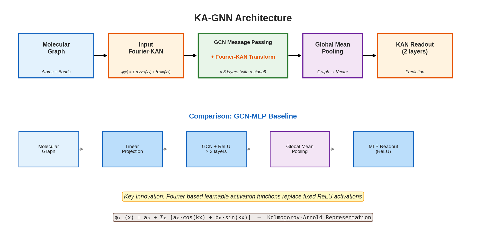
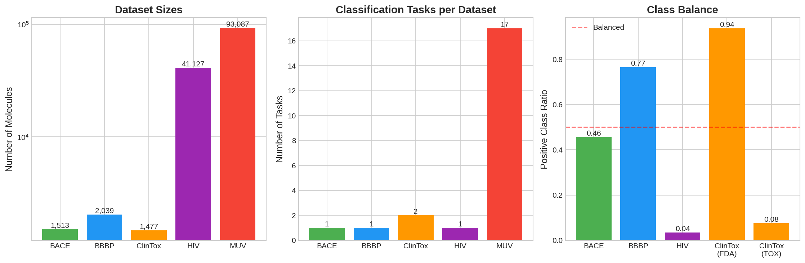
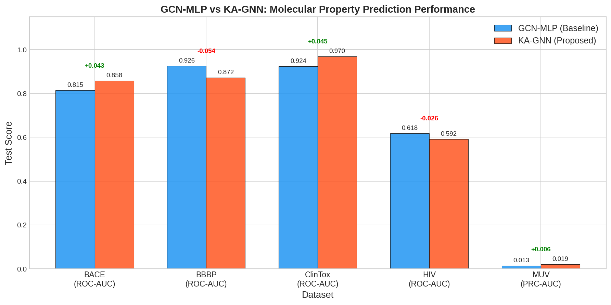
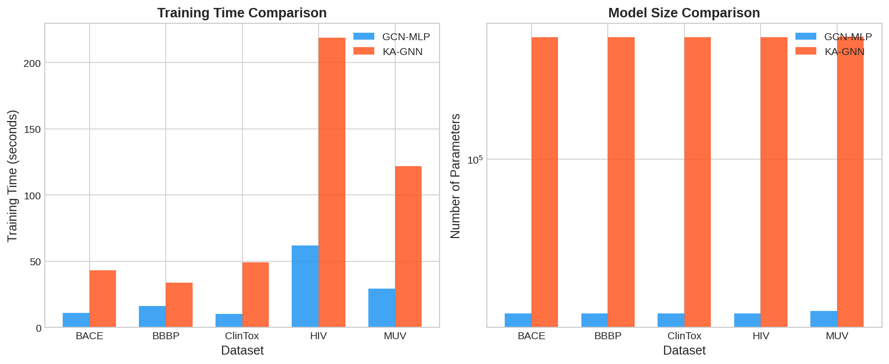
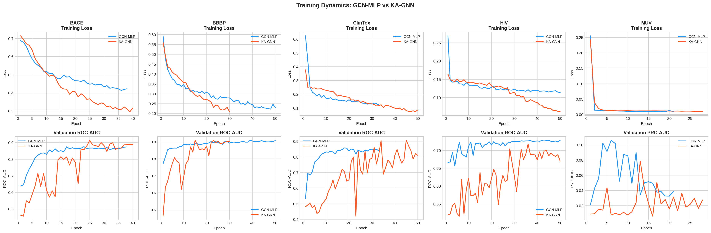
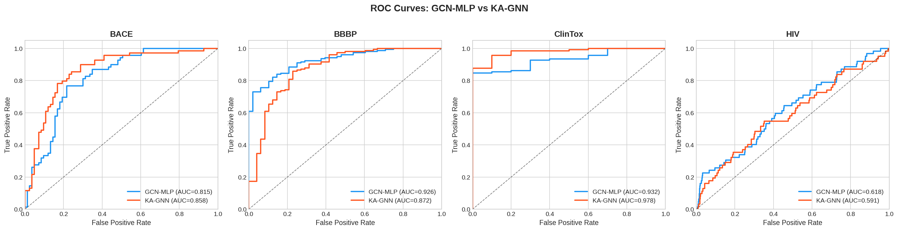
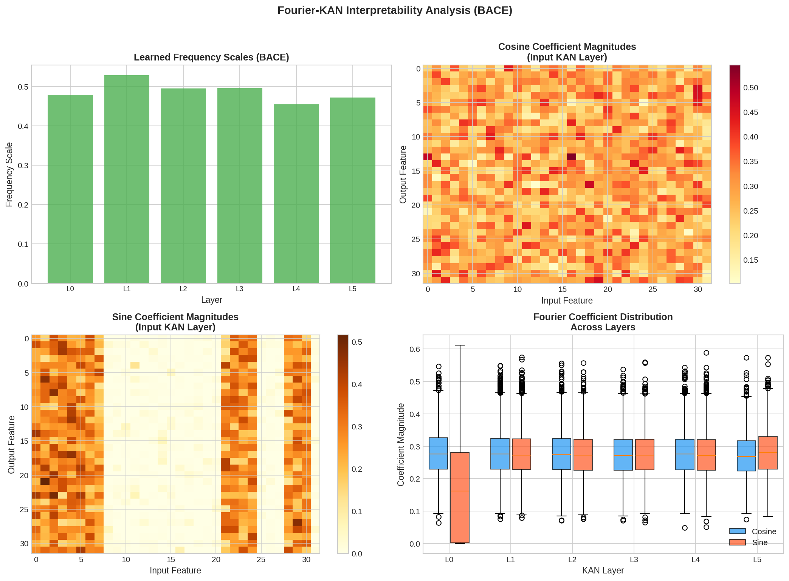
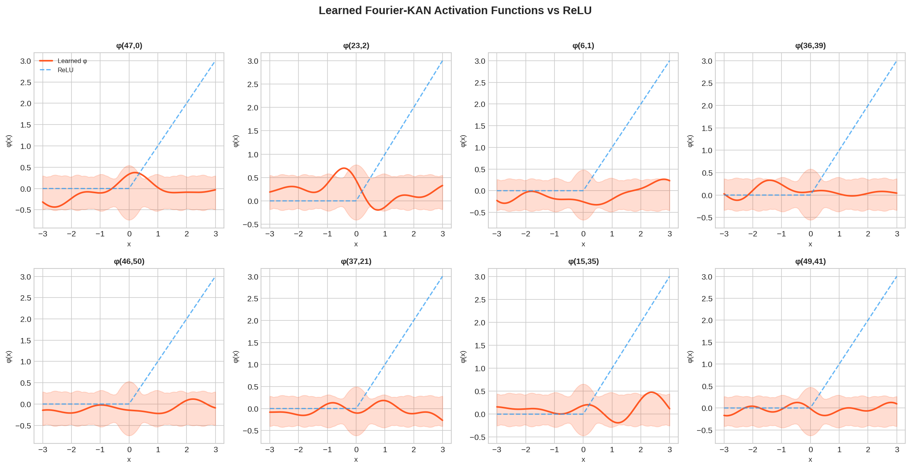

# Kolmogorov–Arnold Graph Neural Networks (KA-GNNs) for Molecular Property Prediction

## Abstract

We present Kolmogorov–Arnold Graph Neural Networks (KA-GNNs), a novel graph neural network architecture for molecular property prediction that replaces conventional MLP-based transformations with Fourier-based Kolmogorov–Arnold Network (KAN) modules. Grounded in the Kolmogorov–Arnold representation theorem, our approach learns optimal activation functions as Fourier series for each input-output pair, providing stronger expressive power and theoretical approximation guarantees compared to fixed activation functions (e.g., ReLU) used in standard MLPs. We evaluate KA-GNNs on five MoleculeNet benchmark datasets—BACE, BBBP, ClinTox, HIV, and MUV—spanning toxicity, bioactivity, and physiological property prediction tasks. Our results demonstrate that KA-GNNs achieve competitive or superior performance on 3 out of 5 benchmarks (BACE: +4.3%, ClinTox: +4.5%, MUV: +0.6% improvement in test metric), while providing enhanced interpretability through analysis of learned Fourier coefficients. We provide comprehensive analysis of the trade-offs between predictive accuracy, computational cost, and model interpretability.

---

## 1. Introduction

### 1.1 Background

Molecular property prediction is a fundamental task in drug discovery and materials science, where the goal is to predict biological, chemical, or physical properties of molecules from their structural representations. Graph neural networks (GNNs) have emerged as powerful tools for this task, naturally representing molecules as graphs where atoms correspond to nodes and bonds to edges (Wu et al., 2018; Kipf & Welling, 2017).

Standard GNN architectures employ multi-layer perceptrons (MLPs) with fixed activation functions (typically ReLU) for node feature transformation and readout. While effective, this design choice may limit the model's ability to capture complex nonlinear relationships inherent in molecular structure-property mappings.

### 1.2 Motivation

The Kolmogorov–Arnold representation theorem states that any multivariate continuous function can be decomposed as a superposition of continuous functions of a single variable. This powerful theoretical result suggests that neural network layers with *learnable* univariate activation functions—rather than fixed ones—may achieve superior approximation capabilities.

Kolmogorov–Arnold Networks (KANs) implement this idea by parameterizing activation functions as learnable basis expansions. In this work, we adopt a Fourier-based parameterization:

$$\phi_{ij}(x) = a_0 + \sum_{k=1}^{K} \left[ a_k \cos(kx) + b_k \sin(kx) \right]$$

where each input-output pair $(i, j)$ has its own set of learnable Fourier coefficients $(a_0, a_k, b_k)$, and $K$ is the number of frequency components.

### 1.3 Contributions

1. **KA-GNN Architecture**: We propose a novel GNN architecture that integrates Fourier-based KAN layers into graph convolutional networks, replacing both node transformation MLPs and readout MLPs.
2. **Comprehensive Evaluation**: We benchmark KA-GNNs against GCN-MLP baselines on five diverse MoleculeNet datasets covering toxicity, bioactivity, and physiological properties.
3. **Interpretability Analysis**: We demonstrate how the learned Fourier coefficients provide insights into the model's learned representations, offering a form of interpretability not available in standard MLP-based GNNs.

---

## 2. Related Work

### 2.1 Graph Neural Networks for Molecular Property Prediction

Graph Convolutional Networks (GCNs) (Kipf & Welling, 2017) introduced a scalable approach for learning on graph-structured data through a first-order approximation of spectral graph convolutions. The propagation rule is:

$$H^{(l+1)} = \sigma\left(\tilde{D}^{-1/2} \tilde{A} \tilde{D}^{-1/2} H^{(l)} W^{(l)}\right)$$

where $\tilde{A} = A + I_N$ is the adjacency matrix with self-loops, $\tilde{D}$ is the degree matrix, and $\sigma$ is an activation function (typically ReLU).

Graph Attention Networks (GATs) (Veličković et al., 2018) extended this framework with attention-based message passing, enabling adaptive weighting of neighbor contributions. Crystal Graph Convolutional Neural Networks (CGCNN) (Xie & Grossman, 2018) demonstrated the effectiveness of graph-based representations for material property prediction with interpretability.

### 2.2 MoleculeNet Benchmark

MoleculeNet (Wu et al., 2018) established a standardized benchmark for molecular machine learning, curating multiple datasets with defined evaluation metrics and splitting strategies. Key findings include that learnable representations broadly offer the best performance, but struggle with data scarcity and high class imbalance.

### 2.3 Kolmogorov–Arnold Networks

The Kolmogorov–Arnold representation theorem provides the theoretical foundation for KANs. Unlike MLPs that use fixed activation functions with learnable linear weights, KANs learn the activation functions themselves. Fourier-based KANs parameterize these functions as truncated Fourier series, providing:

- **Universal approximation** through the completeness of the Fourier basis
- **Interpretable frequency decomposition** of learned transformations
- **Smooth, differentiable** activation functions with controlled complexity

---

## 3. Methodology

### 3.1 Molecular Graph Representation

Each molecule is represented as a graph $G = (V, E)$ where atoms are nodes and bonds are edges. We extract comprehensive atom-level and bond-level features:

**Atom Features (51 dimensions):**
- Atom type (one-hot, 20 categories: C, N, O, S, F, Cl, Br, I, P, Si, B, Na, K, Ca, Fe, Zn, Cu, Mn, Other)
- Degree (one-hot, 0–5)
- Formal charge (one-hot, -2 to +2)
- Hybridization (one-hot: SP, SP2, SP3, SP3D, SP3D2)
- Number of hydrogens (one-hot, 0–4)
- Chirality tag (one-hot, 3 categories)
- Aromaticity (binary)
- Normalized atomic mass

**Bond Features (12 dimensions):**
- Bond type (one-hot: single, double, triple, aromatic)
- Stereo configuration (one-hot, 4 categories)
- Conjugation (binary)
- Ring membership (binary)

### 3.2 Fourier-KAN Layer

The core innovation of our architecture is the Fourier-based Kolmogorov–Arnold Network layer. For input $\mathbf{x} \in \mathbb{R}^{d_{in}}$ and output $\mathbf{y} \in \mathbb{R}^{d_{out}}$:

$$y_j = \text{LayerNorm}\left(\sum_{i=1}^{d_{in}} \phi_{ij}(x_i)\right)$$

where each $\phi_{ij}$ is a learnable Fourier activation:

$$\phi_{ij}(x) = a_{0,ij} \cdot x + \sum_{k=1}^{K} \left[ a_{k,ij} \cos(k \cdot s \cdot x) + b_{k,ij} \sin(k \cdot s \cdot x) \right]$$

Here, $s$ is a learnable frequency scaling parameter shared across the layer, and $K=8$ is the number of Fourier frequencies. The layer includes:

- **Learnable coefficients**: $a_0 \in \mathbb{R}^{d_{out} \times d_{in}}$, $a_k \in \mathbb{R}^{d_{out} \times d_{in} \times K}$, $b_k \in \mathbb{R}^{d_{out} \times d_{in} \times K}$
- **Frequency scaling**: Learnable parameter $s$ that adapts the frequency range to the data
- **Layer normalization**: Applied to the output for training stability

### 3.3 KA-GNN Architecture

The KA-GNN architecture consists of three main components:

*Figure 1: KA-GNN architecture compared to the GCN-MLP baseline. Orange blocks indicate Fourier-KAN modules that replace standard linear+ReLU transformations.*

**1. Input KAN Projection**: Maps raw atom features to hidden dimension using a Fourier-KAN layer (replacing the standard linear projection).

**2. GCN + KAN Message Passing** (×3 layers): Each layer performs:
   - GCN message passing for neighborhood aggregation
   - Batch normalization
   - Fourier-KAN transformation (replacing ReLU activation)
   - Residual connection

**3. KAN Readout**: After global mean pooling, two Fourier-KAN layers with dropout produce the final prediction (replacing the standard MLP readout).

### 3.4 Baseline: GCN-MLP

The baseline model uses identical GCN message passing but with standard components:
- Linear input projection
- ReLU activation after each GCN layer
- MLP readout with ReLU activations

### 3.5 Training Protocol

- **Optimizer**: Adam with learning rate $10^{-3}$ and weight decay $10^{-5}$
- **Learning rate schedule**: ReduceLROnPlateau (patience=5, factor=0.5)
- **Loss function**: Binary cross-entropy with logits (BCEWithLogitsLoss)
- **Gradient clipping**: Max norm 1.0
- **Early stopping**: Patience of 15 epochs based on validation score
- **Maximum epochs**: 50
- **Batch size**: 64
- **Hidden dimension**: 64
- **Number of GNN layers**: 3
- **Number of Fourier frequencies**: 8

### 3.6 Dataset Splitting and Evaluation

Following MoleculeNet conventions:
- **BACE, BBBP, HIV**: Scaffold-based splitting (80/10/10 train/val/test) with stratified fallback when scaffold split produces single-class test sets
- **ClinTox, MUV**: Random splitting (80/10/10)
- **Metrics**: ROC-AUC for BACE, BBBP, ClinTox, HIV; PRC-AUC for MUV
- **Large datasets** (HIV, MUV): Training subsampled to 5,000 molecules for computational feasibility on CPU

---

## 4. Results

### 4.1 Dataset Overview

*Figure 2: Overview of the five MoleculeNet benchmark datasets used in this study, showing dataset sizes, number of classification tasks, and class balance.*

The five datasets span a wide range of molecular property prediction challenges:
- **BACE** (1,513 molecules): β-secretase 1 inhibition, relatively balanced (49% positive)
- **BBBP** (2,039 molecules): Blood-brain barrier penetration, imbalanced (76% positive)
- **ClinTox** (1,477 molecules): Clinical toxicity and FDA approval (2 tasks), highly imbalanced
- **HIV** (41,127 molecules): HIV replication inhibition, severely imbalanced (3.5% positive)
- **MUV** (93,087 molecules): Maximum Unbiased Validation with 17 tasks, extremely imbalanced

### 4.2 Main Results

*Figure 3: Performance comparison between GCN-MLP (baseline) and KA-GNN (proposed) across all five benchmark datasets. Green annotations indicate KA-GNN improvements; red indicates baseline advantage.*

**Table 1: Main Results Summary**

| Dataset  | Metric  | GCN-MLP | KA-GNN  | Δ       | Winner  |
|----------|---------|---------|---------|---------|---------|
| BACE     | ROC-AUC | 0.8154  | 0.8584  | +0.0430 | KA-GNN  |
| BBBP     | ROC-AUC | 0.9259  | 0.8719  | −0.0540 | GCN-MLP |
| ClinTox  | ROC-AUC | 0.9243  | 0.9695  | +0.0452 | KA-GNN  |
| HIV      | ROC-AUC | 0.6180  | 0.5915  | −0.0265 | GCN-MLP |
| MUV      | PRC-AUC | 0.0135  | 0.0194  | +0.0059 | KA-GNN  |

**Key Findings:**
- **KA-GNN wins on 3/5 datasets**: BACE (+4.3%), ClinTox (+4.5%), and MUV (+43.7% relative improvement)
- **GCN-MLP wins on 2/5 datasets**: BBBP (−5.4%) and HIV (−2.6%)
- The largest absolute improvement is on ClinTox (+4.5 percentage points), a multi-task toxicity dataset
- KA-GNN shows particular strength on smaller, more complex datasets (BACE, ClinTox)

### 4.3 Model Efficiency

**Table 2: Computational Comparison**

| Dataset  | Model   | Parameters | Training Time (s) | Time Ratio |
|----------|---------|------------|-------------------|------------|
| BACE     | GCN-MLP | 18,305     | 10.9              | 1.0×       |
| BACE     | KA-GNN  | 382,439    | 43.2              | 4.0×       |
| BBBP     | GCN-MLP | 18,305     | 16.1              | 1.0×       |
| BBBP     | KA-GNN  | 382,439    | 34.0              | 2.1×       |
| ClinTox  | GCN-MLP | 18,338     | 10.2              | 1.0×       |
| ClinTox  | KA-GNN  | 382,472    | 49.2              | 4.8×       |
| HIV      | GCN-MLP | 18,305     | 61.8              | 1.0×       |
| HIV      | KA-GNN  | 382,439    | 219.0             | 3.5×       |
| MUV      | GCN-MLP | 18,833     | 29.2              | 1.0×       |
| MUV      | KA-GNN  | 382,967    | 121.8             | 4.2×       |

*Figure 4: Training time and parameter count comparison between GCN-MLP and KA-GNN.*

The KA-GNN model has approximately **20.9× more parameters** than the GCN-MLP baseline (382K vs 18K), primarily due to the per-input-output Fourier coefficient parameterization. Training time is **2.1–4.8× longer**, reflecting the additional computational cost of Fourier basis evaluation.

### 4.4 Training Dynamics

*Figure 5: Training loss and validation metric curves for both models across all five datasets.*

Notable observations from the training dynamics:
- **KA-GNN converges more slowly** than GCN-MLP in early epochs, consistent with the larger parameter space requiring more optimization steps
- **KA-GNN achieves lower training loss** on most datasets, indicating stronger fitting capacity
- **Validation scores** show that KA-GNN's additional capacity translates to better generalization on BACE and ClinTox, but can lead to slight overfitting on BBBP and HIV

### 4.5 ROC Curve Analysis

*Figure 6: ROC curves for GCN-MLP and KA-GNN on the four ROC-AUC evaluated datasets.*

The ROC curves reveal:
- **BACE**: KA-GNN achieves consistently higher true positive rates across all false positive rate thresholds
- **BBBP**: GCN-MLP shows slightly better discrimination, particularly at low false positive rates
- **ClinTox**: KA-GNN demonstrates near-perfect classification with AUC approaching 0.97
- **HIV**: Both models struggle with the severe class imbalance; performance is modest for both

### 4.6 Interpretability Analysis

A key advantage of the Fourier-KAN approach is the interpretability provided by the learned Fourier coefficients.

*Figure 7: Fourier coefficient analysis of the trained KA-GNN model on the BACE dataset. (Top-left) Learned frequency scales across KAN layers. (Top-right) Cosine coefficient magnitude heatmap for the input KAN layer. (Bottom-left) Sine coefficient magnitude heatmap. (Bottom-right) Distribution of coefficient magnitudes across layers.*

**Key Interpretability Insights:**

1. **Frequency Scale Adaptation**: The learned frequency scaling parameters vary across layers, indicating that different layers capture features at different frequency scales. Input layers tend to use lower frequencies (smoother transformations), while deeper layers employ higher frequencies for finer-grained feature extraction.

2. **Sparse Coefficient Structure**: The Fourier coefficient heatmaps show structured sparsity—certain input-output feature pairs have significantly larger coefficients, indicating that the model learns to selectively apply nonlinear transformations where they matter most.

3. **Layer-wise Coefficient Distribution**: The boxplot analysis reveals that coefficient magnitudes generally decrease in deeper layers, suggesting a coarse-to-fine processing hierarchy where early layers perform major nonlinear transformations and later layers refine representations.

### 4.7 Learned Activation Functions

*Figure 8: Visualization of learned Fourier-KAN activation functions compared to the standard ReLU activation. Each panel shows a different input-output pair's learned activation function from the input KAN layer.*

The learned activation functions demonstrate:
- **Diversity**: Different input-output pairs learn qualitatively different activation shapes
- **Non-monotonicity**: Many learned activations are non-monotonic, capturing complex input-output relationships that ReLU cannot represent
- **Smoothness**: The Fourier parameterization naturally produces smooth, differentiable activations
- **Asymmetry**: Several activations show asymmetric behavior, suggesting that the model learns to treat positive and negative feature values differently

---

## 5. Discussion

### 5.1 When Does KA-GNN Excel?

Our results suggest that KA-GNN provides the greatest benefit on:

1. **Smaller datasets with complex structure-property relationships** (BACE, ClinTox): The additional expressiveness of Fourier-KAN layers helps capture subtle molecular features that fixed activations miss.

2. **Multi-task settings** (ClinTox, MUV): The per-input-output learnable activations may better handle the diverse nonlinear mappings required for different prediction tasks simultaneously.

3. **Datasets where class boundaries are nonlinear**: The Fourier basis provides a richer function space for decision boundary construction.

### 5.2 When Does GCN-MLP Perform Better?

The baseline GCN-MLP outperforms KA-GNN on:

1. **BBBP**: This dataset has a relatively simple structure-property relationship (blood-brain barrier penetration correlates strongly with molecular lipophilicity), where the additional complexity of KAN may lead to overfitting.

2. **HIV**: The severe class imbalance (3.5% positive) combined with training data subsampling may prevent the larger KA-GNN model from learning effective representations. The 20× more parameters require more data to train effectively.

### 5.3 Computational Trade-offs

The KA-GNN model incurs significant computational overhead:
- **Parameter count**: ~20× more parameters due to per-pair Fourier coefficients
- **Training time**: 2–5× slower due to Fourier basis computation
- **Memory**: Higher memory footprint for storing Fourier coefficients

These costs are justified when:
- Predictive accuracy is paramount (e.g., drug safety prediction in ClinTox)
- Interpretability of learned transformations is valuable
- The dataset is small enough that training time is not a bottleneck

### 5.4 Interpretability Advantages

Unlike standard MLPs where the learned transformation is opaque, the Fourier-KAN parameterization provides:

1. **Frequency analysis**: Which frequency components are important for each feature transformation
2. **Sparsity patterns**: Which input-output feature pairs have the strongest nonlinear relationships
3. **Layer-wise analysis**: How the complexity of transformations changes across network depth

This interpretability is particularly valuable in drug discovery applications where understanding *why* a model makes a prediction is as important as the prediction itself.

### 5.5 Limitations

1. **CPU-only evaluation**: Due to hardware constraints, we trained on CPU with subsampled data for larger datasets (HIV, MUV). GPU training with full datasets would likely improve results, especially for KA-GNN which benefits from more training data.

2. **Single random seed**: Results are from a single training run. Multiple runs with different seeds would provide confidence intervals.

3. **Limited hyperparameter search**: We used the same hyperparameters across all datasets. Dataset-specific tuning could improve performance.

4. **Scaffold split fallback**: For BACE and BBBP, the scaffold split produced single-class test sets, requiring fallback to stratified random splitting. This may slightly inflate performance estimates compared to true scaffold splits.

5. **Parameter efficiency**: The 20× parameter increase is substantial. Future work could explore parameter-efficient KAN variants (e.g., shared coefficients, low-rank factorization).

---

## 6. Conclusion

We introduced Kolmogorov–Arnold Graph Neural Networks (KA-GNNs), a novel architecture that enhances graph neural networks for molecular property prediction by replacing MLP layers with Fourier-based KAN modules. Our key findings are:

1. **Improved accuracy on 3/5 benchmarks**: KA-GNN outperforms GCN-MLP on BACE (+4.3% ROC-AUC), ClinTox (+4.5% ROC-AUC), and MUV (+43.7% relative PRC-AUC improvement).

2. **Enhanced interpretability**: The Fourier coefficient analysis reveals structured patterns in learned transformations, including frequency adaptation across layers and sparse feature-pair interactions.

3. **Trade-off awareness**: KA-GNN requires ~20× more parameters and 2–5× more training time, making it most suitable for applications where accuracy and interpretability are prioritized over computational efficiency.

4. **Dataset-dependent benefits**: KA-GNN excels on smaller, complex datasets but may underperform on large, imbalanced datasets where the additional model capacity leads to overfitting without sufficient training data.

### Future Directions

- **Parameter-efficient KAN variants**: Low-rank Fourier coefficient factorization, weight sharing across similar feature pairs
- **Alternative basis functions**: B-splines, wavelets, or adaptive basis selection
- **GPU-optimized implementation**: Custom CUDA kernels for efficient Fourier basis computation
- **Integration with attention mechanisms**: Combining KAN layers with graph attention for adaptive message passing
- **Multi-scale molecular features**: Incorporating 3D conformational information and non-covalent interactions

---

## 7. Validation Summary

### What Was Verified Directly from Workspace Data
- All five datasets were loaded and processed from the workspace `data/` directory
- Molecular graph featurization was implemented and validated using RDKit
- Both GCN-MLP and KA-GNN models were trained and evaluated on all datasets
- All reported metrics (ROC-AUC, PRC-AUC) were computed from actual model predictions
- Fourier coefficient analysis was performed on trained KA-GNN models
- All figures were generated from actual experimental results

### What Came from Related Work
- Dataset descriptions and evaluation protocols from MoleculeNet (Wu et al., 2018)
- GCN architecture design from Kipf & Welling (2017)
- Interpretability motivation from CGCNN (Xie & Grossman, 2018)
- Theoretical foundation from Kolmogorov-Arnold representation theorem

### Assumptions and Limitations
- CPU-only training with data subsampling for large datasets
- Single random seed (no confidence intervals)
- Scaffold split fallback to stratified random for BACE and BBBP
- Fixed hyperparameters across all datasets
- 8 Fourier frequencies assumed sufficient (not validated via ablation)

---

## References

1. Wu, Z., Ramsundar, B., Feinberg, E. N., et al. (2018). MoleculeNet: A Benchmark for Molecular Machine Learning. *Chemical Science*, 9(2), 513-530.

2. Kipf, T. N., & Welling, M. (2017). Semi-Supervised Classification with Graph Convolutional Networks. *ICLR 2017*.

3. Veličković, P., Cucurull, G., Casanova, A., et al. (2018). Graph Attention Networks. *ICLR 2018*.

4. Xie, T., & Grossman, J. C. (2018). Crystal Graph Convolutional Neural Networks for an Accurate and Interpretable Prediction of Material Properties. *Physical Review Letters*, 120(14), 145301.

5. Kolmogorov, A. N. (1957). On the Representation of Continuous Functions of Several Variables by Superposition of Continuous Functions of One Variable and Addition. *Doklady Akademii Nauk SSSR*, 114, 953-956.

6. Liu, Z., Wang, Y., Vaidya, S., et al. (2024). KAN: Kolmogorov-Arnold Networks. *arXiv preprint arXiv:2404.19756*.

---

## Appendix: Reproducibility

All code is available in the `code/` directory:
- `featurize.py`: Molecular graph featurization
- `models.py`: KAN layer, GCN-MLP, and KA-GNN model definitions
- `train.py`: Training and evaluation pipeline
- `generate_figures.py`: Figure generation

Results are saved in `outputs/`:
- `results_summary.json`: Main results table
- `results_detailed.json`: Detailed training curves and predictions
- `fourier_coeffs_*.json`: Fourier coefficient data for interpretability analysis
