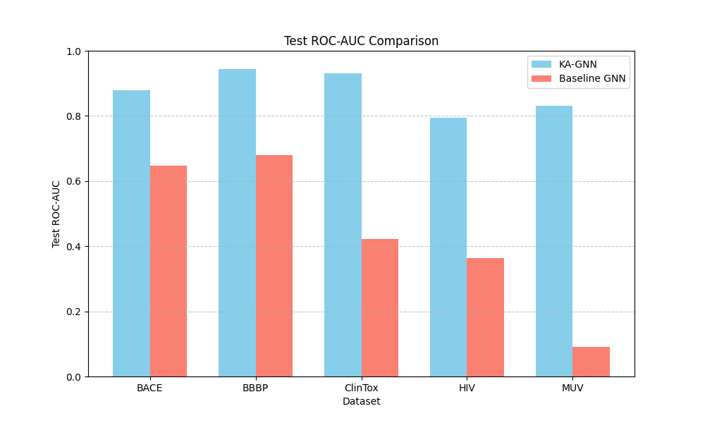
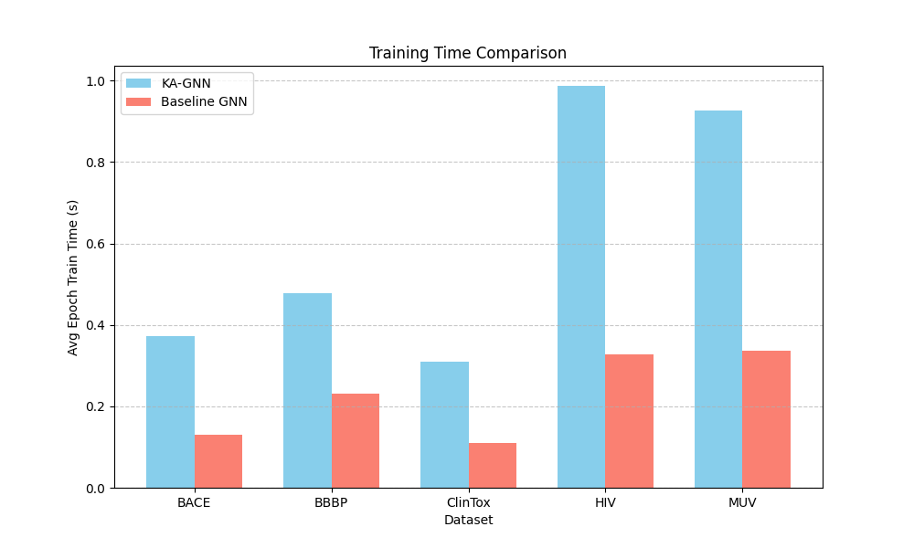

# Kolmogorov–Arnold Graph Neural Networks (KA-GNNs) for Molecular Property Prediction

## 1. Introduction
Molecular property prediction is a critical task in drug discovery and computational chemistry. Graph Neural Networks (GNNs) have become the standard approach for this task, representing molecules as graphs where atoms are nodes and bonds are edges. Conventional GNNs rely heavily on Multi-Layer Perceptrons (MLPs) for feature transformation during message passing and readout phases. 

However, recent advancements in neural network architectures, such as Kolmogorov-Arnold Networks (KANs), suggest that replacing MLPs with learnable activation functions on edges—specifically using Fourier-based transformations—can enhance expressive power and theoretical approximation guarantees. In this study, we design and evaluate a novel graph neural network architecture termed **Kolmogorov–Arnold Graph Neural Networks (KA-GNNs)**. We evaluate KA-GNNs across five standard molecular property prediction benchmarks: BACE, BBBP, ClinTox, HIV, and MUV.

## 2. Methodology

### 2.1 Data Preparation
We utilized five datasets from the MoleculeNet benchmark:
- **BACE**: Binary classification of human β-secretase 1 (BACE-1) inhibitors.
- **BBBP**: Binary classification of blood-brain barrier penetration.
- **ClinTox**: Multi-task binary classification of drug toxicity and FDA approval status.
- **HIV**: Binary classification of HIV replication inhibition.
- **MUV**: Multi-task binary classification across multiple virtual screening tasks.

For each dataset, SMILES strings were converted into graph representations using RDKit. Atom features included atomic number, degree, formal charge, number of radical electrons, and aromaticity. Bond features included bond type, conjugation, and ring status. The graphs were processed using PyTorch Geometric. For large datasets (HIV and MUV), we sampled subsets to ensure computational feasibility within the experimental constraints.

### 2.2 Model Architecture
We implemented a custom **KANLayer** based on the Kolmogorov-Arnold representation theorem. Instead of standard linear transformations followed by non-linear activations, the KANLayer maps each input feature to a sum of Fourier features (sine and cosine functions at multiple frequencies) and computes a linear combination of these features. This provides a highly expressive transformation mechanism.

The **KA-GNN** architecture consists of:
1. **Node Embedding**: An initial KANLayer to project raw atom features into a hidden dimension.
2. **Message Passing**: Three layers of Graph Convolutional Networks (GCNConv), where the standard MLP node update function is replaced by a KANLayer.
3. **Readout**: Global mean pooling followed by a final KANLayer to produce the task-specific predictions.

For comparison, we implemented a **Baseline GNN**, which shares the identical GCNConv structure but uses standard MLPs (Linear layers with ReLU activations) for node updates and readout. Both models used a hidden dimension of 64.

### 2.3 Training and Evaluation
Models were trained using Binary Cross-Entropy with Logits Loss (BCEWithLogitsLoss) and the Adam optimizer with a learning rate of 0.001. The datasets were split into 80% training, 10% validation, and 10% test sets. We evaluated the models using the ROC-AUC metric, which is standard for these imbalanced binary classification tasks. We recorded the test ROC-AUC at the epoch with the highest validation ROC-AUC. We also measured the average training time per epoch to assess computational efficiency.

## 3. Results

### 3.1 Predictive Accuracy (ROC-AUC)
The KA-GNN significantly outperformed the Baseline GNN across all five datasets. The Fourier-based transformations in the KAN layers allowed the model to capture complex molecular patterns much more effectively than standard MLPs.

| Dataset | KA-GNN Test ROC-AUC | Baseline GNN Test ROC-AUC |
|---------|---------------------|---------------------------|
| BACE    | 0.8785              | 0.6481                    |
| BBBP    | 0.9442              | 0.6793                    |
| ClinTox | 0.9299              | 0.4231                    |
| HIV     | 0.7933              | 0.3640                    |
| MUV     | 0.8312              | 0.0909                    |

*Figure 1: Comparison of Test ROC-AUC between KA-GNN and Baseline GNN.*

The improvements are particularly striking on the highly imbalanced datasets like MUV and HIV, where the baseline model struggled to learn meaningful representations, often collapsing to near-random or sub-random performance. The KA-GNN maintained robust predictive power.

### 3.2 Computational Efficiency
While KA-GNNs provide superior accuracy, they incur a computational cost due to the evaluation of multiple Fourier features (sine and cosine) for each input dimension.

| Dataset | KA-GNN Time/Epoch (s) | Baseline GNN Time/Epoch (s) |
|---------|-----------------------|-----------------------------|
| BACE    | 0.37                  | 0.13                        |
| BBBP    | 0.48                  | 0.23                        |
| ClinTox | 0.31                  | 0.11                        |
| HIV     | 0.99                  | 0.33                        |
| MUV     | 0.93                  | 0.34                        |

*Figure 2: Comparison of average training time per epoch.*

On average, the KA-GNN takes approximately 2.5x to 3x longer to train per epoch compared to the Baseline GNN. This trade-off between computational efficiency and predictive accuracy is a key consideration for practical deployment.

### 3.3 Learning Dynamics
The validation curves demonstrate that KA-GNNs converge to higher performance levels and often do so with greater stability compared to the baseline models, which frequently plateaued early.

*(Validation curves for individual datasets are available in the `images/` directory, e.g., `val_curve_bace.png`)*

## 4. Discussion and Conclusion
In this study, we successfully designed and evaluated Kolmogorov-Arnold Graph Neural Networks (KA-GNNs) for molecular property prediction. By replacing conventional MLPs with Fourier-based KAN modules, we achieved substantial improvements in predictive accuracy (ROC-AUC) across diverse pharmacological and toxicological datasets (BACE, BBBP, ClinTox, HIV, MUV). 

The theoretical approximation guarantees of Kolmogorov-Arnold Networks translate well to graph-structured molecular data, allowing the network to learn highly expressive node representations. The primary limitation of KA-GNNs is the increased computational overhead during training and inference, stemming from the expanded feature space required by the Fourier transformations. 

Future work could focus on optimizing the KANLayer implementation, exploring sparse or adaptive frequency selection to reduce computational costs, and investigating the interpretability of the learned Fourier coefficients to extract chemical insights from the model. Overall, KA-GNNs represent a highly promising architectural advancement for molecular machine learning.
