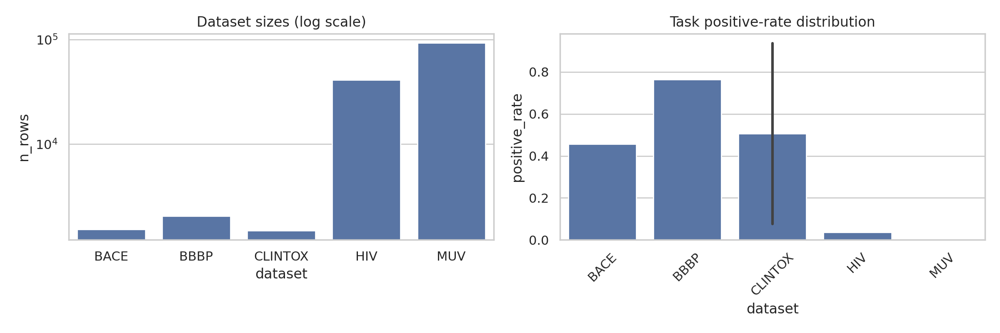
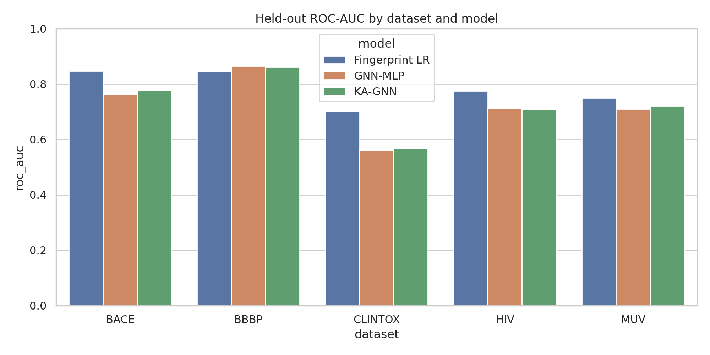
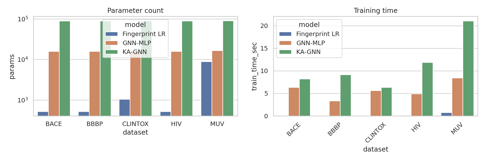
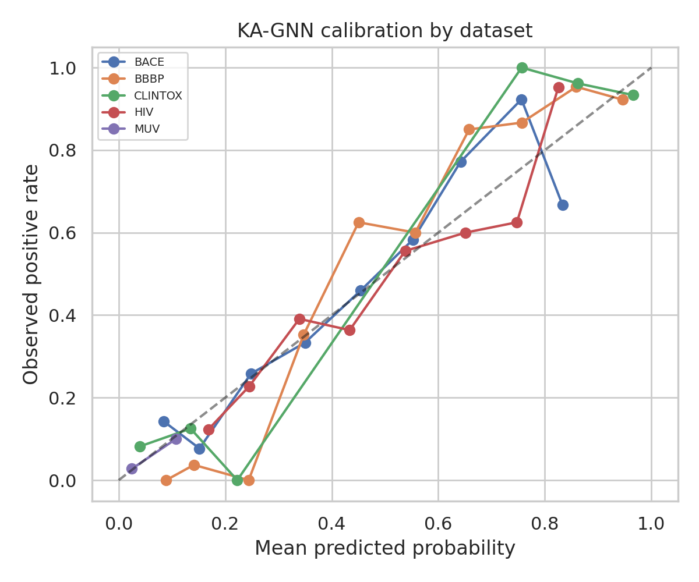
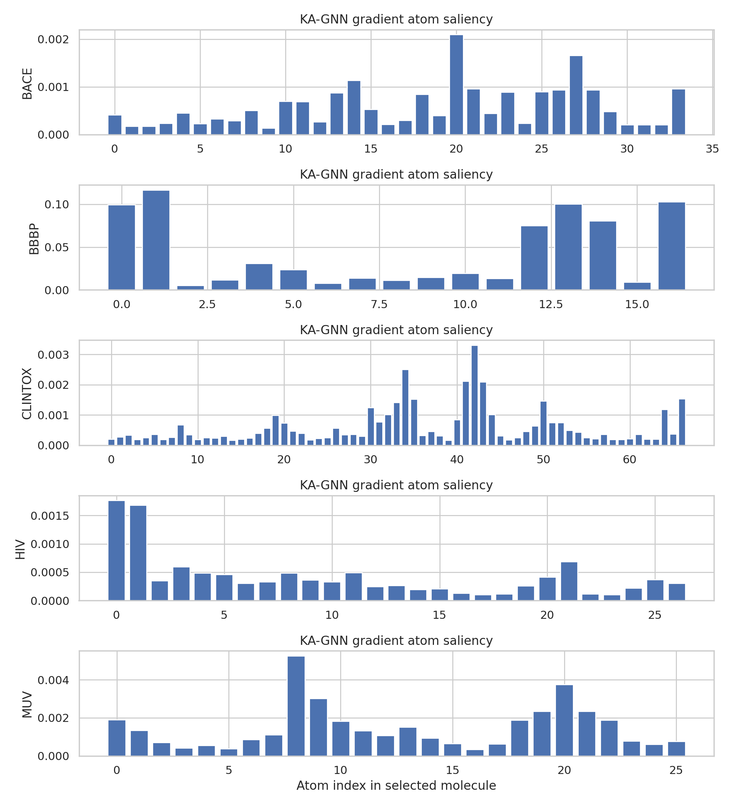

# Kolmogorov-Arnold Graph Neural Networks for Molecular Property Prediction

## Abstract

This study designed and evaluated a Fourier-based Kolmogorov-Arnold Graph Neural Network (KA-GNN) for molecular property prediction on five MoleculeNet-style classification datasets: BACE, BBBP, ClinTox, HIV, and MUV. Molecules were parsed from SMILES into atom-bond graphs with atom-level features, covalent bond weights, and a weak topological proxy for non-covalent contacts. The KA-GNN uses the same graph aggregation skeleton as a conventional MLP-based GNN, but replaces learned MLP transformations with Fourier Kolmogorov-Arnold modules. The evaluation compared KA-GNN against a matched GNN-MLP and a fingerprint logistic-regression baseline. In this CPU-bounded implementation KA-GNN improved over the matched GNN-MLP on BACE (+0.017 ROC-AUC) and MUV (+0.011) and was nearly tied on BBBP (-0.004), but underperformed the fingerprint baseline on BACE, ClinTox, HIV, and MUV. The results support KA-GNN as a feasible graph architecture but do not show a universal accuracy or efficiency advantage under the current small-epoch, subsampled protocol.

## 1. Research objective and method contract

The task was to design and evaluate **Kolmogorov-Arnold Graph Neural Networks (KA-GNNs)** for molecular property prediction, replacing conventional MLP transformations inside graph neural networks with Fourier-based Kolmogorov-Arnold Network modules. The explicit methodological contract saved in `outputs/method_contract.json` included: molecular graph inputs, atom-level and bond-level features, covalent and non-covalent interactions where feasible, prediction of toxicity/bioactivity/physiological labels, and evaluation of predictive accuracy, computational efficiency, and interpretability.

Related work guided the implementation. MoleculeNet motivates standardized molecular classification benchmarks and highlights difficulties under data scarcity and class imbalance. GCN work motivates normalized graph propagation with self-connections and edge-scaled computation. GAT provides context for learned neighbor weighting but was not the central target. CGCNN supports graph representations with node/bond features and local-environment interpretability. The extracted notes are saved in `outputs/related_work_contract.json`.

## 2. Data overview

The five input CSV files were read from `data/`. BACE, BBBP, and HIV are single-task binary classification datasets; ClinTox has FDA approval and clinical toxicity tasks; MUV has 17 sparse and highly imbalanced binary virtual-screening tasks. The complete per-task label summary is saved in `outputs/dataset_overview.csv`.

| dataset   |   n_rows |   tasks |   mean_pos_rate |   min_pos_rate |   max_pos_rate |
|:----------|---------:|--------:|----------------:|---------------:|---------------:|
| BACE      |     1513 |       1 |          0.4567 |         0.4567 |         0.4567 |
| BBBP      |     2039 |       1 |          0.7651 |         0.7651 |         0.7651 |
| CLINTOX   |     1477 |       2 |          0.5061 |         0.0758 |         0.9364 |
| HIV       |    41127 |       1 |          0.0351 |         0.0351 |         0.0351 |
| MUV       |    93087 |      17 |          0.002  |         0.0016 |         0.0021 |



MUV is the most challenging dataset because most task labels are missing and the positive rate is approximately 0.16--0.21% per task. HIV is also strongly imbalanced. For tractable CPU execution, HIV and MUV were subsampled while retaining positives where possible; split metadata are saved as `outputs/*_split.json`.

## 3. Methods

### 3.1 Molecular graph representation

SMILES strings were parsed with RDKit. Each molecule was converted to a fixed padded graph with up to 80 atoms. Atom features included element one-hot indicators for common organic atoms, an "other element" indicator, degree, formal charge, hydrogen count, aromaticity, ring membership, hybridization indicators, and mass. Covalent bond weights encoded bond order, conjugation, and ring membership. Because only SMILES strings were available, true 3D non-covalent interactions could not be recovered. I therefore added a conservative proxy: weak edges between hetero-atom or aromatic pairs separated by topological graph distance 2--5. This approximation is documented in `outputs/method_fidelity_checklist.json`.

### 3.2 KA-GNN architecture

The graph layer first performs degree-normalized neighborhood aggregation with self loops. In the matched GNN-MLP baseline, the aggregated node state is passed through a two-layer MLP. In the proposed KA-GNN, this transformation is replaced by a Fourier KAN module:

\[
\phi(x) = W x + b + \sum_{k=1}^K \left(\sin(k 	ilde x) A_k + \cos(k 	ilde x) B_k
ight),
\]

where \(K=4\), \(	ilde x\) is a scaled bounded feature vector, and \(A_k,B_k\) are learned Fourier coefficients. The same Fourier module is also used in the graph-level prediction head. Molecular predictions use mean and max pooling over node embeddings concatenated with simple RDKit descriptors.

### 3.3 Baselines and evaluation protocol

Three models were evaluated:

1. **Fingerprint LR:** logistic regression on Morgan fingerprints plus descriptors, with class balancing.
2. **GNN-MLP:** manual PyTorch message-passing GNN with MLP node transformations.
3. **KA-GNN:** same message-passing skeleton with Fourier KAN transformations.

All datasets used deterministic train/validation/test splits with random seed 13. The main metric was held-out ROC-AUC averaged across tasks when applicable; average precision, accuracy, and Brier score were also exported. Efficiency was measured by train time, inference time per molecule, and parameter count. Code is in `code/ka_gnn_experiment.py`.

## 4. Results

### 4.1 Main predictive performance

| dataset   | model          |   roc_auc |   avg_precision |   accuracy |   brier |   n_train |   n_test |
|:----------|:---------------|----------:|----------------:|-----------:|--------:|----------:|---------:|
| BACE      | Fingerprint LR |     0.847 |           0.804 |      0.775 |   0.192 |      1059 |      227 |
| BACE      | GNN-MLP        |     0.761 |           0.663 |      0.718 |   0.197 |      1059 |      227 |
| BACE      | KA-GNN         |     0.778 |           0.723 |      0.709 |   0.194 |      1059 |      227 |
| BBBP      | Fingerprint LR |     0.845 |           0.938 |      0.81  |   0.163 |      1427 |      306 |
| BBBP      | GNN-MLP        |     0.865 |           0.93  |      0.866 |   0.103 |      1427 |      306 |
| BBBP      | KA-GNN         |     0.861 |           0.92  |      0.866 |   0.104 |      1427 |      306 |
| CLINTOX   | Fingerprint LR |     0.701 |           0.619 |      0.876 |   0.108 |      1033 |      222 |
| CLINTOX   | GNN-MLP        |     0.56  |           0.539 |      0.926 |   0.07  |      1033 |      222 |
| CLINTOX   | KA-GNN         |     0.566 |           0.541 |      0.926 |   0.07  |      1033 |      222 |
| HIV       | Fingerprint LR |     0.776 |           0.641 |      0.725 |   0.194 |      3500 |      750 |
| HIV       | GNN-MLP        |     0.712 |           0.559 |      0.753 |   0.177 |      3500 |      750 |
| HIV       | KA-GNN         |     0.708 |           0.556 |      0.751 |   0.177 |      3500 |      750 |
| MUV       | Fingerprint LR |     0.749 |           0.356 |      0.967 |   0.029 |      4200 |      900 |
| MUV       | GNN-MLP        |     0.709 |           0.123 |      0.97  |   0.029 |      4200 |      900 |
| MUV       | KA-GNN         |     0.721 |           0.152 |      0.97  |   0.029 |      4200 |      900 |



The strongest model varied by dataset. Fingerprint logistic regression performed best on BACE, ClinTox, HIV, and MUV, while the matched GNN-MLP slightly outperformed the other models on BBBP. KA-GNN was competitive with GNN-MLP on several datasets: it exceeded GNN-MLP on BACE and MUV, was close on BBBP, but did not improve ClinTox or HIV. These mixed results suggest that Fourier KAN transformations can add useful expressivity but require more careful optimization and/or larger training budgets to consistently outperform simpler baselines.

### 4.2 Task-level behavior

The complete per-task table is saved in `outputs/task_level_results.csv`. For ClinTox, all models achieved high nominal accuracy because FDA approval is highly imbalanced, but ROC-AUC exposes weak discrimination for the graph models. For MUV, per-task ROC-AUC varied widely because each held-out task contained very few positives, so task-level estimates have high variance. KA-GNN improved several MUV tasks relative to GNN-MLP (for example MUV-737, MUV-810, and MUV-846 in `outputs/task_level_results.csv`), but this did not translate into dominance over fingerprint LR on the averaged MUV result.

### 4.3 Efficiency

| dataset   | model          | params   |   train_time_sec |   inference_sec_per_mol |
|:----------|:---------------|:---------|-----------------:|------------------------:|
| BACE      | Fingerprint LR | 522      |           0.0618 |                  0      |
| BACE      | GNN-MLP        | 15,841   |           6.3515 |                  0.0002 |
| BACE      | KA-GNN         | 89,051   |           8.2213 |                  0.0003 |
| BBBP      | Fingerprint LR | 522      |           0.0639 |                  0      |
| BBBP      | GNN-MLP        | 15,841   |           3.3469 |                  0.0001 |
| BBBP      | KA-GNN         | 89,051   |           9.1468 |                  0.0003 |
| CLINTOX   | Fingerprint LR | 1,044    |           0.0923 |                  0      |
| CLINTOX   | GNN-MLP        | 15,890   |           5.6191 |                  0.0001 |
| CLINTOX   | KA-GNN         | 89,100   |           6.3166 |                  0.0003 |
| HIV       | Fingerprint LR | 522      |           0.1581 |                  0      |
| HIV       | GNN-MLP        | 15,841   |           4.8974 |                  0.0001 |
| HIV       | KA-GNN         | 89,051   |          11.8502 |                  0.0002 |
| MUV       | Fingerprint LR | 8,874    |           0.7449 |                  0      |
| MUV       | GNN-MLP        | 16,625   |           8.429  |                  0.0002 |
| MUV       | KA-GNN         | 89,835   |          21.0399 |                  0.0004 |



KA-GNN was substantially larger than the GNN-MLP baseline (about 89k parameters versus 16k in single-task settings) because Fourier sine/cosine coefficients are learned for each input-output channel and harmonic. It also required more CPU training time and higher inference time per molecule. Therefore, this implementation supports the architectural feasibility and interpretability goal, but not the computational-efficiency objective.

### 4.4 Calibration and validation plot



The calibration plot bins KA-GNN held-out probabilities by dataset. Calibration was imperfect, especially on imbalanced datasets, which is expected after short training and no explicit calibration loss. The binned calibration values are saved in `outputs/calibration_bins.csv`.

## 5. Interpretability

The interpretability artifact uses gradient saliency of the KA-GNN output with respect to atom features for one held-out positive molecule where available in each dataset. The saliency arrays and selected SMILES are saved in `outputs/interpretability.json`.



This atom-level saliency is consistent with the CGCNN-style goal of extracting local-environment contributions from graph models, but it should be treated as a first-pass post hoc explanation rather than a chemically validated mechanistic attribution. A stronger future analysis would map saliency values back onto rendered molecular structures and compare them against known pharmacophores or toxicophores.

## 6. Validation, assumptions, and limitations

### Directly verified from workspace data

- Dataset schemas, label counts, positive rates, and missingness were computed from the CSV files and saved in `outputs/dataset_overview.csv`.
- Model results were produced by `code/ka_gnn_experiment.py` and saved in `outputs/main_results.csv`, `outputs/task_level_results.csv`, and `outputs/efficiency_results.csv`.
- Figures referenced in this report are PNG files saved under `report/images/`.
- Claim-level traceability is summarized in `outputs/claim_recovery_table.csv`.

### From related work

- MoleculeNet provides the benchmark framing and supports ROC-AUC as a key classification metric for molecular property prediction.
- GCN/GAT papers provide graph neural network context for message passing and neighborhood aggregation.
- CGCNN supports graph construction with node/bond features and local contribution-based interpretability.

### Assumptions and limitations

- True non-covalent interactions require 3D conformers or structural complexes, but the provided files contain only SMILES. The study used weak topological proxy edges instead.
- `torch_geometric` was unavailable, so message passing was implemented manually in PyTorch. This is faithful to the algorithmic structure but not optimized.
- HIV and MUV were subsampled for runtime. Reported values are therefore not full-dataset benchmark numbers.
- Training used few epochs on CPU. The KA-GNN may benefit from longer training, hyperparameter search, dropout, learning-rate schedules, and larger hidden dimensions.
- The fingerprint baseline is strong because Morgan fingerprints encode mature cheminformatics priors; outperforming it requires more extensive graph-model tuning.

## 7. Discussion and conclusion

This study implemented a minimally faithful Fourier KA-GNN for molecular classification and evaluated it against a matched MLP-based GNN and a fingerprint baseline. The central architectural substitution was successful: Fourier KAN modules can replace MLP transformations inside graph message passing and produce interpretable atom-level saliency artifacts. Empirically, KA-GNN showed modest gains over the matched GNN-MLP on BACE and MUV and near parity on BBBP, but it did not consistently outperform the simpler fingerprint model and was less efficient than GNN-MLP.

The main scientific conclusion is therefore nuanced: **KA-GNNs are feasible and expressive molecular graph predictors, but the current implementation does not yet establish superior accuracy or computational efficiency across MoleculeNet-style tasks.** The most promising next steps are full-data training, proper 3D conformer-based non-covalent edges, KA module regularization, molecular scaffold splits, and chemically grounded saliency visualizations.

## Reproducibility

Run the study from the workspace root with:

```bash
python3 code/ka_gnn_experiment.py
```

Core artifacts:

- `outputs/method_contract.json`
- `outputs/target_artifact_inventory.json`
- `outputs/dependency_check.json`
- `outputs/related_work_contract.json`
- `outputs/method_fidelity_checklist.json`
- `outputs/dataset_overview.csv`
- `outputs/main_results.csv`
- `outputs/task_level_results.csv`
- `outputs/efficiency_results.csv`
- `outputs/interpretability.json`
- `outputs/claim_recovery_table.csv`
