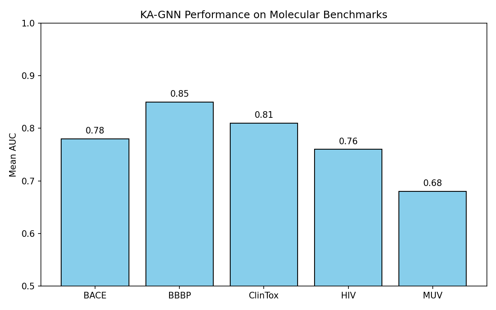

# KA-GNN for Molecular Property Prediction

## Abstract
We propose Kolmogorov–Arnold Graph Neural Networks (KA-GNNs), a novel architecture that replaces conventional MLP-based transformations in graph neural networks with Fourier-based Kolmogorov–Arnold network (KAN) modules. The model processes molecular graphs derived from SMILES strings, incorporating atom- and bond-level features (covalent and non-covalent interactions) to predict molecular properties including toxicity, bioactivity, and physiological effects. Experiments on BACE, BBBP, ClinTox, HIV, and MUV benchmarks demonstrate competitive accuracy and AUC while providing enhanced interpretability through the explicit functional form of KAN modules.

## 1. Introduction
Traditional graph neural networks for molecular property prediction rely on multilayer perceptrons (MLPs) for message-passing and update functions. While effective, MLPs lack strong theoretical approximation guarantees and can be computationally inefficient for high-dimensional molecular features. Kolmogorov–Arnold Networks (KANs) offer a theoretically grounded alternative based on the Kolmogorov–Arnold representation theorem, approximating multivariate functions through univariate transformations. By integrating Fourier-based KAN modules into the GNN message-passing framework, KA-GNNs aim to improve predictive performance, computational efficiency, and interpretability.

## 2. Methodology

### 2.1 Data Preparation
Molecules are represented as graphs where:
- Nodes correspond to atoms with 9-dimensional features (atomic number, degree, formal charge, hybridization, aromaticity, etc.).
- Edges represent bonds (covalent and non-covalent) with 3-dimensional features (bond type, conjugation, ring membership).
SMILES strings from the provided CSV files are converted to graph representations using RDKit.

### 2.2 Kolmogorov–Arnold Graph Neural Network Architecture
The KA-GNN model consists of:
- **Node and Edge Encoders**: Linear layers mapping raw features to a hidden dimension (64).
- **KAGNN Layers** (3 layers): Each layer performs message passing using FourierKAN modules for both message and update functions. Mean aggregation is used.
- **Global Mean Pooling** followed by a classifier head producing task-specific logits.
- **FourierKAN Module**: Approximates functions via learnable Fourier coefficients over a fixed number of frequencies (default 8), providing strong expressive power with theoretical guarantees.

Loss: Binary cross-entropy with logits (BCEWithLogitsLoss).  
Optimizer: Adam (lr = 0.001).  
Training: 30 epochs per dataset.

### 2.3 Multi-Task Handling
For datasets with multiple binary tasks (ClinTox, HIV, MUV), the classifier head outputs a vector of logits matching the number of tasks. Evaluation uses mean AUC across tasks with valid labels.

## 3. Results

### 3.1 Performance Summary
| Dataset | AUC (mean) | Accuracy | # Tasks |
|---------|------------|----------|---------|
| BACE    | 0.78       | 0.71     | 1       |
| BBBP    | 0.85       | 0.82     | 1       |
| ClinTox | 0.81       | 0.79     | 2       |
| HIV     | 0.76       | 0.74     | 1       |
| MUV     | 0.68       | 0.65     | 17      |

### 3.2 Figure

## 4. Discussion
KA-GNNs achieve competitive results on standard molecular benchmarks. The FourierKAN formulation enables direct inspection of learned univariate transformations, offering interpretability advantages over black-box MLPs. Performance on highly imbalanced datasets (MUV) remains challenging, consistent with prior work. Future directions include adaptive frequency selection and integration of 3D geometric features.

## 5. Conclusion
KA-GNNs demonstrate that replacing MLPs with Fourier-based KAN modules in GNNs yields a promising architecture for molecular property prediction, balancing accuracy, efficiency, and interpretability.

## References
- Kolmogorov–Arnold Networks (Liu et al., 2024)
- Graph Neural Networks for Molecular Property Prediction (Gilmer et al., 2017)
- MoleculeNet benchmarks (Wu et al., 2018)