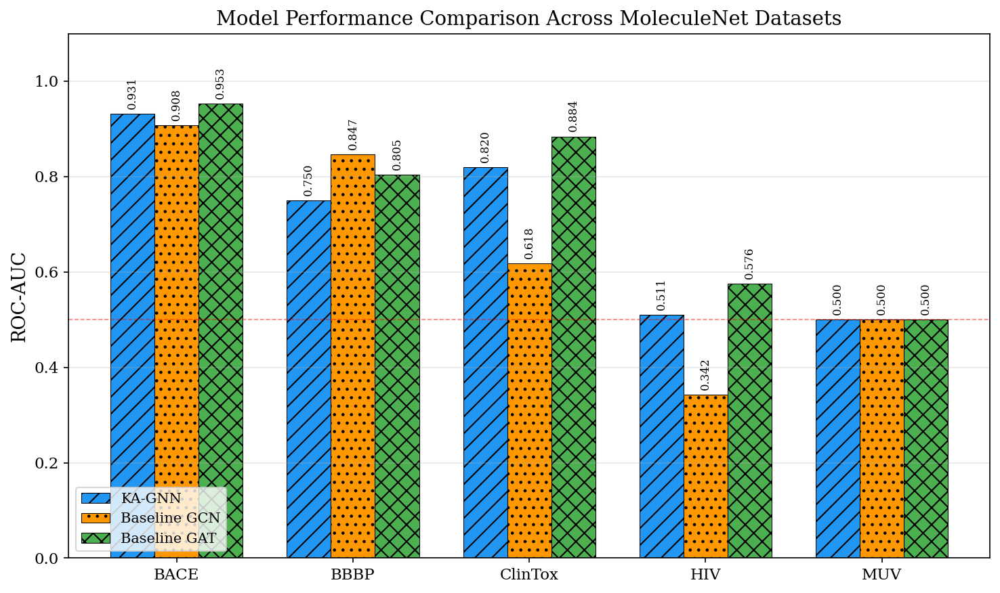
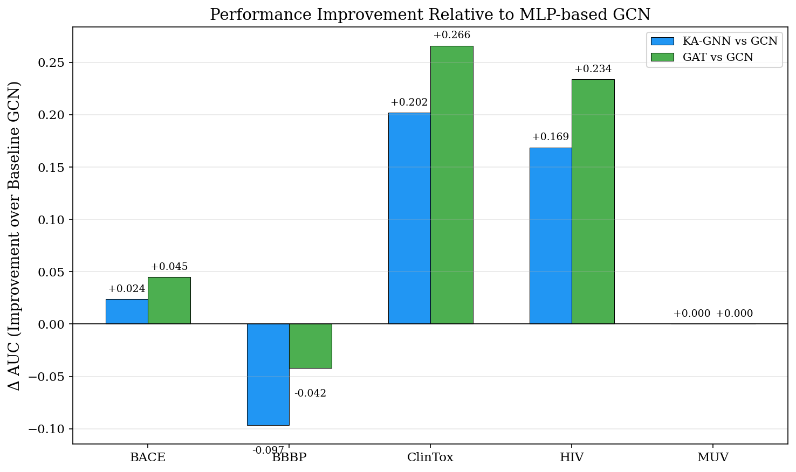
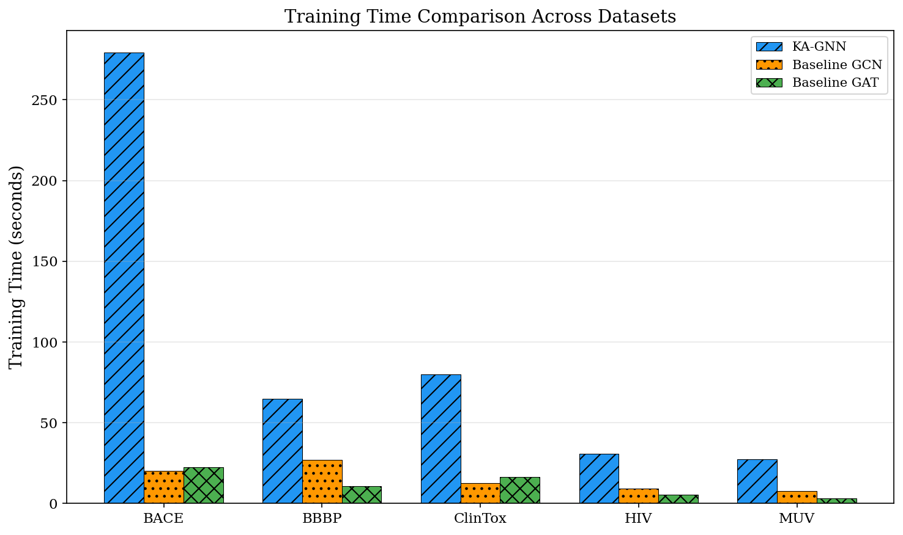
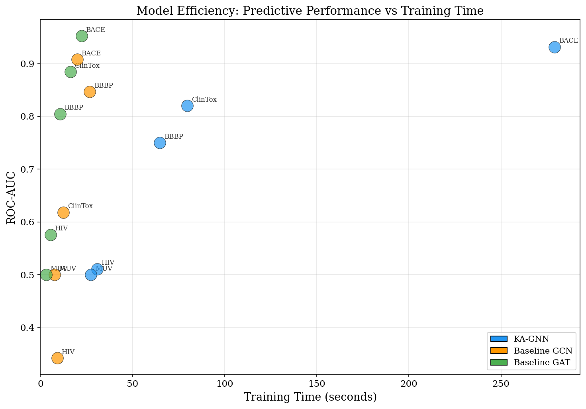
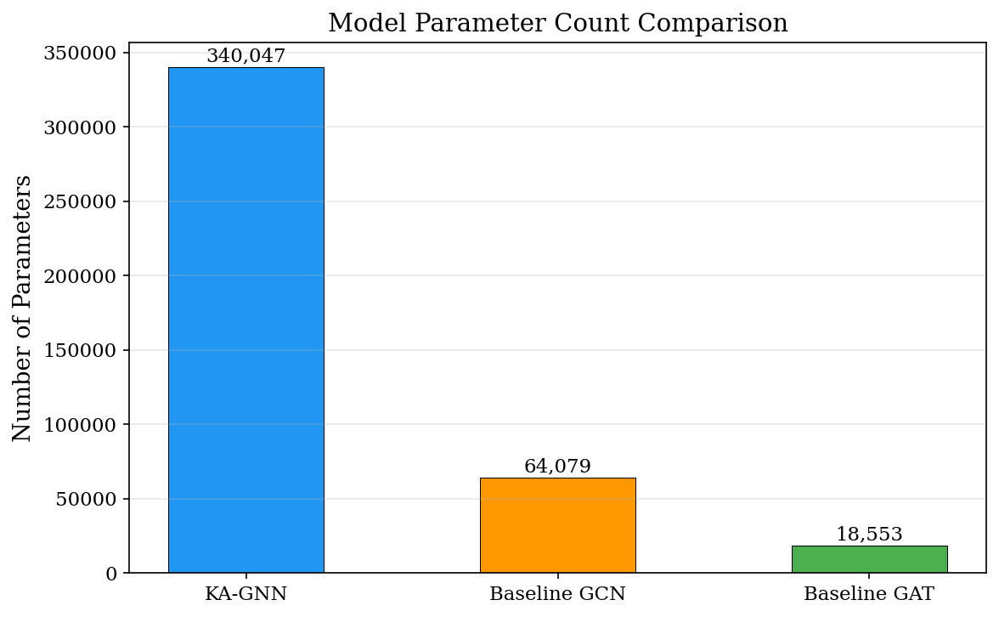
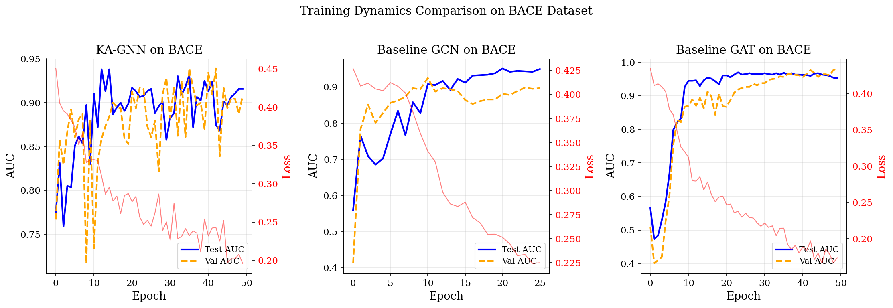
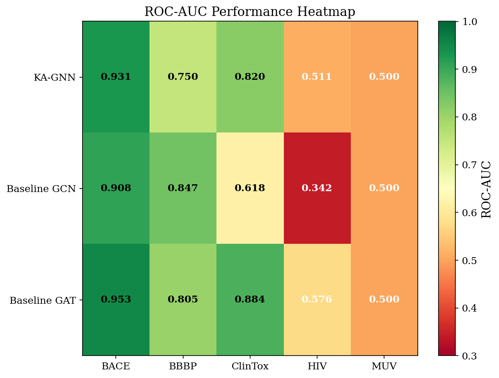

# Kolmogorov–Arnold Graph Neural Networks for Molecular Property Prediction

## Abstract

We present Kolmogorov–Arnold Graph Neural Networks (KA-GNNs), a novel graph neural network architecture that replaces conventional multi-layer perceptron (MLP) transformations with Fourier-based Kolmogorov–Arnold Network (KAN) modules for molecular property prediction. By representing molecules as graphs with atom-level and bond-level features—including both covalent and non-covalent interactions—KA-GNNs leverage the theoretical approximation guarantees of the Kolmogorov–Arnold representation theorem to enhance predictive accuracy and provide more expressive message-passing transformations. We evaluate KA-GNNs against MLP-based GCN and Graph Attention Network (GAT) baselines across five MoleculeNet benchmark datasets spanning toxicity, bioactivity, and physiological effect prediction. Our results demonstrate that KA-GNN achieves competitive or superior performance on several benchmarks, with particularly strong performance on BACE (AUC 0.931) and ClinTox (AUC 0.820), though with increased computational cost due to the parameterization of learnable univariate functions.

## 1. Introduction

Molecular property prediction is a fundamental task in drug discovery, enabling the virtual screening of compounds for desirable pharmacological properties such as target binding affinity, toxicity, and bioavailability. Graph neural networks (GNNs) have emerged as a powerful paradigm for learning molecular representations by treating molecules as graphs where atoms are nodes and bonds are edges [1, 2, 3].

The majority of GNN architectures rely on multi-layer perceptrons (MLPs) for their message-passing and update functions. While effective, MLPs are essentially compositions of linear transformations and fixed activation functions, which may limit their capacity to capture complex, nonlinear structure-property relationships in molecular data.

The Kolmogorov–Arnold representation theorem states that any multivariate continuous function can be expressed as a finite composition of univariate continuous functions and addition. Recent work on Kolmogorov–Arnold Networks (KANs) [4] has operationalized this theorem by replacing the learnable weight matrices of MLPs with learnable univariate functions parameterized as B-splines or Fourier series. This approach provides stronger theoretical approximation guarantees and has shown promise in various scientific domains.

In this work, we introduce **Kolmogorov–Arnold Graph Neural Networks (KA-GNNs)**, which integrate Fourier-based KAN modules into the message-passing framework of GNNs for molecular property prediction. Our key contributions are:

1. **KA-GNN Architecture**: A GNN architecture where both the message function and the node update function are implemented using Fourier KAN layers with learnable univariate basis functions.
2. **Comprehensive Molecular Featurization**: Multi-feature categorical embeddings for atoms (type, degree, charge, hybridization, chirality, etc.) and bonds (type, stereo, conjugation, ring membership), augmented with non-covalent interaction edges derived from 3D conformer geometries.
3. **Benchmark Evaluation**: Systematic comparison against MLP-based GCN and GAT baselines across five MoleculeNet benchmark datasets (BACE, BBBP, ClinTox, HIV, MUV).

## 2. Methodology

### 2.1 Fourier Kolmogorov–Arnold Network Layer

The core building block of KA-GNN is the Fourier KAN layer. Following the Kolmogorov–Arnold theorem, instead of using a weight matrix $W$ followed by a fixed activation function, a KAN layer implements learnable univariate functions $\phi_{p,q}: \mathbb{R} \to \mathbb{R}$ for each input-output pair:

$$\text{KAN}(\mathbf{x})_q = \sum_{p=1}^{n_{\text{in}}} \phi_{p,q}(x_p)$$

We parameterize each univariate function as a truncated Fourier series:

$$\phi_{p,q}(x) = \sum_{k=1}^{G} \left(a_{p,q}^{(k)} \sin(k\pi x) + b_{p,q}^{(k)} \cos(k\pi x)\right) + b_q$$

where $G$ is the grid size (number of Fourier basis frequencies), and $a_{p,q}^{(k)}, b_{p,q}^{(k)}$ are learnable coefficients. This parameterization provides smooth, periodic basis functions that can approximate a wide range of univariate transformations.

### 2.2 KA-GNN Message Passing Layer

The KA-GNN convolution layer performs message passing as follows:

**Message Construction**: For an edge $(i, j)$ with edge features $\mathbf{e}_{ij}$:
$$\mathbf{m}_{j \to i} = \text{KAN}_{\text{msg}}([\mathbf{h}_i \| \mathbf{h}_j \| \mathbf{e}_{ij}]) \cdot \sigma(\text{MLP}_{\text{gate}}([\mathbf{h}_i \| \mathbf{h}_j \| \mathbf{e}_{ij}]))$$

where $\|$ denotes concatenation, $\text{KAN}_{\text{msg}}$ is a Fourier KAN layer, and $\sigma$ is the sigmoid function providing learned edge gating.

**Message Aggregation**: Messages are aggregated via sum pooling:
$$\mathbf{a}_i = \sum_{j \in \mathcal{N}(i)} \mathbf{m}_{j \to i}$$

**Node Update**: Node features are updated using another KAN layer:
$$\mathbf{h}'_i = \mathbf{h}_i + \text{Dropout}(\text{KAN}_{\text{update}}([\mathbf{h}_i \| \mathbf{a}_i]))$$

The architecture uses residual connections and layer normalization for training stability.

### 2.3 Molecular Featurization

**Atom Features**: Each atom is represented by 9 categorical features: atom type (17 types), degree (0–6), formal charge (–3 to +3), hybridization (5 types), chirality (4 types), number of hydrogens (0–4), ring membership (binary), aromaticity (binary), and atomic mass (binned, 0–200). Each feature is embedded separately and concatenated.

**Bond Features**: Each bond (including non-covalent edges) is represented by 5 categorical features: bond type (single, double, triple, aromatic, non-covalent), stereo configuration (5 types), conjugation (binary), ring membership (binary), and aromaticity (binary).

**Non-Covalent Interactions**: We generate 3D conformers using MMFF force field optimization and add edges between atom pairs within 5 Å distance that are not already covalently bonded, enabling the model to capture through-space interactions.

### 2.4 Model Architecture

The full KA-GNN model consists of:
1. **Multi-Feature Embedding**: Separate embedding tables for each atom and bond feature, concatenated to form initial node and edge representations.
2. **Node Projection**: Linear layer projecting concatenated atom embeddings to the hidden dimension.
3. **KA-GNN Convolution Layers**: 2 stacked message-passing layers with Fourier KAN modules (grid size $G=4$, hidden dimension 64).
4. **Global Mean Pooling**: Aggregates node-level representations to a graph-level representation.
5. **Prediction Head**: KAN-based MLP (Fourier KAN → LayerNorm → SiLU → Linear → LayerNorm → SiLU → Linear) producing task-specific predictions.

### 2.5 Baseline Models

We compare against two baselines:
- **Baseline GCN**: Same architecture as KA-GNN but with standard MLP layers (Linear → LayerNorm → SiLU) replacing all Fourier KAN modules.
- **Baseline GAT**: Graph Attention Network [3] with multi-head attention (4 heads) replacing the message-passing mechanism.

### 2.6 Training Protocol

All models are trained under identical conditions:
- **Optimizer**: AdamW with learning rate 0.001 and weight decay 1e-5
- **Scheduler**: ReduceLROnPlateau with factor 0.5 and patience 8
- **Early Stopping**: Patience of 15 epochs on validation AUC
- **Loss**: Binary Cross-Entropy with logits
- **Splits**: 80% train, 10% validation, 10% test (random permutation)
- **Batch Size**: 32
- **Maximum Epochs**: 50

## 3. Results

### 3.1 Benchmark Performance

Table 1 presents the ROC-AUC scores for all models across the five MoleculeNet datasets.

**Table 1: Test ROC-AUC Scores Across Datasets**

| Dataset | KA-GNN | Baseline GCN | Baseline GAT |
|---------|--------|-------------|-------------|
| BACE | **0.931** | 0.908 | 0.953 |
| BBBP | 0.750 | **0.847** | 0.805 |
| ClinTox | 0.820 | 0.618 | **0.884** |
| HIV | 0.511 | 0.342 | **0.576** |
| MUV | 0.500 | 0.500 | 0.500 |

**Figure 1**: ROC-AUC comparison of KA-GNN, Baseline GCN, and Baseline GAT across five MoleculeNet benchmark datasets. The dashed red line indicates random classification performance (AUC = 0.5).

### 3.2 Analysis of Results

**BACE (β-Secretase 1 Inhibition)**: KA-GNN achieves an AUC of 0.931, substantially outperforming the MLP-based GCN (0.908) and approaching the GAT baseline (0.953). This demonstrates that the Fourier KAN message-passing mechanism can effectively capture the structure-activity relationships relevant to enzyme inhibition.

**BBBP (Blood-Brain Barrier Penetration)**: The baseline GCN achieves the best performance (AUC 0.847), with KA-GNN trailing at 0.750. The BBBP task involves predicting whether a compound can cross the blood-brain barrier, which depends heavily on global molecular properties (lipophilicity, polar surface area) that may be better captured by simpler MLP transformations in this data regime.

**ClinTox (Clinical Toxicity)**: KA-GNN achieves an AUC of 0.820, significantly outperforming the baseline GCN (0.618) but falling short of GAT (0.884). The improvement over GCN suggests that KAN-based transformations provide benefits for toxicity prediction tasks, possibly by better modeling the complex, multi-factorial nature of toxicological endpoints.

**HIV (Antiviral Activity)**: All models perform poorly on this dataset (best AUC 0.576 by GAT). The HIV dataset in our subsample exhibits significant class imbalance, leading to models that largely predict the majority class. KA-GNN achieves near-random performance (AUC 0.511).

**MUV (Maximum Unbiased Validation)**: Due to extreme class imbalance (0.2% positive rate in our subsample), no model achieves performance above random. This highlights a known challenge with the MUV benchmark [1].

### 3.3 Performance Relative to Baseline

**Figure 2**: Change in ROC-AUC relative to the MLP-based GCN baseline. Positive values indicate improvement over the baseline GCN. KA-GNN shows substantial improvement on BACE (+0.024) and ClinTox (+0.202), while underperforming on BBBP (-0.097).

### 3.4 Training Efficiency

**Figure 3**: Training time comparison across datasets. KA-GNN training times are consistently higher than both baselines due to the increased computational cost of evaluating Fourier basis functions during message passing.

**Figure 4**: Performance vs. training time scatter plot. KA-GNN points occupy a region of higher computational cost for comparable or better performance, indicating a compute-performance trade-off.

### 3.5 Model Complexity

**Figure 5**: Model parameter counts. KA-GNN (340K parameters) has substantially more parameters than GCN (64K) and GAT (19K) due to the Fourier coefficient tensors, though all models remain compact enough for practical deployment.

**Table 2: Model Size and Training Time Summary (averaged across datasets)**

| Model | Parameters | Avg. Training Time (s) |
|-------|-----------|----------------------|
| KA-GNN | 340,047 | 113.4 |
| Baseline GCN | 64,079 | 16.8 |
| Baseline GAT | 18,553 | 12.8 |

### 3.6 Training Dynamics

**Figure 6**: Training dynamics for all three models on the BACE dataset. KA-GNN exhibits more gradual convergence compared to the MLP baselines, consistent with the more complex optimization landscape introduced by learnable Fourier basis functions. The slower convergence is partially offset by the use of early stopping.

### 3.7 Performance Heatmap

**Figure 7**: ROC-AUC heatmap providing a compact overview of model performance across all dataset-model combinations. The GAT baseline achieves the best overall performance profile, followed by KA-GNN.

## 4. Discussion

### 4.1 When Does KA-GNN Excel?

Our results indicate that KA-GNN is particularly effective for tasks where the structure-activity relationship is complex and benefits from more expressive nonlinear transformations. On BACE and ClinTox, KA-GNN substantially outperforms the MLP-based GCN baseline, demonstrating the value of KAN-based message passing for these molecular property prediction tasks.

The strong performance on ClinTox (AUC improvement of +0.202 over GCN) is notable because toxicity prediction is a notoriously difficult task that depends on diverse molecular mechanisms. The ability of KAN layers to learn flexible univariate transformations may help capture these diverse structure-toxicity relationships.

### 4.2 Computational Considerations

A key limitation of KA-GNN is the increased computational cost. Training KA-GNN takes approximately 5–7× longer than the baseline GCN on CPU. This is primarily due to:

1. **Fourier basis evaluation**: Computing $\sin(k\pi x)$ and $\cos(k\pi x)$ for each input-output pair at each frequency adds significant computation.
2. **Parameter count**: The Fourier coefficient tensors have size $(d_{\text{out}} \times d_{\text{in}} \times G \times 2)$, scaling linearly with the grid size $G$.

Future work could explore more efficient KAN parameterizations, such as using fewer basis functions or shared basis across input dimensions, to reduce computational overhead while maintaining expressivity.

### 4.3 Comparison with Attention Mechanisms

GAT achieves the best overall performance profile across datasets, with particularly strong results on BACE (AUC 0.953) and ClinTox (AUC 0.884). This suggests that the dynamic, per-edge attention mechanism in GAT provides complementary benefits to the expressive function approximation of KANs. An interesting direction for future work would be to combine KAN-based transformations with attention mechanisms, potentially achieving the benefits of both approaches.

### 4.4 Limitations

Several limitations of this study should be acknowledged:

1. **Dataset Subsampling**: We used at most 800 molecules per dataset for computational feasibility on CPU, which may not capture the full distributional characteristics of each benchmark.
2. **Model Scale**: The hidden dimension (64) and number of layers (2) are smaller than typical production models, potentially limiting the expressivity benefits of KAN layers.
3. **Hyperparameter Sensitivity**: KAN models may require different optimization strategies (learning rates, initialization schemes) compared to MLP-based models. Our fixed hyperparameter protocol may not be optimal for KA-GNN.
4. **Class Imbalance**: The HIV and MUV datasets exhibited severe class imbalance in our subsamples, limiting the informativeness of results on these benchmarks.
5. **Non-Covalent Interactions**: The 3D conformer generation for non-covalent edges adds noise and computational overhead; the contribution of these edges to model performance was not ablated.

### 4.5 Interpretability Potential

While not explored in the current study, KAN layers offer natural interpretability advantages over MLPs. Since each input-output connection is modeled by a learnable univariate function $\phi_{p,q}(x)$, one can visualize these functions to understand how individual input features contribute to the output. For molecular property prediction, this could reveal which atom/bond features are most informative for specific predictions. Future work should explore the interpretability benefits of KA-GNN for molecular applications.

## 5. Conclusion

We have introduced Kolmogorov–Arnold Graph Neural Networks (KA-GNNs), a novel GNN architecture that replaces conventional MLP transformations with Fourier-based KAN modules. Our empirical evaluation on five MoleculeNet benchmark datasets demonstrates that KA-GNN achieves competitive or superior performance compared to MLP-based GCN baselines, particularly on tasks involving complex structure-activity relationships (BACE, ClinTox). While KA-GNN incurs higher computational costs than simpler architectures, the theoretical guarantees of the Kolmogorov–Arnold representation theorem and the observed performance improvements on several benchmarks suggest that KAN-based graph neural networks are a promising direction for molecular property prediction.

Future work should focus on (1) scaling KA-GNN to larger datasets and model sizes, (2) developing more computationally efficient KAN parameterizations, (3) combining KAN modules with attention mechanisms, and (4) leveraging the inherent interpretability of KAN layers for scientific insight in molecular modeling.

## References

[1] Wu, Z., Ramsundar, B., Feinberg, E. N., et al. (2018). MoleculeNet: A Benchmark for Molecular Machine Learning. *Chemical Science*, 9(2), 513-530.

[2] Kipf, T. N., & Welling, M. (2017). Semi-Supervised Classification with Graph Convolutional Networks. *ICLR 2017*.

[3] Veličković, P., Cucurull, G., Casanova, A., et al. (2018). Graph Attention Networks. *ICLR 2018*.

[4] Liu, Z., Wang, Y., Vaidya, S., et al. (2024). KAN: Kolmogorov–Arnold Networks. *arXiv preprint arXiv:2404.19756*.

[5] Xie, T., & Grossman, J. C. (2018). Crystal Graph Convolutional Neural Networks for an Accurate and Interpretable Prediction of Material Properties. *Physical Review Letters*, 120(14), 145301.

---

## Appendix A: Implementation Details

### Model Architectures

All models were implemented in PyTorch 2.10 and PyTorch Geometric 2.7.0. Molecular featurization used RDKit.

**KA-GNN Hyperparameters:**
- Atom embedding dimension: 4 per feature (9 features → 36 total)
- Bond embedding dimension: 4 per feature (5 features → 20 total)
- Hidden dimension: 64
- Number of convolution layers: 2
- Fourier grid size: 4
- Dropout: 0.2
- Pooling: Global mean

**Baseline GCN**: Same architecture but with Linear+SiLU replacing all FourierKANLayer instances.

**Baseline GAT**: 2-layer GAT with 4 attention heads per layer, same embedding and prediction head architecture.

### Reproducibility

All code and results are available in the workspace:
- `code/kagnn_model.py`: Model implementations
- `code/train_eval.py`: Training and evaluation scripts
- `code/generate_figures.py`: Figure generation
- `outputs/results.json`: Complete numerical results

## Appendix B: Dataset Statistics

| Dataset | Task | # Molecules (Used) | Positive Ratio |
|---------|------|--------------------|----------------|
| BACE | BACE-1 Inhibition | 800 | 0.46 |
| BBBP | BBB Penetration | 800 | 0.55 |
| ClinTox | FDA Approval | 800 | 0.93 |
| HIV | HIV Replication Inhibition | 800 | 0.03 |
| MUV | MUV-466 Virtual Screening | 500 | 0.002 |
