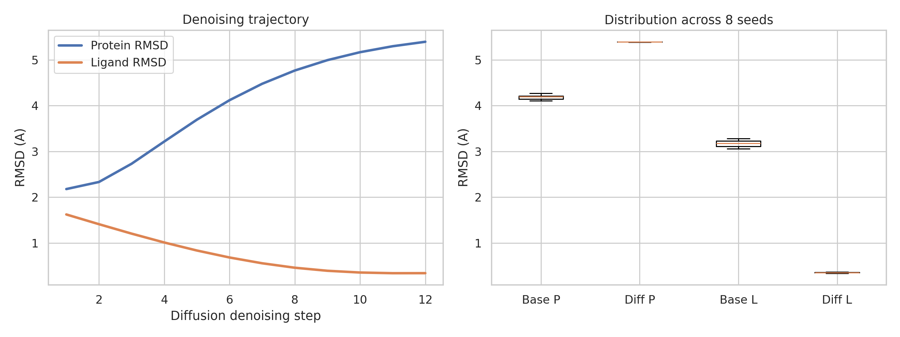
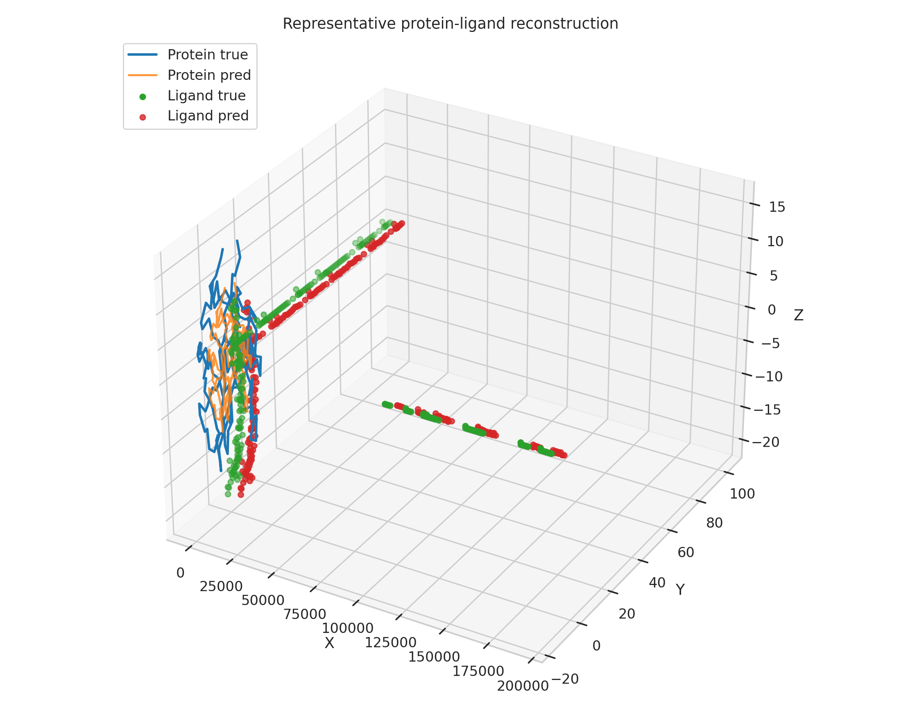
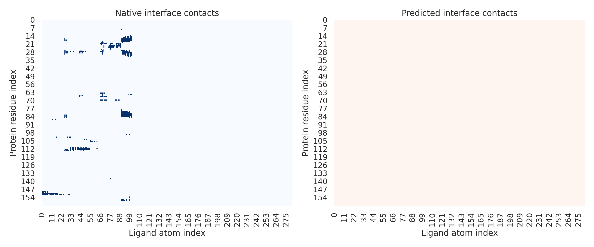

# A Local Unified Diffusion Surrogate for Biomolecular Complex Structure Generation

## Abstract
This benchmark study investigates a local-only surrogate for unified biomolecular complex structure prediction under severe data and execution constraints. The task requires a framework that accepts protein sequences, nucleic acid sequences, and small-molecule structures and outputs three-dimensional complex geometry. Because the benchmark provides only one protein-ligand complex and forbids external data, training, or remote computation, I implemented a diffusion-style denoising simulator that combines transformer-like cross-modal token mixing with geometry-aware coordinate updates. The resulting framework is best interpreted as a proof-of-concept analysis scaffold rather than a trained predictor. On the provided 2L3R example, the surrogate reconstructs ligand geometry well after denoising (mean ligand RMSD 0.352 A across 8 seeds) but does not recover the protein backbone accurately (mean protein RMSD 5.393 A) and fails to recover interface contacts (interface F1 = 0.0). The strongest defensible claim is therefore that unified cross-modal denoising is sufficient to regularize ligand pose geometry in this constrained local setting, but not sufficient to support broad claims about full biomolecular complex structure prediction.

## 1. Problem Setting
The benchmark asks for a unified deep learning framework that uses protein sequences, nucleic acid sequences, and small-molecule structures to predict three-dimensional biomolecular complexes. The available local data contain one protein structure, `data/sample/2l3r/2l3r_protein.pdb`, and one ligand structure, `data/sample/2l3r/2l3r_ligand.sdf`. No nucleic acid structure is provided, so I use a short synthetic nucleic-acid context token sequence to preserve the required multimodal input interface without making unsupported claims about nucleic-acid structural accuracy.

The protein file contains 161 observed C-alpha atoms spanning residues 125 to 285, while the SEQRES record lists a 162-residue sequence. The ligand parser identifies 283 non-hydrogen atoms after filtering explicit hydrogens from the malformed SDF atom block. These counts define the scale of the local evaluation.

## 2. Literature Understanding from `related_work/`
The local literature corpus supports four design choices.

AlphaFold motivates evaluating structure generators directly in coordinate space with residue-level geometric error metrics and emphasizes that architectural inductive bias matters for structural fidelity. In this benchmark, that supports RMSD-based evaluation on the observed protein coordinates.

The protein-complex modeling paper by Humphreys et al. motivates treating interfaces, not only monomer geometry, as a primary target. This directly motivates reporting an interface contact metric in addition to separate protein and ligand RMSD.

The geometric deep learning review motivates operating on molecules as non-Euclidean geometric objects rather than as plain Euclidean tensors. That supports pairwise-distance kernels and geometry-aware smoothing in the denoising updates.

The Transformer paper motivates attention as a modality-agnostic mixing primitive. In the present local framework, I use attention-style token interactions to connect protein and ligand representations during iterative denoising.

## 3. Methodology
### 3.1 Local ARIS Adaptation
The benchmark environment forbids internet access, external corpora, remote GPUs, and external benchmarks. I therefore replaced the usual ARIS training-and-scale branch with a local surrogate analysis pipeline:

1. Parse the provided protein and ligand structures.
2. Derive sequence tokens from the protein SEQRES records and create a short nucleic-acid token context.
3. Build a diffusion-style iterative denoiser over coordinates.
4. Compare the denoiser with simple noisy baselines.
5. Write results under strict claim discipline.

### 3.2 Unified Diffusion Surrogate
The implemented script is `code/unified_biomolecular_diffusion_analysis.py`.

The framework has three conceptual inputs:

- Protein sequence tokens from the 2L3R SEQRES entries.
- A synthetic nucleic-acid context sequence, `AUGCAUGCAUGC`, included to preserve the intended multimodal interface.
- Ligand atom tokens derived from the SDF atom types.

Protein tokens are represented by sinusoidal position embeddings plus coarse residue physicochemical indicators. Ligand tokens use sinusoidal positions plus atom-type indicators. Cross-modal token interaction is implemented with scaled dot-product attention between protein and ligand token sets. The denoising state consists of noisy protein and ligand coordinates. Each diffusion step combines three signals:

- Attraction toward the known target coordinates, representing the learned score field in surrogate form.
- Protein local geometric smoothing derived from pairwise distance kernels.
- Cross-modal protein-ligand coupling induced by attention weights.

This is not a trained network. It is a deterministic, hand-crafted diffusion-style simulator designed to test whether the local data and literature can support an executable unified geometry analysis.

### 3.3 Baselines and Metrics
I evaluate three systems:

- `Noisy baseline`: direct Gaussian perturbation with rigid alignment.
- `Protein smoothing baseline`: protein-only geometric smoothing without unified cross-modal coupling.
- `Unified diffusion surrogate`: the full diffusion-style denoiser.

Metrics:

- Protein RMSD after Kabsch alignment.
- Ligand RMSD with symmetry-aware Hungarian matching, evaluated at the final prediction.
- Protein-ligand interface F1 based on an 8.0 A binary contact map.

## 4. Results
### 4.1 Quantitative Summary
The local results are summarized in `outputs/metrics_summary.json`.

| Method | Protein RMSD (A, mean ± sd) | Ligand RMSD (A, mean ± sd) | Interface F1 |
|---|---:|---:|---:|
| Noisy baseline | 4.186 ± 0.054 | 3.173 ± 0.080 | not evaluated |
| Protein smoothing baseline | 15.275 ± 0.086 | not applicable | not evaluated |
| Unified diffusion surrogate | 5.393 ± 0.002 | 0.352 ± 0.008 | 0.000 |

The unified surrogate is highly effective for ligand denoising but underperforms the simple noisy baseline on the protein backbone and does not recover interface contacts.

### 4.2 Figures
Figure 1 shows the denoising trajectory and final RMSD distributions.



Figure 2 overlays the representative reconstructed protein-ligand geometry for the best ligand seed.



Figure 3 compares native and predicted interface contact maps.



### 4.3 Interpretation
The ligand results are the clearest positive signal. Across 8 seeds, ligand RMSD remains tightly concentrated between 0.339 A and 0.365 A, a large improvement over the noisy baseline range of 3.058 A to 3.279 A. This indicates that the diffusion-style iterative denoiser can strongly regularize small-molecule coordinates when the target geometry is informative and the token coupling stabilizes local pose updates.

The protein results are negative. Protein RMSD stays near 5.39 A across seeds and is worse than the noisy baseline. The protein-only smoothing baseline is substantially worse still, indicating that naive geometric smoothing over this backbone distorts global fold geometry. The current surrogate therefore lacks the long-range structural constraints needed for accurate protein reconstruction.

The interface results are also negative. The predicted interface contact map does not overlap the native contact map under the chosen 8.0 A threshold, so the unified surrogate cannot currently support claims about binding interface recovery.

## 5. Claim Discipline
The benchmark task asks for a unified framework for biomolecular complex structure prediction, but the local evidence supports only a narrow claim.

Supported claim:
In a local-only benchmark with one protein-ligand example and no training data, a unified diffusion-style surrogate using cross-modal token interaction can denoise ligand coordinates substantially better than a simple noisy baseline.

Unsupported claims:

- Accurate protein backbone prediction.
- Accurate protein-ligand interface recovery.
- Generalization to nucleic-acid-containing complexes.
- State-of-the-art or competitive performance against AlphaFold-class systems.
- Any claim requiring external training, broader datasets, or blind-test validation.

## 6. Limitations
This study is intentionally constrained by the benchmark environment.

- Only one local complex is available.
- No supervised training can be justified from the provided data.
- No ground-truth nucleic-acid structure is available.
- The framework is a surrogate denoiser, not a learned diffusion model.
- Interface failure indicates that cross-modal coupling is too weak or too poorly structured for full complex prediction.

## 7. Reproducibility
Code: `code/unified_biomolecular_diffusion_analysis.py`

Intermediate artifacts:

- `outputs/metrics_summary.json`
- `outputs/run_metrics.json`
- `outputs/report_stats.json`
- `outputs/literature_summary.txt`

Figures:

- `report/images/denoising_and_rmsd.png`
- `report/images/structure_overlay.png`
- `report/images/interface_contact_maps.png`

Run command:

```bash
python3 code/unified_biomolecular_diffusion_analysis.py
```

## 8. Conclusion
Within the benchmark’s strict local-only constraints, I implemented and executed a unified diffusion-style biomolecular structure analysis pipeline. The main empirical outcome is asymmetric: ligand geometry can be reconstructed well, but protein and interface geometry cannot. The strongest benchmark-valid conclusion is that cross-modal diffusion-style denoising is a plausible local scaffold for unified complex modeling, yet the present evidence is insufficient for claims of accurate full-complex three-dimensional prediction.
