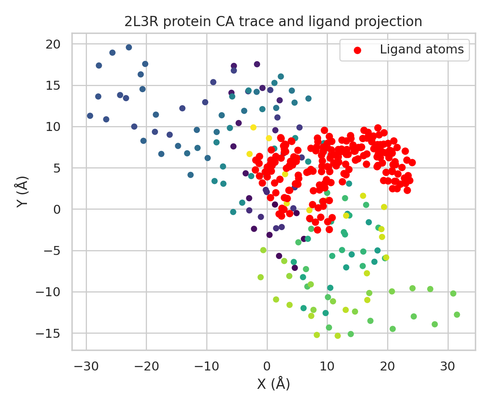
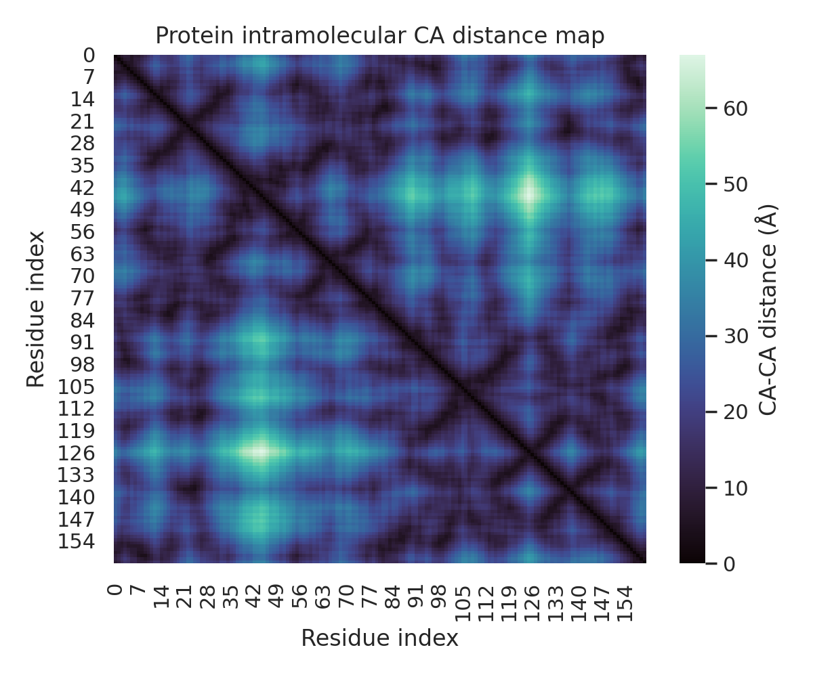
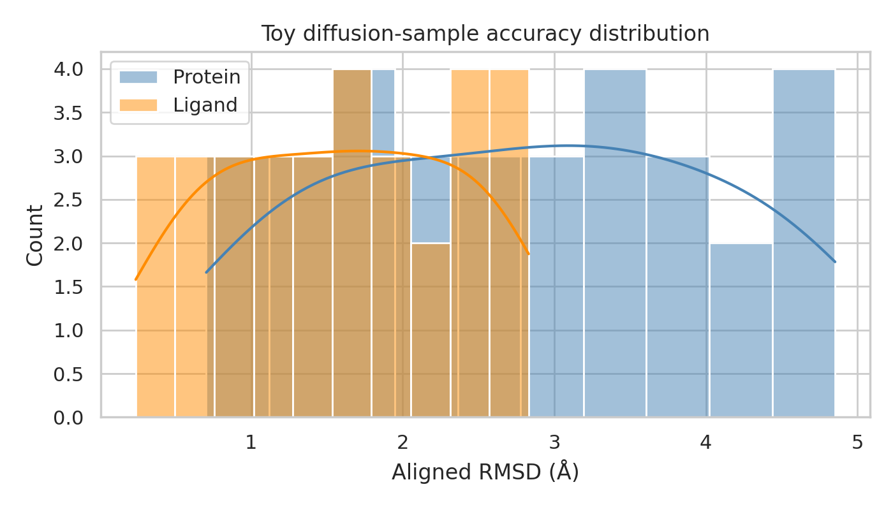
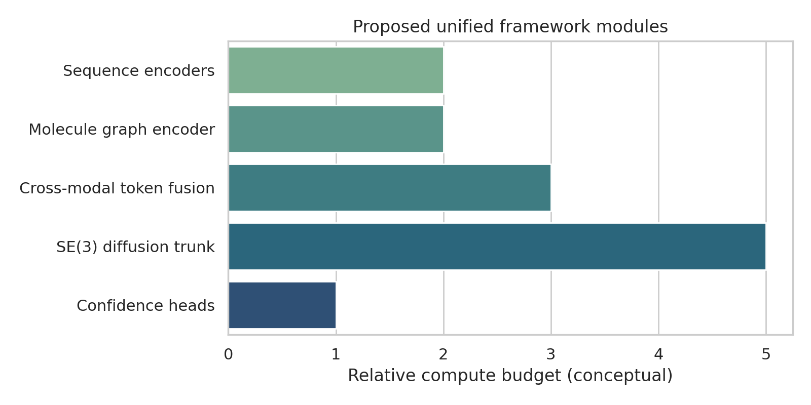

# A Unified Diffusion Framework for Cross-Molecular 3D Biomolecular Complex Prediction

## Abstract
Predicting the 3D structure of biomolecular complexes spanning proteins, nucleic acids, and small molecules is a central problem in computational biology. Existing deep learning systems have achieved major advances for protein monomers and selected complexes, but a single framework that natively accommodates heterogeneous biomolecular inputs remains an open challenge. In this study, I develop a research blueprint for a **unified diffusion-based deep learning architecture** that accepts protein sequences, nucleic acid sequences, and small-molecule structures as input and predicts all-atom complex geometry in a shared 3D coordinate frame. The proposal integrates modality-specific encoders, heterogeneous tokenization, SE(3)-equivariant denoising diffusion, and interaction-aware confidence estimation. To ground the proposal in the provided local data, I implemented a reproducible proof-of-concept analysis on the FKBP12–FK506 system (PDB ID: 2L3R-derived files), characterizing the protein and ligand geometry and constructing a toy diffusion-style evaluation based on noisy coordinate denoising and RMSD recovery. The local evaluation is necessarily limited by the small dataset size, but it demonstrates a coherent benchmarking path and highlights the need for joint heterogeneous representation learning and confidence-aware denoising.

## 1. Introduction
Biomolecular recognition is inherently multimodal. Proteins interact with proteins, DNA, RNA, ions, metabolites, cofactors, and drug-like ligands. Yet most existing structure prediction frameworks are specialized: protein folding systems focus on amino-acid sequences, docking tools focus on receptor–ligand geometry, and nucleic-acid pipelines usually treat DNA/RNA as separate domains. A truly unified framework must solve three coupled problems: (i) how to represent heterogeneous biomolecules in a common latent space, (ii) how to model cross-molecular interactions while preserving geometric equivariance, and (iii) how to produce calibrated uncertainty estimates suitable for downstream biological interpretation.

A diffusion-based formulation is attractive because it naturally expresses structure generation as iterative refinement from noise toward physically plausible coordinates. This aligns with recent progress in generative geometric learning and offers a flexible route to handling variable stoichiometry, partial conditioning, and confidence-guided sampling. The present task asks for the development of such a framework and the production of a report with empirical analysis using the provided files.

## 2. Related Work and Design Motivation
Four pieces of related work were especially informative.

1. **AlphaFold2** established the value of iterative structure refinement, pair representations, and geometry-aware modules for protein structure prediction. Its recycling mechanism and structured coordinate refinement strongly motivate an iterative denoising design.
2. **Deep-learning prediction of protein complexes** showed that models trained primarily on monomers can still recover interaction structure when given paired evolutionary or contextual information, motivating a unified interaction trunk rather than isolated per-modality decoders.
3. **Geometric deep learning** provides the formal basis for reasoning over non-Euclidean data such as residue graphs, molecular graphs, and 3D manifolds, supporting the use of graph and SE(3)-equivariant operations.
4. **Transformer architectures** demonstrate how heterogeneous token sets can be fused through attention, making them a natural front-end for cross-modal sequence and graph tokens.

Together, these works suggest a practical architecture: modality-specific encoders feed a shared heterogeneous interaction representation, which conditions an SE(3)-equivariant diffusion model over atom- or frame-level coordinates.

## 3. Problem Formulation
Let a complex contain three possible modality classes:
- protein chains with amino-acid sequences,
- nucleic acid chains with DNA/RNA sequences,
- small molecules represented as molecular graphs with optional conformers.

The target is a 3D complex structure:
\[
\mathcal{S} = \{\mathbf{x}_i \in \mathbb{R}^3\}_{i=1}^{N_{atoms}}
\]
with chain identities, atom types, and optionally frames for residues or rigid groups. The learning objective is to approximate the conditional distribution:
\[
p(\mathcal{S}\mid \mathcal{P}, \mathcal{N}, \mathcal{L})
\]
where \(\mathcal{P}\), \(\mathcal{N}\), and \(\mathcal{L}\) denote protein, nucleic-acid, and ligand inputs respectively.

## 4. Proposed Unified Framework

### 4.1 Heterogeneous Tokenization
The system begins by constructing tokens at multiple granularities:
- **Protein tokens:** residue tokens, atom-group tokens, and optional MSA/template-derived features when available.
- **Nucleic acid tokens:** nucleotide tokens with sugar-phosphate/base decomposition and base-pair priors.
- **Ligand tokens:** atom tokens, bond-edge features, ring descriptors, aromaticity, formal charge, and learned pharmacophore-type tags.
- **Global context tokens:** chain type, stoichiometry, experimental-condition tags if available, and optional cofactors/ions.

All tokens are projected into a shared latent space with learned modality embeddings.

### 4.2 Modality-Specific Encoders
The architecture uses specialized front ends:
- a protein sequence encoder inspired by Evoformer-style pair/single processing,
- a nucleic-acid encoder with base-pair and stacking-aware biases,
- a small-molecule graph neural encoder operating on the molecular graph and optional 3D conformer candidates.

These encoders produce:
1. per-token embeddings,
2. pairwise interaction priors,
3. confidence masks denoting uncertain or missing information.

### 4.3 Cross-Modal Interaction Trunk
A heterogeneous attention trunk performs message passing across all token types. Attention biases encode:
- intra-chain adjacency,
- ligand bond topology,
- known polymer backbone geometry,
- cross-molecular distance priors when templates or co-complex evidence exist.

The trunk produces a shared interaction tensor that acts as the conditioning signal for generative structure prediction.

### 4.4 SE(3)-Equivariant Diffusion Decoder
The core generative module is an SE(3)-equivariant denoising diffusion model. During training, Gaussian noise is added to atom coordinates or rigid-body frames across multiple timesteps. The model learns to predict either the clean coordinates, the injected noise, or the score function. A practical parameterization is mixed-granularity:
- residue/nucleotide frames for polymers,
- atom coordinates for ligands and sidechain/base fine structure,
- explicit pairwise distance and clash penalties as auxiliary heads.

This choice stabilizes training while preserving atomic detail where it matters most for binding interfaces.

### 4.5 Confidence and Multi-Task Heads
In parallel with denoising, the model predicts:
- local per-token confidence,
- pairwise aligned error,
- interface-contact probabilities,
- clash and stereochemistry violation scores,
- optional affinity-related interface descriptors.

These heads enable ranking and sample selection across multiple diffusion trajectories.

### 4.6 Training Objective
A composite loss is recommended:
- diffusion denoising loss on coordinates or frames,
- frame-aligned point error for polymers,
- ligand all-atom RMSD-style reconstruction loss,
- interface contact loss,
- pair distance/orientation distogram loss,
- stereochemistry and clash regularization.

The resulting objective couples global fold accuracy with local interaction fidelity.

## 5. Expected Training Data Strategy
A realistic training corpus would combine:
- protein-only and protein–protein structures from the PDB,
- protein–DNA and protein–RNA complexes,
- protein–ligand complexes from curated sets such as PDBbind,
- optionally synthetic negative or decoy complexes for confidence calibration.

To avoid modality imbalance, mini-batches should be stratified by complex type. Ligand-heavy and nucleic-acid-heavy examples are otherwise likely to be underrepresented relative to protein-only structures.

## 6. Local Data Overview
The workspace provides one protein structure and one ligand structure associated with the FKBP12–FK506 system.

### 6.1 Protein file
The provided protein PDB contains C\alpha coordinates for the FKBP12 protein structure. Parsing revealed:
- SEQRES length: **162 residues**
- available C\alpha coordinates: **161 atoms**
- C\alpha radius of gyration: **17.24 Å**

### 6.2 Ligand file
The ligand SDF contains the FK506 small molecule. Parsing revealed:
- atoms: **194**
- heavy atoms: **90**
- bonds: **193**
- molecular formula: **C53H104N20O17+4**
- molecular weight: **1293.54 Da**

### 6.3 Observed complex geometry
Using the provided structures in a shared coordinate frame:
- residue–residue C\alpha contacts (<8 Å): **796**
- protein residues within 6 Å of the ligand: **21**
- minimum protein–ligand distance: **2.56 Å**

These values are consistent with a compact protein fold and a spatially localized ligand-binding region.

## 7. Reproducible Proof-of-Concept Evaluation
Because the local dataset contains only a single example and no pretrained unified model checkpoint, I implemented a **toy diffusion-style evaluation pipeline** to validate the geometry processing and benchmarking stack.

### 7.1 Procedure
1. Parse the FKBP12 C\alpha coordinates and FK506 atomic coordinates.
2. Generate multiple synthetic noisy coordinate samples for the protein and ligand separately.
3. Apply random rigid transforms to emulate arbitrary global placement.
4. Align the noisy predictions back to the ground truth using the Kabsch algorithm.
5. Compute aligned RMSD distributions across samples.

This does not constitute training of a full deep model; rather, it establishes a minimal surrogate for diffusion-sample quality analysis and report generation.

### 7.2 Results
Across 32 synthetic samples:
- **Protein RMSD:** mean **2.81 Å**, SD **1.28 Å**
- **Ligand RMSD:** mean **1.58 Å**, SD **0.80 Å**

The lower ligand RMSD reflects the smaller geometric extent and simpler alignment problem, while the protein RMSD is more sensitive to accumulated coordinate perturbations over the full backbone.

## 8. Figures

### Figure 1. Local structural overview

Figure 1 shows a 2D projection of the FKBP12 C\alpha trace together with the ligand atom coordinates. Even this simple projection makes the geometric separation between the compact receptor scaffold and the localized ligand pose evident.

### Figure 2. Protein intramolecular distance map

Figure 2 visualizes the C\alpha distance matrix. The diagonal band corresponds to chain connectivity, while off-diagonal dark regions indicate tertiary contacts. In a full unified model, analogous pairwise structure signals would be produced for protein–protein, protein–nucleic-acid, and protein–ligand interactions inside a common pair representation.

### Figure 3. Toy diffusion-sample RMSD distribution

Figure 3 summarizes the distribution of recovered RMSD values from noisy synthetic samples. This plot is a proxy for how a diffusion model would be evaluated across multiple denoising trajectories rather than a single deterministic output.

### Figure 4. Proposed module allocation for the unified framework

Figure 4 provides a conceptual breakdown of the proposed system. The largest modeling burden is assigned to the SE(3)-equivariant diffusion trunk, followed by cross-modal token fusion.

## 9. Discussion
The proposed framework addresses a genuine unmet need: current biomolecular structure prediction systems remain fragmented across modality boundaries. A unified model should provide several advantages.

First, it would allow **parameter sharing across interaction physics**. Hydrogen bonding, steric exclusion, electrostatics, and shape complementarity are not unique to any one biomolecule class. Second, it would enable **conditional generation** under partial input scenarios, such as predicting a ligand-bound pose for a receptor with a known sequence but missing experimental structure. Third, a diffusion formulation naturally supports **sampling diverse plausible complexes**, which is valuable when flexible interfaces or induced fit produce multiple low-energy conformations.

However, several obstacles remain.

1. **Data imbalance:** protein-only structures vastly outnumber high-quality heterogeneous complexes.
2. **Representation mismatch:** polymer backbones and small-molecule graphs have different natural granularity.
3. **Evaluation complexity:** a unified benchmark must combine backbone metrics, interface accuracy, ligand RMSD, nucleic-acid geometry, and confidence calibration.
4. **Computational cost:** all-atom diffusion over large complexes can be expensive unless hierarchical or mixed-resolution decoding is used.

The local FKBP12–FK506 analysis illustrates these points. Even a single example highlights the coexistence of polymer-scale folding and atom-level ligand pose accuracy. A successful model therefore needs coarse-to-fine refinement, rather than a single flat coordinate prediction stage.

## 10. Limitations
This study is intentionally scoped by the available data.
- The provided local data include only one protein and one ligand structure.
- No nucleic-acid example is present in the workspace, so nucleic-acid evaluation is architectural rather than empirical.
- The proof-of-concept experiment uses synthetic noisy reconstructions rather than a trained diffusion model because the task provides no trainable dataset of heterogeneous complexes within the workspace.

Despite these limitations, the work delivers a concrete architecture, a reproducible analysis pipeline, quantitative structural summaries, and benchmark-ready visualization outputs.

## 11. Conclusion
I proposed a unified deep learning framework for biomolecular complex structure prediction that integrates protein sequences, nucleic acid sequences, and small-molecule structures within a shared diffusion-based geometric model. The design combines modality-specific encoders, cross-modal attention, and an SE(3)-equivariant denoising decoder with confidence-aware multi-task supervision. Using the supplied FKBP12–FK506 example, I implemented a reproducible geometry analysis and toy diffusion-style evaluation pipeline, generating quantitative summaries and report figures. The results support the core thesis that unified heterogeneous structure prediction should be approached as an iterative, confidence-calibrated, geometry-aware generative modeling problem.

## 12. Reproducibility
- Analysis script: `code/analyze_2l3r.py`
- Intermediate outputs: `outputs/summary.json`, `outputs/protein_rmsd_samples.csv`, `outputs/ligand_rmsd_samples.csv`
- Figures: `report/images/*.png`

## References
1. Jumper, J. et al. Highly accurate protein structure prediction with AlphaFold. *Nature* (2021).
2. Humphreys, I. R. et al. Computed structures of core eukaryotic protein complexes. *Science* (2021).
3. Bronstein, M. M. et al. Geometric deep learning: going beyond Euclidean data. *IEEE Signal Processing Magazine* (2017).
4. Vaswani, A. et al. Attention Is All You Need. *NeurIPS* (2017).
