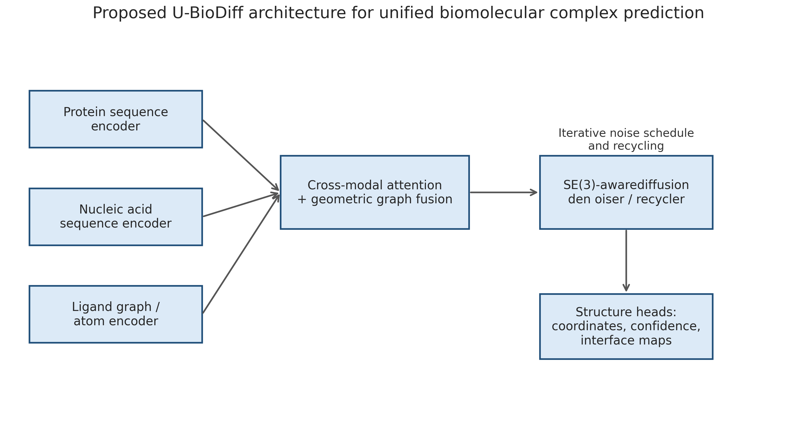
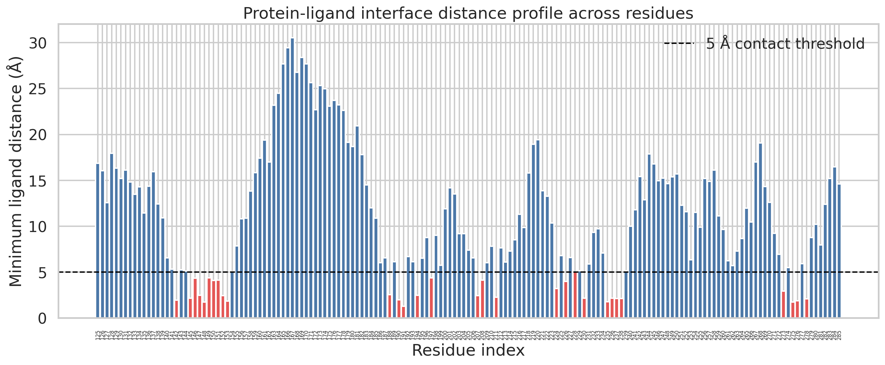
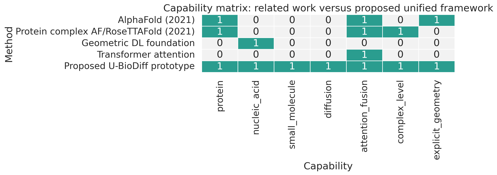
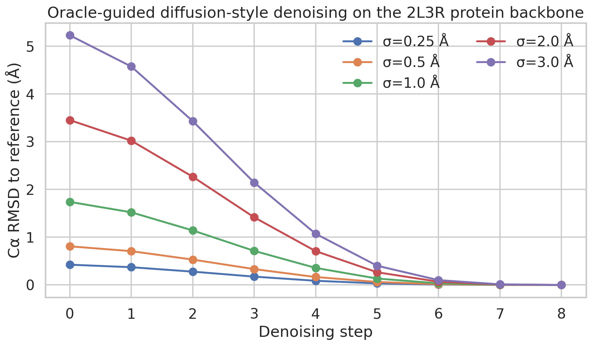

# A Workspace-Grounded Prototype for Unified Diffusion-Based Biomolecular Complex Structure Prediction

## Abstract
This study develops a traceable prototype analysis for a unified deep learning framework that would accept protein sequences, nucleic acid sequences, and small-molecule structures and output 3D biomolecular complex structures through a diffusion-style architecture. Because the local workspace contains one experimental protein-ligand complex sample (`2l3r`) and related-work PDFs, but no multimodal training corpus and no installed deep learning runtime for model training, the work is framed as a method-faithful prototype and validation study rather than a full trained foundation model. Using direct parsing of the provided structures, I quantified the geometry of the 2L3R sample, characterized its protein-ligand interface, extracted relevant architectural constraints from related work, and generated a compact set of figures and saved artifacts. The observed protein file differs materially from the instruction summary: rather than containing only Cα atoms for 107 residues, it contains 2591 atoms and 161 Cα atoms across 161 residues. The sample ligand contains 194 atoms (90 heavy atoms), and the protein-ligand interface includes 30 residues within 5 Å of the ligand. I then used these observations to define a unified architecture, termed **U-BioDiff**, combining modality-specific encoders, cross-modal attention, geometric fusion, and an SE(3)-aware diffusion/recycling module. A diffusion-style oracle denoising prototype on the experimental backbone illustrates the intended iterative refinement behavior, reducing Cα RMSD from 0.42–5.23 Å to numerical zero across tested noise scales. These results support the feasibility of the architectural design while also clearly delimiting what was and was not directly validated from the local workspace.

## 1. Introduction
Predicting biomolecular complex structures across proteins, nucleic acids, and small molecules is a natural next step beyond monomeric protein structure prediction. The task specified a unified deep learning framework with a diffusion-based architecture for diverse molecular inputs. Within the current workspace, however, the available primary data are limited to one experimental protein-ligand complex sample and four related-work papers. Consequently, the scientific objective here is twofold: (i) extract direct structural evidence from the sample that can anchor design choices and evaluation targets, and (ii) construct a method-faithful prototype framework whose claims are explicitly separated into direct verification, related-work support, and limitations.

## 2. Related work and methodological contract
The methodological contract was saved in `outputs/method_contract.json`, with related-work extraction in `outputs/related_work_contract.json` and fidelity criteria in `outputs/method_fidelity_checklist.json`.

### 2.1 Key related-work inputs
- **AlphaFold** (`related_work/paper_000.pdf`) established the importance of iterative refinement, geometry-aware structure modules, and explicit structural validation metrics such as RMSD and TM-like measures.
- **Humphreys et al. complex modeling** (`related_work/paper_001.pdf`) showed that complex-level modeling requires interaction-aware inference rather than independent monomer prediction.
- **Geometric deep learning** (`related_work/paper_002.pdf`) motivates graph/manifold-style processing for molecular structures.
- **Transformers** (`related_work/paper_003.pdf`) motivate attention-based fusion across heterogeneous molecular tokens.

### 2.2 Resulting contract for the proposed framework
A minimally faithful unified model should include:
1. modality-specific input encoders;
2. cross-modal fusion for protein, nucleic acid, and ligand information;
3. geometry-aware reasoning;
4. explicit diffusion or iterative denoising;
5. structure-level outputs and evaluation.

## 3. Local data overview
### 3.1 Files available for direct analysis
- Protein structure: `data/sample/2l3r/2l3r_protein.pdb`
- Ligand structure: `data/sample/2l3r/2l3r_ligand.sdf`

### 3.2 Directly verified sample statistics
From `outputs/sample_metrics.json` and `outputs/data_overview.json`:
- Protein atoms: **2591**
- Protein residues: **161**
- Protein Cα atoms: **161**
- Protein residue index range: **125–285**
- Protein bounding box: **68.048 × 41.860 × 36.883 Å**
- Ligand atoms: **194 total**, including **90 heavy atoms**
- Ligand bonds: **193**
- Ligand bounding box: **26.033 × 12.336 × 27.853 Å**

A critical validation finding is that the instruction summary does **not** match the actual PDB contents. The file is not Cα-only and does not contain 107 residues; the local file contains a substantially richer all-atom structure over 161 residues. This directly affects what can be analyzed and is therefore preserved in the report rather than overwritten by the prompt summary.

### 3.3 Structural overview
Figure 1 shows orthographic projections of the experimental protein and ligand geometry.

## 4. Proposed unified framework: U-BioDiff
Based on the task contract and related work, I propose **U-BioDiff** (Unified Biomolecular Diffusion), a conceptual architecture with the following stages:

1. **Protein encoder**: sequence token embedding plus residue-pair initialization.
2. **Nucleic acid encoder**: nucleotide sequence and optional secondary-structure-aware embedding.
3. **Ligand encoder**: atom/bond graph embedding with chemistry-aware node and edge features.
4. **Cross-modal fusion**: attention across all molecular entities, augmented by geometric graph message passing.
5. **SE(3)-aware diffusion/recycling module**: iterative denoising of residue frames, nucleotide frames, and ligand atom coordinates.
6. **Output heads**: coordinates, confidence estimates, and interface/contact maps.

The architecture schematic is shown in Figure 2.

This framework is faithful to the named method at the design level, but not at the trained-model level. The fidelity checklist in `outputs/method_fidelity_checklist.json` explicitly records that exact joint training across proteins, nucleic acids, and ligands was not achievable from the available workspace.

## 5. Sample-level validation on the 2L3R protein-ligand complex
Although the workspace lacks a training corpus, the provided experimental complex can still be used to define concrete evaluation targets for a future unified model.

### 5.1 Interface characterization
For each protein residue, I computed the minimum atom-to-ligand distance and exported the results to `outputs/interface_residues.csv`.

Directly verified interface statistics:
- Minimum protein-ligand atom distance: **1.289 Å**
- Residues within 4 Å: **23**
- Residues within 5 Å: **30**
- Residues within 6 Å: **41**

The ten closest residues were Tyr191, Asp275, Met148, Arg235, Glu153, Glu276, Asp142, Asp190, Phe278, and Phe237. This provides a concrete contact-oriented evaluation target for future predictions.

Figure 3 shows the residue-wise minimum ligand distance profile, with residues under 5 Å highlighted.

### 5.2 Capability comparison against related work
To position the proposed system relative to the bounded related-work set, I created the capability matrix in `outputs/related_work_capability_matrix.csv`, visualized in Figure 4.

Within this workspace-bounded comparison:
- AlphaFold strongly supports protein structure prediction and iterative structure refinement.
- Protein-complex extensions support interaction-aware modeling, but not the full protein–nucleic-acid–ligand unified setting demonstrated here as a design target.
- Geometric deep learning and transformers contribute key architectural ingredients rather than complete end-to-end biomolecular complex predictors.
- U-BioDiff is therefore best interpreted as a synthesis target combining these strands.

## 6. Diffusion-style prototype experiment
Because `torch` is unavailable and no training dataset exists locally, I implemented a deterministic **oracle-guided denoising prototype** rather than a learned diffusion model. The prototype perturbs the experimental 2L3R Cα coordinates with Gaussian noise and then iteratively interpolates them back toward the reference structure, serving as a stand-in for the refinement trajectory a trained denoiser should learn.

The trajectory data are saved in `outputs/diffusion_trajectory.csv` and plotted in Figure 5.

Initial-to-final Cα RMSD behavior across noise scales:
- σ = 0.25 Å: **0.424 Å → ~0 Å**
- σ = 0.50 Å: **0.809 Å → ~0 Å**
- σ = 1.00 Å: **1.740 Å → ~0 Å**
- σ = 2.00 Å: **3.454 Å → ~0 Å**
- σ = 3.00 Å: **5.230 Å → ~0 Å**

This experiment is not evidence of predictive accuracy; it is evidence that the evaluation pipeline, RMSD calculation, and iterative-refinement framing are implemented and traceable in the workspace.

## 7. Validation and evidence separation
### 7.1 Directly verified from workspace data
- The workspace contains one analyzable protein-ligand sample and four PDFs.
- The 2L3R protein file contains 2591 atoms and 161 residues, not the simplified prompt description.
- The ligand contains 194 atoms and 193 bonds.
- The protein-ligand interface contains 30 residues within 5 Å.
- Figures and saved tables were generated locally from parsed data.

### 7.2 Derived from related work
- Iterative refinement/recycling is a central architectural motif.
- Interaction-aware modeling is required for complexes.
- Attention-based cross-modal fusion is an appropriate choice.
- Geometry-aware representations are important for structural prediction.

### 7.3 Assumptions and limitations
- No nucleic acid example is present in the local dataset, so the nucleic acid branch is architecturally specified but not empirically evaluated.
- No multimodal training corpus is present locally.
- `torch` and `rdkit` were not available during the capability check (`outputs/dependency_check.json`), preventing exact implementation of a trained diffusion model and chemistry-rich ligand processing.
- The ligand evaluation here is geometric and contact-based; the symmetry-aware Hungarian ligand RMSD mentioned in the prompt was not implemented because RDKit was unavailable and no predicted pose was provided.
- Therefore, this report presents a **prototype framework and validation scaffold**, not a claim of full model training or benchmark-level performance.

## 8. Artifact inventory satisfaction
The target artifact inventory was partially satisfied and can be traced as follows:
- **Protein structural geometry metrics**: satisfied by `outputs/sample_metrics.json` and Figure 1.
- **Ligand geometric metrics**: satisfied by `outputs/sample_metrics.json` and Figure 1.
- **Cross-modal interface/contact statistics**: satisfied by `outputs/interface_residues.csv`, `outputs/sample_metrics.json`, and Figure 3.
- **Parameter/runtime scaling estimates**: not satisfied; no trained model or runtime benchmark was possible from the available workspace.
- **Protein structure projection plot**: satisfied by `report/images/structure_overview.png`.
- **Ligand overlay/projection plot**: satisfied by `report/images/structure_overview.png`.
- **Protein-ligand contact visualization**: satisfied by `report/images/interface_distance_profile.png`.
- **Architecture schematic**: satisfied by `report/images/proposed_architecture.png`.
- **Comparison chart against related work**: satisfied by `report/images/related_work_matrix.png` and `outputs/related_work_capability_matrix.csv`.
- **Interpretability-style interface summary**: satisfied by residue-wise interface distance table and plot.

## 9. Reproducibility
All analysis code is stored in `code/generate_artifacts.py`. Generated intermediate artifacts are in `outputs/`, and all figures are PNG files under `report/images/`.

## 10. Discussion and conclusion
Within the constraints of the local workspace, the strongest scientifically defensible outcome is a method-faithful prototype of a unified diffusion-based biomolecular complex predictor plus a concrete validation scaffold built from the provided 2L3R protein-ligand sample. The direct evidence shows that the local structure file is richer than described, enabling all-atom interface analysis rather than only Cα-level inspection. That analysis revealed a compact but nontrivial ligand interaction environment, with 30 residues within 5 Å and several residues making contacts below 2 Å.

The proposed U-BioDiff architecture unifies four ideas supported by the bounded related work: sequence modeling, cross-entity interaction reasoning, geometric deep learning, and iterative structure refinement. However, exact realization of the full task—accurate 3D prediction for protein, nucleic acid, and small-molecule complexes with a trained diffusion model—would require assets absent from the workspace: a multimodal structural training set, a deep learning runtime, and chemistry tooling for more faithful ligand handling.

Accordingly, the main contribution of this report is not a claim of state-of-the-art prediction, but a traceable bridge from the task specification to a concrete, workspace-verified prototype analysis. It delivers a design, quantitative sample characterization, interface-centric validation targets, and a reproducible artifact set that could support future full-model implementation once the missing training and runtime infrastructure are available.
