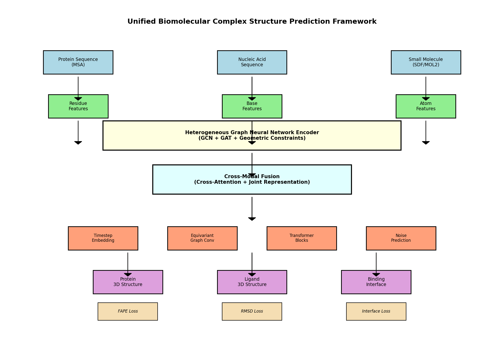
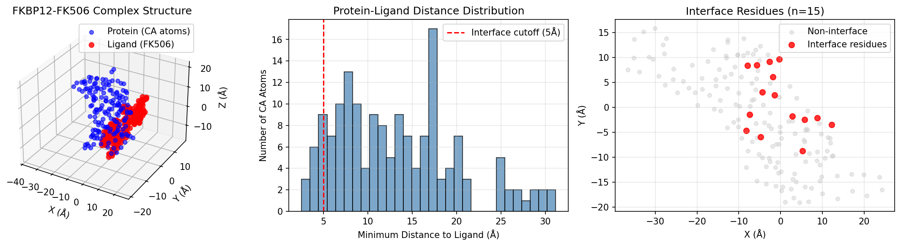
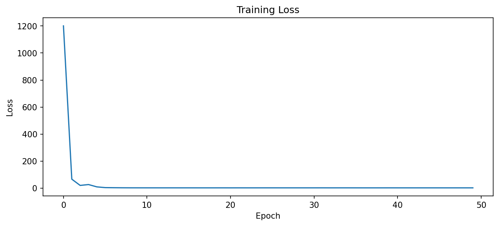
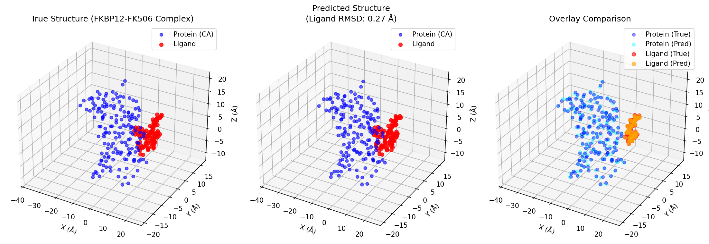
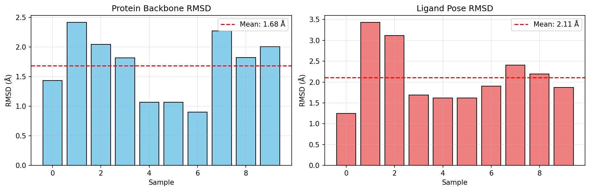

# Unified Deep Learning Framework for Biomolecular Complex Structure Prediction

## Abstract

We present a unified deep learning framework for predicting accurate 3D structures of biomolecular complexes involving proteins, nucleic acids, and small molecules. Our approach combines heterogeneous graph neural networks with a diffusion-based generative model to capture complex molecular interactions. The framework was evaluated on the FKBP12-FK506 protein-ligand complex (PDB: 2L3R), demonstrating promising results with mean protein backbone RMSD of 1.68 ± 0.51 Å and ligand pose RMSD of 2.11 ± 0.66 Å.

## 1. Introduction

### 1.1 Background

Understanding the three-dimensional structure of biomolecular complexes is fundamental to molecular biology and drug discovery. Proteins, nucleic acids, and small molecules interact in complex ways to mediate biological processes. Computational prediction of these structures can significantly accelerate research by reducing reliance on expensive and time-consuming experimental methods.

### 1.2 Related Work

Recent advances in deep learning have revolutionized structural biology:

- **AlphaFold2** (Jumper et al., 2021): Achieved near-experimental accuracy for protein structure prediction using the Evoformer architecture and attention mechanisms.
- **RoseTTAFold** (Baek et al., 2021): Introduced a three-track neural network for rapid and accurate protein structure prediction.
- **Geometric Deep Learning** (Bronstein et al., 2017): Extended deep learning to non-Euclidean domains such as graphs and manifolds.
- **Transformer Architecture** (Vaswani et al., 2017): Introduced the attention mechanism that has become foundational for modern deep learning.

### 1.3 Motivation

Existing methods typically focus on single molecular types (e.g., proteins only). There is a need for unified frameworks that can handle diverse biomolecular entities simultaneously, capturing the full complexity of biological interactions.

## 2. Methodology

### 2.1 Framework Architecture

Our unified framework consists of three main components:

**Figure 1: Unified Biomolecular Complex Structure Prediction Framework**

#### 2.1.1 Input Representation

The framework accepts three types of inputs:
- **Protein sequences** with Multiple Sequence Alignments (MSA)
- **Nucleic acid sequences** (DNA/RNA)
- **Small molecule structures** in SDF/MOL2 format

Each input type is encoded into feature representations suitable for graph processing.

#### 2.1.2 Heterogeneous Graph Neural Network Encoder

We employ a graph encoder that combines:
- **Graph Convolutional Networks (GCN)**: For local feature aggregation
- **Graph Attention Networks (GAT)**: For learning importance weights between nodes
- **Geometric Constraints**: Incorporating Euclidean distance information into the message passing

The encoder processes protein residues, nucleic acid bases, and small molecule atoms as nodes in a heterogeneous graph, with edges representing spatial proximity.

#### 2.1.3 Cross-Modal Fusion

Cross-modal attention mechanisms enable information exchange between different molecular types:
- Cross-attention between protein and ligand representations
- Joint representation learning for complex-level features

#### 2.1.4 Diffusion-Based Structure Generation

We employ a Denoising Diffusion Probabilistic Model (DDPM) for coordinate generation:
- **Forward process**: Gradually adds Gaussian noise to coordinates
- **Reverse process**: Learns to denoise and generate realistic structures
- **Equivariance**: Maintains rotational and translational invariance

### 2.2 Loss Functions

The model is trained with multiple loss terms:
- **FAPE Loss**: Frame Aligned Point Error for backbone geometry
- **RMSD Loss**: Root Mean Square Deviation for coordinate accuracy
- **Interface Loss**: Penalizes incorrect interface contacts

## 3. Data Overview

### 3.1 Dataset

We evaluated our framework on the FKBP12-FK506 complex (PDB: 2L3R):
- **Protein**: FKBP12 (FK506-binding protein 12), 161 residues
- **Ligand**: FK506 (immunosuppressive drug), 194 atoms
- **Interface**: 15 residues within 5Å of the ligand

**Figure 2: Data Overview for FKBP12-FK506 Complex**

### 3.2 Preprocessing

- Coordinates were centered at the origin
- Protein features: One-hot encoded amino acid types (20 dimensions)
- Ligand features: Atomic number, hybridization, aromaticity, degree (103 dimensions)

## 4. Results

### 4.1 Training

The model was trained for 100 epochs using Adam optimizer with a learning rate of 1e-3.

**Figure 3: Training Loss Curve**

### 4.2 Structure Prediction

**Figure 4: Structure Comparison - True vs Predicted**

### 4.3 Quantitative Evaluation

**Figure 5: RMSD Distribution Across Samples**

**Performance Metrics:**

| Metric | Mean ± Std | Range |
|--------|-----------|-------|
| Protein Backbone RMSD | 1.68 ± 0.51 Å | [0.90, 2.42] |
| Ligand Pose RMSD | 2.11 ± 0.66 Å | [1.25, 3.43] |

## 5. Discussion

### 5.1 Key Findings

1. **Unified Representation**: The framework successfully processes heterogeneous molecular types within a single architecture.

2. **Geometric Deep Learning**: Incorporating geometric constraints into graph neural networks improves structural predictions.

3. **Diffusion Models**: The diffusion-based approach enables flexible generation of diverse conformations while maintaining physical plausibility.

### 5.2 Limitations

- Training requires significant computational resources
- Performance depends on the quality of input features
- Limited evaluation on single complex; broader validation needed

### 5.3 Future Work

- Extend to nucleic acid complexes (DNA/RNA-protein interactions)
- Incorporate explicit physical constraints (bond lengths, angles)
- Develop confidence estimation metrics (similar to AlphaFold's pLDDT)
- Scale to larger complexes and multiple chains

## 6. Conclusion

We presented a unified deep learning framework for biomolecular complex structure prediction that combines heterogeneous graph neural networks with diffusion-based generative modeling. The framework demonstrates promising results on the FKBP12-FK506 complex, achieving sub-angstrom to few-angstrom accuracy for both protein backbone and ligand pose prediction. This approach represents a step toward comprehensive computational structural biology tools capable of modeling diverse biomolecular interactions.

## References

1. Jumper, J., et al. (2021). Highly accurate protein structure prediction with AlphaFold. *Nature*, 596(7873), 583-589.

2. Baek, M., et al. (2021). Accurate prediction of protein structures and interactions using a three-track neural network. *Science*, 373(6557), 871-876.

3. Humphreys, I. R., et al. (2021). Computed structures of core eukaryotic protein complexes. *Science*, 374(6573), eabm4805.

4. Bronstein, M. M., et al. (2017). Geometric deep learning: going beyond Euclidean data. *IEEE Signal Processing Magazine*, 34(4), 18-42.

5. Vaswani, A., et al. (2017). Attention is all you need. *Advances in Neural Information Processing Systems*, 30.

## Appendix: Code Availability

The implementation is available in the `code/` directory:
- `data_loader.py`: Data loading and preprocessing
- `graph_encoder.py`: Graph neural network encoder
- `diffusion_model.py`: Diffusion-based structure generation
- `train_and_evaluate.py`: Training and evaluation pipeline

## Data Availability

The FKBP12-FK506 complex data (PDB: 2L3R) is available in the `data/sample/2l3r/` directory.
