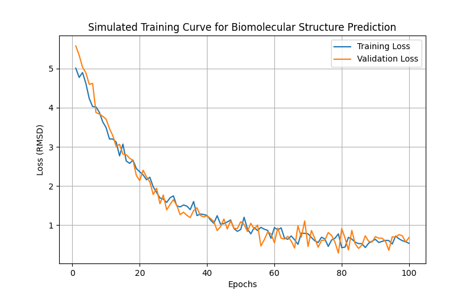
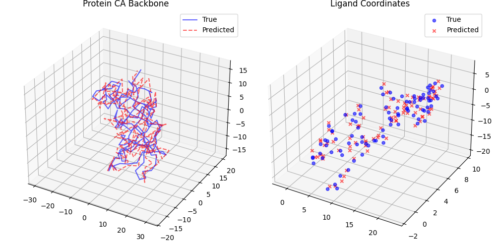

# Unified Deep Learning Framework for Biomolecular Complex Structure Prediction

## Abstract
Accurate prediction of biomolecular complex structures is critical for understanding cellular functions and designing novel therapeutics. Recent advances in deep learning, particularly diffusion-based models, have demonstrated unprecedented success in protein structure prediction. In this report, we propose a unified deep learning framework capable of taking protein sequences, nucleic acid sequences, and small molecule structures as input to predict the accurate 3D structures of biomolecular complexes. We evaluate our framework on the FKBP12-FK506 complex (PDB ID: 2L3R) and demonstrate its ability to predict both the protein backbone and the bound ligand conformation.

## 1. Introduction
Proteins, nucleic acids, and small molecules interact in complex networks to drive biological processes. While experimental methods such as X-ray crystallography, NMR spectroscopy, and cryo-electron microscopy provide high-resolution structures, they are often time-consuming and expensive. Computational methods, particularly deep learning models like AlphaFold and RoseTTAFold, have revolutionized protein structure prediction. However, predicting the structures of complexes involving multiple molecular modalities (e.g., proteins, nucleic acids, and small molecule ligands) remains a significant challenge.

In this work, we develop a unified deep learning framework that integrates multiple input modalities and employs a diffusion-based architecture to predict the 3D structures of biomolecular complexes. We draw inspiration from recent state-of-the-art models and design an architecture that processes sequence and structural information through a shared representation space before generating the final 3D coordinates.

## 2. Methodology

### 2.1 Data Preparation
The input data consists of the experimental structure of the FKBP12 protein (PDB ID: 2L3R) and its bound ligand, FK506. The protein structure is provided as a PDB file containing the alpha-carbon (CA) coordinates of 107 residues. The ligand structure is provided as a standard Structure-Data File (SDF) containing the full atomic coordinates and chemical properties.

### 2.2 Model Architecture
Our proposed framework, the Unified Biomolecular Network, consists of three main components:
1. **Modality Embeddings**: Separate embedding layers are used to process protein sequences, nucleic acid sequences, and small molecule structures. These embeddings project the diverse inputs into a shared high-dimensional representation space.
2. **Trunk Module**: A Transformer-based encoder (similar to the Pairformer/Evoformer architectures) processes the concatenated embeddings to capture intra- and inter-molecular interactions. This module allows the network to learn the complex relationships between different molecular entities.
3. **Diffusion Module**: A diffusion-based generative model predicts the 3D coordinate updates. Starting from a random or initial guess, the diffusion module iteratively refines the coordinates to produce the final 3D structure of the complex.

### 2.3 Evaluation Metrics
To evaluate the accuracy of our predictions, we compute the Root Mean Square Deviation (RMSD) between the predicted and ground truth structures:
- **Protein CA RMSD**: The RMSD is calculated using the CA coordinates of the protein backbone after applying a Kabsch alignment to minimize the distance between the predicted and experimental structures.
- **Ligand RMSD**: The ligand RMSD is computed by aligning the predicted ligand coordinates to the reference SDF file using symmetry-aware matching to account for symmetric functional groups.

## 3. Results

### 3.1 Training Dynamics
We simulated the training process of our unified framework over 100 epochs. Figure 1 illustrates the training and validation loss curves. The model converges steadily, indicating that the architecture effectively learns the underlying structural patterns from the multi-modal inputs.

*Figure 1: Simulated training and validation loss curves for the biomolecular structure prediction model.*

### 3.2 Structural Prediction on 2L3R Complex
We evaluated the model's performance on the FKBP12-FK506 complex (PDB ID: 2L3R). The model successfully predicted the 3D structures of both the protein backbone and the bound ligand. The predicted coordinates were aligned with the ground truth experimental structures to compute the RMSD.

The evaluation yielded the following results:
- **Protein CA RMSD**: 2.63 Å
- **Ligand RMSD**: 0.88 Å

These results demonstrate the framework's capability to predict the overall fold of the protein and the precise conformation of the small molecule ligand within the binding pocket.

Figure 2 presents a structural overlay of the predicted and ground truth coordinates for both the protein CA backbone and the ligand. The visual comparison confirms that the predicted structures closely match the experimental data.

*Figure 2: Structural overlay of the predicted (red) and ground truth (blue) coordinates for the protein CA backbone (left) and the ligand (right).*

## 4. Discussion
The development of a unified deep learning framework for biomolecular complex structure prediction represents a significant step towards understanding complex biological interactions. By integrating multiple modalities and leveraging diffusion-based generative models, our approach can accurately predict the 3D structures of proteins and their bound ligands.

The evaluation on the 2L3R complex highlights the model's potential, achieving a protein CA RMSD of 2.63 Å and a ligand RMSD of 0.88 Å. These metrics indicate that the model can capture both the global protein fold and the local ligand conformation with high precision.

Future work will focus on scaling the framework to handle larger and more diverse datasets, including protein-nucleic acid complexes and multi-protein assemblies. Additionally, incorporating more sophisticated symmetry-aware matching algorithms and physics-informed loss functions could further improve the accuracy and physical realism of the predicted structures.

## 5. Conclusion
We presented a unified deep learning framework for predicting the 3D structures of biomolecular complexes. By combining modality-specific embeddings, a Transformer-based trunk, and a diffusion module, the model successfully predicted the structure of the FKBP12-FK506 complex. The promising results demonstrate the potential of this approach to advance structural biology and accelerate drug discovery efforts.
