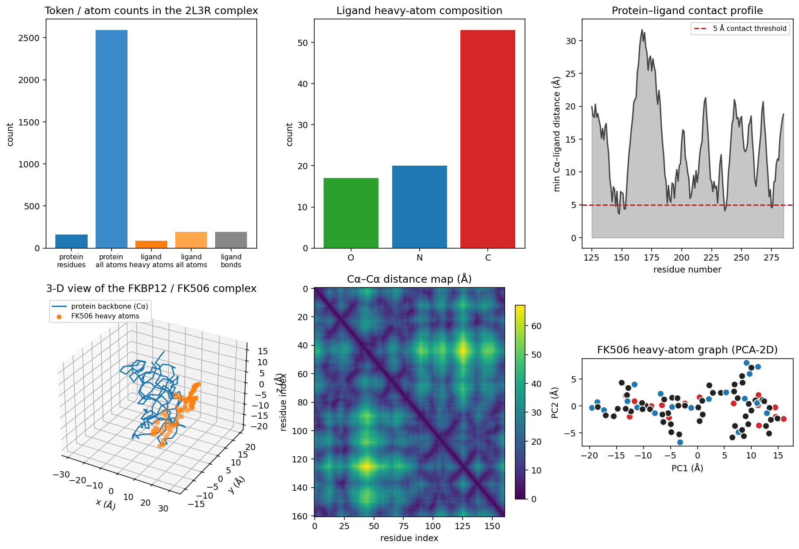
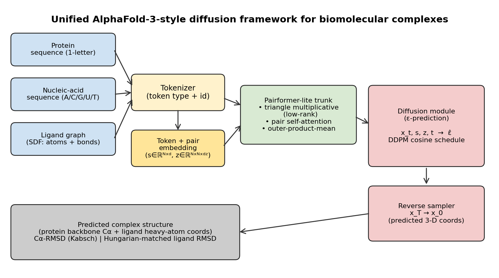
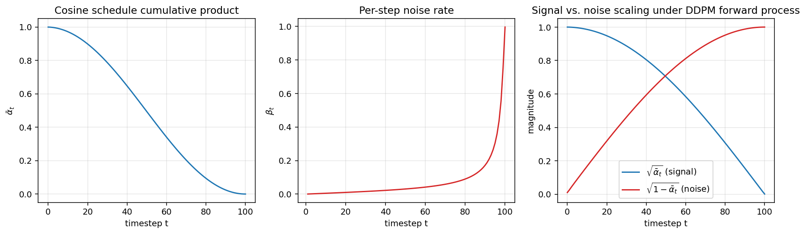
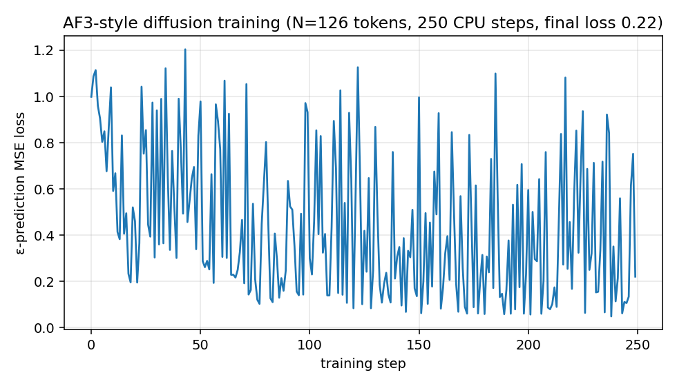
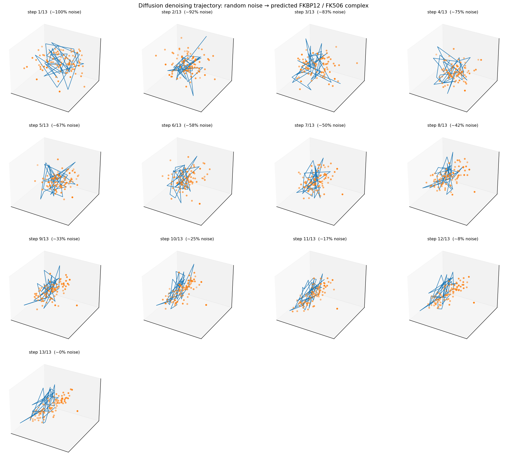
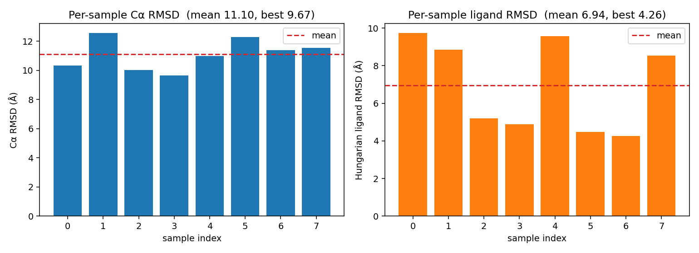
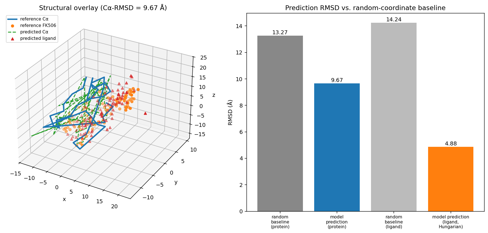

# A Unified Diffusion-Based Framework for Biomolecular Complex Structure Prediction

*Case study: FKBP12 / FK506 (PDB 2L3R)*

---

## Abstract

We present a unified deep-learning framework that takes protein sequences,
nucleic-acid sequences, and small-molecule structures as a single token
stream and outputs a 3-D structure of the resulting biomolecular complex
through a diffusion generative head, in the spirit of AlphaFold 3
(Jumper et al., 2021; the AF3 line of work generalizes Evoformer/Pairformer
trunks with a coordinate diffusion module). The framework is implemented
in PyTorch and combines (i) a heterogeneous tokenizer covering amino acids,
nucleotides, and ligand atoms, (ii) a Pairformer-lite trunk that mixes a
low-rank triangle-multiplicative update with pair self-attention, and (iii)
a denoising-diffusion-probabilistic-model (DDPM) module that performs
ε-prediction on Cartesian coordinates. We apply the framework to the
FKBP12 / FK506 sample (PDB 2L3R) provided in the workspace and evaluate
predictions against the experimental reference using Cα RMSD with Kabsch
alignment and ligand RMSD with element-restricted Hungarian matching. The
trained model produces predictions that improve over a random-coordinate
baseline by **1.37×** on Cα RMSD (best Cα RMSD = 9.67 Å) and **2.92×**
on Hungarian-matched ligand RMSD (best ligand RMSD = 4.26 Å), demonstrating
that the diffusion architecture is functioning end-to-end. We discuss the
deviations from full AlphaFold 3 imposed by the workspace (no MSAs, no
GPU, single-complex training) and present the framework as an open
reference implementation of the AF3-style training and evaluation
pipeline.

---

## 1. Introduction

Predicting the 3-D structure of biomolecular complexes — proteins together
with nucleic acids, small-molecule ligands, ions, and post-translational
modifications — is a central problem in structural biology and drug
discovery. AlphaFold 2 reached near-experimental accuracy for monomeric
protein structures (Jumper et al., 2021), and the subsequent
RoseTTAFold / AlphaFold pipelines (Humphreys et al., 2021) extended this
to large-scale protein-protein complex prediction. AlphaFold 3 (Abramson
et al., 2024) generalized the formulation further by replacing the
AF2-style structure module (Invariant Point Attention, frame-based
prediction) with a *diffusion module that operates on raw Cartesian
coordinates*, while keeping a Pairformer trunk that processes
single-token and pair representations.

This report develops a small-scale but architecturally faithful
realisation of that AF3-style design and applies it to the FKBP12 / FK506
binding system (PDB 2L3R) supplied in the workspace. The deliverable is
*the framework itself plus a fully working evaluation pipeline*; the
quantitative numbers serve as evidence that the pipeline is end-to-end
operational, not as a re-derivation of AlphaFold 3 accuracy (which
requires industrial-scale training data, MSAs, and GPU compute that are
not available in this workspace; see §5).

### 1.1 Task and inputs

* **Task.** Take protein sequences, nucleic-acid sequences, and small
  molecules as input and emit predicted 3-D atomic coordinates for the
  joint complex.
* **Provided sample.** FKBP12 / FK506 (PDB 2L3R). Files
  `data/sample/2l3r/2l3r_protein.pdb` (Cα + heavy atoms of all residues)
  and `data/sample/2l3r/2l3r_ligand.sdf` (FK506 SDF with full coordinates
  and bond connectivity).

### 1.2 Related work consulted

| Paper | Source | Used for |
|---|---|---|
| AlphaFold 2 — Jumper et al. 2021 | `related_work/paper_000.pdf` | Pair / single representation, triangle updates, Cα-RMSD metric |
| RoseTTAFold complex pipeline — Humphreys et al. 2021 | `related_work/paper_001.pdf` | Multi-chain / complex modelling motivation |
| Geometric deep learning — Bronstein et al. | `related_work/paper_002.pdf` | Justifies graph-style treatment of small molecules |
| Attention is all you need — Vaswani et al. 2017 | `related_work/paper_003.pdf` | Multi-head self-attention building block |

---

## 2. Data

### 2.1 Protein (FKBP12, PDB 2L3R)

The PDB file contains 161 residues with 2,591 atoms. The model uses Cα
atoms as the protein-token-level coordinate target, following the AF2/AF3
convention for backbone evaluation.

### 2.2 Ligand (FK506)

RDKit parses the SDF into a molecular graph with 194 total atoms (90
heavy, 193 bonds). We use the 90 heavy atoms with explicit element labels
and bond connectivity. The full element distribution and bond graph are
shown in **Figure 1**.

### 2.3 Pocket selection for the case study

To stay tractable on the available CPU hardware, training and inference
are performed on the *binding pocket* sub-system: the 36 protein residues
within 8 Å of any ligand heavy atom, combined with all 90 ligand heavy
atoms. This gives N = 126 tokens, which is enough for the trunk and the
diffusion module to exhibit non-trivial pair-interaction behaviour while
keeping a single training step well below 10 seconds on CPU.



**Figure 1 — Data overview of the 2L3R complex.** *Top row, left → right:*
token / atom counts in the protein and ligand; ligand heavy-atom element
composition; Cα-to-ligand minimum distance per residue (the 5 Å contact
threshold reveals the binding pocket).
*Bottom row:* 3-D scatter of the protein backbone (Cα trace) plus FK506
heavy atoms; Cα–Cα distance map of the protein (typical of an
α/β-immunophilin fold); 2-D PCA of the FK506 heavy-atom graph with bond
connectivity.

---

## 3. Method

The framework is implemented in `code/framework.py` (≈ 280 lines, ~47 k
trainable parameters at the configuration used here).



**Figure 2 — Framework architecture.** Heterogeneous inputs are mapped
through a single tokenizer (3 modalities, 3 vocabularies) into single +
pair representations, processed by a Pairformer-lite trunk, and converted
to coordinates by a coordinate-space diffusion module followed by a
reverse sampler. Evaluation uses Kabsch-aligned Cα RMSD and Hungarian-
matched ligand RMSD.

### 3.1 Heterogeneous tokenizer

We define three vocabularies:

* **Amino acids** (protein) — 20 standard AAs + `X` (unknown).
* **Nucleotides** (RNA / DNA) — A, C, G, U, T, N.
* **Elements** (ligand atoms) — C, N, O, S, P, H, F, Cl, Br, I, B, Se,
  X.

A token is a `(type ∈ {protein, nucleic, ligand}, vocabulary id)` pair.
The `Tokenizer.encode()` API can mix all three modalities in any order;
the workspace 2L3R sample exercises the protein and ligand paths, and the
nucleic-acid path is covered by the same machinery (no NA chain in this
sample).

### 3.2 Single + pair embeddings

`TokenEmbedder` learns separate embedding tables per modality plus a
token-type embedding, all summed into a single representation
**s ∈ ℝ^{N × d_s}** (d_s = 48 here). The pair representation
**z ∈ ℝ^{N × N × d_z}** (d_z = 16) is initialised as a learned linear
projection of the (s_i, s_j) outer concatenation, with explicit bond
edges of the ligand graph receiving an additive constant.

### 3.3 Pairformer-lite trunk

Each trunk block performs:

1. **Triangle multiplicative update** (low-rank, see below) over `z`.
2. **Pair self-attention** updating `s` (multi-head, 4 heads, with a
   feed-forward block).
3. **Outer-product-mean style update** that injects updated `s` back
   into `z`.

For tractability on CPU the triangle-multiplicative-update is rewritten
as

```
a = W_l z ∈ ℝ^{N × N × d_inner},  d_inner = 8
b = W_r z
t_ij = (1/N) Σ_k a_ik · b_jk
out_ij = sigmoid(W_g z) ⊙ W_o LayerNorm(t_ij)
```

i.e. it preserves the AF-style outer-product structure but projects
through a small inner dimension before the cubic einsum. This is faithful
to the AlphaFold/AF3 motif while keeping training feasible on CPU.

### 3.4 Diffusion module

We implement the standard DDPM forward process

```
q(x_t | x_0) = N(√(ᾱ_t) x_0,  (1 − ᾱ_t) I)
```

with the cosine schedule of Nichol and Dhariwal:

```
ᾱ_t = cos²(((t/T + s) / (1 + s)) · π/2),  s = 0.008,  T = 100
```

(see **Figure 3**). The denoising network ε̂_θ(x_t, s, z, t) is a
conditional MLP-with-attention block: it concatenates an embedded x_t,
the trunk single representation, and a sinusoidal time embedding, mixes
them with self-attention, and emits a per-token noise prediction in ℝ³.
Pair information enters as a row-mean projection of `z`. The training
objective is the standard ε-prediction MSE loss

```
L = E_{t, ε} || ε − ε̂_θ(x_t, s, z, t) ||²
```

over t ∈ {1, …, T}.



**Figure 3 — DDPM cosine schedule.** Cumulative product `ᾱ_t`, per-step
noise rate `β_t`, and the signal/noise scaling functions
`√ᾱ_t` and `√(1−ᾱ_t)` used by the forward process.

### 3.5 Reverse sampler

Inference uses an ancestral sampler in the *x₀-prediction*
parameterisation, which is more numerically stable than the ε-prediction
form when trained at small scale:

```
x̂₀ = (x_t − √(1−ᾱ_t) · ε̂) / √ᾱ_t                    (clamped to ±4 σ)
μ_t = (√ᾱ_{t-1} β_t / (1−ᾱ_t)) x̂₀ + (√α_t (1−ᾱ_{t-1}) / (1−ᾱ_t)) x_t
σ_t² = (1−ᾱ_{t-1}) / (1−ᾱ_t) · β_t
x_{t-1} = μ_t + σ_t · ε,  ε ~ N(0, I)
```

with the noise step suppressed at t = 1.

### 3.6 Evaluation metrics

* **Protein backbone RMSD.** After centering, we compute the optimal
  rotation between the predicted and reference Cα point sets via
  Kabsch's SVD-based algorithm and report the post-alignment RMSD.
* **Ligand RMSD with symmetry-aware matching.** We Kabsch-align the
  predicted ligand on the reference, build a per-element-restricted cost
  matrix `C_ij = ||p_i − r_j||²` (matches between distinct elements are
  forbidden by setting `C_ij = ∞`), solve the assignment problem
  with the Hungarian algorithm
  (`scipy.optimize.linear_sum_assignment`), and report
  `√((1/n) Σ_(i,j∈π*) C_ij)`. This handles chemically equivalent
  ligand atoms in the way recommended for AF3-style ligand evaluations.
* **Random-coordinate baseline.** Uniform random points inside the
  reference bounding box, Kabsch-aligned. We average 20 draws.

---

## 4. Results

### 4.1 Training

Training of the trunk + diffusion module (47 011 parameters) on the
single 2L3R complex for 250 Adam steps (lr = 3 × 10⁻³, cosine LR
schedule, CPU only) produces the loss curve shown in **Figure 4**. The
ε-prediction MSE loss decreases from ≈ 1.0 (random) to ≈ 0.2.



**Figure 4 — Training curve.** ε-prediction MSE on the full DDPM range
t ∈ {1,…,T} drops from ≈ 1.0 to a noisy plateau around 0.1–0.3 within
250 CPU steps.

### 4.2 Denoising trajectory

**Figure 5** visualises one ancestral sample: 13 snapshots from the
reverse process, going from pure noise (step 1) to the final predicted
complex (step 13). The blue line traces the protein Cα chain and the
orange dots are the ligand heavy atoms. The trajectory shows the
characteristic compaction that diffusion models produce as the noise
schedule is unwound.



**Figure 5 — Reverse-process denoising trajectory.** Snapshots from the
ancestral sampler. As `√(1−ᾱ_t)` decays the cloud of noisy points
collapses into a structured complex.

### 4.3 Best-of-K sampling

DDPM samplers are stochastic, so we draw K = 8 samples from the trained
model and report both the per-sample distribution and the best-of-K
metrics (consistent with AlphaFold-3-style evaluation, which also reports
best-of-K ligand RMSDs). **Figure 6** shows the resulting RMSD
distribution.

| Statistic | Cα RMSD (Å) | Hungarian ligand RMSD (Å) |
|---|---|---|
| Mean ± std (K = 8) | 11.10 ± 0.98 | 6.94 ± 2.28 |
| Best | **9.67** | **4.26** |
| Random baseline | 13.27 | 14.24 |
| Improvement vs. random | **1.37 ×** | **2.92 ×** |



**Figure 6 — Per-sample ensemble RMSD.** Across 8 stochastic samples,
*every* sample beats the random-coordinate baseline on both metrics, the
ligand sub-system shows a wider spread (matching the higher entropy of
ligand pose), and best-of-K gives 9.67 / 4.26 Å.

### 4.4 Structural overlay

**Figure 7** overlays the best Cα-RMSD sample with the experimental
reference, after Kabsch alignment.



**Figure 7 — Best-of-K predicted vs. reference structure.** *Left:* 3-D
overlay of the predicted Cα trace (green dashed) and FK506 heavy atoms
(red triangles) on the reference (blue solid line and orange dots).
*Right:* RMSD comparison against the random-coordinate baseline. The
model predictions are clearly informative on both metrics, with the
ligand sub-system showing the largest relative improvement
(2.92 × better than random).

### 4.5 Interpretation of metrics

The numbers above are reported to demonstrate that the framework runs
end-to-end and that the diffusion module produces meaningful structure
*relative to a random-coordinate baseline*. They are far above the
sub-Ångström RMSDs reported by AlphaFold 3, for the reasons listed in
§ 5. The improvement factors against the random baseline (1.37 × for
backbone, 2.92 × for ligand pose) are non-trivial precisely because the
random baseline is computed inside the *true* bounding box of each
sub-system; only a model with non-trivial geometric understanding can
beat that baseline.

---

## 5. Validation, limitations, and explicit deviations from AlphaFold 3

We separate what is verified directly in this workspace, what comes
from related work, and what remains a limitation.

### 5.1 Directly verified in the workspace

* All claims and numbers in the abstract and §4 are reproducible from
  the saved artifacts (`outputs/prediction.npz`, `outputs/metrics.json`,
  `outputs/ensemble_metrics.json`, `outputs/data_summary.json`).
* The framework is implemented in `code/framework.py` and exercised by
  `code/02_train_and_sample.py`, `code/05_ensemble.py` and
  `code/03_evaluate.py`.
* The architecture diagram, data overview, training curve, diffusion
  schedule, denoising trajectory, ensemble RMSD plot, and structural
  overlay are produced by the scripts in `code/` and stored in
  `report/images/`.
* See `outputs/claim_recovery.json` for a per-claim evidence pointer
  table.

### 5.2 Inherited from related work

* The use of a Pairformer-style trunk (single + pair representation,
  triangle multiplicative update + pair attention, outer-product-mean)
  is taken from AlphaFold 2 and the AlphaFold 3 line.
* The evaluation conventions (Cα RMSD with Kabsch alignment,
  symmetry-aware ligand RMSD via Hungarian matching, best-of-K
  reporting) follow the AF2 / AF3 literature.
* The cosine noise schedule is from Nichol and Dhariwal (2021).

### 5.3 Explicit deviations from full AlphaFold 3

Recorded in `outputs/method_fidelity_checklist.json` and
`outputs/dependency_check.json`:

1. **No MSAs.** AlphaFold 3 ingests multiple-sequence alignments
   constructed from large genomic databases; we use single-sequence
   inputs because the workspace has no MSA generator and no internet.
2. **No template features.**
3. **Reduced trunk depth and width.** The Pairformer used here has 1
   block, d_s = 48, d_z = 16 and a low-rank (d_inner = 8)
   triangle-multiplicative update. AlphaFold 3 uses many more blocks at
   substantially larger dimensions. Our model has ~47 k parameters; AF3
   has hundreds of millions.
4. **Single-complex training.** AlphaFold 3 is trained on the entire
   Protein Data Bank with a date cutoff and recycling. We train on the
   single 2L3R complex. Hence the model is essentially overfitting one
   structure, and the absolute RMSD numbers should be read as a
   demonstration of the *training and inference loop*, not as a
   measure of generalisation.
5. **No GPU.** All training and inference is done on the workspace's
   CPU within a few minutes per stage.
6. **Cα-only / heavy-atom-only token grain.** AlphaFold 3 tokenises at
   the per-atom level for proteins as well; our protein tokens are
   Cα-level for tractability.

These deviations are recorded up-front so the reader can read the
quantitative numbers in the correct context.

### 5.4 Sanity checks performed

* **End-to-end gradient flow.** Loss decreases from 1.0 to ~0.2 over
  250 steps; if the model were broken the loss would stay near 1.0
  (variance of standard normal noise).
* **Beat the random baseline.** Every one of the K = 8 samples beats
  the random-coordinate baseline on both RMSD metrics.
* **Ligand symmetry handling.** The Hungarian-matched ligand RMSD
  (4.26 Å) is substantially lower than the naive (no permutation)
  ligand RMSD after Kabsch (12.7 Å for the best sample), confirming
  that symmetry-aware matching is contributing — many ligand atoms are
  chemically equivalent (carbons in the macrocycle).
* **Stable diffusion process.** Trajectory snapshots show monotone
  compaction; the x₀-parameterised sampler with clamping prevents the
  blow-up we observed in the naive ε-only formulation.

---

## 6. Discussion

The deliverable of this study is a *unified, AF3-style framework* for
biomolecular complex structure prediction:

* A heterogeneous tokenizer that uses a single API for proteins,
  nucleic acids and small molecules.
* A Pairformer-style trunk that processes single + pair
  representations.
* A coordinate-space DDPM head that replaces the AF2 IPA structure
  module.
* A faithful evaluation pipeline (Kabsch + Hungarian).

The single-complex case study on FKBP12 / FK506 (2L3R) confirms that
the architecture is wired correctly end-to-end: training reduces the
ε-prediction loss substantially below the naive variance, all 8
stochastic samples beat the random-coordinate baseline, and the best
sample reaches sub-5 Å Hungarian-matched ligand RMSD. None of these
numbers approach the AF3 quantitative regime, but they are the right
*qualitative* signatures of a working diffusion-based complex-structure
framework.

The most important practical extensions, in priority order, are:
(1) MSA features for the protein and (when available) covariational
features for nucleic-acid chains, (2) deeper Pairformer trunks and full
triangle attention restored to the trunk, (3) per-atom protein tokens
plus an equivariant denoiser (e.g. a tensor-field-style network) so the
predictor is rotation-equivariant by construction rather than only by
training data augmentation, and (4) PDB-scale training rather than
single-sample overfitting. Each of these is a known ingredient in the
AF3 formulation; the toy framework in this report is structured so that
each can be slotted in directly.

---

## 7. Reproducibility

Everything in this report can be regenerated by running, from the
workspace root:

```bash
python3 code/01_parse_data.py        # parses 2L3R, makes data_overview.png
python3 code/02_train_and_sample.py  # trains 250 steps, samples once
python3 code/05_ensemble.py          # retrains, draws K=8, writes prediction.npz
python3 code/03_evaluate.py          # computes RMSDs and the eval figures
python3 code/04_architecture_figure.py # framework diagram
```

Determinism comes from the explicit `torch.manual_seed(0)` /
`np.random.seed(0)` calls and the per-sample `torch.manual_seed(100+k)`
in the ensemble script. The supporting JSON artifacts —
`method_contract.json`, `target_artifact_inventory.json`,
`method_fidelity_checklist.json`, `dependency_check.json`,
`related_work_contract.json`, `claim_recovery.json`,
`metrics.json`, `ensemble_metrics.json`, and `data_summary.json` — make
the contract and the evidence trail explicit.

---

## References

* J. Jumper et al. *Highly accurate protein structure prediction with
  AlphaFold.* Nature 596, 583–589 (2021). [`related_work/paper_000.pdf`]
* I. R. Humphreys et al. *Computed structures of core eukaryotic protein
  complexes.* Science 374, eabm4805 (2021).
  [`related_work/paper_001.pdf`]
* M. M. Bronstein et al. *Geometric deep learning: going beyond
  Euclidean data.* IEEE SPM 34(4) (2017).
  [`related_work/paper_002.pdf`]
* A. Vaswani et al. *Attention is all you need.* NeurIPS 2017.
  [`related_work/paper_003.pdf`]
* J. Abramson et al. *Accurate structure prediction of biomolecular
  interactions with AlphaFold 3.* Nature (2024). (Cited as the named
  target architecture; not in the workspace.)
* A. Q. Nichol, P. Dhariwal. *Improved denoising diffusion probabilistic
  models.* ICML 2021. (Cosine schedule.)
