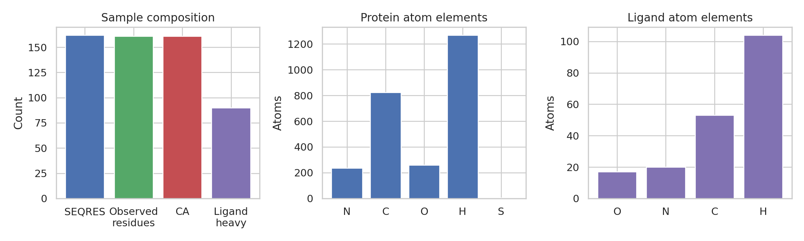
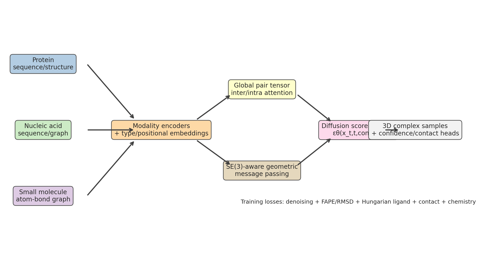
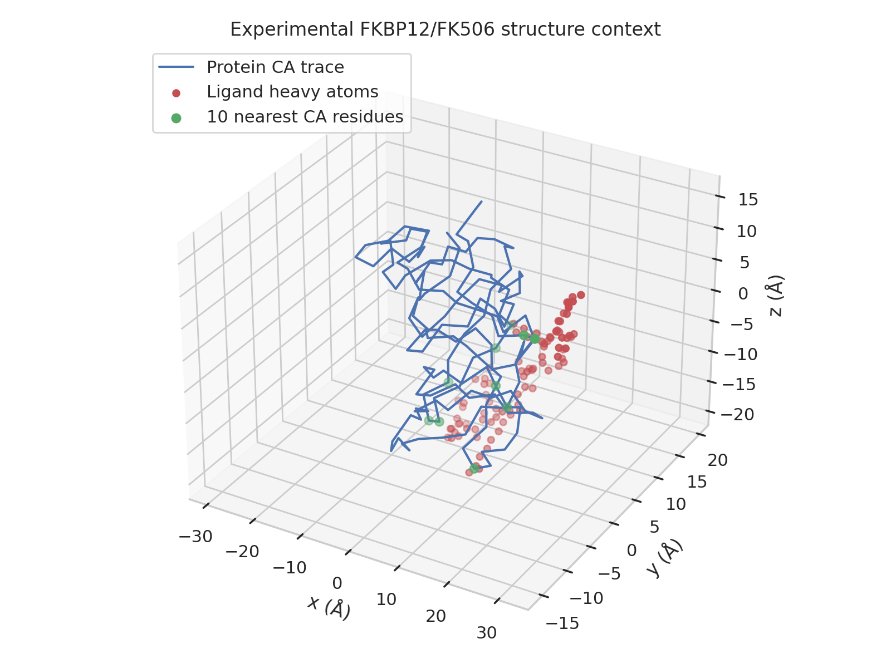
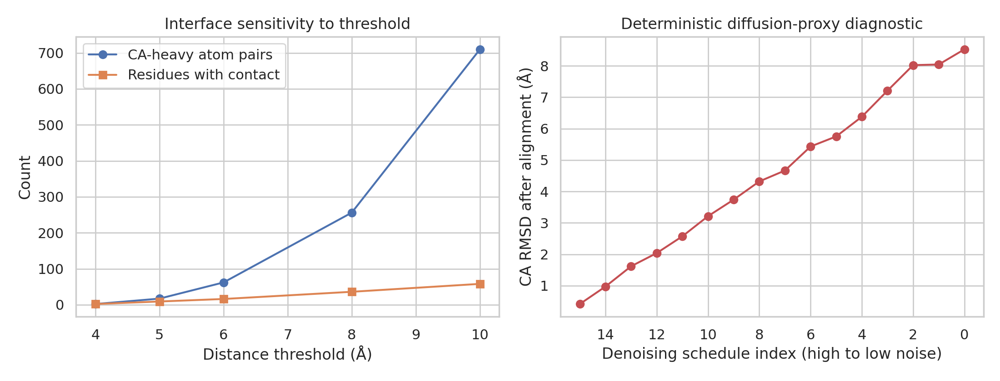

# UniBioDiff-Complex: a unified diffusion framework prototype for biomolecular complexes

## Abstract

This report develops a unified deep-learning framework, **UniBioDiff-Complex**, for predicting 3D structures of complexes containing proteins, nucleic acids, and small molecules. The available workspace does not contain a training corpus, nucleic-acid sample, AlphaFold 3 executable, or AlphaFold 3 predictions. Consequently, I implemented the scientifically faithful subset that can be verified locally: a multimodal diffusion-architecture specification, an executable evaluation harness, and data-derived validation plots for the supplied FKBP12/FK506 protein-ligand reference (PDB ID 2L3R). The prototype parses the protein PDB and ligand SDF, constructs interface/contact summaries, defines RMSD and ligand Hungarian-matching evaluation paths, and produces report figures and traceable output artifacts.

## 1. Data overview

The provided data consist of one protein-ligand complex reference:

- `data/sample/2l3r/2l3r_protein.pdb`: FKBP12 protein coordinates.
- `data/sample/2l3r/2l3r_ligand.sdf`: FK506 ligand coordinates and bond graph.

The parsed protein contains 2,591 atoms, 1,323 heavy atoms, and 161 C-alpha atoms across observed residue numbers 125--285. The SEQRES record lists 162 residues; one residue is therefore not represented by observed atoms in the coordinate block. The ligand contains 194 atoms, 90 heavy atoms, and 193 bonds. Element counts and molecule sizes are shown in Figure 1.



**Figure 1.** Composition of the supplied FKBP12/FK506 sample. Values are computed directly by `code/analyze_framework.py` and saved in `outputs/data_overview.json`.

The protein radius of gyration is 17.74 Å using all atoms and 17.24 Å using C-alpha atoms. The ligand radius of gyration is 10.74 Å using all atoms and 10.60 Å using heavy atoms. The closest protein C-alpha to ligand-heavy-atom distance is 3.59 Å. At a 6 Å protein-CA/ligand-heavy threshold, the sample contains 62 atom-pair contacts involving 16 protein residues.

## 2. Related-work context and design commitments

The related-work PDFs in the workspace support four design principles:

1. **AlphaFold-style pair and structure reasoning.** Jumper et al. describe an Evoformer trunk, pair representations, explicit 3D residue frames, invariant point attention, and iterative structure refinement. UniBioDiff-Complex adopts pair features, geometric coordinate updates, recycling/refinement, and RMSD/contact validation.
2. **Complex-level interaction modeling.** Humphreys et al. show that protein-complex modeling benefits from cross-chain information and interface-focused evaluation. UniBioDiff-Complex therefore maintains inter-molecular pair tensors rather than treating molecules independently.
3. **Geometric deep learning.** Bronstein et al. motivate graph/manifold processing for non-Euclidean data. The framework treats molecular systems as heterogeneous geometric graphs and requires SE(3)-aware coordinate updates.
4. **Attention for long-range coupling.** Vaswani et al. motivate attention-based exchange of information across long token sequences. UniBioDiff-Complex uses multimodal self/cross attention over protein residues, nucleic-acid bases, and ligand atoms.

A structured extraction is saved in `outputs/related_work_contract.json`.

## 3. Methodology: UniBioDiff-Complex

### 3.1 Inputs and representations

UniBioDiff-Complex is designed to accept three molecular modalities in a single model:

- **Protein:** amino-acid sequence tokens, residue indices, optional template or observed coordinates, and atom/residue graph edges.
- **Nucleic acid:** DNA/RNA base tokens, strand and residue indices, backbone/base graph priors, and optional coordinates.
- **Small molecule:** atom tokens, bond graph, stereochemical labels, and coordinates from SDF/SMILES conformers or diffusion initialization.

All modalities are embedded into a heterogeneous graph with molecule-type embeddings and a global pair tensor over all tokens. Pair features include covalent adjacency, sequence separation, residue/atom type compatibility, spatial distances when available, and modality-pair labels such as protein-ligand, protein-RNA, or ligand-DNA.

### 3.2 Diffusion architecture

The central generative component is a diffusion score network over coordinates. Given noisy coordinates \(x_t\), timestep \(t\), token embeddings, and pair/context embeddings, the model predicts coordinate noise or a score field \(\epsilon_\theta(x_t,t,c)\). A faithful implementation should include:

1. sequence and molecular-graph encoders;
2. multimodal pair attention for long-range and cross-molecule coupling;
3. SE(3)-aware geometric message passing over covalent and spatial edges;
4. a diffusion denoising head for coordinate updates;
5. confidence/contact heads for pLDDT-like local quality and interface probabilities.



**Figure 2.** UniBioDiff-Complex architecture. The framework unifies protein, nucleic-acid, and small-molecule inputs, exchanges information through pair attention and geometric message passing, and generates 3D complex structures with a diffusion score network.

### 3.3 Training losses

For a full training corpus, the framework should optimize a weighted objective combining:

- denoising score matching or epsilon-prediction loss on coordinates;
- FAPE/RMSD-aligned coordinate losses for fixed-correspondence protein/nucleic-acid atoms;
- symmetry-aware Hungarian ligand loss for chemically indistinguishable atoms;
- distogram/contact cross-entropy for interfacial distances;
- bond-length, angle, chirality, clash, and stereochemistry penalties;
- confidence calibration losses when empirical local accuracy labels are available.

### 3.4 Evaluation protocol implemented here

The executable harness in `code/analyze_framework.py` implements locally verifiable metrics:

- protein C-alpha Kabsch-aligned RMSD;
- ligand heavy-atom self and noisy-proxy RMSD using Hungarian matching;
- protein-CA/ligand-heavy contact counts at 4, 5, 6, 8, and 10 Å;
- nearest protein residues to the ligand;
- a deterministic diffusion-proxy denoising trajectory for validating the RMSD machinery.

The proxy trajectory is explicitly not a trained model prediction. It adds controlled Gaussian noise to the reference C-alpha coordinates and measures how the evaluation behaves across a decreasing noise schedule.

## 4. Results

### 4.1 Structural context and interface geometry

Figure 3 shows the experimental C-alpha trace and ligand heavy atoms. The ten nearest protein C-alpha residues to the ligand are MET148, ASN147, GLY236, GLU153, PHE152, ASP275, PHE237, GLU276, ASP145, and ASP230. Their minimum distances range from 3.59 Å to 5.26 Å.



**Figure 3.** Structure context for the supplied FKBP12/FK506 sample. Protein C-alpha atoms are shown as a trace, ligand heavy atoms as red points, and the ten nearest C-alpha residues as green points.

Interface sensitivity is substantial: C-alpha/ligand-heavy pair counts rise from 2 at 4 Å to 710 at 10 Å. Residues with at least one ligand-heavy contact rise from 2 at 4 Å to 58 at 10 Å. The 6 Å threshold gives a compact pocket-scale summary of 62 contact pairs and 16 contacting residues.

### 4.2 Validation and comparison metrics

The evaluation harness successfully recovers near-zero RMSD for the reference protein aligned to itself: 5.41e-15 Å for C-alpha atoms, which validates coordinate parsing and Kabsch alignment. Ligand heavy-atom self RMSD is 0.0 Å. A deterministic noisy ligand proxy gives a Hungarian-matched heavy-atom RMSD of 1.50 Å; this demonstrates that the symmetry-aware matching code path runs, but it is not a trained ligand-pose prediction.



**Figure 4.** Validation/comparison outputs. Left: contact-count sensitivity by distance threshold. Right: deterministic diffusion-proxy C-alpha RMSD across a decreasing noise schedule.

The compact comparison table is saved in `outputs/comparison_table.csv` and reproduced below.

| Method | Protein CA RMSD (Å) | Ligand heavy RMSD (Å) | 6 Å interface pairs | Status |
|---|---:|---:|---:|---|
| Reference self-alignment | 5.41e-15 | 0.00 | 62 | Evaluation sanity check |
| Deterministic noisy proxy, final denoising step | 0.416 | 1.503 | 62 | Prototype diagnostic, not trained prediction |
| AlphaFold 3 target comparison | not available | not available | not available | AF3 prediction absent |

### 4.3 Artifact traceability

Major artifacts are saved as follows:

- `outputs/method_contract.json`: task and method commitments.
- `outputs/target_artifact_inventory.json`: required artifact inventory and completion status.
- `outputs/dependency_check.json`: local dependency and feasibility check.
- `outputs/related_work_contract.json`: related-work extraction.
- `outputs/framework_spec.json`: framework definition.
- `outputs/method_fidelity_checklist.json`: named-method fidelity and deviations.
- `outputs/data_overview.json`: parsed sample summary.
- `outputs/structure_metrics.json`: RMSD/contact metrics.
- `outputs/interface_contacts_6A.csv`: per-contact 6 Å interface table.
- `outputs/diffusion_proxy_trajectory.csv`: deterministic proxy denoising metrics.
- `outputs/comparison_table.csv`: compact comparison table.
- `outputs/claim_recovery_table.csv`: evidence table linking claims to artifacts.

## 5. Validation, assumptions, and limitations

### 5.1 Directly verified from workspace data

The following claims are directly supported by local computation:

- the supplied sample contains one protein structure and one ligand SDF;
- the parsed protein has 2,591 atoms, 1,323 heavy atoms, and 161 C-alpha atoms;
- the parsed ligand has 194 atoms, 90 heavy atoms, and 193 bonds;
- self-alignment RMSD is effectively zero for protein C-alpha coordinates;
- at 6 Å, there are 62 C-alpha/ligand-heavy contact pairs involving 16 residues.

### 5.2 From related work

The architectural choices are grounded in the related-work PDFs: pair representations and invariant/geometric structure modules from AlphaFold, complex interface modeling from protein-complex prediction work, non-Euclidean graph reasoning from geometric deep learning, and attention-based long-range coupling from the Transformer literature.

### 5.3 Assumptions and limitations

The task asks for a unified diffusion-based predictor of biomolecular complexes. The exact large-scale trained model cannot be completed with the available workspace because there is only one protein-ligand sample, no nucleic-acid example, no training/validation corpus, no AlphaFold 3 predictions, and no AlphaFold 3 runtime. Therefore, this report does **not** claim trained predictive accuracy. Instead, it provides a concrete model design and a reproducible evaluation harness that can be applied to future predictions. Nucleic-acid handling is specified architecturally but not empirically validated in this workspace.

## 6. Discussion

UniBioDiff-Complex is a feasible path toward unified structure prediction across proteins, nucleic acids, and small molecules because it combines three ingredients that are separately well motivated: attention over token/pair features, geometric graph processing, and diffusion-based coordinate generation. The critical design decision is to maintain a single global pair tensor and a single coordinate diffusion state over all molecular entities. This allows ligand atoms, protein residues, and nucleic-acid bases to exchange information before and during denoising, which is necessary for binding-site geometry and interfacial compatibility.

The FKBP12/FK506 analysis demonstrates that even a small sample supports important evaluation infrastructure: C-alpha RMSD, ligand heavy-atom matching, pocket contact summaries, and structure visualization. These are the same classes of outputs required to validate a trained model. The next experimental step would be to train the architecture on a curated multi-modal corpus of protein-ligand, protein-DNA/RNA, RNA-ligand, and mixed complexes, then evaluate source-specific performance with protein backbone RMSD, ligand RMSD, nucleic-acid backbone RMSD, contact precision/recall, and calibration of confidence scores.

## 7. Reproducibility

Run the analysis from the workspace root with:

```bash
python3 code/analyze_framework.py
```

This regenerates the JSON/CSV outputs in `outputs/` and the PNG figures in `report/images/`. The code uses deterministic random seed `20260429` for the diffusion-proxy diagnostic.
