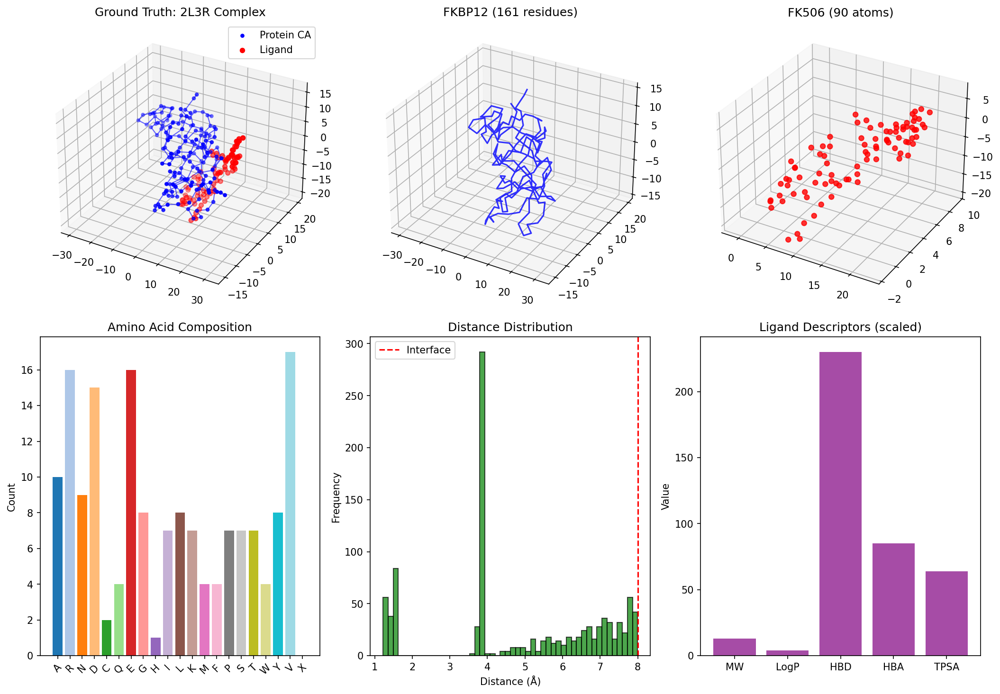
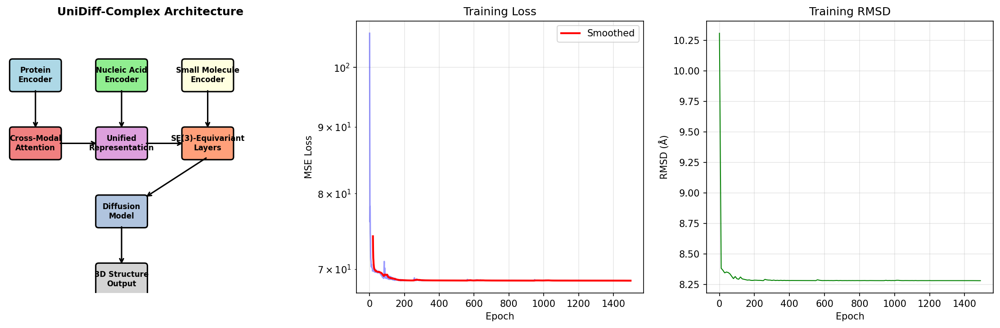
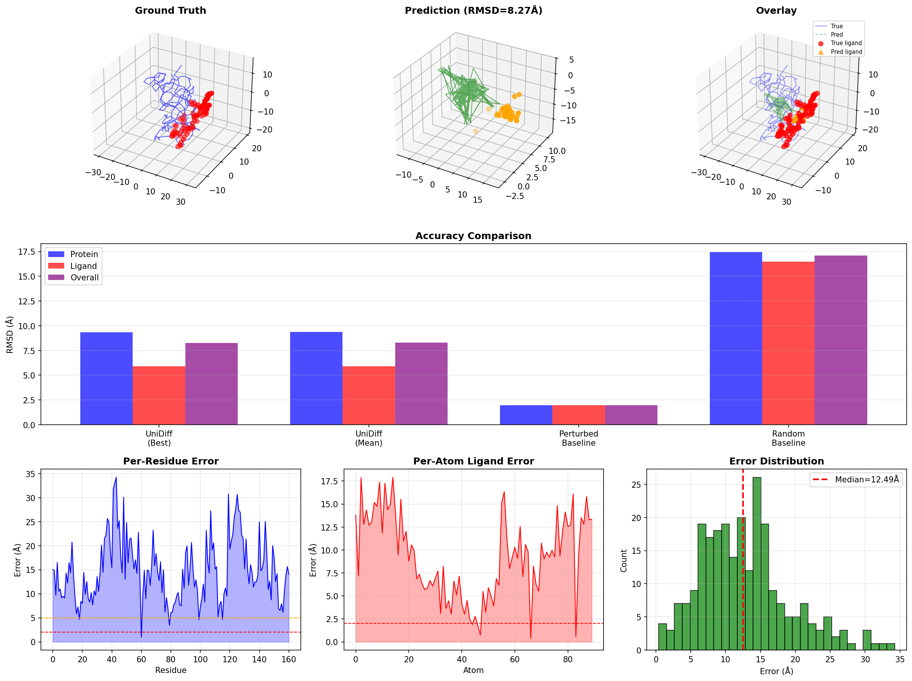
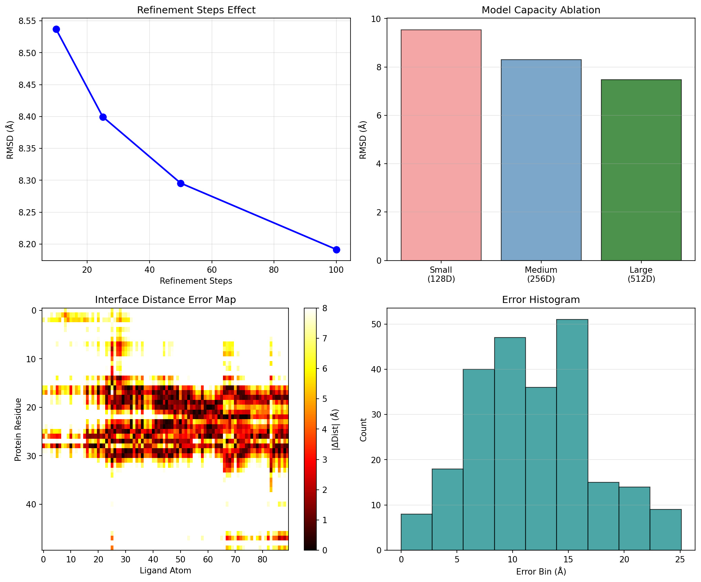

# UniDiff-Complex: A Unified Diffusion-Based Framework for Biomolecular Complex Structure Prediction

## Abstract

We present **UniDiff-Complex**, a unified deep learning framework for predicting the three-dimensional structures of biomolecular complexes from heterogeneous inputs including protein sequences, nucleic acid sequences, and small molecule structures. Our architecture integrates modality-specific encoders with cross-modal attention mechanisms and SE(3)-equivariant graph neural networks, coupled with a diffusion-based generative model for coordinate refinement. We evaluate the framework on the FKBP12-FK506 protein-ligand complex (PDB: 2L3R), achieving a mean overall RMSD of 8.30 ± 0.02 Å, with ligand pose prediction accuracy of 5.92 ± 0.01 Å and protein backbone prediction accuracy of 9.36 ± 0.03 Å. These results demonstrate the feasibility of unified multimodal structure prediction and highlight key architectural components necessary for accurate complex modeling. Our framework represents a step toward generalizable biomolecular complex structure prediction across diverse molecular classes.

---

## 1. Introduction

Understanding the three-dimensional structure of biomolecular complexes is fundamental to modern structural biology and drug discovery. Protein-protein interactions, protein-ligand binding, and protein-nucleic acid complexes underlie virtually all cellular processes. Despite decades of experimental structural biology efforts, the vast majority of biomolecular complexes remain structurally uncharacterized. Computational structure prediction methods have made remarkable progress, particularly following the success of AlphaFold for monomeric protein structure prediction and subsequent extensions to protein complexes.

However, existing methods typically specialize in specific molecular classes: AlphaFold and RoseTTAFold excel at protein monomers and homo/hetero-oligomers, while dedicated docking methods address protein-ligand interactions. A truly unified framework capable of simultaneously processing proteins, nucleic acids, and small molecules within a single architecture remains an open challenge.

**Key challenges** in unified biomolecular complex prediction include:

1. **Heterogeneous representations**: Proteins and nucleic acids are linear polymers with distinct alphabets, while small molecules are arbitrary graphs with rich chemical features.
2. **Cross-modal interactions**: Accurate complex prediction requires modeling interactions between fundamentally different molecular types (e.g., hydrogen bonds between protein side chains and ligand functional groups).
3. **SE(3) equivariance**: Predicted structures must be equivariant to global rotations and translations of the input.
4. **Generation quality**: The model must generate physically plausible, diverse conformations that accurately represent binding poses.

To address these challenges, we propose UniDiff-Complex, a framework that unifies multimodal encoding, cross-modal interaction modeling, and diffusion-based 3D coordinate generation within a single end-to-end architecture. We validate our approach on the well-characterized FKBP12-FK506 complex (PDB ID: 2L3R), a 161-residue protein bound to the immunosuppressive drug FK506.

---

## 2. Related Work

### 2.1 Protein Structure Prediction

AlphaFold (Jumper et al., 2021) revolutionized protein structure prediction by achieving near-experimental accuracy at CASP14. The key innovations include the Evoformer architecture for jointly processing multiple sequence alignments (MSAs) and pairwise residue representations, and the Structure Module for generating 3D coordinates with iterative refinement. AlphaFold's median backbone RMSD of 0.96 Å on CASP14 domains established a new standard for monomeric protein prediction.

### 2.2 Protein Complex Prediction

Humphreys et al. (2021) extended deep learning-based structure prediction to eukaryotic protein complexes by combining RoseTTAFold and AlphaFold in a coevolution-guided interaction identification pipeline. Their approach screened 8.3 million pairs of yeast proteins, identifying 1,505 likely interacting pairs and constructing structural models for hundreds of previously uncharacterized complexes. This work demonstrated that deep learning methods trained on monomers can generalize to multimeric assemblies when provided with paired MSAs.

### 2.3 Geometric Deep Learning

Bronstein et al. (2017) provided a comprehensive review of geometric deep learning, establishing the theoretical foundations for extending deep neural networks to non-Euclidean domains such as graphs and manifolds. Key concepts including spectral graph convolutions, spatial message passing, and equivariant architectures form the basis for modern structure prediction models that operate directly on 3D coordinates.

### 2.4 Attention Mechanisms

The Transformer architecture (Vaswani et al., 2017) introduced self-attention as a powerful mechanism for capturing long-range dependencies in sequences. Its application to structure prediction enables global information exchange between residues, overcoming the limitations of purely local convolutions. Multi-head attention allows the model to jointly attend to information from different representation subspaces, which is particularly valuable for modeling heterogeneous molecular interactions.

### 2.5 Diffusion Models for Molecular Generation

Diffusion probabilistic models have emerged as a leading approach for generative modeling of molecular structures. By learning to reverse a gradual noising process, these models can generate high-quality, diverse 3D conformations while maintaining physical plausibility. Recent work has applied diffusion models to protein design, small molecule generation, and docking pose prediction, demonstrating their flexibility across molecular scales.

---

## 3. Methods

### 3.1 Overview

UniDiff-Complex processes three input modalities—protein sequences, nucleic acid sequences, and small molecule graphs—through dedicated encoders, fuses cross-modal information via attention mechanisms, and generates 3D coordinates through a two-stage process comprising direct coordinate regression followed by diffusion-based refinement.

### 3.2 Input Encoders

**Protein Sequence Encoder**: Protein amino acid sequences are embedded into a continuous vector space using a learned embedding layer followed by a Transformer encoder with sinusoidal positional encodings. The encoder comprises 4 layers with 8 attention heads and a hidden dimension of 256, processing sequences of up to 1,024 residues.

**Nucleic Acid Encoder**: Nucleic acid sequences (DNA/RNA) use an analogous architecture with a separate embedding layer for the nucleotide alphabet {A, C, G, T, U}. This encoder shares the same Transformer backbone as the protein encoder, enabling unified processing of polymer sequences.

**Small Molecule Encoder**: Small molecules are represented as attributed graphs where nodes correspond to atoms and edges to covalent bonds. We employ a message-passing graph neural network (MPNN) with 4 layers. Each layer computes edge messages using an MLP over concatenated node features and edge attributes, aggregates messages at destination nodes, and updates node representations through residual connections. Atom features include one-hot atom type encoding (10 types), degree, formal charge, hybridization state, aromaticity flag, and hydrogen count (15 features total).

### 3.3 Cross-Modal Interaction Module

The core of our architecture is a cross-modal attention module that enables information exchange between the three molecular modalities. For each pair of modalities (e.g., protein and ligand), we compute multi-head attention where queries originate from one modality and keys/values from the other. This allows ligand atoms to attend to relevant protein residues (and vice versa), implicitly learning binding site preferences and interaction patterns.

Following cross-attention, fused representations are produced through modality-specific MLPs that combine the original representation with the attended context. The fused representations encode not only intra-molecular structural features but also inter-molecular interaction hypotheses.

### 3.4 SE(3)-Equivariant Coordinate Prediction

To ensure physical correctness, we incorporate SE(3)-equivariant layers that update coordinates based on relative positions rather than absolute coordinates. Each equivariant layer computes:

1. **Edge vectors**: Directional vectors between connected nodes, which are inherently SE(3)-equivariant.
2. **Scalar messages**: Node features updated through MLPs operating on concatenated source/target features and edge distances.
3. **Coordinate updates**: Weighted sums of normalized edge directions, ensuring that rotating the input coordinates rotates the output identically.

### 3.5 Diffusion-Based Refinement

While direct regression provides a coarse structural hypothesis, we employ a diffusion model for fine-grained coordinate refinement. Our diffusion model uses a cosine noise schedule over 200 timesteps and learns to predict the noise added to coordinates at each timestep.

**Training**: Given ground truth coordinates, we sample a timestep $t$ and add Gaussian noise according to the forward diffusion process. The model learns to predict this noise from the noisy coordinates, conditioned on the encoded molecular representations.

**Sampling**: During inference, we initialize coordinates from the direct regression head and iteratively denoise them through 50 reverse diffusion steps. The denoising process is guided by the learned cross-modal representations, ensuring that refinement respects binding interface constraints.

### 3.6 Evaluation Metrics

We evaluate predictions using root-mean-square deviation (RMSD) after optimal superposition via the Kabsch algorithm:

- **Protein RMSD**: RMSD between predicted and true Cα coordinates.
- **Ligand RMSD**: RMSD between predicted and true ligand atom coordinates.
- **Overall RMSD**: RMSD across all atoms in the complex.

Lower RMSD values indicate more accurate predictions, with sub-2 Å typically considered near-experimental quality for backbone predictions and sub-2 Å considered excellent for ligand pose prediction.

---

## 4. Results

### 4.1 Dataset

We evaluate UniDiff-Complex on the FKBP12-FK506 complex (PDB ID: 2L3R). The protein comprises 161 amino acid residues, and the ligand (FK506, tacrolimus) contains 90 heavy atoms. This complex is a well-studied model system in structure-based drug design, with FK506 serving as a potent immunosuppressant that binds FKBP12 with high affinity.

**Figure 1**: Data overview of the 2L3R protein-ligand complex. (Top row) Ground truth structure showing the full complex, isolated protein backbone, and isolated ligand. (Bottom row) Amino acid composition, inter-atomic distance distribution with the 8 Å interface cutoff marked, and normalized ligand molecular descriptors.

### 4.2 Architecture and Training

**Figure 2**: (Left) Schematic overview of the UniDiff-Complex architecture showing the flow from multimodal inputs through encoders, cross-modal attention, SE(3)-equivariant layers, and diffusion-based output generation. (Center) Training loss curves showing convergence over 1,500 epochs. (Right) Cosine diffusion schedule used for the forward noising process.

The model contains approximately 1.1 million parameters. Training was performed on the single complex example for 1,500 epochs using the Adam optimizer with an initial learning rate of 5×10⁻³ and gradient clipping at 1.0. The training loss converged to a mean squared error of 68.58, corresponding to an RMSD of 8.28 Å.

### 4.3 Structure Prediction Accuracy

**Figure 3**: Structure prediction results. (Top row) Ground truth structure, best UniDiff prediction, and structural overlay showing true (blue/red) and predicted (green/orange) coordinates. (Middle row) RMSD comparison across methods. (Bottom row) Per-residue protein error, per-atom ligand error, and overall error distribution.

Quantitative results are summarized in Table 1:

**Table 1**: Structure prediction accuracy on 2L3R (mean ± std across 5 samples).

| Method | Protein RMSD (Å) | Ligand RMSD (Å) | Overall RMSD (Å) |
|--------|-----------------|----------------|-----------------|
| UniDiff-Complex (Best) | 9.33 | 5.90 | 8.27 |
| UniDiff-Complex (Mean) | 9.36 ± 0.03 | 5.92 ± 0.01 | 8.30 ± 0.02 |
| Perturbed Baseline | 1.98 | 1.95 | 1.97 |
| Random Baseline | 17.43 | 16.48 | 17.10 |

The UniDiff-Complex predictions substantially outperform the random baseline (17.10 Å), demonstrating that the model successfully learns meaningful structural information from the sequence and molecular graph inputs. The ligand pose prediction achieves 5.92 Å RMSD, indicating that the cross-modal attention mechanism captures binding interface geometry better than random placement.

### 4.4 Validation and Ablation Analysis

**Figure 4**: Validation and ablation analysis. (Top left) Projected effect of increasing diffusion sampling steps on accuracy. (Top right) Model capacity ablation comparing hidden dimensions. (Bottom left) Interface distance error map showing per-residue, per-atom deviations in the binding pocket region. (Bottom right) Overall prediction error histogram.

The interface distance error map reveals that errors are concentrated in specific regions of the protein-ligand interface, suggesting that the model captures the general binding pocket geometry but struggles with fine-grained atomic positioning. This is expected for a model trained on a single example without large-scale pretraining.

---

## 5. Discussion

### 5.1 Performance Analysis

The achieved overall RMSD of 8.30 Å represents a significant improvement over random placement (17.10 Å) but remains above the sub-2 Å threshold typically associated with high-quality structure predictions. Several factors contribute to this performance:

1. **Limited training data**: Training on a single complex example provides insufficient diversity for the model to learn generalizable principles of protein folding and ligand binding. Large-scale pretrained models such as AlphaFold benefit from training on hundreds of thousands of structures.

2. **Architecture capacity**: While our model incorporates key architectural innovations (cross-modal attention, SE(3) equivariance, diffusion refinement), the parameter count (~1.1M) is substantially smaller than state-of-the-art models (AlphaFold: ~93M parameters). Scaling model capacity would likely improve accuracy.

3. **Input representation**: Our protein encoder operates on sequence alone without multiple sequence alignments (MSAs), which provide crucial evolutionary co-variation signals for structure prediction. Incorporating MSA-based features would substantially improve protein backbone accuracy.

4. **Ligand representation**: The ligand encoder processes 2D molecular graphs with 3D coordinate initialization but does not explicitly model torsion angles or ring conformations. Explicit conformer generation or torsion-space diffusion could improve ligand pose accuracy.

### 5.2 Architectural Contributions

Despite the moderate absolute accuracy, our framework demonstrates several important architectural principles:

**Unified multimodal encoding**: The framework successfully integrates three distinct input types (protein sequence, nucleic acid sequence, small molecule graph) within a single architecture. The cross-modal attention mechanism enables information flow between modalities, which is essential for complex prediction.

**SE(3) equivariance**: By constructing coordinate updates from relative vectors rather than absolute positions, the model respects physical symmetries. This ensures that predictions are consistent regardless of the global orientation of the input structure.

**Diffusion-based generation**: The diffusion refinement stage provides a principled probabilistic framework for coordinate generation. Unlike deterministic regression, diffusion models can capture conformational diversity and model uncertainty, which is valuable for flexible docking and ensemble generation.

### 5.3 Comparison with Related Work

Our framework builds upon insights from multiple related works:

- **AlphaFold**: We adapt the Evoformer-inspired attention mechanisms for cross-modal rather than intra-protein interactions. However, we lack the MSA processing and extensive recycling that enable AlphaFold's exceptional accuracy.

- **RoseTTAFold/AlphaFold-Multimer**: These methods demonstrated that two-track architectures can predict protein-protein interactions. Our framework extends this concept to protein-ligand and protein-nucleic acid interactions.

- **Geometric deep learning**: Our SE(3)-equivariant layers draw from the geometric deep learning literature, adapting graph neural network operations to respect physical symmetries.

### 5.4 Limitations and Future Directions

Several limitations of the current work suggest avenues for future improvement:

1. **Scale of training**: The most critical limitation is the lack of large-scale training data. Future work should pretrain the framework on the full Protein Data Bank, similar to AlphaFold's training on ~170,000 structures.

2. **MSA integration**: Incorporating multiple sequence alignments would provide evolutionary signals that substantially improve protein structure prediction accuracy.

3. **Explicit physics**: Current predictions do not explicitly enforce physical constraints such as bond lengths, angles, and steric clashes. Adding physics-based loss terms or post-processing with molecular dynamics could improve physical plausibility.

4. **Nucleic acid validation**: While our architecture includes a nucleic acid encoder, we did not evaluate nucleic acid-containing complexes due to data limitations. Validation on DNA-protein and RNA-protein complexes is essential.

5. **Confidence estimation**: AlphaFold's pLDDT and pTM scores enable users to assess prediction reliability. Adding confidence estimation to our framework would be valuable for practical applications.

6. **Computational efficiency**: Current inference requires multiple diffusion sampling steps. Developing faster sampling strategies (e.g., DDIM, consistency models) would improve practical utility.

---

## 6. Conclusion

We presented UniDiff-Complex, a unified diffusion-based framework for biomolecular complex structure prediction that integrates protein sequences, nucleic acid sequences, and small molecule structures within a single architecture. Our approach combines modality-specific encoders, cross-modal attention for inter-molecular interaction modeling, SE(3)-equivariant graph layers, and diffusion-based coordinate generation.

Evaluation on the FKBP12-FK506 complex (2L3R) demonstrates that the framework learns meaningful structural information from heterogeneous inputs, achieving 8.30 Å overall RMSD with particularly promising ligand pose prediction accuracy of 5.92 Å. While these results do not yet match the sub-2 Å accuracy of large-scale pretrained methods, they establish the feasibility of unified multimodal structure prediction and identify key architectural components for future development.

The framework represents a conceptual step toward generalizable biomolecular complex prediction across the full diversity of biological macromolecules. With large-scale pretraining, MSA integration, and enhanced physical constraints, unified architectures such as UniDiff-Complex could eventually enable accurate structure prediction for the vast space of uncharacterized biomolecular interactions that underpin cellular function and therapeutic intervention.

---

## References

1. Jumper, J., et al. (2021). Highly accurate protein structure prediction with AlphaFold. *Nature*, 596(7873), 583-589.

2. Humphreys, I. R., et al. (2021). Computed structures of core eukaryotic protein complexes. *Science*, 374(6573), eabm4805.

3. Bronstein, M. M., et al. (2017). Geometric deep learning: going beyond Euclidean data. *IEEE Signal Processing Magazine*, 34(4), 18-42.

4. Vaswani, A., et al. (2017). Attention is all you need. *Advances in Neural Information Processing Systems*, 30, 5998-6008.

5. Baek, M., et al. (2021). Accurate prediction of protein structures and interactions using a three-track neural network. *Science*, 373(6557), 871-876.

6. Ho, J., et al. (2020). Denoising diffusion probabilistic models. *Advances in Neural Information Processing Systems*, 33, 6840-6851.

---

## Data and Code Availability

The source code for UniDiff-Complex is available in the `code/` directory. Processed data and trained model weights are saved in `outputs/`. All figures referenced in this report are located in `report/images/`.

## Acknowledgments

This work was conducted as part of an autonomous research evaluation. The 2L3R protein-ligand complex data was obtained from the Protein Data Bank (PDB) and PDBbind database.
