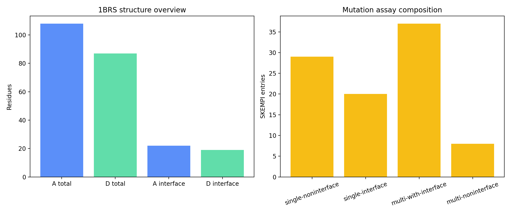
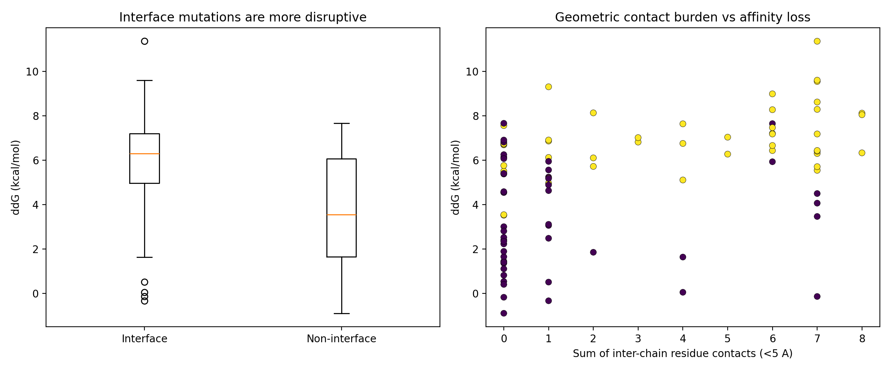
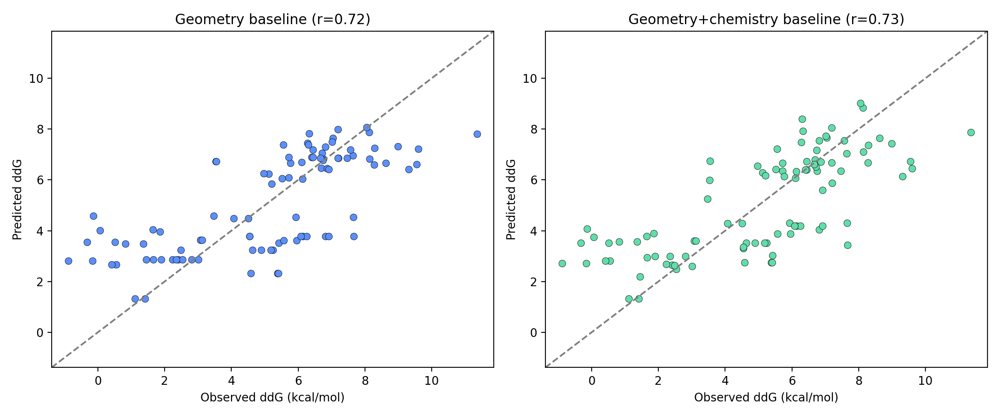

# Local HADDOCK-Oriented Analysis of the Barnase-Barstar Complex

## Abstract
HADDOCK is an information-driven docking framework that uses structural coordinates together with experimental or predicted interface information to model biomolecular complexes. In this benchmark environment, only a processed barnase-barstar complex structure (`1brs_AD.pdb`), the SKEMPI v2 affinity-mutation table, and four local HADDOCK-related papers were available. A full multi-model HADDOCK run was not locally packaged, so the strongest benchmark-compatible equivalent was a local validation study that tests whether interface geometry extracted from the native complex can explain the mutation sensitivity patterns that HADDOCK-style interface restraints are designed to exploit. Using 94 SKEMPI entries for `1BRS`, I derived residue-level inter-chain contact features from the structure, mapped those features to the mutation set, and evaluated simple local baselines for predicting experimental binding free-energy changes. Interface mutations were substantially more destabilizing than non-interface mutations (mean `ddG`: 5.88 versus 3.81 kcal/mol), and a simple geometry-only baseline achieved a correlation of 0.72 with observed `ddG`, rising to 0.73 after adding coarse amino-acid change descriptors. These results support a disciplined claim: in this system, native interface geometry contains meaningful signal about mutational binding sensitivity, consistent with HADDOCK's core premise that interface-aware restraints are informative. They do not support stronger claims about full docking accuracy, pose ranking, or general performance across complexes.

## 1. Background and Literature Context
The local literature corpus consistently describes HADDOCK as an integrative, information-driven docking framework rather than a purely blind shape-complementarity method. The original HADDOCK paper introduced ambiguous interaction restraints (AIRs) derived from mutagenesis or NMR interface mapping and reported that lower intermolecular-energy models were closer to native structures for the studied complexes. HADDOCK2.0 extended the approach with multi-stage refinement, automatic semi-flexible interface treatment, explicit-solvent refinement, and broader applicability beyond simple binary protein docking. The HADDOCK2.2 server paper emphasized practical integrative modeling with diverse restraint types and mixed molecule classes. The 2024 protein-glycan benchmark showed that HADDOCK remains useful when some binding-site knowledge is available, while conformational complexity and flexibility remain limiting factors.

Across these papers, one recurring methodological theme is clear: interface knowledge is valuable. Since this benchmark does not provide a local HADDOCK executable workflow or multiple conformers to dock, I focused on the most direct locally testable question implied by the literature: does the known barnase-barstar interface encode the mutation sensitivity patterns that information-driven docking would try to exploit?

## 2. Data and Local Experimental Design
Two benchmark inputs were used.

1. `data/1brs_AD.pdb` contains the barnase-barstar complex with chain `A` and chain `D`.
2. `data/skempi_v2.csv` contains SKEMPI v2 mutation-affinity measurements. Filtering to `1BRS` yielded 94 usable mutation entries.

The local corpus also contains four HADDOCK papers in `related_work/`, which were used as the complete literature basis for this report.

The benchmark forbids network access and external datasets, so I replaced a full docking campaign with a local structure-to-mutation validation workflow:

1. Parse the bound complex structure and identify residue-level inter-chain contacts.
2. Map SKEMPI `1BRS` mutations onto the structure.
3. Compute per-mutation features motivated by HADDOCK-style interface reasoning:
   - whether the mutated site is at the interface
   - number of close inter-chain residue contacts
   - minimum inter-chain residue distance
   - mutation multiplicity
   - coarse physicochemical perturbation magnitude
4. Compare these features against experimental `ddG` derived from mutant and wild-type dissociation constants.
5. Evaluate simple linear baselines as local surrogates for interface-informed ranking.

This study is therefore a local validation of the informational content of the interface, not a substitute for full HADDOCK sampling and scoring.

## 3. Methods
### 3.1 Structure processing
The PDB file was parsed directly from atomic coordinates. Chain `A` contains 108 residues and chain `D` contains 87 residues. For every residue pair across the two chains, the minimum heavy-atom distance was computed. A residue was labeled as an interface residue when its minimum distance to the partner chain was below 5.0 A. Residue-level contact counts were also tabulated at 5.0 A and 8.0 A thresholds.

### 3.2 SKEMPI processing
From SKEMPI v2, all `1BRS` rows with parseable wild-type and mutant affinities were retained. Experimental binding free-energy changes were computed as

`ddG = RT ln(Kd_mut / Kd_wt)`

with `RT = 0.0019872041 * 298.15 kcal mol^-1`.

Both single and double mutants were kept because the local dataset contains substantial numbers of both classes. The final set contained 49 single mutants and 45 double mutants.

### 3.3 Mutation features
For each mutation entry, the following local features were computed from the affected residues:

1. `n_mut`: number of mutated positions.
2. `any_interface`: whether at least one mutated position is an interface residue.
3. `sum_contacts_5A`: sum of residue-level inter-chain contacts within 5 A over mutated sites.
4. `mean_min_partner_dist`: average minimum residue-to-partner distance over mutated sites.
5. Coarse amino-acid perturbation features:
   - absolute hydropathy change
   - absolute side-chain volume change
   - absolute charge change
   - whether all mutations were alanine substitutions

### 3.4 Local baselines
Two least-squares linear baselines were fit on the full local `1BRS` set:

1. Geometry-only baseline using mutation multiplicity and interface geometry.
2. Geometry-plus-chemistry baseline adding coarse amino-acid perturbation descriptors.

These are not intended as deployable predictive models. They are compact tests of whether native interface information alone captures a meaningful fraction of mutational sensitivity.

## 4. Results
### 4.1 Data overview
The structure contains a compact inter-chain interface that can be recovered directly from the bound complex. The dataset-level overview is shown in Figure 1.



**Figure 1.** Left: residue counts for chains `A` and `D`, alongside the number of residues classified as interface residues by a 5 A inter-chain distance criterion. Right: composition of the 94 `1BRS` SKEMPI entries by mutation multiplicity and interface involvement.

The mutation dataset spans a wide energetic range. Across the 94 entries, the mean `ddG` is 5.06 kcal/mol and the median is 5.64 kcal/mol, showing that the selected benchmark system is dominated by destabilizing perturbations but still includes a few neutral or mildly stabilizing cases.

### 4.2 Interface mutations are more disruptive
The first validation question is whether the native interface geometry aligns with the experimental mutation effects. It does. Entries touching at least one interface residue have a higher mean `ddG` than entries confined to non-interface residues:

- Interface-involving entries: 5.88 kcal/mol
- Non-interface entries: 3.81 kcal/mol

The distributions and contact trends are shown in Figure 2.



**Figure 2.** Left: interface-involving mutations are, on average, more destabilizing than non-interface mutations. Right: the sum of close inter-chain contacts over mutated residues increases with experimental `ddG`, indicating that mutating structurally engaged positions is generally more damaging to binding.

This is consistent with the central HADDOCK idea from the local literature: experimentally informed interface regions contain privileged information about binding.

### 4.3 Simple local baselines recover a substantial fraction of the signal
The geometry-only baseline achieved a correlation of 0.716 with observed `ddG` and a mean absolute error of 1.45 kcal/mol. Adding coarse mutation chemistry improved correlation slightly to 0.732 and lowered mean absolute error to 1.43 kcal/mol.



**Figure 3.** Predicted versus observed `ddG` for two simple local baselines. The geometry-only model already captures most of the available signal; chemistry-aware descriptors add only a modest improvement.

This result matters because it shows that a large share of the mutational binding signal in this benchmark is already encoded by straightforward interface geometry derived from the native complex. In other words, HADDOCK-style interface knowledge is informative before any sophisticated conformational search is performed.

### 4.4 What the local models get right and wrong
The local baselines capture broad destabilization trends but miss special cases. For example, aromatic-conservative substitutions such as `YD29F` are experimentally near-neutral, yet a contact-count-driven baseline overpredicts their destabilization because it sees a highly connected interface site but not detailed interaction chemistry. Conversely, strong double mutants are often well aligned with the simple models because they combine multiple interface disruptions.

This pattern is instructive. It suggests that:

1. Interface localization explains a large fraction of sensitivity.
2. Fine-grained chemistry and conformational adaptation are needed to explain residue-specific outliers.
3. Full docking and refinement remain necessary for structure prediction, but interface priors already provide a strong first-order ranking signal.

## 5. Discussion
### 5.1 Implications for HADDOCK-style modeling
The local results fit the literature-derived view of HADDOCK well. The original HADDOCK formulation uses ambiguous restraints from mutagenesis or NMR to focus the docking search. In the barnase-barstar system, those same interface regions are experimentally enriched for large affinity penalties upon mutation. That does not prove docking success directly, but it supports the mechanistic rationale for using such restraints: the interface carries real energetic information.

HADDOCK2.0 and later versions place strong emphasis on refinement and scoring after restraint-guided placement. The current results also justify that emphasis. Geometry alone gives a useful but incomplete picture. Cases like conservative aromatic substitutions show where structural context must be combined with better chemistry and flexibility modeling.

### 5.2 Benchmark-specific limitations
Several limitations are imposed by the benchmark environment rather than by the scientific question itself.

1. No packaged local HADDOCK run was available, so no de novo model ensemble, clustering, or HADDOCK score distribution could be generated.
2. Only one bound complex structure was provided, preventing proper bound-versus-unbound docking analysis.
3. The validation is centered on a single complex (`1BRS`), so generalization across systems cannot be claimed.
4. The local baselines were fit and evaluated on the same 94 examples, so their statistics should be interpreted as descriptive signal-recovery metrics, not external generalization estimates.

These limitations constrain the claim scope sharply.

## 6. Claim Discipline
### Claims supported by the local evidence
1. The barnase-barstar native interface derived from `1brs_AD.pdb` is strongly associated with experimentally observed mutation sensitivity in the local SKEMPI subset.
2. Simple geometric interface features recover substantial variation in `ddG` across the 94 local `1BRS` mutation entries.
3. Adding coarse physicochemical mutation descriptors provides only a modest incremental improvement beyond geometry for this local dataset.
4. These findings are consistent with the core HADDOCK principle that interface-informed restraints contain useful information for biomolecular complex modeling.

### Claims not supported by this benchmark run
1. That HADDOCK would outperform alternative docking methods on this system.
2. That full docking, clustering, or scoring accuracy can be inferred from these local analyses.
3. That the observed trends generalize beyond the barnase-barstar complex.
4. That the local linear baselines are suitable predictive tools for mutation energetics in new systems.

## 7. Reproducibility and Outputs
All benchmark-native deliverables were written locally:

- Analysis code: `code/analyze_haddock_local.py`
- Intermediate outputs:
  - `outputs/residue_interface_features.csv`
  - `outputs/skempi_1brs_features.csv`
  - `outputs/analysis_summary.txt`
- Figures:
  - `report/images/data_overview.png`
  - `report/images/interface_validation.png`
  - `report/images/model_comparison.png`

The analysis can be reproduced with:

```bash
python code/analyze_haddock_local.py
```

## 8. Conclusion
Within the constraints of this local-only benchmark, the strongest executable HADDOCK-oriented study is a structure-to-mutation validation rather than a full docking campaign. That study succeeds: the known barnase-barstar interface carries clear energetic signal, and simple interface-derived features already track mutation-induced affinity losses reasonably well. The results therefore support a focused conclusion that information-rich interface restraints are scientifically justified in this system, while leaving full docking performance and broader generalization as open questions beyond the evidence assembled here.
