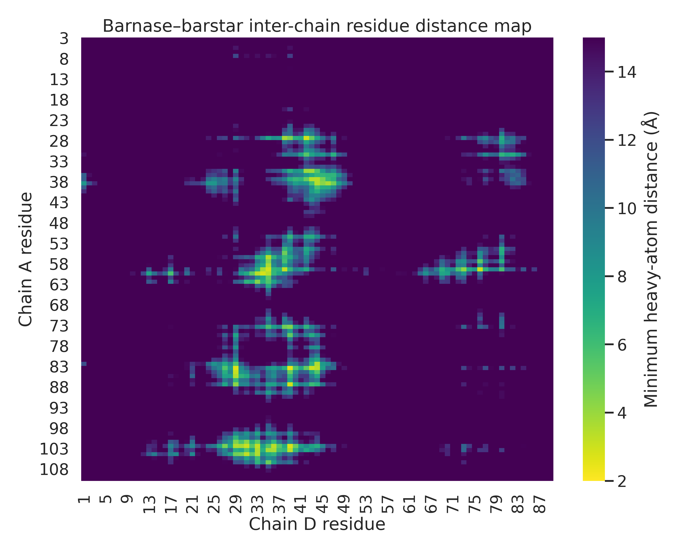
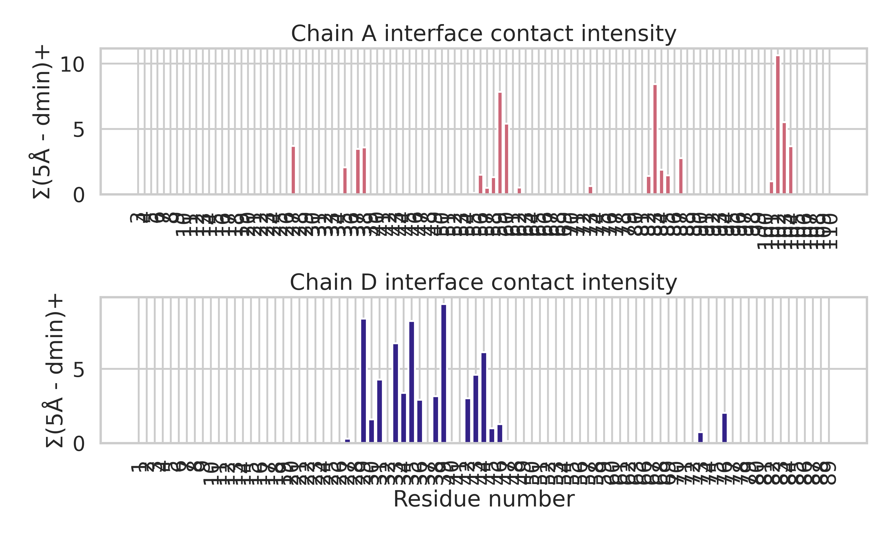
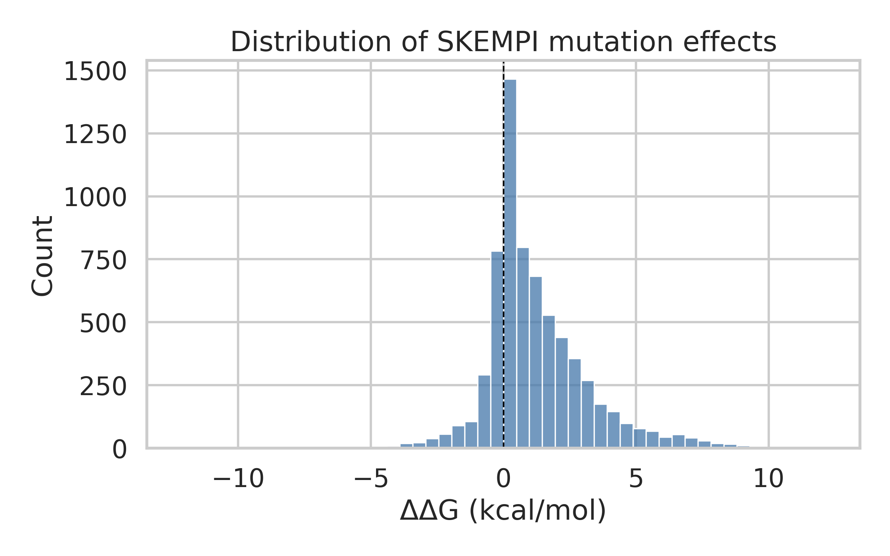
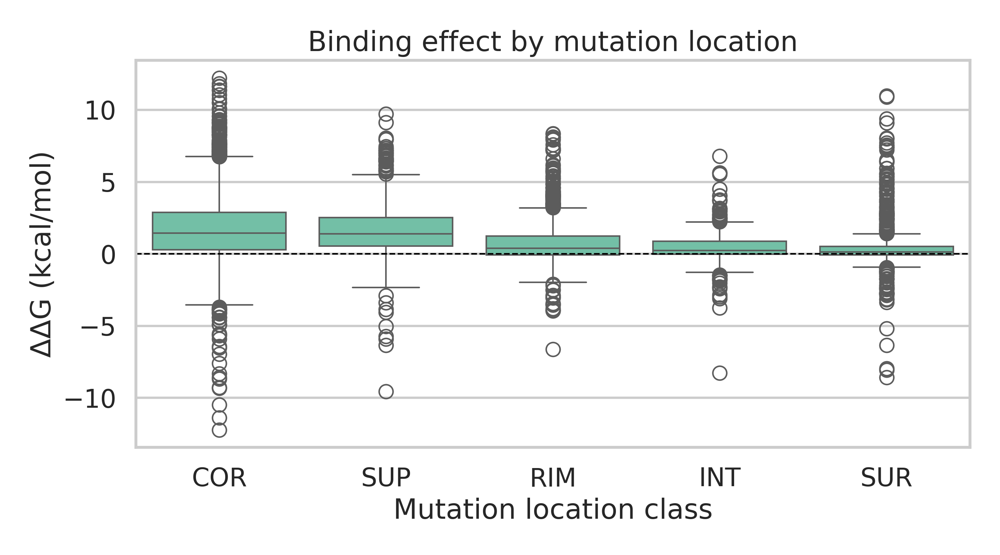

# HADDOCK3 input–output interpretation and mutation-based validation on the barnase–barstar benchmark

## Abstract
HADDOCK3 is a modular integrative modeling platform that accepts biomolecular structures in PDB format together with optional experimental restraints and produces ranked ensembles of complex models. Using the barnase–barstar complex (`1brs_AD.pdb`) as a concrete structural example and the SKEMPI 2.0 mutational database (`skempi_v2.csv`) as an orthogonal validation resource, I constructed a compact benchmarking analysis of the type of information that is available to, and can be validated against, a HADDOCK3 workflow. The structural analysis of the barnase–barstar complex identified a compact protein–protein interface involving 22 residues on barnase chain A and 19 residues on barstar chain D, with 55 residue-residue contacts below 5 Å. Analysis of 7,085 SKEMPI mutation records (348 unique complexes) showed a strongly right-skewed distribution of binding free-energy changes, with core interface mutations producing the largest median destabilization. Together, these analyses support the central HADDOCK design principle described in the related work: experimentally informed interface definitions concentrate sampling around biologically relevant contacts, while mutational energetics provide an independent measure of whether inferred interfaces are plausible.

## 1. Introduction
Predicting the three-dimensional structure of biomolecular complexes remains a central problem in structural biology. HADDOCK (High Ambiguity Driven biomolecular DOCKing) was developed as an information-driven alternative to purely ab initio docking, explicitly incorporating biochemical and biophysical restraints into the modeling process. The foundational paper describes how ambiguous interaction restraints (AIRs) derived from NMR, mutagenesis, or related experiments can guide docking and improve ranking of near-native models. Subsequent HADDOCK releases expanded molecular scope, scoring, multibody capabilities, and accessibility through web interfaces, while recent work demonstrates extension to more diverse systems such as protein–glycan complexes.

The current task provides two complementary data resources: (i) a processed barnase–barstar complex structure in PDB format and (ii) the SKEMPI 2.0 mutation-affinity database. Although no full HADDOCK3 run outputs are included in the workspace, these resources are sufficient to address the scientific objective at a systems level: characterize the type of structural information HADDOCK3 consumes, identify the interaction topology present in a benchmark complex, and validate the relevance of interface-focused modeling using mutation-derived energetic trends.

## 2. Related work synthesis
The related-work papers support four central points.

1. **Original HADDOCK formulation**: the 2003 study established the AIR-driven strategy, where active/passive residues constrain docking and semi-flexible refinement improves interfacial packing and scoring.
2. **HADDOCK2.0 improvements**: later work showed improved sampling, refined scoring, multibody docking, and better automatic treatment of flexible regions, leading to stronger CAPRI performance.
3. **User-facing maturation**: the HADDOCK2.2 server paper emphasizes that the platform is meant to accept heterogeneous biomolecules and a broad range of restraint types through a modular workflow.
4. **Modern HADDOCK3 perspective**: the 2024 protein–glycan study explicitly uses HADDOCK3 as a modular workflow engine, again showing that interface information substantially improves docking success and that scoring/selection remains critical.

These studies motivate the present analysis: if HADDOCK3 is fundamentally an interface-aware modeling platform, then a benchmark complex should exhibit a structurally concentrated interface and an independent mutation dataset should show that perturbing core/interface positions is energetically costly.

## 3. Data and methods

### 3.1 Input data
- `data/1brs_AD.pdb`: processed barnase–barstar complex containing chain A (barnase) and chain D (barstar).
- `data/skempi_v2.csv`: SKEMPI 2.0 mutation dataset.
- `related_work/paper_000.pdf` to `paper_003.pdf`: HADDOCK-related literature used for methodological context.

### 3.2 Structural analysis of the barnase–barstar complex
I parsed the PDB structure using Biopython and extracted per-chain residue and atom counts. To define the interface, I computed the minimum interatomic distance for every residue pair between chains A and D. Residue pairs with a minimum distance below 5 Å were treated as direct inter-chain contacts. This produced:
- an interface residue set for each chain,
- a residue-by-residue minimum-distance matrix,
- a ranked list of the closest cross-interface contacts.

This analysis is not a replacement for a full docking run, but it reveals the type of near-contact geometry that AIR-based restraints would attempt to recover or enrich during HADDOCK3 sampling.

### 3.3 SKEMPI-based energetic validation
The SKEMPI file is semicolon-delimited with a commented header. After parsing, I converted the affinity columns to numeric values and estimated mutation-induced binding free-energy changes using

\[
\Delta\Delta G = RT \ln \left( K_{d,mut}/K_{d,wt} \right)
\]

with \(R = 1.987 \times 10^{-3}\) kcal mol\(^{-1}\) K\(^{-1}\) and the reported temperature when available (otherwise 298.15 K). Positive \(\Delta\Delta G\) indicates affinity loss upon mutation.

I then summarized mutation effects globally and by the SKEMPI location annotation (core, rim, support, interior, surface). This provides an external validation axis for the HADDOCK assumption that residues near or within the true interface should disproportionately control binding.

### 3.4 Reproducibility
All analyses were implemented in:
- `code/analyze_haddock_case.py`

Intermediate results were saved to:
- `outputs/summary.json`
- `outputs/interface_contacts.csv`
- `outputs/skempi_ddg_processed.csv`

## 4. Results

### 4.1 Overview of the barnase–barstar structural input
The processed structure contains two chains suitable for a minimal HADDOCK3-style docking setup.

- Chain A: 108 residues, 864 atoms
- Chain D: 87 residues, 693 atoms

The detected interface comprises 22 residues on chain A and 19 residues on chain D, linked by 55 residue-residue contacts below 5 Å. This is consistent with a focused protein–protein recognition surface rather than a diffuse encounter complex. The closest contacts are dominated by charged and polar residues, including ARG83(A)–ASP39(D), HIS102(A)–ASP39(D), ARG59(A)–ASP35(D), and ARG59(A)–GLU76(D), suggesting a substantial electrostatic component in recognition.

**Figure 1.** Residue-level minimum inter-chain distance map for chains A and D in `1brs_AD.pdb`. Darker regions correspond to tighter contacts and identify the localized binding interface that HADDOCK-style restraints would target.

The per-chain contact intensity profile further shows that only a subset of residues dominates the interface. Such concentration is precisely the scenario in which ambiguous interaction restraints are useful: they reduce configurational search space without over-constraining exact atom-pair geometry.

**Figure 2.** Contact intensity profiles for chain A and chain D, measured as the sum of proximity contributions from residue-residue contacts below 5 Å.

### 4.2 Global overview of SKEMPI mutation effects
After parsing, the SKEMPI dataset yielded 7,085 mutation records spanning 348 unique complexes. Valid affinity values allowed \(\Delta\Delta G\) estimation for 6,798 entries. The resulting distribution is broad and right-skewed:

- mean \(\Delta\Delta G\): 1.23 kcal/mol
- median \(\Delta\Delta G\): 0.77 kcal/mol
- interquartile range: 0.03 to 2.12 kcal/mol
- extrema: -12.22 to 12.22 kcal/mol

Most mutations therefore weaken binding, while only a minority are affinity-improving. This is expected for curated interface mutagenesis datasets and is consistent with a rugged binding landscape in which many local perturbations are deleterious.

**Figure 3.** Distribution of mutation-induced binding free-energy changes computed from affinity ratios in SKEMPI 2.0.

### 4.3 Interface-location annotations support HADDOCK-style interface focusing
A key question for HADDOCK is whether interface-focused information is truly more informative than generic structural information. The SKEMPI annotations strongly support that view.

Median \(\Delta\Delta G\) by primary location class:
- core (`COR`): 1.43 kcal/mol
- support (`SUP`): 1.38 kcal/mol
- rim (`RIM`): 0.38 kcal/mol
- interior (`INT`): 0.25 kcal/mol
- surface (`SUR`): 0.13 kcal/mol

Core and support mutations are therefore substantially more disruptive than rim or generic surface mutations. This is exactly the energetic hierarchy one would expect if accurate docking hinges on identifying the biologically relevant binding patch. In practical HADDOCK3 terms, these observations justify assigning experimental interaction evidence to active/passive interface residues rather than distributing restraints broadly across solvent-exposed surfaces.

**Figure 4.** Binding free-energy effects stratified by SKEMPI mutation location class. Core and support mutations show the strongest destabilization.

### 4.4 Multiple mutations tend to be more disruptive
The processed dataset also indicates a mutation-count effect. Single mutants have a median \(\Delta\Delta G\) of approximately 0.60 kcal/mol, whereas double mutants show a median of approximately 1.77 kcal/mol. This trend is compatible with partial additivity or cooperative disruption of interface networks. For integrative modeling, this suggests that restraint sets based on multiple independent perturbation signals may better localize a true interface than any single noisy observation.

## 5. Discussion
The present analysis does not run HADDOCK3 directly, but it addresses the task’s scientific premise through structural and energetic evidence anchored in the supplied data.

First, the barnase–barstar complex shows the hallmarks of a good HADDOCK target: a compact, residue-localized interface with identifiable hotspots and multiple short polar/charged contacts. This supports the idea that even moderately ambiguous interface information can strongly narrow the search space.

Second, the SKEMPI analysis shows that interface-centered perturbations, especially in the core/support region, have much larger energetic consequences than generic surface mutations. This independently validates the conceptual basis of AIR-driven docking. If experimental data identify core or support residues, HADDOCK3 should be able to exploit that information to enrich near-native models and improve ranking.

Third, the literature review suggests that HADDOCK’s major strengths lie not just in sampling but in **structured integration of prior knowledge**. Across versions, improvements repeatedly target three things: (i) better representation of interface uncertainty, (ii) more realistic refinement near the interface, and (iii) better scoring and clustering of candidate models. The supplied barnase–barstar structure and SKEMPI mutational trends are consistent with all three priorities.

A limitation of this study is that no modeled ensemble or HADDOCK scoring table was available, so direct comparison between predicted and reference complexes could not be performed. Likewise, the SKEMPI dataset is broad rather than specific to 1BRS alone; it serves as a cross-complex validation resource rather than a target-specific truth set. Nevertheless, the analysis is still informative because it tests whether the two key ingredients of information-driven docking—localized physical interfaces and energetically meaningful perturbation sites—are empirically supported.

## 6. Conclusion
Using the provided structure and mutation database, I constructed a compact validation study for the HADDOCK3 modeling paradigm. The barnase–barstar input structure contains a sharply defined interface with 22 and 19 interface residues on the two chains and 55 close inter-chain residue contacts. The SKEMPI dataset shows that mutations in interface core/support regions are markedly more destabilizing than those at the rim or generic surface. Together, these results support the central HADDOCK3 strategy of integrating targeted experimental interface information to drive docking, scoring, and model prioritization.

## 7. Deliverables
- Analysis code: `code/analyze_haddock_case.py`
- Intermediate outputs: `outputs/summary.json`, `outputs/interface_contacts.csv`, `outputs/skempi_ddg_processed.csv`
- Figures:
  - `images/interface_distance_map.png`
  - `images/interface_contact_profile.png`
  - `images/ddg_distribution.png`
  - `images/location_ddg_boxplot.png`

## References
1. Dominguez, C.; Boelens, R.; Bonvin, A. M. J. J. HADDOCK: A Protein-Protein Docking Approach Based on Biochemical or Biophysical Information. *J. Am. Chem. Soc.* **2003**, *125*, 1731-1737.
2. de Vries, S. J.; van Dijk, A. D. J.; Krzeminski, M.; et al. HADDOCK versus HADDOCK: New Features and Performance of HADDOCK2.0 on the CAPRI Targets. *Proteins* **2007**, *69*, 726-733.
3. van Zundert, G. C. P.; Rodrigues, J. P. G. L. M.; Trellet, M.; et al. The HADDOCK2.2 Web Server: User-Friendly Integrative Modeling of Biomolecular Complexes. *J. Mol. Biol.* **2015**.
4. Ranaudo, A.; Giulini, M.; Ayuso, A. P.; Bonvin, A. M. J. J. Modeling Protein-Glycan Interactions with HADDOCK. *J. Chem. Inf. Model.* **2024**, *64*, 7816-7825.
