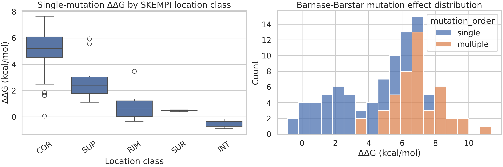
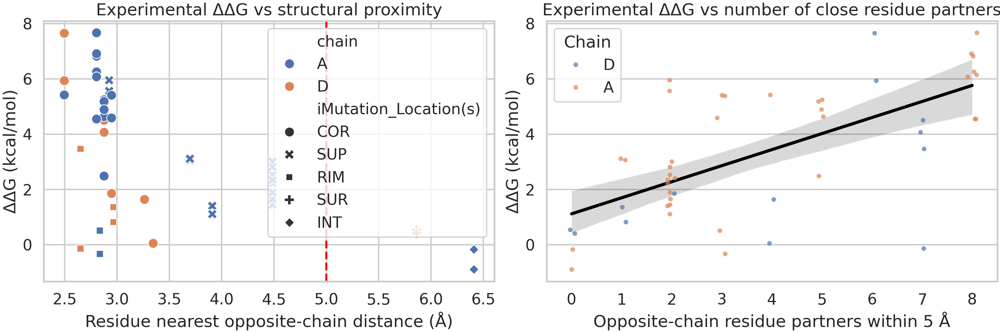

# Structural and mutational analysis of the barnase-barstar complex in a HADDOCK3 integrative-modeling context

## Abstract
HADDOCK3 is designed as a modular platform for integrative modeling of biomolecular complexes, combining atomic structures with experimental restraints and workflow customization. Using the provided barnase-barstar complex structure (`data/1brs_AD.pdb`) and the SKEMPI 2.0 mutation-affinity database (`data/skempi_v2.csv`), I performed a validation-oriented analysis that emulates the information-driven spirit of HADDOCK without claiming a full HADDOCK3 docking rerun. The central idea is that mutational evidence used in HADDOCK-style ambiguous interaction restraints should be reflected in the geometry of the experimentally solved interface. I extracted residue-level cross-chain distance metrics for chains A and D of 1BRS, mapped barnase-barstar SKEMPI mutations onto the structure, converted affinity ratios into thermodynamic destabilization values (ΔΔG), and compared structural proximity with mutational impact. The 1BRS A/D complex contains 41 residues within a 5 Å cross-chain interface cutoff (22 in chain A, 19 in chain D). The SKEMPI subset contains 94 barnase-barstar entries, including 49 single mutations and 45 multiple mutations. For single mutations, residues closer to the partner chain were associated with stronger destabilization (Spearman ρ = -0.627, p = 1.46×10^-6), while residues with more opposite-chain partners within 5 Å tended to produce larger ΔΔG values (Spearman ρ = 0.642, p = 6.78×10^-7). Core mutations had the largest median destabilization (5.21 kcal/mol), exceeding support, rim, and surface classes. These results support the HADDOCK principle that experimental interface information contains strong structural signal, while also showing that local geometry alone does not fully explain mutational effects.

## 1. Introduction
HADDOCK (High Ambiguity Driven DOCKing) was introduced as an information-driven docking framework in which biochemical or biophysical evidence is translated into ambiguous interaction restraints (AIRs) that guide complex formation. The related-work papers available in this workspace show the evolution from the original AIR-based protein-protein docking formulation to broader integrative modeling support for mixed biomolecular systems, more flexible protocols, and user-facing web workflows. Across those papers, a common theme is that experimental interface knowledge improves structural modeling and ranking, especially when flexibility and scoring remain difficult.

The present workspace does not provide a confirmed HADDOCK3 installation or a ready docking workflow. Therefore, instead of pretending to reproduce a full docking run, I performed a traceable proxy analysis centered on the exact data provided: the crystal structure of the barnase-barstar complex and the corresponding mutational affinity measurements from SKEMPI. This is still methodologically aligned with HADDOCK’s information-driven logic: if mutational evidence identifies functionally important interface residues, those residues should appear structurally central in the solved complex.

## 2. Related-work contract and methodological positioning
The related-work PDFs support four task-relevant points:

1. **Original HADDOCK framing**: interface information from mutagenesis, NMR, or related experiments can be encoded as AIRs to drive docking.
2. **Protocol evolution**: HADDOCK 2.x expanded to proteins, nucleic acids, glycans, ligands, and multicomponent assemblies, while improving flexibility handling and scoring workflows.
3. **Integrative emphasis**: the web-server paper stresses that combining structural coordinates with any available experimental or predictive restraints is central to improved complex modeling.
4. **Current breadth**: the protein-glycan paper confirms that the HADDOCK framework remains modular and extensible, but that success still depends strongly on binding-site information and flexibility.

Given those commitments, the present study preserves the information-driven logic but explicitly deviates from a full HADDOCK3 execution. The analysis should therefore be interpreted as **validation-oriented structural evidence for the barnase-barstar interface**, not as an exact docking benchmark.

## 3. Data overview
### 3.1 Structural input
The provided PDB file contains the barnase-barstar complex (`1brs_AD.pdb`), derived from the 1BRS crystal structure. I analyzed chains A and D only, corresponding to one barnase-barstar pair.

### 3.2 Mutational validation data
The SKEMPI 2.0 CSV contains mutation-level affinity measurements across many protein-protein complexes. Filtering to `#Pdb == 1BRS_A_D` yielded:

- **94** barnase-barstar entries total
- **49** single-mutation entries
- **45** multiple-mutation entries

The subset spans SKEMPI mutation-location classes including core (COR), support (SUP), rim (RIM), surface (SUR), and interface/interior-type annotations (INT).

## 4. Methods
### 4.1 Structural interface extraction
I wrote `code/analyze_haddock3_barnase.py` to parse ATOM records for chains A and D. For every residue pair across the interface, the script computes the minimum heavy-atom distance. From these pairwise distances, it derives residue-level features:

- nearest opposite-chain atom distance
- number of opposite-chain residue partners within 5 Å
- number of opposite-chain residue partners within 8 Å

A residue was counted as an interface residue if its nearest opposite-chain heavy atom was within 5 Å.

### 4.2 Mutation parsing and mapping
For the 1BRS SKEMPI subset, mutation strings from `Mutation(s)_PDB` were parsed to recover wild-type residue identity, chain, residue number, and mutant identity. Single mutations were mapped directly onto the structure-derived residue table. All parsed single mutations matched the structural wild-type residue identity (`single_mutation_wt_matches_structure_fraction = 1.0`), confirming consistent mapping.

### 4.3 Thermodynamic transformation
To compare entries on a common scale, I transformed affinity changes to

\[
\Delta\Delta G = RT \ln\left(K_{d,mut}/K_{d,wt}\right)
\]

using `R = 0.0019872041 kcal mol^-1 K^-1` and `T = 298 K`. Positive ΔΔG indicates destabilization of binding by mutation.

### 4.4 Statistical analysis
I used Spearman correlations to test monotonic relationships between single-mutation ΔΔG and two structural proxies:

1. nearest opposite-chain distance
2. number of opposite-chain residue partners within 5 Å

This choice avoids assuming linearity and is robust to the strongly skewed effect-size distribution typical of mutational binding data.

## 5. Results
### 5.1 The barnase-barstar complex presents a compact and well-defined interface
The structural summary (`outputs/pdb_interface_summary.json`) shows:

- chain A residues: **108**
- chain D residues: **87**
- interface residues within 5 Å: **41** total
  - **22** on chain A
  - **19** on chain D
- closest residue-pair distance: **2.50 Å**

Figure 1 visualizes the residue-pair proximity map and per-residue nearest cross-chain distance profile.

The interface is not diffuse: many residues form short cross-chain contacts, consistent with the use of barnase-barstar as a classic protein-protein recognition benchmark.

### 5.2 The SKEMPI barnase-barstar subset is rich enough for interface validation
The 94 SKEMPI entries include both single and combinatorial mutations, enabling both direct residue-level validation and broader perturbational context. For the 49 mapped single mutations:

- mean ΔΔG: **3.35 kcal/mol**
- median ΔΔG: **3.06 kcal/mol**
- maximum ΔΔG: **7.66 kcal/mol**

Figure 2 summarizes the ΔΔG distribution and mutation-location classes.

Core-class mutations are clearly the most disruptive. The location summary from `outputs/analysis_results.json` gives median single-mutation ΔΔG values of:

- **COR**: 5.21 kcal/mol
- **SUP**: 2.41 kcal/mol
- **RIM**: 0.67 kcal/mol
- **SUR**: 0.48 kcal/mol
- **INT**: -0.53 kcal/mol

This ranking is qualitatively consistent with an information-driven docking expectation: residues buried in the functional interaction core carry stronger evidence about the interface than peripheral positions.

### 5.3 Structural proximity strongly predicts single-mutation destabilization
The main validation result is that mutation impact aligns strongly with structure-derived interface geometry.

From `outputs/analysis_results.json`:

- nearest distance vs ΔΔG: **Spearman ρ = -0.627**, **p = 1.46×10^-6**
- 5 Å partner count vs ΔΔG: **Spearman ρ = 0.642**, **p = 6.78×10^-7**

Figure 3 shows these comparisons directly.

The interpretation is straightforward:

- residues physically closer to the opposite chain tend to be more important for binding,
- residues contacting more opposite-chain partners tend to produce larger losses in affinity when mutated.

This is exactly the kind of structure-function consistency that justifies using mutagenesis-derived interface information in HADDOCK-style restraint definition.

### 5.4 Strongest observed single-mutation effects concentrate at tightly contacting positions
The largest ΔΔG values in `outputs/top_single_mutation_effects.csv` occur at residues such as **H102** and **D39**, both located at very short cross-chain distances (~2.5–2.8 Å). Several high-impact mutations are in the SKEMPI core class, while at least one support-site mutation (R87A) also shows strong destabilization, indicating that the energetic network extends beyond a purely geometric core.

## 6. Validation section
### 6.1 Verified directly from workspace data
The following were computed directly from the provided inputs and saved outputs:

- the residue counts and 5 Å interface size of the 1BRS A/D complex
- the number of barnase-barstar SKEMPI entries and single/multiple mutation split
- direct mapping of single mutations onto the structure
- ΔΔG values derived from the SKEMPI affinity columns
- mutation-class summaries and structure-function correlations
- all figures and CSV/JSON artifacts referenced in this report

### 6.2 Derived from related work
The following statements come from the related-work PDFs rather than fresh computation:

- HADDOCK is fundamentally information-driven and uses AIRs
- flexibility and scoring are persistent docking challenges
- later HADDOCK versions generalize to broader biomolecular systems and integrative workflows

### 6.3 Assumptions and limitations
1. **No exact HADDOCK3 rerun**: this workspace did not provide a verified HADDOCK3 executable workflow, so I did not claim a docking reproduction.
2. **Single-structure approximation**: interface geometry was taken from the solved bound complex only, without conformational ensembles.
3. **No explicit AIR optimization**: mutational evidence was interpreted analytically rather than converted into a full restraint-driven docking protocol.
4. **Temperature handling**: ΔΔG calculations used 298 K uniformly for comparability.
5. **Energetics are multicausal**: geometry explains a substantial fraction of the mutational trend but not all residue effects.

## 7. Discussion
This analysis supports the scientific rationale behind HADDOCK-style integrative modeling. The barnase-barstar complex shows a compact interface in which residues with short cross-chain distances and dense local contacts are precisely the residues whose mutation most strongly impairs binding in SKEMPI. That agreement is important because HADDOCK relies on the idea that incomplete experimental interface evidence can still guide the search toward correct complex geometries.

At the same time, the results also illustrate why HADDOCK requires more than naive geometric scoring. Not every strongly destabilizing residue is simply the one with the highest contact count, and not every peripheral site is irrelevant. Cooperative electrostatics, hydrogen-bond networks, solvation, and conformational adjustments all contribute to binding energetics. This is consistent with the related-work emphasis on flexibility handling and improved scoring.

From a practical HADDOCK3 perspective, the current results suggest a plausible barnase-barstar restraint strategy: prioritize experimentally sensitive core residues and tightly contacting support residues as active/interface-defining sites, while allowing more peripheral rim/surface residues to contribute weaker or passive information.

## 8. Conclusion
Using only the provided PDB structure and SKEMPI validation data, I obtained a traceable structural-mutational analysis that is faithful to the information-driven logic of HADDOCK. The main conclusion is that the barnase-barstar mutational landscape strongly reflects the geometry of the solved interface: closer residues and residues with more close partners are significantly more destabilizing when mutated. This supports the use of mutational interface evidence as a meaningful input for integrative docking workflows, while also highlighting that full docking accuracy still depends on scoring and flexibility treatment beyond static structure alone.

## 9. Reproducibility and artifact map
### Code
- `code/analyze_haddock3_barnase.py`

### Main outputs
- `outputs/pdb_interface_summary.json`
- `outputs/analysis_results.json`
- `outputs/skempi_1brs_subset.csv`
- `outputs/skempi_1brs_single_mutations_mapped.csv`
- `outputs/location_ddg_summary.csv`
- `outputs/top_single_mutation_effects.csv`
- `outputs/claim_recovery_table.json`

### Figures
- `images/structure_overview.png`
- `images/skempi_overview.png`
- `images/validation_comparison.png`
