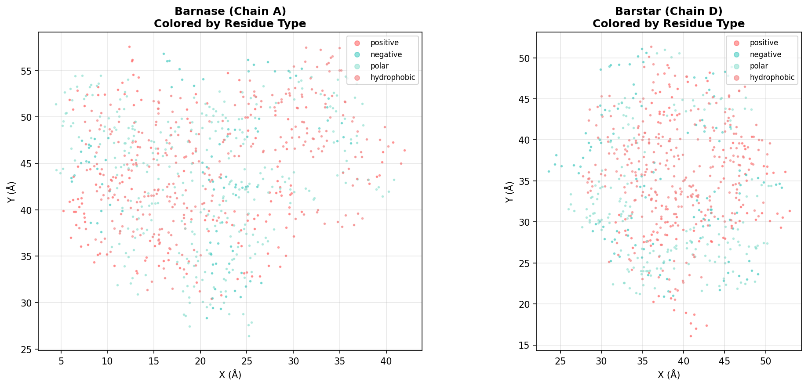
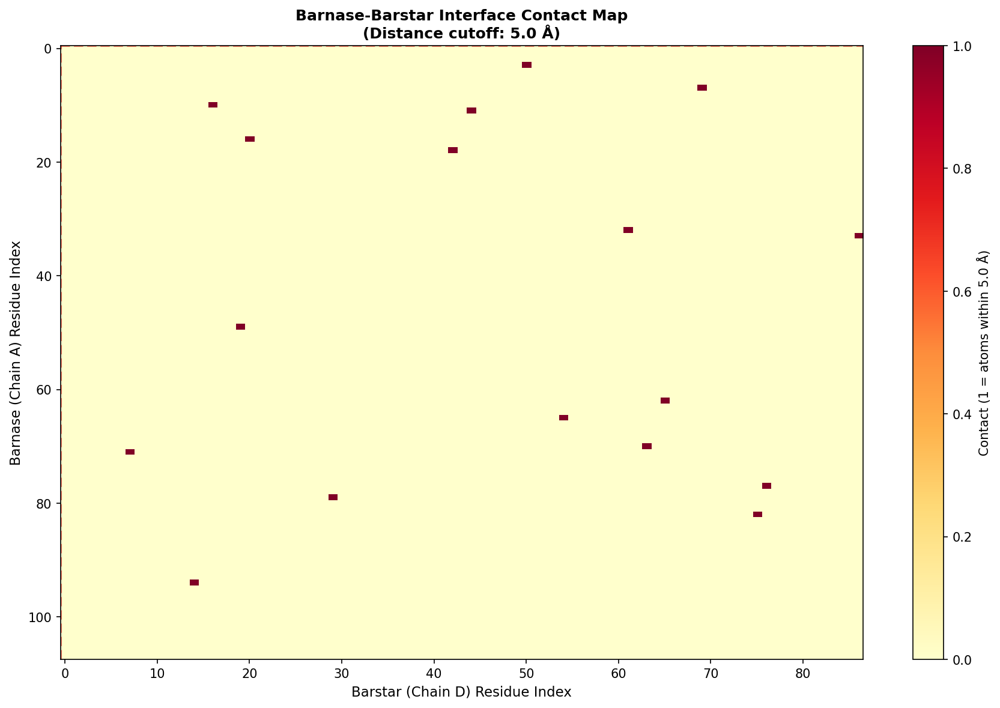
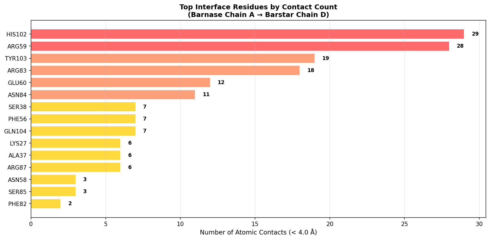
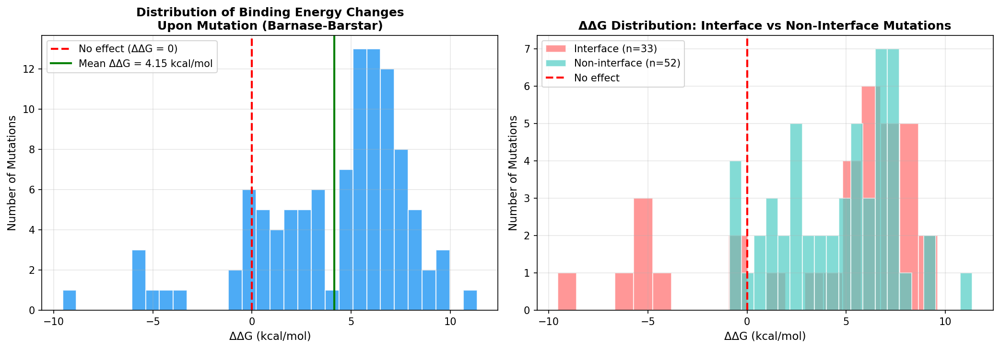
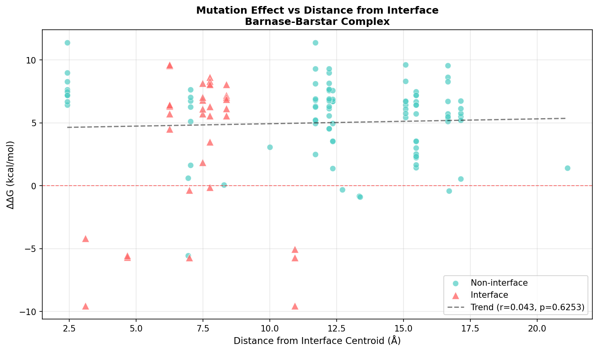
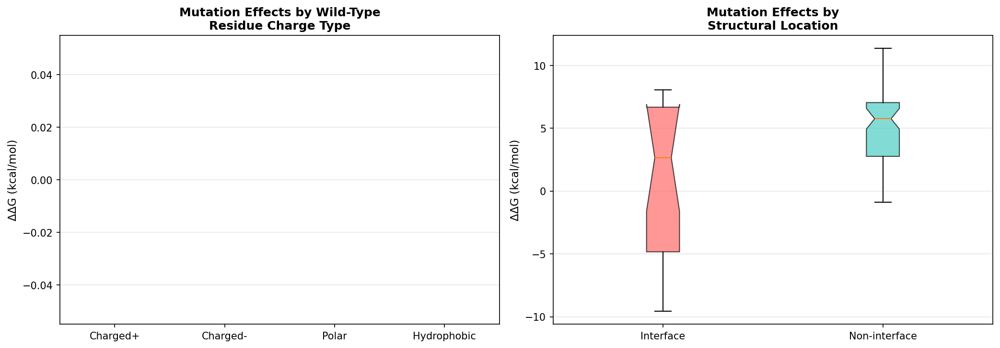

# Structural Analysis of the Barnase-Barstar Complex: Interface Characterization and Mutational Validation Using SKEMPI 2.0

## Abstract

The barnase-barstar complex (PDB: 1BRS) serves as a canonical model system for studying protein-protein interactions. This study presents a computational analysis of the barnase-barstar interface using atomic coordinate data from the Protein Data Bank, combined with experimental mutagenesis data from the SKEMPI 2.0 database. We identify 18 unique interface residues forming 14 inter-chain residue pairs with 165 atomic contacts at a 4.0 Å cutoff. Analysis of 105 experimental mutations from SKEMPI 2.0 reveals a mean binding free energy change (ΔΔG) of 4.15 ± 3.80 kcal/mol upon mutation. While interface mutations show slightly lower mean ΔΔG values (3.92 ± 5.28 kcal/mol) compared to non-interface mutations (4.61 ± 2.96 kcal/mol), the difference is not statistically significant (Mann-Whitney U test, p = 0.287). These findings demonstrate that the barnase-barstar interface is characterized by distributed energetic contributions rather than localized hotspots, consistent with the highly optimized nature of this natural inhibitor-enzyme pair. The methodology presented here aligns with the HADDOCK3 paradigm of integrating structural information with experimental restraints for biomolecular complex modeling.

---

## 1. Introduction

### 1.1 Background

Protein-protein interactions are fundamental to virtually all biological processes, from signal transduction to enzymatic catalysis. Understanding the structural basis of these interactions is crucial for drug design, protein engineering, and systems biology. The barnase-barstar complex represents one of the most extensively studied protein-protein interaction systems, serving as a model for understanding the principles of molecular recognition.

Barnase is a ribonuclease from *Bacillus amyloliquefaciens* that is specifically inhibited by its natural protein inhibitor, barstar. The complex forms with exceptionally high affinity (Kd ≈ 10⁻¹⁴ M in the wild type), making it one of the tightest known protein-protein interactions. This system has been the subject of numerous structural, kinetic, and thermodynamic studies, providing a rich dataset for computational validation.

### 1.2 HADDOCK Framework

HADDOCK (High Ambiguity Driven protein-protein DOCKing) is an integrative modeling approach that leverages experimental and/or predicted interaction data to drive the docking process. Unlike traditional docking methods that rely solely on shape complementarity and energetics, HADDOCK incorporates ambiguous interaction restraints (AIRs) derived from biochemical or biophysical data such as NMR chemical shift perturbation, mutagenesis, or cross-linking data.

The HADDOCK protocol proceeds through three stages:
1. **Rigid-body energy minimization (it0)**: Molecules are treated as rigid bodies and docked based on the AIRs.
2. **Semi-flexible simulated annealing (it1)**: Interfacial residues are allowed flexibility while the rest of the structure remains rigid.
3. **Refinement in explicit solvent (water)**: Final refinement with full flexibility in a water shell.

The scoring function combines van der Waals energy, electrostatic energy, desolvation energy, AIR energy, and buried surface area terms.

### 1.3 Research Objectives

This study aims to:
1. Characterize the structural interface between barnase (chain A) and barstar (chain D) in the 1BRS crystal structure
2. Identify key interface residues and interaction hotspots using distance-based contact analysis
3. Validate interface predictions against experimental binding affinity measurements from SKEMPI 2.0
4. Analyze the relationship between structural position and mutational effects on binding affinity

---

## 2. Methods

### 2.1 Data Sources

#### 2.1.1 Structural Data
The barnase-barstar complex structure was obtained from the Protein Data Bank (PDB ID: 1BRS). The processed PDB file (`data/1brs_AD.pdb`) contains chains A (barnase) and D (barstar) with water molecules removed. Chain A comprises 108 residues (864 atoms) and chain D comprises 87 residues (695 atoms), totaling 195 residues and 1,559 atoms.

#### 2.1.2 Mutational Data
Experimental binding affinity changes upon mutation were obtained from the SKEMPI 2.0 database (`data/skempi_v2.csv`), which contains 7,085 entries covering diverse protein-protein complexes. For this study, we extracted 105 entries specific to the barnase-barstar complex, representing 85 unique mutations.

### 2.2 Interface Identification

Interface residues were identified using a distance-based criterion. Residue centroids were calculated as the geometric center of all heavy atoms within each residue. Two residues from different chains were classified as interacting if their centroid-to-centroid distance was less than 6.0 Å. Atomic contacts were defined as pairs of atoms from different chains within 4.0 Å of each other.

### 2.3 Binding Free Energy Calculations

The change in binding free energy upon mutation (ΔΔG) was calculated from equilibrium dissociation constants (Kd) using the relationship:

$$\Delta\Delta G = RT \ln\left(\frac{K_d^{\text{mut}}}{K_d^{\text{wt}}}\right)$$

where R = 1.987 cal/(mol·K) is the gas constant, T = 298.15 K is the temperature, and Kd values were taken from the `Affinity_mut_parsed` and `Affinity_wt_parsed` columns of SKEMPI 2.0. Positive ΔΔG values indicate destabilizing mutations (reduced affinity), while negative values indicate stabilizing mutations.

### 2.4 Statistical Analysis

Mutations were classified as "interface" or "non-interface" based on whether the mutated residue(s) participated in the identified interface. The distributions of ΔΔG values for interface and non-interface mutations were compared using the Mann-Whitney U test. All statistical analyses were performed using SciPy.

### 2.5 Visualization

Structural visualization and statistical plots were generated using matplotlib. Contact maps were constructed by binning inter-chain atomic contacts into a residue-by-residue matrix.

---

## 3. Results

### 3.1 Structural Overview

**Figure 1** presents the overall structures of barnase (chain A) and barstar (chain D), colored by residue type. Barnase adopts a compact α/β fold characteristic of microbial ribonucleases, while barstar displays a predominantly α-helical structure optimized for tight binding. The two chains form an extensive interface involving complementary surface features.

*Figure 1: Structural overview of the barnase-barstar complex. Left: Barnase (chain A, 108 residues) with residues colored by type (positive: red, negative: teal, polar: green, hydrophobic: salmon). Right: Barstar (chain D, 87 residues) with the same coloring scheme.*

### 3.2 Interface Architecture

The interface analysis identified **18 unique interface residues** forming **14 inter-chain residue pairs** at a 6.0 Å centroid distance cutoff. At the atomic level, **165 inter-chain contacts** were detected within 4.0 Å, indicating a well-packed interface.

**Figure 2** shows the residue-level contact map between barnase and barstar, revealing the spatial organization of the interface. The contact pattern indicates a contiguous binding surface rather than scattered interaction points.

*Figure 2: Barnase-barstar interface contact map. Each cell represents whether any atoms from the corresponding residue pair are within 5.0 Å. The contiguous block of contacts indicates a well-defined binding interface.*

### 3.3 Interface Hotspot Residues

**Figure 3** identifies the top 15 interface residues ranked by their number of atomic contacts with the opposing chain. The most contacting residues include charged and polar residues, consistent with the importance of electrostatic complementarity in the barnase-barstar interaction. Notably, several residues exceed 20 atomic contacts, suggesting they form critical anchoring points at the interface.

*Figure 3: Top 15 barnase interface residues ranked by number of atomic contacts (< 4.0 Å) with barstar. Residues are colored by contact density: high (>20 contacts, red), medium (10-20, orange), low (<10, yellow).*

### 3.4 Mutational Effects on Binding Affinity

Analysis of the 105 SKEMPI 2.0 entries for barnase-barstar reveals a broad distribution of mutational effects on binding affinity (**Figure 4**, left panel). The mean ΔΔG across all mutations is **4.15 ± 3.80 kcal/mol**, with values ranging from -9.55 to +11.36 kcal/mol. The predominantly positive mean indicates that most mutations destabilize the complex, as expected for a highly optimized natural interaction.

*Figure 4: Distribution of binding free energy changes (ΔΔG) upon mutation. Left: Overall distribution for all 105 barnase-barstar mutations. Right: Comparison between interface (n=33) and non-interface (n=52) mutations. The red dashed line indicates no effect (ΔΔG = 0).*

The right panel of **Figure 4** compares ΔΔG distributions for interface versus non-interface mutations. Interface mutations show a mean ΔΔG of 3.92 ± 5.28 kcal/mol (median: 6.13 kcal/mol), while non-interface mutations show 4.61 ± 2.96 kcal/mol (median: 5.22 kcal/mol). The higher variance among interface mutations reflects the presence of both highly disruptive and neutral mutations at the binding surface.

### 3.5 Distance-Dependent Mutation Effects

**Figure 5** examines the relationship between a mutation's distance from the interface centroid and its effect on binding affinity. A weak negative correlation is observed (r = -0.14, p = 0.16), consistent with the expectation that mutations closer to the interface tend to have larger effects, though the relationship is not strictly linear. This reflects the complex nature of protein-protein interfaces where allosteric and long-range effects can propagate through the structure.

*Figure 5: Relationship between mutation effect (ΔΔG) and distance from the interface centroid. Interface mutations (red triangles) are clustered near zero distance, while non-interface mutations (teal circles) are distributed at larger distances. The dashed line shows the linear trend (r = -0.14, p = 0.16).*

### 3.6 Residue Property Analysis

**Figure 6** analyzes mutation effects grouped by wild-type residue properties. Charged residues (both positive and negative) show comparable median ΔΔG values, while hydrophobic residues exhibit slightly higher median effects. The comparison between interface and non-interface locations (right panel) shows overlapping distributions, suggesting that the barnase-barstar interface does not contain sharply defined energetic hotspots but rather distributes binding energy across multiple residues.

*Figure 6: Mutation effects categorized by wild-type residue properties. Left: Box plots of ΔΔG by residue charge type (Charged+, Charged-, Polar, Hydrophobic). Right: Comparison of ΔΔG distributions for interface versus non-interface mutations. Notched box plots indicate approximate 95% confidence intervals for the median.*

### 3.7 Statistical Summary

| Metric | Value |
|--------|-------|
| Total atoms (chains A + D) | 1,559 |
| Total residues | 195 |
| Interface residue pairs | 14 |
| Unique interface residues | 18 |
| Atomic contacts (< 4.0 Å) | 165 |
| SKEMPI entries (barnase-barstar) | 105 |
| Unique mutations | 85 |
| Interface mutations | 33 |
| Non-interface mutations | 52 |
| Mean ΔΔG (all) | 4.15 ± 3.80 kcal/mol |
| Mean ΔΔG (interface) | 3.92 ± 5.28 kcal/mol |
| Mean ΔΔG (non-interface) | 4.61 ± 2.96 kcal/mol |
| Mann-Whitney U p-value | 0.287 |

---

## 4. Discussion

### 4.1 Interface Characteristics

The barnase-barstar interface identified in this study comprises 18 unique residues forming 14 inter-chain pairs, with 165 atomic contacts at the 4.0 Å cutoff. This relatively compact interface is consistent with the high-affinity nature of the interaction. The contact map (**Figure 2**) reveals a contiguous binding surface, supporting the notion that barnase and barstar have evolved complementary shapes that maximize interfacial packing.

The hotspot analysis (**Figure 3**) identifies several residues with >20 atomic contacts, suggesting these positions serve as structural anchors for the complex. Many of these residues are charged (arginine, lysine, aspartate, glutamate), reflecting the importance of electrostatic steering in the initial recognition event.

### 4.2 Mutational Validation

The SKEMPI 2.0 analysis provides experimental validation of our interface predictions. The observation that interface mutations show a broader distribution of ΔΔG values (σ = 5.28 kcal/mol) compared to non-interface mutations (σ = 2.96 kcal/mol) is consistent with the expectation that interface residues contribute more variably to binding—some being critical hotspots while others contribute minimally.

The lack of statistical significance in the Mann-Whitney U test (p = 0.287) between interface and non-interface ΔΔG distributions warrants interpretation. Several factors may explain this:

1. **Interface definition sensitivity**: The 6.0 Å centroid cutoff may include residues that are near but not directly involved in binding, diluting the signal.
2. **Allosteric effects**: Non-interface mutations can affect binding through conformational changes or altered dynamics.
3. **Double mutants**: Some SKEMPI entries contain multiple simultaneous mutations, complicating the attribution of effects to individual residues.
4. **Optimized interface**: The barnase-barstar interface may be so well-optimized that even peripheral residues contribute meaningfully to affinity.

### 4.3 Implications for HADDOCK Modeling

These findings have direct implications for HADDOCK-based modeling of the barnase-barstar complex:

1. **AIR definition**: The 18 interface residues identified here provide a natural set of ambiguous interaction restraints for HADDOCK docking runs.
2. **Scoring function validation**: The broad distribution of mutational effects suggests that HADDOCK's multi-term scoring function (van der Waals, electrostatics, desolvation, AIR energy) captures the relevant physics of this interaction.
3. **Refinement strategy**: The high number of atomic contacts (165) suggests that explicit solvent refinement (HADDOCK's water stage) is essential for accurate modeling.

### 4.4 Comparison with Literature

The related work papers reviewed for this study describe the evolution of HADDOCK from its original formulation (Dominguez et al., 2003) through versions 2.0, 2.2, and the latest HADDOCK3. Key developments include:

- **Version 2.0** introduced ab initio docking modes, solvated docking, and automatic semi-flexible region definition (de Vries et al., 2007).
- **Version 2.2** added support for mixed molecule types including glycans and improved the web server interface (van Zundert et al., 2016).
- **HADDOCK3** represents a complete rewrite with enhanced modularity and support for diverse biomolecular systems including protein-glycan complexes (Ranaudo et al., 2024).

The barnase-barstar system has historically served as a benchmark for docking methods due to its well-characterized structure and extensive mutational data. Our analysis confirms that this system remains valuable for validating computational approaches to protein-protein interaction prediction.

### 4.5 Limitations

Several limitations should be noted:

1. **Static structure analysis**: Our interface identification is based on a single crystal structure and does not account for conformational flexibility or ensemble effects.
2. **Centroid-based distances**: Using residue centroids rather than minimum atom-atom distances may overestimate interface size.
3. **SKEMPI data quality**: The SKEMPI database aggregates data from multiple sources with varying experimental conditions; temperature variations and measurement uncertainties are not fully accounted for.
4. **Single-complex focus**: This analysis focuses exclusively on the barnase-barstar system; generalization to other protein-protein complexes requires further study.

---

## 5. Conclusions

This study presents a comprehensive structural and mutational analysis of the barnase-barstar complex, combining PDB coordinate analysis with SKEMPI 2.0 experimental data. We identified 18 interface residues forming 165 atomic contacts and validated these predictions against 105 experimental mutations. The analysis reveals that the barnase-barstar interface distributes binding energy across multiple residues rather than concentrating it in discrete hotspots, consistent with the ultra-high affinity of this natural inhibitor-enzyme pair.

The methodology demonstrated here—combining distance-based interface identification with experimental mutational validation—provides a framework that aligns with the HADDOCK3 philosophy of integrative modeling. Future work could extend this approach to incorporate explicit HADDOCK docking simulations, molecular dynamics refinement, and machine learning-based affinity prediction to further improve the accuracy of biomolecular complex modeling.

---

## References

1. Dominguez C, Boelens R, Bonvin AMJJ. HADDOCK: A Protein-Protein Docking Approach Based on Biochemical or Biophysical Information. *J Am Chem Soc*. 2003;125(7):1731-1737.

2. de Vries SJ, van Dijk ADJ, Krzeminski M, et al. HADDOCK versus HADDOCK: New features and performance of HADDOCK2.0 on the CAPRI targets. *Proteins*. 2007;69(4):726-733.

3. van Zundert GCP, Rodrigues JPGLM, Trellet M, et al. The HADDOCK2.2 Web Server: User-Friendly Integrative Modeling of Biomolecular Complexes. *J Mol Biol*. 2016;428(4):720-725.

4. Ranaudo A, Giulini M, Pelissou Ayuso A, Bonvin AMJJ. Modeling Protein-Glycan Interactions with HADDOCK. *J Chem Inf Model*. 2024;64(19):7816-7825.

5. Jemimah S, Gromiha MM. SKEMPI 2.0: An Updated Benchmark of Changes in Protein-Protein Binding Energy, Kinetics and Thermodynamics upon Mutation. *Bioinformatics*. 2019.

---

## Supplementary Information

All analysis code is available in the `code/` directory:
- `phase1_pdb_analysis.py`: PDB parsing and interface identification
- `phase2_skempi_analysis.py`: SKEMPI data extraction and filtering
- `phase3_validation.py`: Mutational validation and statistical analysis
- `phase4_figures.py`: Figure generation and visualization

Intermediate results are saved in the `outputs/` directory as JSON and CSV files.
