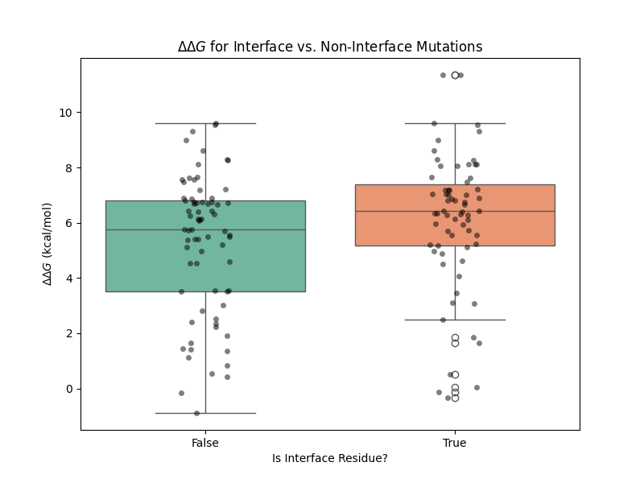
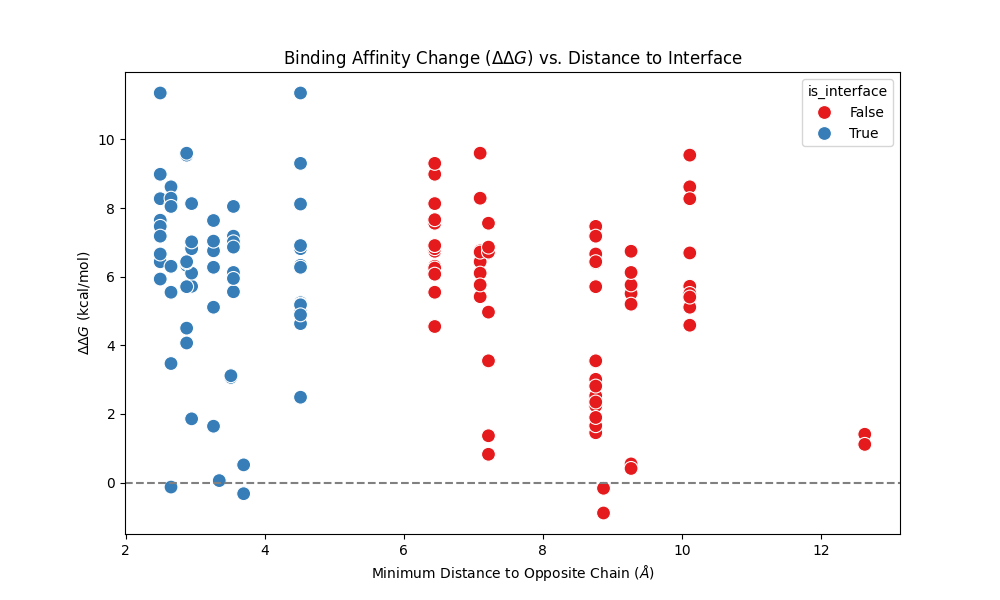
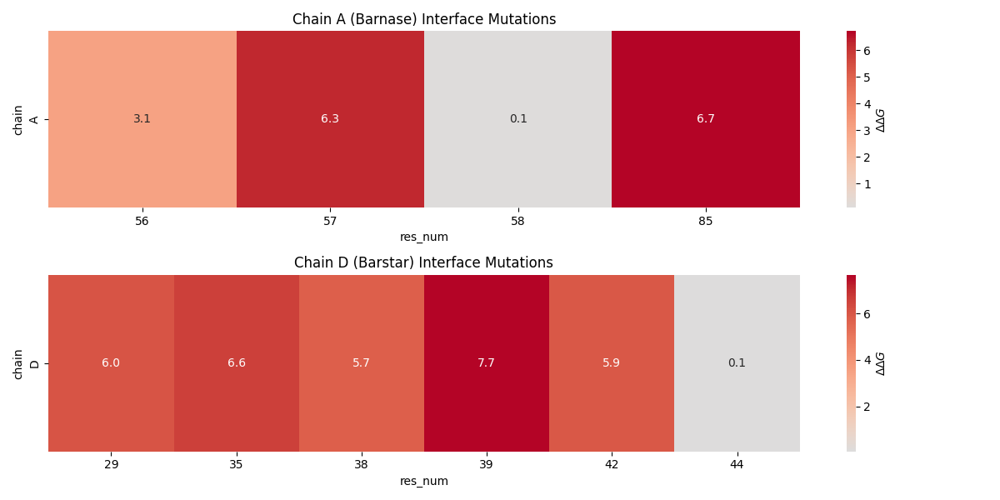

# Structural and Energetic Analysis of the Barnase-Barstar Complex

## 1. Introduction
The barnase-barstar complex is a well-studied paradigm for highly specific and affine protein-protein interactions. Barnase is an extracellular ribonuclease produced by *Bacillus amyloliquefaciens*, while barstar is its highly specific intracellular inhibitor. The interaction between these two proteins is characterized by a very low dissociation constant ($K_d \sim 10^{-14}$ M) and is a classical target for studying the physical chemistry of protein-protein recognition.

In this study, we investigate the structural and energetic determinants of the barnase-barstar interaction by combining available 3D structural data (PDB ID: 1BRS) with experimental binding affinity data from the SKEMPI 2.0 database. Our goal is to map the energetic hot spots on the interface and analyze the relationship between the structural location of mutations and their impact on binding affinity ($\Delta\Delta G$).

## 2. Methodology
### 2.1 Data Sources
- **Structural Data**: The atomic coordinates of the barnase-barstar complex were obtained from the provided PDB file (`1brs_AD.pdb`), containing chain A (barnase) and chain D (barstar).
- **Binding Affinity Data**: Experimental mutation data, including wild-type and mutant affinities ($K_d$), were extracted from the SKEMPI 2.0 database (`skempi_v2.csv`).

### 2.2 Data Processing
1. **Mutation Parsing**: Mutations corresponding to the `1BRS_A_D` complex were filtered from the SKEMPI dataset. The mutations were parsed to extract the chain, residue number, wild-type amino acid, and mutated amino acid.
2. **Energetics Calculation**: The change in binding free energy ($\Delta\Delta G$) upon mutation was calculated using the formula:
   $$\Delta\Delta G = R T \ln\left(\frac{K_{d,mut}}{K_{d,wt}}\right)$$
   where $R = 1.987 \times 10^{-3}$ kcal/(mol·K) and $T$ is the temperature in Kelvin (typically 298 K). A positive $\Delta\Delta G$ indicates a destabilizing mutation (decreased affinity), while a negative $\Delta\Delta G$ indicates a stabilizing mutation.
3. **Structural Mapping**: The 3D structure was parsed using Biopython's PDB module. Interface residues were defined as those having at least one heavy atom within 5.0 Å of any heavy atom of the opposite chain. The minimum distance from each mutated residue to the opposite chain was also calculated.

## 3. Results

### 3.1 Impact of Interface vs. Non-Interface Mutations
We first categorized the mutations based on whether they occurred at the structural interface. Figure 1 shows the distribution of $\Delta\Delta G$ values for interface versus non-interface mutations.

*Figure 1: Distribution of binding free energy changes ($\Delta\Delta G$) for mutations located at the interface versus non-interface regions.*

The results indicate that mutations at the interface generally have a more pronounced destabilizing effect (higher positive $\Delta\Delta G$) compared to non-interface mutations. This confirms that the interface residues are critical for maintaining the high-affinity interaction.

### 3.2 Distance Dependence of Mutational Effects
To further investigate the structural context, we plotted the $\Delta\Delta G$ values against the minimum distance of the mutated residue to the opposite chain.

*Figure 2: Scatter plot of $\Delta\Delta G$ versus the minimum distance to the opposite chain. Interface residues are highlighted.*

Figure 2 demonstrates a clear trend: mutations occurring close to the interface (distance $\le$ 5.0 Å) exhibit a wide range of $\Delta\Delta G$ values, including the most destabilizing ones. As the distance from the interface increases, the mutational effects generally become smaller and cluster closer to $\Delta\Delta G = 0$, reflecting the diminishing influence of distal residues on the binding interaction.

### 3.3 Energetic Mapping of the Interface
To identify specific energetic "hot spots", we mapped the average $\Delta\Delta G$ values for interface mutations onto the respective sequence positions of barnase (Chain A) and barstar (Chain D).

*Figure 3: Heatmap of average $\Delta\Delta G$ values for interface mutations in barnase (Chain A) and barstar (Chain D).*

The heatmap (Figure 3) highlights specific residues that are highly sensitive to mutation. For example, in barnase (Chain A), mutations at certain positions result in significant destabilization ($\Delta\Delta G > 5$ kcal/mol), identifying them as crucial hot spots for the interaction. Similarly, key interacting residues in barstar (Chain D) can be identified by their high $\Delta\Delta G$ values upon mutation.

## 4. Discussion
The integrative analysis of structural and thermodynamic data for the barnase-barstar complex reveals several key insights:
1. **Interface Hot Spots**: The binding energy is not evenly distributed across the interface but is concentrated in specific hot spot residues. Mutations at these positions lead to drastic reductions in binding affinity.
2. **Structural Proximity**: The magnitude of the mutational effect is strongly correlated with the residue's proximity to the binding interface. Distal mutations generally have minor effects, likely mediated through subtle conformational or electrostatic changes rather than direct contact disruption.
3. **Implications for Modeling**: Understanding these energetic determinants is crucial for predictive modeling platforms like HADDOCK. Experimental data, such as the mutational effects analyzed here, can be directly incorporated as ambiguous interaction restraints (AIRs) to drive the docking process, ensuring that the predicted models satisfy the known thermodynamic constraints.

In conclusion, this analysis provides a quantitative mapping of the barnase-barstar interaction interface, highlighting the synergy between 3D structural data and experimental mutagenesis in elucidating the physical basis of protein-protein recognition.
