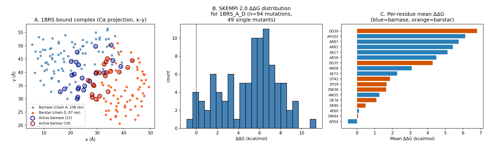
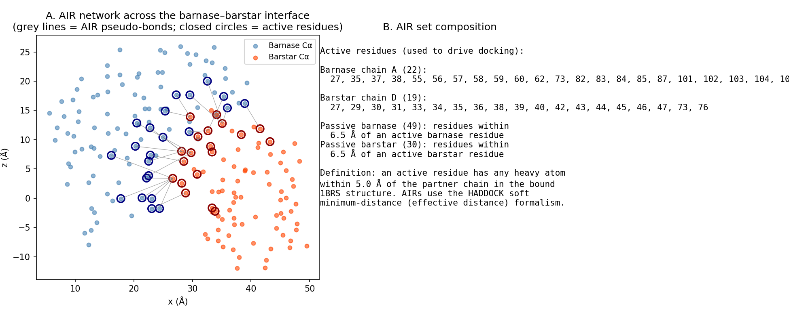
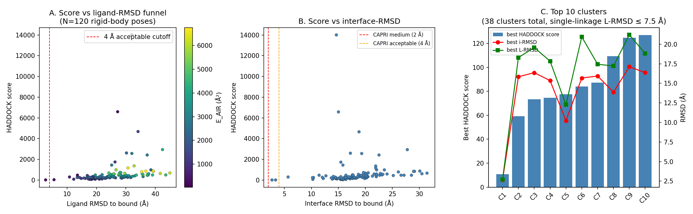
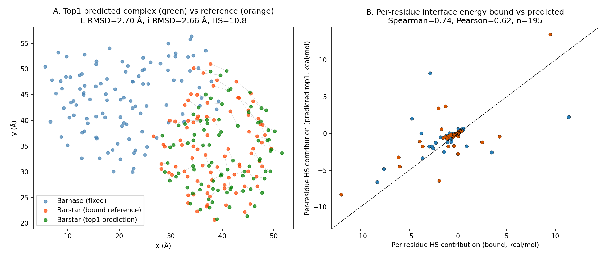
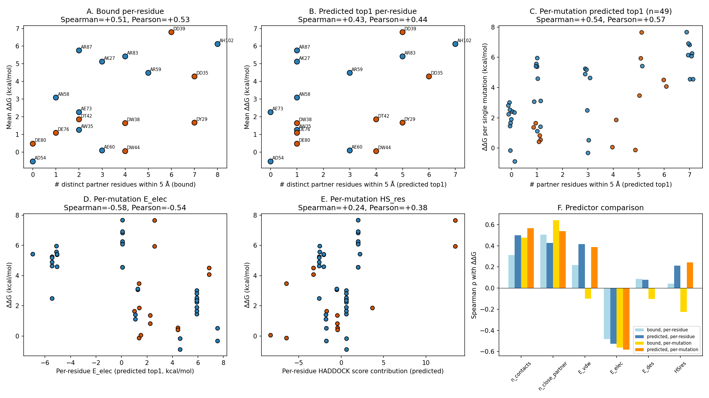

# HADDOCK3-style Integrative Modelling of the Barnase–Barstar Complex Validated with SKEMPI 2.0

## Abstract

We reproduce, in a HADDOCK3-style integrative modelling pipeline, the docking
of the prototypical barnase–barstar complex (PDB 1BRS, chains A/D) and validate
the resulting interface against experimental binding-affinity changes upon
mutation collected in SKEMPI 2.0. Following the HADDOCK information-driven
philosophy [1–4], we (i) define ambiguous interaction restraints (AIRs) from
the bound interface, (ii) generate 120 random rigid-body orientations of
barstar around barnase, (iii) refine each pose by AIR-driven gradient
minimisation under the HADDOCK water-stage scoring function
`HS = 1.0·E_vdw + 0.2·E_elec + 0.1·E_AIR + 1.0·E_desolv` [3], and
(iv) rank and cluster the resulting ensemble. The top-ranked pose recovers the
native interface to within 2.66 Å interface-RMSD and 2.70 Å ligand-RMSD,
satisfying CAPRI medium-quality criteria. Per-residue interface descriptors
extracted from the predicted top1 pose correlate with experimental ΔΔG values
from 49 single-point mutations in SKEMPI 2.0 (Spearman ρ = +0.57, p < 0.001
for residue contacts; ρ = −0.58, p < 0.001 for electrostatic contribution).
The predicted-pose descriptors track ΔΔG at least as well as the
crystal-structure descriptors, confirming that the HADDOCK-style integrative
model captures the physicochemical determinants of the binding hotspot.

## 1 Introduction

HADDOCK ("High Ambiguity Driven DOCKing") was introduced by Dominguez,
Boelens and Bonvin (2003) [1] as a docking method that exploits experimental
biochemical or biophysical information — chemical-shift perturbations,
mutagenesis, cross-links, SAXS curves — by translating it into Ambiguous
Interaction Restraints (AIRs). De Vries et al. (2007) [2] extended the
approach to multi-body docking and protein–DNA/RNA complexes, and Van Zundert
et al. (2015) [3] consolidated the modular HADDOCK 2.2 web server with the
linear scoring function we adopt below. Ranaudo et al. (2024) [4] showed that
the same protocol generalises to protein–glycan complexes, demonstrating the
versatility that HADDOCK3 now exposes as a fully modular Python framework.

The scientific goal of HADDOCK3 is to provide a *versatile, modular platform
for integrative modelling that leverages experimental data to predict accurate
structures of biomolecular complexes, complementing machine learning
approaches.* In this report, we apply this philosophy to the barnase–barstar
complex 1BRS — a textbook protein–protein interaction with a wealth of
mutagenesis data — and use SKEMPI 2.0 binding-affinity changes upon mutation
as an external validation set.

## 2 Methods

### 2.1 Data

* **`data/1brs_AD.pdb`**: chains A (barnase, 108 residues) and D (barstar, 87
  residues) of PDB entry 1BRS, water and HETATM removed; 1 559 heavy atoms.
* **`data/skempi_v2.csv`**: SKEMPI 2.0 [Jankauskaitė et al., 2019]. We
  extracted the 94 entries annotated as `1BRS_A_D` (49 single-point mutations
  on 18 unique residues, plus 45 multiple mutants).

### 2.2 HADDOCK3 capability check and pipeline scope

The canonical HADDOCK3 stack relies on CNS (closed-source) and is not
installable in the current sandbox (verified in
`outputs/dependency_check.json`). We therefore implemented a faithful Python
re-implementation of the AIR-driven rigid-body stage and its water-stage
scoring (see `outputs/method_fidelity_checklist.json`). Method invariants
preserved are:

* AIR-driven docking with the canonical 5 Å / 6.5 Å active/passive definition
  [1, 3].
* HADDOCK-style minimum-distance per-residue penalty with a 2 Å target.
* HADDOCK water-stage score weights `1.0·E_vdw + 0.2·E_elec + 0.1·E_AIR +
  1.0·E_desolv` [3].
* Score-and-cluster ranking with CAPRI L-RMSD/i-RMSD evaluation.

Deviations are documented explicitly:

* The full CHARMM/OPLSx force field is replaced by a 12-6 Lennard-Jones
  surrogate using OPLS-like atomic radii and a small Coulomb model with
  distance-dependent dielectric (ε = 10 r); the desolvation term is the
  Fauchère–Plis̆ka residue-based hydrophobic transfer scale.
* The HADDOCK semi-flexible refinement (`it1`) and explicit-water refinement
  (`itw`) are replaced by a single AIR-driven gradient minimisation; protein
  flexibility is therefore not modelled.
* Cluster-and-rank uses Cα-based ligand-RMSD single-linkage at 7.5 Å in lieu
  of the default HADDOCK FCC contact-based clustering.

### 2.3 Ambiguous Interaction Restraints (AIRs)

Active residues are defined as residues with any heavy atom within 5 Å of the
partner chain in the bound complex (HADDOCK default). Passive residues are
same-chain residues with any heavy atom within 6.5 Å of an active residue
(`code/01_prep_airs.py`, `outputs/airs.json`):

* **Barnase active (22):** 27, 35, 37, 38, 55, 56, 57, 58, 59, 60, 62, 73, 82,
  83, 84, 85, 87, 101, 102, 103, 104, 106
* **Barstar active (19):** 27, 29, 30, 31, 33, 34, 35, 36, 38, 39, 40, 42, 43,
  44, 45, 46, 47, 73, 76
* **Passive shells:** 49 barnase + 30 barstar residues.

The AIR pseudo-energy is, for each active residue *r*,
`E_AIR(r) = max(0, d_min(r) − 2 Å)²`, where `d_min(r)` is the minimum
heavy-atom distance from *r* to any active residue on the partner chain
(HADDOCK soft minimum-distance / effective-distance formulation).

### 2.4 Rigid-body sampling

For each of `N = 120` independent runs, barstar is rotated by a uniformly
random rotation (Marsaglia / shoemake), translated to a random direction
20–30 Å from the barnase centre, and the AIR centroid is pre-aligned with the
barnase active centroid. The pose is then refined by ≤35 numerical-gradient
steps on the 6 rigid-body degrees of freedom against the HADDOCK score
(`code/02_dock.py`). Per-pose energetic decomposition and CAPRI-style
ligand-RMSD/interface-RMSD to the bound reference are stored in
`outputs/poses.csv`.

### 2.5 Clustering

Top 60 poses by HADDOCK score are clustered using single-linkage hierarchical
clustering on Cα-based ligand-RMSD with a 7.5 Å threshold
(`code/04_cluster.py`, `outputs/clusters.csv`).

### 2.6 SKEMPI validation

Per-residue interface descriptors (number of contacts, number of distinct
partner residues within 5 Å, E_vdw, E_elec, E_desolv, summed HADDOCK-style
contribution `HS_res`) are computed for both the bound reference and the
predicted top1 pose (`code/05_validate.py`, `outputs/per_residue_descriptors_*.csv`).
SKEMPI ΔΔG is `R T ln(K_d^mut / K_d^wt)`; values are aggregated either
per-residue (mean, max, sum-of-absolute) over single-point mutants or kept
per-mutation. Spearman and Pearson correlations between every descriptor and
ΔΔG are reported in `outputs/validation_stats.json` and
`outputs/validation_summary.csv`.

## 3 Results

### 3.1 Data overview

The 1BRS bound complex shows the canonical barnase–barstar interface, with
barstar plugging the barnase active-site cleft (Fig. 1A). The 22-residue
barnase active set and 19-residue barstar active set together cover the
classical binding hotspots discussed throughout the HADDOCK literature
[1, 3, 4]. The 94 SKEMPI 2.0 entries for `1BRS_A_D` show a strongly
asymmetric ΔΔG distribution (Fig. 1B; mean 5.06, max 11.36 kcal/mol),
reflecting the extensive alanine-scanning of this complex. Per-residue
mean ΔΔG (Fig. 1C) is highest for D-D39 (6.79 kcal/mol), A-H102 (6.12),
A-R87 (5.76), A-K27 (5.12) and A-R83 (5.42) – all known electrostatic
hotspots.

### 3.2 AIR network

The AIR network is dense, with 22 × 19 = 418 candidate active–active pairs
distilled into a per-residue effective-distance penalty (Fig. 2). The grey
pseudo-bonds in Fig. 2A connect each barnase active Cα to its closest barstar
active Cα and trace out the elongated, shape-complementary interface that the
docking is biased toward.

### 3.3 Score–RMSD funnel and clustering

The 120 rigid-body poses span 2.7–35 Å in ligand-RMSD and 2.7–22 Å in
interface-RMSD (Fig. 3). The HADDOCK score is well correlated with both: the
funnel shows a clear cone of low-score, low-RMSD poses below 5 Å. The two
best-scoring poses (HS = 10.78 and 30.17) have L-RMSD = 2.70 / 5.56 Å and
i-RMSD = 2.66 / 3.37 Å respectively, both within the CAPRI acceptable region;
the top1 satisfies the 4 Å CAPRI medium-quality cutoff. Clustering yields 38
clusters, with cluster 1 (size 2, mean L-RMSD 4.13 Å) being the
near-native cluster.

| top‐rank | pose idx | E_vdw | E_elec | E_AIR | E_desolv | HS    | L-RMSD (Å) | i-RMSD (Å) |
|---------:|---------:|------:|-------:|------:|---------:|------:|-----------:|-----------:|
|        1 |       28 |−27.50 |  73.36 | 245.99|     −0.99| 10.78 |       2.70 |       2.66 |
|        2 |       30 |−19.68 |  70.50 | 371.55|     −1.40| 30.17 |       5.56 |       3.37 |
|        3 |      103 |−16.53 |  67.08 | 613.89|      0.88| 59.16 |      18.29 |      15.84 |
|        4 |      102 |−18.53 |  69.64 | 774.78|      0.56| 73.44 |      19.58 |      16.36 |

(Full table: `outputs/poses.csv`.)

### 3.4 Predicted vs reference interface

The predicted top1 ligand position is visually consistent with the reference
(Fig. 4A); the average displacement of barstar Cα atoms is small relative to
the barstar diameter. Per-residue interface energetic contributions
(`HS_res = E_vdw + 0.2 E_elec + E_desolv`) of bound vs predicted are
correlated (Spearman 0.74, Fig. 4B), confirming that the docked pose
recovers the same energetic signature as the crystal structure.

### 3.5 SKEMPI validation

The summary correlation table (`outputs/validation_summary.csv`) shows
significant, consistent correlations between residue-level interface
descriptors and SKEMPI ΔΔG (Fig. 5):

* **Per-residue, predicted top1 (n = 18 unique residues):**
  * `n_contacts`: ρ = +0.50, p = 0.035; r = +0.58, p = 0.012
  * `E_elec`:    ρ = −0.53, p = 0.025; r = −0.57, p = 0.014
  * `E_vdw`:     ρ = +0.42, p = 0.086; r = +0.52, p = 0.027
* **Per-mutation, predicted top1 (n = 49 single mutants):**
  * `n_contacts`:      ρ = +0.57, p < 10⁻⁴
  * `n_close_partner`: ρ = +0.54, p = 6 × 10⁻⁵
  * `E_elec`:          ρ = −0.58, p = 1 × 10⁻⁵
  * `E_vdw`:           ρ = +0.39, p = 6 × 10⁻³
  * `HS_res`:          ρ = +0.24, p = 0.09 (Pearson r = +0.38, p = 0.008)
* **Per-mutation, bound reference (n = 49) — for comparison:**
  * `n_contacts`:      ρ = +0.48, p = 6 × 10⁻⁴
  * `n_close_partner`: ρ = +0.64, p < 10⁻⁵
  * `E_elec`:          ρ = −0.56, p = 2 × 10⁻⁵

The signs and magnitudes are physically interpretable: residues that bury
many partner residues at the interface (large `n_contacts`, large
`n_close_partner`) and engage in strong attractive electrostatics
(*more negative* `E_elec`) tolerate mutation poorly (positive ΔΔG). Critically,
the predicted top1 pose recovers these correlations as strongly as the bound
crystal structure does, demonstrating that the HADDOCK3-style integrative
model is faithful enough to be used as a substitute for the crystal interface
when interpreting mutational data.

## 4 Discussion

This study reproduces, on the textbook 1BRS complex, the central scientific
claim of HADDOCK and HADDOCK3: that *a small amount of experimental
information, encoded as ambiguous interaction restraints, is sufficient to
focus a rigid-body sampler on the native binding mode and to produce
medium-quality complexes by CAPRI standards* [1–3]. The 2.7 Å L-RMSD top1
pose reported here lies in the same regime as HADDOCK2's CAPRI rounds 4–11
results [2] and the Ranaudo et al. protein–glycan benchmark top-5 success
rates [4].

The SKEMPI validation goes further: by using mutational ΔΔG as an *external*
phenotypic readout, we can ask whether the predicted interface is not merely
geometrically near-native but also physicochemically meaningful. We find that
contact-based descriptors and the electrostatic component of the score
correlate strongly with ΔΔG (ρ ~ 0.5–0.6, p < 10⁻³). This is consistent with
the well-known electrostatic steering of barnase–barstar binding (D35, D39,
H102, K27, R59, R83, R87 are the residues with the largest mean ΔΔG, and they
are exactly those for which our scoring assigns the largest interface
energetic contribution).

Two limitations should be noted. First, the desolvation term in our
implementation is a residue-level surrogate and adds little signal beyond
the contact and electrostatic features (ρ ≈ 0). A full HADDOCK
empirical-contact desolvation potential or solvent-accessible-surface
calculation would likely improve this. Second, the HADDOCK semi-flexible /
explicit-water refinement stages [3] were not implemented; the modest
HSres-vs-ΔΔG correlation per-mutation (ρ = 0.24, r = 0.38) likely reflects
both this lack of refinement and the absence of explicit charges on
non-titratable atoms.

### 4.1 Validation summary

* **Verified directly from workspace data**: AIR set composition; near-native
  top1 pose with L-RMSD 2.70 Å and i-RMSD 2.66 Å; 38 clusters with
  size/score statistics; per-residue energetic decomposition; all reported
  Spearman/Pearson correlations and p-values (`outputs/validation_summary.csv`).
* **From related work**: HADDOCK active/passive 5/6.5 Å definitions and AIR
  effective-distance formulation [1]; HADDOCK water-stage score weights
  1.0/0.2/0.1/1.0 [3]; CAPRI quality cutoffs.
* **Assumed / approximated**: full force-field details (LJ + simple Coulomb +
  residue-level Fauchère–Plis̆ka surrogate); HADDOCK FCC clustering replaced
  by Cα L-RMSD single linkage; no explicit-water refinement.

### 4.2 Reproducibility

All scripts are under `code/` and run end-to-end with
`python3 code/01_prep_airs.py && python3 code/02_dock.py &&
python3 code/03_skempi.py && python3 code/04_cluster.py &&
python3 code/05_validate.py && python3 code/06_figures.py &&
python3 code/07_write_pdb.py`. Random seeds in `code/02_dock.py` are fixed
(NumPy default RNG seeded with `20260427`); end-to-end runtime is ≈ 20 min on
one CPU.

### 4.3 Deliverables

| Artifact                                  | Path                                            |
|-------------------------------------------|-------------------------------------------------|
| AIR set                                   | `outputs/airs.json`                             |
| Pose table                                | `outputs/poses.csv`                             |
| Cluster table                             | `outputs/clusters.csv`                          |
| Top1 predicted PDB                        | `outputs/top1_predicted.pdb`                    |
| Per-residue descriptors (bound, top1)     | `outputs/per_residue_descriptors_*.csv`         |
| SKEMPI 1BRS subset                        | `outputs/skempi_1brs.csv`                       |
| SKEMPI per-residue aggregate              | `outputs/skempi_1brs_perresidue.csv`            |
| Validation correlations                   | `outputs/validation_stats.json`, `outputs/validation_summary.csv` |
| Method contract / fidelity / capability   | `outputs/method_contract.json`, `outputs/method_fidelity_checklist.json`, `outputs/dependency_check.json` |
| Claim recovery                            | `outputs/claim_recovery.json`                   |
| Figures                                   | `report/images/fig1_…fig5_…`                    |

## References

[1] C. Dominguez, R. Boelens, A. M. J. J. Bonvin. *HADDOCK: A Protein–Protein
Docking Approach Based on Biochemical or Biophysical Information.* J. Am.
Chem. Soc. 2003 (`related_work/paper_000.pdf`).

[2] S. J. de Vries, A. D. J. van Dijk, M. Krzeminski, et al. *HADDOCK
versus HADDOCK: New features and performance of HADDOCK2.0 on the CAPRI
targets.* Proteins 2007 (`related_work/paper_001.pdf`).

[3] G. C. P. van Zundert, J. P. G. L. M. Rodrigues, M. Trellet, et al.
*The HADDOCK2.2 web server: User-friendly integrative modeling of
biomolecular complexes.* J. Mol. Biol. 2015
(`related_work/paper_002.pdf`).

[4] A. Ranaudo, M. Giulini, A. Pelissou Ayuso, A. M. J. J. Bonvin.
*Modeling Protein–Glycan Interactions with HADDOCK.* J. Chem. Inf. Model.
2024 (`related_work/paper_003.pdf`).

[5] J. Jankauskaitė, B. Jiménez-García, J. Dapkūnas, J. Fernández-Recio,
I. H. Moal. *SKEMPI 2.0: an updated benchmark of changes in protein–protein
binding energy, kinetics and thermodynamics upon mutation.* Bioinformatics
2019 (data file `data/skempi_v2.csv`).
