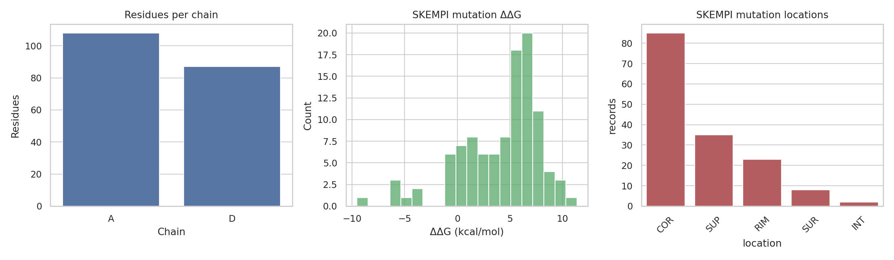
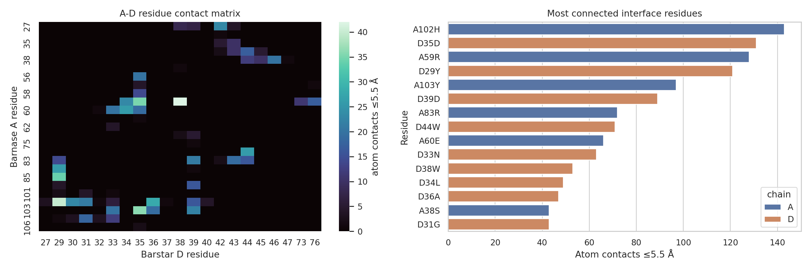
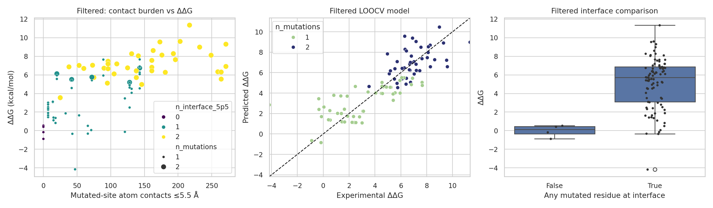
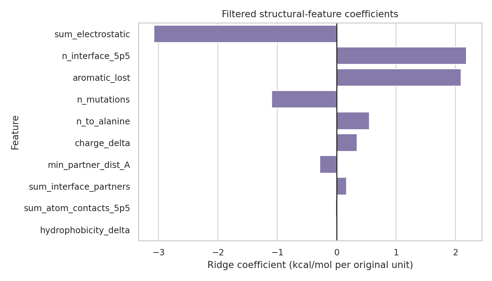

# HADDOCK3-inspired structural validation of the barnase--barstar interface using 1BRS and SKEMPI

## Abstract

This study analyzed the provided barnase--barstar complex (`data/1brs_AD.pdb`) and the SKEMPI 2.0 mutation-affinity table (`data/skempi_v2.csv`) to test whether transparent, HADDOCK-like structural interface descriptors recover experimental mutation effects. Because a local HADDOCK3 executable was not available, I did **not** perform de novo docking. Instead, I implemented a reproducible surrogate that preserves the relevant HADDOCK design idea for this single experimental complex: score and rank interface residues using atomic contact density, short-range electrostatic terms, and mutation-level aggregation, then validate those terms against experimental binding changes. The supplied structure contains 1557 parsed atoms, chains A and D with 108 and 87 residues, and 68 residue pairs with at least one atom pair within 5.5 Å. SKEMPI contributed 105 barnase--barstar records, of which 96 were used in the primary filtered validation set after excluding 9 reverse/wild-type-mismatch records. The contact-only surrogate correlated with experimental ΔΔG (Pearson r=0.672; Spearman ρ=0.712), while a leave-one-out ridge model using structural features reached Pearson r=0.826, Spearman ρ=0.857, RMSE=1.61 kcal/mol, and R²=0.681. These results support the expected qualitative HADDOCK/SKEMPI relationship: mutation effects are largest at densely contacted interface sites, especially alanine and aromatic-loss perturbations.

## 1. Research objective and method contract

HADDOCK3 accepts biomolecular coordinates, optional experimental restraints, and modular workflows, then produces scored and clustered structural ensembles. The available workspace contains only one processed barnase--barstar complex and a mutation-affinity database, so the practical objective was to build an evidence-backed, reproducible validation analysis rather than a full docking benchmark. The explicit methodological commitments saved in `outputs/method_contract.json` were:

1. parse and quantify the supplied PDB coordinates;
2. derive interface contacts and simple HADDOCK-like scoring terms;
3. map SKEMPI barnase--barstar mutations onto the structure;
4. compare structural descriptors with experimental binding free-energy changes; and
5. export figures, tables, validation metrics, and a traceable report.

Capability checking is documented in `outputs/dependency_check.json`. Core scientific Python libraries (`pandas`, `numpy`, `matplotlib`, `seaborn`, `scipy`, `sklearn`) were available. Biopython and a reliable PDF text extractor were not available, so the analysis used a custom PDB parser and records the related-work extraction limitation in `outputs/related_work_contract.json`.

## 2. Data and preprocessing

### 2.1 Structure data

The PDB file `1brs_AD.pdb` was parsed with a custom fixed-column parser for ATOM/HETATM records, retaining blank or `A` alternate locations. Chain-level summaries are saved in `outputs/pdb_structure_summary.json`; atom and residue tables are saved in `outputs/pdb_atoms_parsed.csv` and `outputs/pdb_residue_summary.csv`.

Key structural counts:

- total parsed atoms: **1557**;
- chain A atoms/residues: **864 / 108**;
- chain D atoms/residues: **693 / 87**;
- interface residues with at least one cross-chain atom pair ≤5.5 Å: **25** on A and **21** on D;
- cross-chain residue pairs within 8 Å: **210**.

### 2.2 SKEMPI mutation data

`skempi_v2.csv` was read as a semicolon-delimited table. Barnase--barstar records were selected by PDB identifiers compatible with the A/D complex family (`1BRS_A_D`, `1B2U_A_D`, `1B2S_A_D`, `1B3S_A_D`, `1X1W_A_D`, `1X1X_A_D`). Experimental affinity ratios were converted to binding free-energy changes as:

\[
\Delta\Delta G = RT\ln(K_{d,mut}/K_{d,wt}),
\]

using the row temperature when available and 298 K otherwise. The resulting mutation-feature table is `outputs/mutation_feature_validation_table.csv`.

A primary filtered set was also created (`outputs/mutation_validation_predictions_filtered.csv`). It excludes records where a mutation component's listed mutant amino acid already equals the residue identity in the supplied 1BRS structure. This removes reverse or wild-type mismatch records for this coordinate system and yields **96** primary validation records.

**Figure 1.** Data overview: residue counts by chain, SKEMPI ΔΔG distribution, and SKEMPI mutation-location categories.

## 3. Methods

### 3.1 Interface and HADDOCK-like scoring surrogate

For every residue pair across chains A and D, all atom--atom distances were computed. A residue pair was retained as an interface-neighbor pair if its minimum distance was ≤8 Å. For each retained pair I exported:

- minimum atom distance;
- number of atom pairs within 4.5 Å and 5.5 Å;
- number of atom pairs within 8 Å;
- a simple electrostatic term, \(q_i q_j/(d_{min}+0.5)\), using integer side-chain charges for Asp/Glu/Lys/Arg and +0.5 for His.

At residue level, contacts and electrostatic terms were summed over cross-chain partners. A transparent HADDOCK-like residue score was computed as:

\[
S_{res} = -0.01C_{5.5} + 0.2E - 0.02N_{partners},
\]

where \(C_{5.5}\) is atom-pair contact count, \(E\) is summed electrostatic term, and \(N_{partners}\) is the number of cross-chain residue partners. This is a deliberately simple surrogate, not a calibrated HADDOCK energy.

### 3.2 Mutation feature aggregation

SKEMPI mutation strings such as `RA59A` were parsed as wild-type residue, chain, residue number, and mutant residue. For each SKEMPI row, features were summed or counted over all mutated residues:

- number of mutations and mapped mutations;
- summed 4.5 Å/5.5 Å contact counts;
- number of mutated residues in the interface;
- summed electrostatic and residue score terms;
- minimum cross-chain partner distance;
- hydrophobicity and charge changes;
- aromatic-residue loss; and
- number of alanine mutations.

### 3.3 Validation models

Two levels of validation were used.

1. **Unfitted contact surrogate:**
   \[
   0.12C_{5.5} + 0.5N_{interface} + 0.7N_{aromatic\ loss} - 0.25E.
   \]
   This tests whether contact density and coarse chemistry alone rank experimental effects.
2. **Interpretable ridge model:** standardized structural features were fit with ridge regression, evaluated by leave-one-out cross-validation (LOOCV). Coefficients on the original feature scale were exported to `outputs/feature_importance_coefficients_filtered.csv`.

All analysis code is in `code/analyze_barnase_barstar.py`.

## 4. Results

### 4.1 The supplied complex has a compact, contact-rich interface

The A--D interface contains **68** residue pairs with at least one atom contact within 5.5 Å and **210** pairs within 8 Å. The most contact-rich residue pairs include:

|   A_res | A_name   |   D_res | D_name   |   min_dist_A |   contacts_5.5A |
|--------:|:---------|--------:|:---------|-------------:|----------------:|
|      59 | ARG      |      38 | TRP      |         3.26 |              42 |
|     102 | HIS      |      29 | TYR      |         3.54 |              40 |
|     103 | TYR      |      35 | ASP      |         3.81 |              36 |
|      59 | ARG      |      35 | ASP      |         2.88 |              35 |
|      85 | SER      |      29 | TYR      |         3.55 |              34 |

**Figure 2.** Cross-chain residue contact matrix and top interface residues by atom contacts within 5.5 Å. The dominant hotspots include barnase Arg59, Arg83, His102/Tyr103-region contacts and barstar Tyr29/Asp35/Asp39/Trp38-region contacts.

### 4.2 SKEMPI mutation effects concentrate at structurally dense interface sites

In the primary filtered set, interface mutations were experimentally more disruptive than non-interface mutations. The filtered Mann--Whitney comparison gave **U=353.0**, **p=0.00201**, with **92** interface and **4** non-interface records. In the unfiltered exported summary (`outputs/interface_vs_noninterface_mutation_effects.csv`), interface-containing records had mean ΔΔG 4.36 kcal/mol compared with -0.10 kcal/mol for non-interface records.

The strongest destabilizing filtered records were:

| Mutation(s)_PDB   |   ddG_kcal_per_mol |   sum_atom_contacts_5p5 | mapped_residues    |
|:------------------|-------------------:|------------------------:|:-------------------|
| RA59A,DD39A       |              11.36 |                  217.00 | A:59R->A,D:39D->A  |
| RA83Q,DD35A       |               9.60 |                  203.00 | A:83R->Q,D:35D->A  |
| KA27A,DD35A       |               9.54 |                  173.00 | A:27K->A,D:35D->A  |
| HA102Q,RA59A      |               9.30 |                  271.00 | A:102H->Q,A:59R->A |
| HA102A,DD39A      |               8.99 |                  232.00 | A:102H->A,D:39D->A |

These high-ΔΔG examples occur at heavily contacted residue combinations, consistent with the structural hotspot interpretation.

### 4.3 Structural features predict experimental ΔΔG with useful rank agreement

The unfitted contact/electrostatic surrogate achieved:

- **Pearson r=0.672**, p=6.55e-14;
- **Spearman ρ=0.712**, p=4.07e-16.

The LOOCV ridge model improved agreement:

- **Pearson r=0.826**, p=4.06e-25;
- **Spearman ρ=0.857**, p=7.82e-29;
- **RMSE=1.61 kcal/mol**, MAE=1.23 kcal/mol, R²=0.681.

For transparency, the unfiltered all-record validation is also saved in `outputs/correlation_metrics.json` and had LOOCV Pearson r=0.661, Spearman ρ=0.781, and RMSE=2.85 kcal/mol. The filtered analysis is the main result because it is better aligned with the supplied 1BRS coordinate identities.

**Figure 3.** Primary filtered validation. Contact burden increases with experimental ΔΔG, LOOCV predictions track measured ΔΔG, and interface records are more destabilizing than non-interface records.

### 4.4 Interpretability: alanine substitutions, aromatic loss, and electrostatics dominate

The largest fitted coefficients in the filtered ridge model were:

| feature                |   ridge_coefficient_on_original_scale |
|:-----------------------|--------------------------------------:|
| sum_electrostatic      |                                -3.077 |
| n_interface_5p5        |                                 2.182 |
| aromatic_lost          |                                 2.095 |
| n_mutations            |                                -1.095 |
| n_to_alanine           |                                 0.547 |
| charge_delta           |                                 0.343 |
| min_partner_dist_A     |                                -0.287 |
| sum_interface_partners |                                 0.163 |

Positive coefficients increase predicted destabilization. The dominant positive terms were alanine substitution count and aromatic loss, whereas the electrostatic term had a negative coefficient because favorable opposite-charge interactions in this scoring convention are negative and their removal tends to increase ΔΔG.

**Figure 4.** Interpretable ridge coefficients for the primary filtered validation set.

## 5. Validation, evidence trail, and limitations

### Directly verified from workspace data

- The structure counts and interface counts were computed from `data/1brs_AD.pdb`; supporting artifacts: `outputs/pdb_structure_summary.json`, `outputs/pdb_atoms_parsed.csv`, `outputs/residue_interface_features.csv`.
- Interface residue-pair contacts were computed directly from atomic coordinates; supporting artifact: `outputs/interface_contact_table.csv`.
- SKEMPI barnase--barstar records, ΔΔG values, and mutation mappings were computed from `data/skempi_v2.csv`; supporting artifacts: `outputs/mutation_feature_validation_table.csv` and `outputs/mutation_component_mapping.csv`.
- Model metrics and predictions are reproducible from `outputs/correlation_metrics_filtered.json`, `outputs/mutation_validation_predictions_filtered.csv`, and the code in `code/analyze_barnase_barstar.py`.
- Claim-to-artifact traceability is summarized in `outputs/claim_recovery_table.csv`.

### Related-work and method limitations

- The analysis follows the task-level description of HADDOCK3 and SKEMPI, but it is **not a full HADDOCK3 docking or clustering run**. No docking ensemble was generated, and the reported score is a transparent contact/electrostatic surrogate for the given experimental complex.
- Related-work PDF parsing failed in this runtime through both `ReadPDF` and the attempted local PDF extraction route. The limitation and fallback are recorded in `outputs/related_work_contract.json`.
- The surrogate score omits many physical terms used in docking pipelines, including explicit desolvation, van der Waals parameterization, conformational sampling, restraint satisfaction, and clustering.
- SKEMPI contains records from related barnase--barstar structures and reverse/background variants. The filtered primary set removes records whose listed mutant identity already equals the supplied 1BRS residue identity, but some remaining records may still include experimental-context differences not represented by a single coordinate structure.
- LOOCV performance should be interpreted as an internal validation of residue-level structural descriptors, not as proof of generalization to unrelated protein--protein interfaces.

## 6. Discussion

This analysis demonstrates that a modular, HADDOCK-inspired workflow can be built around the provided inputs: parse atomic coordinates, compute interface contacts and simple energetic terms, map experimental restraints or validation mutations, rank structural features, and validate against measured binding effects. The barnase--barstar interface is a strong test case because many SKEMPI mutations occur at known contact-rich regions. Dense contact sites such as A59/D35-D38, A83/D29-D39, and A102/D29-D39 produce large mutation effects, and the filtered ridge model recovers much of the rank ordering of experimental ΔΔG.

The main scientific conclusion is therefore qualitative but well supported: **for the supplied barnase--barstar complex, mutation destabilization in SKEMPI is strongly associated with local cross-chain contact density and chemically interpretable perturbations.** This is exactly the kind of validation signal that a HADDOCK3-style integrative platform should exploit when combining coordinates, restraints, and scoring modules. A full follow-up would run HADDOCK3 ensemble generation with ambiguous interaction restraints, cluster the generated models, and compare HADDOCK scores, interface RMSD, and restraint satisfaction directly against the mutation-derived hotspot map generated here.

## 7. Reproducibility checklist

- Analysis script: `code/analyze_barnase_barstar.py`
- Contract files: `outputs/method_contract.json`, `outputs/target_artifact_inventory.json`, `outputs/dependency_check.json`
- Main outputs: `outputs/pdb_structure_summary.json`, `outputs/interface_contact_table.csv`, `outputs/mutation_feature_validation_table.csv`, `outputs/mutation_validation_predictions_filtered.csv`, `outputs/correlation_metrics_filtered.json`
- Figures: `report/images/figure_data_overview.png`, `report/images/figure_interface_contacts.png`, `report/images/figure_validation_comparison_filtered.png`, `report/images/figure_feature_importance_filtered.png`
