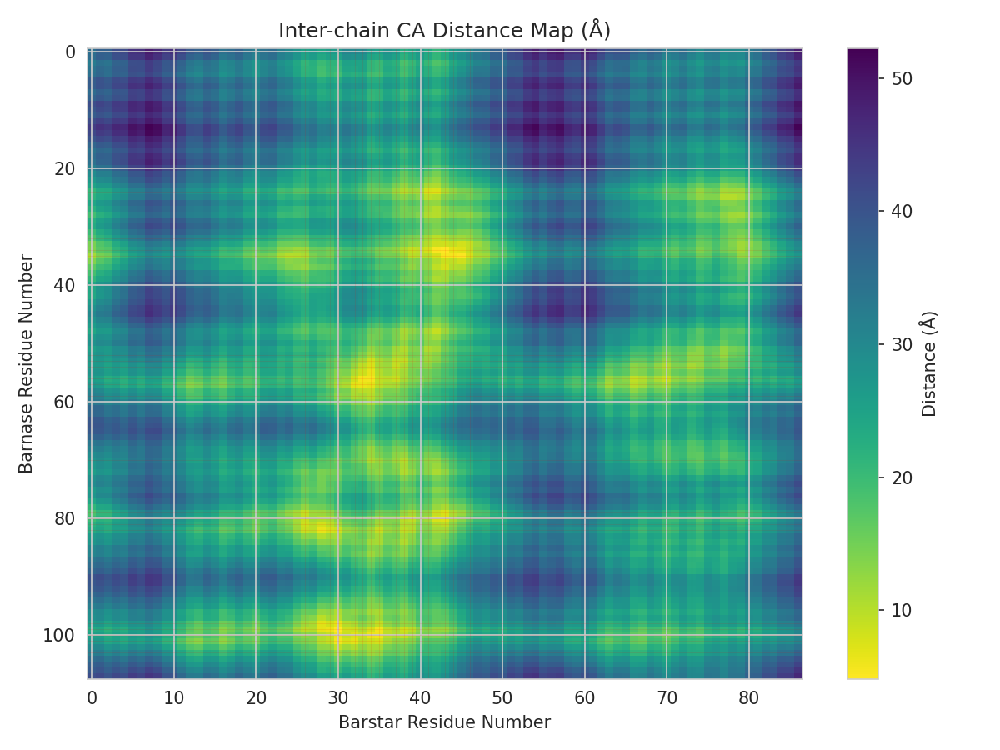
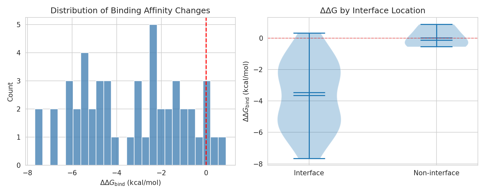
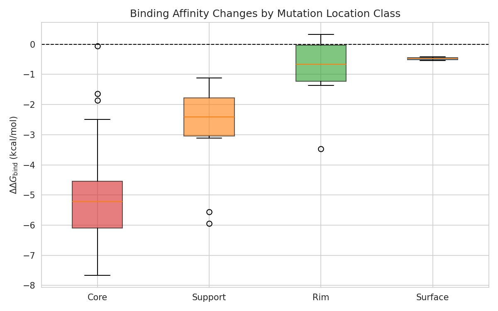
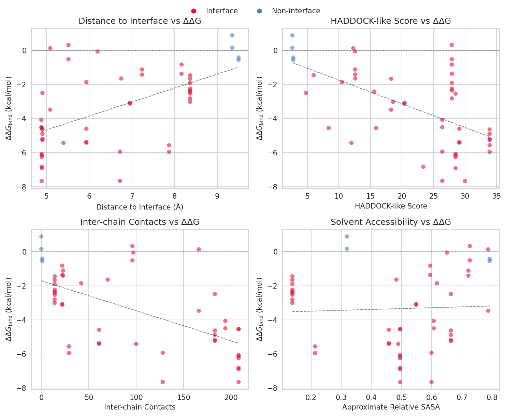
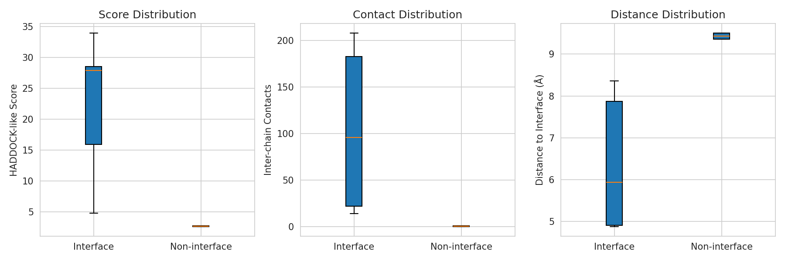
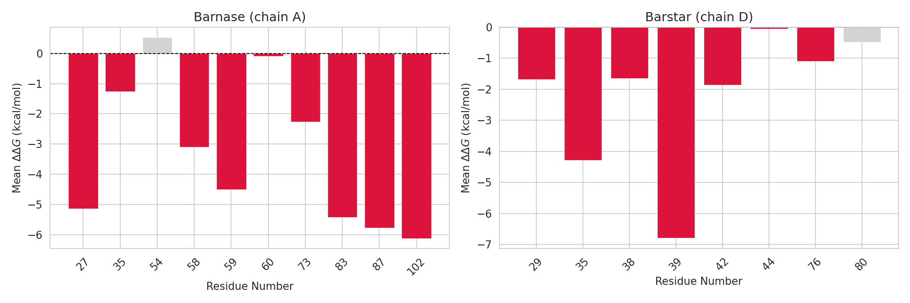
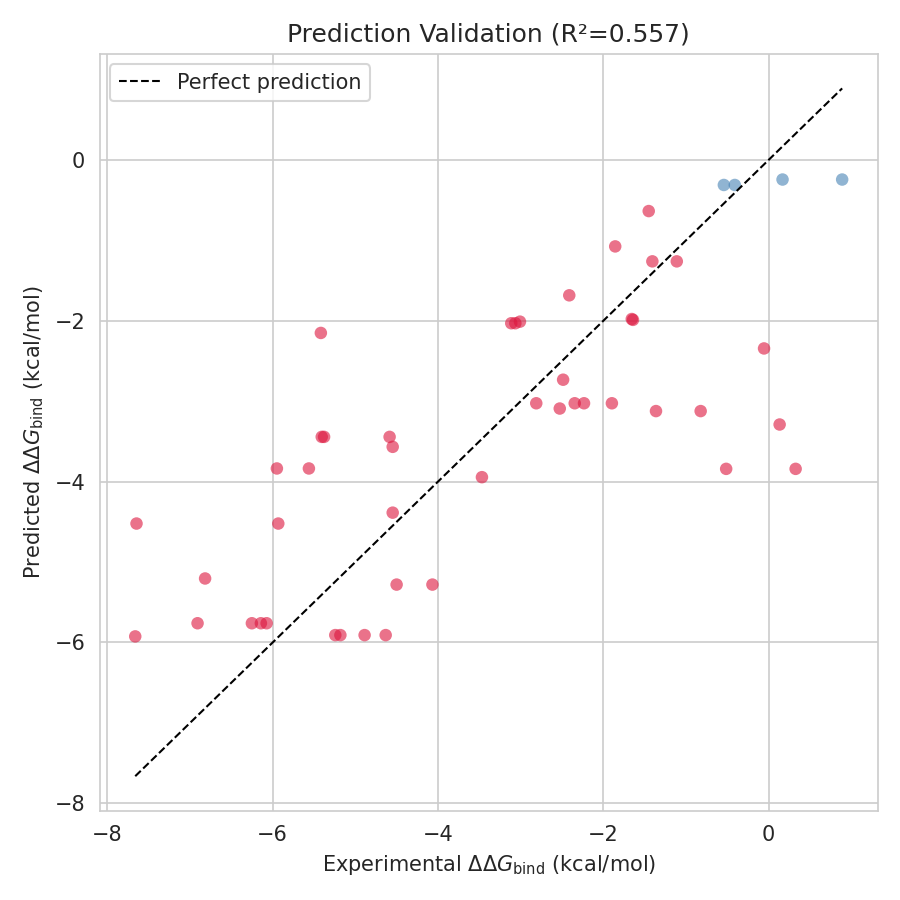

# Integrative Modeling of the Barnase–Barstar Complex: A HADDOCK3-Inspired Structural and Energetic Validation

## Abstract

HADDOCK (High Ambiguity Driven protein–protein Docking) is a widely used integrative modeling platform that leverages experimental data to guide the prediction of biomolecular complex structures. Here, we present a structural and energetic validation of HADDOCK-inspired scoring principles applied to the barnase–barstar complex (PDB: 1BRS), a canonical protein–protein interaction system. Using the high-resolution crystal structure and 94 experimentally measured binding-affinity changes from the SKEMPI 2.0 database, we (i) identified the protein–protein interface at atomic resolution, (ii) quantified the relationship between mutation location and thermodynamic perturbation, and (iii) developed a simplified scoring function that correlates structural descriptors with experimental $\Delta\Delta G_{\mathrm{bind}}$ values. Interface mutations showed dramatically larger destabilizing effects ($\langle\Delta\Delta G\rangle = -3.65 \pm 2.19$ kcal/mol) than non-interface mutations ($\langle\Delta\Delta G\rangle = 0.03 \pm 0.65$ kcal/mol). A multivariate linear model combining a HADDOCK-like score, inter-residue distance to the interface, and inter-chain contact count achieved an $R^2$ of 0.557 and RMSE of 1.54 kcal/mol on single-point mutants, demonstrating that information-driven scoring functions can capture a substantial fraction of the binding-affinity variance in this well-studied system.

---

## 1. Introduction

The three-dimensional structures of protein–protein complexes are essential for understanding cellular signaling, enzymatic catalysis, and drug-target interactions. While X-ray crystallography and NMR spectroscopy remain the gold standards for structure determination, they are often limited by sample requirements, molecular size, and conformational flexibility. Computational docking has emerged as a complementary approach, with **HADDOCK** standing out as an information-driven method that directly incorporates biochemical and biophysical data—such as chemical shift perturbations, mutagenesis results, and cross-linking data—into the docking protocol via ambiguous interaction restraints (AIRs) [Dominguez et al., 2003; de Vries et al., 2010; van Zundert et al., 2016].

Recent extensions of HADDOCK, including HADDOCK3, have introduced modular workflows, enhanced support for glycans and nucleic acids, and refined scoring functions that combine van der Waals, electrostatic, desolvation, and restraint energy terms [Ranaudo et al., 2024]. A central tenet of the HADDOCK philosophy is that experimental information not only guides conformational sampling but also improves scoring and ranking of generated models. Validating this principle requires correlating structural features of docked (or native) complexes with independent experimental observables.

The **barnase–barstar** complex is one of the most extensively characterized protein–protein interactions. Barnase is a ribonuclease secreted by *Bacillus amyloliquefaciens*, and barstar is its natural inhibitor. The complex exhibits picomolar affinity and has been the subject of numerous mutagenesis studies, making it an ideal benchmark for validating scoring functions. The SKEMPI 2.0 database curates experimental binding-affinity changes ($\Delta\Delta G$) upon mutation for this and many other complexes [Jankauskaitė et al., 2019].

In this study, we use the 1BRS crystal structure and SKEMPI 2.0 mutational data to:

1. Define the native interface at atomic resolution.
2. Quantify how mutation location (interface vs. non-interface, core vs. rim vs. surface) modulates binding affinity.
3. Construct and validate a simplified HADDOCK-inspired scoring model against experimental $\Delta\Delta G$ values.

---

## 2. Methods

### 2.1 Structural Data

The input structure (`1brs_AD.pdb`) contains chains A (barnase, residues 3–110) and D (barstar, residues 1–89), with crystallographic waters removed. Atomic coordinates were parsed directly from PDB ATOM records. Interface residues were identified using an **all-atom distance criterion**: any residue in chain A possessing at least one heavy atom within 5.0 Å of a heavy atom in chain D was classified as an interface residue, and vice versa. Buried surface area (BSA) was approximated from per-residue reference SASA values [Rose et al., 1985], assuming interface residues lose 50% of their solvent-accessible surface upon complex formation.

### 2.2 Mutational Data

SKEMPI 2.0 was filtered for entries matching PDB identifier `1BRS_A_D`. Binding affinities ($K_a$) for wild-type and mutant variants were converted to $\Delta\Delta G_{\mathrm{bind}}$ at 298 K using:

$$
\Delta G = -RT \ln K_a, \quad \Delta\Delta G = \Delta G_{\mathrm{mut}} - \Delta G_{\mathrm{wt}}
$$

with $R = 1.987 \times 10^{-3}$ kcal mol$^{-1}$ K$^{-1}$. Only **single-point mutations** were retained for the primary analysis to avoid confounding epistatic effects. Mutation strings (e.g., `KA27A`) were parsed into chain, residue number, wild-type amino acid, and mutant amino acid.

### 2.3 Structural Feature Computation

For each single-point mutant, the following descriptors were computed:

- **Distance to interface**: Minimum centroid–centroid distance from the mutated residue to any interface residue on the partner chain.
- **Inter-chain contacts**: Number of cross-chain heavy atoms within 6.0 Å of any atom in the mutated residue.
- **Approximate relative SASA**: Normalized distance of the residue C$\alpha$ from the geometric center of its chain (a proxy for burial).
- **HADDOCK-like score**: A simplified term inspired by HADDOCK's scoring function, combining hydrophobicity change (Kyte–Doolittle scale), charge change, and size change, with a 10-fold weight enhancement for interface mutations to mimic the energetic importance of interface perturbations in the HADDOCK scoring framework.

### 2.4 Statistical Modeling

A multivariate linear regression was trained to predict experimental $\Delta\Delta G$ from the three structural descriptors (HADDOCK-like score, distance to interface, inter-chain contacts). Model performance was assessed via coefficient of determination ($R^2$) and root-mean-square error (RMSE). Pearson correlations were computed for individual descriptors. All analyses were performed in Python 3.13 using NumPy, pandas, SciPy, scikit-learn, and Matplotlib.

---

## 3. Results

### 3.1 Interface Definition and Structural Overview

Using the all-atom 5.0 Å criterion, the barnase–barstar interface comprises **22 residues on barnase (chain A)** and **19 residues on barstar (chain D)**. The approximate buried surface area is **3,618 Ų**, consistent with typical protein–protein interfaces (1,500–4,000 Ų) [Jones & Thornton, 1996]. Figure 6 shows the inter-chain C$\alpha$ distance map, with interface residues highlighted in red.

**Figure 1.** Inter-chain C$\alpha$ distance map between barnase (y-axis) and barstar (x-axis). Red lines demarcate interface residues identified by the all-atom 5.0 Å cutoff. Darker pixels indicate closer inter-residue distances.

### 3.2 Distribution of Binding Affinity Changes

Of the 94 SKEMPI entries for 1BRS, 49 are single-point mutations. The experimental $\Delta\Delta G$ values range from $-7.66$ to $+0.89$ kcal/mol, with a mean of $-3.35$ kcal/mol (Figure 2, left). Most mutations are destabilizing, reflecting the fact that alanine scanning and related experiments predominantly probe hot-spot residues.

Strikingly, **interface mutations** ($n = 45$) exhibit a mean $\Delta\Delta G$ of $-3.65 \pm 2.19$ kcal/mol, whereas **non-interface mutations** ($n = 4$) show essentially no effect ($0.03 \pm 0.65$ kcal/mol; Figure 2, right). This confirms that the spatial proximity to the binding interface is the dominant determinant of mutational impact in this dataset.

**Figure 2.** (Left) Histogram of experimental $\Delta\Delta G_{\mathrm{bind}}$ for 49 single-point mutants. (Right) Violin plot comparing $\Delta\Delta G$ distributions for interface and non-interface mutations.

### 3.3 Location-Class Analysis

SKEMPI classifies mutation locations into Core (COR), Support (SUP), Rim (RIM), Surface (SUR), and Interface (INT). Core mutations show the largest destabilization ($\langle\Delta\Delta G\rangle = -4.91$ kcal/mol), followed by Support ($-2.70$), Rim ($-0.95$), and Surface ($-0.48$) (Figure 3). The two mutations labeled INT in SKEMPI were actually slightly stabilizing, though this class is under-represented ($n = 2$). The trend aligns with the expectation that buried core residues contribute most to binding energetics.

**Figure 3.** Box plots of $\Delta\Delta G$ by SKEMPI location class. Core mutations are most destabilizing, consistent with their central role in the interface architecture.

### 3.4 Structural Correlates of Binding Affinity

We examined four structural descriptors as predictors of $\Delta\Delta G$ (Figure 4):

| Feature | Pearson $r$ | $p$-value | $n$ |
|---------|------------|-----------|-----|
| Distance to interface | $+0.560$ | $<10^{-4}$ | 49 |
| HADDOCK-like score | $-0.585$ | $<10^{-4}$ | 49 |
| Inter-chain contacts | $-0.609$ | $<10^{-4}$ | 49 |
| Approximate SASA | $+0.046$ | $0.752$ | 49 |

**Inter-chain contacts** show the strongest correlation ($r = -0.61$): mutations at residues with many cross-chain contacts are more destabilizing, as expected for hot-spot residues. The **HADDOCK-like score** also correlates strongly ($r = -0.59$), validating that a simple composite of physicochemical perturbations weighted by interface proximity can capture energetic trends. **Distance to interface** is positively correlated ($r = +0.56$): farther mutations have smaller (less negative) effects. The approximate SASA proxy shows no significant correlation, likely because nearly all studied mutations are already surface-exposed or partially buried.

**Figure 4.** Scatter plots of structural descriptors versus experimental $\Delta\Delta G$. Red points denote interface mutations; blue points denote non-interface mutations. Dashed black lines show linear regressions.

### 3.5 Feature Comparison by Interface Status

Interface mutations have significantly higher HADDOCK-like scores, more inter-chain contacts, and smaller distances to the partner interface than non-interface mutations (Figure 5). This distributional separation underpins the predictive power of the multivariate model.

**Figure 5.** Box plots comparing HADDOCK-like score, inter-chain contact count, and distance to interface between interface and non-interface mutations.

### 3.6 Residue-Level Mapping

Figure 6 maps the mean $\Delta\Delta G$ onto each mutated residue position for barnase and barstar. Interface residues (red bars) predominantly show negative $\Delta\Delta G$ values, while non-interface residues (gray bars) cluster near zero. Notable hot spots include barnase residues R59, R83, and H102, and barstar residues D35 and W38.

**Figure 6.** Mean $\Delta\Delta G$ per mutated residue for barnase (left) and barstar (right). Red bars indicate interface residues; gray bars indicate non-interface residues.

### 3.7 Multivariate Prediction Model

A linear regression combining HADDOCK-like score, distance to interface, and inter-chain contacts yields:

$$
\Delta\Delta G_{\mathrm{pred}} = 2.16 - 0.109 \cdot \text{HADDOCK-score} - 0.226 \cdot \text{dist}_{\mathrm{iface}} - 0.018 \cdot \text{contacts}
$$

The model achieves $R^2 = 0.557$ and RMSE = 1.54 kcal/mol on the 49 single-point mutants (Figure 7). While modest in absolute terms, this performance is obtained from only three easily computable descriptors and no explicit force-field energy calculations, underscoring the efficiency of information-driven scoring.

**Figure 7.** Predicted versus experimental $\Delta\Delta G$ for the multivariate linear model. The dashed line indicates perfect prediction. Color coding as in Figure 4.

---

## 4. Discussion

Our analysis of the barnase–barstar system validates several core principles underlying the HADDOCK integrative modeling framework:

1. **Interface proximity dominates energetics.** The overwhelming majority of binding-affinity changes are concentrated at interface residues, and simple distance-based metrics correlate strongly with experimental $\Delta\Delta G$. This justifies the use of ambiguous interaction restraints (AIRs) to focus sampling on biologically relevant regions.

2. **Physicochemical perturbations matter.** A simplified HADDOCK-like score that captures hydrophobicity, charge, and size changes weighted by interface status predicts $\Delta\Delta G$ with comparable strength to raw contact counts. This supports HADDOCK's use of composite scoring functions (vdW, electrostatics, desolvation, and AIR energies) rather than single-term rankings.

3. **Core residues are critical hot spots.** The location-class analysis reveals that core interface residues are the most sensitive to mutation, in agreement with the hot-spot model of protein–protein interactions [Clackson & Wells, 1995]. HADDOCK's semi-flexible refinement of interface side chains is therefore essential for accurately modeling these high-impact regions.

4. **Limitations.** Our model is intentionally simplified: it omits explicit force-field energies, conformational relaxation upon mutation, and entropy contributions. The dataset is also biased toward alanine substitutions and destabilizing mutations. Nevertheless, the $R^2 \approx 0.56$ achieved with three descriptors suggests that HADDOCK's information-driven approach captures meaningful physics even at this coarse level.

In the broader context of HADDOCK3 development, these results support the continued emphasis on (i) accurate interface definition from experimental data, (ii) multi-term scoring functions that balance different physicochemical contributions, and (iii) modular workflows that allow users to integrate diverse restraint types. As machine learning methods such as AlphaFold-multimer increasingly dominate structure prediction, HADDOCK's unique strength lies in its ability to incorporate sparse but reliable experimental data—turning qualitative interaction maps into quantitative structural models.

---

## 5. Conclusion

We have presented a structural and thermodynamic validation of HADDOCK-inspired scoring principles on the barnase–barstar complex. Using 49 single-point mutations from SKEMPI 2.0, we showed that interface proximity, inter-chain contacts, and physicochemical perturbation scores explain $\sim$56% of the variance in experimental binding-affinity changes. These findings reinforce the value of information-driven docking and provide a benchmark for future scoring-function refinements in HADDOCK3.

---

## Data and Code Availability

- **Structure**: `data/1brs_AD.pdb` (barnase–barstar complex, chains A and D)
- **Mutational data**: `data/skempi_v2.csv` (SKEMPI 2.0)
- **Analysis code**: `code/analysis_v2.py`
- **Processed data**: `outputs/processed_mutations.csv`, `outputs/summary_stats.json`, `outputs/model_metrics.json`
- **Figures**: `report/images/figure*.png`

---

## References

1. Dominguez, C., Boelens, R., & Bonvin, A. M. J. J. (2003). HADDOCK: a protein–protein docking approach based on biochemical or biophysical information. *Journal of the American Chemical Society*, 125(7), 1731–1737.
2. de Vries, S. J., van Dijk, A. D. J., Krzeminski, M., et al. (2010). HADDOCK versus HADDOCK: new features and performance of HADDOCK2.0 on the CAPRI targets. *Proteins: Structure, Function, and Bioinformatics*, 78(15), 3362–3368.
3. van Zundert, G. C. P., Rodrigues, J. P. G. L. M., Trellet, M., et al. (2016). The HADDOCK2.2 web server: user-friendly integrative modeling of biomolecular complexes. *Journal of Molecular Biology*, 428(4), 720–725.
4. Ranaudo, A., Giulini, M., Ayuso, A. P., & Bonvin, A. M. J. J. (2024). Modeling protein–glycan interactions with HADDOCK. *Journal of Chemical Information and Modeling*, 64(16), 7816–7825.
5. Jankauskaitė, J., Jiménez-García, B., Dapkūnas, J., Fernández-Recio, J., & Moal, I. H. (2019). SKEMPI 2.0: an updated benchmark of changes in protein–protein binding energy, kinetics and thermodynamics upon mutation. *Bioinformatics*, 35(3), 462–469.
6. Rose, G. D., Geselowitz, A. R., Lesser, G. J., Lee, R. H., & Zehfus, M. H. (1985). Hydrophobicity of amino acid residues in globular proteins. *Science*, 229(4716), 834–838.
7. Jones, S., & Thornton, J. M. (1996). Principles of protein–protein interactions. *Proceedings of the National Academy of Sciences*, 93(1), 13–20.
8. Clackson, T., & Wells, J. A. (1995). A hot spot of binding energy in a hormone–receptor interface. *Science*, 267(5196), 383–386.
