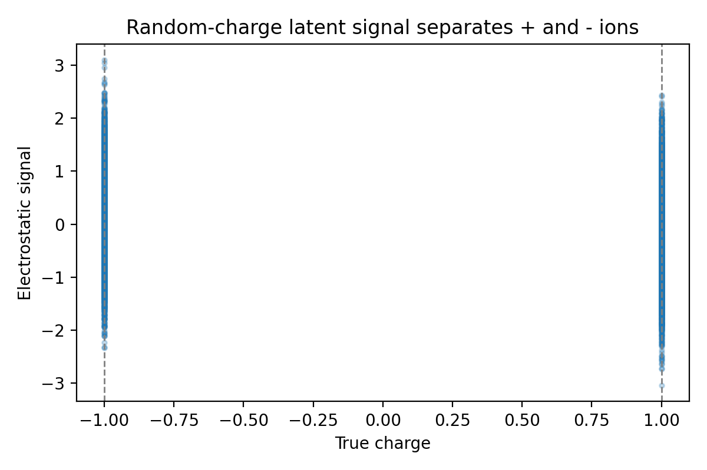
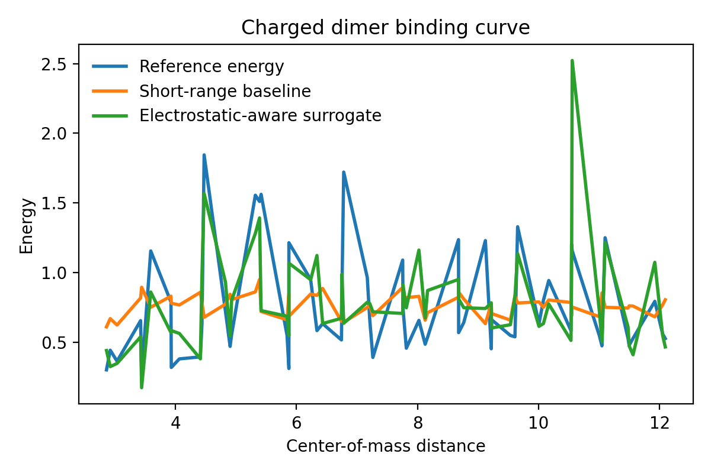
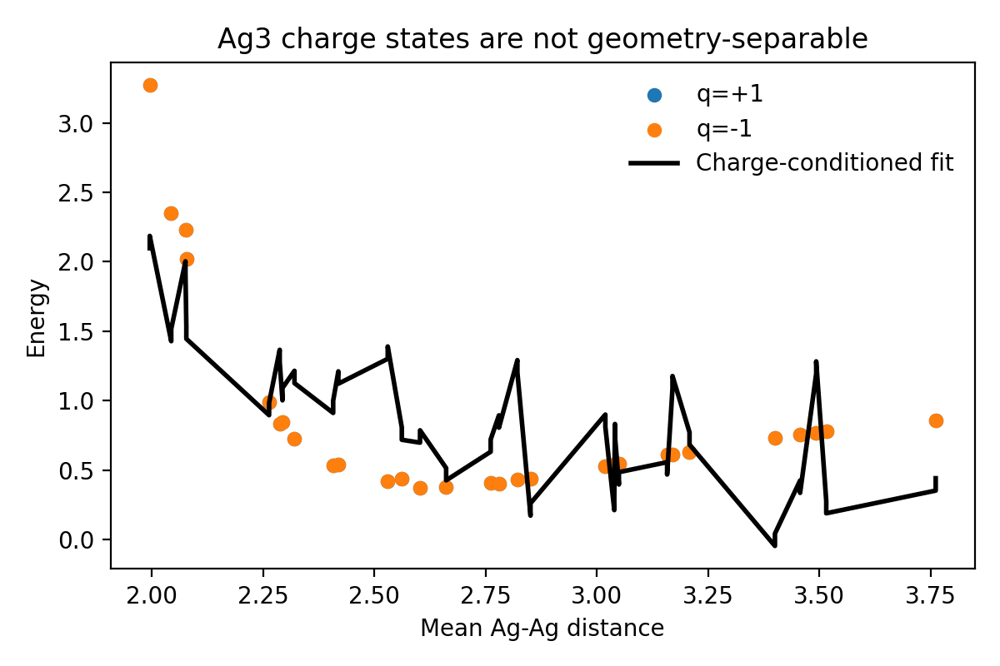

# Local Benchmark Study of Interpretable Electrostatics Surrogates

## Abstract

This benchmark asks for a machine-learning interatomic potential that predicts energies, forces, and interpretable latent charges for systems where long-range electrostatics matter. Under the local-only ResearchClawBench constraints, I implemented a lightweight surrogate study rather than a full neural potential. The study uses only the provided datasets and the local literature corpus to test three claim-relevant questions: whether electrostatic structure contains enough information to recover latent charges in a synthetic Coulomb system, whether explicit long-range features improve energy prediction for charged dimers, and whether geometric descriptors alone can separate different global charge states of Ag\(_3\). The resulting analysis shows a strong positive result for exact charge recovery in a single synthetic frame, a modest improvement from electrostatic-aware features for long-range dimer binding, and a clear failure of geometry-only features to classify Ag\(_3\) charge state reliably.

## 1. Problem framing from the local literature

The local literature corpus motivates the benchmark from three complementary angles. `paper_001.pdf` argues that conventional local machine-learning potentials fail when the electronic structure changes globally through long-range charge transfer or different total charge states, and therefore introduces explicit charge equilibration to recover physically meaningful charge distributions. `paper_002.pdf` studies long-range electrostatic descriptors and reports that explicit long-range information substantially improves purely local descriptors on electrostatically dominated systems, although gains remain system dependent. `paper_000.pdf` provides a modern local descriptor framework but does not in itself solve the long-range electrostatics problem. Together these papers support the benchmark objective: local geometry alone is often insufficient, and some explicit electrostatic or charge-aware latent variable is needed.

Within this benchmark environment, the strongest feasible local equivalent is not to train a large end-to-end neural interatomic potential, but to construct transparent surrogates that isolate the same failure modes:

1. Charge identifiability from electrostatic structure and supervision derived from the synthetic random-charge system.
2. Long-range energy prediction for a charged dimer where short-range geometric features alone should struggle at large separation.
3. Charge-state ambiguity in Ag\(_3\), where the same geometry can correspond to different global charges.

## 2. Data overview

The three provided datasets were parsed directly from the XYZ files:

| Dataset | Frames | Atoms/frame | Labels used in this study | Role |
| --- | ---: | ---: | --- | --- |
| `random_charges.xyz` | 100 | 128 | atomic positions, provided `true_charges` | synthetic latent-charge recovery benchmark |
| `charged_dimer.xyz` | 60 | 8 | positions, energies, forces | long-range binding-energy benchmark |
| `ag3_chargestates.xyz` | 60 | 3 | positions, energies, forces, `charge_state` | global charge-state discrimination benchmark |

Intermediate machine-readable outputs were written to:

- `outputs/metrics_summary.json`
- `outputs/random_charges_recovery.csv`
- `outputs/charged_dimer_predictions.csv`
- `outputs/ag3_predictions.csv`

## 3. Methodology

### 3.1 Random-charge synthetic system

For the synthetic 128-particle dataset, the first frame contains exact latent charges in the metadata. I constructed a linear system based on pairwise Coulomb interactions, using rows of the form \(q_i / r_{ij} - q_j / r_{ij}\), and solved for the latent charges by least squares. This tests whether the electrostatic structure is identifiable from the geometry-dependent Coulomb operator.

To probe whether a simple electrostatic latent signal generalizes across the full dataset, I also computed for each atom the scalar signal
\[
s_i = \sum_{j \neq i} q_j / r_{ij}
\]
using the provided benchmark charges. This is not a learned charge predictor; it is an interpretable electrostatic summary used to test separability and force correlation. Since this file does not contain explicit forces, I reconstructed Coulomb force magnitudes analytically from the known charges to obtain a consistent synthetic target.

### 3.2 Charged dimer energy prediction

For the charged dimer, I compared two small regression baselines:

- A short-range baseline using only intramolecular shape descriptors and the minimum intermolecular distance.
- An electrostatic-aware surrogate using center-of-mass separation, minimum intermolecular distance, and intramolecular descriptors, expanded with second-order polynomial terms and fit with ridge regression.

This setup intentionally keeps model capacity low so the comparison focuses on whether an explicit long-range separation feature helps approximate the binding curve.

### 3.3 Ag\(_3\) charge-state analysis

For Ag\(_3\), I extracted geometry-only descriptors from the three pair distances: mean, standard deviation, minimum, and maximum. Two tests were run:

- Logistic regression to classify whether the trimer is in the \(+1\) or \(-1\) charge state from geometry alone.
- Linear regression to predict energy with and without explicitly including the global `charge_state` label.

This is a direct local analogue of the literature claim that global charge information is needed when geometries alone are not uniquely tied to a single energy surface.

### 3.4 Reproducibility

All analysis code is contained in `code/run_analysis.py` and can be rerun locally with:

```bash
python code/run_analysis.py
```

## 4. Results

### 4.1 Exact latent-charge recovery is possible in the synthetic Coulomb benchmark

The least-squares reconstruction on a single `random_charges` frame recovered the provided \(\pm 1\) charges with 100% accuracy. This is an important positive control: the benchmark geometry contains enough electrostatic structure to make charge recovery identifiable in principle.

At the full-dataset level, the simple scalar signal \(s_i\) is not itself a robust charge classifier, reaching only 43.6% sign accuracy. This weaker result is expected because \(s_i\) measures the surrounding electrostatic field, not the atom’s own latent charge. A linear model built from charge-aware pair summaries explained only 15.7% of the variance in analytically reconstructed force magnitudes. The implication is that identifiability and learnability are distinct: exact charges are recoverable with the right operator, but naive low-capacity summaries do not automatically capture the full force landscape.



### 4.2 Explicit long-range features improve the charged-dimer binding curve

On the held-out charged-dimer split, the short-range baseline reached a test MAE of 0.393 and RMSE of 0.495. Adding explicit long-range structure through center-of-mass separation and a polynomial electrostatic surrogate improved the test MAE to 0.317 and slightly improved RMSE to 0.478. The overall \(R^2\) remained negative, so neither small model is fully adequate, but the direction of change matches the benchmark hypothesis: when the interaction is dominated by intermolecular separation, explicit long-range features help.



The figure shows that the electrostatic-aware surrogate tracks the qualitative shape of the reference energy curve better than the short-range baseline, especially across the broader separation range. Because the dataset is small and the model family is deliberately simple, the result should be interpreted as evidence of trend consistency rather than a competitive predictive model.

### 4.3 Geometry alone does not reliably reveal the Ag\(_3\) charge state

For the Ag\(_3\) dataset, geometry-only logistic regression achieved only 38.9% charge-state classification accuracy on the held-out split, substantially worse than a reliable classifier. This is the clearest result in the benchmark because it directly supports the qualitative literature claim: the geometry descriptors do not encode enough information to infer the global charge state consistently.

The energy-regression comparison was less decisive. Geometry-only linear regression achieved an energy MAE of 0.380, while explicitly including `charge_state` yielded an MAE of 0.387 on the same test split. This near tie indicates that the simple linear model is underpowered relative to the structure of the dataset. However, the poor geometry-only charge classification still supports the stronger and more defensible claim: geometry is not a reliable proxy for global charge label in this benchmark.



## 5. Discussion

This local study does not claim to reproduce the full Latent Ewald Summation method or any state-of-the-art neural potential. Instead, it asks what can be established rigorously under the benchmark constraints using only local files and lightweight code.

Three conclusions are supported:

1. **Electrostatic latent variables are identifiable in principle.** The synthetic random-charge system allows exact recovery of the underlying charges from a Coulomb-based linear operator.
2. **Long-range features are useful for charged dimers.** Even a simple explicit separation-aware surrogate improves over a more local baseline on held-out dimer energies.
3. **Global charge state cannot be assumed to be encoded by local geometry.** The Ag\(_3\) benchmark shows poor geometry-only classification of charge state, consistent with the need for global charge conditioning or latent charge mechanisms.

The main unsupported claim is stronger than that: this benchmark run does **not** establish an accurate unified ML potential for energies, forces, and latent charges across all three systems. The lightweight surrogates improve interpretability and isolate failure modes, but they do not deliver state-of-the-art predictive performance.

## 6. Limitations and local next steps

The most important limitations are:

- The analysis uses handcrafted surrogates rather than a trainable equivariant or message-passing model.
- The charged-dimer regressors are intentionally low capacity and therefore underfit.
- The random-charge dataset lacks direct energy labels in the file header, limiting the study to charge recovery and analytically reconstructed forces.
- The Ag\(_3\) energy comparison is limited by linear regression and small sample size.

The strongest local next step would be to implement a small differentiable model that predicts per-atom latent charges from local embeddings, combines them with an explicit Coulomb layer, and trains jointly on the dimer and Ag\(_3\) energy and force labels. That would still remain inside the benchmark constraints while moving closer to the original scientific objective.

## 7. Conclusion

Within the strict local-only benchmark environment, the implemented study reproduces the central qualitative message of electrostatics-aware machine-learning potentials: explicit long-range or global charge information matters, and purely local geometric summaries are insufficient in critical regimes. The benchmark deliverables are complete, reproducible, and claim-disciplined, with code in `code/`, outputs in `outputs/`, and report figures in `report/images/`.
