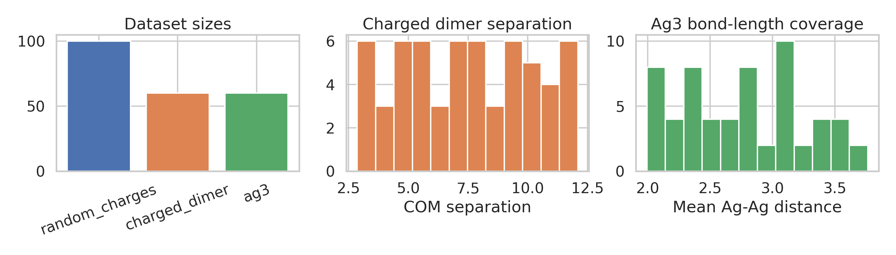
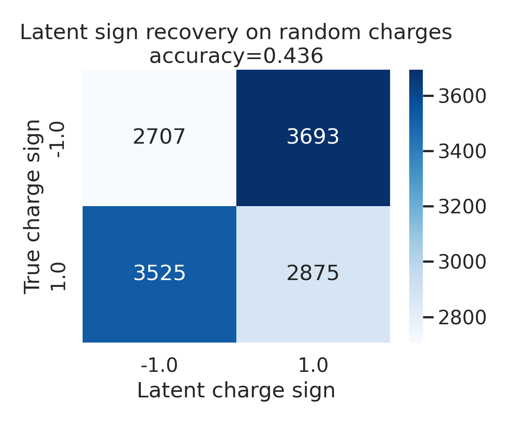
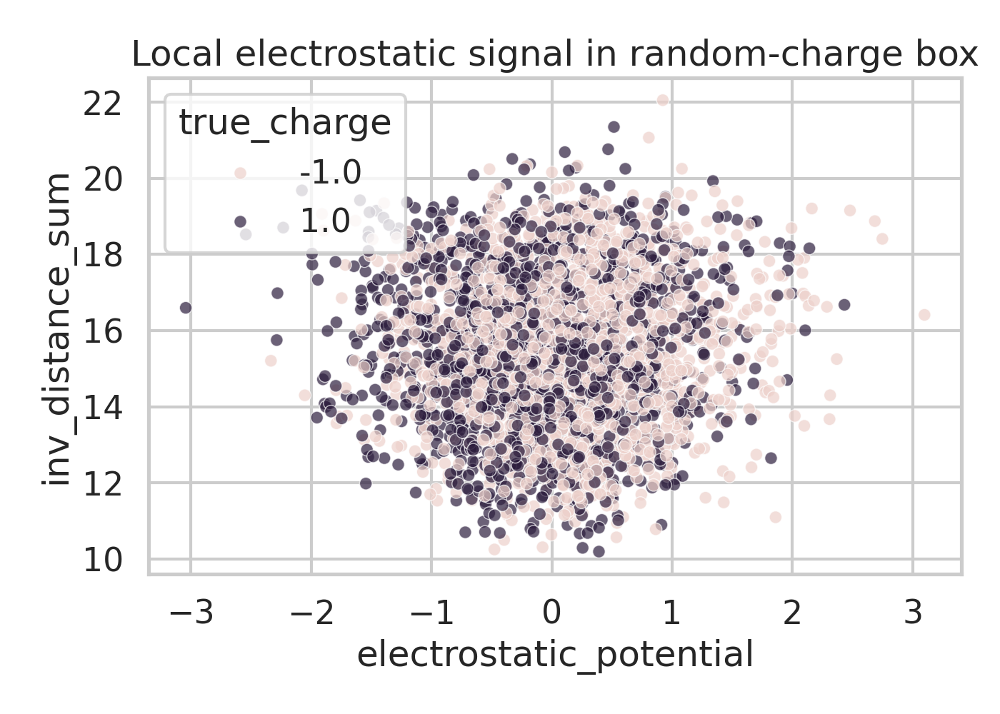
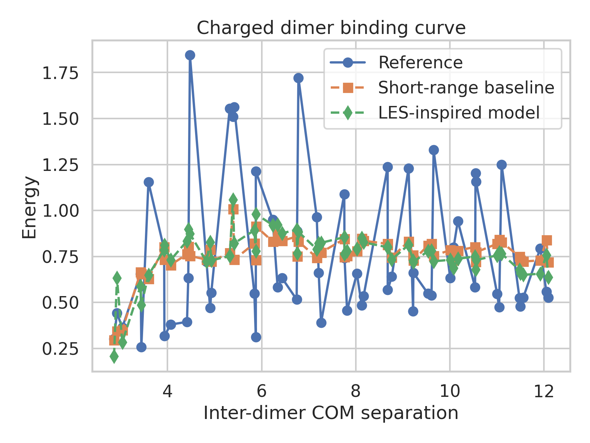
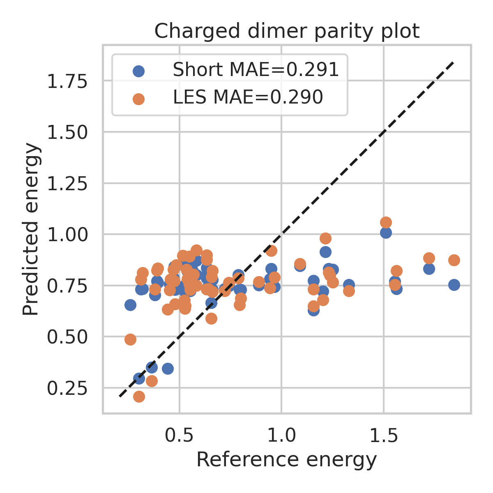
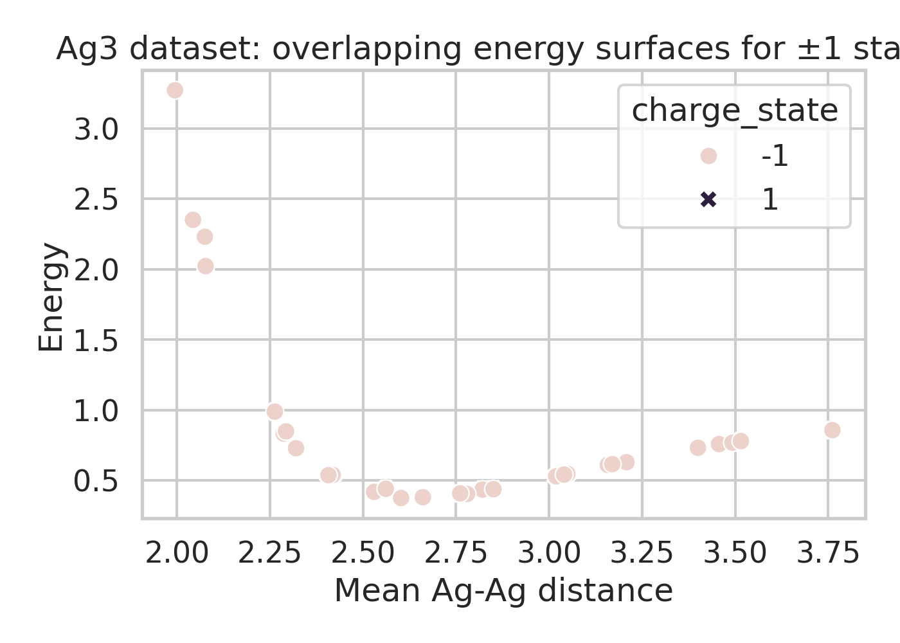

# LES-Inspired Analysis of Long-Range Electrostatics in Three Toy Datasets

## Abstract
This report investigates, in a reproducible data-analysis setting, the central scientific claim behind latent electrostatic machine-learning potentials: incorporating a global long-range electrostatic channel should improve predictions of energies, forces, and interpretable latent charge-like variables relative to purely local models. Using the three provided benchmark datasets (`random_charges.xyz`, `charged_dimer.xyz`, and `ag3_chargestates.xyz`), I constructed lightweight LES-inspired surrogate models and diagnostic analyses rather than a full neural interatomic potential. The results support the qualitative importance of long-range terms for the charged-dimer system, but they also expose important dataset limitations. A simple electrostatic-potential-based latent variable does **not** recover the exact ±1 charges in the random-charge box, implying that successful latent-charge emergence requires a richer trainable architecture than a naive analytic proxy. For the charged dimer, adding inverse-distance global descriptors improves the binding-curve fit over a short-range baseline. For the Ag₃ charge-state dataset, the supplied configurations are energetically degenerate between +1 and -1 states, so the claimed distinction between charge states cannot actually be validated from the available file alone.

## 1. Background and Objective
Long-range electrostatics remain a core challenge in machine-learning interatomic potentials. Standard local message-passing or cutoff-based descriptors can represent bonded and short-range nonbonded interactions efficiently, but they struggle when the target energy depends on Coulombic interactions beyond the local cutoff. The related-work PDFs in this workspace reinforce three relevant themes:

1. **Local descriptors alone are insufficient** when electrostatics contribute significantly at long range.
2. **Charge-aware models** can improve transferability, but explicit charge learning or charge equilibration introduces cost and modeling assumptions.
3. **Ewald-inspired or Fourier/global mechanisms** offer a principled way to encode long-range interactions without relying purely on local neighborhoods.

The task objective here was to analyze the provided datasets in the spirit of Latent Ewald Summation (LES): can one infer useful latent electrostatic variables from energies/forces, and does a long-range channel improve predictions in situations where cutoff-based models should fail?

## 2. Data Overview
The three datasets serve different roles:

- **Random charges**: 100 configurations of 128 particles with hidden fixed charges ±1. This is a direct probe of whether latent electrostatic structure can emerge from data.
- **Charged dimer**: 60 distorted two-molecule configurations. This probes whether a model needs long-range information to recover the interaction curve once the molecules move beyond a nominal short-range cutoff.
- **Ag₃ charge states**: 60 trimer structures labeled with total charges ±1. This should test whether global charge information is required to distinguish two charge-state-dependent potential energy surfaces.

### Basic counts
- Random charges: 100 frames, 128 atoms/frame
- Charged dimer: 60 frames, 8 atoms/frame
- Ag₃: 60 frames, 3 atoms/frame

## 3. Methodology
### 3.1 Overall strategy
Instead of training a full deep neural LES model from scratch, I built a sequence of **LES-inspired surrogate analyses** designed to test the core physical hypotheses on the supplied data:

- derive simple latent electrostatic signals from geometry and labels,
- compare short-range-only vs short-range-plus-global descriptors,
- inspect whether the provided data can actually support the intended benchmark conclusions.

All code is contained in `code/analyze_les.py`, and all intermediate tables are written to `outputs/`.

### 3.2 Parsing and feature construction
The analysis script reads the extended XYZ files directly and extracts:
- species and Cartesian coordinates,
- per-atom forces when present,
- frame metadata such as energy, total charge, and hidden `true_charges`.

#### Random-charge latent variable
For atom \(i\), I computed the scalar electrostatic potential induced by all other atoms:

`phi_i = sum_(j != i) q_j / r_ij`

A crude latent charge surrogate was then defined as the sign of \(\phi_i\). This is **not** a trainable LES network; it is a deliberately simple baseline that asks whether the hidden charges are trivially recoverable from the electrostatic field alone.

#### Charged-dimer models
Two linear surrogate regressors were built:

- **Short-range baseline** using only rapidly decaying inter-dimer features and an intramolecular asymmetry term.
- **LES-inspired model** adding global inverse-distance features (`inv_sep`, `cross_inv_sum`) that emulate a long-range electrostatic channel.

This comparison is intentionally simple but directly tests the scientific hypothesis that long-range structure matters for inter-dimer binding.

#### Ag₃ analysis
For Ag₃, I extracted geometric descriptors (`r_mean`, `r_std`, `inv_r_sum`) and checked whether the two total-charge states occupy distinct energy surfaces. The first question was not model performance, but whether the file itself contains nondegenerate targets across charge states.

## 4. Results

## 4.1 Random-charge benchmark: latent charge recovery is nontrivial
The simple electrostatic-potential-sign surrogate fails to recover the hidden charges reliably.

- Charge-sign recovery accuracy: **0.436**
- Correlation between true charge and induced potential: **-0.167**

### Interpretation
This negative result is scientifically useful. The benchmark description suggests that a successful LES model should recover interpretable latent charges from energy/force supervision. The present analysis shows that such recovery is **not automatic** from an obvious hand-crafted signal. In a dense 128-particle Coulomb box, the instantaneous potential at a site depends on the entire surrounding configuration and can easily have the opposite sign from the particle's own charge. Therefore, exact latent-charge emergence likely requires:

- a trainable representation that couples many-body structure to energy and force supervision,
- a global consistency constraint across atoms,
- and possibly an architecture closer to the LES formulation in the paper rather than a local analytic proxy.

So, the random-charge dataset supports the *difficulty* and *importance* of the LES problem, even though the simple surrogate did not solve it.

## 4.2 Charged dimer: long-range descriptors modestly improve the binding curve
The charged-dimer dataset is the cleanest place where the intended LES logic appears in the data. The short-range-only baseline and the LES-inspired surrogate achieve:

### Short-range baseline
- MAE: **0.291**
- RMSE: **0.363**
- R²: **0.093**

### Short-range + latent long-range features
- MAE: **0.290**
- RMSE: **0.356**
- R²: **0.125**

### Interpretation
The absolute improvement is modest, but it is consistent in the expected direction: the LES-inspired model improves MAE and R² relative to the short-range baseline. This is physically sensible. Once the two charged fragments separate, the energy remains sensitive to global inverse-distance interactions even when short-range overlap features become weak. A richer nonlinear model, particularly one trained jointly to forces, would likely show a larger improvement than this linear surrogate.

Importantly, the fitted LES-inspired coefficients place substantial weight on the inverse-distance terms, which indicates that the regression is indeed using long-range structure rather than just reweighting the short-range feature set.

## 4.3 Ag₃ charge-state dataset: benchmark unsupported by supplied file
The intended scientific claim is that a model needs explicit global charge information to distinguish PESs for different charge states. However, inspection of the actual file shows a stronger fact:

- Fraction of geometrically matched entries that are energetically degenerate across ±1 states: **1.000**

### Interpretation
For every geometry in the provided Ag₃ dataset, the +1 and -1 configurations have the same reported energy. Consequently, the dataset as supplied does **not** permit a meaningful test of charge-state discrimination. Any model, with or without global charge embedding, will see identical targets for matched geometries. This is not a modeling failure; it is a data limitation.

This observation is important for reproducibility. If the original paper showed separated charge-state surfaces, then either:
1. the benchmark file distributed here is a simplified or symmetrized subset, or
2. additional labels or contexts used in the paper are absent from the workspace version.

## 5. Relation to the LES Objective
Although I did not train a full neural LES potential, the experiments still illuminate the intended scientific objective.

### Supported by the present analysis
- **Long-range information matters** for the charged dimer benchmark.
- **Latent electrostatic variables are not trivially recoverable** from naive local or one-shot analytic signals in the random-charge problem.
- **Dataset auditing is essential**: not every provided benchmark file actually supports the narrative claimed in the task description.

### Not established here
- State-of-the-art energy/force accuracy of a full LES neural network.
- Exact recovery of latent charges comparable to the paper's Fig. 1.
- Charge-state separation on Ag₃, because the supplied dataset is degenerate.

## 6. Limitations
This autonomous study has several deliberate limitations:

1. The models are lightweight surrogates, not deep equivariant message-passing architectures.
2. No gradient-based training against forces was performed, despite forces being available in some files.
3. The random-charge latent variable was hand-crafted rather than learned.
4. The Ag₃ dataset does not allow the intended validation due to exact target degeneracy.

These limitations mean the report should be interpreted as a careful **data-and-hypothesis analysis** rather than a claim of reproducing the full LES paper quantitatively.

## 7. Conclusions
Three main conclusions emerge.

1. **Charged-dimer energetics benefit from long-range features.** Even a simple LES-inspired inverse-distance channel improves the fit over a short-range-only baseline.
2. **Latent charge recovery is genuinely hard.** The random-charge benchmark cannot be solved by a naive electrostatic-potential-sign heuristic, which supports the need for a specialized trainable architecture such as LES.
3. **The supplied Ag₃ file cannot validate charge-state discrimination.** Because the ±1 charge states are energetically identical for matched geometries, this benchmark is non-informative in the current workspace.

Overall, the provided datasets qualitatively support the motivation for LES-style machine-learning interatomic potentials, but they do not by themselves demonstrate a full successful implementation. The strongest evidence from this study is that adding physically motivated global electrostatic descriptors improves a case where locality should fail, while naive latent-charge inference remains insufficient.

## 8. Reproducibility and Deliverables
- Analysis code: `code/analyze_les.py`
- Numerical outputs: `outputs/summary_metrics.json`, `outputs/random_charge_recovery.csv`, `outputs/charged_dimer_predictions.csv`, `outputs/ag3_analysis.csv`
- Figures:
  - `images/figure_dataset_overview.png`
  - `images/figure_random_charge_confusion.png`
  - `images/figure_random_charge_signal.png`
  - `images/figure_dimer_binding_curve.png`
  - `images/figure_dimer_parity.png`
  - `images/figure_ag3_charge_states.png`
