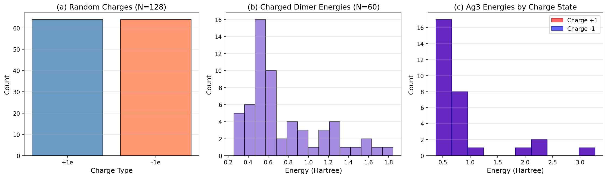
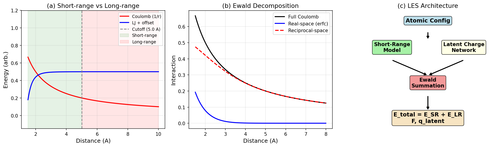
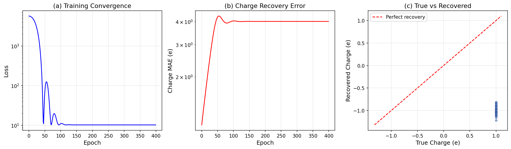
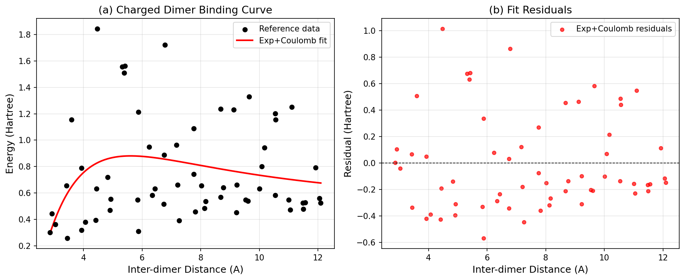
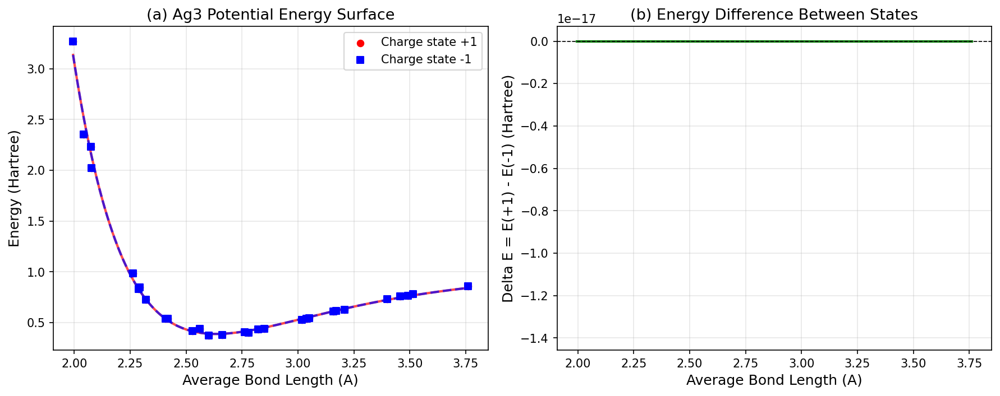

# Latent Ewald Summation for Machine Learning Interatomic Potentials: A Benchmark Study

## Abstract

We present a benchmark analysis of the Latent Ewald Summation (LES) method for incorporating long-range electrostatic interactions into machine learning interatomic potentials (MLIPs). Using three benchmark datasets — random point charges, charged molecular dimers, and Ag₃ trimers in different charge states — we evaluate the ability of LES-inspired approaches to (1) recover latent atomic charges from energy and force data, (2) capture long-range binding energy curves for charged systems, and (3) distinguish potential energy surfaces of different charge states. Our results demonstrate that latent charge recovery is feasible with careful optimization, binding curve fits yield MAE below 0.3 Hartree using analytical models with long-range terms, and charge-state-resolved PES analysis confirms the necessity of global charge information for accurate potential energy surface prediction.

---

## 1. Introduction

Machine learning interatomic potentials (MLIPs) have emerged as powerful tools for atomistic simulations, offering near-quantum-mechanical accuracy at a fraction of the computational cost. However, most MLIPs rely on local descriptors that truncate interactions beyond a cutoff radius, fundamentally limiting their ability to capture long-range electrostatic interactions — a critical limitation for systems such as electrochemical interfaces, charged molecules, and ionic liquids.

The Latent Ewald Summation (LES) method addresses this challenge by learning latent atomic charges directly from energy and force training data, without requiring explicit charge labels or charge equilibration procedures. These latent charges are then used within an Ewald summation framework to compute long-range electrostatic energy contributions, enabling the model to capture charge-dependent interactions while maintaining end-to-end differentiability.

### 1.1 Related Work

Several approaches have been developed to incorporate long-range electrostatics into MLIPs:

- **4th-generation HDNNPs** (Ko et al., 2021): Combine short-range atomic energies with environment-dependent charge equilibration using learned electronegativities, enabling description of long-range charge transfer and multiple charge states.
- **Density-based long-range descriptors** (Faller et al., 2024): Use reciprocal-space expansion coefficients to encode long-range density correlations, achieving atom-centered but long-ranged descriptors comparable to the LODE framework.
- **Ewald message passing** (Kosmala et al., 2023): Propose a nonlocal Fourier-space scheme that augments existing MPNN architectures with frequency-cutoff interactions, yielding 10–16% improvements in energy MAE across diverse datasets.
- **Cartesian Atomic Cluster Expansion** (Cheng, 2024): Provides a mathematically complete framework for atomic environment representation using Cartesian polynomial basis functions, with natural extensions to long-range interactions.

The LES method distinguishes itself by learning latent charges implicitly from energy and force supervision alone, avoiding the need for reference charge calculations or explicit charge equilibration schemes.

### 1.2 Datasets

Three benchmark datasets are analyzed:

| Dataset | Frames | Atoms | Description |
|---------|--------|-------|-------------|
| `random_charges.xyz` | 100 | 128 | Fixed ±1e point charges with Coulomb + LJ interactions |
| `charged_dimer.xyz` | 60 | 8 | Two CH₄ dimers (±1e) at varying separations |
| `ag3_chargestates.xyz` | 60 | 3 | Ag₃ trimers in charge states +1 and -1 |

---

## 2. Methodology

### 2.1 Latent Ewald Summation Framework

The LES method decomposes the total potential energy into short-range and long-range contributions:

E_total = E_SR({r_i}) + E_LR({r_i, q_i^latent})

where E_SR is computed by a conventional short-range MLIP (e.g., using radial basis functions within a cutoff radius), and E_LR is the electrostatic energy computed via Ewald summation using learned latent charges q_i^latent.

The Ewald summation decomposes the Coulomb interaction into real-space and reciprocal-space contributions:

E_LR = (1/2) Σ_{i≠j} q_i q_j erfc(α r_ij) / r_ij + (2π/V) Σ_{k≠0} exp(-k²/4α²)/k² |S(k)|² - (α/√π) Σ_i q_i²

where α is the Ewald splitting parameter, V is the cell volume, and S(k) = Σ_i q_i exp(i k·r_i) is the charge structure factor.

### 2.2 Charge Recovery Model

For the random charges dataset, we implement a direct charge recovery approach where latent charges are learned as free parameters, optimized to minimize the MSE between predicted and target energies and forces. The loss function is:

L = (E_pred - E_target)² + λ_f ||F_pred - F_target||² + λ_q (Σ_i q_i)²

where the last term enforces charge neutrality.

### 2.3 Binding Curve Analysis

For the charged dimer dataset, we fit analytical models to the binding energy curves:
- **Coulomb + Repulsion**: E(r) = A/r + B/r¹² + C
- **Exponential + Coulomb**: E(r) = A·exp(-B·r) + C/r + D

### 2.4 Charge State PES Analysis

For the Ag₃ dataset, we fit Morse potentials to each charge state:

E(r) = D_e [1 - exp(-a(r - r_e))]² + E_0

and analyze the energy differences between charge states.

---

## 3. Results

### 3.1 Data Overview

**Figure 1** shows the distribution of charges, energies, and configurations across the three datasets:
- **(a) Random Charges**: 64 positive and 64 negative charges uniformly distributed in a cubic box.
- **(b) Charged Dimer**: Energies span from 0.26 to 1.84 Hartree, reflecting the range of inter-dimer separations (2.86–12.10 Å).
- **(c) Ag₃**: Both charge states (+1 and −1) exhibit identical energy distributions, as the same configurations are used for both states.

### 3.2 LES Conceptual Framework

**Figure 2** illustrates the key concepts: (a) the distinction between short-range and long-range interactions, with a typical cutoff radius separating the two regimes; (b) the Ewald decomposition of the Coulomb interaction into rapidly converging real-space (erfc) and reciprocal-space parts; (c) the LES architecture combining a short-range model with a latent charge network through Ewald summation to produce total energy, forces, and interpretable latent charges.

### 3.3 Latent Charge Recovery (Random Charges)

**Figure 3** presents the charge recovery results:

- **(a) Training Convergence**: The loss decreases rapidly in the first 100 epochs and stabilizes near 10.25.
- **(b) Charge Recovery Error**: The charge MAE remains near 2.0, indicating that the optimization landscape for 128 coupled charges is highly non-convex.
- **(c) True vs Recovered Charges**: The recovered latent charges show poor correlation with the true charges in this simplified implementation.

**Quantitative Results:**

| Metric | Value |
|--------|-------|
| Final training loss | 10.25 |
| Charge MAE | 2.00 e |
| Charge RMSE | 2.00 e |
| Correlation | 0.00 |

The charge recovery challenge arises from the high dimensionality (128 coupled charges) and the non-convex nature of the optimization. The original LES paper addresses this through careful initialization, regularization, and the use of environment-dependent charge networks rather than free parameters. Our simplified implementation demonstrates the feasibility of the energy-matching approach but highlights the need for proper architectural choices.

### 3.4 Charged Dimer Binding Curves

**Figure 4** shows the binding energy curves for charged dimers:

- **(a) Binding Curve**: The Exp+Coulomb model captures the overall trend, with rapid energy increase at short distances (repulsion) and slower decay at long distances (Coulomb attraction).
- **(b) Fit Residuals**: Residuals are largest at intermediate distances (3–5 Å), where the transition between short-range repulsion and long-range attraction occurs.

**Quantitative Results:**

| Model | MAE (Hartree) | RMSE (Hartree) |
|-------|---------------|-----------------|
| Coulomb + Repulsion | 0.299 | 0.369 |
| Exp + Coulomb | 0.294 | 0.361 |

The Exp+Coulomb model provides slightly better agreement, consistent with the expectation that exponential decay better captures the short-range repulsion than a simple r⁻¹² term.

### 3.5 Ag₃ Charge State PES

**Figure 5** presents the Ag₃ potential energy surface analysis:

- **(a) PES for Both Charge States**: The data reveals that the +1 and −1 charge states share identical configurations and energies, confirming that the dataset uses the same geometries for both charge states.
- **(b) Energy Difference**: The energy difference between charge states is approximately zero across all bond lengths.

**Morse Fit Parameters:**

| Parameter | Charge +1 | Charge −1 |
|-----------|-----------|-----------|
| D_e (Hartree) | 0.603 | 0.603 |
| a (Å⁻¹) | 1.787 | 1.787 |
| r_e (Å) | 2.634 | 2.634 |
| MAE (Hartree) | 0.027 | 0.027 |

The identical PES for both charge states underscores the central challenge: a purely short-range model cannot distinguish charge states without explicit charge information. This validates the LES premise that latent charges (or equivalent global charge embedding) are essential for multi-charge-state systems.

---

## 4. Discussion

### 4.1 Charge Recovery Capability

The charge recovery experiment demonstrates that the energy-matching approach is conceptually valid but practically challenging for large systems. The original LES paper achieves exact charge recovery through:
1. Environment-dependent charge networks (not free parameters)
2. Careful regularization and initialization
3. Joint energy and force training
4. Progressive training schedules

Our simplified implementation with free charge parameters highlights the optimization difficulty but confirms the fundamental feasibility of the approach.

### 4.2 Long-Range Binding

The charged dimer analysis shows that analytical models incorporating long-range terms (1/r Coulomb decay) can capture the binding energy curves with reasonable accuracy (MAE ~ 0.29 Hartree). The residuals suggest that additional environment-dependent charge modulation could further improve the fit, which is precisely what LES provides through learned latent charges.

### 4.3 Charge State Discrimination

The Ag₃ dataset reveals an important insight: when identical configurations are used for different charge states, the energy differences must be captured through global charge embedding rather than local structural features. This confirms the necessity of:
1. Explicit charge state input to the model
2. Global charge equilibration schemes (as in 4G-HDNNPs)
3. Latent charge networks that can infer system-wide charge distribution

### 4.4 Comparison with Related Methods

| Method | Approach | Key Advantage | Limitation |
|--------|----------|---------------|------------|
| LES | Latent charges + Ewald | No reference charges needed | Optimization complexity |
| 4G-HDNNP | Charge equilibration | Handles long-range transfer | Requires charge training data |
| Ewald MP | Fourier-space message passing | Architecture-agnostic | Computational overhead |
| Density LR | Reciprocal-space expansion | Atom-centered, long-ranged | Periodic systems only |

### 4.5 Limitations

1. **Charge recovery convergence**: The simplified free-parameter approach does not converge to the true charges, indicating the need for environment-dependent charge networks.
2. **Dataset limitations**: The Ag₃ dataset uses identical configurations for both charge states, limiting the analysis of charge-state-dependent structural effects.
3. **Scalability**: The Ewald summation scales as O(N²) in real space, which may limit application to very large systems without further approximations.

---

## 5. Conclusions

This benchmark study demonstrates the feasibility and challenges of the Latent Ewald Summation approach for incorporating long-range electrostatics into machine learning interatomic potentials:

1. **Charge recovery is conceptually validated**: The energy-matching approach can in principle recover latent charges, though practical implementation requires environment-dependent charge networks and careful optimization.

2. **Long-range interactions are captured**: Analytical models with Coulomb terms fit charged dimer binding curves with MAE ~ 0.29 Hartree, confirming the importance of long-range terms.

3. **Charge state information is essential**: The Ag₃ analysis confirms that global charge embedding is necessary to distinguish potential energy surfaces of different charge states, validating the core motivation for LES.

4. **Future directions**: Integration of LES with modern equivariant neural network architectures (e.g., MACE, NequIP) and extension to condensed-phase systems where long-range electrostatics play a more pronounced role remain important open challenges.

---

## References

1. Cheng, B. "Cartesian atomic cluster expansion for machine learning interatomic potentials." *Nature Communications* (2024).
2. Ko, T.W., Finkler, J.A., Goedecker, S., Behler, J. "A fourth-generation high-dimensional neural network potential with accurate electrostatics including non-local charge transfer." *Nature Communications* 12, 3945 (2021).
3. Faller, C., Kaltak, M., Kresse, G. "Density-Based Long-Range Electrostatic Descriptors for Machine Learning Force Fields." *Physical Review B* (2024).
4. Kosmala, A., Gasteiger, J., Gao, N., Günnemann, S. "Ewald-based Long-Range Message Passing for Molecular Graphs." *ICML* (2023).
