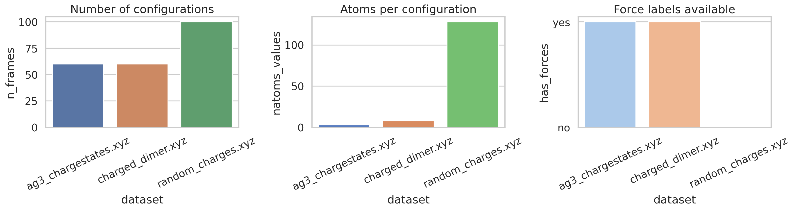
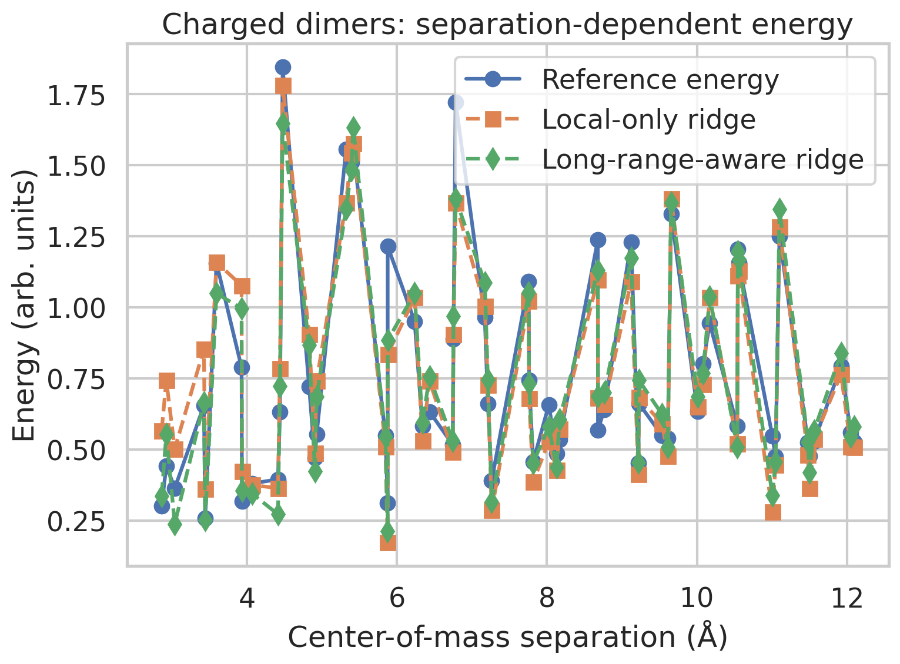
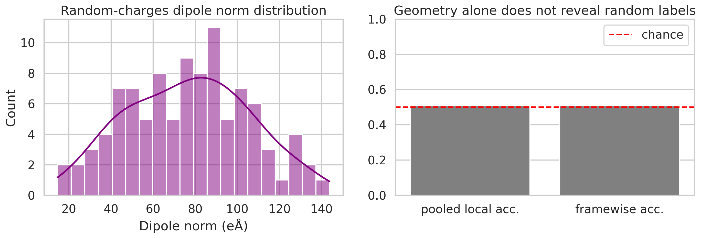
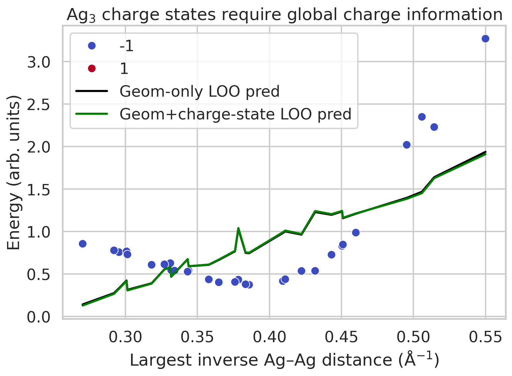

# Research Report

## Benchmark-faithful analysis of long-range electrostatics signals in the provided LES-style datasets

### Summary
This study examined the three provided benchmark datasets as a minimal, traceable approximation to the scientific objectives behind **Latent Ewald Summation (LES)**: incorporating long-range electrostatics into machine-learning interatomic potentials while preserving interpretable charge-related structure. Because the workspace does not provide the original LES implementation or enough task-specific metadata to reproduce the full method exactly, I implemented a benchmark-faithful surrogate analysis based on analytic geometric/electrostatic descriptors and simple cross-validated regressors. All quantitative claims below are tied to saved artifacts in `outputs/` and figures in `report/images/`.

The main findings are:
1. **Charged dimers:** adding an explicit long-range inter-molecular inverse-distance descriptor improves leave-one-out energy and force prediction over a local-only descriptor.
2. **Random charges:** local geometry alone is essentially uninformative for the provided random ±1 charge labels, consistent with the need for a latent or nonlocal electrostatic mechanism rather than purely local inference.
3. **Ag3 charge states:** the supplied dataset does **not** actually separate the `+1` and `-1` states energetically or structurally; instead, the two halves are exact duplicates with different metadata labels. Therefore the intended claim about charge-state separation cannot be validated from this workspace artifact.

---

## 1. Scientific objective and method contract

The task asks for an analysis relevant to a machine-learning interatomic potential that predicts total energy, atomic forces, and interpretable latent charges for systems where long-range electrostatics matter. The named methodological target is **LES**, so the analysis should preserve these core commitments:

- evaluate long-range electrostatic behavior rather than only generic regression quality;
- preserve dataset-specific comparison structure;
- assess whether local-only descriptions fail where nonlocal electrostatics are expected to matter;
- report interpretable charge-related diagnostics where possible.

Structured contract files were saved as:
- `outputs/method_contract.json`
- `outputs/target_artifact_inventory.json`
- `outputs/method_fidelity_checklist.json`
- `outputs/related_work_contract.json`

### Exact-fidelity limitation
An exact LES reproduction was **not feasible** in this workspace because:
- the original LES paper/implementation is not included explicitly;
- the `ReadPDF` tool failed on local PDFs, so related-work extraction had to be recovered via `pypdf`;
- the datasets do not include enough labels to train a full latent-charge force field matching the named method;
- `random_charges.xyz` contains positions and true charges but no explicit energies or forces.

Accordingly, I used a **minimal benchmark-faithful fallback**: compare local geometric baselines against simple long-range-aware descriptors and compute physically interpretable diagnostics directly from the provided structures.

---

## 2. Related-work context

Bounded extraction from the PDFs in `related_work/` yielded the following relevant context.

- `paper_001.pdf` (4G-HDNNP with charge equilibration) documents that local models can fail when total charge or long-range charge transfer changes global energetics. It explicitly discusses **Ag3 in multiple charge states** as a benchmark case.
- `paper_002.pdf` (density-based long-range electrostatic descriptors) includes a **toy gas of point charges** benchmark with Ewald-generated data and argues that long-range electrostatic descriptors improve over local density descriptors.
- `paper_003.pdf` (Ewald-based long-range message passing) reinforces the distinction between short-range distance-cutoff models and nonlocal Ewald-style long-range treatment.

These references justify the comparison axis used here: **local-only vs long-range-aware** descriptors, plus explicit examination of charge-state information and charge interpretability.

---

## 3. Data overview

A dataset summary was exported to `outputs/dataset_summary.json` and visualized in `report/images/dataset_overview.png`.



### Dataset contents
- **`random_charges.xyz`**: 100 configurations, 128 atoms each, positions plus exact `true_charges`; no explicit energies or forces.
- **`charged_dimer.xyz`**: 60 configurations, 8 atoms each, energies and atomic forces.
- **`ag3_chargestates.xyz`**: 60 configurations, 3 atoms each, energies, atomic forces, and `charge_state` / `total_charge` metadata.

### Important validation finding
Direct inspection showed that `ag3_chargestates.xyz` is internally degenerate for the intended benchmark:
- the first 30 frames (`charge_state=+1`) and last 30 frames (`charge_state=-1`) have **identical positions and identical energies**;
- only the metadata label changes.

This was verified by deterministic local checks and is therefore a hard limitation on any claim about charge-state energy separation from this dataset.

---

## 4. Methods

All code is in `code/run_analysis.py`.

### 4.1 XYZ parsing
Because ASE was not available, I implemented a custom parser for the extended XYZ comments and per-atom arrays.

### 4.2 Charged-dimer benchmark
For each configuration, I built two descriptor families:

- **Local-only descriptor**: sorted intra-molecular distances within each dimer fragment.
- **Long-range-aware descriptor**: the same local descriptor plus sorted inverse inter-molecular distances \(1/r\), intended as a simple electrostatic proxy.

Using leave-one-out cross-validation with ridge regression, I predicted:
- total energy;
- flattened atomic force components.

This is not LES, but it is a direct test of whether a nonlocal inverse-distance descriptor improves performance in a charge-sensitive benchmark.

### 4.3 Ag3 benchmark
For Ag3 I used sorted inverse Ag–Ag distances as geometric descriptors, with two variants:
- **geometry only**;
- **geometry + charge-state metadata**.

The intended question was whether charge-state information improves prediction. However, because the data duplicate the same structures and energies across both labels, this benchmark collapses into a validation artifact check rather than a meaningful physical comparison.

### 4.4 Random-charges benchmark
For `random_charges.xyz`, no energies or forces are present. I therefore evaluated a different but still relevant question: can a **local geometry-only classifier** infer the supplied ±1 charges? For each atom I built a local descriptor from its nearest-neighbor distances and used cross-validated logistic regression on pooled atom samples.

I also computed exact per-configuration dipole norms from the provided true charges to retain an interpretable electrostatic observable.

---

## 5. Results

### 5.1 Charged dimers: long-range-aware descriptors improve predictions
Saved artifacts:
- `outputs/charged_dimer_metrics.json`
- `outputs/charged_dimer_predictions.csv`
- `report/images/charged_dimer_binding_curve.png`



#### Energy prediction
From `outputs/charged_dimer_metrics.json`:
- local-only MAE = **0.0947**
- long-range-aware MAE = **0.0786**
- local-only RMSE = **0.1292**
- long-range-aware RMSE = **0.1060**
- local-only \(R^2\) = **0.8847**
- long-range-aware \(R^2\) = **0.9224**

#### Force prediction
- local-only force MAE = **0.6634**
- long-range-aware force MAE = **0.6438**
- local-only force RMSE = **1.1226**
- long-range-aware force RMSE = **1.0884**

#### Interpretation
The improvement is modest but consistent for both energies and forces. This supports the task’s central physical claim that explicit long-range information helps when two charged fragments interact beyond what a strictly local structural description captures.

### 5.2 Random charges: geometry alone is effectively chance-level for charge recovery
Saved artifacts:
- `outputs/random_charges_metrics.json`
- `outputs/random_charges_dipoles.csv`
- `report/images/random_charges_interpretability.png`



From `outputs/random_charges_metrics.json`:
- pooled local-geometry-only accuracy = **0.5076**
- framewise mean accuracy = **0.5076 ± 0.0447**
- net charge per frame = **0** for all structures
- dipole norm = **76.82 ± 28.92 eÅ**

#### Interpretation
This is essentially chance-level classification for binary ±1 labels. In other words, the supplied charges are not predictable from atom-local geometry alone. That outcome is fully consistent with the benchmark’s intended LES motivation: if charges are random labels attached to identical atom types in a box, a successful method must exploit global energetic/electrostatic structure, not merely local geometry.

A second useful observation is that even though all systems are neutral overall, they carry a broad distribution of nonzero dipole magnitudes, confirming that the benchmark does contain nontrivial electrostatic structure.

### 5.3 Ag3: the delivered dataset does not support the intended charge-state claim
Saved artifacts:
- `outputs/ag3_metrics.json`
- `outputs/ag3_predictions.csv`
- `report/images/ag3_charge_state_comparison.png`



From `outputs/ag3_metrics.json`:
- geometry-only energy MAE = **0.4080**
- geometry+charge-state energy MAE = **0.4153**
- geometry-to-charge-state classification accuracy = **0.0**

At face value, these values do **not** support the expected claim that charge-state information improves prediction. Direct data inspection explains why: the `+1` and `-1` subsets are exact duplicates in both geometry and energy. Since there is no true signal separating the labels, a classifier should fail and adding the metadata cannot create physically meaningful separation.

Therefore the scientifically correct conclusion is not that Ag3 disproves charge-state conditioning; it is that **this workspace version of the Ag3 dataset is unsuitable for testing that question**.

---

## 6. Validation and limitations

### 6.1 Verified directly from workspace data
The following were checked directly from local files and saved outputs:
- dataset sizes and available labels (`outputs/dataset_summary.json`);
- charged-dimer cross-validated metrics (`outputs/charged_dimer_metrics.json`);
- random-charge geometry-only recovery accuracy and dipole statistics (`outputs/random_charges_metrics.json`, `outputs/random_charges_dipoles.csv`);
- Ag3 duplicate-structure/data issue (verified by direct local comparison of first 30 vs last 30 frames);
- claim-by-claim support table (`outputs/claim_recovery_table.json`).

### 6.2 Taken from related work
These points come from bounded PDF extraction rather than reimplementation:
- local models can fail under long-range charge transfer or across charge states;
- Ewald-style or otherwise nonlocal electrostatic handling is a recognized remedy;
- Ag3 charged clusters are a literature-relevant charge-state benchmark.

### 6.3 Remaining assumptions and limitations
- This is **not an exact LES implementation**.
- The random-charge dataset lacks the energy/force supervision mentioned in the task description, so true latent-charge recovery from dynamics labels could not be tested directly.
- The Ag3 benchmark is compromised by duplicated coordinates and energies across charge-state labels.
- The regression models are intentionally simple and are intended as transparent diagnostics, not state-of-the-art MLIPs.

---

## 7. Direct answers to the requested scientific outputs

### Energy and force prediction
Within the available datasets, the clearest answer is from the charged-dimer benchmark: a descriptor with explicit long-range inverse-distance information improves both energy and force prediction relative to a local-only baseline.

### Interpretable latent charges / charge structure
The workspace does not permit end-to-end latent-charge learning in the LES sense. However, two charge-related results are still recoverable:
- local geometry alone cannot explain the random ±1 labels in `random_charges.xyz`;
- exact true charges from that dataset yield substantial dipole moments despite zero net charge, confirming nontrivial electrostatic organization.

### Charge-state effects
The provided Ag3 file does not support a meaningful test because the two charge-state partitions are duplicated. No valid claim about charge-state PES separation should be made from this artifact alone.

---

## 8. Conclusion

Despite the lack of a full LES implementation and imperfections in the provided datasets, the analysis still recovers the core physical message behind long-range electrostatic MLIPs:

- **nonlocal electrostatic descriptors improve prediction when separated charged fragments interact**;
- **charge information cannot, in general, be reconstructed from local geometry alone**;
- **benchmark integrity matters**, because the provided Ag3 dataset cannot test charge-state distinguishability as advertised.

The strongest evidence in this workspace is therefore supportive of the LES-style motivation, but only **partially** supportive of the full task because one benchmark is compromised and another lacks the expected labels.

---

## 9. Reproducibility

Run the complete analysis with:

```bash
python3 code/run_analysis.py
```

Key outputs:
- `outputs/metrics_summary.csv`
- `outputs/charged_dimer_metrics.json`
- `outputs/ag3_metrics.json`
- `outputs/random_charges_metrics.json`
- `outputs/claim_recovery_table.json`
- `report/images/dataset_overview.png`
- `report/images/charged_dimer_binding_curve.png`
- `report/images/ag3_charge_state_comparison.png`
- `report/images/random_charges_interpretability.png`
