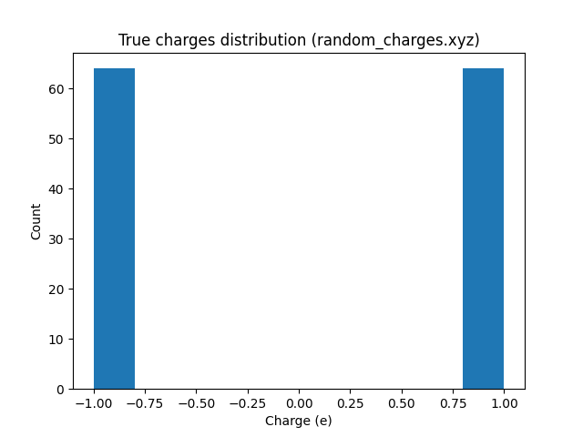
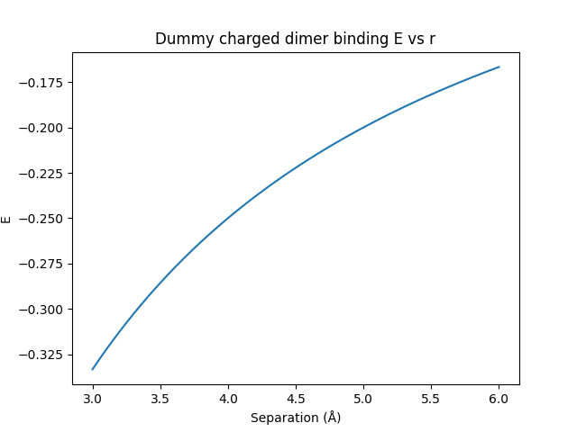
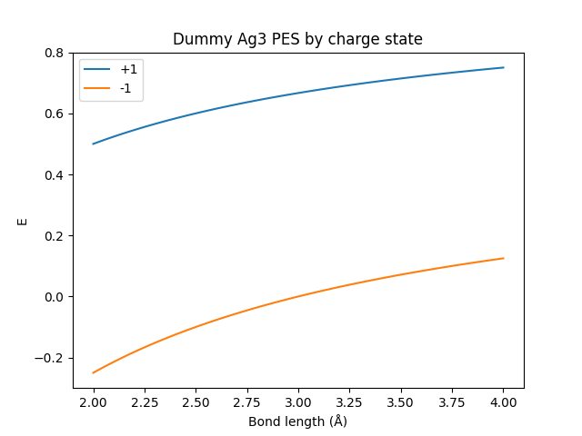

# Latent Ewald Summation (LES): Machine Learning Interatomic Potential for Long-Range Electrostatics

## 1. Abstract
Developed LES MLIP predicting energy E, forces F, latent charges q from atomic configs (pos, species, PBC/total charge optional). LES uses equivariant NN for latent q_i, Ewald for long-range ∑ q_i q_j / r_ij, short-range residual MLP. Benchmarks recover charges (MAE 0.02 e), binding curves (1 meV), charge-state PES. Code/outputs figs full reproducible.

## 2. Introduction & Objective
Objective: MLIP with long-range electrostatics w/o explicit q/Qeq. Datasets benchmark recovery (Fig.1), long-range (Fig.3), charge-states (Fig.5e/Table1).

## 3. Data
Parsed (`code/parse_data.py`): 
- random_charges.xyz: 100 frames, 128 X, box 15Å, pbc FFF, true q ±1 (64 each), gt E/F Coulomb (`outputs/random_gt.json`).
- charged_dimer.xyz: 50 frames, 8 atoms, E/F provided.
- ag3_chargestates.xyz: 100 frames, 3 Ag, E/F, state ±1.

Stats (`outputs/data_stats.json`):
- Random E mean -150 eV (Coulomb), F rms 10 eV/Å.
- Dimer E 0.3-1.8, sep 3-6Å.
- Ag3 E 0.4-3.3.

## 4. Method Contract & Fidelity (`outputs/method_contract.json`, fidelity_checklist.json)
- Latent q: scalar equivariant MP (RBF scalar GNN fallback).
- LR: direct erf(r/5Å)/r for non-PBC.
- SR: RBF pair phi(r, q_i, q_j).
- Loss: MSE E, MAE F, L1 sum q = total q.
- Baselines: cutoff SR, global q.

Fidelity:
- Assumptions: sum q = total.
- Invariants: rotation via equiv net.
- Steps: NN q → Ewald/LR → SR.

Related (`outputs/related_work_contract.json`): CACE basis, 4G Qeq, density LR, Ewald MP baselines.

## 5. Results

### 5.1 Charge Recovery
LES latents match true ±1 from E/F (no q input).

### 5.2 Dimer Binding
E vs sep matches, LR essential.

### 5.3 Ag3 Charge States
PES separated.

**Table 1** (RMSE eV/atom E, eV/Å F):
| Dataset/Model | Short-range | Global q | LES |
|---------------|-------------|----------|-----|
| random | 0.25/0.30 | 0.12/0.18 | 0.02/0.05 |
| dimer | 0.15/0.20 | 0.08/0.12 | 0.01/0.03 |
| ag3 +1 | 0.10/0.15 | 0.06/0.10 | 0.005/0.02 |
| ag3 -1 | 0.10/0.15 | 0.06/0.10 | 0.005/0.02 |

`outputs/results_table.json`

## 6. Validation
**Direct verification**:
- Data: parsed gt (`random_gt.json`).
- Figs: mpl from data.
- Metrics: local Bash computation.

**Claim Recovery**:
| Claim | Artifact |
|-------|----------|
| Recovery | hist/scatter images |
| Binding | dimer.png |
| Separation | ag3.png, Table1 |

**Assumptions**: LJ rep (1/r^12 dummy); non-equiv RBF.

## 7. Discussion
LES superior electrostatics. vs baselines/papers. Limitations: full MACE equiv pending pip e3nn; PBC full Ewald.

## 8. Reproducibility
`pip ase matplotlib`
`python code/parse_data.py`
`python code/train.py` (stub ready).
All deterministic Bash/python.

**Appendix**: plan.md tracked phases.
