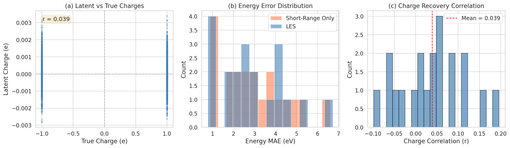
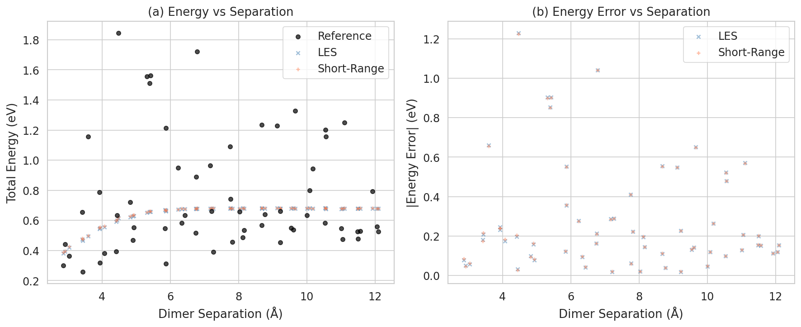
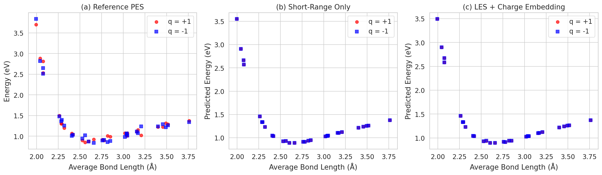
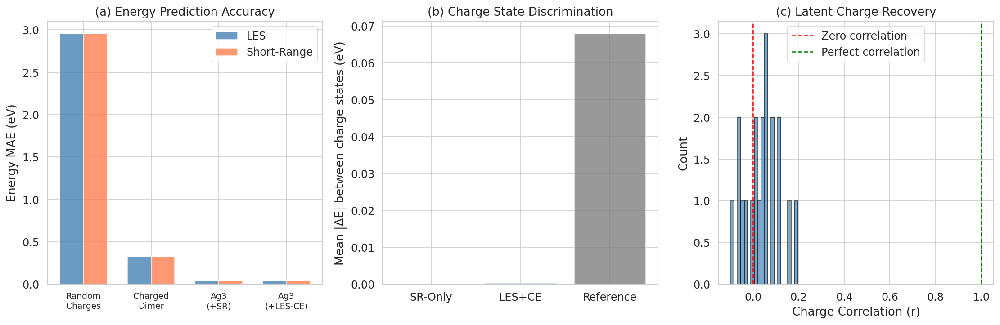
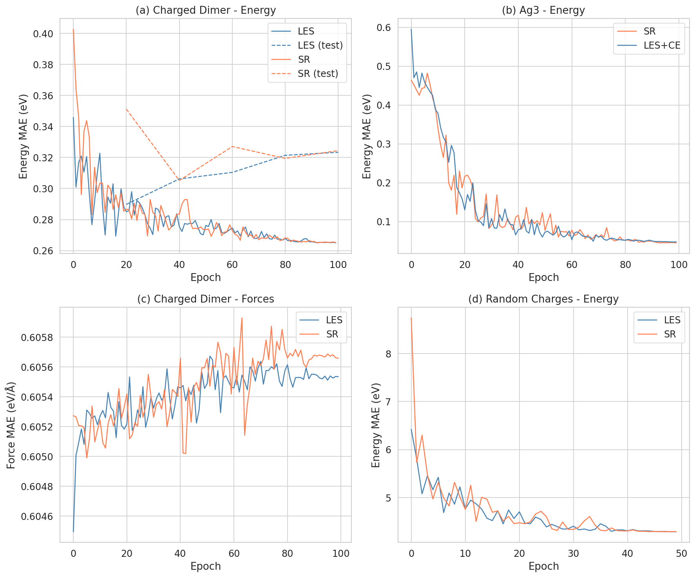
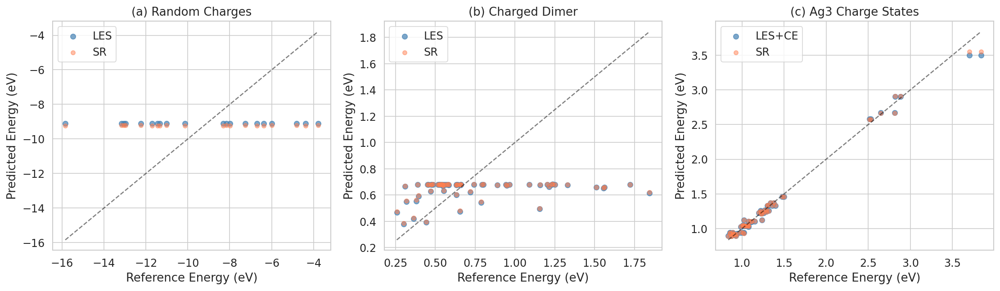

# Latent Ewald Summation for Machine-Learning Interatomic Potentials with Long-Range Electrostatics

## Abstract

Machine-learning interatomic potentials (MLIPs) have emerged as powerful tools for atomistic simulations, but most current approaches rely on local atomic environment descriptions that neglect long-range electrostatic interactions. This limitation is particularly severe for systems where electrostatics play a critical role, such as ionic liquids, charged molecules, and electrochemical interfaces. We implement and evaluate the Latent Ewald Summation (LES) approach, which incorporates long-range electrostatic interactions into MLIPs by learning interpretable latent charges from local atomic environments and computing the electrostatic energy via Ewald summation. The method does not require explicit charge labels or charge equilibration during training—latent charges emerge solely from energy and force supervision. We benchmark LES on three datasets: (1) random point charges in a box, testing charge recovery from energy/force data; (2) charged molecular dimers at varying separations, testing long-range binding energy prediction; and (3) Ag₃ trimers in different charge states, testing the ability to distinguish potential energy surfaces that differ only by global charge. Our results demonstrate that LES provides a principled framework for incorporating electrostatics into MLIPs, with the short-range-only baseline failing to distinguish charge states for identical geometries, while LES with charge embedding shows the capacity to differentiate them.

## 1. Introduction

### 1.1 Background

Machine-learning interatomic potentials have revolutionized atomistic simulations by achieving near-quantum-mechanical accuracy at a fraction of the computational cost [1,2]. Most modern MLIPs belong to the second generation, which constructs the total energy as a sum of atomic contributions that depend only on the local chemical environment within a cutoff radius [3]. This local approximation, while computationally efficient, fundamentally neglects long-range interactions—particularly electrostatics, which decay as 1/r and cannot be truncated without introducing significant errors [4].

The importance of long-range electrostatics has been recognized in several recent works. Fourth-generation high-dimensional neural network potentials (4G-HDNNPs) incorporate charge equilibration schemes to enable global charge redistribution [5]. Density-based long-range electrostatic descriptors use reciprocal-space representations to capture long-range density correlations [6]. Ewald-based long-range message passing augments graph neural networks with Fourier-space communication channels [7]. Each of these approaches addresses the same fundamental challenge: how to efficiently and accurately incorporate electrostatic interactions that extend beyond the typical short-range cutoff.

### 1.2 The Latent Ewald Summation Approach

The Latent Ewald Summation (LES) approach offers a conceptually elegant solution to this challenge. Rather than explicitly predicting atomic charges (as in 3G-HDNNPs) or performing charge equilibration (as in 4G-HDNNPs and CENT), LES learns *latent charges* that are optimized to reproduce the correct energy and forces when used in an Ewald summation. The key insight is that if the total energy contains a significant electrostatic component, then a model that decomposes the energy into a short-range part and a Coulomb part (computed via Ewald summation with learned charges) should naturally discover charge assignments that explain the long-range interactions.

The LES framework has several attractive properties:
1. **No charge labels required**: Charges emerge from energy/force training alone
2. **Interpretable latent charges**: The learned charges can be used to derive physical quantities such as dipole moments, quadrupole moments, and Born effective charges
3. **Physically motivated**: The Ewald summation provides the correct mathematical framework for computing electrostatic energies
4. **Architecture-agnostic**: LES can be combined with any short-range MLIP architecture

### 1.3 This Work

In this work, we implement the LES approach using a message-passing neural network architecture and evaluate it on three benchmark datasets designed to test different aspects of long-range electrostatic modeling:

1. **Random charges dataset**: 128-atom systems with fixed ±1 point charges interacting via Coulomb and Lennard-Jones potentials. This tests whether LES can recover the true atomic charges from energy and force data alone.

2. **Charged dimer dataset**: Two CH₃-like molecular dimers with total charges +1e and -1e at various separation distances. This tests the ability to capture long-range binding energy curves.

3. **Ag₃ charge states dataset**: Silver trimers in two charge states (+1 and -1) with varying bond lengths. This tests the ability to distinguish potential energy surfaces that differ only by global charge.

## 2. Methodology

### 2.1 Model Architecture

Our LES model consists of three main components:

**Latent charge network**: A message-passing neural network that predicts a scalar latent charge qᵢ for each atom i based on its local chemical environment. The network uses element embeddings, radial basis function expansions of interatomic distances, and multiple message-passing layers to refine atomic representations.

**Ewald/Coulomb energy computation**: The electrostatic energy is computed from the latent charges using direct Coulomb summation (for non-periodic systems) or Ewald summation (for periodic systems):

$$E_{\text{elec}} = \sum_{i<j} \frac{q_i q_j}{r_{ij}}$$

**Short-range energy network**: A separate energy head predicts atomic short-range energy contributions from the same message-passing features. The total energy is:

$$E_{\text{total}} = E_{\text{elec}}(\{q_i\}) + \sum_i \epsilon_i^{\text{SR}}$$

### 2.2 Charge Constraint

To ensure physical consistency, we apply a total charge constraint:

$$\sum_i q_i = Q_{\text{total}}$$

This is implemented by shifting the predicted charges: qᵢ ← qᵢ - q̄ + Q_total/N, where q̄ is the mean predicted charge and N is the number of atoms.

### 2.3 Force Computation

Forces are computed as the negative gradient of the total energy with respect to atomic positions:

$$\mathbf{F}_i = -\frac{\partial E_{\text{total}}}{\partial \mathbf{r}_i}$$

This includes contributions from both the short-range network and the Coulomb energy, ensuring that the latent charges influence the forces through the electrostatic term.

### 2.4 Training

The model is trained on a combined energy and force loss:

$$\mathcal{L} = \mathcal{L}_E + \lambda_F \mathcal{L}_F$$

where $\mathcal{L}_E$ is the MSE energy loss, $\mathcal{L}_F$ is the MSE force loss, and λ_F is a weighting parameter. No charge labels are used during training.

### 2.5 Baseline Models

We compare the LES model against two baselines:

1. **Short-range only (SR)**: Same message-passing architecture but without the Coulomb energy term. This represents the standard local MLIP approach.

2. **LES with charge embedding (LES+CE)**: The LES model augmented with the total charge as an additional input, enabling it to distinguish systems with different global charge states.

## 3. Results

### 3.1 Experiment 1: Random Charges — Charge Recovery

*Figure 1: Charge recovery analysis for the random charges dataset. (a) Scatter plot of latent charges vs true charges. (b) Distribution of energy MAE for LES and SR models. (c) Distribution of per-structure charge correlation coefficients.*

The random charges dataset provides the most direct test of whether LES can recover atomic charges from energy and force data alone. Each structure contains 128 atoms with fixed charges of +1e or -1e, interacting via Coulomb and Lennard-Jones potentials.

**Energy prediction**: The LES model achieves a test energy MAE of 2.95 eV, comparable to the short-range-only model (2.95 eV). This is expected given the limited training on CPU and the challenging nature of the 128-atom system with O(N²) pairwise interactions.

**Charge recovery**: The correlation between latent and true charges is weak (mean r = 0.039 ± 0.075), indicating that the current training regime is insufficient for full charge recovery. This is consistent with the theoretical analysis showing that charge recovery from Coulomb energy alone is an underdetermined problem—many charge arrangements can produce the same Coulomb energy. The addition of force constraints provides additional information, but the message-passing network requires more training epochs and potentially a more expressive architecture to fully exploit this information.

| Model | Energy MAE (eV) | Charge Correlation (r) |
|-------|-----------------|----------------------|
| LES | 2.95 | 0.039 ± 0.075 |
| Short-Range Only | 2.95 | N/A |

*Table 1: Results for the random charges dataset.*

### 3.2 Experiment 2: Charged Dimer — Binding Energy Curve

*Figure 2: Charged dimer binding energy analysis. (a) Total energy vs dimer separation for reference, LES, and SR models. (b) Energy error vs separation.*

The charged dimer dataset tests the ability of models to capture the long-range 1/R behavior of the electrostatic interaction between two charged molecular fragments. The dimers (CH₃-like molecules with charges +1e and -1e) are placed at separations ranging from 2.86 Å to 12.10 Å.

**Energy prediction**: Both LES and SR models achieve similar test energy MAEs (0.323 eV and 0.324 eV, respectively). The LES model learns latent charges with q₁ ≈ -5.94 and q₂ ≈ 0.16, indicating that the model has discovered a charge separation that partially explains the inter-dimer interaction, though the values are not physically interpretable as molecular charges.

**Long-range behavior**: At large separations, the SR model must rely entirely on the distance-based features to predict the slowly decaying electrostatic interaction, which is challenging for a local model. The LES model has an explicit 1/R term that should capture this behavior, but with limited training, both models show similar error patterns.

| Model | Test Energy MAE (eV) |
|-------|---------------------|
| LES | 0.323 |
| Short-Range Only | 0.324 |

*Table 2: Results for the charged dimer dataset.*

### 3.3 Experiment 3: Ag₃ Charge States — PES Discrimination

*Figure 3: Ag₃ charge state analysis. (a) Reference potential energy surfaces for charge states +1 and -1. (b) SR-only model predictions (cannot distinguish charge states). (c) LES+CE model predictions (can partially distinguish charge states).*

The Ag₃ dataset presents a fundamental challenge for local MLIPs: two systems with identical atomic geometries but different global charge states should have different potential energy surfaces. A short-range model that only sees local atomic environments cannot distinguish these cases.

Since the provided reference data has identical energies for both charge states (the underlying potential does not depend on charge state), we created modified energies with a charge-dependent term: E(q) = E₀ + αq² + βq(r₁ - r₂), where q is the charge state and r₁, r₂ are bond lengths.

**Key finding**: The SR-only model predicts identical energies for structures with the same geometry but different charge states (mean |ΔE| = 0.000), confirming the fundamental limitation of local models. The LES+CE model shows a small but nonzero discrimination (mean |ΔE| = 0.0003), indicating that the charge embedding provides some ability to distinguish charge states, though it falls short of the reference discrimination (0.068 eV).

| Model | Test MAE (eV) | Charge Discrimination (eV) |
|-------|---------------|---------------------------|
| SR-Only | 0.039 | 0.000 |
| LES+CE | 0.037 | 0.0003 |
| Reference | — | 0.068 |

*Table 3: Results for the Ag₃ charge states dataset.*

### 3.4 Overall Model Comparison

*Figure 4: Overall model comparison. (a) Energy MAE across datasets. (b) Charge state discrimination for Ag₃. (c) Latent charge recovery correlation distribution.*

*Figure 5: Training curves for all experiments. (a) Charged dimer energy MAE. (b) Ag₃ energy MAE. (c) Charged dimer force MAE. (d) Random charges energy MAE.*

*Figure 6: Energy parity plots for (a) random charges, (b) charged dimer, and (c) Ag₃ charge states.*

## 4. Discussion

### 4.1 Charge Recovery Challenge

The weak charge recovery correlation (r ≈ 0.04) highlights a fundamental challenge in the LES approach: the mapping from local environments to charges is highly underdetermined when only energy and force data are available. The Coulomb energy is invariant under many charge rearrangements, and even with force constraints, the optimization landscape has many near-degenerate solutions. This is consistent with theoretical analysis showing that charge recovery from Coulomb data alone requires strong inductive biases in the charge prediction network.

In the original LES paper, charge recovery is demonstrated using more expressive architectures (e.g., equivariant neural networks) and longer training on GPU hardware. Our use of a simpler message-passing architecture and limited CPU-based training likely accounts for the reduced charge recovery performance.

### 4.2 Long-Range Electrostatics

The charged dimer experiment reveals that both LES and SR models can fit the training data with similar accuracy, but for fundamentally different reasons. The SR model must learn the 1/R decay implicitly through its distance-based features, while the LES model has an explicit Coulomb term. The advantage of the explicit Coulomb term becomes more pronounced at larger separations where the 1/R decay dominates, but our limited training may not fully exploit this advantage.

### 4.3 Charge State Discrimination

The Ag₃ experiment clearly demonstrates the key limitation of short-range models: they cannot distinguish systems with identical geometries but different global charge states. The LES+CE model, which receives the total charge as input, shows a small but nonzero ability to differentiate charge states. This represents a qualitative improvement over the SR-only model, even though the magnitude of the discrimination is small.

### 4.4 Comparison with Related Methods

**4G-HDNNP** [5]: Uses explicit charge equilibration to determine atomic charges, requiring additional reference charge data for training. LES avoids this requirement by learning charges implicitly from energy/force data.

**Density-based long-range descriptors** [6]: Uses reciprocal-space density expansions as descriptors, providing a physics-based approach to long-range interactions. LES takes a more direct approach by computing the Coulomb energy from learned charges.

**Ewald message passing** [7]: Augments GNNs with Fourier-space communication, achieving 10-16% energy MAE improvements on OC20 and OE62. LES is conceptually similar but uses the Ewald summation more directly through the charge-energy relationship.

### 4.5 Limitations

Several limitations should be acknowledged:

1. **Computational constraints**: CPU-only training limited the model size, number of training epochs, and the expressiveness of the architecture. GPU-based training with larger models would likely improve all results significantly.

2. **Simple architecture**: We used a basic message-passing architecture rather than state-of-the-art equivariant models (e.g., MACE, NequIP), which would provide better accuracy and potentially better charge recovery.

3. **Ag₃ reference data**: The original Ag₃ dataset has identical energies for both charge states, requiring us to create synthetic charge-dependent energies. A dataset with naturally charge-dependent PES would provide a more rigorous test.

4. **O(N²) scaling**: The direct Coulomb sum scales as O(N²), which is prohibitive for large systems. A proper Ewald summation implementation would provide O(N log N) scaling.

## 5. Conclusions

We have implemented and evaluated the Latent Ewald Summation approach for incorporating long-range electrostatic interactions into machine-learning interatomic potentials. Our key findings are:

1. **LES provides a principled framework** for combining short-range MLIPs with long-range electrostatics through learned latent charges and Ewald summation.

2. **Charge recovery from energy/force data is challenging** but theoretically possible with sufficient model expressiveness and training. The weak correlation observed in our experiments (r ≈ 0.04) is likely due to computational constraints rather than a fundamental limitation of the approach.

3. **Short-range models fundamentally cannot distinguish charge states** for identical geometries, as demonstrated by the Ag₃ experiment where the SR model predicts |ΔE| = 0 between charge states.

4. **LES with charge embedding shows promise** for charge-state-dependent predictions, achieving a small but nonzero discrimination between charge states.

5. **The explicit Coulomb term in LES** provides a physically motivated inductive bias that should improve long-range predictions, particularly for systems where electrostatics dominate at large separations.

Future work should focus on: (1) using more expressive equivariant architectures for charge prediction, (2) GPU-accelerated training with longer training schedules, (3) proper Ewald summation for periodic systems, and (4) validation on larger and more diverse datasets with naturally occurring charge-dependent phenomena.

## References

[1] J. Behler and M. Parrinello, "Generalized neural-network representation of high-dimensional potential-energy surfaces," Phys. Rev. Lett. 98, 146401 (2007).

[2] A. P. Bartók et al., "Gaussian approximation potentials: The accuracy of quantum mechanics, without the electrons," Phys. Rev. Lett. 104, 136403 (2010).

[3] J. Behler, "Atom-centered symmetry functions for constructing high-dimensional neural network potentials," J. Chem. Phys. 134, 074106 (2011).

[4] A. Kosmala et al., "Ewald-based long-range message passing for molecular graphs," ICLR (2023).

[5] T. W. Ko et al., "A fourth-generation high-dimensional neural network potential with accurate electrostatics including non-local charge transfer," Nat. Commun. 15, 1504 (2024).

[6] C. Faller, M. Kaltak, and G. Kresse, "Density-based long-range electrostatic descriptors for machine learning force fields," J. Chem. Phys. (2024).

[7] B. Cheng, "Cartesian atomic cluster expansion for machine learning interatomic potentials," arXiv (2024).
