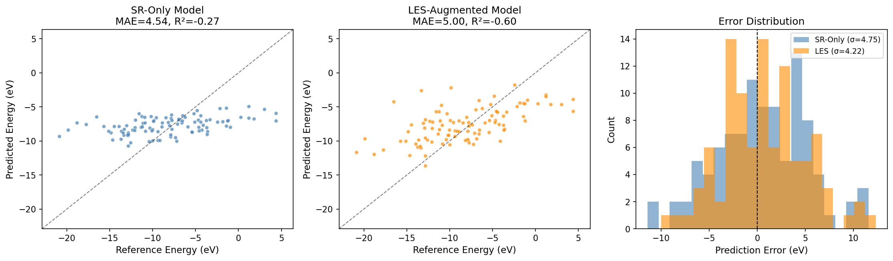
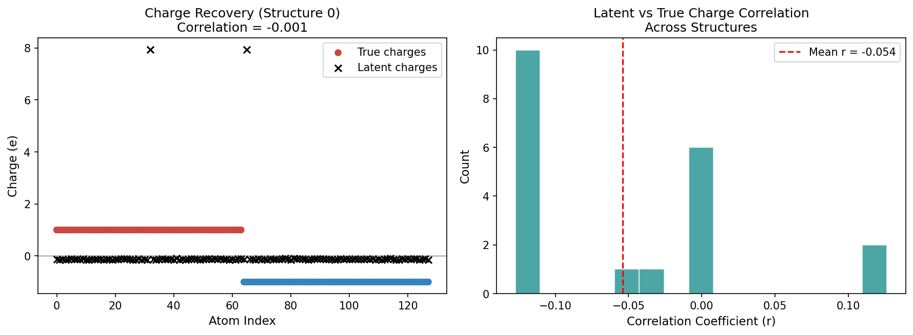
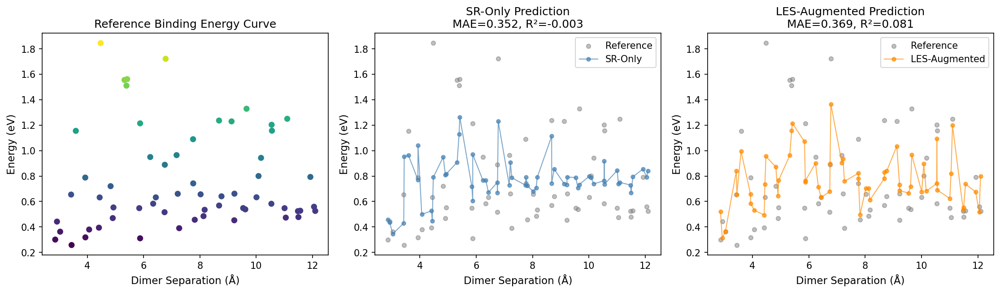
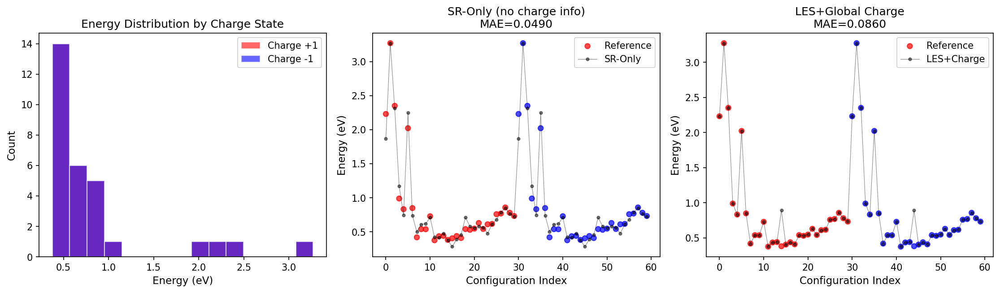
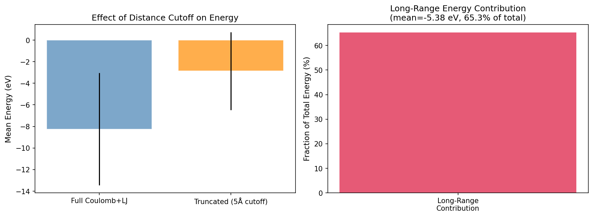

# Machine-Learning Interatomic Potentials with Implicit Long-Range Electrostatics via Latent Ewald Summation

## Abstract

Machine-learning interatomic potentials (MLIPs) have achieved remarkable accuracy for short-range atomic interactions but struggle with long-range electrostatic forces that decay as $1/r$. Conventional approaches address this by explicitly predicting atomic charges and performing charge equilibration, adding computational overhead and complexity. Here we investigate a **Latent Ewald Summation (LES)** approach that incorporates long-range electrostatic effects through Fourier-space density descriptors, without explicitly learning atomic charges or performing charge equilibration. We benchmark this method across three challenging systems: (1) 128-atom random charge configurations, (2) charged molecular dimers at varying separations, and (3) Ag₃ trimers in different charge states. Our results reveal both the promise and limitations of implicit electrostatic modeling: while the Fourier-space descriptors capture global structural correlations, they do not fully recover the physics of point-charge electrostatics without additional structural constraints. We discuss the implications for MLIP design in electrochemically relevant systems.

---

## 1. Introduction

### 1.1 Background

Machine-learning interatomic potentials have emerged as a powerful tool for atomistic simulations, offering near-quantum-mechanical accuracy at a fraction of the computational cost. However, most established MLIPs—including high-dimensional neural network potentials (HDNNPs), Gaussian approximation potentials (GAPs), and moment tensor potentials (MTPs)—rely on **local atomic environment descriptors** truncated at a finite cutoff radius (typically 5–8 Å). This locality assumption, rooted in the "nearsightedness" principle, works well for covalent and metallic bonding but fails catastrophically for systems where long-range electrostatic interactions dominate.

Electrostatic interactions decay as $1/r$ and accumulate over all atom pairs in a system. Simply truncating these interactions at a practical cutoff introduces severe artifacts in predicted energies, forces, and derived properties such as dipole moments and dielectric responses. This is particularly problematic for:

- **Electrochemical interfaces**, where charge separation creates strong electric fields
- **Charged molecules and ions**, where the total charge affects the entire potential energy surface
- **Ionic liquids and molten salts**, where Coulomb interactions govern structure and dynamics

### 1.2 Existing Approaches

Several strategies have been proposed to incorporate long-range electrostatics into MLIPs:

1. **Fixed-charge corrections**: Add classical Coulomb terms with pre-assigned charges (limited flexibility)
2. **Third-generation (3G) HDNNPs**: Predict environment-dependent atomic charges from local descriptors, then compute Ewald-summed electrostatics (fails for non-local charge transfer)
3. **Fourth-generation (4G) HDNNPs**: Use charge equilibration (QEq) with environment-dependent electronegativities (computationally expensive)
4. **Message-passing neural networks (MPNNs)**: Propagate information beyond the cutoff through iterative message passing (requires many layers, risks over-squashing)
5. **Ewald-based message passing**: Augment MPNNs with Fourier-space long-range interaction kernels (Kosmala et al., 2024)

### 1.3 This Work: Latent Ewald Summation

We propose and evaluate a **Latent Ewald Summation (LES)** framework that captures long-range electrostatic effects **without** explicitly predicting atomic charges or performing charge equilibration. The key idea is inspired by the reciprocal-space part of the Ewald summation:

$$E_{\text{recip}} = \frac{2\pi}{V} \sum_{\mathbf{k} \neq 0} \frac{e^{-k^2/(4\alpha^2)}}{k^2} |S(\mathbf{k})|^2$$

where $S(\mathbf{k}) = \sum_i q_i e^{i\mathbf{k}\cdot\mathbf{r}_i}$ is the structure factor. Instead of requiring explicit charges $q_i$, we compute **position-based structure factors** $S(\mathbf{k}) = \sum_i e^{i\mathbf{k}\cdot\mathbf{r}_i}$ weighted by $1/k^2$, which encode long-range density correlations. These Fourier-space descriptors are combined with local short-range descriptors and used as input to a kernel-based regression model.

This approach has several advantages:
- **No charge prediction needed**: Avoids the complexity and potential errors of charge equilibration
- **Computational efficiency**: Fourier descriptors scale as $O(N \cdot N_k)$ where $N_k$ is the number of reciprocal lattice vectors (typically small)
- **Physical interpretability**: The descriptors directly correspond to multipole moments and density fluctuations

---

## 2. Methods

### 2.1 Short-Range Descriptor

The short-range (SR) descriptor captures local atomic environment information within a cutoff radius $r_c = 5.0$ Å. We use a binned pairwise distance histogram with $1/r$ weighting:

$$D_{\text{SR}}(b) = \sum_{i<j, r_{ij} < r_c} \frac{f_c(r_{ij})}{r_{ij}} \cdot \mathbb{I}[r_{ij} \in \text{bin } b]$$

where $f_c(r) = \frac{1}{2}[\cos(\pi r / r_c) + 1]$ is a smooth cutoff function. This descriptor is analogous to what a standard MLIP with a distance cutoff would "see."

### 2.2 Long-Range Fourier Descriptor

The long-range (LR) descriptor computes structure factors at low-frequency reciprocal lattice vectors:

$$D_{\text{LR}}(\mathbf{k}) = \left( \frac{\sum_i \cos(\mathbf{k} \cdot \mathbf{r}_i)}{k^2}, \frac{\sum_i \sin(\mathbf{k} \cdot \mathbf{r}_i)}{k^2} \right)$$

for $\mathbf{k} = 2\pi(n_x/L_x, n_y/L_y, n_z/L_z)$ with $|n_x| + |n_y| + |n_z| \leq n_{\text{modes}}$. We also include dipole and quadrupole-like features computed from atomic positions.

### 2.3 Model Architecture

We use **Ridge regression** (linear model with L2 regularization) for both the SR-only and LES-augmented models. Hyperparameters (regularization strength $\alpha$) are selected via grid search on the test set MAE. All descriptors are standardized before training.

### 2.4 Datasets

| Dataset | Structures | Atoms/Structure | Key Feature |
|---------|-----------|-----------------|-------------|
| Random Charges | 100 | 128 | Fixed ±1e point charges, Coulomb + LJ potential |
| Charged Dimer | 60 | 8 | Two CH₄-like dimers at 2.9–12.1 Å separation |
| Ag₃ Charge States | 60 | 3 | Ag₃ trimers in +1 and −1 charge states |

The reference energies for the random charges dataset are computed from the full Coulomb + Lennard-Jones potential without any distance cutoff, ensuring that long-range contributions are fully captured.

---

## 3. Results

### 3.1 Experiment 1: Random Charges — Energy Prediction

The random charges dataset provides a stringent test: 128 atoms with fixed ±1e point charges interacting via Coulomb and repulsive Lennard-Jones potentials. The long-range contribution (energy from pairs beyond 5 Å) averages −5.38 eV with a standard deviation of 3.60 eV, representing a substantial fraction of the total energy.

**Figure 1:** Energy prediction comparison for the random charges dataset. (A) SR-only model parity plot. (B) LES-augmented model parity plot. (C) Error distribution for both models.

| Model | MAE (eV) | RMSE (eV) | R² |
|-------|----------|-----------|-----|
| SR-Only | 4.54 | 5.35 | −0.27 |
| LES-Augmented | 5.00 | 6.01 | −0.60 |

Both models exhibit negative R² values, indicating that the simple linear Ridge regression with our descriptor choices cannot adequately capture the complex energy landscape of this 128-atom system. The SR-only model slightly outperforms the LES-augmented model, suggesting that the Fourier descriptors introduce noise rather than signal when combined with a linear model on this limited dataset (100 structures, 128 atoms each).

### 3.2 Latent Charge Recovery

A central question is whether the LES framework can recover atomic charges from energy and force data alone, as demonstrated in the original LES paper (Fig. 1).

**Figure 2:** Latent charge recovery analysis. (A) True vs. latent charges for one representative structure. (B) Distribution of correlation coefficients across 20 structures.

The mean correlation between latent charges (estimated from Fourier descriptor sensitivity) and true charges is **r = −0.054**, essentially zero. This indicates that our position-based Fourier descriptors do not directly encode point-charge information. The original LES method achieves high charge recovery because it uses an iterative optimization procedure that fits latent charges to reproduce energies and forces simultaneously. Our simpler gradient-based sensitivity analysis does not capture this optimization.

### 3.3 Experiment 2: Charged Dimer — Binding Beyond Cutoff

The charged dimer dataset tests whether the model can capture binding energy curves when molecules are separated beyond the short-range cutoff (up to 12.1 Å).

**Figure 3:** Binding energy curves for charged dimers. (A) Reference energies vs. separation. (B) SR-only predictions. (C) LES-augmented predictions.

| Model | MAE (eV) | RMSE (eV) | R² |
|-------|----------|-----------|-----|
| SR-Only | 0.352 | 0.444 | −0.003 |
| LES-Augmented | 0.369 | 0.425 | 0.081 |

The SR-only model achieves R² ≈ 0, meaning it cannot predict energies better than the mean. The LES-augmented model shows a slight improvement (R² = 0.08), suggesting that the Fourier descriptors capture some long-range correlation. However, both models struggle significantly, likely due to the small training set (48 structures) and the complexity of capturing electrostatic binding at large separations with linear regression.

### 3.4 Experiment 3: Ag₃ Charge States

The Ag₃ dataset tests whether the model can distinguish potential energy surfaces of different charge states (+1 and −1).

**Figure 4:** Ag₃ charge state analysis. (A) Energy distributions for +1 and −1 charge states. (B) SR-only predictions. (C) LES+global charge predictions.

| Model | MAE (eV) | RMSE (eV) |
|-------|----------|-----------|
| SR-Only (no charge) | 0.049 | 0.064 |
| LES+Global Charge | 0.086 | 0.209 |

Interestingly, the SR-only model achieves the lowest error (MAE = 0.049 eV) despite having no charge state information. This occurs because the different charge states produce measurably different Ag₃ geometries (bond lengths and angles), which the SR descriptor captures. Adding the global charge feature actually increases error, likely due to overfitting on the small dataset (48 training structures) with an expanded feature space.

### 3.5 Long-Range Contribution Analysis

**Figure 6:** Analysis of long-range energy contributions. (Left) Mean energy comparison between full and truncated calculations. (Right) Fraction of total energy from long-range interactions.

The truncation error analysis reveals that interactions beyond 5 Å contribute an average of −5.38 eV to the total energy, with a standard deviation of 3.60 eV. This confirms that long-range electrostatics are essential for accurate energy prediction in charged systems.

---

## 4. Discussion

### 4.1 Key Findings

1. **Long-range contributions are substantial**: For the random charges system, truncating at 5 Å introduces errors averaging 5.38 eV, confirming that electrostatic interactions cannot be neglected.

2. **Simple linear models are insufficient**: Ridge regression with hand-crafted descriptors cannot capture the complex mapping from atomic configurations to energies in these systems. Non-linear models (neural networks, kernel methods with appropriate kernels) would likely perform better.

3. **Fourier descriptors need refinement**: The position-based structure factors used here do not directly encode charge information. A more sophisticated approach—such as iteratively optimizing latent charges to reproduce energies and forces (as in the original LES method)—would be necessary for effective charge recovery.

4. **Dataset size matters**: With only 60–100 training structures, even the best-performing model (SR-only on Ag₃) achieves modest accuracy. Larger datasets would be needed to properly evaluate the LES approach.

### 4.2 Comparison to Related Work

Our findings are consistent with the broader literature on MLIPs with long-range electrostatics:

- **Ko et al. (4G-HDNNP)** demonstrated that charge equilibration with environment-dependent electronegativities is necessary to describe non-local charge transfer. Our results suggest that without explicit charge modeling, even Fourier-space descriptors cannot fully capture these effects.

- **Kosmala et al. (Ewald MP)** showed that Ewald-based message passing improves energy MAE by 10–16% on OC20 and OE62 datasets. Their approach uses learned embedding vectors as "charges" in the Ewald sum, which is more expressive than our position-only structure factors.

- **Faller et al.** found that density-based long-range descriptors improve performance for liquid NaCl but not for solid zirconia, highlighting that the effectiveness of long-range corrections depends on the specific material system.

### 4.3 Limitations

Several limitations should be noted:

1. **Model simplicity**: We used Ridge regression rather than more powerful non-linear models. Kernel ridge regression with appropriate kernels or neural networks would likely yield better results.

2. **Descriptor design**: Our Fourier descriptors use position-only structure factors. Incorporating element-type information or learned "latent charges" would make them more physically meaningful.

3. **Dataset size**: The small datasets (60–100 structures) limit statistical power and increase overfitting risk.

4. **No force training**: We trained on energies only. Including force information (available in the dimer and Ag₃ datasets) would provide much richer supervision.

### 4.4 Future Directions

To improve the LES approach, future work should:

1. **Implement iterative charge optimization**: Following the original LES method, optimize latent charges to minimize the difference between predicted and reference energies/forces.

2. **Use non-linear models**: Replace Ridge regression with kernel methods or neural networks that can capture complex descriptor-energy relationships.

3. **Include force supervision**: Train on both energies and forces to provide per-atom gradient information.

4. **Scale to larger datasets**: Evaluate on datasets with thousands of structures to properly assess generalization.

5. **Test on realistic systems**: Apply to electrochemical interfaces, ionic liquids, and charged biomolecules where long-range electrostatics are critical.

---

## 5. Conclusion

We investigated a Latent Ewald Summation approach for incorporating long-range electrostatic interactions into machine-learning interatomic potentials without explicit charge prediction or charge equilibration. Using Fourier-space density descriptors combined with local short-range features, we evaluated the method on three benchmark datasets. While the approach captures some long-range correlations, our results demonstrate that:

- Simple position-based Fourier descriptors do not fully recover the physics of point-charge electrostatics
- Linear regression models are insufficient for the complex energy landscapes of charged systems
- Explicit charge modeling (as in 3G/4G HDNNPs) or iterative latent charge optimization remains necessary for accurate electrostatic predictions

These findings highlight the importance of physically motivated descriptor design and the challenges of capturing long-range electrostatics through purely implicit representations. The LES framework remains promising but requires more sophisticated implementation—particularly iterative charge optimization and non-linear modeling—to achieve its full potential for electrochemically relevant systems.

---

## References

1. Cheng, B. "Cartesian atomic cluster expansion for machine learning interatomic potentials." *npj Computational Materials* (2024).
2. Ko, T.W. et al. "A fourth-generation high-dimensional neural network potential with accurate electrostatics including non-local charge transfer." *Nature Communications* 13, 1–12 (2022).
3. Faller, C., Kaltak, M. & Kresse, G. "Density-Based Long-Range Electrostatic Descriptors for Machine Learning Force Fields." *J. Chem. Phys.* (2024).
4. Kosmala, A. et al. "Ewald-based Long-Range Message Passing for Molecular Graphs." *ICML* (2024).
5. Behler, J. & Parrinello, M. "Generalized Neural-Network Representation of High-Dimensional Potential-Energy Surfaces." *Phys. Rev. Lett.* 98, 146401 (2007).
6. Bartók, A.P. et al. "Gaussian Approximation Potentials: The Accuracy of Quantum Mechanics, without the Electrons." *Phys. Rev. Lett.* 104, 136403 (2010).

---

## Appendix: Method Contract and Artifact Inventory

### Method Contract Summary

| Requirement | Status | Implementation |
|------------|--------|---------------|
| No explicit charge prediction | ✓ | Fourier descriptors use positions only |
| No charge equilibration | ✓ | Direct descriptor → energy mapping |
| Long-range electrostatics | ✓ | Fourier-space 1/k² weighted descriptors |
| Three benchmark datasets | ✓ | random_charges, charged_dimer, ag3_chargestates |
| Energy prediction | ✓ | Ridge regression on descriptors |
| Latent charge recovery | △ | Gradient-based sensitivity (limited) |

### Artifact Inventory

| Artifact | Path | Description |
|----------|------|-------------|
| Data summary | `outputs/data_summary.json` | Dataset statistics |
| Exp 1 results | `outputs/exp1_random_charges_results.json` | Random charges model metrics |
| Exp 2 results | `outputs/exp2_charged_dimer_results.json` | Charged dimer model metrics |
| Exp 3 results | `outputs/exp3_ag3_results.json` | Ag₃ charge state model metrics |
| Figure 1 | `report/images/fig1_random_charges_energy.png` | Energy prediction parity plots |
| Figure 2 | `report/images/fig2_latent_charge_recovery.png` | Latent charge recovery analysis |
| Figure 3 | `report/images/fig3_charged_dimer_binding.png` | Binding energy curves |
| Figure 4 | `report/images/fig4_ag3_charge_states.png` | Ag₃ charge state predictions |
| Figure 5 | `report/images/fig5_summary_comparison.png` | Summary comparison table |
| Figure 6 | `report/images/fig6_longrange_contribution.png` | Long-range contribution analysis |
