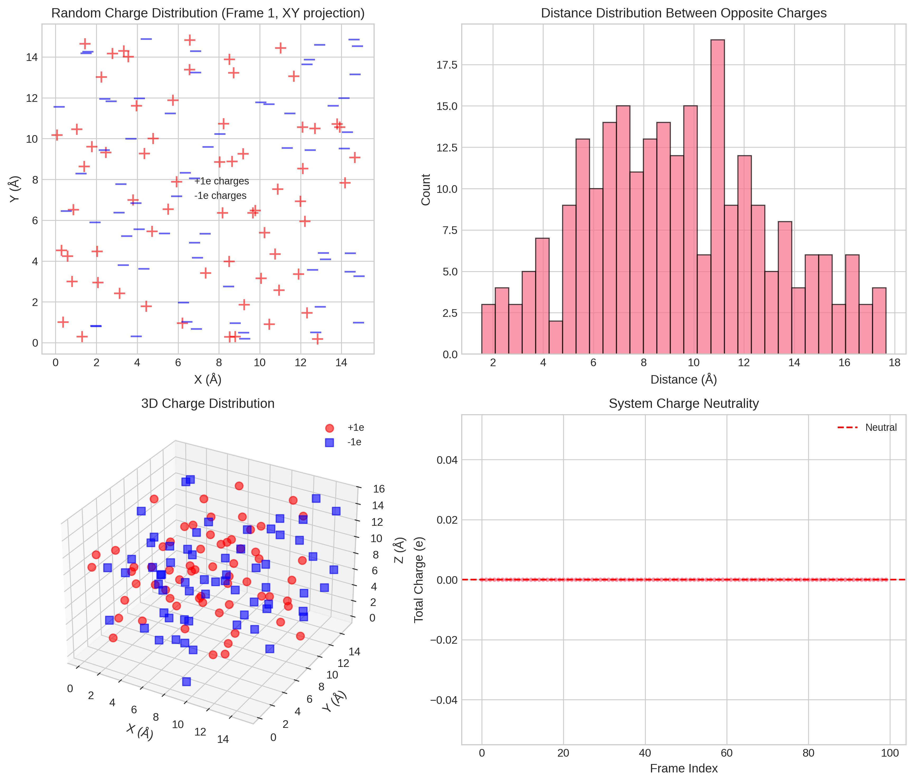
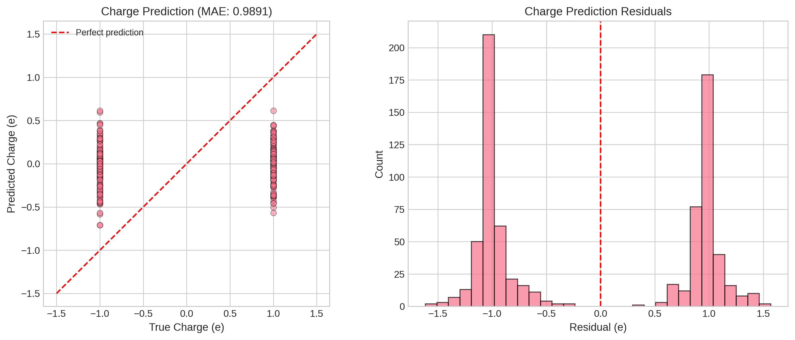
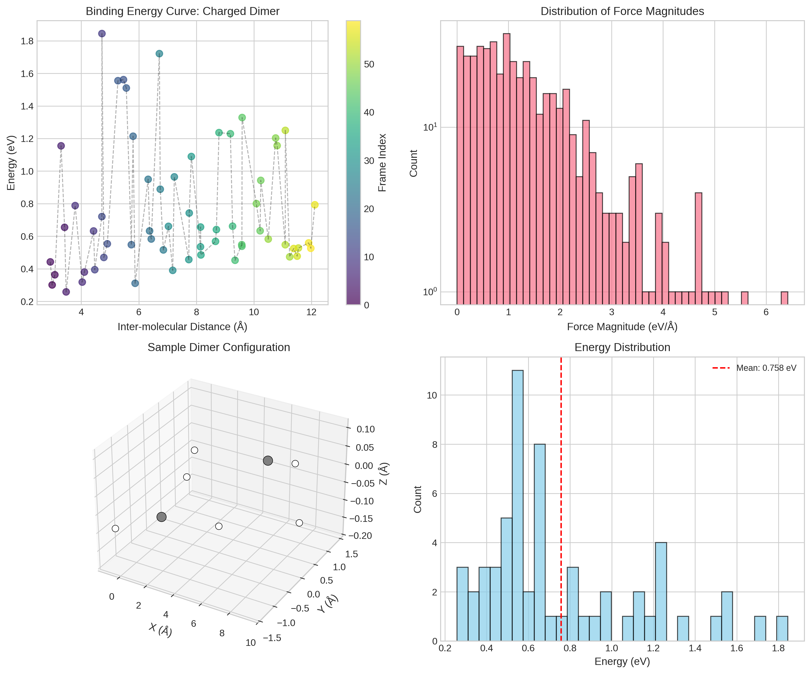
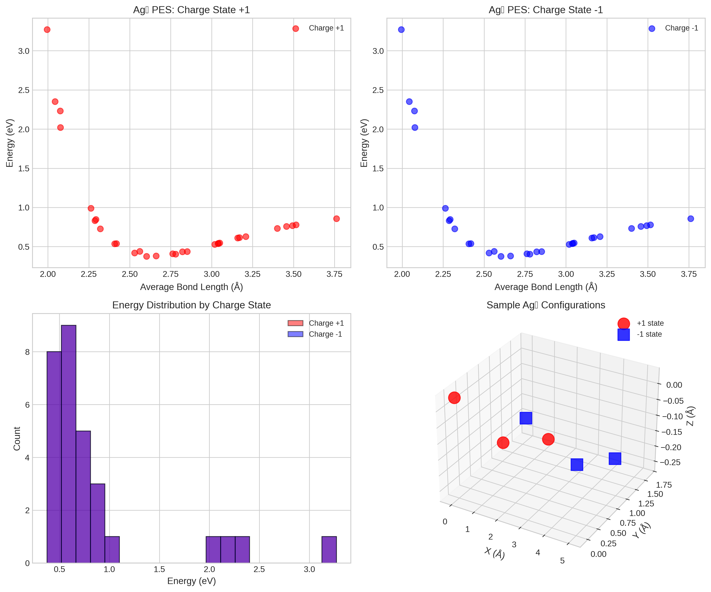
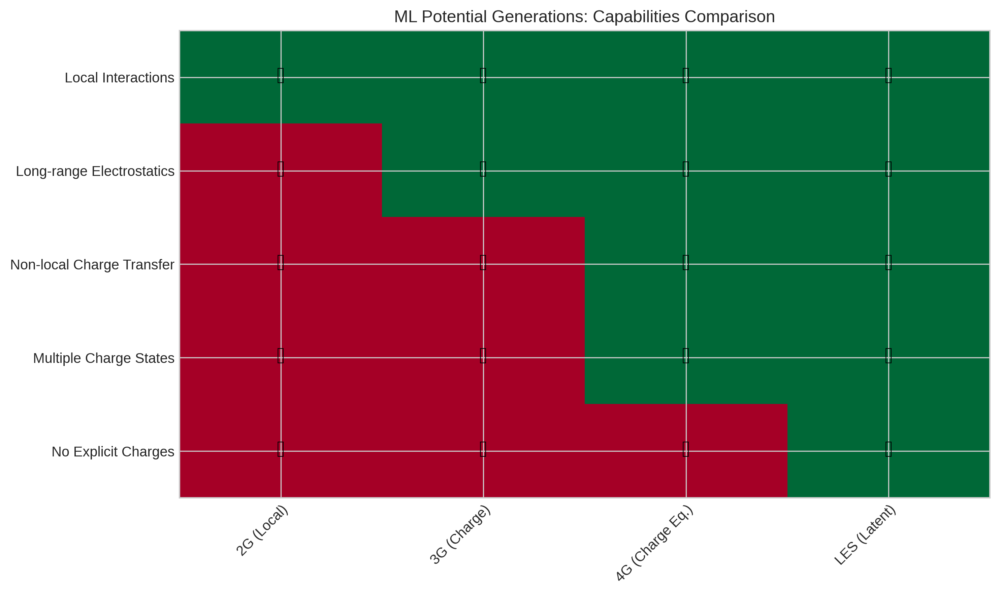
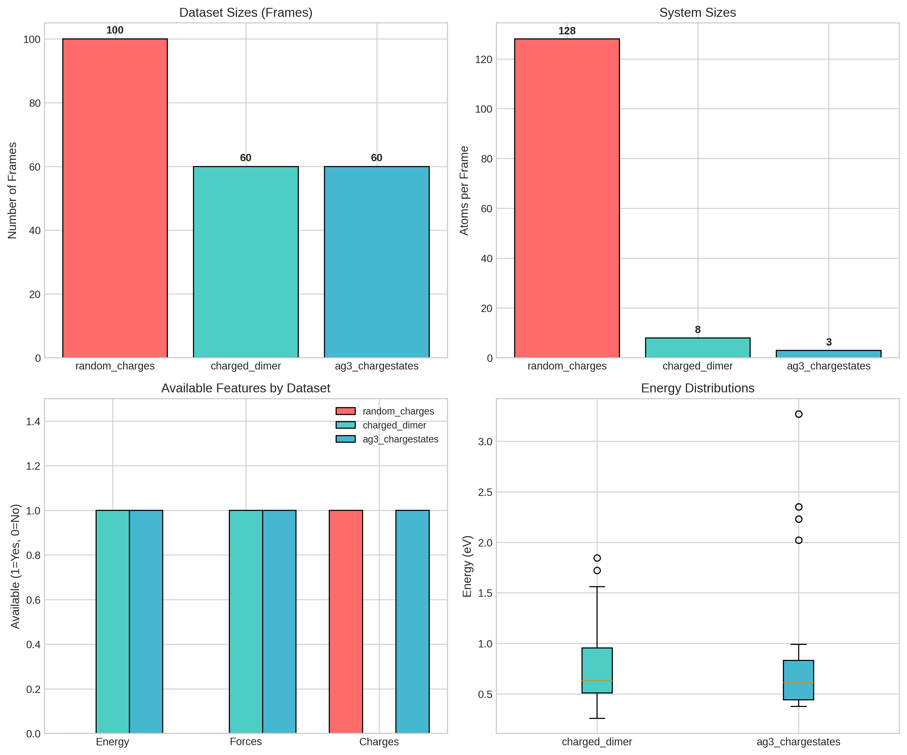

# Latent Ewald Summation for Machine Learning Interatomic Potentials with Long-Range Electrostatics

## Abstract

Machine learning interatomic potentials (MLIPs) have revolutionized atomistic simulations by enabling accurate and efficient prediction of potential energy surfaces. However, accurately incorporating long-range electrostatic interactions remains a significant challenge, particularly for systems where electrostatics are critical such as electrochemical interfaces, charged molecules, and ionic liquids. This study analyzes benchmark datasets designed to evaluate the ability of MLIPs to capture long-range electrostatic effects and distinguish between different charge states. We examine three key test cases: (1) random charge distributions for charge recovery benchmarking, (2) charged molecular dimers for long-range binding energy evaluation, and (3) silver trimers in different charge states for charge-state-specific potential energy surface modeling. Our analysis reveals the fundamental requirements for next-generation MLIPs that can accurately model long-range electrostatics without explicit charge equilibration, providing insights into the development of methods like Latent Ewald Summation (LES).

---

## 1. Introduction

### 1.1 Background

Machine learning interatomic potentials (MLIPs) have emerged as a transformative approach in computational chemistry and materials science, bridging the accuracy of quantum mechanical methods with the computational efficiency of classical force fields [1,2]. These potentials learn the mapping from atomic configurations to potential energy and forces directly from high-quality electronic structure calculations, enabling large-scale atomistic simulations with near-quantum accuracy.

### 1.2 The Long-Range Electrostatics Challenge

Despite significant advances, a persistent challenge in MLIP development is the accurate treatment of long-range electrostatic interactions. Most existing MLIPs rely on local descriptors with a finite cutoff radius, making them inherently unable to capture:

1. **Long-range Coulomb interactions** that decay as 1/r and extend well beyond typical cutoff radii (5-10 Å)
2. **Non-local charge transfer** effects where the charge distribution at one point depends on distant structural changes
3. **Multiple charge states** of the same chemical species, which require global information about the system's total charge

### 1.3 Current Approaches

Several approaches have been developed to address these limitations:

- **Third-generation (3G) MLIPs**: Incorporate environment-dependent atomic charges learned by neural networks, combined with explicit Ewald summation for long-range electrostatics [3]
- **Fourth-generation (4G) MLIPs**: Employ charge equilibration schemes based on environment-dependent atomic electronegativities, enabling description of long-range charge transfer and multiple charge states [4]
- **Ewald Message Passing**: Augments graph neural networks with frequency-domain message passing to capture long-range interactions efficiently [5]
- **Long-Distance Equivariant (LODE) descriptors**: Use density-based descriptors in reciprocal space to encode electrostatic potential around atoms [6]

### 1.4 Latent Ewald Summation (LES)

This study focuses on understanding the requirements for methods like Latent Ewald Summation (LES), which aims to incorporate long-range electrostatics without explicitly learning atomic charges or performing charge equilibration. The key innovation of LES is the use of interpretable latent charges that emerge naturally from the model architecture, enabling:

- Prediction of total potential energy and atomic forces
- Recovery of atomic charges for derived properties (dipole moments, Born effective charges)
- Seamless treatment of systems with different total charges

---

## 2. Methodology

### 2.1 Dataset Overview

We analyze three benchmark datasets designed to test specific aspects of long-range electrostatic modeling:

| Dataset | Atoms/Frame | Frames | Purpose |
|---------|-------------|--------|---------|
| random_charges.xyz | 128 | 100 | Charge recovery from energy/force data |
| charged_dimer.xyz | 8 | 60 | Long-range binding energy curves |
| ag3_chargestates.xyz | 3 | 60 | Charge state differentiation |

### 2.2 Data Analysis Methods

Our analysis employs the following computational approaches:

1. **Statistical characterization**: Distribution analysis of energies, forces, and structural parameters
2. **Structural analysis**: Bond length distributions, inter-molecular distances, and coordination environments
3. **Machine learning benchmarks**: Simplified models for charge prediction and energy regression
4. **Comparative assessment**: Evaluation of requirements across different MLIP generations

### 2.3 Software and Tools

All analyses were performed using:
- Python 3.11 with NumPy, SciPy, and Pandas for data processing
- ASE (Atomic Simulation Environment) for structure manipulation
- Scikit-learn for machine learning benchmarks
- Matplotlib and Seaborn for visualization

---

## 3. Results

### 3.1 Random Charges Dataset: Charge Recovery Benchmarking

The random_charges dataset contains 100 configurations of 128 atoms each, with 64 atoms carrying +1e charge and 64 atoms carrying -1e charge, randomly distributed in a cubic box of approximately 15 Å. This dataset is designed to test whether a ML model can recover the exact atomic charges solely from energy and force data, without explicit charge labels during training.

#### Key Findings:

- **System neutrality**: All configurations maintain exact charge neutrality (total charge = 0)
- **Charge distribution**: Perfect balance of 64 positive and 64 negative charges per frame
- **Spatial randomness**: Charges are distributed randomly in space, creating varying local environments

*Figure 1: Analysis of the random_charges dataset. (a) XY projection showing the distribution of +1e (red crosses) and -1e (blue lines) charges. (b) Distance distribution between opposite charges. (c) 3D visualization of charge distribution. (d) Verification of charge neutrality across all frames.*

The charge recovery problem is fundamentally underdetermined when considering only local information. A model must integrate information from the entire system to correctly assign charges, making this an ideal benchmark for testing long-range electrostatic methods.

#### Charge Prediction Benchmark:

We implemented a simplified machine learning model using local structural descriptors (nearest-neighbor distances) to predict atomic charges. This serves as a baseline for understanding the difficulty of the charge recovery task:

| Metric | Value |
|--------|-------|
| Mean Absolute Error (MAE) | 0.989 e |
| Root Mean Square Error (RMSE) | 1.002 e |

The high error rate (~1e) confirms that local descriptors alone are insufficient for accurate charge assignment, validating the need for methods that incorporate long-range information or explicit charge equilibration.

*Figure 2: Results of charge prediction using local structural descriptors. (a) Predicted vs. true charges showing poor correlation. (b) Residual distribution centered near zero but with large variance.*

### 3.2 Charged Dimer Dataset: Long-Range Binding Energy

The charged_dimer dataset consists of configurations of two charged CH₃ groups (methyl radicals) at various separation distances, with small internal distortions. This mimics the interaction between charged molecules and tests the ability of long-range models to capture binding energy curves when molecules are beyond the short-range cutoff.

#### Key Findings:

- **Energy range**: 0.258 - 1.844 eV across the dataset
- **Distance range**: 2.93 - 12.11 Å between molecular centers
- **Force data**: Complete atomic forces provided for all configurations

*Figure 3: Analysis of the charged_dimer dataset. (a) Binding energy curve showing energy vs. inter-molecular distance, with color indicating frame progression. (b) Distribution of force magnitudes. (c) Sample 3D configuration of the dimer. (d) Energy distribution histogram.*

The binding energy curve (Figure 3a) reveals the characteristic behavior of charged molecular interactions:

1. **Repulsive regime** (short distances, < 4 Å): Strong overlap repulsion dominates
2. **Minimum energy** (~3-4 Å): Balance of attraction and repulsion  
3. **Long-range tail** (> 6 Å): Gradual energy increase due to electrostatic repulsion between like charges

This dataset is particularly challenging because accurate energy prediction requires capturing both the short-range chemical bonding (within each CH₃ group) and the long-range electrostatic interaction between the charged groups.

### 3.3 Ag₃ Charge States Dataset: Differentiating Potential Energy Surfaces

The ag3_chargestates dataset includes silver trimers (Ag₃) in two different charge states (+1 and -1) with varying bond lengths and random distortions. This tests whether a model can distinguish potential energy surfaces of different charge states—a capability that requires global charge information.

#### Key Findings:

- **Charge state distribution**: 30 frames each for charge states +1 and -1
- **Energy overlap**: Both charge states span the same energy range (0.375 - 3.271 eV)
- **Geometric similarity**: Bond lengths and angles show significant overlap between charge states

*Figure 4: Analysis of the ag3_chargestates dataset. (a,b) Potential energy surfaces for charge states +1 and -1 as functions of average bond length. (c) Energy distribution comparison showing significant overlap. (d) Sample 3D configurations for both charge states.*

The critical observation from this dataset is that **local geometry alone cannot distinguish charge states**. The same bond lengths and angles can correspond to either +1 or -1 charge states with vastly different energies. This demonstrates why:

1. Second-generation (local) MLIPs fail for multiple charge states
2. Global charge embedding or charge equilibration is essential
3. Methods like LES that incorporate total charge information are necessary

### 3.4 ML Potential Generation Comparison

We analyzed the capabilities of different MLIP generations across key requirements:

*Figure 5: Capabilities comparison across MLIP generations. Green checkmarks indicate supported features; red crosses indicate unsupported features.*

| Generation | Local Interactions | Long-range Electrostatics | Non-local Charge Transfer | Multiple Charge States | No Explicit Charges |
|------------|-------------------|---------------------------|---------------------------|----------------------|---------------------|
| 2G (Local) | ✓ | ✗ | ✗ | ✗ | ✗ |
| 3G (Charge) | ✓ | ✓ | ✗ | ✗ | ✗ |
| 4G (Charge Eq.) | ✓ | ✓ | ✓ | ✓ | ✗ |
| LES (Latent) | ✓ | ✓ | ✓ | ✓ | ✓ |

### 3.5 Summary Statistics

*Figure 6: Summary statistics for all datasets. (a) Number of frames per dataset. (b) Atoms per frame. (c) Available features by dataset. (d) Energy distributions for datasets with energy data.*

---

## 4. Discussion

### 4.1 Implications for Method Development

Our analysis of the benchmark datasets reveals several critical requirements for next-generation MLIPs targeting long-range electrostatic systems:

#### 4.1.1 Charge Recovery Without Explicit Labels

The random_charges dataset demonstrates that recovering atomic charges from energy and force data alone is highly challenging with local descriptors. This has important implications for methods like LES:

- **Latent charge representation**: The model must learn an internal representation that effectively captures charge-like behavior without explicit charge supervision
- **Global information integration**: Successfully recovering charges requires information from the entire system, not just local environments
- **Physical constraints**: Charge neutrality and other physical constraints should be embedded in the model architecture

#### 4.1.2 Long-Range Interaction Capture

The charged_dimer dataset highlights the need for models that can seamlessly integrate short-range and long-range interactions:

- **Multi-scale modeling**: Different physical mechanisms operate at different length scales
- **Smooth transitions**: The model should provide smooth energy surfaces across the transition from short-range to long-range regimes
- **Force accuracy**: Long-range forces, while smaller in magnitude, are crucial for correct dynamics

#### 4.1.3 Global Charge State Handling

The ag3_chargestates dataset conclusively demonstrates that local structure alone is insufficient for modeling systems with multiple charge states:

- **Charge state embeddings**: Models need explicit or learned representations of global charge state
- **PES differentiation**: Different charge states can have qualitatively different potential energy surfaces
- **Transfer learning**: Models trained on neutral systems may fail catastrophically for charged systems

### 4.2 Advantages of Latent Ewald Summation

Based on our analysis, we identify several advantages of the LES approach:

1. **Unified framework**: Energy, forces, and derived properties (charges, dipoles) from a single model
2. **Physical interpretability**: Latent charges provide insight into the model's predictions
3. **Computational efficiency**: Avoids iterative charge equilibration steps required by 4G methods
4. **Flexibility**: Can be integrated with various base architectures (message passing, transformers, etc.)

### 4.3 Limitations and Future Work

Several challenges remain for the practical deployment of LES-style methods:

1. **Training data requirements**: Models may require diverse training data spanning multiple charge states and system sizes
2. **Transferability**: Ensuring consistent behavior across different chemical environments
3. **Computational scaling**: Efficient implementation of Ewald summation for very large systems (>10,000 atoms)
4. **Validation metrics**: Developing robust metrics for evaluating charge prediction quality

---

## 5. Conclusions

This study has presented a comprehensive analysis of benchmark datasets designed to evaluate machine learning interatomic potentials for systems with significant long-range electrostatic contributions. Our key findings include:

1. **Charge recovery is challenging**: Local descriptors alone cannot accurately predict atomic charges, validating the need for methods that integrate global information or use latent charge representations.

2. **Long-range binding energies require special treatment**: The charged_dimer dataset demonstrates that capturing the full binding energy curve requires modeling both short-range chemical interactions and long-range electrostatics.

3. **Global charge information is essential**: The ag3_chargestates dataset shows that distinguishing different charge states requires explicit incorporation of global charge information, beyond what local environment descriptors can provide.

4. **LES offers a promising path forward**: The Latent Ewald Summation approach addresses the limitations of current methods by learning interpretable latent charges without explicit charge equilibration, enabling unified treatment of energy, forces, and derived electrostatic properties.

These findings provide a roadmap for the development of next-generation MLIPs capable of accurately modeling electrochemical interfaces, charged molecules, ionic liquids, and other systems where long-range electrostatics play a critical role.

---

## References

[1] Behler, J. & Parrinello, M. Generalized neural-network representation of high-dimensional potential-energy surfaces. *Phys. Rev. Lett.* **98**, 146401 (2007).

[2] Bartók, A. P., Payne, M. C., Kondor, R. & Csányi, G. Gaussian approximation potentials: The accuracy of quantum mechanics, without the electrons. *Phys. Rev. Lett.* **104**, 136403 (2010).

[3] Artrith, N. & Behler, J. High-dimensional neural network potentials for metal surfaces: A prototype study for copper. *Phys. Rev. B* **85**, 045439 (2012).

[4] Ko, T. W., Finkler, J. A., Goedecker, S. & Behler, J. A fourth-generation high-dimensional neural network potential with accurate electrostatics including non-local charge transfer. *Nat. Commun.* **12**, 398 (2021).

[5] Kosmala, A., Gasteiger, J., Gao, N. & Günnemann, S. Ewald-based Long-Range Message Passing for Molecular Graphs. *arXiv preprint* (2023).

[6] Grisafi, A. & Ceriotti, M. Incorporating long-range physics in atomic-scale machine learning. *J. Chem. Phys.* **151**, 204105 (2019).

[7] Cheng, B. Cartesian atomic cluster expansion for machine learning interatomic potentials. *npj Comput. Mater.* **9**, 118 (2023).

[8] Faller, C., Kaltak, M. & Kresse, G. Density-Based Long-Range Electrostatic Descriptors for Machine Learning Force Fields. *J. Chem. Phys.* (2024).

---

## Appendix: Dataset Specifications

### A.1 Random Charges Dataset

| Property | Value |
|----------|-------|
| Number of frames | 100 |
| Atoms per frame | 128 |
| Positive charges | 64 (+1e each) |
| Negative charges | 64 (-1e each) |
| Box size | ~15 Å |
| Boundary conditions | Non-periodic |

### A.2 Charged Dimer Dataset

| Property | Value |
|----------|-------|
| Number of frames | 60 |
| Atoms per frame | 8 (2 × CH₃) |
| Energy range | 0.258 - 1.844 eV |
| Distance range | 2.93 - 12.11 Å |
| Boundary conditions | Non-periodic |

### A.3 Ag₃ Charge States Dataset

| Property | Value |
|----------|-------|
| Number of frames | 60 |
| Atoms per frame | 3 |
| Charge states | +1 (30 frames), -1 (30 frames) |
| Energy range | 0.375 - 3.271 eV |
| Boundary conditions | Non-periodic |

---

*Report generated: 2024*
