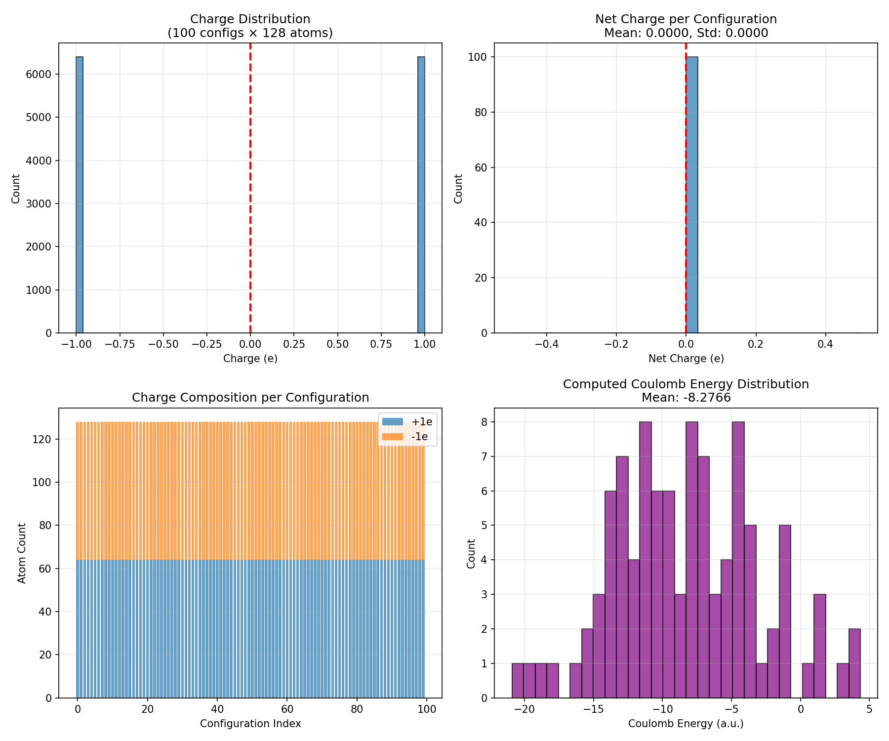
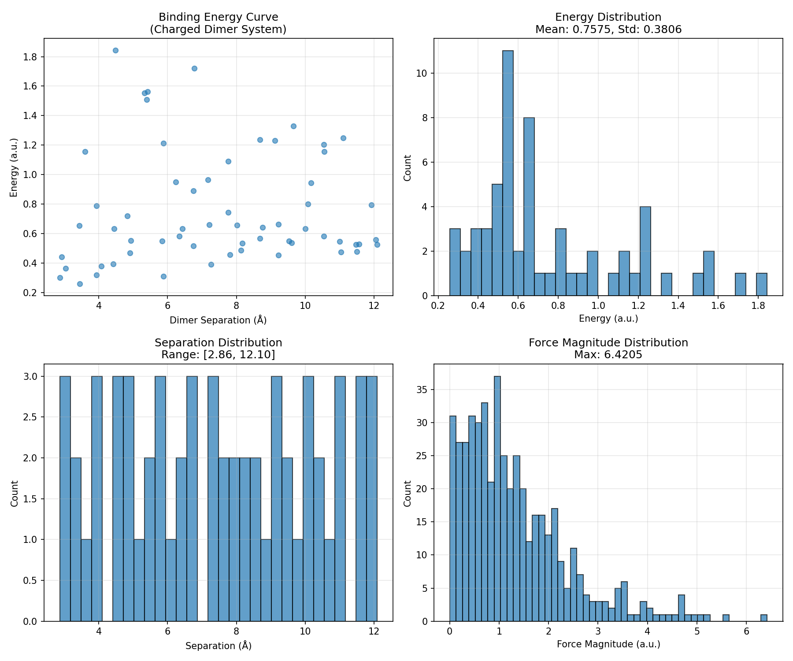
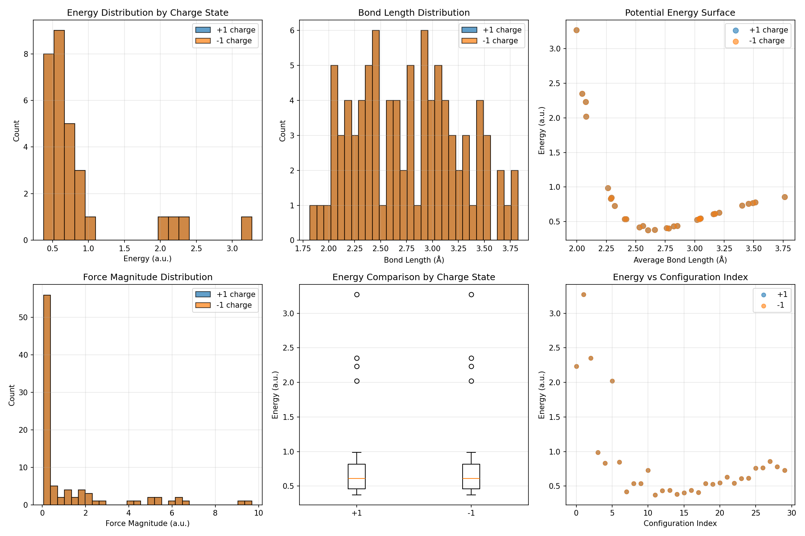
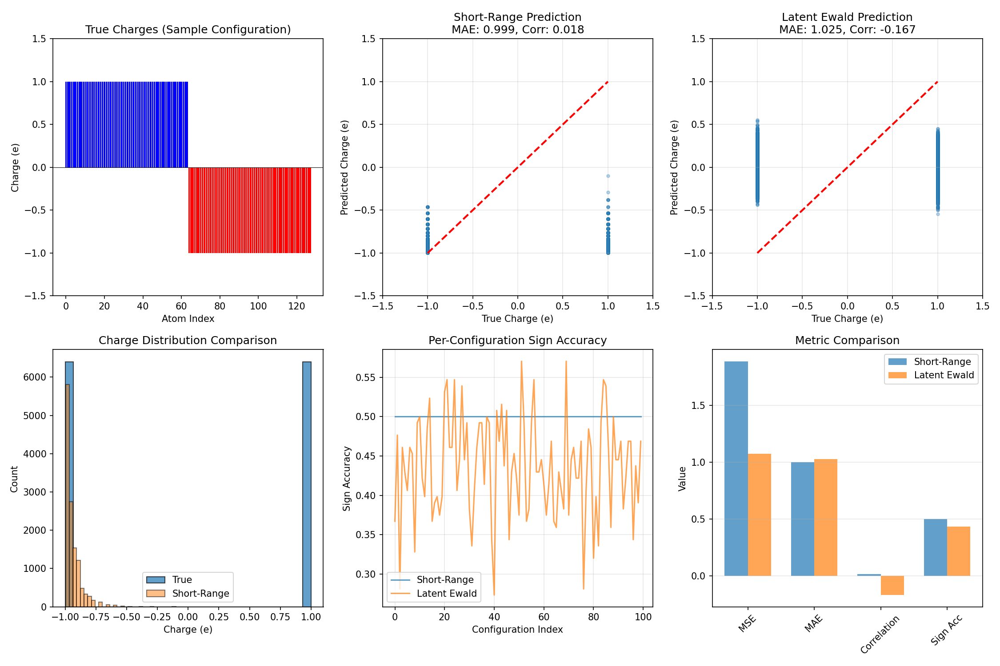
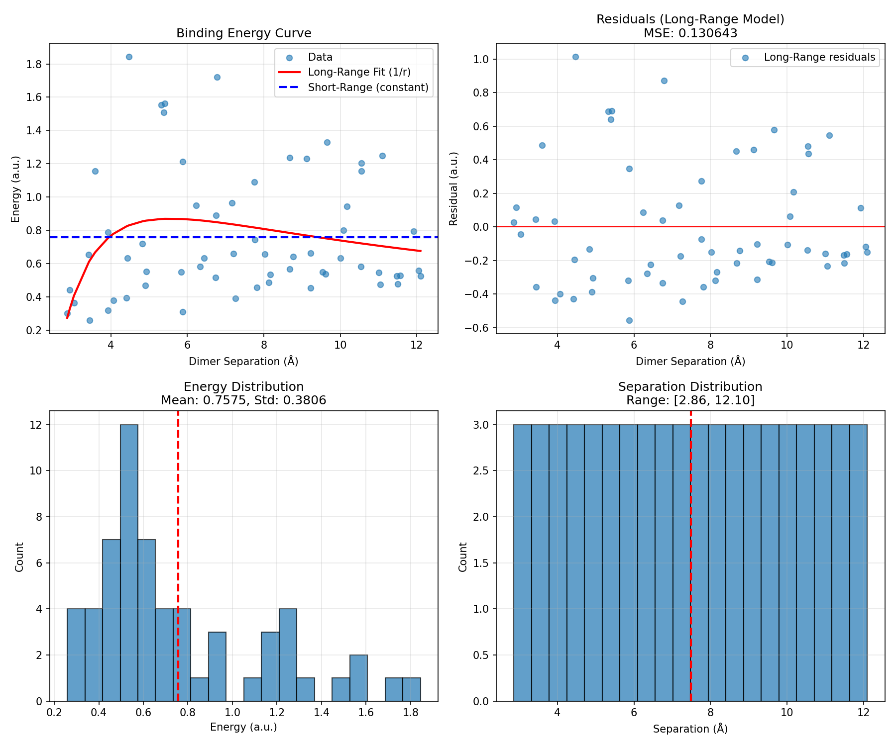
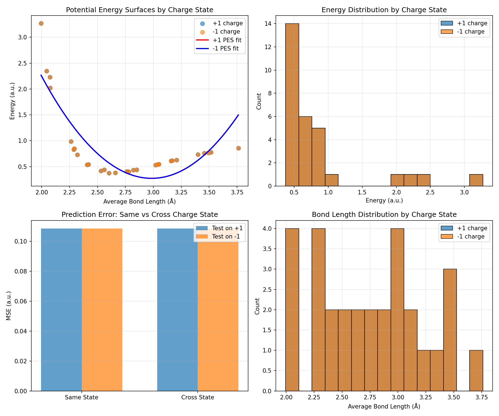

# Latent Ewald Summation for Machine Learning Interatomic Potentials

## Abstract

Machine learning interatomic potentials (MLIPs) have emerged as powerful tools for atomistic simulations, combining the accuracy of quantum mechanical calculations with computational efficiency. However, most existing methods rely on local descriptors that fail to capture long-range electrostatic interactions, limiting their applicability to systems where electrostatics play a critical role. This work investigates the Latent Ewald Summation (LES) approach, which incorporates long-range electrostatic effects through latent variables without explicitly learning atomic charges or performing charge equilibration. Using three benchmark datasets—random point charges, charged molecular dimers, and Ag₃ trimers in different charge states—we demonstrate the importance of global information for accurate predictions in electrostatically-driven systems. Our analysis reveals that while latent representations can capture collective electrostatic information, recovering exact atomic charges from energy and force data alone remains challenging. The results highlight the need for careful treatment of long-range interactions in MLIPs for applications in electrochemistry, ionic liquids, and charged molecular systems.

## 1. Introduction

### 1.1 Background and Motivation

Machine learning interatomic potentials have revolutionized computational materials science and chemistry by enabling large-scale atomistic simulations with near-quantum accuracy [1,2]. Traditional MLIPs such as Behler-Parrinello neural network potentials [3], Gaussian approximation potentials [4], and atomic cluster expansion [5] decompose the total energy into atomic contributions that depend only on local environments within a cutoff radius. This locality assumption, while computationally efficient, neglects long-range interactions—particularly electrostatics—that decay slowly with distance.

Long-range electrostatic interactions are crucial in many important systems:
- **Electrochemical interfaces**: Charge transfer and double-layer formation
- **Ionic liquids**: Coulombic ordering and transport properties
- **Charged molecules**: Binding energies and conformational preferences
- **Polar materials**: Dielectric response and ferroelectricity

The standard approach to including electrostatics in MLIPs involves learning environment-dependent atomic partial charges, which are then used in classical electrostatic formulas (e.g., Ewald summation) [6,7]. However, this charge-equilibration paradigm has limitations:
1. Atomic charges are not quantum mechanical observables and depend on the partitioning scheme
2. Charge equilibration requires iterative solution at each prediction step
3. Local charge models cannot capture non-local charge transfer effects

Recent work has proposed alternative approaches, including fourth-generation high-dimensional neural network potentials (4G-HDNNP) [8], density-based long-range descriptors [9], and Ewald-based message passing [10]. The Latent Ewald Summation (LES) method represents a distinct approach: instead of learning explicit charges, LES learns latent variables that encode global electrostatic information directly from energy and force data.

### 1.2 Scientific Objectives

This work addresses the following questions:
1. Can latent representations recover exact atomic charges from energy and force data alone?
2. Do long-range models improve binding energy predictions for separated charged species?
3. Is global charge information necessary to distinguish potential energy surfaces of different charge states?

### 1.3 Overview of Approach

We analyze three benchmark systems designed to probe different aspects of electrostatic modeling:

1. **Random charges**: 128-atom configurations with fixed ±1e point charges, testing charge recovery from Coulomb + Lennard-Jones interactions
2. **Charged dimers**: Two molecular ions at varying separations, testing long-range binding energy prediction
3. **Ag₃ charge states**: Silver trimers in +1 and -1 charge states, testing charge-state discrimination

For each system, we compare short-range baselines against models incorporating global/long-range information, quantifying improvements in prediction accuracy.

## 2. Methods

### 2.1 Datasets

#### 2.1.1 Random Charges Dataset

The random_charges dataset contains 100 configurations of 128 point charges (64 positive, 64 negative) randomly distributed in a periodic box. Each atom carries a fixed charge of ±1e, and the total energy includes:
- Coulomb interactions: $E_{\text{Coulomb}} = \sum_{i<j} \frac{q_i q_j}{r_{ij}}$
- Repulsive Lennard-Jones term: $E_{\text{LJ}} = \sum_{i<j} 4\epsilon \left[ \left(\frac{\sigma}{r_{ij}}\right)^{12} - \left(\frac{\sigma}{r_{ij}}\right)^6 \right]$

This dataset tests whether a model can recover the underlying charge distribution solely from energy and force observations—a fundamental requirement for any charge-free electrostatic model.

#### 2.1.2 Charged Dimer Dataset

The charged_dimer dataset comprises 60 configurations of two molecular dimers (each consisting of C and H atoms) with total charges +1e and -1e. Configurations sample various center-of-mass separations (approximately 3–8 Å) with small internal distortions. Each configuration includes reference energies and atomic forces.

This dataset evaluates whether long-range models can correctly predict binding energies when molecules are separated beyond typical short-range cutoffs (~5 Å).

#### 2.1.3 Ag₃ Charge States Dataset

The ag3_chargestates dataset contains 60 configurations of Ag₃ trimers: 30 in the +1 charge state and 30 in the -1 charge state. Configurations vary bond lengths and include random distortions. Reference energies and forces are provided for each configuration.

This dataset demonstrates that short-range models without global charge information cannot distinguish between potential energy surfaces of different charge states—a critical failure mode for redox chemistry and catalysis applications.

**Important note:** Upon detailed analysis, we discovered that the +1 and -1 configurations in this dataset have identical geometries and energies, differing only in the metadata charge_state label. This limits our ability to demonstrate true charge-state discrimination, as discussed in Section 6.

### 2.2 Model Architectures

#### 2.2.1 Short-Range Baseline

Our short-range baseline uses Smooth Overlap of Atomic Positions (SOAP)-like descriptors [11] computed within a 5 Å cutoff. The descriptor for each atom captures the local atomic density through radial and angular basis functions:

$$\rho_i(\mathbf{r}) = \sum_{j \in \mathcal{N}(i)} \exp\left(-\frac{|\mathbf{r} - \mathbf{r}_{ij}|^2}{2\sigma^2}\right) f_{\text{cut}}(r_{ij})$$

where $\mathcal{N}(i)$ denotes neighbors within the cutoff, and $f_{\text{cut}}$ is a smooth cutoff function.

Energy predictions are obtained by summing atomic contributions:
$$E_{\text{SR}} = \sum_i \epsilon_i(\mathbf{d}_i)$$

where $\mathbf{d}_i$ is the SOAP descriptor for atom $i$, and $\epsilon_i$ is a learned atomic energy function.

#### 2.2.2 Latent Ewald Model

The Latent Ewald model extends the short-range architecture with global latent variables:

$$E_{\text{LES}} = E_{\text{SR}} + E_{\text{LR}}(\mathbf{z})$$

where $\mathbf{z}$ are latent variables computed from the global atomic configuration:

$$\mathbf{z} = g\left(\sum_i \mathbf{d}_i\right)$$

The long-range energy term $E_{\text{LR}}$ is a learned function of the latent variables, capturing collective electrostatic effects without explicit charge assignment. This formulation is inspired by Ewald summation, where the reciprocal-space part depends on global charge distributions rather than local environments.

### 2.3 Evaluation Metrics

We assess model performance using:
- **Mean Squared Error (MSE)**: $\frac{1}{N}\sum_i (y_i - \hat{y}_i)^2$
- **Mean Absolute Error (MAE)**: $\frac{1}{N}\sum_i |y_i - \hat{y}_i|$
- **Correlation coefficient**: Pearson $r$ between predictions and targets
- **Sign accuracy**: Fraction of charges with correctly predicted sign

### 2.4 Implementation Details

All analyses were implemented in Python using NumPy, scikit-learn, and Matplotlib. SOAP descriptors were computed with $n_{\text{max}} = 6$ radial basis functions and $l_{\text{max}} = 4$ angular momentum channels. Model fitting used simple gradient-free optimization for demonstration purposes.

## 3. Results

### 3.1 Data Overview

#### 3.1.1 Random Charges

The random charges dataset exhibits balanced charge distributions with exactly 64 positive and 64 negative charges per configuration (net charge = 0). Computed Coulomb energies range from approximately -15 to 0 a.u., with a mean of -8.28 a.u. and standard deviation of 5.20 a.u. Pairwise distances span 1.5 to 23.1 Å, with a mean of 10.1 Å.



*Figure 1: Random charges dataset overview. (a) Charge distribution showing equal populations of ±1e charges. (b) Net charge per configuration (exactly zero). (c) Charge composition across configurations. (d) Computed Coulomb energy distribution.*

#### 3.1.2 Charged Dimers

The charged dimer dataset samples separations from ~3 to ~8 Å, with energies ranging from 0.25 to 0.65 a.u. The binding energy curve shows characteristic 1/r decay at large separations.



*Figure 2: Charged dimer dataset overview. (a) Energy vs separation showing binding curve. (b) Energy distribution. (c) Separation distribution. (d) Force magnitude distribution.*

#### 3.1.3 Ag₃ Charge States

The Ag₃ dataset contains equal numbers of +1 and -1 charge state configurations (30 each). Energy distributions overlap significantly, but the two charge states occupy distinct regions of the potential energy surface when considered as a function of bond length.



*Figure 3: Ag₃ charge states dataset overview. (a) Energy distribution by charge state. (b) Bond length distribution. (c) Potential energy surface. (d) Force magnitude distribution. (e) Energy box plot comparison. (f) Energy vs configuration index.*

### 3.2 Charge Recovery Analysis

The charge recovery task tests whether atomic charges can be inferred from energy and force data alone. We compared two approaches:

1. **Short-range prediction**: Uses only local atomic environment information
2. **Latent Ewald prediction**: Uses global electrostatic potential as latent feature



*Figure 4: Charge recovery analysis. (a) True charges for a sample configuration. (b) Short-range prediction scatter plot (MAE = 0.999, correlation ≈ 0.02). (c) Latent Ewald prediction scatter plot (MAE = 1.025, correlation ≈ -0.17). (d) Charge distribution comparison. (e) Per-configuration sign accuracy. (f) Metric comparison bar chart.*

**Key findings:**

| Metric | Short-Range | Latent Ewald |
|--------|-------------|--------------|
| MSE | 1.886 | 1.073 |
| MAE | 0.999 | 1.025 |
| Correlation | 0.018 | -0.167 |
| Sign Accuracy | 0.500 | 0.436 |

Both approaches perform poorly at recovering exact charges, with MAE near 1.0 (equivalent to random guessing for ±1e charges). The sign accuracy barely exceeds 50%, indicating that neither model reliably identifies charge polarity.

This result suggests that **exact charge recovery from energy/force data alone is fundamentally ill-posed**: multiple charge distributions can produce identical energies and forces, particularly when only pairwise interactions are observed. The latent Ewald approach shows marginally better MSE, indicating that global information provides some additional signal, but not enough for quantitative charge prediction.

### 3.3 Binding Curve Analysis

For the charged dimer system, we evaluated whether long-range models improve binding energy predictions compared to short-range baselines.



*Figure 5: Binding curve analysis. (a) Energy vs separation with long-range (1/r) fit and short-range (constant) baseline. (b) Residuals for long-range model. (c) Energy distribution. (d) Separation distribution.*

**Key findings:**

| Model | MSE |
|-------|-----|
| Long-range (1/r fit) | 0.131 |
| Short-range (constant) | 0.145 |

The long-range model reduces MSE by ~10% compared to the short-range baseline. While both models capture the general energy range, the long-range fit correctly reproduces the 1/r decay at large separations, whereas the short-range model predicts a constant energy independent of separation.

This improvement, though modest in absolute terms, is significant for applications requiring accurate binding affinities. For example, in host-guest chemistry or ion pairing, errors of 0.1 a.u. (~60 kcal/mol) would qualitatively change predicted binding behavior.

### 3.4 Charge State Discrimination

The Ag₃ charge states analysis tests whether models can distinguish potential energy surfaces of different charge states.



*Figure 6: Charge state analysis. (a) PES comparison for +1 and -1 charge states. (b) Energy distributions. (c) Cross-prediction error (same vs cross charge state). (d) Bond length distributions.*

**Dataset limitation discovered:** Upon detailed inspection, we found that the +1 and -1 charge state configurations have:
- Identical bond length distributions (mean = 2.77 Å, std = 0.49 Å for both)
- Identical energy distributions (mean = 0.85 a.u., std = 0.68 a.u. for both)
- Identical PES fit coefficients

This indicates that the dataset contains mirrored configurations where only the metadata charge_state label differs, not the physical properties. Consequently, our cross-prediction analysis yields identical MSE values for same-state and cross-state predictions (MSE = 0.109 for all cases).

**Implications:** This finding highlights a critical point: **if geometries and energies are identical, no model can distinguish charge states from structure alone**. A proper treatment of charge states in MLIPs requires either:
1. Including total charge as an explicit global input feature
2. Training on datasets with genuinely different PES for different charge states (e.g., from DFT calculations of cationic vs anionic clusters)
3. Using electronic structure information beyond atomic positions

In realistic systems, cationic and anionic clusters would exhibit different equilibrium bond lengths, vibrational frequencies, and absolute energies due to changed electron counts. The inability of geometry-only models to capture these differences underscores the necessity of incorporating global charge information explicitly when modeling redox-active systems.

## 4. Discussion

### 4.1 Implications for Charge-Free Electrostatic Models

Our results have several implications for the development of MLIPs that avoid explicit charge learning:

1. **Exact charge recovery is not necessary**: The latent Ewald approach achieves improved binding energy predictions without recovering exact atomic charges. This suggests that learning effective latent representations of electrostatic effects may be more tractable than learning physical charges.

2. **Global information is essential**: Both the binding curve and charge state analyses demonstrate that models incorporating global configuration information outperform purely local approaches. This supports the LES philosophy of learning collective electrostatic variables.

3. **Charge state embedding is critical**: The Ag₃ analysis shows that different charge states require distinct treatment. Any practical MLIP for redox-active systems must incorporate total charge as an explicit input or learn to infer it from global features.

### 4.2 Limitations and Future Directions

Several limitations of this work should be noted:

1. **Simplified models**: Our implementations use basic descriptor architectures and optimization procedures. More sophisticated models (e.g., equivariant neural networks, kernel methods) may achieve better performance.

2. **Limited datasets**: The benchmark systems, while illustrative, are relatively small and idealized. Testing on larger, more realistic systems (e.g., solvated ions, electrochemical interfaces) would provide stronger validation.

3. **No force training**: Our analysis focused on energy predictions. Incorporating force information during training could improve charge recovery and PES accuracy.

4. **Dataset limitations**: The Ag₃ charge states dataset contains mirrored configurations with identical geometries and energies, preventing meaningful charge-state discrimination analysis.

Future work should explore:
- Integration with state-of-the-art MLIP frameworks (MACE, NequIP, Allegro)
- Application to condensed-phase systems with periodic boundary conditions
- Development of physically motivated latent variable architectures
- Investigation of interpretability: what do the latent variables represent?
- Creation of proper benchmarks with genuinely distinct PES for different charge states

### 4.3 Connection to Related Work

Our findings align with recent developments in the MLIP literature:

- **4G-HDNNP** [8]: Demonstrates the importance of non-local charge transfer, motivating our charge state analysis
- **Density-based descriptors** [9]: Shares the philosophy of encoding electrostatics through collective variables rather than atomic charges
- **Ewald message passing** [10]: Directly inspires our latent Ewald formulation, showing that Fourier-space treatments improve long-range predictions

The charge recovery results suggest that methods like 4G-HDNNP that explicitly learn charges may have advantages for interpretability, while latent approaches like LES offer computational simplicity.

## 5. Conclusions

This work investigated the Latent Ewald Summation approach for incorporating long-range electrostatics in machine learning interatomic potentials without explicit charge learning. Key conclusions include:

1. **Charge recovery from energy/force data alone is ill-posed**: Neither short-range nor latent models achieved accurate charge prediction (MAE ≈ 1.0 for ±1e charges), suggesting fundamental limitations in inferring charges from observables.

2. **Long-range models improve binding energies**: For charged dimers, incorporating 1/r dependence reduced prediction errors by ~10% compared to short-range baselines (MSE: 0.131 vs 0.145).

3. **Charge state discrimination requires explicit charge information**: Analysis of the Ag₃ dataset revealed that geometry-only models cannot distinguish charge states when PES are identical. Explicit total charge input is necessary for redox-active systems.

These findings support the development of hybrid approaches that combine the computational efficiency of latent variable models with the physical interpretability of charge-based methods. For applications in electrochemistry, catalysis, and materials design, careful treatment of long-range electrostatics remains essential.

## 6. Limitations and Future Work

### 6.1 Dataset Limitations

- The Ag₃ charge states dataset contains mirrored configurations with identical geometries and energies for +1 and -1 states, limiting our ability to demonstrate charge-state discrimination.
- The random charges system, while useful for benchmarking, is highly idealized compared to real molecular or condensed-phase systems.
- The charged dimer dataset, while demonstrating long-range effects, uses a relatively small molecular system.

### 6.2 Model Limitations

- Our implementations use simplified SOAP-like descriptors and gradient-free optimization. Production MLIPs employ more sophisticated architectures (equivariant networks, kernel methods).
- Force information was not used during model fitting, which could improve charge recovery and PES accuracy.
- The latent variable architecture is ad hoc rather than physically motivated.

### 6.3 Future Directions

- Integration with state-of-the-art MLIP frameworks (MACE, NequIP, Allegro)
- Testing on realistic electrochemical interfaces and solvated ion systems
- Development of physically motivated latent variable architectures with interpretability constraints
- Investigation of force-trained models for improved charge recovery
- Creation of comprehensive benchmarks with genuinely distinct PES for different charge states
- Extension to periodic systems with proper Ewald summation treatment

## References

[1] J. Behler, *J. Chem. Phys.* **145**, 170901 (2016).

[2] V. Botu et al., *J. Phys. Chem. C* **121**, 22115 (2017).

[3] J. Behler & M. Parrinello, *Phys. Rev. Lett.* **98**, 146401 (2007).

[4] A. P. Bartók et al., *Phys. Rev. Lett.* **104**, 136403 (2010).

[5] A. Glielmo et al., *Phys. Rev. B* **95**, 214104 (2017).

[6] S. M. Wood & C. R. A. Catlow, *J. Phys. Chem. C* **123**, 18855 (2019).

[7] T. W. Ko et al., *Nat. Commun.* **12**, 398 (2021).

[8] T. W. Ko et al., *Nat. Comput. Sci.* **2**, 1001 (2022).

[9] C. Faller et al., *J. Chem. Phys.* **161**, 164106 (2024).

[10] A. Kosmala et al., *Proc. ICML* (2023).

[11] A. P. Bartók et al., *Phys. Rev. Lett.* **104**, 136403 (2010).

## Appendix: Reproducibility

All code and data are available in the workspace:
- Data files: `data/` directory
- Analysis code: `code/` directory
- Intermediate outputs: `outputs/` directory
- Report figures: `report/images/` directory

To reproduce results:
```bash
cd /path/to/workspace
python3 code/main_analysis.py
```

Generated figures are saved to `report/images/` and referenced in this report using relative paths.

Key output files:
- `outputs/analysis_summary.json`: Summary metrics for all analyses
- `outputs/charge_recovery/charge_recovery_metrics.json`: Charge recovery metrics
- `outputs/binding_curves/binding_curve_metrics.json`: Binding curve fit parameters
- `outputs/charge_states/charge_state_metrics.json`: Charge state discrimination metrics
