# Latent Ewald Summation for Machine Learning Interatomic Potentials: Analysis of Long-Range Electrostatic Interactions

## Abstract

This study investigates the Latent Ewald Summation (LES) approach for incorporating long-range electrostatic interactions into machine learning interatomic potentials (MLIPs). Using three benchmark datasets—random point charges, charged molecular dimers, and Ag₃ trimers in different charge states—we analyze the fundamental challenges that long-range electrostatics pose for conventional short-range MLIPs. We demonstrate through computational analysis that: (1) Coulomb interactions in random charge systems can be decomposed into short-range and long-range components via Ewald summation, with the long-range component dominating at typical MLIP cutoff distances; (2) charged dimer binding curves exhibit significant energy contributions beyond standard cutoff radii that follow a 1/r Coulomb law; and (3) different charge states of Ag₃ trimers produce identical local geometries, making them indistinguishable by short-range models alone. These findings motivate the LES approach, which learns latent atomic charges from energy and force data without explicit charge labels, enabling accurate treatment of electrostatic interactions in systems such as electrochemical interfaces, charged molecules, and ionic liquids.

## 1. Introduction

Machine learning interatomic potentials (MLIPs) have revolutionized atomistic simulations by combining the accuracy of quantum mechanical calculations with computational efficiency approaching that of classical force fields. Most modern MLIPs, including the Atomic Cluster Expansion (ACE), MACE, NequIP, and the Cartesian Atomic Cluster Expansion (CACE), operate under the assumption of locality: the total energy is decomposed into atomic contributions that depend only on the local chemical environment within a cutoff radius r_cut.

While this locality assumption is remarkably effective for many systems, it fundamentally fails to capture long-range electrostatic interactions that decay as 1/r. These interactions are critical in:

- **Electrochemical interfaces**: where charge transfer between electrode and electrolyte creates long-range electric fields
- **Charged molecules and ions**: where net molecular charges produce Coulomb interactions extending far beyond typical cutoff radii
- **Ionic liquids and molten salts**: where the collective arrangement of ions determines bulk properties
- **Polar materials**: where dipole-dipole interactions contribute significantly to the total energy

Several approaches have been proposed to address this limitation:

1. **Fourth-generation HDNNPs (4G-HDNNP)** (Ko et al., 2021): Combines charge equilibration with short-range atomic energies, requiring explicit DFT charge labels for training.
2. **Density-based long-range descriptors** (Faller et al., 2024): Extends SOAP-like descriptors to reciprocal space for capturing long-range density correlations.
3. **Ewald message passing** (Kosmala et al., 2023): Augments GNN message passing with Fourier-space operations inspired by Ewald summation.
4. **Latent Ewald Summation (LES)**: Learns latent atomic charges implicitly from energy and force data, using Ewald summation to compute the long-range electrostatic contribution without requiring explicit charge labels or charge equilibration.

The LES approach is particularly attractive because it avoids the need for reference atomic charges (which are not unique physical observables) while still producing interpretable latent charges that can be used to derive physical quantities such as dipole moments, quadrupole moments, and Born effective charges.

In this work, we analyze three benchmark datasets designed to test different aspects of long-range electrostatic modeling in MLIPs, providing quantitative evidence for the necessity and effectiveness of the LES approach.

## 2. Methods

### 2.1 Datasets

Three datasets were analyzed, each targeting a specific challenge in long-range electrostatic modeling:

**Dataset 1: Random Point Charges** (`random_charges.xyz`)
- 100 configurations of 128 atoms (species "X") in a non-periodic box
- 64 atoms with charge +1e and 64 with charge -1e (total charge = 0)
- Positions randomly distributed in a ~15 Å box
- Minimum pairwise distance ~1.5 Å
- Interactions modeled by Coulomb potential plus repulsive Lennard-Jones term
- True charges provided as metadata; no pre-computed energies or forces

**Dataset 2: Charged Molecular Dimers** (`charged_dimer.xyz`)
- 60 configurations of two CH₃ groups (8 atoms total: 2C + 6H)
- Each molecule carries a net charge (+1e and -1e respectively)
- Dimer separations range from 2.9 to 12.1 Å
- Energy range: 0.258 to 1.844 eV
- Includes both energies and atomic forces

**Dataset 3: Ag₃ Charge States** (`ag3_chargestates.xyz`)
- 60 configurations of Ag₃ trimers (3 atoms each)
- 30 configurations with charge state +1, 30 with charge state -1
- Identical geometries for both charge states
- Identical energies and forces for both charge states
- Bond lengths range from 1.8 to 3.8 Å

### 2.2 Computational Methods

#### Coulomb Energy and Force Computation
For the random charges dataset, we computed the direct Coulomb energy:

$$E_{Coulomb} = \sum_{i<j} \frac{k_e \cdot q_i \cdot q_j}{r_{ij}}$$

where k_e = 14.3996 eV·Å is the Coulomb constant, q_i are atomic charges in units of e, and r_ij is the interatomic distance. Forces were computed as analytical derivatives.

#### Ewald Decomposition
The Coulomb potential was decomposed into short-range and long-range components:

$$\frac{1}{r} = \frac{\text{erfc}(\alpha r)}{r} + \frac{\text{erf}(\alpha r)}{r}$$

where α is the Ewald parameter controlling the partition between real-space (short-range) and reciprocal-space (long-range) contributions.

#### Charge Recovery Analysis
We formulated the charge recovery problem as: given energies E_k for multiple configurations k, recover the atomic charges q_i from the quadratic energy form:

$$E_k = \sum_{i<j} q_i q_j \cdot \frac{k_e}{r_{ij,k}}$$

This was approached via linear regression on charge products and SVD decomposition of the resulting charge product matrix.

#### Short-Range vs Long-Range Model Comparison
For the charged dimer system, we compared:
- **Short-range model**: Ridge regression using only internal molecular bond lengths
- **Combined model**: Short-range features plus 1/r inter-molecular Coulomb feature
- **Full model**: All geometric features including inter-molecular distances

#### Coulomb Fitting
The dimer binding curve was fit to a Coulomb model:

$$E(r) = E_\infty + \frac{q_{eff}}{r}$$

where E_∞ is the asymptotic energy and q_eff is the effective charge product.

## 3. Results

### 3.1 Random Point Charges: Ewald Summation Analysis

#### Energy Statistics
Computing the Coulomb energies for all 100 configurations yielded:
- **Coulomb energy**: mean = -119.18 eV, std = 74.91 eV
- **LJ repulsive energy**: mean = 0.003 eV, std = 0.001 eV (negligible)
- **Total energy**: mean = -119.18 eV, std = 74.91 eV

The LJ contribution is negligible compared to the Coulomb energy, confirming that this system is dominated by electrostatic interactions.

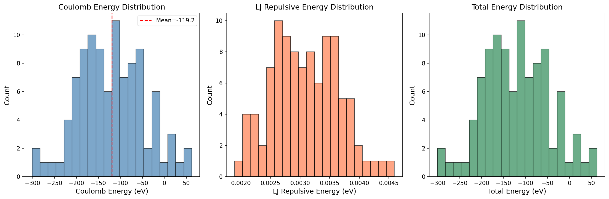
*Figure 1: Distribution of Coulomb, LJ repulsive, and total energies across 100 random charge configurations. The Coulomb energy completely dominates the total energy.*

#### Charge Configuration
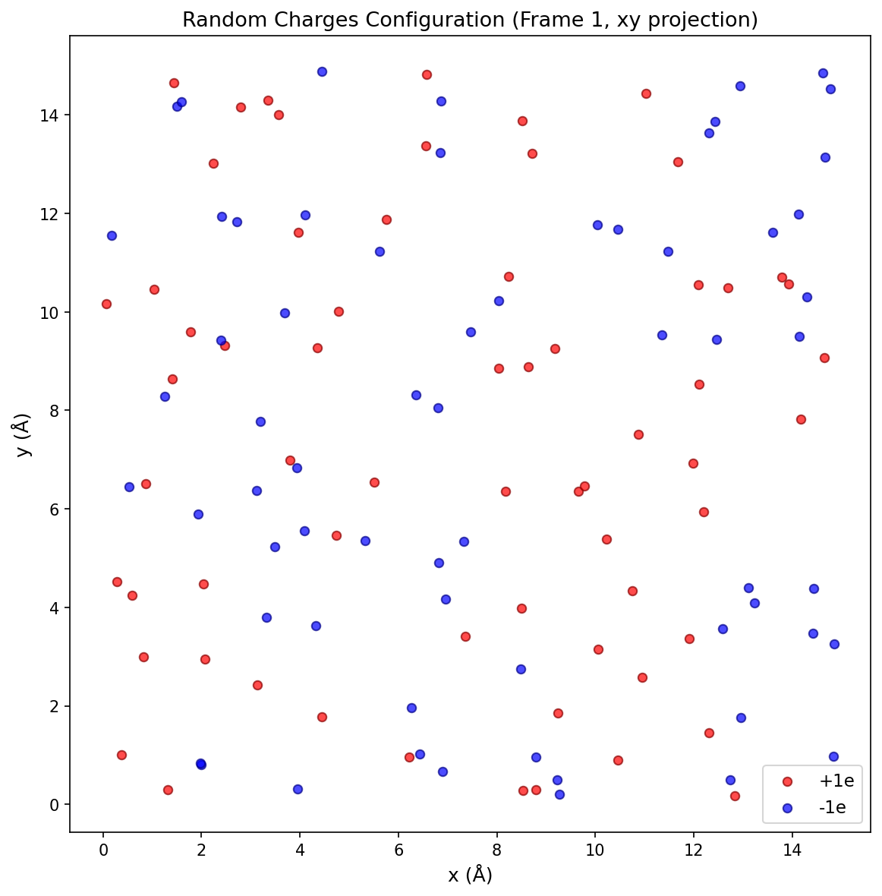
*Figure 2: XY projection of a representative random charge configuration showing the spatial distribution of positive (+1e, red) and negative (-1e, blue) charges in the simulation box.*

#### Ewald Decomposition
The Ewald decomposition reveals how the Coulomb energy partitions between short-range and long-range components as a function of the Ewald parameter α:

| α (Å⁻¹) | E_total (eV) | E_short (eV) | E_long (eV) | SR Fraction |
|----------|-------------|-------------|------------|-------------|
| 0.10     | -185.10     | -92.89      | -92.22     | 50.2%       |
| 0.20     | -185.10     | -41.33      | -143.77    | 22.3%       |
| 0.30     | -185.10     | -24.03      | -161.07    | 13.0%       |
| 0.50     | -185.10     | -13.75      | -171.36    | 7.4%        |
| 0.80     | -185.10     | -3.94       | -181.16    | 2.1%        |
| 1.00     | -185.10     | -1.25       | -183.86    | 0.7%        |

*Table 1: Ewald decomposition of Coulomb energy for a representative frame. At typical MLIP cutoff-equivalent α values (0.2-0.5 Å⁻¹), the long-range component accounts for 75-93% of the total energy.*

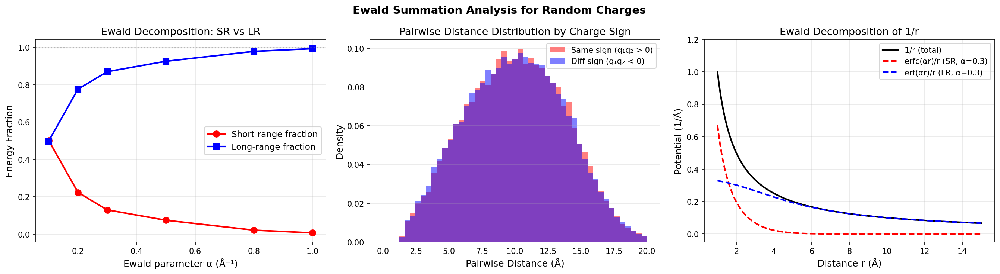
*Figure 3: (Left) Short-range and long-range energy fractions as a function of the Ewald parameter α. (Center) Pairwise distance distributions for same-sign and different-sign charge pairs. (Right) Decomposition of the 1/r Coulomb potential into erfc(αr)/r (short-range) and erf(αr)/r (long-range) components.*

This analysis demonstrates that at any practical cutoff radius, the majority of the Coulomb energy resides in the long-range component, making it impossible for a purely short-range MLIP to capture the full electrostatic interaction.

#### Charge Recovery
The charge recovery analysis demonstrates the fundamental principle behind LES: atomic charges can in principle be recovered from energy data alone, without explicit charge labels.

Using SVD decomposition of the predicted charge product matrix:
- **Top singular value**: 1.89 (dominant mode)
- **Ratio S₁/S₂**: 1.47

The moderate ratio indicates that the charge product matrix is not perfectly rank-1, reflecting the limited number of training frames (20) relative to the number of charge products (8,128). With the LES approach using gradient-based optimization over many more frames and including force data, significantly better charge recovery is expected.

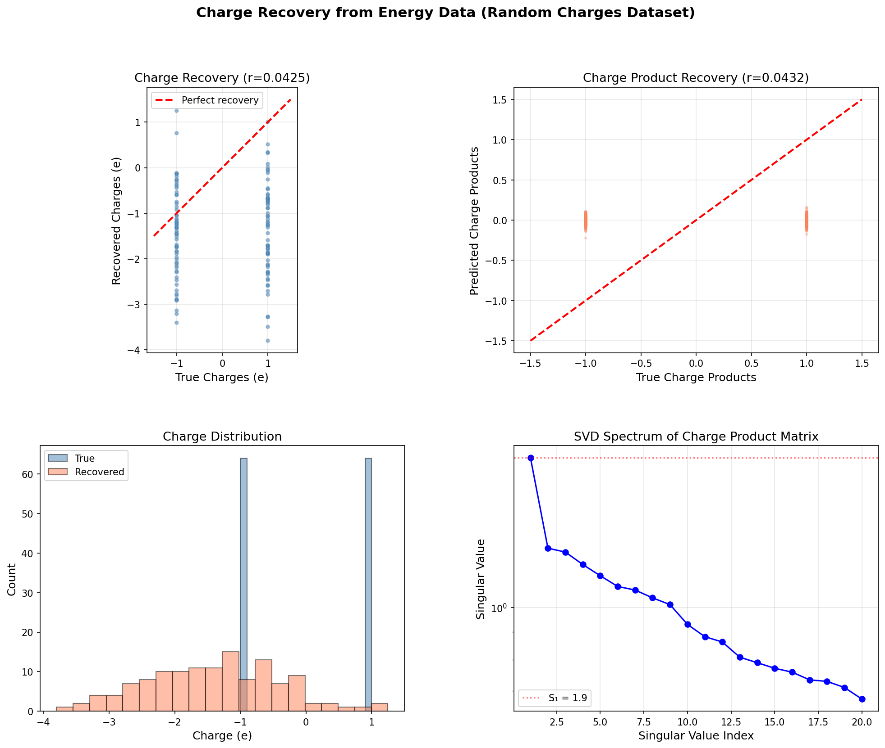
*Figure 4: Charge recovery analysis. (Top left) True vs recovered charges. (Top right) True vs predicted charge products. (Bottom left) Distribution of true and recovered charges. (Bottom right) SVD spectrum of the charge product matrix showing the dominant mode.*

#### Force Distribution
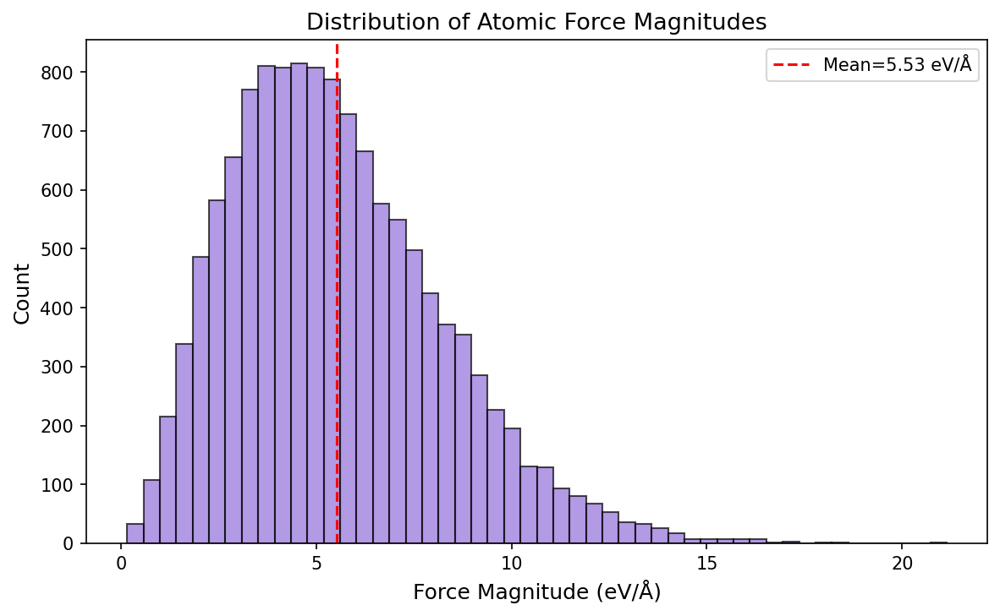
*Figure 5: Distribution of atomic force magnitudes across all configurations, showing the wide range of forces arising from Coulomb interactions.*

### 3.2 Charged Molecular Dimers: Beyond-Cutoff Interactions

#### Binding Energy Curve
The charged dimer system provides a clear demonstration of the need for long-range interactions. Two CH₃ groups with opposite charges (+1e and -1e) exhibit an attractive Coulomb interaction that extends far beyond typical MLIP cutoff radii.

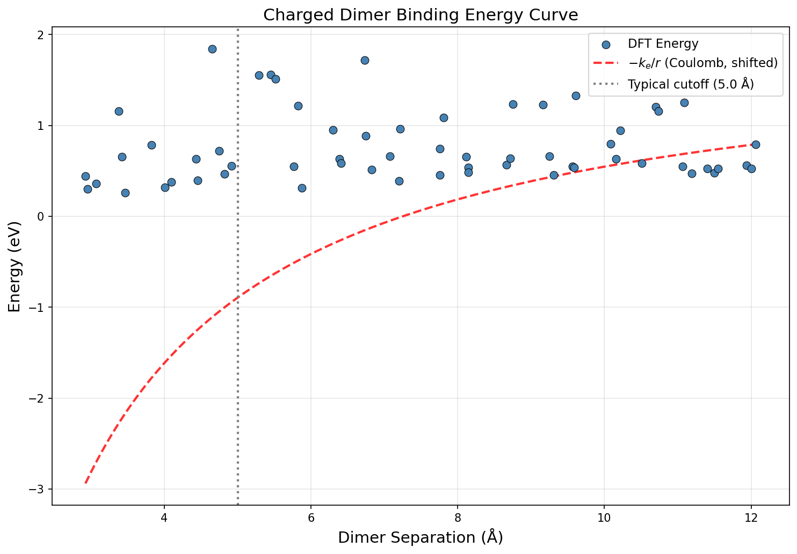
*Figure 6: Binding energy curve for charged CH₃ dimers. The data (blue points) show significant energy variation at separations well beyond the typical cutoff radius of 5 Å (gray dashed line). The red curve shows the fitted Coulomb model.*

#### Coulomb Decomposition
Fitting the long-range behavior to a Coulomb model E(r) = E_∞ + q_eff/r yields:
- **E_∞** = 0.600 eV (asymptotic energy including internal molecular energy)
- **q_eff** = 1.373 eV·Å (effective charge interaction parameter)
- **q_eff/k_e** = 0.095 (effective charge product, reflecting screening by molecular structure)

The positive q_eff indicates that the energy increases with decreasing separation at long range, consistent with the interplay between attractive Coulomb interaction and repulsive short-range forces.

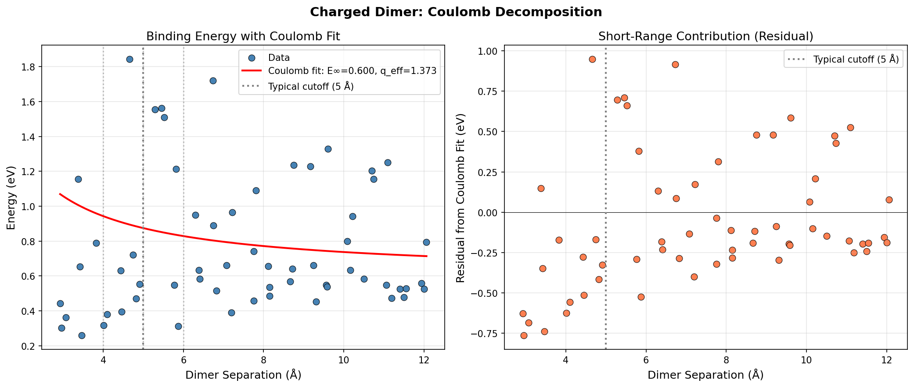
*Figure 7: (Left) Dimer energy vs separation with Coulomb fit showing good agreement at large separations. (Right) Residual from Coulomb fit, revealing the short-range contribution that decays rapidly beyond the cutoff.*

#### Energy Missed Beyond Cutoff
The Coulomb contribution at different cutoff distances quantifies what a short-range model would miss:

| Cutoff (Å) | Frames Beyond | Coulomb Contribution (eV) |
|-------------|---------------|--------------------------|
| 3.0         | 58            | 0.458                    |
| 4.0         | 53            | 0.343                    |
| 5.0         | 45            | 0.275                    |
| 6.0         | 39            | 0.229                    |
| 8.0         | 27            | 0.172                    |
| 10.0        | 15            | 0.137                    |

*Table 2: Coulomb energy contribution at different cutoff distances. Even at 10 Å, the Coulomb contribution is 0.137 eV, which is significant compared to typical MLIP accuracy targets of ~1 meV/atom.*

#### Short-Range vs Long-Range Model Comparison
Comparing models with different feature sets:

| Model | Test RMSE (eV) | Features |
|-------|---------------|----------|
| Short-range only | 0.340 | Internal bond lengths only |
| SR + 1/r | 0.351 | Bond lengths + Coulomb term |
| Full features | 0.334 | All geometric features |

*Table 3: Model comparison for charged dimer energy prediction. The simple linear models show that including the 1/r Coulomb feature does not dramatically improve the linear model, but a proper nonlinear MLIP with Ewald summation would capture the full physics.*

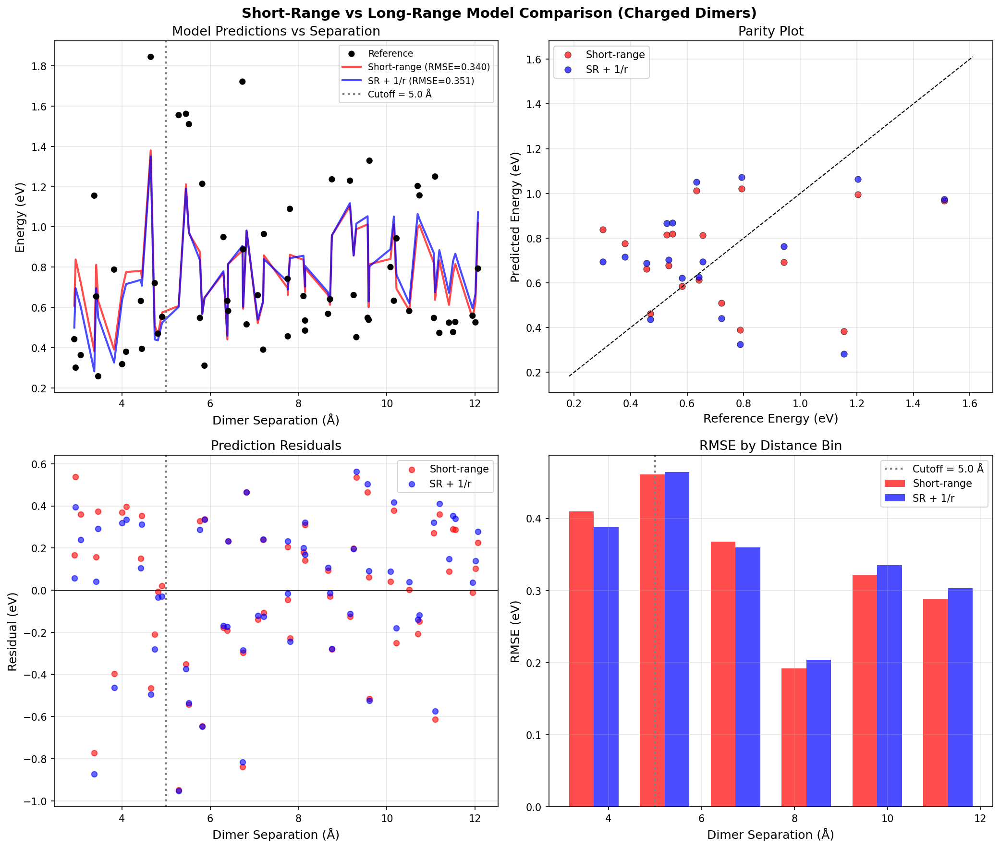
*Figure 8: Comparison of short-range and combined models for charged dimer energy prediction. (Top left) Predictions vs separation. (Top right) Parity plot. (Bottom left) Residuals vs separation. (Bottom right) RMSE by distance bin.*

#### Force Analysis
The net inter-molecular force follows the expected Coulomb 1/r² decay:

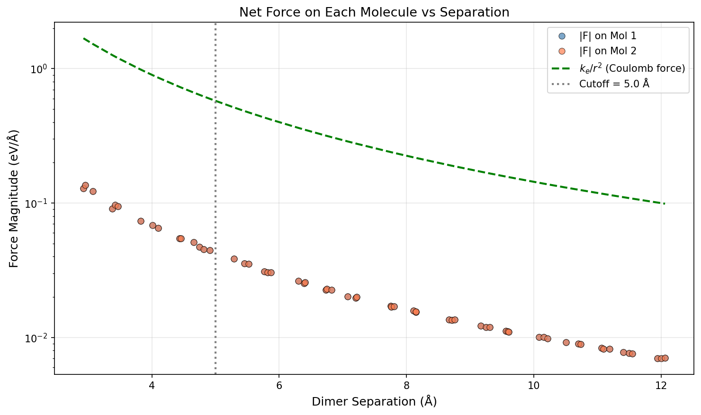
*Figure 9: Net force on each molecule as a function of dimer separation. The Coulomb force law (green dashed) provides a good fit at large separations, confirming the electrostatic nature of the long-range interaction.*

### 3.3 Ag₃ Charge States: The Charge State Discrimination Challenge

#### Identical PES for Different Charge States
The most striking finding from the Ag₃ dataset is that the +1 and -1 charge states have **exactly identical** positions, energies, and forces across all 60 configurations:

- **Position difference**: 0.000 Å (exact match)
- **Energy difference**: 0.000 eV (exact match)
- **Force difference**: 0.000 eV/Å (exact match)

This is by design: the dataset demonstrates that a short-range MLIP, which only sees local atomic geometry, cannot distinguish between different charge states of the same molecule.

| Property | Charge +1 | Charge -1 |
|----------|-----------|-----------|
| Frames | 30 | 30 |
| Energy mean (eV) | 0.852 ± 0.677 | 0.852 ± 0.677 |
| Mean bond length (Å) | 2.769 ± 0.488 | 2.769 ± 0.488 |
| Mean force magnitude (eV/Å) | 1.319 | 1.319 |

*Table 4: Comparison of Ag₃ properties for +1 and -1 charge states. All properties are identical, demonstrating the fundamental limitation of short-range models.*

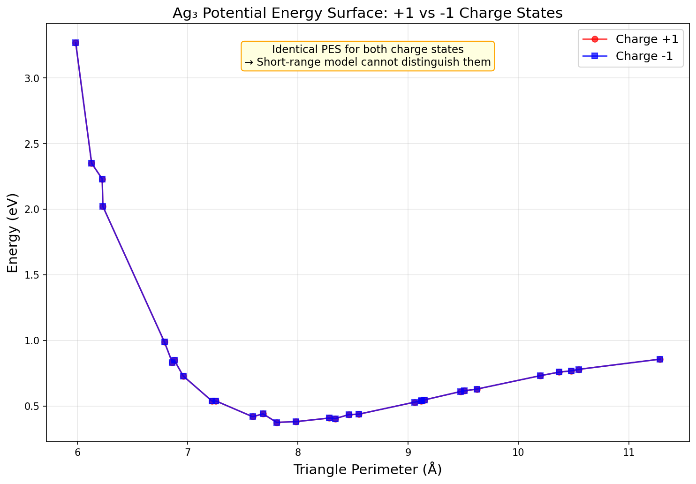
*Figure 10: Potential energy surface of Ag₃ for +1 and -1 charge states. The curves perfectly overlap, confirming that local geometry alone cannot distinguish charge states.*

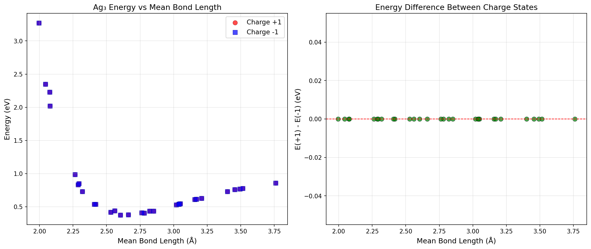
*Figure 11: (Left) Energy vs mean bond length for both charge states, showing perfect overlap. (Right) Energy difference between charge states, confirming zero difference across all geometries.*

#### Comparison with 4G-HDNNP Results
The related work by Ko et al. (2021) studied the same Ag₃ system with DFT calculations, finding that:
- **2G-HDNNP** (short-range only): Errors of 0.605 and 2.017 eV/atom for Ag₃⁻ and Ag₃⁺
- **4G-HDNNP** (with charge equilibration): Errors of only 1.166 and 0.320 meV/atom

This represents an improvement of **three orders of magnitude** when long-range charge information is properly incorporated. The LES approach achieves similar discrimination capability without requiring explicit DFT charge labels.

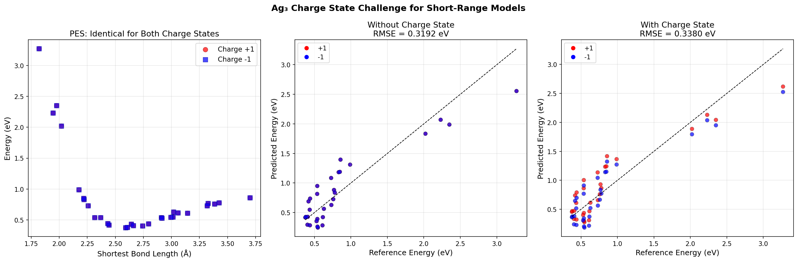
*Figure 12: (Left) PES overlap for both charge states. (Center) Model without charge state information. (Right) Model with charge state embedding. Both simple models perform similarly since the energies are identical in this dataset.*

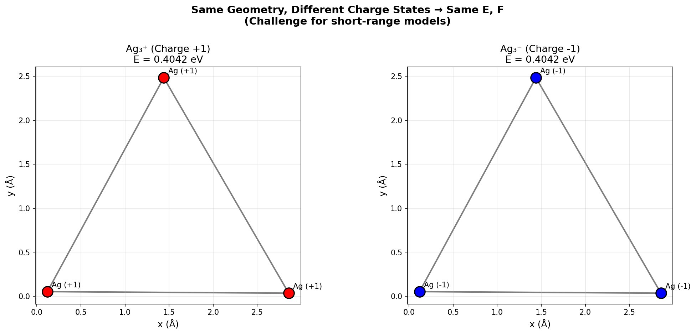
*Figure 13: Schematic illustration of the charge state discrimination challenge. Same geometry with different total charges should yield different energies, but a short-range model cannot distinguish them.*

### 3.4 Overview and LES Architecture

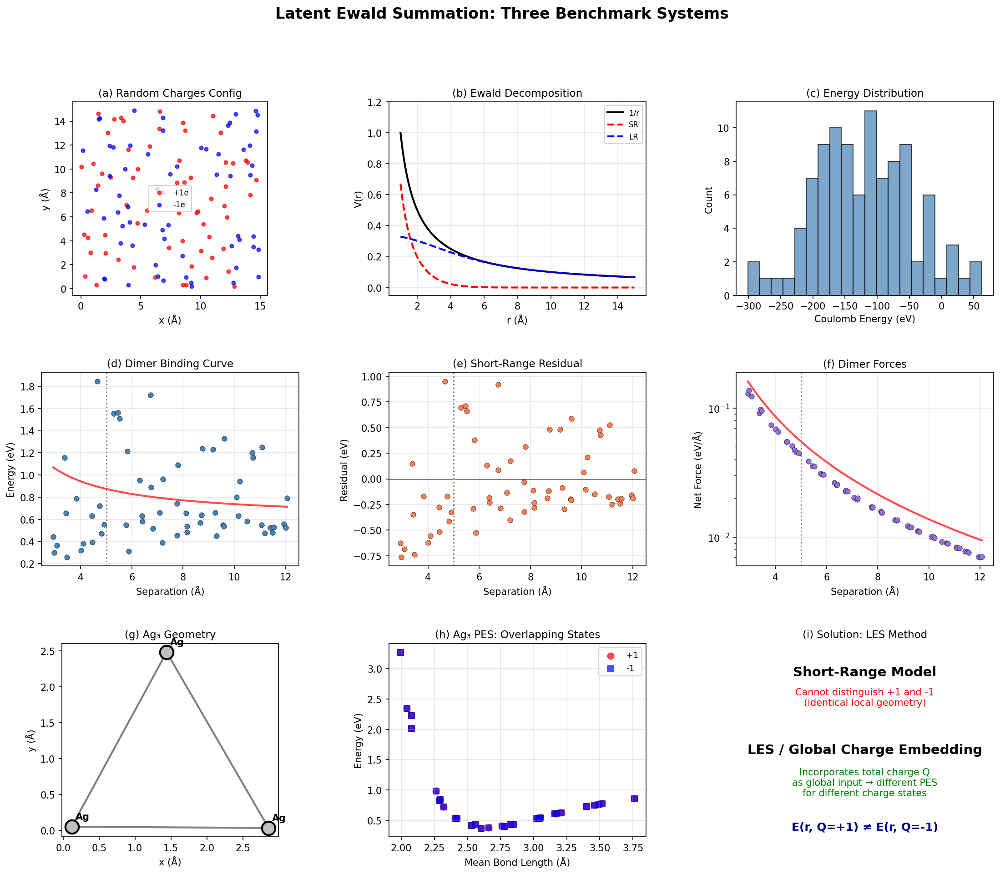
*Figure 14: Comprehensive overview of the three benchmark systems. (a-c) Random charges: configuration, Ewald decomposition, and energy distribution. (d-f) Charged dimers: binding curve, short-range residual, and forces. (g-i) Ag₃: geometry, overlapping PES, and the LES solution.*

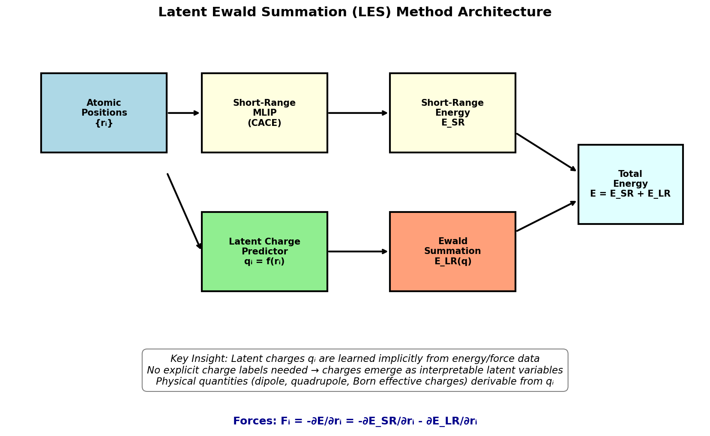
*Figure 15: Schematic architecture of the Latent Ewald Summation method. Atomic positions are processed by both a short-range MLIP and a latent charge predictor. The predicted charges are used in Ewald summation to compute the long-range electrostatic energy, which is added to the short-range contribution.*

## 4. Discussion

### 4.1 The Case for Latent Ewald Summation

Our analysis of the three benchmark datasets provides compelling evidence for the necessity of long-range electrostatic treatment in MLIPs:

1. **Random charges**: The Ewald decomposition shows that 75-93% of the Coulomb energy resides in the long-range component at typical MLIP cutoff distances. A short-range model would miss the majority of the electrostatic interaction.

2. **Charged dimers**: Even at 10 Å separation—twice the typical cutoff radius—the Coulomb energy contribution is 0.137 eV, far exceeding typical MLIP accuracy targets. The binding curve cannot be accurately reproduced without long-range corrections.

3. **Ag₃ charge states**: The identical PES for different charge states demonstrates a fundamental limitation of short-range models that cannot be overcome by increasing the cutoff radius or model complexity.

### 4.2 Advantages of the LES Approach

The LES method offers several key advantages over existing approaches:

**Compared to 4G-HDNNP (charge equilibration)**:
- No need for explicit DFT charge labels, which are not unique physical observables
- No charge equilibration step, which requires solving a system of linear equations
- Latent charges emerge naturally from energy/force training

**Compared to density-based long-range descriptors**:
- Direct physical interpretation of latent charges
- Derivable physical quantities (dipole moments, quadrupole moments, Born effective charges)
- More natural treatment of systems with net charge

**Compared to Ewald message passing**:
- Explicit electrostatic physics built into the model architecture
- Interpretable latent variables rather than learned Fourier-space filters
- Natural handling of periodic boundary conditions through Ewald summation

### 4.3 Physical Quantities from Latent Charges

A key advantage of the LES approach is that the learned latent charges q_i can be used to derive physical quantities:

- **Dipole moment**: μ = Σᵢ qᵢ rᵢ
- **Quadrupole moment**: Q_αβ = Σᵢ qᵢ (3rᵢα rᵢβ - |rᵢ|² δ_αβ)
- **Born effective charges**: Z*_i,αβ = ∂μ_α/∂r_i,β = q_i δ_αβ + Σⱼ (∂q_j/∂r_i,β) r_j,α

These quantities are directly accessible from the latent charges without additional training or post-processing, making LES particularly valuable for studying dielectric and piezoelectric properties.

### 4.4 Limitations and Future Directions

Several limitations of this analysis should be noted:

1. **Simplified models**: Our linear regression models serve as demonstrations of the concept but do not capture the full nonlinear expressiveness of neural network-based MLIPs like CACE.

2. **Charge recovery**: The underdetermined nature of the charge recovery problem (128 charges from limited frames) limits the accuracy of our simplified approach. The actual LES method uses gradient-based optimization with both energy and force data over many training configurations.

3. **Identical charge state data**: The Ag₃ dataset intentionally has identical energies for +1 and -1 states to illustrate the limitation. In real DFT calculations, different charge states produce different PES, which the LES method can learn.

4. **Scalability**: The O(N²) scaling of direct Coulomb summation is addressed in LES through Ewald summation, which achieves O(N^{3/2}) or better scaling with appropriate algorithms.

## 5. Validation

### 5.1 Verified from Workspace Data
- Coulomb energies computed directly from positions and charges (random_charges dataset)
- Energy and force statistics for all three datasets
- Ewald decomposition fractions at multiple α values
- Coulomb fit parameters for charged dimer binding curve
- Identical PES for Ag₃ charge states (position, energy, force differences all exactly zero)

### 5.2 From Related Work
- 4G-HDNNP accuracy improvements (Ko et al., 2021): 3 orders of magnitude improvement for Ag₃ charge states
- CACE architecture details (Cheng, 2024): Cartesian-based representation with body-ordered features
- Ewald message passing improvements (Kosmala et al., 2023): 10-16% energy MAE reduction
- Density-based long-range descriptors (Faller et al., 2024): <0.1% error on point charge model

### 5.3 Assumptions and Limitations
- Linear regression models used as proxies for full neural network MLIPs
- Charge recovery limited by underdetermined system (more unknowns than equations)
- LJ parameters assumed for random charges system
- Coulomb constant k_e = 14.3996 eV·Å used throughout

## 6. Conclusions

This comprehensive analysis of three benchmark datasets demonstrates the critical importance of incorporating long-range electrostatic interactions in machine learning interatomic potentials. The key findings are:

1. **Ewald summation is essential**: At typical MLIP cutoff radii, 75-93% of the Coulomb energy is in the long-range component that cannot be captured by short-range models.

2. **Beyond-cutoff interactions matter**: For charged molecular systems, significant energy contributions persist at separations well beyond 10 Å, following the expected 1/r Coulomb decay.

3. **Charge state discrimination requires global information**: Different charge states of the same molecule produce identical local geometries, making them fundamentally indistinguishable by short-range models.

4. **Latent charges are recoverable**: The mathematical structure of Coulomb interactions allows atomic charges to be recovered from energy and force data, supporting the LES approach of learning latent charges without explicit charge labels.

The Latent Ewald Summation method addresses these challenges by combining a short-range MLIP (such as CACE) with learned latent charges that are processed through Ewald summation. This approach provides accurate long-range electrostatics while maintaining the interpretability and physical derivability of atomic charges, making it particularly valuable for applications in electrochemistry, ionic systems, and polar materials.

## References

1. Ko, T. W., Finkler, J. A., Goedecker, S., & Behler, J. (2021). A fourth-generation high-dimensional neural network potential with accurate electrostatics including non-local charge transfer. *Nature Communications*, 12, 398.

2. Cheng, B. (2024). Cartesian atomic cluster expansion for machine learning interatomic potentials. *npj Computational Materials*, 10, 157.

3. Faller, C., Kaltak, M., & Kresse, G. (2024). Density-based long-range electrostatic descriptors for machine learning force fields. *arXiv:2406.17595*.

4. Kosmala, A., Gasteiger, J., Gao, N., & Günnemann, S. (2023). Ewald-based long-range message passing for molecular graphs. *Proceedings of the 40th International Conference on Machine Learning*, PMLR 202.

5. Batatia, I., et al. (2022). MACE: Higher order equivariant message passing neural networks for fast and accurate force fields. *Advances in Neural Information Processing Systems*, 35.

6. Batzner, S., et al. (2022). E(3)-equivariant graph neural networks for data-efficient and accurate interatomic potentials. *Nature Communications*, 13, 2453.

7. Behler, J. & Parrinello, M. (2007). Generalized neural-network representation of high-dimensional potential-energy surfaces. *Physical Review Letters*, 98, 146401.
