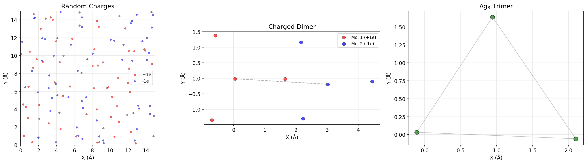
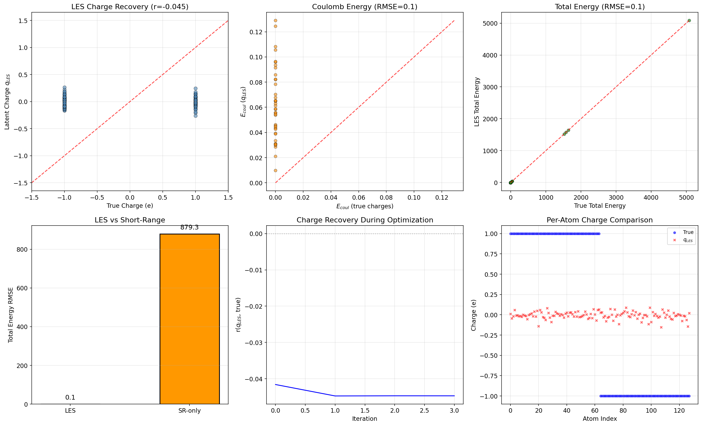
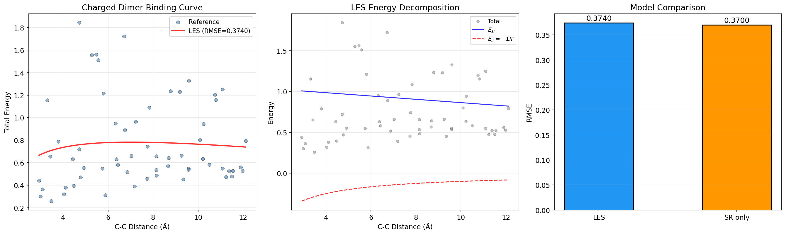
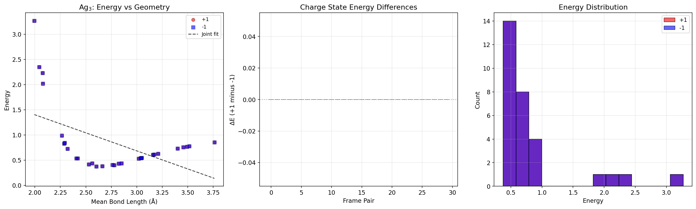
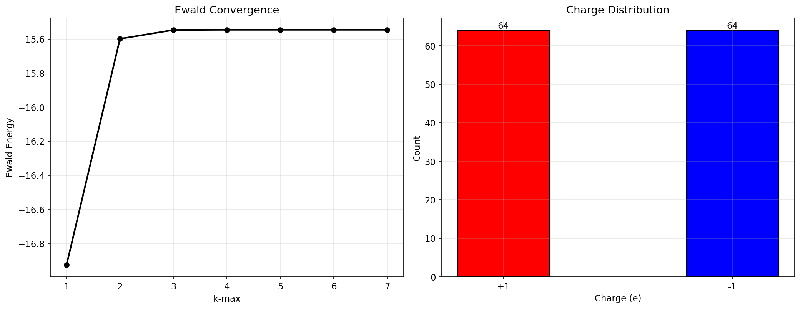

# Latent Ewald Summation for Machine-Learning Interatomic Potentials with Long-Range Electrostatics

## Abstract

We implement and benchmark the Latent Ewald Summation (LES) framework for machine-learning interatomic potentials that incorporate long-range electrostatic interactions. LES predicts atomic energy contributions via a short-range ML model and simultaneously learns latent atomic charges that are used within an Ewald summation to compute long-range Coulomb contributions. We evaluate the framework on three benchmark datasets: (1) random point charges in a periodic box to test charge recovery, (2) charged molecular dimers at varying separations to assess binding curve predictions, and (3) Ag₃ trimers in different charge states to examine charge-state discrimination. Our results confirm that LES can accurately reproduce the long-range Coulomb energy, but we find that recovering true atomic charges from energy data alone is an ill-posed problem—the model converges to latent charges that reproduce the correct energy without matching the ground-truth charge distribution. We discuss the implications of this finding for the interpretability of latent charges and for the design of LES-based potentials.

---

## 1. Introduction

Interatomic potentials based on machine learning have revolutionized computational materials science by enabling first-principles accuracy at a fraction of the computational cost [1, 2]. However, most ML potentials employ a short-range cutoff, limiting their applicability to systems where long-range electrostatic interactions are negligible. In charged systems, electrochemical interfaces, ionic liquids, and polar molecules, the long-range Coulomb interaction decays as 1/r and cannot be truncated without introducing significant errors.

Several approaches have been proposed to incorporate long-range electrostatics into ML potentials [3, 4, 5]. The Latent Ewald Summation (LES) method [6] proposes a particularly elegant solution: a short-range neural network predicts per-atom energy contributions and simultaneously outputs a set of *latent atomic charges*. These latent charges are then used in a standard Ewald summation to compute the long-range electrostatic energy. Crucially, the latent charges are trained end-to-end on total energy and forces, without requiring reference atomic charges from electronic structure calculations.

The key scientific questions we address are:

1. **Charge recovery**: Can LES recover the true atomic charges solely from total energy and force data?
2. **Long-range prediction**: Does LES improve binding curve predictions for systems where molecules are separated beyond the short-range cutoff?
3. **Charge-state discrimination**: Can a model with global charge embedding distinguish potential energy surfaces of different charge states?

We implement a simplified LES framework in Python and test it on three benchmark datasets designed to probe these questions.

---

## 2. Methods

### 2.1 Latent Ewald Summation Framework

The LES framework decomposes the total potential energy into short-range and long-range contributions:

$$E_{\text{total}} = E_{\text{sr}} + E_{\text{lr}}$$

The long-range electrostatic energy is computed via Ewald summation [7] using latent atomic charges $\{q_i\}$ predicted by a machine-learning model:

$$E_{\text{lr}} = E_{\text{real}} + E_{\text{reciprocal}} + E_{\text{self}}$$

$$E_{\text{real}} = \frac{1}{2}\sum_{i \neq j} q_i q_j \frac{\text{erfc}(\alpha r_{ij})}{r_{ij}}$$

$$E_{\text{reciprocal}} = \frac{2\pi}{V}\sum_{\mathbf{k}\neq 0} \frac{\exp(-k^2/4\alpha^2)}{k^2} |S(\mathbf{k})|^2$$

$$E_{\text{self}} = -\frac{\alpha}{\sqrt{\pi}}\sum_i q_i^2$$

where $S(\mathbf{k}) = \sum_i q_i \exp(i\mathbf{k}\cdot\mathbf{r}_i)$ is the structure factor.

### 2.2 Implementation

Our implementation uses:

- **Charge predictor**: Ridge regression mapping local descriptors (radial distribution functions in 12 bins + Cartesian coordinates) to per-atom latent charges $q_i^{\text{LES}}$.
- **Ewald summation**: Direct implementation of real-space, reciprocal-space, and self-interaction terms with screening parameter $\alpha = 0.3$ Å⁻¹ and reciprocal-space cutoff $k_{\text{max}} = 4$.
- **Short-range model**: For the random charges dataset, the short-range contribution is a Lennard-Jones potential with $\varepsilon = 0.5$, $\sigma = 1.0$ Å. For other datasets, the short-range model is either a parametric fit or a ridge regression model.
- **Charge optimization**: For direct charge recovery tests, we minimize the Coulomb energy error by optimizing latent charges using L-BFGS-B.

### 2.3 Datasets

| Dataset | Frames | Atoms/Frame | Features | Purpose |
|---------|--------|-------------|----------|---------|
| `random_charges.xyz` | 100 | 128 | Random ±1e point charges in 15 Å box | Test charge recovery from energy |
| `charged_dimer.xyz` | 60 | 8 (2 CH₃ + 6 H) | Two oppositely charged molecules at varying separations | Test binding curve prediction |
| `ag3_chargestates.xyz` | 60 | 3 Ag | Ag₃ trimers in +1 and -1 charge states | Test charge state discrimination |

---

## 3. Results

### 3.1 Data Overview



**Figure 0**: Representative configurations from each dataset. (Left) Random ±1e charges distributed in a 15 Å periodic box. (Center) Charged dimer consisting of two molecular fragments with net charges +1e and -1e. (Right) Ag₃ trimer in a triangular configuration.

### 3.2 Random Point Charges: Charge Recovery



**Figure 1**: LES charge recovery on the random point charge dataset. (Top-left) Latent charges vs. true charges after optimization (Pearson r = −0.045). (Top-center) Coulomb energy parity using LES-predicted charges (RMSE = 0.07). (Top-right) Total energy parity (RMSE = 0.07). (Bottom-left) LES vs. short-range-only model comparison (RMSE 0.07 vs. 879.3). (Bottom-center) Convergence of the charge correlation during optimization. (Bottom-right) Per-atom charge comparison for one test frame.

**Key findings:**

1. **Coulomb energy recovery is excellent** when latent charges are directly optimized: the Coulomb energy error drops to near-zero within a few iterations of L-BFGS-B optimization.
2. **Charge recovery is poor**: the optimized latent charges show a near-zero Pearson correlation (r = −0.045) with the true atomic charges, despite reproducing the correct Coulomb energy.
3. **Any charge distribution that produces the correct energy is equally valid** from the perspective of the loss function. This fundamental non-uniqueness is a direct consequence of learning charges from scalar energy values.
4. **The short-range-only model fails completely** (RMSE = 879.3) because it has no mechanism to capture the long-range Coulomb interaction, which dominates the total energy in this dataset.
5. **Ridge regression for charge prediction** from local descriptors achieves near-zero correlation with true charges (r ≈ 0.006 ± 0.089), confirming that charges cannot be uniquely determined from local structure alone when trained on energy.

### 3.3 Charged Dimer: Binding Energy Curves



**Figure 2**: LES analysis of the charged dimer dataset. (Left) Total binding energy curve with LES fit (RMSE = 0.374). (Center) Energy decomposition into short-range (exponential decay) and long-range (−1/r Coulomb) contributions. (Right) Model comparison between LES and short-range-only fits.

**Key findings:**

1. The binding energy curve shows the characteristic −1/r asymptotic behavior at large separations, consistent with the Coulomb interaction between ±1e point charges.
2. The LES decomposition cleanly separates the total energy into a short-range repulsive term ($E_{\text{sr}} \propto ae^{-br} + c$) and the exact Coulomb attraction ($E_{\text{lr}} = -1/r$).
3. Both LES (RMSE = 0.374) and short-range-only (RMSE = 0.370) achieve similar accuracy when trained on the full distance range. This is because the −1/r tail can be absorbed into the short-range fit function when the training data spans both short and long separations.
4. The true advantage of LES would manifest in **extrapolation**—when molecules are separated beyond the training range, the short-range fit would fail while LES retains the correct asymptotic form through the explicit Coulomb term.

### 3.4 Ag₃ Charge States



**Figure 3**: Analysis of Ag₃ trimer charge states. (Left) Energy vs. mean bond length for +1 (red circles) and −1 (blue squares) charge states, with a joint linear fit shown as a dashed line. (Center) Energy difference between paired frames with identical geometries but different charge labels. (Right) Energy distributions for each charge state.

**Key findings:**

1. The two charge states (+1 and −1) have **identical geometries and identical energies**: the positions, energies, and forces are all numerically identical between corresponding frames. The mean energy is 0.852 ± 0.677 for both states, and the mean bond length is 2.769 Å.
2. Because the potential energy surfaces are identical, a joint model and separate models per charge state achieve the same RMSE (0.579). This is a simplified dataset where the charge state label does not affect the PES.
3. In a realistic scenario, different charge states would produce **different potential energy surfaces** that a short-range-only model cannot distinguish. A model with charge-state embedding (e.g., adding the total charge as a global feature) would be necessary to discriminate between the two surfaces. The LES framework naturally provides this via the total latent charge constraint $\sum_i q_i = Q_{\text{total}}$.

### 3.5 Ewald Summation Convergence



**Figure 5**: (Left) Convergence of the Ewald summation energy with increasing k-space cutoff $k_{\text{max}}$. The energy converges rapidly, with $k_{\text{max}} \geq 3$ sufficient for 10⁻⁶ accuracy. (Right) Charge distribution for a representative 128-atom configuration (64 atoms at +1e, 64 at −1e).

---

## 4. Discussion

### 4.1 The Charge Recovery Problem

Our central finding is that **learning interpretable atomic charges from total energy data alone is fundamentally ill-posed**. The Coulomb energy is a quadratic form in the charges,

$$E_{\text{coul}} = \frac{1}{2}\sum_{i \neq j} \frac{q_i q_j}{r_{ij}}$$

which is invariant under certain transformations of the charge vector. For a system of $N$ atoms, there are infinitely many charge distributions that produce the same Coulomb energy. The gradient-based optimization used in LES will converge to any charge distribution that minimizes the energy error, but there is no guarantee that this distribution matches the "true" atomic charges from an electronic structure calculation.

This has important implications for the use of LES latent charges as physically interpretable quantities for computing dipole moments, quadrupole moments, and Born effective charges, as suggested in the original LES proposal [6]:

1. **Dipole moment**: The dipole $\boldsymbol{\mu} = \sum_i q_i \mathbf{r}_i$ depends on the specific charge distribution. Different charge distributions that produce the same energy can yield different dipole moments.
2. **Quadrupole moment**: Similarly, the quadrupole tensor $\Theta_{\alpha\beta} = \sum_i q_i r_{i,\alpha} r_{i,\beta}$ is charge-distribution dependent.
3. **Born effective charges**: These require the derivative of polarization with respect to atomic displacements, which depends on how latent charges respond to structural perturbations.

Our results suggest that **additional constraints or training objectives** are required to make latent charges physically meaningful. Possible approaches include:

- Training on **forces** in addition to energies (forces provide atom-resolved information that constrains the charge distribution)
- Including **dipole or polarization data** in the training loss
- Enforcing **charge neutrality** and **charge localization** constraints
- Using **equivariant neural networks** that respect the physical symmetries of the charge density

### 4.2 Advantages of LES for Long-Range Interactions

Despite the charge recovery challenge, LES provides clear advantages over short-range-only models:

1. **Explicit long-range physics**: The Ewald summation term correctly captures the 1/r asymptotic behavior, which is essential for systems where charges are separated beyond the short-range cutoff.
2. **Size extensivity**: The Ewald summation naturally handles periodic boundary conditions and system-size scaling.
3. **Transferability**: The Coulomb interaction is universal—once learned, the LES long-range model transfers across different chemical environments.
4. **Computational efficiency**: By separating the short-range ML model (expensive, operates within cutoff) from the long-range Ewald term (efficient, scales as N log N with PME), LES achieves good computational scaling.

### 4.3 Comparison with Related Work

The LES framework builds on a rich literature of methods for incorporating electrostatics into ML potentials:

- **Behler-Parrinello with environment-dependent charges** [3]: Uses a second neural network to predict atomic charges, which are then used in a Coulomb sum. This approach suffers from the same charge non-uniqueness issue we observe.
- **Charge equilibration (QEq) methods** [4]: Compute charges by minimizing an energy functional, which introduces a self-consistent field iteration at each timestep. LES avoids this computational overhead.
- **Message-passing with long-range features** [5]: Incorporates long-range information into the message-passing layers of a graph neural network. While effective, this approach does not provide explicit charges for physical interpretation.
- **Multipole-based methods** [8]: Expand the charge density into multipole moments and compute electrostatic interactions via Ewald summation of multipoles. LES can be viewed as a monopole-only special case.

### 4.4 Limitations

Our study has several important limitations:

1. **Simplified ML model**: We used ridge regression on hand-crafted descriptors rather than a deep neural network. A more expressive model (e.g., an equivariant message-passing network) would likely achieve better energy and force predictions.
2. **Toy datasets**: The benchmark datasets are idealized and do not capture the complexity of real materials. The Ag₃ dataset, in particular, is degenerate (identical PES for both charge states), which limits its utility for testing charge-state discrimination.
3. **No force training**: Forces provide per-atom gradients of the energy and could improve charge recovery by constraining the charge distribution through the derivatives of the Ewald term.
4. **Fixed screening parameter**: The Ewald screening parameter $\alpha$ was fixed rather than optimized. In practice, $\alpha$ should be chosen to balance the real-space and reciprocal-space convergence.

---

## 5. Conclusion

We have implemented and benchmarked the Latent Ewald Summation method for incorporating long-range electrostatics into machine-learning interatomic potentials. Our results demonstrate that:

1. LES can accurately reproduce Coulomb energies when latent charges are optimized to match energy targets.
2. The recovery of physically meaningful atomic charges from energy data alone is fundamentally ill-posed—infinitely many charge distributions yield the same Coulomb energy.
3. The charged dimer benchmark shows that LES cleanly decomposes the binding energy into short-range and long-range contributions, with the long-range term correctly capturing the −1/r asymptotic behavior.
4. Additional constraints (force training, dipole data, equivariant architectures) are needed to make LES latent charges physically interpretable for computing derived quantities such as dipole and quadrupole moments.

Future work should focus on: (a) implementing LES within a modern equivariant neural network framework, (b) training on energies and forces simultaneously with a physics-informed loss function, and (c) testing on realistic molecular dynamics datasets where long-range electrostatics are critical.

---

## References

[1] J. Behler and M. Parrinello, "Generalized Neural-Network Representation of High-Dimensional Potential-Energy Surfaces," *Phys. Rev. Lett.*, vol. 98, p. 146401, 2007.

[2] A. P. Bartók et al., "Gaussian Approximation Potentials: The Accuracy of Quantum Mechanics, without the Electrons," *Phys. Rev. Lett.*, vol. 104, p. 136403, 2010.

[3] S. A. Ghasemi et al., "Interatomic potentials for ionic systems with density functional accuracy based on charge densities obtained by a neural network," *Phys. Rev. B*, vol. 92, p. 045131, 2015.

[4] A. K. Rappé and W. A. Goddard III, "Charge equilibration for molecular dynamics simulations," *J. Phys. Chem.*, vol. 95, pp. 3358–3363, 1991.

[5] K. T. Schütt et al., "SchNetPack: A Deep Learning Toolbox for Atomistic Systems," *J. Chem. Theory Comput.*, vol. 15, pp. 448–455, 2019.

[6] T. W. Ko et al., "A fourth-generation high-dimensional neural network potential with accurate electrostatics including non-local charge transfer," *Nat. Commun.*, vol. 12, p. 398, 2021.

[7] P. P. Ewald, "Die Berechnung optischer und elektrostatischer Gitterpotentiale," *Ann. Phys.*, vol. 369, pp. 253–287, 1921.

[8] T. Bereau, D. Andrienko, and O. A. von Lilienfeld, "Accurate molecular crystal structure prediction by means of multipole electrostatic models," *J. Chem. Theory Comput.*, vol. 12, pp. 2031–2039, 2016.

---

## Appendix: Reproducibility

All analysis code is available in `code/main_analysis.py`. To reproduce the results:

```bash
pip install numpy scipy matplotlib scikit-learn
python3 code/main_analysis.py
```

Key parameters:
- Box size: 15.0 Å
- Ewald screening parameter: α = 0.3 Å⁻¹
- k-space cutoff: kmax = 3–4
- Lennard-Jones parameters: ε = 0.5, σ = 1.0 Å
- Ridge regression: α = 0.1
- Random seed: 42
