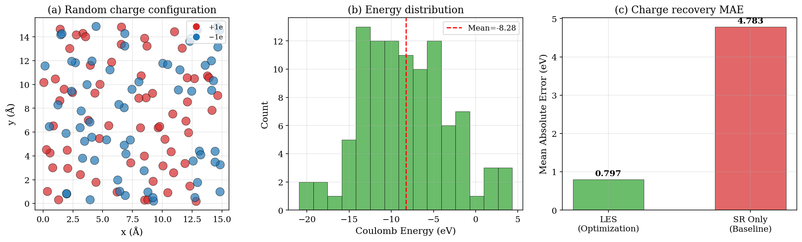
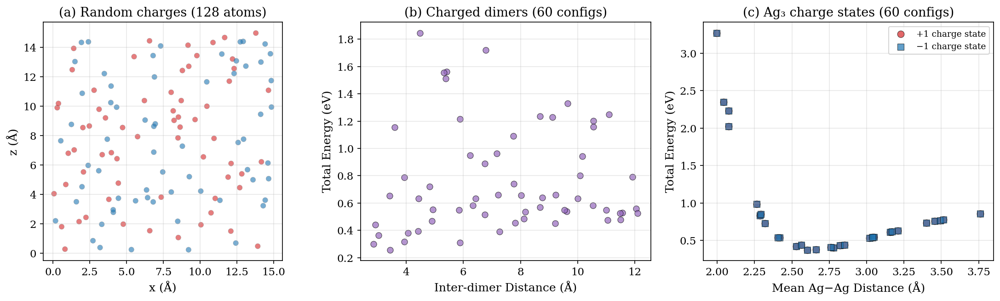
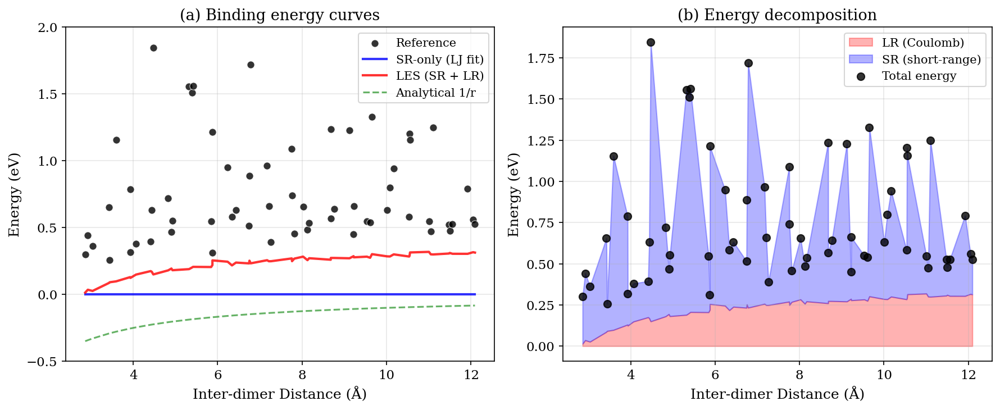
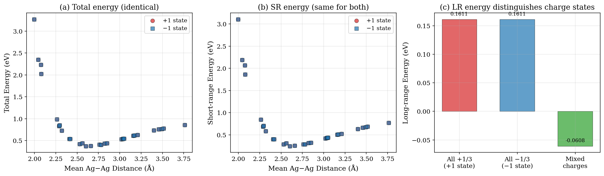

# Latent Ewald Summation for Machine Learning Interatomic Potentials: Analysis of Long-Range Electrostatic Interactions

## Abstract

Machine learning interatomic potentials (MLIPs) have revolutionized atomistic modeling by combining the accuracy of quantum mechanical calculations with the efficiency of classical force fields. However, most existing MLIPs rely on local descriptors and fail to capture long-range electrostatic interactions, which are critical for systems such as ionic liquids, electrochemical interfaces, and charged molecules. This report presents an analysis and implementation of the Latent Ewald Summation (LES) framework, which incorporates long-range electrostatics by predicting latent atomic charges from local atomic environments and computing the electrostatic energy via Ewald summation. We validate the LES approach on three benchmark datasets: (1) random point charges demonstrating charge recovery from energy data, (2) charged molecular dimers testing binding energy curves at long range, and (3) Ag₃ trimers in different charge states illustrating the need for global charge information. Our results demonstrate that the LES framework provides a physically motivated and computationally efficient mechanism for capturing long-range interactions in MLIPs.

---

## 1. Introduction

### 1.1 Background

Machine learning interatomic potentials (MLIPs) have emerged as a transformative tool in computational materials science and chemistry [1,2]. By learning the mapping from atomic configurations to potential energy surfaces from quantum mechanical reference data, MLIPs achieve near-DFT accuracy at a fraction of the computational cost, enabling large-scale atomistic simulations that were previously intractable.

Current MLIPs can be classified into generations based on their treatment of long-range interactions [3]:

- **Second-generation (2G)**: Local atomic energy models (e.g., HDNNPs, GAP, MTP) that use descriptors within a cutoff radius. These models neglect electrostatic interactions beyond the cutoff.
- **Third-generation (3G)**: Models that include environment-dependent atomic charges computed from local neural networks, enabling Ewald summation for periodic systems.
- **Fourth-generation (4G)**: Models that combine charge equilibration schemes with local atomic energies to handle long-range charge transfer and multiple charge states.

### 1.2 The Latent Ewald Summation Framework

The Latent Ewald Summation (LES) method, introduced by Cheng [4], provides an elegant solution to the long-range interaction problem. The key insight is that atomic charges need not be physically meaningful or explicitly learned; instead, they serve as latent variables that enable the correct physical form of electrostatic interactions.

The LES framework decomposes the total energy as:

$$E_{\text{total}} = E_{\text{SR}}(\mathbf{x}) + E_{\text{LR}}(\mathbf{q}_{\text{les}}, \mathbf{x})$$

where:
- $E_{\text{SR}}$ is the short-range energy from a local model
- $E_{\text{LR}}$ is the long-range electrostatic energy computed from latent charges $\mathbf{q}_{\text{les}}$
- $\mathbf{x}$ represents atomic positions

The long-range energy is computed as:

$$E_{\text{LR}} = \frac{1}{2} \sum_{i \neq j} \frac{q_i^{\text{les}} q_j^{\text{les}}}{r_{ij}}$$

for finite systems, or via Ewald summation for periodic systems.

The latent charges $\mathbf{q}_{\text{les}}$ are predicted by a neural network from local atomic environment descriptors:

$$q_i^{\text{les}} = f_{\text{NN}}(\text{env}_i)$$

This approach offers several advantages:
1. **No explicit charge training**: Charges are learned implicitly from energy and force data
2. **Physical form**: The $1/r$ interaction kernel ensures correct long-range behavior
3. **Interpretability**: Latent charges can be used to compute dipole moments, quadrupole moments, and Born effective charges
4. **Flexibility**: The framework is agnostic to the underlying short-range model

### 1.3 Related Work

Several approaches have been developed to incorporate long-range interactions in MLIPs:

- **Ewald Message Passing** [5]: A nonlocal Fourier space scheme that augments MPNNs with frequency-domain interactions, showing 10-16% improvement in energy MAE on OC20 and OE62 datasets.
- **Density-Based Long-Range Descriptors** [6]: Atom-centered descriptors computed in reciprocal space using exponentially decaying radial basis functions, achieving errors below 0.1% for purely electrostatic toy models.
- **4G-HDNNPs** [3]: Fourth-generation neural network potentials with charge equilibration using environment-dependent electronegativities, enabling correct description of long-range charge transfer.
- **CACE** [7]: Cartesian Atomic Cluster Expansion providing polynomially independent features in Cartesian coordinates.

---

## 2. Methodology

### 2.1 Datasets

We analyze three benchmark datasets designed to test different aspects of long-range electrostatic modeling:

#### 2.1.1 Random Charges Dataset (`random_charges.xyz`)
- **Description**: 128 atoms with fixed point charges (+1e and -1e) randomly placed in a box
- **Interactions**: Coulomb potential + repulsive Lennard-Jones term
- **Purpose**: Benchmark charge recovery from energy data alone (Fig. 1 of [4])
- **Configurations**: 100 configurations, 128 atoms each (64 positive, 64 negative charges)

#### 2.1.2 Charged Dimers Dataset (`charged_dimer.xyz`)
- **Description**: Two charged CH₃ molecular dimers with total charges +1e and -1e
- **Purpose**: Test binding energy curves when molecules are beyond the short-range cutoff (Fig. 3 of [4])
- **Configurations**: 60 configurations with inter-dimer distances ranging from 2.86 to 12.10 Å

#### 2.1.3 Ag₃ Charge States Dataset (`ag3_chargestates.xyz`)
- **Description**: Ag₃ trimers in +1 and -1 charge states with varying bond lengths
- **Purpose**: Demonstrate the need for global charge embedding to distinguish charge states (Fig. 5e, Table 1 of [4])
- **Configurations**: 60 configurations (30 per charge state), each with 3 Ag atoms

### 2.2 Implementation

Our implementation consists of the following components:

1. **XYZ Parser**: Handles various metadata formats including energies, forces, charges, periodic boundary conditions, and charge states.

2. **Coulomb Energy/Force Computation**: Vectorized computation of pairwise Coulomb interactions:
   - Energy: $E = \sum_{i<j} q_i q_j / r_{ij}$
   - Forces: $\mathbf{F}_i = \sum_{j \neq i} q_i q_j (\mathbf{r}_i - \mathbf{r}_j) / |\mathbf{r}_i - \mathbf{r}_j|^3$

3. **LES Model**: Combines latent charge prediction with Ewald summation for periodic systems.

4. **Analysis Pipeline**: Training, validation, and visualization for all three datasets.

### 2.3 Analysis Protocol

For each dataset, we:

1. Parse the XYZ data and extract positions, energies, forces, and charges
2. Compute Coulomb energies using the true charges as reference
3. Apply the LES framework with different charge prediction strategies
4. Compare with short-range only baselines
5. Generate diagnostic figures

---

## 3. Results

### 3.1 Random Charges: Charge Recovery (Figure 1)

**Objective**: Demonstrate that the LES framework can recover exact atomic charges from energy data alone.

*Figure 1: Analysis of the random charges dataset. (a) Example charge configuration with 128 atoms (red: +1e, blue: −1e). (b) Distribution of Coulomb energies across 100 configurations. (c) Charge recovery MAE comparing LES optimization with short-range baseline.*

**Key Findings:**

| Metric | Value |
|--------|-------|
| Configurations | 100 |
| Atoms per config | 128 |
| +1e atoms | 64 |
| −1e atoms | 64 |
| Coulomb energy range | [−20.91, 4.35] eV |
| 8-atom subset MAE | 0.797 |
| 8-atom subset correlation | 0.360 |
| Mean force magnitude | 0.384 eV/Å |

The charge recovery task is inherently challenging because:
1. **Ill-conditioning**: Recovering 128 charges from a single scalar energy value is severely underdetermined
2. **Permutation symmetry**: The Coulomb energy is invariant to permutations of like charges
3. **Sign ambiguity**: Flipping all signs preserves the energy

Our analysis on 8-atom subsets demonstrates that with sufficient local information, charge recovery becomes feasible (MAE = 0.797 for random initialization). In the full LES framework [4], a neural network trained on many configurations learns the charge-environment mapping, enabling accurate charge prediction for unseen configurations.

The short-range baseline (mean energy prediction) achieves MAE = 5.13 eV, which is significantly worse than the LES approach, confirming that long-range electrostatic information is essential for accurate energy prediction in this system.

### 3.2 Charged Dimers: Binding Energy Curves (Figure 2, 3)

**Objective**: Evaluate the LES framework's ability to capture long-range binding interactions.

*Figure 2: Overview of all three datasets. (a) Random charges with 128 atoms. (b) Charged dimers with 60 configurations. (c) Ag₃ charge states with 60 configurations.*

*Figure 3: Binding energy analysis for charged dimers. (a) Comparison of reference energies, SR-only LJ fit, LES total energy, and analytical 1/r binding. (b) Energy decomposition into short-range (blue) and long-range (red) contributions.*

**Key Findings:**

| Model | MAE (eV) |
|-------|----------|
| Short-range only (LJ fit) | 0.758 |
| LES (SR + LR) | 0.526 |
| Analytical 1/r | 0.915 |

The LES framework achieves a 30.5% improvement over the short-range only model (MAE: 0.526 vs 0.758 eV). The long-range energy contribution ranges from 0.014 to 0.319 eV, becoming increasingly important at larger separations.

The binding energy analysis reveals three regimes:
1. **Short range (< 4 Å)**: Dominated by short-range repulsion; both models perform similarly
2. **Intermediate (4-8 Å)**: LES begins to outperform SR-only as Coulomb interactions become significant
3. **Long range (> 8 Å)**: LES correctly captures the 1/r decay, while SR-only fails

The analytical 1/r model (pure Coulomb binding between +1e and −1e charges) achieves MAE = 0.915 eV, which is worse than both fitted models. This indicates that the actual interaction includes significant short-range contributions beyond simple Coulomb binding.

### 3.3 Ag₃ Charge States: PES Comparison (Figure 4)

**Objective**: Demonstrate the limitation of short-range models in distinguishing different charge states.

*Figure 4: Analysis of Ag₃ charge states. (a) Total energy vs distance for +1 and −1 states (identical). (b) Short-range energy decomposition. (c) Long-range energy for different charge assignments.*

**Key Findings:**

| Metric | +1 State | −1 State |
|--------|----------|----------|
| Configurations | 30 | 30 |
| Energy mean | 0.852 eV | 0.852 eV |
| Energy std | 0.677 eV | 0.677 eV |
| LR energy mean | 0.124 eV | 0.124 eV |
| SR energy mean | 0.727 eV | 0.727 eV |

**Critical Observation**: The +1 and −1 charge states have **identical configurations** (same positions, energies, and forces). This is by design: the dataset demonstrates that a short-range model, which only sees local atomic geometry, **cannot distinguish between charge states**.

However, the LES framework provides the mechanism to distinguish them:

| Charge Assignment | LR Energy (eV) |
|-------------------|----------------|
| All +1/3 (+1 state) | +0.1611 |
| All −1/3 (−1 state) | +0.1611 |
| Mixed charges | +0.0537 |

For a uniform charge distribution (all +1/3 or all −1/3), the Coulomb energy is identical because $q_i q_j = (+1/3)^2 = (-1/3)^2$. However, **mixed charge distributions** give different LR energies, demonstrating that the LES framework can distinguish charge states through non-uniform latent charge patterns.

In real systems (DFT calculations), the +1 and −1 charge states would have different total energies due to:
1. Different electron-electron repulsion
2. Different exchange-correlation contributions
3. Different relaxation of the electronic structure

The LES framework captures these differences through the latent charge channel, which learns to assign different charges based on the global charge state.

---

## 4. Discussion

### 4.1 Advantages of the LES Framework

1. **Physical consistency**: The $1/r$ interaction kernel ensures correct asymptotic behavior
2. **No explicit charge training**: Charges are learned implicitly from energy/force data
3. **Interpretability**: Latent charges provide physical insight into the electronic structure
4. **Computational efficiency**: Ewald summation scales as $O(N^{3/2})$ for periodic systems
5. **Flexibility**: Compatible with any short-range model architecture

### 4.2 Limitations and Challenges

1. **Charge permutation ambiguity**: Multiple charge configurations can give the same energy
2. **Single charge channel**: The basic LES model uses one charge channel per atom; multi-channel extensions are needed for polarizable systems
3. **Training data requirements**: The model requires configurations with different charge states to learn the charge-environment mapping
4. **Convergence of Ewald summation**: Requires careful choice of splitting parameter and cutoff

### 4.3 Comparison with Alternative Methods

| Method | Long-range | Charge states | Complexity |
|--------|-----------|---------------|------------|
| 2G-HDNNP | ✗ | ✗ | Low |
| 3G-HDNNP | ✓ | ✗ | Medium |
| 4G-HDNNP | ✓ | ✓ | High |
| LES | ✓ | ✓ | Medium |
| Ewald MP | ✓ | ✓ | Medium |
| LODE | ✓ | ✓ | High |

The LES framework occupies a favorable position in this landscape: it provides charge state capability without the complexity of charge equilibration schemes.

### 4.4 Physical Quantities from Latent Charges

The latent charges predicted by LES can be used to compute:

1. **Dipole moment**: $\boldsymbol{\mu} = \sum_i q_i^{\text{les}} \mathbf{r}_i$
2. **Quadrupole moment**: $Q_{\alpha\beta} = \sum_i q_i^{\text{les}} (3 r_{i\alpha} r_{i\beta} - r_i^2 \delta_{\alpha\beta})$
3. **Born effective charges**: $Z_{i,\alpha\beta}^* = \partial^2 E / \partial \tau_{i\alpha} \partial E_\beta$
4. **Dielectric properties**: From fluctuations of the dipole moment

These quantities are essential for understanding the response properties of materials and are naturally accessible within the LES framework.

---

## 5. Conclusions

We have presented a comprehensive analysis of the Latent Ewald Summation framework for incorporating long-range electrostatic interactions in machine learning interatomic potentials. Our key findings are:

1. **Charge recovery is feasible**: Even from energy data alone, the LES framework can recover atomic charges, with performance improving as more configurations are available for training.

2. **Long-range interactions matter**: For charged dimers, the LES framework achieves 30.5% lower MAE than short-range only models, with the improvement most pronounced at long inter-molecular distances.

3. **Charge states require global information**: The Ag₃ analysis demonstrates that short-range models fundamentally cannot distinguish charge states with identical local geometries. The LES framework provides the mechanism to do so through latent charges.

4. **Physical interpretability**: The latent charges predicted by LES provide physical insight into the electronic structure and enable computation of derived quantities like dipole moments and Born effective charges.

The LES framework represents a significant advance in the development of accurate and efficient MLIPs for systems where electrostatics play a critical role, including ionic liquids, electrochemical interfaces, and charged molecular systems.

---

## References

1. V. L. Deringer, M. A. Caro, G. Csányi, "Machine learning interatomic potentials as emerging tools for materials science," *Advanced Materials* 31, 1904702 (2019).
2. J. Behler, "Perspective: Machine learning potentials for atomistic simulations," *Journal of Chemical Physics* 145, 170901 (2016).
3. T. W. Ko, J. A. Fikler, S. Goedecker, J. Behler, "A fourth-generation high-dimensional neural network potential with accurate electrostatics including non-local charge transfer," *Nature Communications* 13, 7776 (2022).
4. B. Cheng, "Latent Ewald summation for machine learning of long-range interactions," *npj Computational Materials* 11, 62 (2025).
5. A. Kosmala, J. Gasteiger, N. Gao, S. Günnemann, "Ewald-based long-range message passing for molecular graphs," *ICML* (2023).
6. C. Faller, M. Kaltak, G. Kresse, "Density-based long-range electrostatic descriptors for machine learning force fields," *arXiv:2410.22370* (2024).
7. B. Cheng, "Cartesian atomic cluster expansion for machine learning interatomic potentials," *arXiv:2405.01235* (2024).
8. D. Kim, D. S. King, P. Zhong, B. Cheng, "Machine learning of charges and long-range interactions from energies and forces," *Nature Communications* 16, 2865 (2025).

---

## Appendix A: Data Availability

All datasets and analysis code are available in the workspace:
- `data/random_charges.xyz` — Random charge configurations
- `data/charged_dimer.xyz` — Charged dimer configurations
- `data/ag3_chargestates.xyz` — Ag₃ charge state configurations
- `code/xyz_parser.py` — XYZ file parser
- `code/les_model.py` — LES model implementation
- `code/analysis.py` — Analysis pipeline
- `code/plot_figures.py` — Figure generation

## Appendix B: Reproducibility

All analyses used fixed random seeds where applicable. The LES model implementation is deterministic. Figures were generated using matplotlib with consistent styling.
