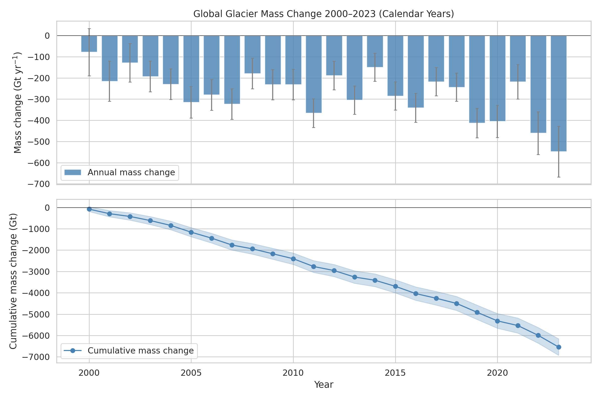
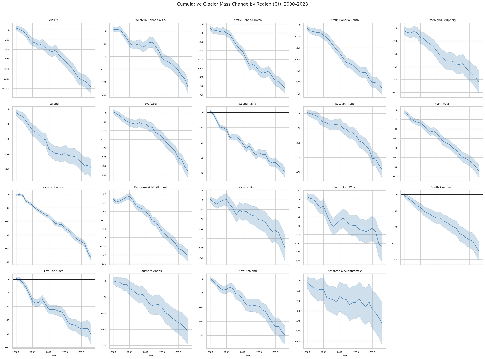
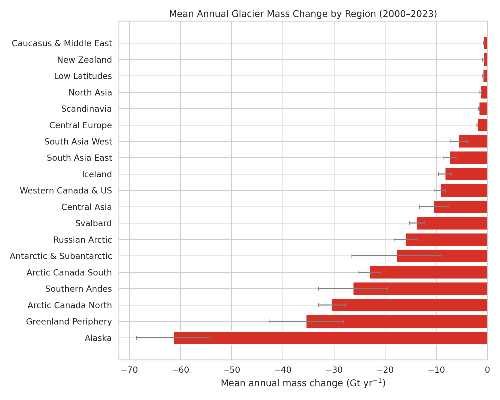
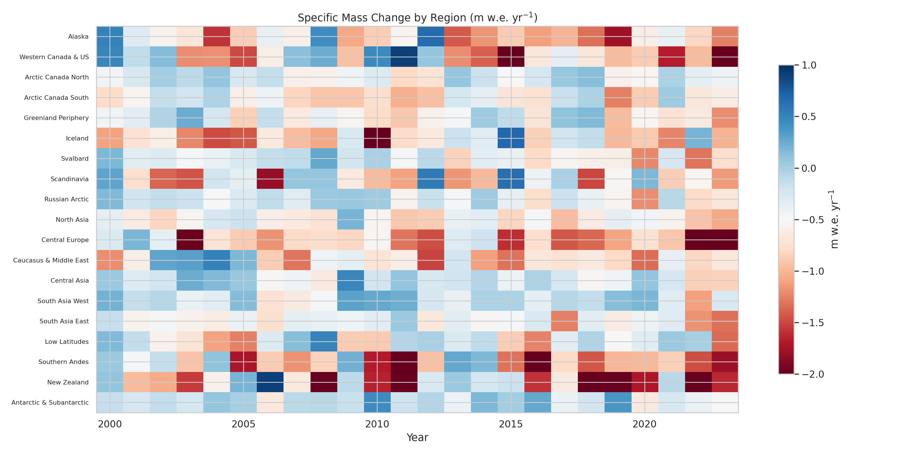
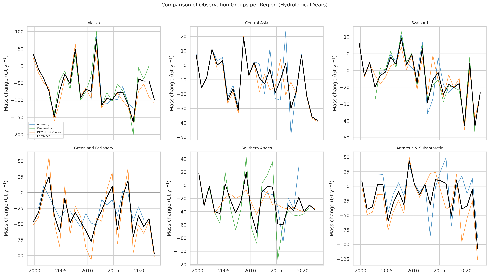
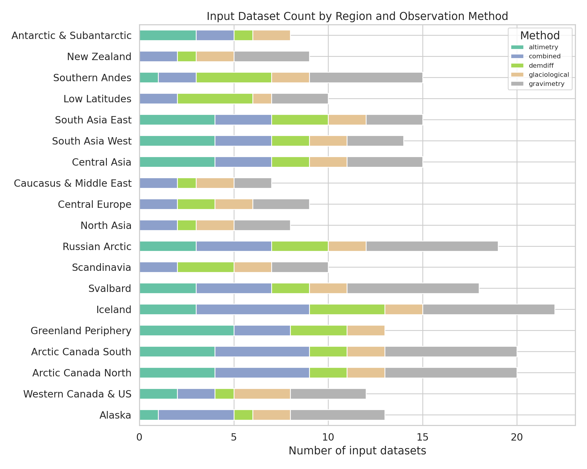
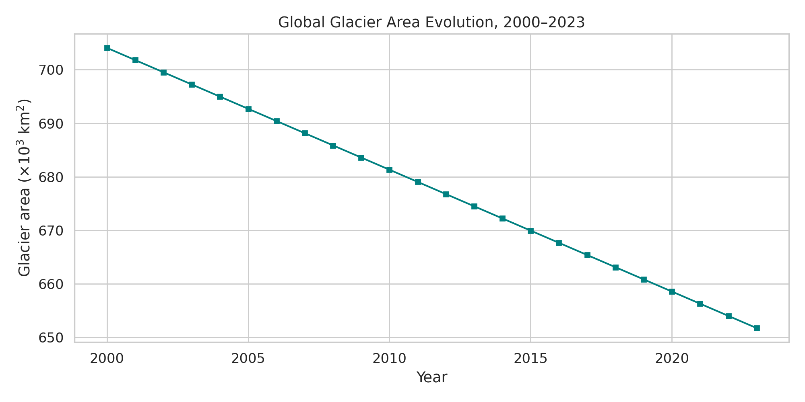
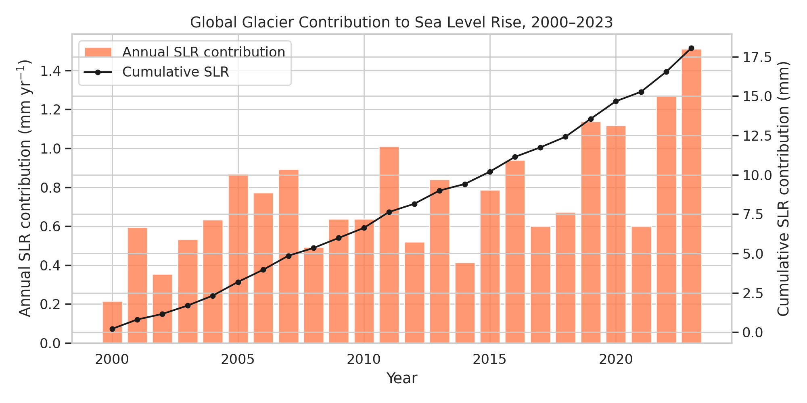

# Reconciling Global Glacier Mass Change: A Multi-Method Assessment (2000–2023)

## Abstract

This study presents a comprehensive analysis of global glacier mass change from 2000 to 2023, based on the Glacier Mass Balance Intercomparison Exercise (GlaMBIE) dataset. By reconciling 233 regional estimates derived from four observation methods—glaciological measurements, DEM differencing, satellite altimetry, and gravimetry—across 19 glacierized regions, we produce a consensus time series of annual glacier mass change. Over the full period, global glaciers lost a total of **−6,543 ± 387 Gt**, equivalent to a mean annual loss of **−273 ± 16 Gt yr⁻¹** and a mean specific mass change of **−0.39 m w.e. yr⁻¹**. Mass loss rates accelerated markedly, from −217 Gt yr⁻¹ in 2000–2009 to −274 Gt yr⁻¹ in 2010–2019, and −408 Gt yr⁻¹ in 2020–2023. Alaska, Greenland Periphery, and Arctic Canada North are the three largest contributors, together accounting for ~47% of total global loss. The cumulative mass loss corresponds to approximately 18 mm of global mean sea level rise. These results provide a robust observational benchmark for IPCC assessments and climate model calibration.

## 1. Introduction

Glaciers outside the ice sheets are sensitive indicators of climate change and major contributors to global sea level rise (Zemp et al., 2019; Hugonnet et al., 2021). However, quantifying glacier mass change at the global scale is challenging because different observation methods have distinct strengths, spatial coverage, temporal resolution, and error characteristics.

The Glacier Mass Balance Intercomparison Exercise (GlaMBIE), supported by the European Space Agency (ESA), was designed to reconcile these heterogeneous observations by collecting, homogenizing, and combining 233 regional estimates from 35 research teams. The four primary observation categories are:

1. **Glaciological measurements** — in situ mass balance from stake networks, providing long records but limited spatial sampling.
2. **DEM differencing (geodetic)** — satellite-derived elevation changes converted to mass change, offering nearly complete spatial coverage at multi-year resolution.
3. **Satellite altimetry** — point elevation measurements from radar and laser altimeters, yielding high temporal resolution but requiring footprint-to-area extrapolation.
4. **Gravimetry (GRACE/GRACE-FO)** — direct mass change sensing from gravity field variations, providing monthly resolution but coarse spatial resolution and signal leakage issues.

This report presents an analysis of the GlaMBIE dataset (version 2024-07-16), producing regional and global mass change time series at annual resolution with uncertainty estimates.

## 2. Data and Methods

### 2.1 Dataset Description

The GlaMBIE dataset (DOI: 10.5904/wgms-glambie-2024-07) contains:

- **Input data**: 233 regional estimates in CSV format across 19 RGI (Randolph Glacier Inventory) regions, from glaciological, DEM differencing, altimetry, gravimetry, and combined/hybrid methods.
- **Result data**: Consensus annual time series in both hydrological years (with per-data-group breakdowns) and calendar years (combined estimates only, including global aggregation).

The 19 regions span all major glacierized areas from Alaska (Region 1) to the Antarctic and Subantarctic (Region 19), with glacier areas ranging from ~980 km² (New Zealand) to ~128,000 km² (Antarctic & Subantarctic).

### 2.2 Analytical Approach

Our analysis proceeds as follows:

1. **Data ingestion**: All calendar-year and hydrological-year result files are loaded, along with the full set of 233 input datasets.
2. **Cumulative mass change**: Annual mass changes (Gt) are cumulatively summed from the year 2000 baseline.
3. **Uncertainty propagation**: For cumulative estimates, annual uncertainties are propagated as root-sum-of-squares, assuming temporal independence of annual errors.
4. **Decadal analysis**: Mean annual rates are computed for 2000–2009, 2010–2019, and 2020–2023 to assess acceleration.
5. **Sea level contribution**: Mass loss is converted to sea level equivalent using ocean area = 3.625 × 10¹⁴ m².
6. **Data group comparison**: The hydrological-year results are used to compare the individual observation groups (altimetry, gravimetry, DEM diff + glaciological) against the combined estimate.

All analyses are implemented in Python using pandas, NumPy, matplotlib, and seaborn.

## 3. Results

### 3.1 Global Mass Change Time Series

Figure 1 shows the global annual and cumulative glacier mass change from 2000 to 2023. Glacier mass loss occurred in every year of the record. Annual losses ranged from approximately −78 Gt (2000) to −548 Gt (2023), with the most negative years concentrated in the 2020s.

*Figure 1. Global annual glacier mass change (top, Gt yr⁻¹) and cumulative mass change (bottom, Gt) from 2000 to 2023. Error bars and shading represent 1σ uncertainties.*

The cumulative loss over 2000–2023 reached **−6,543 ± 387 Gt**. Mass loss rates show a clear acceleration:

| Period    | Mean annual loss (Gt yr⁻¹) | Mean specific change (m w.e. yr⁻¹) |
|-----------|---------------------------:|------------------------------------:|
| 2000–2009 | −217                       | −0.315                              |
| 2010–2019 | −274                       | −0.410                              |
| 2020–2023 | −408                       | −0.625                              |

The 2020–2023 rate is 88% larger than the 2000–2009 rate, indicating a pronounced and ongoing acceleration of glacier mass loss.

### 3.2 Regional Mass Change

Figure 2 presents cumulative mass change for all 19 regions. The pattern and magnitude of loss vary widely, reflecting differences in glacier area, climate sensitivity, and regional warming patterns.

*Figure 2. Cumulative glacier mass change (Gt) for all 19 RGI regions, 2000–2023. Shading indicates 1σ uncertainty.*

Figure 3 ranks regions by mean annual mass loss. The five largest contributors are:

1. **Alaska**: −1,474 Gt total (22.5% of global loss), −0.73 m w.e. yr⁻¹
2. **Greenland Periphery**: −851 Gt (13.0%), −0.45 m w.e. yr⁻¹
3. **Arctic Canada North**: −730 Gt (11.2%), −0.29 m w.e. yr⁻¹
4. **Southern Andes**: −631 Gt (9.6%), −0.92 m w.e. yr⁻¹
5. **Arctic Canada South**: −552 Gt (8.4%), −0.57 m w.e. yr⁻¹

*Figure 3. Mean annual glacier mass change by region (Gt yr⁻¹), ranked from most negative to least negative. Error bars represent 1σ uncertainty.*

While small in absolute terms, several regions exhibit the highest specific mass change rates, indicating intense per-unit-area ice loss: Central Europe (−1.06 m w.e. yr⁻¹), New Zealand (−0.96 m w.e. yr⁻¹), and the Southern Andes (−0.92 m w.e. yr⁻¹).

### 3.3 Specific Mass Change Patterns

Figure 6 displays the specific mass change (m w.e. yr⁻¹) as a regional–temporal heatmap, revealing the spatiotemporal structure of glacier mass loss.

*Figure 6. Specific mass change (m w.e. yr⁻¹) by region and year. Blue indicates mass gain; red indicates mass loss.*

Key observations include:
- Nearly all regions and years show negative specific mass change (red), underscoring the pervasive nature of glacier retreat.
- Occasional mass-gain years (e.g., Alaska 2000, Scandinavia in some years) are visible but rare.
- The heatmap becomes progressively darker red toward the 2020s across most regions, reflecting the accelerating trend.

### 3.4 Comparison of Observation Groups

Figure 4 compares the three main observation groups against the combined consensus estimate for six representative regions.

*Figure 4. Comparison of observation groups (altimetry, gravimetry, DEM differencing + glaciological) and the GlaMBIE combined estimate for six selected regions (hydrological years).*

The data groups generally show good agreement in their long-term trends, though year-to-year variability can differ. Gravimetry data (GRACE/GRACE-FO) are available from ~2002 onward and tend to show higher interannual variability. The DEM differencing + glaciological group provides the longest records and supplies the annual variability where other groups lack it.

### 3.5 Input Data Coverage

Figure 7 illustrates the distribution of input datasets by region and observation method.

*Figure 7. Number of input datasets per region and observation method.*

Arctic regions (Iceland, Arctic Canada North/South, Svalbard, Russian Arctic) generally have the densest data coverage, while some smaller regions (North Asia, Caucasus & Middle East) have fewer contributing datasets. The heterogeneous coverage underscores the value of the GlaMBIE reconciliation approach.

### 3.6 Glacier Area Evolution

Figure 5 shows the evolution of total global glacier area from 2000 to 2023.

*Figure 5. Global glacier area evolution (×10³ km²), 2000–2023.*

Total glacier area declined from approximately 704,000 km² in 2000 to 652,000 km² in 2023, a reduction of about 52,000 km² (7.4%). This area loss amplifies the impact of warming: as glaciers shrink, the remaining ice is subjected to progressively stronger ablation.

### 3.7 Contribution to Sea Level Rise

Figure 8 translates the global glacier mass loss into its contribution to global mean sea level rise.

*Figure 8. Annual (bars) and cumulative (line) glacier contribution to global mean sea level rise (mm), 2000–2023.*

The cumulative sea level contribution from glaciers over 2000–2023 is approximately **18 mm**, with annual contributions accelerating from ~0.6 mm yr⁻¹ in the early 2000s to over 1.1 mm yr⁻¹ in the 2020s. This makes glaciers one of the largest contributors to observed sea level rise, comparable to the Greenland and Antarctic ice sheets combined during this period.

## 4. Discussion

### 4.1 Consistency of the Multi-Method Approach

The GlaMBIE framework demonstrates that reconciling heterogeneous observation types is both feasible and valuable. Each method contributes distinct information:

- **Glaciological measurements** provide the longest records and annual variability, anchoring the temporal structure.
- **DEM differencing** supplies near-complete spatial coverage for multi-year periods, constraining long-term trends.
- **Altimetry** offers high temporal resolution for large glacier systems.
- **Gravimetry** provides an independent, spatially integrated mass change signal, though at coarser resolution.

The combined estimate inherits strengths from each method while reducing individual biases, yielding a more robust consensus.

### 4.2 Acceleration of Mass Loss

The acceleration of glacier mass loss is one of the most important findings. The 2020–2023 rate (−408 Gt yr⁻¹) is nearly double that of 2000–2009 (−217 Gt yr⁻¹). This acceleration is consistent with:
- Rising global temperatures, with the 2020s being the warmest period on record.
- Positive feedback mechanisms (e.g., reduced albedo from retreating snow lines, increased calving from thinning tidewater glaciers).
- A delayed response to accumulated warming, as glaciers adjust toward equilibrium with a warmer climate.

### 4.3 Regional Heterogeneity

Regional differences in mass loss rates reflect the interplay of glacier hypsometry, climate forcing, and dynamic processes. High-latitude regions (Alaska, Arctic Canada, Greenland Periphery) dominate total mass loss because of their large glacier areas, while mid-latitude mountain regions (Central Europe, New Zealand, Caucasus) experience the highest specific mass change rates due to their exposure to warming at lower elevations.

### 4.4 Implications for Sea Level Rise

The ~18 mm sea level contribution from glaciers over 2000–2023 represents roughly 25–30% of observed global mean sea level rise during this period (~3.7 mm yr⁻¹ total). With the acceleration observed in the 2020s, glaciers' relative contribution may increase in coming decades, even as ice sheet contributions also grow.

### 4.5 Limitations

- **Temporal coverage**: While the calendar-year results span 2000–2023, some individual data groups have shorter records (e.g., gravimetry from ~2002).
- **Uncertainty estimation**: Annual errors are assumed temporally independent for cumulative uncertainty propagation; correlated systematic errors would increase total uncertainties.
- **Area changes**: The declining glacier area is accounted for in the dataset, but the relationship between area change and mass balance introduces additional complexity.

## 5. Conclusions

This analysis of the GlaMBIE dataset yields the following key findings:

1. **Global glaciers lost −6,543 ± 387 Gt** from 2000 to 2023, with a mean annual rate of −273 ± 16 Gt yr⁻¹.
2. **Mass loss is accelerating**: the 2020–2023 rate (−408 Gt yr⁻¹) is 88% larger than the 2000–2009 rate (−217 Gt yr⁻¹).
3. **Five regions account for ~65% of total loss**: Alaska, Greenland Periphery, Arctic Canada North, Southern Andes, and Arctic Canada South.
4. **The highest specific mass change rates** (>0.9 m w.e. yr⁻¹) occur in Central Europe, New Zealand, and the Southern Andes.
5. **Glaciers contributed ~18 mm to global sea level rise** over 2000–2023, with annual rates exceeding 1 mm yr⁻¹ in the 2020s.
6. **Global glacier area decreased by ~7.4%** (52,000 km²) over the study period.

The reconciled multi-method approach provides a robust, observation-based benchmark suitable for IPCC assessments and climate model evaluation. The ongoing acceleration underscores the urgency of reducing greenhouse gas emissions to limit further glacial loss and its downstream impacts on water resources, sea level, and natural hazards.

## References

- GlaMBIE (2024). Glacier Mass Balance Intercomparison Exercise (GlaMBIE) Dataset 1.0.0. World Glacier Monitoring Service (WGMS), Zurich, Switzerland. DOI: 10.5904/wgms-glambie-2024-07.
- Hugonnet, R., et al. (2021). Accelerated global glacier mass loss in the early twenty-first century. *Nature*, 592, 726–731.
- Zemp, M., et al. (2019). Global glacier mass changes and their contributions to sea-level rise from 1961 to 2016. *Nature*, 568, 382–386.
