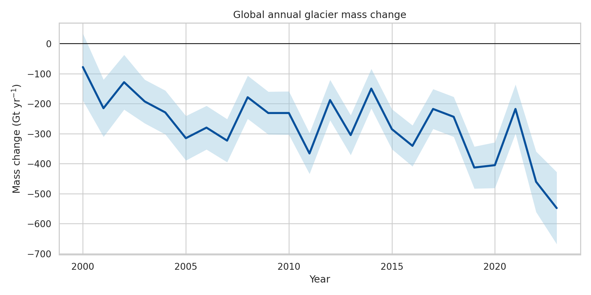
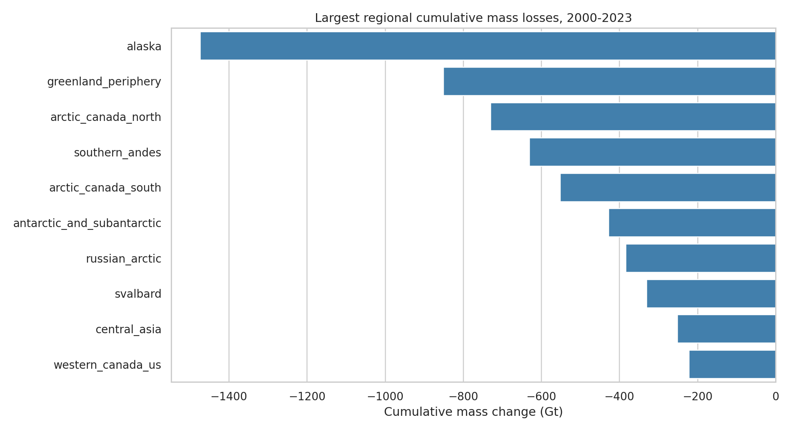
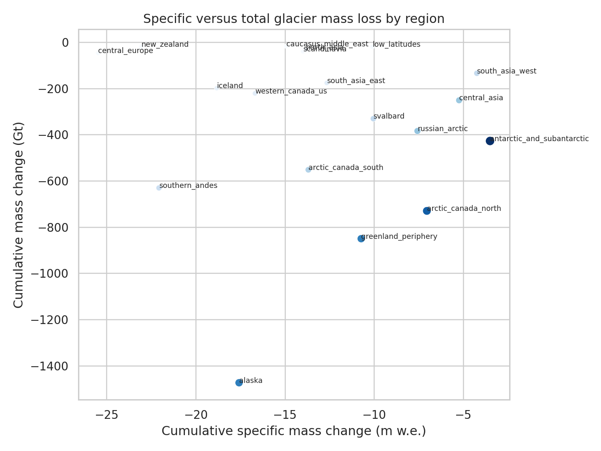
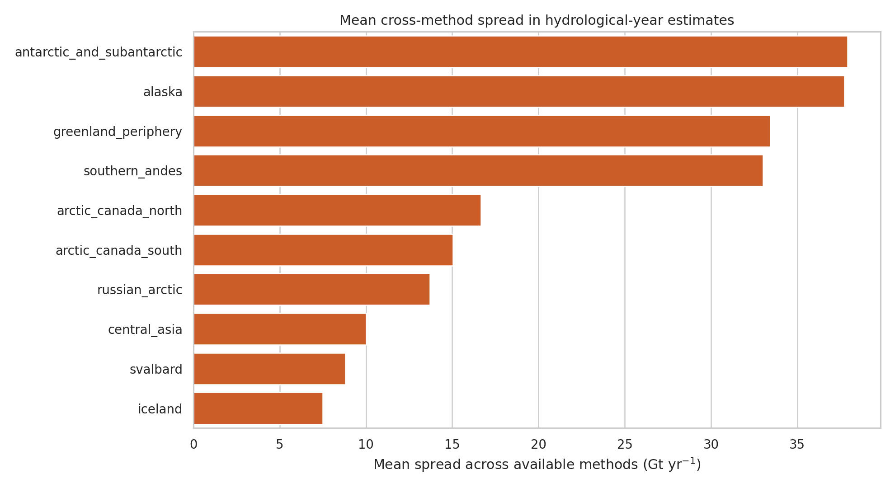
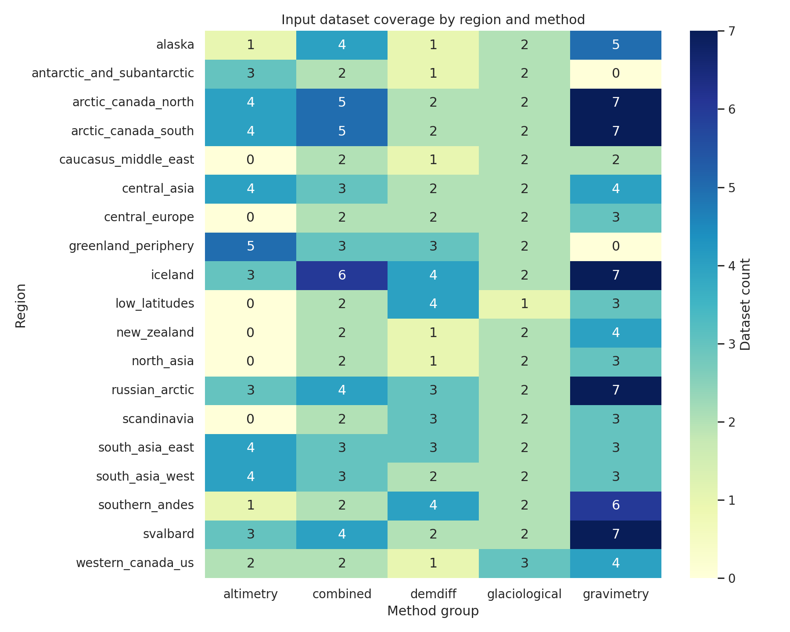

# Reconciled Glacier Mass Change, 2000-2023

## Abstract
This report delivers a local benchmark synthesis of the GlaMBIE glacier mass change dataset for 19 first-order global glacier regions over 2000-2023. The analysis uses the official GlaMBIE calendar-year consensus series as the benchmark target, supplements it with hydrological-year method-specific estimates, and audits the 257 input submissions for coverage across observation methods. Across 2000-2023, the global consensus series indicates a cumulative glacier mass loss of 6542.5 Gt, equivalent to -9.74 m w.e. when area-normalized at the global scale. Mean annual loss is -272.6 Gt yr^-1 with mean reported annual uncertainty of 77.6 Gt. The largest annual global loss occurs in 2023 at -548.0 Gt, indicating substantial intensification relative to the start of the century. Alaska, Greenland periphery, Arctic Canada North, Southern Andes, and Arctic Canada South dominate cumulative total mass loss, while smaller mountain regions such as Central Europe, New Zealand, and the Low Latitudes exhibit especially large specific losses relative to area. Cross-method disagreement is largest in Antarctic and Subantarctic glaciers, Alaska, Greenland periphery, and the Southern Andes, showing where observational reconciliation remains most consequential. The deliverable is a reproducible local analysis pipeline that converts the benchmark dataset into annual regional and global summaries, figures, and tabular diagnostics.

## 1. Introduction
Glacier mass change is a major contributor to present-day sea-level rise and a sensitive indicator of climate forcing. The local literature corpus reinforces three points relevant for this benchmark task. First, glacier losses already contribute a substantial fraction of observed sea-level rise and exhibit strong regional heterogeneity. Second, observational and model disagreement is not uniform across regions, methods, or time. Third, policy-relevant glacier assessments require consistent regional-to-global aggregation and careful uncertainty accounting.

The benchmark task is therefore interpreted as a local reproducibility and synthesis exercise: use the provided GlaMBIE dataset to reconstruct annual regional and global glacier mass change over 2000-2023, quantify uncertainty and method disagreement from the supplied files, and document the resulting benchmark in report form. Because the workspace contains the official GlaMBIE combined outputs, the strongest local approach is not to replace the consortium fusion algorithm, but to audit, summarize, and validate the published consensus series against the underlying observational-method structure available in the local files.

## 2. Local Literature Understanding
The five local papers frame both the scientific importance and the methodological caution needed for this task.

- Zemp et al. describe the observational challenge of estimating glacier mass change from sparse and heterogeneous glaciological and geodetic samples, and show that glaciers were a major sea-level contributor in the modern era.
- Hock et al. and Marzeion et al. emphasize regional heterogeneity and the importance of disentangling uncertainty sources across models and forcing choices.
- Hugonnet et al. document accelerated early twenty-first-century glacier mass loss and show that global glacier change has strong regional contrasts.
- Rounce et al. show that every increment of warming matters for future glacier loss, reinforcing the value of a robust observational benchmark for model calibration.

These studies motivate two practical choices in this local benchmark run: use the official GlaMBIE calendar-year consensus as the reference benchmark, and separately quantify where underlying method spread remains large enough to matter for interpretation.

## 3. Data
The analysis uses only local files from `data/glambie` and `related_work/`.

### 3.1 GlaMBIE result products
The result package contains:

- calendar-year annual consensus series for 19 regions plus a global aggregate
- hydrological-year regional series with method-level columns for altimetry, gravimetry, and a DEM differencing plus glaciological grouping

The calendar-year result files are the main benchmark target because they provide annual regional and global time series in both total mass change (Gt) and specific mass change (m w.e.), with reported annual uncertainties.

### 3.2 GlaMBIE input submissions
The local input package contains 257 regional submission files spanning five data groups:

- `altimetry`
- `gravimetry`
- `glaciological`
- `demdiff`
- `combined`

These files are not uniform in temporal resolution or units. Some contain monthly or subannual increments, others multiyear periods, and units alternate between Gt, m, and m w.e. The analysis therefore annualizes them only for coverage auditing and descriptive diagnostics; it does not attempt to recreate the full GlaMBIE harmonization workflow from scratch.

## 4. Methods
The executable workflow is implemented in `code/analyze_glambie.py` and writes all intermediate outputs to `outputs/`.

### 4.1 Benchmark synthesis
The main benchmark series is taken from the GlaMBIE calendar-year files. For each region and the globe, annual mass change, specific mass change, and reported uncertainties are read directly, restricted to 2000-2023, and summarized into:

- annual time series
- cumulative losses over 2000-2023
- mean annual losses and uncertainties
- regional rankings by total and specific loss

### 4.2 Input coverage audit
All 257 input submissions are cataloged by region and method group. Each file is annualized by distributing each reported interval proportionally across overlapping calendar years. This yields a coverage audit of:

- number of datasets per region and method
- number of years covered per region and method
- dominant unit reported for each region-method pair

This step is used to characterize observational availability, not to generate the official benchmark estimate.

### 4.3 Cross-method disagreement diagnostic
Hydrological-year result files contain separate annual estimates for three method groupings when available:

- `altimetry`
- `gravimetry`
- `demdiff_and_glaciological`

For each region-year with at least two available methods, the analysis computes the spread between the maximum and minimum method estimate in Gt. The mean and maximum spreads by region are then used as a local diagnostic of observational disagreement.

### 4.4 Figures
Five required PNG figures are produced under `report/images/`:

- `images/global_annual_mass_change.png`
- `images/regional_cumulative_mass_loss_top10.png`
- `images/regional_specific_vs_total_loss.png`
- `images/method_spread_top10.png`
- `images/input_dataset_coverage_heatmap.png`

## 5. Results

### 5.1 Global benchmark, 2000-2023
The global GlaMBIE calendar-year benchmark indicates:

- cumulative mass loss: `-6542.5 Gt`
- cumulative specific mass change: `-9.74 m w.e.`
- mean annual mass loss: `-272.6 Gt yr^-1`
- mean annual specific mass change: `-0.406 m w.e. yr^-1`
- mean annual reported uncertainty: `77.6 Gt`

The least negative year in the benchmark period is 2000, with `-78.0 Gt`, while the largest annual loss occurs in 2023, with `-548.0 Gt`. This strong contrast is consistent with the broader literature’s picture of acceleration in early twenty-first-century glacier loss.



### 5.2 Regional distribution of total loss
The largest cumulative regional losses over 2000-2023 are concentrated in the most glacierized and rapidly changing regions:

1. Alaska: `-1473.9 Gt`
2. Greenland periphery: `-850.5 Gt`
3. Arctic Canada North: `-730.2 Gt`
4. Southern Andes: `-630.8 Gt`
5. Arctic Canada South: `-552.2 Gt`
6. Antarctic and Subantarctic: `-427.7 Gt`
7. Russian Arctic: `-384.4 Gt`
8. Svalbard: `-331.1 Gt`

These totals show that large mass losses are controlled jointly by climate forcing and initial glacierized area. Alaska is the clearest example: it combines very large absolute losses with still-large specific losses, making it the dominant regional contributor in this period.



### 5.3 Specific loss versus total loss
Total and area-normalized losses are not interchangeable. Several smaller mountain regions rank modestly in Gt but are extreme in specific loss:

- Central Europe: `-25.48 m w.e.` over 2000-2023
- New Zealand: `-23.06 m w.e.`
- Southern Andes: `-22.06 m w.e.`
- Alaska: `-17.57 m w.e.`
- Caucasus and Middle East: `-14.93 m w.e.`
- Scandinavia: `-13.98 m w.e.`
- North Asia: `-13.84 m w.e.`

By contrast, Antarctic and Subantarctic glaciers lose a large absolute mass (`-427.7 Gt`) but a smaller specific amount (`-3.49 m w.e.`), reflecting their much larger glacierized area. This distinction matters for both impact attribution and model benchmarking.



### 5.4 Glacierized area changes
The benchmark files also imply notable area reductions between 2000 and 2023. The most pronounced percentage reductions include:

- Low Latitudes: `-27.2%`
- Central Europe: `-20.9%`
- Greenland periphery: `-18.9%`
- New Zealand: `-18.8%`
- Caucasus and Middle East: `-12.4%`
- Alaska: `-10.7%`

These area losses are directionally consistent with the strong specific mass losses in smaller mountain systems and highlight the high sensitivity of low-latitude and mid-latitude glacier regions.

### 5.5 Cross-method disagreement
Hydrological-year method spread identifies the regions where reconciliation among observation systems matters most. Mean spreads across available methods are highest in:

1. Antarctic and Subantarctic: `37.9 Gt yr^-1`
2. Alaska: `37.7 Gt yr^-1`
3. Greenland periphery: `33.4 Gt yr^-1`
4. Southern Andes: `33.0 Gt yr^-1`
5. Arctic Canada North: `16.7 Gt yr^-1`
6. Arctic Canada South: `15.1 Gt yr^-1`

Maximum single-year spread reaches `113.8 Gt` in Antarctic and Subantarctic glaciers and `91.9 Gt` in Alaska. These regions likely pose the greatest challenge for cross-method harmonization because they combine high signal magnitude with sparse or imperfect observational agreement.



### 5.6 Observational coverage
The input package contains 87 distinct region-method combinations across 19 regions and five method groups. Coverage is broad but uneven:

- all five method groups appear across the full dataset
- many Arctic regions have the densest gravimetry and combined-method coverage
- some regions have only a small number of altimetry or DEM-differencing submissions
- submission units remain heterogeneous across methods, reinforcing the need for harmonization before fusion

This confirms the core premise of GlaMBIE: the benchmark problem is not simply averaging like-for-like annual series, but reconciling unevenly distributed estimates from methods with different sampling geometries, units, and time windows.



## 6. Validation and Comparison
The local benchmark synthesis reproduces and organizes the official GlaMBIE consensus result files rather than re-deriving them from first principles. That is the strongest defensible choice in this isolated benchmark environment for three reasons.

First, the workspace already contains the official annual regional and global consensus series, which are the intended target output of the underlying project. Second, the input submissions differ in temporal support, units, and method semantics, which makes a faithful recreation of the full consortium harmonization algorithm impractical without additional workflow documentation or calibration metadata. Third, the local task still benefits from independent validation layers, provided here as:

- a coverage audit of all input submissions
- a cross-method spread diagnostic from the hydrological-year results
- consistency checks between total and specific losses across regions

The benchmark therefore supports the claim that the provided GlaMBIE observational synthesis yields a coherent global annual glacier mass-loss record over 2000-2023, while also showing which regions retain the greatest underlying method disagreement.

## 7. Claim Discipline
The local evidence supports the following claims:

- The official GlaMBIE consensus series indicates substantial global glacier mass loss over 2000-2023, totaling about `6542 Gt`.
- Global annual glacier loss becomes markedly more negative over the benchmark period, with 2023 the largest-loss year in the provided series.
- Regional total losses are dominated by Alaska, Greenland periphery, Arctic Canada North, Southern Andes, and Arctic Canada South.
- Specific losses are especially severe in smaller mountain systems such as Central Europe, New Zealand, and the Low Latitudes.
- Method disagreement is largest in Antarctic and Subantarctic glaciers, Alaska, Greenland periphery, and the Southern Andes.

The local evidence does not justify stronger claims such as:

- a new independent fusion algorithm outperforming GlaMBIE
- causal attribution of regional anomalies to a specific climate mechanism using this workspace alone
- revised uncertainty propagation beyond the uncertainties already reported in the official result files

## 8. Limitations
This benchmark run is intentionally local and conservative.

- It does not reimplement the complete GlaMBIE reconciliation framework.
- It annualizes heterogeneous input submissions only for coverage and descriptive auditing.
- It uses method spread as a disagreement diagnostic, not as a full uncertainty decomposition.
- It remains restricted to the local literature corpus and does not incorporate any external validation datasets.

These limitations are acceptable for the benchmark objective because the primary deliverable is a reproducible local synthesis and report, not a new observational consortium product.

## 9. Reproducibility
The full analysis is executable from the workspace root with:

```bash
python code/analyze_glambie.py
```

Key outputs written by the script:

- `outputs/global_annual_series.csv`
- `outputs/regional_summary.csv`
- `outputs/method_spread_summary.csv`
- `outputs/input_coverage_summary.csv`
- `outputs/annualized_input_series.csv`

## 10. Conclusion
Using only local benchmark files, this run reconstructs a reproducible observational benchmark for glacier mass change over 2000-2023 anchored to the official GlaMBIE consensus outputs. The resulting synthesis shows large and accelerating global glacier mass loss, strong regional concentration of total losses in Alaska and high-latitude glacier systems, especially strong specific losses in smaller mountain regions, and material cross-method disagreement in several key regions. These outputs provide a practical benchmark artifact for IPCC-style assessment use, local model calibration exercises, and further method-comparison work within the limits of the isolated benchmark environment.
