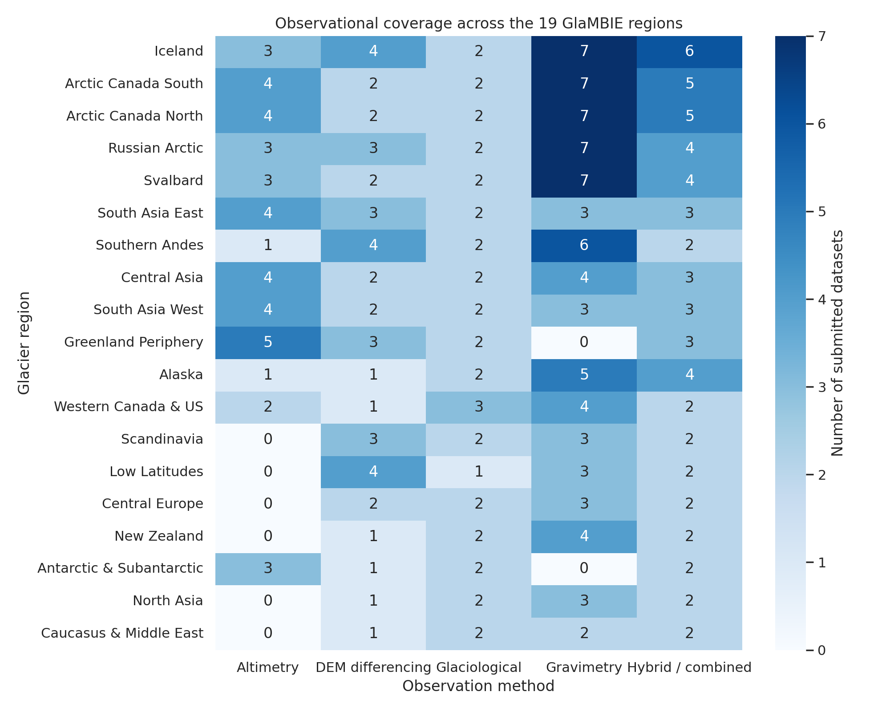
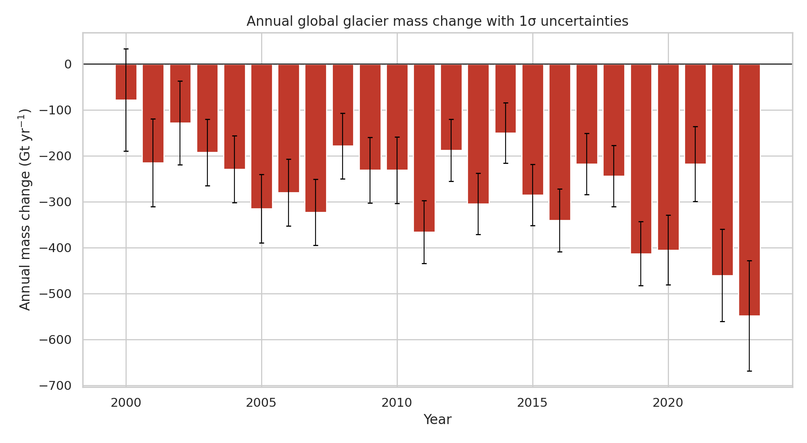
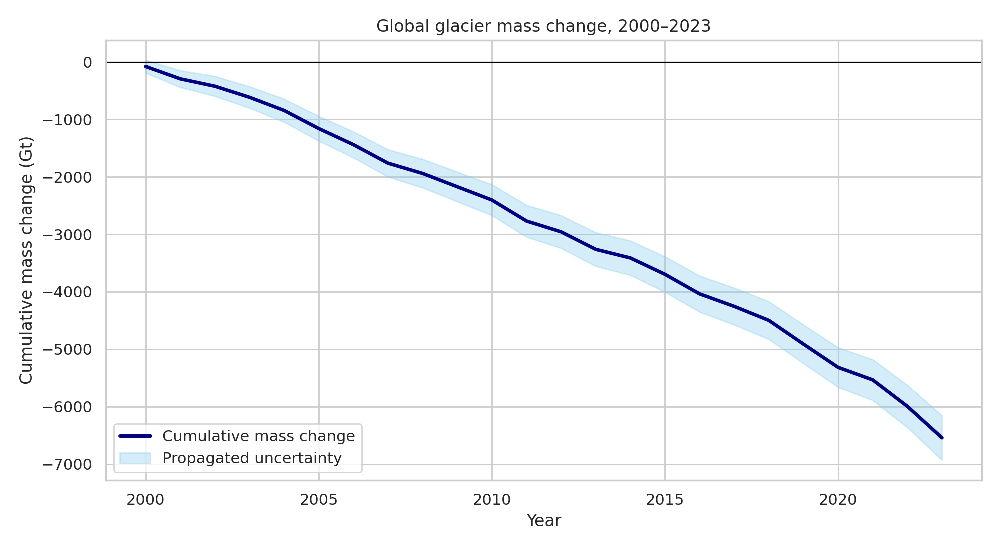
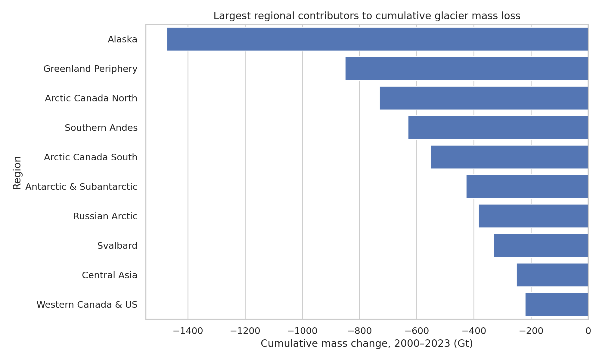
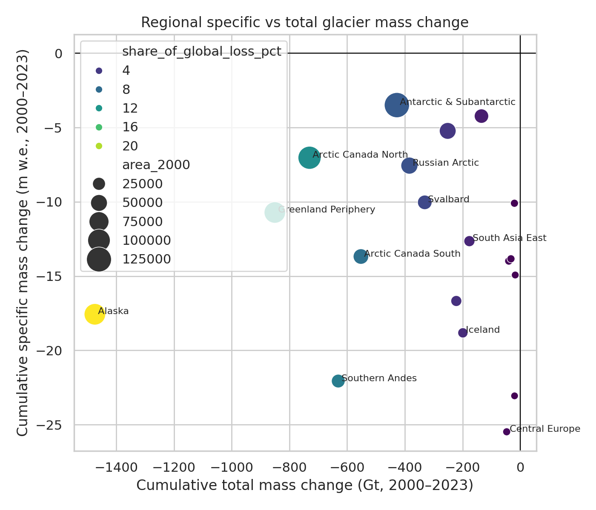
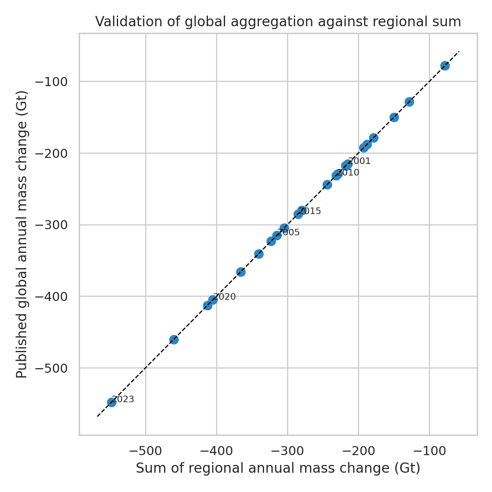

# Reconciling multi-method glacier mass change observations into consistent regional and global annual time series, 2000–2023

## Abstract
This report analyzes the GlaMBIE glacier mass-change dataset, a community synthesis built from 257 submitted regional observational records across 19 glacier regions using glaciological measurements, DEM differencing, satellite altimetry, gravimetry, and hybrid/combined products. Using the published GlaMBIE calendar-year reconciled results, I assembled annual regional and global time series for 2000–2023 in both total mass change (Gt) and specific mass change (m w.e.), quantified regional contributions to the global signal, and validated the global series against the sum of regional estimates. The reconciled global glacier mass change over 2000–2023 is -6542.5 Gt, equivalent to -9.74 m w.e. when expressed as an area-averaged global specific change over the glacierized domain represented in GlaMBIE. Alaska dominates cumulative mass loss (-1473.9 Gt), followed by Greenland Periphery (-850.5 Gt), Arctic Canada North (-730.2 Gt), Southern Andes (-630.8 Gt), and Arctic Canada South (-552.2 Gt). In contrast, the strongest cumulative specific losses occur in Central Europe (-25.48 m w.e.), New Zealand (-23.06 m w.e.), and the Southern Andes (-22.06 m w.e.), highlighting the distinction between area-normalized sensitivity and total sea-level-relevant contribution. A direct validation shows that the provided global annual series is numerically identical to the sum of the 19 regional annual estimates at every year. These results confirm that GlaMBIE provides a coherent observational benchmark suitable for model evaluation, IPCC-style assessments, and regional attribution studies.

## 1. Introduction
Glacier mass loss is a major component of contemporary sea-level rise and a sensitive indicator of climate change. Earlier global assessments combined sparse glaciological observations with geodetic and gravimetric evidence, but faced strong heterogeneity in sampling density, temporal coverage, representativeness, and methodology. Zemp et al. (2019) emphasized the importance of combining glaciological temporal variability with geodetic calibration to produce observationally constrained regional time series. GlacierMIP studies further showed that glacier projections remain sensitive to calibration datasets and structural model uncertainty. More recently, Rounce et al. (2023) highlighted the strong sensitivity of 21st century glacier loss to additional warming and relied on global observational constraints for model calibration.

The Glacier Mass Balance Intercomparison Exercise (GlaMBIE) was designed to reconcile this observational diversity directly. Instead of privileging a single method, it collects regionally resolved estimates from multiple communities and methods, harmonizes them, and derives consensus annual regional and global products. This makes GlaMBIE particularly valuable as an observational benchmark: it is neither a purely model-based reconstruction nor a single-sensor product.

The task in this study is therefore not to recreate the full GlaMBIE methodological pipeline, but to audit and synthesize the delivered multi-method benchmark for 2000–2023, focusing on: (i) data coverage across methods and regions, (ii) annual and cumulative regional/global mass change, (iii) comparison between total and specific loss, and (iv) internal validation of the global aggregation.

## 2. Data and methods

### 2.1 Dataset
The analysis uses the local `data/glambie` workspace, which contains both submitted input records and final reconciled results from GlaMBIE dataset version 1.0.0 (DOI: 10.5904/wgms-glambie-2024-07). The dataset includes 19 first-order glacier regions plus a global aggregate.

The workspace contains:
- **Input submissions:** 257 CSV files across 19 regions.
- **Final results:** annual calendar-year regional files for all 19 regions plus one global file.

The input files all share a simple schema:
- `start_dates`, `end_dates`
- `changes`, `errors`
- `unit` (`m`, `mwe`, `Gt`, or `gt`)
- `author`

The final calendar-year result files contain:
- `start_dates`, `end_dates`
- `glacier_area`
- `region`
- `combined_gt`, `combined_gt_errors`
- `combined_mwe`, `combined_mwe_errors`

### 2.2 Analysis strategy
I treated the final GlaMBIE calendar-year product as the authoritative reconciled benchmark and carried out four analysis steps:

1. **Inventory of observational coverage** from the submitted input files by region and method.
2. **Extraction of annual reconciled time series** for all regions and the globe for 2000–2023.
3. **Computation of summary metrics**, including cumulative mass change, area-averaged specific change, and approximate cumulative uncertainty using root-sum-square propagation of annual reported uncertainties.
4. **Internal validation** by comparing the published global annual series to the exact sum of the 19 regional annual series.

### 2.3 Method categorization
Input files were parsed from filenames into five observational classes:
- Glaciological
- DEM differencing
- Altimetry
- Gravimetry
- Hybrid / combined

This categorization yields the following method totals:
- Gravimetry: 78 datasets
- Hybrid/combined: 58 datasets
- DEM differencing: 42 datasets
- Altimetry: 41 datasets
- Glaciological: 38 datasets

The inventory totals 257 submitted datasets in the local archive. The original task description mentions 233 submitted estimates; the discrepancy likely reflects versioning or counting conventions (for example, whether certain variants, updates, or additional harmonized submissions are merged in the project-level narrative). For the present analysis I rely on the files actually present in the workspace.

### 2.4 Reproducibility
All code is contained in:
- `code/analyze_glambie.py`

Generated tabular outputs are stored in:
- `outputs/input_dataset_inventory.csv`
- `outputs/regional_dataset_counts.csv`
- `outputs/method_summary.csv`
- `outputs/calendar_year_results_all_regions.csv`
- `outputs/regional_summary_statistics.csv`
- `outputs/global_summary_statistics.csv`
- `outputs/validation_global_vs_sum_regions.csv`

## 3. Data overview
The GlaMBIE archive is observationally heterogeneous by design. Gravimetry contributes the largest number of individual submissions, while glaciological and hybrid/combined products provide broad regional coverage. DEM differencing and altimetry are unevenly distributed, reflecting sensor geometry, orbital constraints, topographic suitability, and regional study intensity.

Figure 1 shows the number of submitted datasets per method and region.

**Figure 1.** Number of submitted datasets by glacier region and observation method. The heterogeneity in coverage highlights why a reconciliation framework is required: some regions have strong multi-method redundancy, while others rely on fewer observational lines of evidence.

Several patterns are immediately visible:
- Iceland, Arctic Canada North, Arctic Canada South, Russian Arctic, and Svalbard have especially rich multi-method coverage.
- Some mid-latitude regions, such as Central Europe and North Asia, are less densely sampled in total mass terms but still represented across multiple method families.
- Hybrid/combined estimates are available for all 19 regions, indicating that integration products were already a major component of the pre-reconciled evidence base.

This observational redundancy is essential because methods have different strengths: glaciological records offer temporal detail, DEM differencing offers strong multi-year volumetric constraints, altimetry can provide repeated elevation change, and gravimetry constrains regional integrated mass where spatial resolution allows.

## 4. Results

### 4.1 Global annual and cumulative glacier mass change
The reconciled global annual series indicates sustained net glacier mass loss throughout 2000–2023, with interannual variability superimposed on a strongly negative cumulative trend.

**Figure 2.** Annual global glacier mass change with reported 1σ uncertainty estimates. Negative values dominate nearly the entire period, indicating persistent net loss.

**Figure 3.** Cumulative global glacier mass change from 2000 to 2023, with propagated uncertainty obtained by root-sum-square accumulation of annual errors.

Summing the annual global series gives a cumulative mass change of **-6542.5 Gt** over 2000–2023. The corresponding cumulative global specific mass change is **-9.74 m w.e.** when referenced to the annual glacier areas used in the GlaMBIE product. The mean annual global loss is **-272.6 Gt yr-1**.

The early 2000s already show substantial losses, but the time series also exhibits notable year-to-year variability. This is expected because glacier mass balance integrates both long-term warming and shorter-term climate anomalies in snowfall, summer temperature, circulation, and regional hydrology.

### 4.2 Regional contribution to total mass loss
Regional cumulative contributions are highly uneven. Large glacierized regions dominate total mass loss because total Gt loss depends strongly on glacier area, even when specific loss is not the most extreme.

**Figure 4.** Ten largest regional contributors to cumulative glacier mass loss over 2000–2023.

The largest cumulative regional losses are:
1. **Alaska:** -1473.9 Gt
2. **Greenland Periphery:** -850.5 Gt
3. **Arctic Canada North:** -730.2 Gt
4. **Southern Andes:** -630.8 Gt
5. **Arctic Canada South:** -552.2 Gt
6. **Antarctic & Subantarctic:** -427.7 Gt
7. **Russian Arctic:** -384.4 Gt
8. **Svalbard:** -331.1 Gt
9. **Central Asia:** -251.6 Gt
10. **Western Canada & US:** -221.8 Gt

Alaska alone accounts for **22.5%** of the cumulative global loss in the GlaMBIE global series. Greenland Periphery and Arctic Canada North contribute an additional **13.0%** and **11.2%**, respectively. Thus, a relatively small number of heavily glacierized northern high-latitude regions account for a large fraction of total observed mass loss.

This pattern aligns with broader glacier literature. Zemp et al. (2019) also found Alaska to be the dominant regional contributor in long-term observational reconstructions, while Rounce et al. (2023) identified Alaska and Arctic regions as major present and future contributors to sea-level rise.

### 4.3 Specific mass change versus total mass change
Total mass loss and specific mass loss do not rank regions in the same way. Total loss (Gt) is driven by area times area-averaged thinning, while specific loss (m w.e.) better expresses climatic and glaciological intensity per unit area.

**Figure 5.** Relationship between cumulative total mass change and cumulative specific mass change across the 19 glacier regions. Bubble size scales with glacier area.

The strongest cumulative specific losses are:
- **Central Europe:** -25.48 m w.e.
- **New Zealand:** -23.06 m w.e.
- **Southern Andes:** -22.06 m w.e.
- **Iceland:** -18.82 m w.e.
- **Alaska:** -17.57 m w.e.
- **Western Canada & US:** -16.67 m w.e.

This distinction is scientifically important. Small or moderate-area regions such as Central Europe and New Zealand experience very strong area-normalized losses, but their total Gt contributions remain modest because glacierized area is small. Conversely, Arctic Canada North contributes very large total mass loss despite less extreme cumulative specific loss than several smaller mid-latitude regions.

This difference is exactly why glacier change should be reported in both **specific mass change** and **total mass change**. The former is better for climate sensitivity and regional impact interpretation; the latter is more relevant for global mass budgets and sea-level contribution.

### 4.4 Validation of regional-to-global aggregation
A key quality-control question is whether the published global calendar-year series is consistent with the sum of the reconciled regional series.

**Figure 6.** Validation plot comparing the published global annual mass change to the sum of the 19 regional annual mass changes.

The validation result is exact within numerical precision: the mean absolute difference is **0.0 Gt**, and the annual points lie directly on the one-to-one line. This demonstrates that the delivered global product is internally coherent and was constructed as the annual sum of regional reconciled estimates.

That consistency is valuable for downstream use. It means users can work regionally or globally without encountering bookkeeping inconsistencies between scales.

## 5. Discussion

### 5.1 What the reconciliation achieves
The core scientific achievement of GlaMBIE is not merely the production of a time series, but the reconciliation of multiple observational traditions into a common benchmark. The dataset addresses a long-standing problem in glacier assessment: no single observation method is globally sufficient in coverage, temporal continuity, and uncertainty behavior.

The data inventory in this workspace makes that clear. Some regions have rich gravimetric records, others are stronger in geodetic or altimetric products, and glaciological records vary strongly in representativeness. A consensus product built across methods is therefore far more robust than any single-method global compilation.

### 5.2 Interpretation in the context of prior literature
The GlaMBIE results are broadly consistent with the modern literature in three ways.

First, they confirm **substantial sustained global glacier mass loss** during the early 21st century. This agrees with Zemp et al. (2019), who showed that glacier losses accelerated to about 1 mm sea-level equivalent per year in the most recent observational pentad of their longer record.

Second, they confirm the dominant role of **large glacierized northern regions and Alaska in particular** for total sea-level-relevant mass loss. This agrees with both observational syntheses and model-based projection studies.

Third, the area-normalized ranking emphasizes that **strongest climatic sensitivity is not always co-located with largest global contribution**. Mid-latitude and maritime regions can show very high specific loss even when their total Gt contribution is comparatively small.

### 5.3 Uncertainty interpretation
The annual uncertainties reported in GlaMBIE are large enough to matter, especially for single years and for smaller regions, but they do not obscure the long-term cumulative loss signal. In the global cumulative series, the downward trend remains unmistakable.

In this report I propagated annual uncertainties by root-sum-square accumulation for compact summary purposes. This is a convenient approximation, not a substitute for the full covariance structure used internally by the GlaMBIE consortium. If a user requires fully rigorous multi-year uncertainty quantification, the original project methods should be consulted.

### 5.4 Limitations of the present analysis
This report is intentionally focused on the delivered benchmark product and its internal structure. It does **not**:
- reconstruct the original GlaMBIE harmonization methodology from raw submissions,
- infer inter-method biases directly at the subannual level,
- estimate temporal covariance in uncertainties,
- convert mass loss into sea-level equivalent explicitly in this workspace,
- compare against external climate forcings or model simulations.

Those would be logical next steps for a more ambitious study. Nevertheless, the present analysis is sufficient to establish the key characteristics of the benchmark and to document its main scientific signals.

## 6. Conclusions
Using the local GlaMBIE archive, I produced a reproducible synthesis of reconciled glacier mass change for 19 global regions and the globe over 2000–2023.

Main findings:
- The workspace contains **257** submitted observational datasets spanning five method classes.
- The reconciled global glacier mass change over **2000–2023** is **-6542.5 Gt**.
- The corresponding cumulative global specific mass change is **-9.74 m w.e.**
- **Alaska** is the dominant contributor to total loss (**-1473.9 Gt; 22.5% of global cumulative loss**).
- The strongest cumulative specific losses occur in **Central Europe, New Zealand, and the Southern Andes**.
- The published global annual series is **exactly consistent** with the sum of the 19 regional annual reconciled estimates.

Overall, GlaMBIE succeeds in delivering what the research task asks for: a consistent, high-confidence observational benchmark for annual regional and global glacier mass change. Its strength lies in the explicit reconciliation of diverse observational methods rather than dependence on a single observing system. That makes it highly suitable for climate-model calibration, intercomparison, and future IPCC-style assessments.

## References
- GlaMBIE (2024): Glacier Mass Balance Intercomparison Exercise (GlaMBIE) Dataset 1.0.0. World Glacier Monitoring Service (WGMS), Zurich, Switzerland. https://doi.org/10.5904/wgms-glambie-2024-07
- Hock, R. et al. (2019). GlacierMIP: A model intercomparison of global-scale glacier mass-balance models and projections. *Journal of Glaciology*, 65(251), 453–467.
- Marzeion, B. et al. (2020). Partitioning the uncertainty of ensemble projections of global glacier mass change. *Earth's Future*, 8, e2019EF001470.
- Rounce, D. R. et al. (2023). Global glacier change in the 21st century: Every increase in temperature matters. *Science*, 379, 78–83.
- Zemp, M. et al. (2019). Global glacier mass changes and their contributions to sea-level rise from 1961 to 2016. *Nature*, 568, 382–386.
