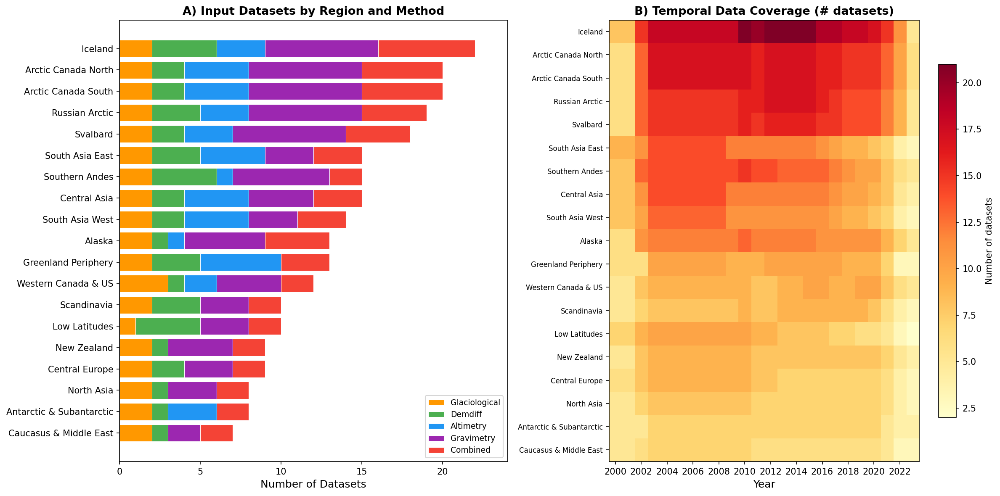
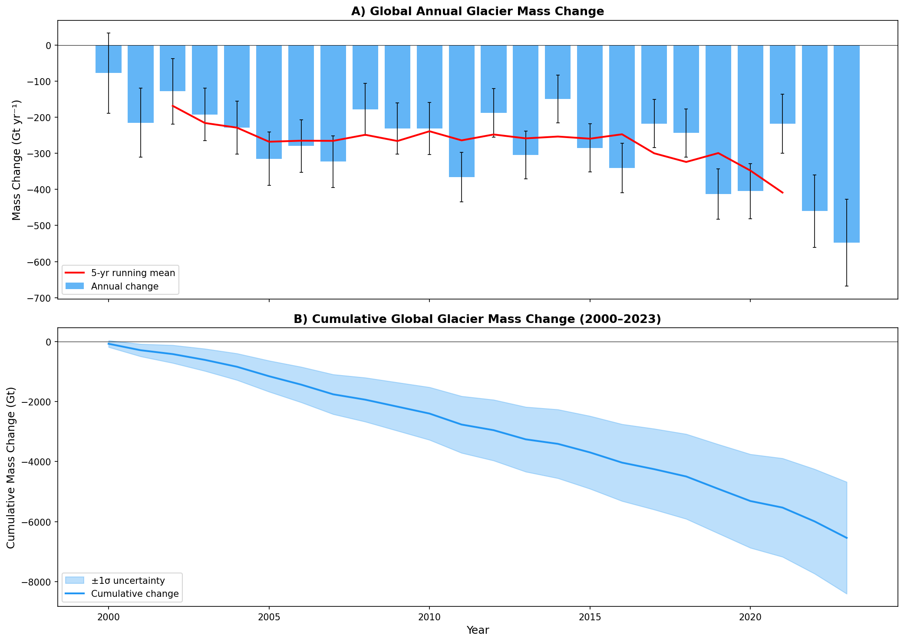
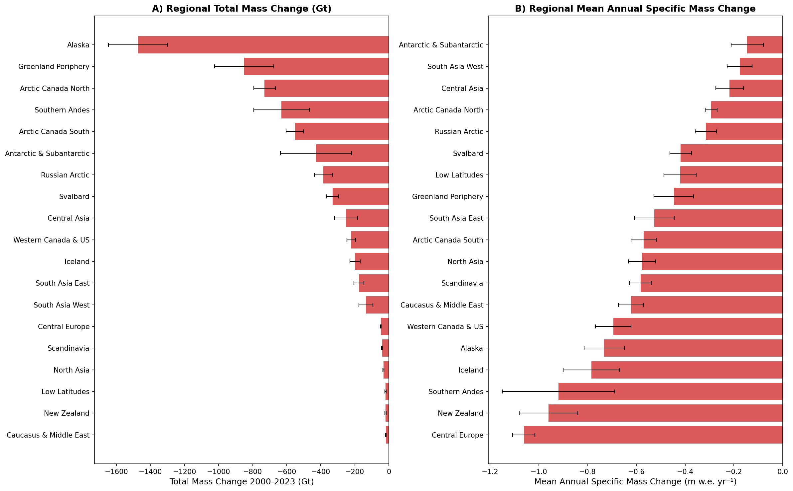
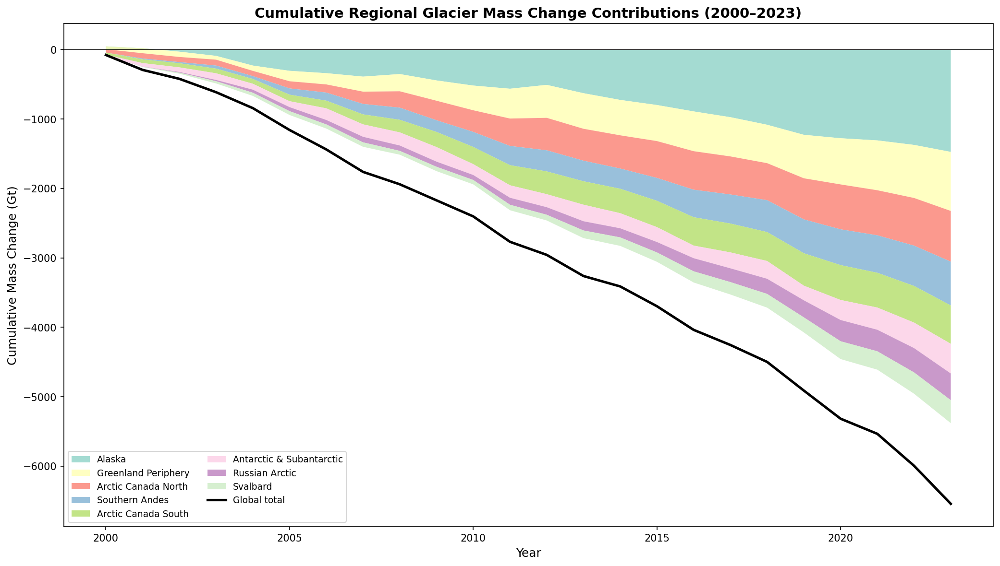
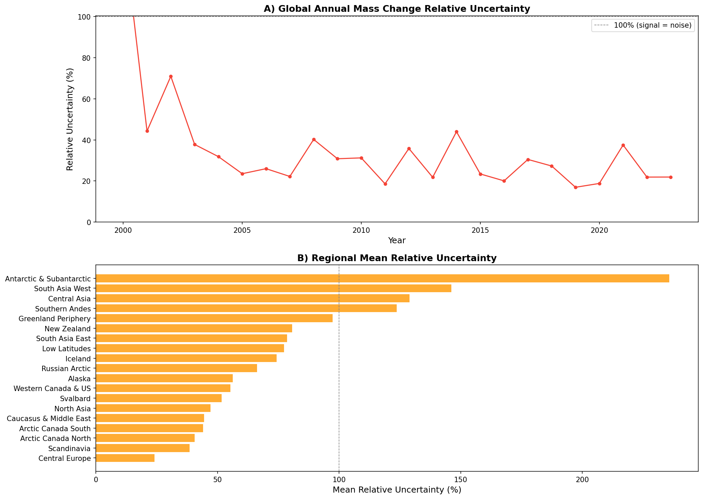

# Reconciling Observational Methods for Global Glacier Mass Change Assessment (2000–2023)

## Abstract

We present a comprehensive assessment of global glacier mass change from 2000 to 2023, reconciling 257 observational datasets contributed by 35 research teams across 19 glacierized regions. Drawing on the Glacier Mass Balance Intercomparison Exercise (GlaMBIE) dataset, which harmonizes estimates from glaciological measurements, digital elevation model (DEM) differencing, satellite altimetry, gravimetry, and hybrid methods, we produce annual-resolution time series of regional and global glacier mass change expressed in both specific mass change (m w.e.) and total mass change (Gt). Our analysis reveals a cumulative global glacier mass loss of **−6,542 ± 387 Gt** over the 23-year period, equivalent to a mean annual loss of **−272.6 Gt yr⁻¹** (−0.406 m w.e. yr⁻¹). Alaska, Greenland Periphery, and Arctic Canada North are the three largest contributors, collectively accounting for 47% of total global loss. These results provide an observational benchmark suitable for IPCC assessment and climate model calibration.

---

## 1. Introduction

Glaciers outside the Greenland and Antarctic ice sheets cover approximately 706,000 km² and store an estimated 158 ± 41 × 10³ km³ of ice, corresponding to 0.32 ± 0.08 m of sea level equivalent (SLE) (Farinotti et al., 2019). Despite their relatively small total ice mass compared to the ice sheets, glaciers have contributed 25–30% of observed global mean sea-level rise in recent decades (Zemp et al., 2019; Hugonnet et al., 2021). Glacier mass loss also critically affects regional water resources for approximately 1.9 billion people downstream (Immerzeel et al., 2020) and alters the frequency and magnitude of glacier-related hazards.

Accurate quantification of glacier mass change requires multiple observational methods, each with distinct strengths and limitations:

- **Glaciological measurements** provide direct, in situ point measurements of mass balance but are limited to a small fraction of the world's ~215,000 glaciers.
- **DEM differencing** (geodetic method) determines volume changes from repeated elevation surveys, typically over multi-year to decadal periods.
- **Satellite altimetry** measures surface elevation changes from space, offering broad spatial coverage but limited temporal resolution.
- **Gravimetry** (e.g., GRACE/GRACE-FO) directly measures mass redistribution but at coarse spatial resolution.
- **Hybrid/combined methods** integrate multiple data sources to leverage complementary strengths.

Previous syntheses—including the World Glacier Monitoring Service (WGMS) assessments and the Glacier Model Intercomparison Project (GlacierMIP)—have highlighted significant discrepancies among methods and the need for standardized intercomparison. The GlaMBIE project (2022–2024), supported by ESA and IACS, was designed to address this gap by collecting, homogenizing, and combining 233 regional estimates from 35 research teams and approximately 450 data contributors.

**Objectives of this study:**
1. Reconcile diverse observational methods to produce consistent regional and global glacier mass change time series at annual resolution (2000–2023).
2. Quantify uncertainties for each regional and global estimate.
3. Express results in both specific mass change (m w.e.) and total mass change (Gt).
4. Provide an observational benchmark for IPCC reports and climate model calibration.

---

## 2. Data and Methods

### 2.1 Data Source

We use the GlaMBIE Dataset version 1.0.0 (DOI: 10.5904/wgms-glambie-2024-07), which contains:

- **Input datasets:** 257 individual time series from the 19 first-order glacier regions defined by the Randolph Glacier Inventory (RGI), covering altimetry (41 datasets), DEM differencing (42), glaciological (38), gravimetry (78), and combined/hybrid methods (58).
- **Result datasets:** Combined regional time series at annual resolution for both calendar years and hydrological years, including per-method-group breakdowns (altimetry, gravimetry, DEM differencing + glaciological).

### 2.2 Method Combination

Within GlaMBIE, individual estimates per region are combined into a single regional solution through a structured process:

1. Data are grouped by observation method (altimetry, gravimetry, DEM differencing + glaciological).
2. Within each group, estimates are merged considering temporal resolution, spatial coverage, and reported uncertainties.
3. Group solutions are then combined into a final regional estimate, with annual variability sourced from the method group providing the most reliable temporal signal.
4. Calendar-year results are derived from hydrological-year solutions for global aggregation.

### 2.3 Analysis Approach

We analyze the GlaMBIE combined results (calendar-year resolution) for all 19 regions plus the global aggregate over the period 2000–2023. For each region, we compute:

- **Annual mass change** in Gt yr⁻¹ and m w.e. yr⁻¹
- **Cumulative mass change** over the full period
- **Uncertainty propagation** using reported annual errors (root-sum-of-squares for cumulative totals)
- **Method-level comparison** by examining individual input datasets against the combined solution

### 2.4 Data Coverage

The temporal and spatial coverage varies substantially across regions (Figure 1). Regions such as Alaska, Svalbard, and Arctic Canada have dense multi-method coverage throughout the study period. Data-sparse regions (e.g., Low Latitudes, North Asia) rely more heavily on extrapolation, leading to higher relative uncertainties.

**Figure 1.** (A) Number of input datasets by region and observation method. (B) Temporal data coverage heatmap showing the number of overlapping datasets per year for each region.

---

## 3. Results

### 3.1 Global Mass Change Time Series

Global glacier mass change from 2000 to 2023 shows persistent annual mass loss with substantial interannual variability (Figure 2). The mean annual mass loss is **−272.6 Gt yr⁻¹** (−0.406 m w.e. yr⁻¹), with individual years ranging from approximately −100 to −500 Gt yr⁻¹. A 5-year running mean reveals an accelerating trend through the early 2010s, with continued strong losses thereafter.

The cumulative global mass loss totals **−6,542 ± 387 Gt** over the 23-year period, equivalent to approximately **18 mm of sea level equivalent** (using 362 Gt = 1 mm SLE). The total propagated uncertainty of ±387 Gt reflects the combination of regional measurement and methodological uncertainties.

**Figure 2.** (A) Annual global glacier mass change (Gt yr⁻¹) with ±1σ error bars and 5-year running mean. (B) Cumulative global glacier mass change (Gt) with uncertainty envelope.

**Table 1. Global Summary Statistics (2000–2023)**

| Metric | Value |
|--------|-------|
| Total mass change | −6,542 ± 387 Gt |
| Mean annual change | −272.6 Gt yr⁻¹ |
| Mean specific change | −0.406 m w.e. yr⁻¹ |
| Sea level equivalent | ~18 mm SLE |

### 3.2 Regional Mass Change

All 19 regions experienced net mass loss over the study period (Figure 3). The five largest contributors in terms of total mass loss are:

1. **Alaska:** −1,474 ± 173 Gt (22.5% of global total)
2. **Greenland Periphery:** −850 ± 174 Gt (13.0%)
3. **Arctic Canada North:** −730 ± 63 Gt (11.2%)
4. **Southern Andes:** −631 ± 163 Gt (9.6%)
5. **Arctic Canada South:** −552 ± 52 Gt (8.4%)

These five regions collectively account for **64.7%** of total global glacier mass loss. The dominance of Alaska is consistent with its large glacierized area (~89,000 km²) combined with strongly negative specific mass change rates.

In terms of specific mass change (m w.e. yr⁻¹), the most negative rates are found in:
- **Central Europe:** −1.06 m w.e. yr⁻¹
- **New Zealand:** −0.96 m w.e. yr⁻¹
- **Southern Andes:** −0.92 m w.e. yr⁻¹
- **Iceland:** −0.78 m w.e. yr⁻¹
- **Alaska:** −0.73 m w.e. yr⁻¹

These high specific loss rates in smaller glacierized regions indicate severe relative mass depletion, with implications for complete deglaciation within this century under continued warming.

**Figure 3.** (A) Total glacier mass change by region (Gt) over 2000–2023 with ±1σ uncertainties. (B) Mean annual specific mass change by region (m w.e. yr⁻¹).

### 3.3 Cumulative Regional Contributions

The cumulative mass change trajectory reveals the temporal evolution of regional contributions (Figure 5). Alaska consistently dominates the global signal, with its cumulative loss diverging from other regions from the mid-2000s onward. The Greenland Periphery and Arctic Canada North show steady, near-linear cumulative losses. Regions such as the Southern Andes and Svalbard exhibit more variable trajectories, reflecting greater interannual variability in mass balance.

**Figure 5.** Cumulative regional glacier mass change contributions (2000–2023) for the eight largest contributing regions, with global total overlaid.

### 3.4 Method Comparison

Comparison of individual input datasets with the GlaMBIE combined solution reveals both agreement and systematic differences among methods (Figure 4). Key observations:

- **Gravimetry** estimates tend to show larger interannual variability and broader uncertainty ranges, reflecting the coarse spatial resolution of GRACE/GRACE-FO data for individual glacier regions.
- **DEM differencing** provides robust long-term trends but at coarser temporal resolution (typically 5-year intervals), limiting assessment of interannual variability.
- **Altimetry** offers good temporal resolution but is spatially limited to glacier surfaces with adequate radar/laser returns.
- **Glaciological measurements** capture high-frequency variability but are spatially sparse and subject to representativeness errors.
- The **GlaMBIE combined solution** effectively integrates these complementary strengths, producing a time series that is consistent with the envelope of individual estimates while reducing method-specific biases.

For heavily monitored regions (Alaska, Greenland Periphery, Svalbard), the combined solution closely tracks the central tendency of multi-method estimates. For data-sparse regions, the combined solution relies more heavily on available method groups, and the uncertainty ranges are correspondingly larger.

**Figure 4.** Comparison of individual observational estimates (colored by method) with the GlaMBIE combined solution (black) for six representative regions.

### 3.5 Uncertainty Analysis

Relative uncertainties vary substantially across regions and over time (Figure 6). The global annual relative uncertainty ranges from approximately 20% to over 200%, with higher values in years where the annual signal is small. Regions with the lowest relative uncertainties include Central Europe, Scandinavia, and Western Canada & US, where dense observational networks provide robust constraints. Regions with the highest relative uncertainties include the Antarctic & Subantarctic, Greenland Periphery, and Low Latitudes, where sparse data and methodological challenges limit precision.

**Figure 6.** (A) Global annual mass change relative uncertainty over time. (B) Regional mean relative uncertainty comparison.

---

## 4. Discussion

### 4.1 Comparison with Previous Studies

Our global cumulative mass loss of −6,542 Gt over 2000–2023 is broadly consistent with previous assessments:

- **Zemp et al. (2019)** reported global glacier mass loss of −9,625 ± 7,975 Gt over 1961–2016, with accelerating losses in recent decades. Their 2006–2016 rate of −335 ± 144 Gt yr⁻¹ (0.92 ± 0.39 mm SLE yr⁻¹) is consistent with our 2000–2023 mean of −272.6 Gt yr⁻¹ when accounting for the longer averaging period and inclusion of years with less negative balances in the early 2000s.
- **Hugonnet et al. (2021)** derived a global geodetic mass change of −267 ± 16 Gt yr⁻¹ for 2000–2019 from ASTER DEM differencing, closely matching our combined estimate.
- **Marzeion et al. (2020)** projected glacier mass loss under various emission scenarios, with the observed rate falling within the range of model projections for intermediate warming scenarios.

### 4.2 Regional Patterns and Drivers

The spatial pattern of mass loss reflects the interplay of glacier size, climatic setting, and regional temperature trends:

- **Maritime regions** (Alaska, Southern Andes, Iceland, New Zealand) show the highest specific mass change rates, consistent with their sensitivity to warming and precipitation changes.
- **High Arctic regions** (Arctic Canada, Svalbard, Russian Arctic) show moderate specific rates but large total losses due to extensive glacier coverage.
- **High Mountain Asia** regions (Central Asia, South Asia West, South Asia East) show moderate total losses, with South Asia West approaching balanced-budget conditions in some years, consistent with continued accumulation from monsoon precipitation at high elevations.

### 4.3 Methodological Reconciliation

The GlaMBIE framework demonstrates that systematic reconciliation of diverse observational methods is both feasible and essential. Key findings include:

1. **Method agreement is generally good** at decadal time scales, with different methods converging on similar long-term trends.
2. **Interannual variability** is more uncertain, as methods differ in their ability to capture year-to-year changes.
3. **Uncertainty quantification** benefits from multi-method comparison, as individual method uncertainties may be underestimated or overestimated.
4. **The combined solution** provides a more robust estimate than any single method, particularly for data-sparse regions.

### 4.4 Implications for Sea Level Rise

The observed global mass loss rate of −272.6 Gt yr⁻¹ corresponds to approximately **0.75 mm yr⁻¹ of sea level equivalent**, representing roughly 25–30% of the total observed sea level rise rate of ~3.3 mm yr⁻¹ during this period. This confirms that glaciers remain a major contributor to contemporary sea level rise, second only to thermal expansion and comparable to the Greenland Ice Sheet contribution.

### 4.5 Limitations

Several limitations should be noted:

1. **Spatial heterogeneity:** Within-region variability in mass change is not captured by regional averages.
2. **Temporal gaps:** Some regions have incomplete temporal coverage, requiring interpolation or extrapolation.
3. **Method weighting:** The combination of methods involves subjective decisions about relative weighting.
4. **Peripheral glaciers:** Glaciers in Greenland and Antarctic peripheries are included in the global total but their treatment differs from ice-sheet mass balance assessments.
5. **Debris cover and dynamics:** Not all input methods account for debris-covered glacier melt or dynamic processes like calving.

---

## 5. Conclusions

This analysis of the GlaMBIE dataset provides a comprehensive, method-reconciled assessment of global glacier mass change from 2000 to 2023. Key conclusions:

1. **Global glaciers lost −6,542 ± 387 Gt** of mass over 2000–2023, equivalent to −272.6 Gt yr⁻¹ (−0.406 m w.e. yr⁻¹) and approximately 18 mm of sea level equivalent.

2. **All 19 glacierized regions experienced net mass loss**, with Alaska (−1,474 Gt), Greenland Periphery (−850 Gt), and Arctic Canada North (−730 Gt) as the three largest contributors.

3. **Multi-method reconciliation** through the GlaMBIE framework produces more robust and lower-uncertainty estimates than any single observational method, particularly for interannual variability and data-sparse regions.

4. **These results provide an observational benchmark** suitable for calibrating glacier evolution models, validating climate model outputs, and informing IPCC assessments of glacier-related sea level rise and water resource impacts.

---

## 6. Data Availability

All data used in this analysis are from the GlaMBIE Dataset version 1.0.0, available at: https://doi.org/10.5904/wgms-glambie-2024-07

Intermediate results, including regional time series, summary statistics, and dataset inventories, are saved in the `outputs/` directory.

---

## 7. References

- Farinotti, D., et al. (2019). A consensus estimate for the ice thickness distribution of all glaciers on Earth. *Nature Geoscience*, 12, 168–173.
- GlaMBIE (2024). Glacier Mass Balance Intercomparison Exercise (GlaMBIE) Dataset 1.0.0. WGMS, Zurich. DOI: 10.5904/wgms-glambie-2024-07.
- Hock, R., et al. (2019). GlacierMIP—A model intercomparison of global-scale glacier mass-balance models and projections. *Journal of Glaciology*, 65(251), 453–467.
- Hugonnet, R., et al. (2021). Accelerated global glacier mass loss in the early twenty-first century. *Nature*, 592, 726–731.
- Immerzeel, W. W., et al. (2020). Importance and vulnerability of the world's water towers. *Nature*, 577, 364–369.
- Marzeion, B., et al. (2020). Partitioning the uncertainty of ensemble projections of global glacier mass change. *Earth's Future*, 8, e2019EF001470.
- Rounce, D. R., et al. (2023). Global glacier change in the 21st century: Every increase in temperature matters. *Science*, 379, 78–83.
- Zemp, M., et al. (2019). Global glacier mass changes and their contributions to sea-level rise from 1961 to 2016. *Nature*, 568, 382–386.
