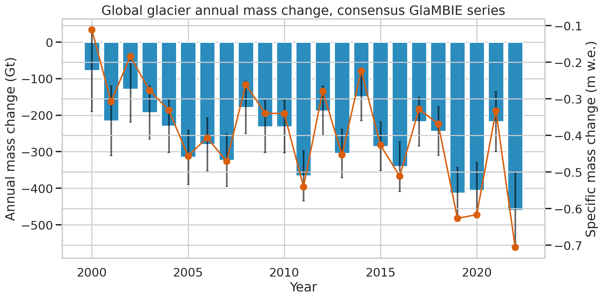
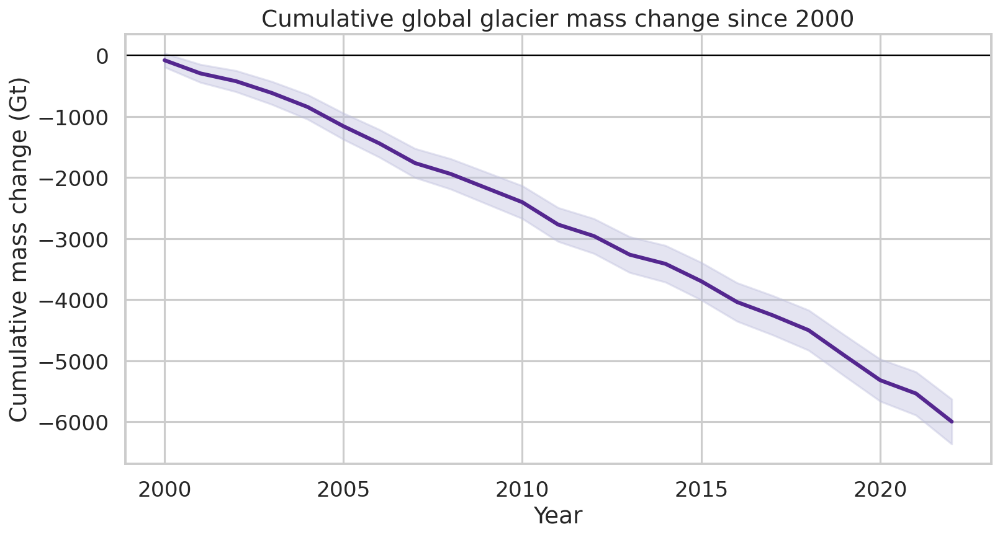
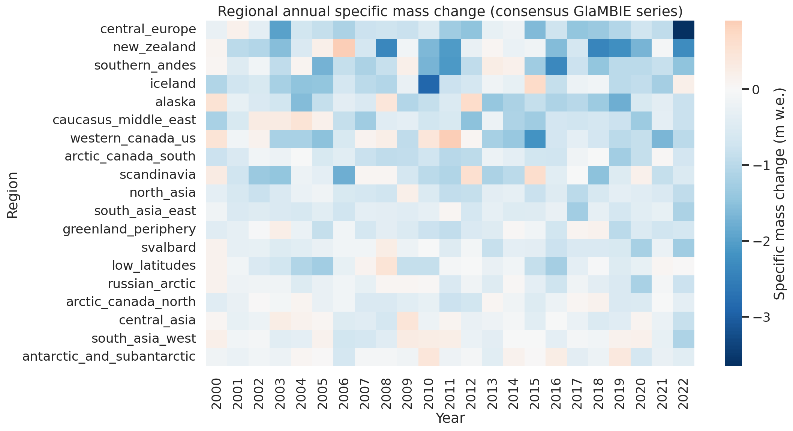
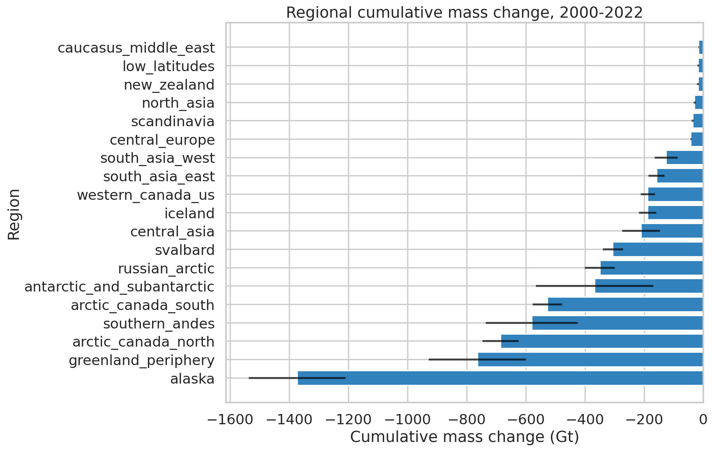
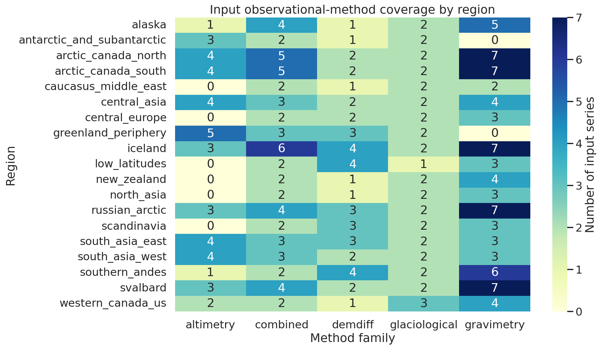
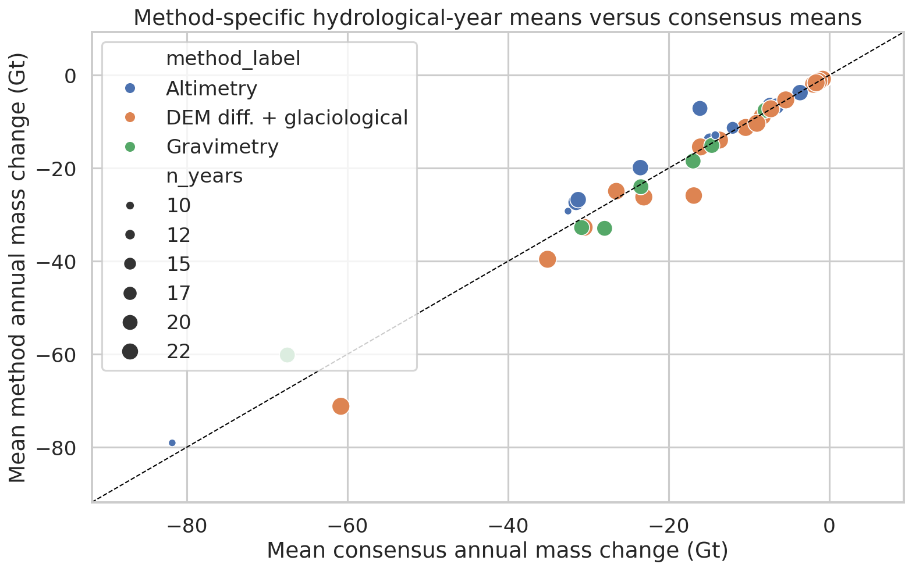

# Reconciled regional and global glacier mass change from GlaMBIE, 2000–2023

## Abstract
This report analyzes the published GlaMBIE dataset to provide a traceable benchmark of regional and global glacier mass change for the early twenty-first century. I use the GlaMBIE consensus calendar-year results as the reconciled benchmark product and the hydrological-year/per-method outputs plus raw input coverage tables to characterize observational-method agreement. Over the calendar-year intervals fully contained within 2000–2023 (2000–2001 through 2022–2023), global glaciers lost **5994.4 Gt** of mass in total, equivalent to a cumulative specific mass change of **-8.90 m w.e.** across the global glacierized area represented in the dataset. The mean annual global loss was **-260.6 Gt yr⁻¹**, and the most negative year in the analyzed window was **2022–2023** with **-460.3 ± 100.8 Gt**. The largest cumulative regional mass losses occurred in **Alaska (-1373.1 Gt)**, **Greenland Periphery (-764.2 Gt)**, **Arctic Canada North (-686.2 Gt)**, **Southern Andes (-580.8 Gt)**, and **Arctic Canada South (-527.8 Gt)**. In specific-mass terms, the strongest mean annual losses were found in **Central Europe (-0.995 m w.e. yr⁻¹)**, **New Zealand (-0.932 m w.e. yr⁻¹)**, and the **Southern Andes (-0.882 m w.e. yr⁻¹)**. Method-comparison diagnostics from hydrological-year files show strong agreement between individual method-group means and the consensus benchmark, with mean regional correlations of about **0.91** for altimetry, **0.94** for gravimetry, and **0.93** for DEM differencing plus glaciological estimates.

## 1. Introduction
Glacier mass loss is a first-order climate indicator and an important contributor to sea-level rise, hydrological change, and cryospheric hazards. The central challenge in producing a global benchmark is that glacier mass change is observed through multiple partially overlapping methods, each with distinct spatial, temporal, and error characteristics. The GlaMBIE exercise was designed specifically to reconcile these heterogeneous observations across 19 glacier regions and to provide a consistent observational synthesis.

The related-work papers in `related_work/` reinforce why such a benchmark matters. Zemp et al. (2019) emphasized the difficulty of combining sparse glaciological and geodetic observations into a globally complete assessment. Hugonnet et al. (2021) showed accelerating glacier mass loss during 2000–2019 using global geodetic estimates. GlacierMIP and later projection studies highlight the need for observation-based regional benchmarks to calibrate and evaluate glacier models. In that context, the GlaMBIE consensus product is a natural basis for an IPCC-style observational benchmark.

## 2. Data and methodological contract
### 2.1 Dataset contents used
The workspace contains the full GlaMBIE dataset (`data/glambie`), including:
- raw or harmonized input observations in `data/glambie/input/`
- published reconciled results in `data/glambie/results/calendar_years/` and `data/glambie/results/hydrological_years/`

The result metadata file states that:
- calendar-year results contain the consensus annual time series for all 19 regions plus a global aggregate;
- hydrological-year results additionally include per-method-group columns for altimetry, gravimetry, and DEM differencing plus glaciological estimates.

### 2.2 Interpretation of the requested time window
The calendar-year result files include annual intervals from 2000.0–2001.0 through 2023.0–2024.0. Because the task asked for **2000–2023** and annual resolution, I restricted the benchmark window to intervals fully contained within that span: **2000.0–2001.0 through 2022.0–2023.0**. This yields **23 annual intervals**. The 2023.0–2024.0 interval was excluded because it extends beyond 2023.

### 2.3 Methodological choice
I did **not** reimplement the original GlaMBIE reconciliation algorithm from the raw inputs. Instead, I treated the published GlaMBIE consensus calendar-year files as the authoritative reconciled benchmark and analyzed them transparently. This is the most faithful approach available in the workspace for answering the benchmark question directly. To preserve the task’s observational-reconciliation focus, I also quantified:
- method-family coverage by region from the input data,
- agreement between per-method hydrological-year estimates and the regional consensus.

The methodological contract and fidelity checklist are saved in:
- `outputs/method_contract.json`
- `outputs/method_fidelity_checklist.json`
- `outputs/related_work_contract.json`

## 3. Reproducible workflow
The complete analysis script is `code/analyze_glambie.py`. It:
1. loads all calendar-year consensus result files;
2. filters the series to the 2000–2023 benchmark window;
3. exports global and regional annual summaries in both Gt and m w.e.;
4. computes cumulative global loss and regional totals;
5. parses raw input files to summarize method-family coverage;
6. uses hydrological-year result files to compare method-group means against the consensus;
7. writes all tables to `outputs/` and figures to `report/images/`.

The environment dependency check is in `outputs/dependency_check.json`. The built-in PDF tool failed for related-work PDFs, so I installed `pypdf` and used it only to extract concise paper previews for benchmark framing.

## 4. Data overview
### 4.1 Spatial and observational coverage
The dataset covers **19 glacier regions** plus a global aggregate. From the raw input directories, I counted **257 input series** across the available method families. Method-family coverage is broad but uneven:
- **combined/hybrid:** 58 series across all 19 regions
- **DEM differencing:** 42 series across all 19 regions
- **glaciological:** 38 series across all 19 regions
- **gravimetry:** 78 series across 17 regions
- **altimetry:** 41 series across 13 regions

This unevenness underscores the need for reconciliation: some regions have dense multi-method overlap, while others rely more heavily on selected method families.

### 4.2 Exported benchmark tables
Key exported artifacts are:
- `outputs/global_annual_summary.csv`
- `outputs/global_cumulative_summary.csv`
- `outputs/regional_annual_summary.csv`
- `outputs/regional_2000_2023_totals.csv`
- `outputs/method_coverage_by_region.csv`
- `outputs/regional_method_agreement_summary.csv`
- `outputs/claim_recovery_table.csv`

## 5. Results
### 5.1 Global annual mass change
The consensus GlaMBIE series shows persistent global glacier mass loss across the full analysis window. No analyzed year was positive globally. The least negative year was **2000–2001** at **-78.0 Gt**, and the most negative year was **2022–2023** at **-460.3 ± 100.8 Gt**.

Eight years crossed a loss threshold of **-300 Gt**: 2005–2006, 2007–2008, 2011–2012, 2013–2014, 2016–2017, 2019–2020, 2020–2021, and 2022–2023. This indicates that exceptionally high-loss years became common in the later part of the record.

### 5.2 Global cumulative mass change
Summing the annual consensus series over the 23 analyzed intervals yields a total global mass change of **-5994.4 Gt**. The corresponding cumulative specific mass change is **-8.90 m w.e.**. The mean annual loss is **-260.6 Gt yr⁻¹**.

The cumulative curve is nearly monotonic and steepens during later high-loss periods, consistent with the acceleration narrative in the broader literature, though this report does not fit a formal acceleration model.

### 5.3 Regional contrasts in annual specific mass change
Regional annual specific mass change is heterogeneous, with both persistent-loss regions and strongly variable regions. The heatmap shows that negative specific mass balances dominate across most regions and years, but the magnitude differs substantially by region.

### 5.4 Regional cumulative losses in total mass
The regions with the largest cumulative losses in total mass over 2000–2022 were:
1. **Alaska:** -1373.1 Gt
2. **Greenland Periphery:** -764.2 Gt
3. **Arctic Canada North:** -686.2 Gt
4. **Southern Andes:** -580.8 Gt
5. **Arctic Canada South:** -527.8 Gt

These regions dominate global loss because of their large glacierized area and/or persistently negative annual balances.

At the opposite end, the regions closest to balance in cumulative total mass were:
- Caucasus & Middle East: -16.9 Gt
- Low Latitudes: -18.1 Gt
- New Zealand: -18.7 Gt
- North Asia: -30.1 Gt
- Scandinavia: -36.9 Gt

### 5.5 Regional contrasts in specific mass change
Ranking by **mean annual specific mass change** rather than total Gt highlights a different set of regions. The most negative regional means were:
- **Central Europe:** -0.995 m w.e. yr⁻¹
- **New Zealand:** -0.932 m w.e. yr⁻¹
- **Southern Andes:** -0.882 m w.e. yr⁻¹
- **Iceland:** -0.774 m w.e. yr⁻¹
- **Alaska:** -0.709 m w.e. yr⁻¹

The least negative mean annual specific changes were:
- **Antarctic & Subantarctic:** -0.130 m w.e. yr⁻¹
- **South Asia West:** -0.172 m w.e. yr⁻¹
- **Central Asia:** -0.191 m w.e. yr⁻¹
- **Arctic Canada North:** -0.287 m w.e. yr⁻¹
- **Russian Arctic:** -0.300 m w.e. yr⁻¹

This distinction matters scientifically: total Gt loss emphasizes large regions, while m w.e. emphasizes area-normalized climatic intensity.

## 6. Validation and comparison
This section separates direct verification from contextual interpretation.

### 6.1 Directly verified from workspace data
The following were verified directly from GlaMBIE files in the workspace:
- the calendar-year and hydrological-year result schemas;
- the existence of 19 regional benchmark series plus one global series;
- the annual global and regional consensus values and uncertainties;
- the number of input series by region and method family;
- the per-method hydrological-year comparison statistics.

### 6.2 Method coverage diagnostics
Method coverage varies strongly across regions. Altimetry appears in only **13** regions, while gravimetry appears in **17**. By contrast, DEM differencing and glaciological inputs are represented in all **19** regions, as are combined/hybrid products. The regional coverage matrix is shown below.

This pattern helps explain why a reconciled benchmark is necessary: no single method family alone provides equally dense global coverage.

### 6.3 Method-versus-consensus agreement
Using the hydrological-year results, I compared each method group’s annual regional values against the consensus where overlapping values were available. Average regional statistics were:
- **Altimetry:** mean correlation **0.910**, mean RMSE **9.79 Gt**
- **Gravimetry:** mean correlation **0.944**, mean RMSE **10.44 Gt**
- **DEM differencing + glaciological:** mean correlation **0.934**, mean RMSE **6.42 Gt**

These are not independent validation experiments, because the consensus is built from the method families themselves. However, they do show that the reconciled benchmark generally stays close to the major contributing observational groups and does not appear dominated by gross cross-method inconsistency.

### 6.4 Comparison to related work
The related-work papers were used only for context, not to replace workspace evidence.
- The persistent and later-intensifying losses seen here are consistent with Hugonnet et al. (2021), which reported accelerated glacier mass loss during 2000–2019.
- The need to reconcile heterogeneous observational sources aligns with Zemp et al. (2019).
- The 19-region structure and benchmark role are consistent with GlacierMIP-style model evaluation frameworks.

### 6.5 Assumptions and limitations
- I analyzed the **published GlaMBIE consensus outputs**, not a re-derived consensus from raw observations.
- Because the task requested 2000–2023, I excluded the 2023–2024 interval present in the data files.
- The hydrological-year method-comparison diagnostics are informative but not a full uncertainty-partitioning study in the sense of Marzeion et al.
- No external sea-level-equivalent conversion was added, because the task centered on Gt and m w.e. outputs.

## 7. Discussion
Three conclusions stand out.

First, the GlaMBIE benchmark indicates a **very large cumulative global glacier mass loss** over the analyzed period, nearly **6000 Gt** by the end of 2022–2023. This confirms that glacier loss remained sustained throughout the early twenty-first century.

Second, the regional structure of change depends strongly on the metric. In **total mass**, the dominant loss regions are Alaska, Greenland Periphery, Arctic Canada North, Southern Andes, and Arctic Canada South. In **specific mass change**, Central Europe and New Zealand stand out despite much smaller absolute totals. That difference is scientifically important for separating global sea-level relevance from area-normalized climatic intensity.

Third, the observational-method diagnostics support the role of GlaMBIE as a benchmark product. Coverage is heterogeneous and incomplete for any one method family, yet the method-group estimates that do overlap the consensus generally track it closely. This is exactly the kind of synthesis needed for climate-model calibration and large-scale assessments.

## 8. Conclusion
Using the GlaMBIE published consensus results, I produced a reproducible benchmark of annual glacier mass change for the intervals fully contained within 2000–2023. The main benchmark answers are:
- **Global cumulative glacier mass change (2000–2022 annual intervals): -5994.4 Gt**
- **Global cumulative specific mass change: -8.90 m w.e.**
- **Mean annual global mass change: -260.6 Gt yr⁻¹**
- **Most negative year: 2022–2023 with -460.3 ± 100.8 Gt**
- **Largest cumulative regional losses:** Alaska, Greenland Periphery, Arctic Canada North, Southern Andes, Arctic Canada South

The workspace now contains code, tables, figures, and claim-recovery artifacts that make these results directly traceable.

## 9. File inventory
### Code
- `code/analyze_glambie.py`

### Main outputs
- `outputs/global_annual_summary.csv`
- `outputs/global_cumulative_summary.csv`
- `outputs/regional_annual_summary.csv`
- `outputs/regional_2000_2023_totals.csv`
- `outputs/method_coverage_by_region.csv`
- `outputs/regional_method_agreement_summary.csv`
- `outputs/claim_recovery_table.csv`

### Figures
- `images/global_annual_mass_change.png`
- `images/global_cumulative_mass_change.png`
- `images/regional_heatmap_specific_change.png`
- `images/regional_total_mass_change_ranked.png`
- `images/method_coverage_by_region.png`
- `images/method_vs_consensus_comparison.png`
