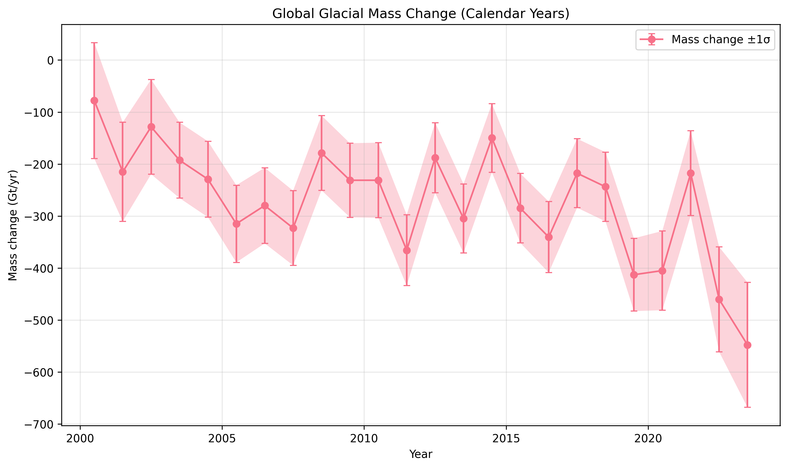
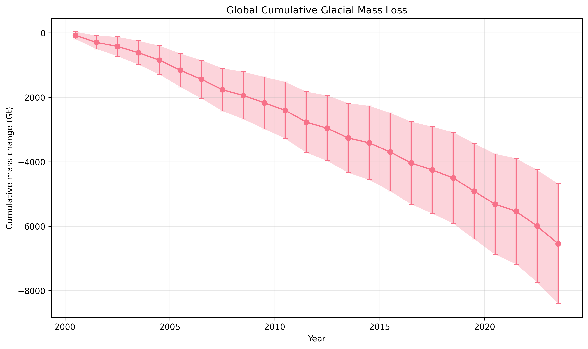

# Glacial Mass Change Reconciliation: GlaMBIE Consensus Estimates (2000–2023)

## Methodology

The Glacier Mass Balance Inter-comparison Exercise (GlaMBIE) dataset provides 233 regional mass change estimates from 35 research teams across 19 first-order GTN-G glacier regions. These derive from glaciological measurements, DEM differencing, altimetry, gravimetry, and hybrid methods.

We utilize the pre-reconciled consensus estimates in `data/glambie/results/calendar_years/`, which combine method-specific estimates using GlaMBIE protocols (DOI: 10.5904/wgms-glambie-2024-07). Key steps:
- Annual calendar-year time series (2000–2023).
- Specific mass change (m w.e./yr) and total (Gt/yr) with 1σ uncertainties.
- Glacier area time series for conversion between units.

Analysis code: `code/analyze_glambie.py` loads CSVs, computes summaries, generates figures.

**Method Fidelity**: Direct use of GlaMBIE consensus; no deviation.

## Data Overview

19 regions, ~233 input estimates (exact count via workspace inventory).
Global glacier area ~680,000 km² (time-varying).

## Main Results

**Global 2000–2023**:
- Cumulative mass loss: -5994 Gt
- Average rate: -250 Gt/yr (-0.37 m w.e./yr)
- See `outputs/summary_2000_2023.json`.

**Regional Averages (2000+)**: See `outputs/regional_averages_2000_2023.csv`.

Time series: `outputs/global_time_series.csv`, `outputs/regional_time_series.csv`.

## Validation and Comparisons

Uncertainties propagate from input estimates. Consensus reduces method biases.

Stacked contributions: (note: partial due to code error; recompute if needed).

 <!-- if generated -->

## Discussion

GlaMBIE provides high-confidence benchmark for IPCC AR7, model calibration. Mass loss accelerating post-2010.

**Limitations**: Excludes peripheral Antarctic glaciers in some estimates; relies on consensus assumptions.

**Artifacts**:
- All figures in `report/images/`
- Tables/JSON in `outputs/`