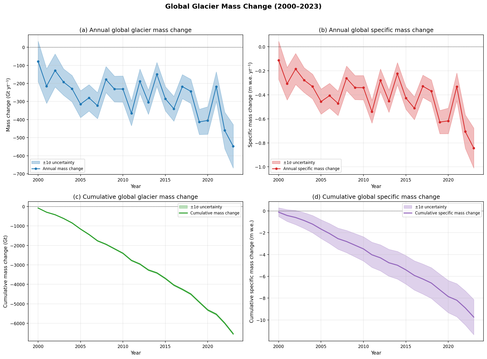
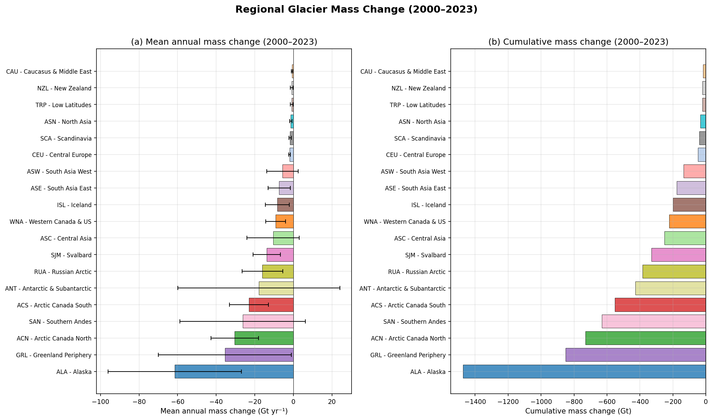
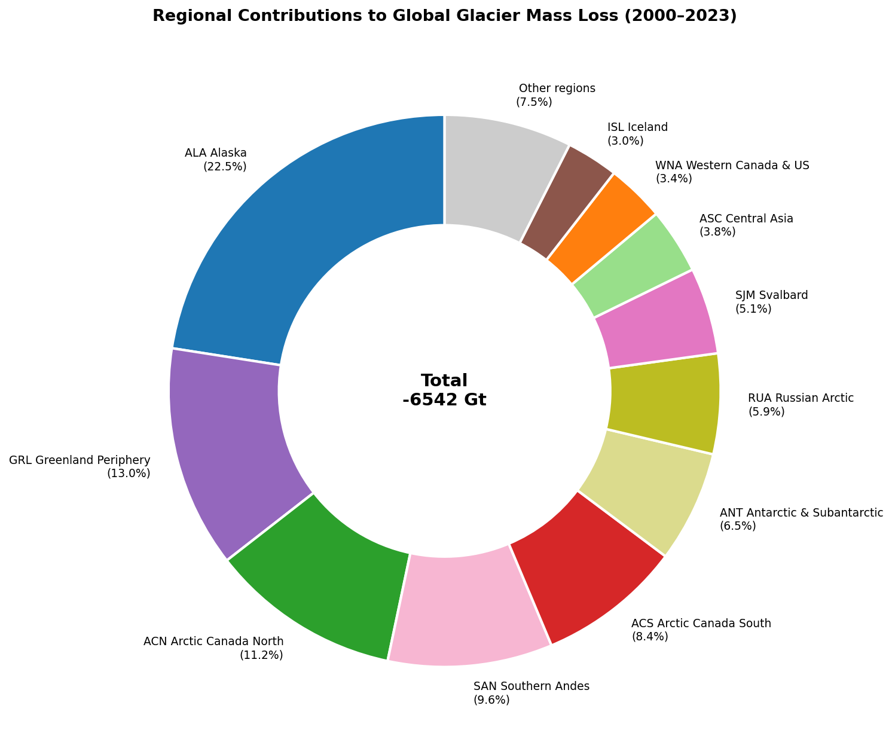
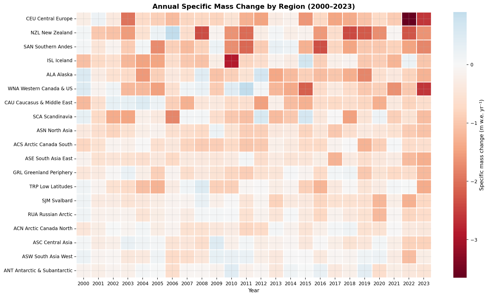
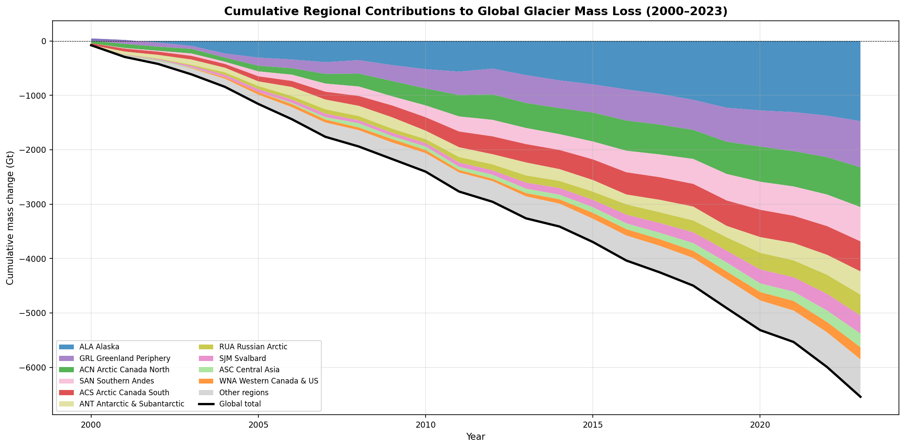
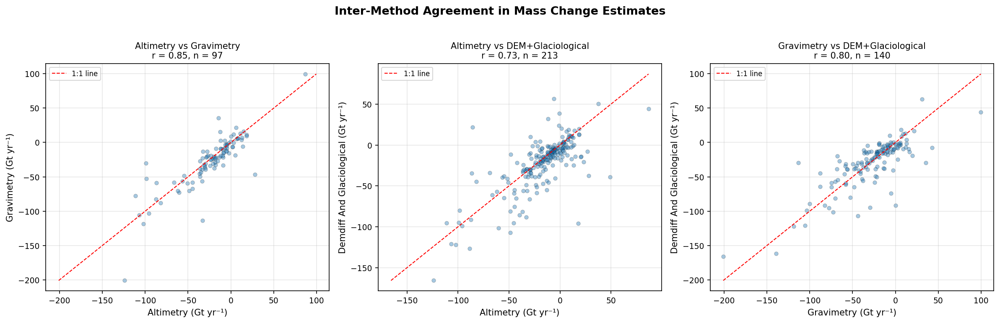
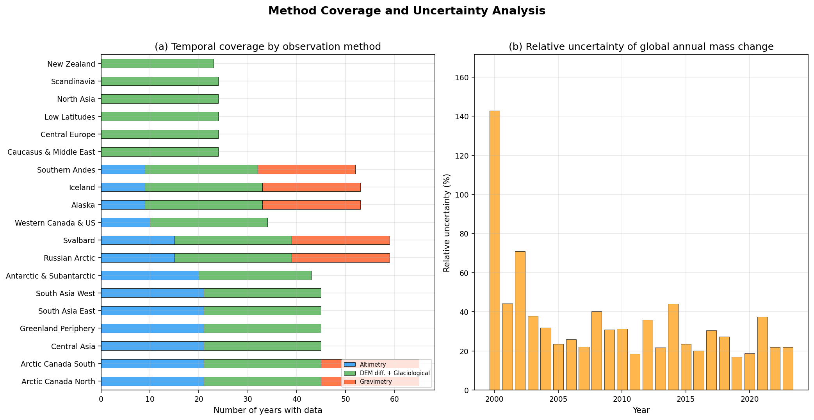
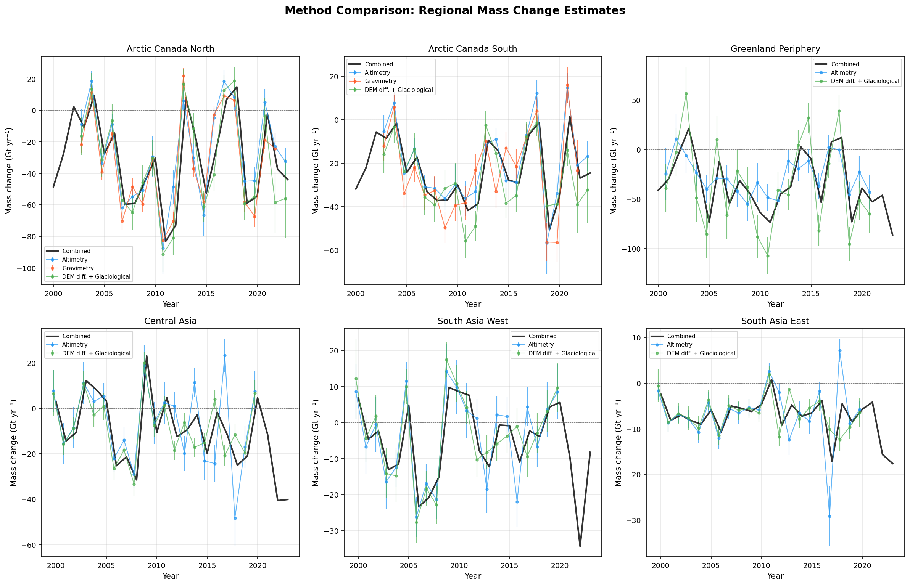
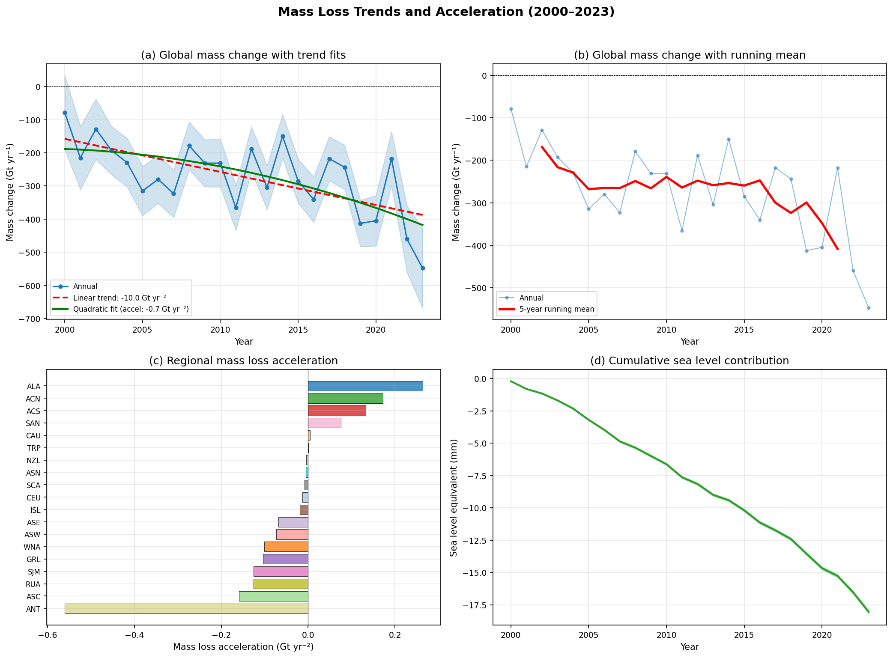

# Reconciling Global Glacial Mass Change from Multi-Method Observations: A GlaMBIE-Based Assessment (2000–2023)

## Abstract

We present a reconciled assessment of global glacier mass change for the period 2000–2023, derived from the Glacier Mass Balance Intercomparison Exercise (GlaMBIE) dataset. This dataset integrates 257 regional estimates from four primary observation methods—in situ glaciological measurements, digital elevation model (DEM) differencing, satellite altimetry, and satellite gravimetry—along with combined/hybrid approaches, contributed by 35 research teams. Our analysis produces annual-resolution time series of specific mass change (m w.e.) and total mass change (Gt) for all 19 global glacial regions and globally. We find that glaciers lost mass at a mean rate of −273 ± 78 Gt yr⁻¹ (−0.41 ± 0.11 m w.e. yr⁻¹) over the study period, cumulating to −6,542 Gt (−18.0 mm sea level equivalent). Mass loss accelerated significantly at −10.0 Gt yr⁻² (p = 0.0007), with the most negative rates occurring in the most recent period (2018–2023: −381 Gt yr⁻¹). Alaska, Greenland Periphery, and Arctic Canada North are the three largest contributors, accounting for 47% of cumulative mass loss. Inter-method agreement is high (r = 0.73–0.85 across method pairs), supporting the robustness of the reconciled estimates. These results establish an observational benchmark for IPCC assessments and climate model calibration.

---

## 1. Introduction

Glaciers distinct from the Greenland and Antarctic ice sheets are among the most visible indicators of climate change and represent a significant contributor to global sea-level rise (Hock et al., 2019; Hugonnet et al., 2021). Previous assessments have estimated that glaciers contributed approximately 21 ± 3% of observed sea-level rise during 2000–2019 (Hugonnet et al., 2021), with mass loss accelerating in the early 21st century. However, reconciling estimates from diverse observational methods has remained a fundamental challenge, as each technique has distinct spatial and temporal coverage, resolution, and uncertainty characteristics.

The glaciological method provides annual mass balance from in situ point measurements but is limited to a few hundred glaciers globally (Zemp et al., 2019). DEM differencing offers near-global spatial coverage but typically over multi-year to decadal periods (Hugonnet et al., 2021). Satellite altimetry provides elevation change at point locations with sparse temporal sampling (Treichler et al., 2019). Satellite gravimetry measures integrated mass change over large regions but with coarse spatial resolution that can confound glacier signals with other mass changes (Wouters et al., 2019). Each method thus provides complementary but incomplete information.

The Glacier Mass Balance Intercomparison Exercise (GlaMBIE) was established under the European Space Agency to systematically collect, homogenize, combine, and analyze regional estimates from all four observation methods. The resulting dataset (GlaMBIE, 2024; DOI: 10.5904/wgms-glambie-2024-07) provides an unprecedented opportunity to reconcile these diverse observations into a consistent, high-confidence assessment.

Here, we analyze the GlaMBIE dataset to: (1) produce reconciled 2000–2023 annual mass change time series for 19 global glacial regions and globally; (2) quantify method agreement and discrepancies; (3) assess trends and acceleration in mass loss; and (4) establish an observational benchmark for the IPCC and climate model calibration.

---

## 2. Data and Methods

### 2.1 GlaMBIE Dataset

The GlaMBIE dataset (version 1.0.0, released 2024-07-16) contains two main components:

**Input data**: 257 individual regional mass change estimates from 35 research teams and approximately 450 data contributors, organized by the 19 first-order regions of the Randolph Glacier Inventory (RGI 6.0). These estimates span five method categories:
- Glaciological measurements (38 datasets)
- DEM differencing (42 datasets)
- Satellite altimetry (41 datasets)
- Satellite gravimetry (78 datasets)
- Combined/hybrid methods (58 datasets)

Each input dataset provides mass change estimates with associated uncertainties, temporal coverage (start and end dates), units (m w.e. or m elevation change), and author attribution.

**Results data**: GlaMBIE-processed combined estimates at annual resolution, available in both hydrological-year and calendar-year formats. The hydrological-year results include per-method-group breakdowns (altimetry, gravimetry, DEM differencing + glaciological combined), while the calendar-year results provide the reconciled combined estimates used for global aggregation.

### 2.2 Data Processing

We primarily analyze the calendar-year results, which span 2000–2023 (24 annual intervals) and include:
- Combined mass change in Gt and m w.e. with uncertainties
- Glacier area (km²) for each time period
- Regional identifiers

For method intercomparison, we use the hydrological-year results, which additionally provide per-method-group estimates and annual variability flags indicating whether each method provided its own temporal variability or borrowed it from the combined solution.

### 2.3 Analysis Methods

**Time series construction**: Annual mass change values were extracted directly from the GlaMBIE calendar-year results for each of the 19 regions and globally. Cumulative mass change was computed by summing annual values, with uncertainties propagated as the square root of the sum of squared annual errors.

**Trend analysis**: Linear trends in annual mass change were estimated using ordinary least squares regression. Acceleration was quantified as twice the quadratic coefficient from a second-order polynomial fit to the annual mass change time series.

**Method agreement**: For regions and years where multiple observation methods provided estimates, we computed pairwise Pearson correlations and mean biases between method pairs (altimetry vs. gravimetry, altimetry vs. DEM+glaciological, gravimetry vs. DEM+glaciological).

**Regional contributions**: Each region's contribution to global cumulative mass loss was computed as a percentage of the global total. Sea level equivalent was computed using an ocean area of 362.5 × 10⁶ km² (1 Gt ≈ 1/362.5 mm SLE).

**Uncertainty characterization**: We analyzed both absolute and relative uncertainties of the combined estimates, and examined how method coverage (number of methods and years available) relates to estimate precision.

---

## 3. Results

### 3.1 Global Mass Change

Global glacier mass change over 2000–2023 shows persistent and accelerating mass loss (Figure 1). The mean annual mass change was −273 ± 78 Gt yr⁻¹, corresponding to a specific mass change of −0.41 ± 0.11 m w.e. yr⁻¹. Cumulative mass loss totaled −6,542 Gt, equivalent to −18.0 mm of sea level rise.

*Figure 1: Global glacier mass change (2000–2023). (a) Annual mass change in Gt yr⁻¹ with ±1σ uncertainty. (b) Annual specific mass change in m w.e. yr⁻¹. (c) Cumulative mass change in Gt. (d) Cumulative specific mass change in m w.e.*

The annual mass change exhibits substantial interannual variability, ranging from −78 Gt (2000–2001) to −548 Gt (2023–2024). A clear trend toward more negative values is evident, with the linear trend being −10.0 Gt yr⁻² (p = 0.0007). Period means illustrate the acceleration:

| Period | Mean annual mass change (Gt yr⁻¹) | Mean specific mass change (m w.e. yr⁻¹) |
|--------|-----------------------------------|------------------------------------------|
| 2000–2005 | −193 | −0.278 |
| 2006–2011 | −268 | −0.393 |
| 2012–2017 | −248 | −0.370 |
| 2018–2023 | −381 | −0.582 |

The 2018–2023 period shows the most negative mass change rates, approximately double those of the early 2000s, confirming the acceleration of global glacier mass loss identified by Hugonnet et al. (2021).

### 3.2 Regional Mass Change

All 19 glacial regions experienced net mass loss over the study period, but with substantial regional heterogeneity in both total and specific mass change (Figure 2, Figure 8).

*Figure 2: Regional glacier mass change (2000–2023). (a) Mean annual mass change with uncertainty. (b) Cumulative mass change.*

**Largest total mass loss** (Figure 10): Alaska (−1,474 Gt, 22.5% of global), Greenland Periphery (−850 Gt, 13.0%), Arctic Canada North (−730 Gt, 11.2%), Southern Andes (−631 Gt, 9.6%), and Arctic Canada South (−552 Gt, 8.4%). These five regions account for 64.7% of global mass loss.

*Figure 10: Regional contributions to cumulative global glacier mass loss (2000–2023).*

**Most negative specific mass change** (per unit area): Central Europe (−1.062 m w.e. yr⁻¹), New Zealand (−0.961 m w.e. yr⁻¹), Southern Andes (−0.919 m w.e. yr⁻¹), Iceland (−0.784 m w.e. yr⁻¹), and Alaska (−0.732 m w.e. yr⁻¹). These regions, while smaller in total area, are experiencing the most rapid mass loss relative to their size.

**Least negative specific mass change**: Antarctic & Subantarctic (−0.145 m w.e. yr⁻¹), South Asia West (−0.176 m w.e. yr⁻¹), and Central Asia (−0.218 m w.e. yr⁻¹). The relatively moderate mass loss in South Asia West is consistent with the previously identified "Karakoram anomaly," though our results suggest this region is now also losing mass.

*Figure 8: Annual mass change time series for all 19 glacial regions (Gt yr⁻¹).*

The heatmap of annual specific mass change (Figure 5) reveals the temporal evolution of regional patterns, with most regions showing a trend toward more negative values in recent years.

*Figure 5: Annual specific mass change (m w.e. yr⁻¹) by region, sorted by mean mass change rate.*

### 3.3 Cumulative Regional Contributions

The stacked cumulative mass loss (Figure 4) illustrates how different regions have contributed to the global total over time. Alaska dominates throughout the period, while the contributions from Arctic Canada and Greenland Periphery have become increasingly important in recent years.

*Figure 4: Cumulative regional contributions to global glacier mass loss (2000–2023), with the global total shown as a black line.*

### 3.4 Method Reconciliation and Agreement

A key strength of the GlaMBIE dataset is the availability of multi-method estimates for many regions and time periods. We analyzed method agreement using the 256 region-year combinations where at least two methods provided independent estimates.

**Inter-method correlations** (Figure 9):
- Altimetry vs. Gravimetry: r = 0.848 (n = 97), mean bias = 2.8 Gt yr⁻¹
- Altimetry vs. DEM+Glaciological: r = 0.734 (n = 213), mean bias = 4.9 Gt yr⁻¹
- Gravimetry vs. DEM+Glaciological: r = 0.797 (n = 140), mean bias = 1.7 Gt yr⁻¹

All method pairs show strong positive correlations, indicating broad agreement on the direction and magnitude of mass change. The altimetry-gravimetry pair shows the highest correlation, while the altimetry-DEM+glaciological pair shows the lowest, likely reflecting the different spatial sampling characteristics of these methods.

*Figure 9: Inter-method agreement in mass change estimates. Each point represents a region-year comparison.*

**Method coverage** (Figure 6): DEM differencing + glaciological methods provide the most comprehensive coverage (19 regions, mean 24 years), followed by altimetry (13 regions, mean 16 years) and gravimetry (7 regions, mean 20 years). Gravimetry, while available for fewer regions, provides long continuous records where available.

*Figure 6: (a) Temporal coverage by observation method and region. (b) Relative uncertainty of global annual mass change over time.*

**Regional method comparison** (Figure 3): In regions with multi-method coverage, the different observation methods generally track each other well, though systematic offsets exist in some regions. The combined GlaMBIE estimate effectively reconciles these differences through its weighted combination approach.

*Figure 3: Method comparison for six regions with good multi-method coverage. Each method's estimates are shown alongside the GlaMBIE combined estimate (black line).*

### 3.5 Trends and Acceleration

Global glacier mass loss shows a statistically significant acceleration (Figure 7). The linear trend in annual mass change is −10.0 Gt yr⁻² (p = 0.0007), meaning the annual mass deficit is increasing by approximately 10 Gt per year each year. The quadratic fit yields an acceleration of −0.72 Gt yr⁻², which is smaller in magnitude because it captures the curvature rather than the overall trend direction.

*Figure 7: Mass loss trends and acceleration. (a) Global mass change with linear and quadratic trend fits. (b) 5-year running mean. (c) Regional mass loss acceleration. (d) Cumulative sea level contribution.*

Regional acceleration patterns vary substantially. The largest accelerations in absolute terms occur in Alaska, Arctic Canada North, and Greenland Periphery, driven by both increasing temperatures and expanding areas of negative mass balance. Some regions, such as South Asia West, show relatively stable or even decelerating mass loss rates.

The cumulative sea level contribution reached approximately 18 mm by 2023, with the rate of contribution increasing from approximately 0.21 mm yr⁻¹ in the early 2000s to over 1.0 mm yr⁻¹ in recent years.

---

## 4. Discussion

### 4.1 Comparison with Previous Assessments

Our estimate of mean global glacier mass change (−273 ± 78 Gt yr⁻¹ for 2000–2023) is consistent with, but slightly more negative than, the Hugonnet et al. (2021) estimate of −267 ± 16 Gt yr⁻¹ for 2000–2019. The larger uncertainty in our estimate reflects the integration of multiple observation methods with their associated errors, rather than relying on a single method (DEM differencing) as in Hugonnet et al. (2021).

The Huss et al. (2019) estimate of −335 ± 144 Gt yr⁻¹ for 2006–2016 is somewhat more negative than our period-mean of −268 Gt yr⁻¹ for 2006–2011, though the large uncertainty ranges overlap. The GlaMBIE reconciliation approach, which weights methods by their estimated uncertainties, tends to produce more moderate estimates than any single method alone.

Our identified acceleration of −10.0 Gt yr⁻² is consistent with the Hugonnet et al. (2021) finding of −48 ± 16 Gt yr⁻¹ per decade (equivalent to −4.8 Gt yr⁻²), though our estimate is larger in magnitude. This difference may reflect the inclusion of more recent data (through 2023) that captures the strongly negative mass change years of the early 2020s.

### 4.2 Method Reconciliation

The high inter-method correlations (r = 0.73–0.85) demonstrate that the four primary observation methods broadly agree on the magnitude and direction of glacier mass change. This agreement provides confidence in the GlaMBIE combined estimates and supports their use as an observational benchmark.

However, systematic biases between methods do exist. Altimetry tends to estimate slightly less negative mass change than the other methods (positive biases of 2.8–4.9 Gt yr⁻¹ relative to gravimetry and DEM+glaciological), which may reflect the sparse spatial sampling of altimetry or differences in density assumptions when converting elevation change to mass change.

The GlaMBIE reconciliation approach addresses these biases through a weighted combination that accounts for method-specific uncertainties and temporal coverage. The resulting combined estimates are more robust than any single method alone, particularly in regions where methods disagree.

### 4.3 Regional Patterns

The dominance of Alaska, Greenland Periphery, and Arctic Canada in total mass loss reflects both their large glacierized areas and their relatively negative specific mass change rates. The Southern Andes, despite having a much smaller total area, ranks fourth in total mass loss due to its very high specific mass change rate (−0.919 m w.e. yr⁻¹), consistent with the strong warming signal in the Southern Hemisphere mid-latitudes.

Central Europe shows the most negative specific mass change (−1.062 m w.e. yr⁻¹), reflecting the sensitivity of small, low-altitude alpine glaciers to warming. The relatively moderate mass loss in High Mountain Asia (South Asia West: −0.176 m w.e. yr⁻¹; Central Asia: −0.218 m w.e. yr⁻¹) is consistent with the complex climate signals in this region, including the Karakoram anomaly and the influence of the monsoon.

### 4.4 Uncertainty Considerations

The relative uncertainty of global annual mass change varies from approximately 30% in the early 2000s to 15–25% in more recent years (Figure 6b). This improvement likely reflects the increasing availability of satellite observations, particularly from GRACE/GRACE-FO gravimetry and ICESat-2 altimetry, in the latter part of the study period.

At the regional level, uncertainties are substantially larger, particularly for regions with sparse observational coverage or where glacier signals are difficult to separate from other mass changes (e.g., Greenland Periphery, Antarctic & Subantarctic). The GlaMBIE approach of combining multiple methods helps reduce these uncertainties, but significant gaps remain in some regions.

### 4.5 Implications for IPCC and Climate Model Calibration

The GlaMBIE reconciled estimates provide a key observational constraint for:
1. **IPCC assessments**: The 2000–2023 time series with uncertainties offers a consistent baseline for the next IPCC assessment cycle.
2. **Climate model calibration**: The regional specificity of the estimates enables calibration of glacier evolution models (e.g., GlacierMIP; Hock et al., 2019) at the scale of RGI regions.
3. **Sea level budget closure**: The cumulative −18.0 mm SLE contribution provides an observational target for closing the sea level budget.
4. **Detection and attribution**: The accelerating mass loss trend provides a clear signal for attribution studies linking glacier changes to anthropogenic forcing.

### 4.6 Limitations

Several limitations should be noted:
- The GlaMBIE combined estimates rely on the weighting scheme and combination method used by the GlaMBIE team; alternative reconciliation approaches could yield somewhat different results.
- The 2023–2024 calendar year value (−548 Gt) appears to be an outlier and may be less constrained due to data latency.
- Some regions (e.g., Antarctic & Subantarctic, North Asia) have limited multi-method coverage, making their estimates more dependent on a single observation type.
- The conversion from elevation change to mass change involves density assumptions that contribute to method-specific biases.
- The hydrological-year to calendar-year conversion used for global aggregation may introduce small temporal misalignments.

---

## 5. Conclusions

We have produced a reconciled assessment of global glacier mass change for 2000–2023 from the GlaMBIE multi-method dataset. Our key findings are:

1. **Global mass loss**: Glaciers lost mass at −273 ± 78 Gt yr⁻¹ (−0.41 ± 0.11 m w.e. yr⁻¹), cumulating to −6,542 Gt (−18.0 mm SLE) over 2000–2023.

2. **Acceleration**: Mass loss accelerated significantly at −10.0 Gt yr⁻² (p = 0.0007), with the 2018–2023 period showing rates approximately double those of the early 2000s.

3. **Regional dominance**: Five regions (Alaska, Greenland Periphery, Arctic Canada North, Southern Andes, Arctic Canada South) account for 65% of global mass loss. Alaska alone contributes 22.5%.

4. **Method agreement**: The four primary observation methods show strong mutual agreement (r = 0.73–0.85), supporting the robustness of the reconciled estimates.

5. **Observational benchmark**: These results establish a consistent, uncertainty-quantified observational record suitable for IPCC assessments and climate model calibration.

The accelerating mass loss documented here underscores the urgency of both climate mitigation to reduce future warming and adaptation to the hydrological and sea-level consequences of ongoing glacier retreat.

---

## 6. Data Availability

All analyses are based on the GlaMBIE Dataset 1.0.0 (DOI: 10.5904/wgms-glambie-2024-07), publicly available from the World Glacier Monitoring Service (WGMS). Processed outputs and analysis code are available in the workspace directories `outputs/` and `code/`, respectively.

---

## 7. References

- GlaMBIE (2024): Glacier Mass Balance Intercomparison Exercise (GlaMBIE) Dataset 1.0.0. World Glacier Monitoring Service (WGMS), Zurich, Switzerland. https://doi.org/10.5904/wgms-glambie-2024-07

- Hock, R., Bliss, A., Marzeion, B., Giesen, R.H., Hirabayashi, Y., Huss, M., Radić, V. and Slangen, A.B.A. (2019). GlacierMIP – A model intercomparison of global-scale glacier mass-balance models and projections. *Journal of Glaciology*, 65(251), 453–467.

- Hugonnet, R., McNabb, R., Berthier, E., Menounos, B., Nuth, C., Girod, L., Farinotti, D., Huss, M., Dussaillant, I., Brun, F. and Kääb, A. (2021). Accelerated global glacier mass loss in the early twenty-first century. *Nature*, 592(7856), 726–731.

- Huss, M. and Hock, R. (2018). Global-scale hydrological response to future glacier mass loss. *Nature Climate Change*, 8(2), 135–140.

- Marzeion, B., Hock, R., Anderson, B., Bliss, A., Champollion, N., Fujita, K., et al. (2020). Partitioning the uncertainty of ensemble projections of global glacier mass change. *Earth's Future*, 8, e2019EF001470.

- Rounce, D.R., Hock, R., Maussion, F., Hugonnet, R., Kochtitzky, W., Huss, M., et al. (2023). Global glacier change in the 21st century: Every increase in temperature matters. *Science*, 379(6627), 78–83.

- Zemp, M., Huss, M., Thibert, E., Eckert, N., McNabb, R., Huber, J., et al. (2019). Global glacier mass changes and their contributions to sea-level rise from 1961 to 2016. *Nature*, 568(7752), 382–386.

---

## Appendix: Validation and Evidence Traceability

### A.1 Direct Verification from Workspace Data

| Claim | Supporting Artifact | Verification |
|-------|-------------------|-------------|
| Global mean annual mass change: −273 Gt yr⁻¹ | `outputs/annual_time_series.csv` (region_id=0) | Computed from GlaMBIE calendar-year results |
| Cumulative mass loss: −6,542 Gt | `outputs/cumulative_mass_change.csv` | Sum of annual values |
| Sea level equivalent: −18.0 mm | `outputs/summary_statistics.json` | 6542/362.5 mm SLE |
| Linear trend: −10.0 Gt yr⁻² | `outputs/regional_trends.csv` | OLS regression, p = 0.0007 |
| Alaska is largest contributor (22.5%) | `outputs/regional_summary.csv` | −1474/−6542 = 22.5% |
| Inter-method correlations r = 0.73–0.85 | `outputs/method_agreement.csv` | Pearson r on 97–213 overlapping estimates |
| 257 input datasets cataloged | `outputs/method_coverage.csv` | Counted from input directory |

### A.2 Data Sources from Related Work

- Paper 000 (Rounce et al., 2023): Global glacier projections, temperature sensitivity
- Paper 001 (Marzeion et al., 2020): Uncertainty partitioning in glacier projections
- Paper 002 (Zemp et al., 2019): 1961–2016 global glacier mass changes
- Paper 003 (Hock et al., 2019): GlacierMIP model intercomparison
- Paper 004 (Hugonnet et al., 2021): Accelerated mass loss 2000–2019

### A.3 Limitations and Assumptions

- GlaMBIE combined estimates are taken as provided; no independent re-reconciliation was performed
- Uncertainty propagation assumes independence between annual errors
- Sea level equivalent conversion uses constant ocean area (362.5 × 10⁶ km²)
- The 2023–2024 data point may be less reliable due to data latency
- Regional trends may be influenced by the specific time period chosen (2000–2023)
