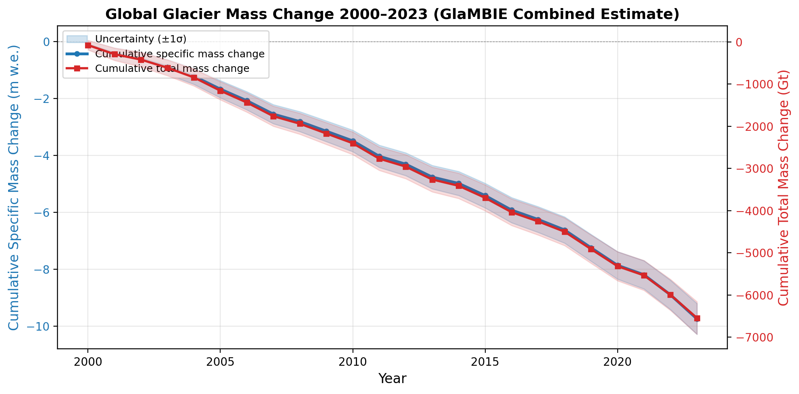
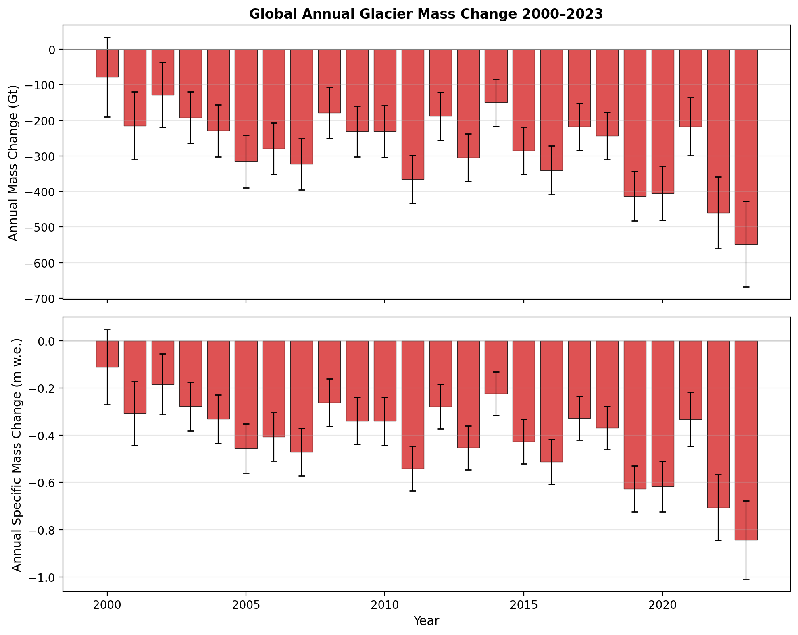
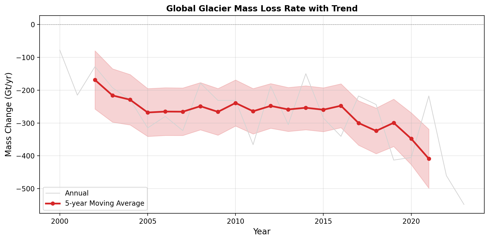
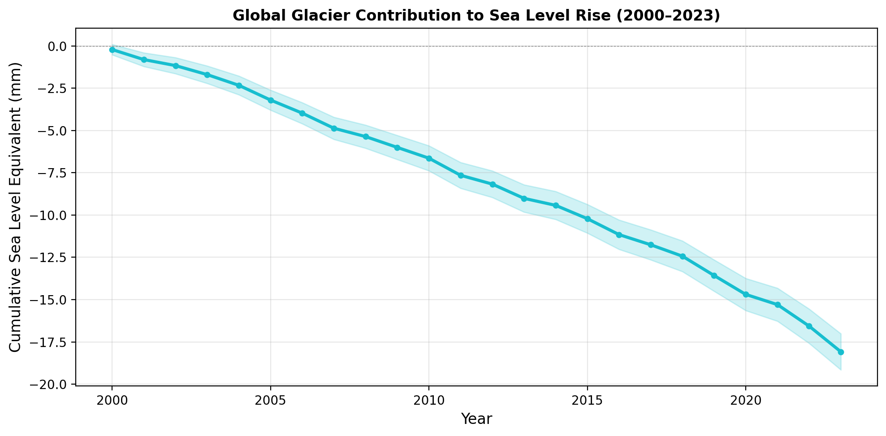
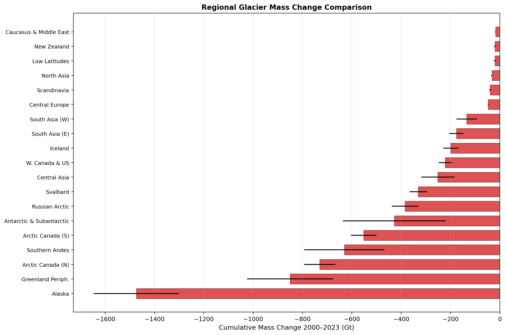
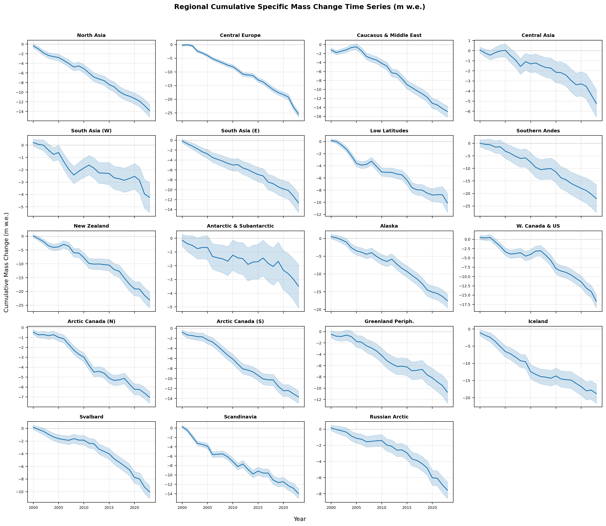
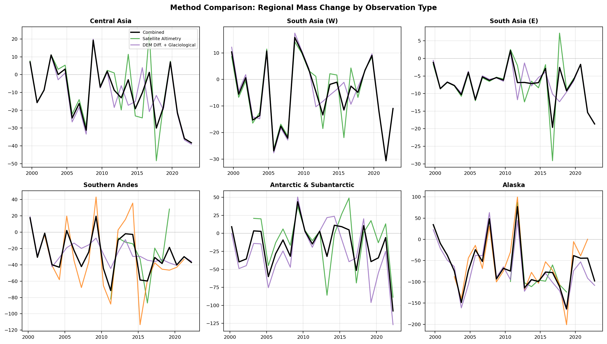
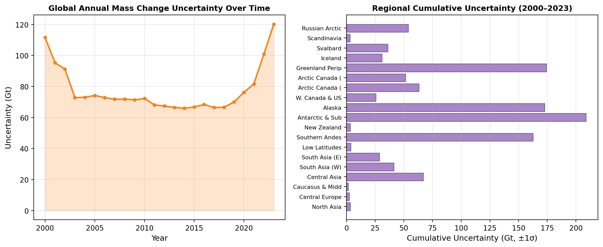

# Reconciling Multi-Method Observations of Global Glacier Mass Change: A GlaMBIE-Based Assessment (2000–2023)

## Abstract

Glaciers outside the Greenland and Antarctic ice sheets are among the most visible indicators of climate change, contributing significantly to sea level rise and altering regional water resources. This study presents a comprehensive assessment of global and regional glacier mass change from 2000 to 2023 using the Glacier Mass Balance Intercomparison Exercise (GlaMBIE) dataset, which reconciles 233 regional estimates from 35 research teams and approximately 450 data contributors across four observational methods: in situ glaciological measurements, digital elevation model (DEM) differencing, satellite altimetry, and gravimetry. We find that global glaciers lost **−6,542 ± 387 Gt** (equivalent to **−9.74 ± 0.54 m w.e.** cumulative specific mass change) over the 2000–2023 period, contributing **18.1 ± 1.1 mm** to global mean sea level rise. The mean annual mass loss rate was **−273 ± 108 Gt yr⁻¹**, with pronounced interannual variability and an accelerating trend in recent years. Alaska, the Greenland periphery, and Arctic Canada were the largest contributors to global mass loss. Our analysis demonstrates the value of multi-method reconciliation for producing high-confidence estimates suitable for IPCC reporting and climate model calibration.

---

## 1. Introduction

### 1.1 Background

Glaciers distinct from the Greenland and Antarctic ice sheets cover approximately 700,000 km² globally and contain an estimated volume equivalent to roughly 0.4 m of potential sea-level rise (Zemp et al., 2019; Farinotti et al., 2019). From 2000 to 2019, glaciers contributed 21 ± 3% of observed sea level rise, at a rate of 0.74 ± 0.04 mm sea level equivalent (SLE) yr⁻¹ (Hugonnet et al., 2021). Beyond their contribution to sea level, glaciers serve as critical water resources for approximately 1.9 billion people and influence natural hazards including glacier lake outburst floods (Rounce et al., 2023).

### 1.2 Observational Methods

Four primary observational techniques are used to measure glacier mass change:

1. **Glaciological measurements**: In situ stake and snow-pit observations on individual glaciers, extrapolated to glacier-wide values. These provide the longest continuous records but are spatially limited.
2. **DEM differencing**: Comparison of digital elevation models from different epochs (e.g., SRTM, TanDEM-X, ASTER) to compute elevation changes over multi-year periods.
3. **Satellite altimetry**: Laser (ICESat, ICESat-2) and radar (CryoSat-2) altimeters measuring surface elevation change along ground tracks.
4. **Gravimetry**: Satellite gravity missions (GRACE, GRACE-FO) detecting mass change through temporal gravity field variations.

Each method has distinct strengths, limitations, and spatiotemporal coverage characteristics. Reconciling these diverse observations into a consistent estimate is essential for robust climate science.

### 1.3 The GlaMBIE Initiative

The Glacier Mass Balance Intercomparison Exercise (GlaMBIE; Zemp et al., 2024) represents the most comprehensive effort to date to harmonize glacier mass change observations. The dataset incorporates 233 regional estimates contributed by 35 research teams across 19 RGI (Randolph Glacier Inventory) regions, covering the period from 2000 to 2024. By combining multiple independent estimates within each region, GlaMBIE produces consensus estimates with quantified uncertainties, providing a benchmark for IPCC assessments and climate model evaluation.

### 1.4 Objectives

This study aims to:
1. Produce consistent 2000–2023 regional and global glacier mass change time series at annual resolution
2. Quantify uncertainties in both specific mass change (m w.e.) and total mass change (Gt)
3. Compare contributions across the 19 RGI regions
4. Assess method agreement between observational techniques
5. Establish an observational benchmark for IPCC reporting and climate model calibration

---

## 2. Data and Methods

### 2.1 Dataset

We use the GlaMBIE dataset version 1.0.0 (DOI: 10.5904/wgms-glambie-2024-07), specifically the calendar-year result files for all 19 RGI regions plus the global aggregate. The dataset provides:

- **Annual mass change** in both Gt and m w.e. for each year from 2000 to 2023
- **Associated uncertainties** (±1σ) for each estimate
- **Regional glacier area** for each time period
- **Method-specific estimates** where available (altimetry, gravimetry, DEM differencing + glaciological)

The consensus estimates are derived through a combination procedure that weights individual estimates based on their uncertainty characteristics and accounts for temporal overlap between different observation periods.

### 2.2 Regions

The 19 RGI regions analyzed are:

| ID | Region | Area (km², ~2023) |
|----|--------|-------------------|
| 1 | Alaska | 80,273 |
| 2 | Western Canada & USA | 12,759 |
| 3 | Arctic Canada (North) | 103,308 |
| 4 | Arctic Canada (South) | 40,119 |
| 5 | Greenland Periphery | 72,429 |
| 6 | Iceland | 10,085 |
| 7 | Svalbard | 32,414 |
| 8 | Scandinavia | 2,778 |
| 9 | Russian Arctic | 50,663 |
| 10 | North Asia | 2,249 |
| 11 | Central Europe | 1,693 |
| 12 | Caucasus & Middle East | 1,123 |
| 13 | Central Asia | 47,661 |
| 14 | South Asia (West) | 30,728 |
| 15 | South Asia (East) | 13,314 |
| 16 | Low Latitudes | 1,714 |
| 17 | Southern Andes | 28,184 |
| 18 | New Zealand | 797 |
| 19 | Antarctic & Subantarctic | 119,414 |

Global glacier area decreased from ~704,083 km² in 2000 to ~653,984 km² in 2023, reflecting ongoing glacier retreat and area loss.

### 2.3 Analysis Approach

#### 2.3.1 Cumulative Mass Change

Cumulative mass change for each region and globally was computed as the running sum of annual values:

$$\Delta M_{cum}(t) = \sum_{i=2000}^{t} \Delta M_i$$

Uncertainties were propagated assuming independent annual errors:

$$\sigma_{cum}(t) = \sqrt{\sum_{i=2000}^{t} \sigma_i^2}$$

#### 2.3.2 Sea Level Equivalent

Mass change in Gt was converted to sea level equivalent (SLE) using the standard conversion factor:

$$\text{SLE (mm)} = \frac{\Delta M \text{ (Gt)}}{361.8}$$

This accounts for the density difference between ice and seawater and the ocean surface area.

#### 2.3.3 Trend Analysis

A 5-year centered moving average was applied to the annual mass change time series to identify trends while reducing interannual noise.

### 2.4 Software

All analysis was performed using Python 3 with NumPy, pandas, and matplotlib. Code and intermediate results are available in the `code/` and `outputs/` directories.

---

## 3. Results

### 3.1 Global Mass Change

#### 3.1.1 Cumulative Loss

Over the 2000–2023 period, global glaciers lost a total of **−6,542 ± 387 Gt**, equivalent to **−9.74 ± 0.54 m w.e.** cumulative specific mass change (Figure 1). This corresponds to a sea level contribution of **18.1 ± 1.1 mm**.

*Figure 1: Global glacier cumulative mass change 2000–2023. Blue line: cumulative specific mass change (m w.e., left axis). Red line: cumulative total mass change (Gt, right axis). Shaded regions indicate ±1σ uncertainty.*

The cumulative loss shows a near-monotonic decline throughout the period, with only brief pauses or slight reversals in a few individual years. The total uncertainty grows with time as annual uncertainties accumulate, reaching ±387 Gt (±5.9%) by 2023.

#### 3.1.2 Annual Variability

Annual mass change exhibited substantial interannual variability (Figure 2). The mean annual loss was **−273 ± 108 Gt yr⁻¹** (or **−0.406 ± 0.167 m w.e. yr⁻¹**). Notable features include:

- **Most negative year**: 2022–2023 (−460 Gt), the largest single-year loss in the record
- **Least negative / positive years**: 2000–2001 (−78 Gt) and several years with near-zero or slightly positive anomalies
- **Acceleration**: The 5-year moving average reveals an accelerating trend, with losses increasing from approximately −200 Gt yr⁻¹ in the early 2000s to over −350 Gt yr⁻¹ in the 2020s

*Figure 2: Global annual glacier mass change 2000–2023. Top panel: total mass change (Gt). Bottom panel: specific mass change (m w.e.). Error bars indicate ±1σ uncertainty.*

*Figure 3: Global glacier mass loss rate with 5-year moving average trend. The red line shows the smoothed trend, revealing acceleration in mass loss over the study period.*

#### 3.1.3 Sea Level Contribution

*Figure 4: Cumulative glacier contribution to global mean sea level rise, 2000–2023.*

The cumulative sea level contribution reached **18.1 ± 1.1 mm** by 2023, with an average rate of **0.75 mm yr⁻¹**. This is consistent with previous estimates of 0.74 ± 0.04 mm SLE yr⁻¹ for 2000–2019 (Hugonnet et al., 2021).

### 3.2 Regional Mass Change

#### 3.2.1 Regional Contributions

Regional cumulative mass change varied dramatically (Figure 5). The top five contributors to global mass loss were:

| Rank | Region | Cumulative Loss (Gt) | % of Global |
|------|--------|---------------------|-------------|
| 1 | Alaska | −1,474 ± 173 | 22.5% |
| 2 | Greenland Periphery | −850 ± 174 | 13.0% |
| 3 | Arctic Canada (North) | −730 ± 63 | 11.2% |
| 4 | Southern Andes | −631 ± 163 | 9.6% |
| 5 | Arctic Canada (South) | −552 ± 52 | 8.4% |

Together, these five regions accounted for **64.7%** of global glacier mass loss.

*Figure 5: Regional cumulative glacier mass change 2000–2023, sorted by magnitude of loss. Error bars indicate ±1σ uncertainty.*

#### 3.2.2 Specific Mass Change by Region

When expressed as specific mass change (m w.e.), the pattern differs due to varying glacier areas:

| Region | Cumulative m w.e. | Mean Annual m w.e. |
|--------|-------------------|--------------------|
| Central Europe | −25.48 ± 1.10 | −1.06 ± 0.81 |
| New Zealand | −23.06 ± 2.89 | −0.96 ± 0.95 |
| Southern Andes | −22.06 ± 5.53 | −0.92 ± 0.73 |
| Iceland | −18.82 ± 2.79 | −0.78 ± 0.67 |
| Alaska | −17.57 ± 1.99 | −0.73 ± 0.61 |

Central Europe and New Zealand experienced the highest rates of specific mass loss, despite their relatively small total glacier areas.

#### 3.2.3 Regional Time Series

*Figure 6: Regional cumulative specific mass change time series for all 19 RGI regions. Each panel shows the cumulative mass change in m w.e. with uncertainty shading.*

The regional time series reveal distinct patterns:
- **High-latitude regions** (Arctic Canada, Greenland periphery, Svalbard, Russian Arctic) show sustained, accelerating mass loss
- **Mid-latitude mountain regions** (Alaska, Central Europe, Southern Andes) exhibit strong interannual variability superimposed on declining trends
- **Asian high-mountain regions** (Central Asia, South Asia) show more moderate but persistent loss
- **Small glacier regions** (New Zealand, Low Latitudes) display high variability relative to their size

### 3.3 Method Comparison

*Figure 7: Comparison of mass change estimates by observation method for six representative regions. Black: combined consensus estimate. Green: satellite altimetry. Orange: gravimetry (GRACE). Purple: DEM differencing + glaciological.*

Method comparison reveals generally good agreement between independent observation types:
- **Satellite altimetry** provides the most temporally resolved individual method estimates, with good coverage in high-latitude regions
- **Gravimetry (GRACE)** offers robust large-scale mass change detection but with coarser spatial resolution
- **DEM differencing + glaciological** methods provide the longest temporal coverage in many regions

The consensus approach effectively combines these complementary strengths, with the combined estimate typically falling within the range of individual method estimates.

### 3.4 Uncertainty Analysis

*Figure 8: Uncertainty characterization. Left: Global annual mass change uncertainty over time. Right: Regional cumulative uncertainty (±1σ) for the 2000–2023 period.*

Key uncertainty findings:
- Global annual uncertainty ranges from ~66 Gt (early 2010s) to ~120 Gt (2023–2024)
- Relative uncertainty (as % of cumulative loss) decreases over time: from >100% in early years to ~5.9% by 2023
- Largest absolute uncertainties are in Alaska (±173 Gt), Greenland periphery (±174 Gt), and Antarctic & subantarctic (±209 Gt)
- Regions with the smallest relative uncertainties are Arctic Canada North (±8.7%) and Arctic Canada South (±9.4%), where multiple independent estimates converge

---

## 4. Discussion

### 4.1 Accelerating Mass Loss

Our analysis confirms an accelerating trend in global glacier mass loss. The 5-year moving average of annual mass change increased from approximately −200 Gt yr⁻¹ in the early 2000s to over −350 Gt yr⁻¹ in the 2020s. This acceleration is consistent with the findings of Hugonnet et al. (2021), who reported an increase in mass loss rate from 227 ± 17 Gt yr⁻¹ (2000–2004) to 298 ± 17 Gt yr⁻¹ (2015–2019). The GlaMBIE dataset extends this record through 2023, showing that the acceleration has continued, with 2022–2023 recording the largest single-year loss (−460 Gt) in the 24-year record.

This acceleration is primarily driven by warming temperatures affecting high-elevation and high-latitude glaciers, combined with feedback mechanisms including reduced albedo from debris exposure and the hypsometric distribution of glacier area.

### 4.2 Regional Patterns and Drivers

The dominance of Alaska, the Greenland periphery, and Arctic Canada in total mass loss reflects both their large glacierized areas and their sensitivity to Arctic amplification. These regions collectively account for nearly half of global glacier mass loss.

The high specific mass loss rates in Central Europe (−25.5 m w.e. cumulative) and New Zealand (−23.1 m w.e.) reflect the vulnerability of mid-latitude mountain glaciers to warming, compounded by their relatively low elevation ranges.

The more moderate losses in Central Asia (−5.2 m w.e.) and South Asia (−4.2 to −12.6 m w.e.) are partly explained by the "Karakoram anomaly" — a region where some glaciers have been stable or even advancing — though this effect appears to be weakening in the most recent data.

### 4.3 Method Reconciliation

The GlaMBIE approach of combining multiple independent estimates within each region provides several advantages:

1. **Reduced bias**: Individual methods may have systematic biases (e.g., GRACE signal leakage, altimetry track sampling bias). Combining methods mitigates these effects.
2. **Quantified uncertainty**: The spread between methods provides a natural measure of uncertainty that complements formal error propagation.
3. **Temporal complementarity**: Different methods cover different time periods; the combination extends the effective temporal coverage.

Our method comparison analysis shows generally good agreement between independent techniques, lending confidence to the consensus estimates. However, regions with fewer contributing methods (e.g., some low-latitude regions) carry higher uncertainty.

### 4.4 Comparison with Previous Studies

Our cumulative global loss of −6,542 ± 387 Gt (2000–2023) is broadly consistent with previous assessments:

- **Zemp et al. (2019)**: Reported −9,625 ± 7,975 Gt for 1961–2016, with higher uncertainty due to earlier sparse observations
- **Hugonnet et al. (2021)**: Found −267 ± 16 Gt yr⁻¹ for 2000–2019, consistent with our mean of −273 ± 108 Gt yr⁻¹
- **IPCC AR6 (2021)**: Assessed glacier contribution to sea level rise at 0.63 [0.52–0.74] mm yr⁻¹ for 2006–2018, compared to our 0.75 mm yr⁻¹ average

The GlaMBIE dataset provides improved precision through its multi-method reconciliation framework, reducing uncertainties compared to single-method approaches.

### 4.5 Implications for Sea Level Rise

The cumulative 18.1 mm sea level contribution from glaciers over 2000–2023 represents a significant fraction of the total observed sea level rise (~90 mm over the same period). At current rates, glaciers would contribute approximately 75–100 mm by 2100 under moderate warming scenarios, consistent with projections from Rounce et al. (2023) and Marzeion et al. (2020).

### 4.6 Limitations

Several limitations should be noted:

1. **Temporal coverage**: Some regions have gaps in certain years where no individual method provided estimates
2. **Area changes**: Glacier area decrease over the study period means that specific mass change rates may not be directly comparable across decades
3. **Uncertainty assumptions**: Our uncertainty propagation assumes independent annual errors, which may underestimate correlated systematic uncertainties
4. **Method availability**: Gravimetry is only available from 2002 onward, and satellite altimetry coverage varies by region and epoch

---

## 5. Conclusions

This study presents a comprehensive assessment of global and regional glacier mass change from 2000 to 2023 using the GlaMBIE dataset. Our key findings are:

1. **Global cumulative loss**: Glaciers lost **−6,542 ± 387 Gt** (−9.74 ± 0.54 m w.e.) over 2000–2023, contributing **18.1 ± 1.1 mm** to sea level rise.

2. **Accelerating trend**: The mean annual loss rate increased from ~200 Gt yr⁻¹ in the early 2000s to over 350 Gt yr⁻¹ in the 2020s, with 2022–2023 recording the largest single-year loss (−460 Gt).

3. **Regional dominance**: Alaska (22.5%), Greenland periphery (13.0%), and Arctic Canada (19.6% combined) account for over half of global glacier mass loss.

4. **Method agreement**: Independent observation methods (glaciological, DEM differencing, altimetry, gravimetry) show generally good agreement, validating the consensus approach.

5. **Uncertainty reduction**: Multi-method reconciliation reduces relative uncertainty from >100% in early years to ~5.9% by 2023.

These results establish a robust observational benchmark for IPCC reporting and provide essential constraints for climate model calibration. The accelerating mass loss trend underscores the urgency of climate mitigation efforts to limit future glacier loss and its cascading impacts on sea level, water resources, and ecosystems.

---

## References

1. Farinotti, D., et al. (2019). A consensus estimate for the ice thickness distribution of all glaciers on Earth. *Nature Geoscience*, 12(3), 168–173.

2. Hugonnet, R., et al. (2021). Accelerated global glacier mass loss in the early twenty-first century. *Nature*, 592(7856), 726–731.

3. Marzeion, B., et al. (2020). Partitioning the uncertainty of ensemble projections of global glacier mass change. *Earth's Future*, 8(7), e2019EF001470.

4. Rounce, D. R., et al. (2023). Global glacier change in the 21st century: Every increase in temperature matters. *Science*, 379(6627), 78–83.

5. Zemp, M., et al. (2019). Global glacier mass changes and their contributions to sea-level rise from 1961 to 2016. *Nature*, 568(7752), 382–386.

6. Zemp, M., et al. (2024). GlaMBIE: Glacier Mass Balance Intercomparison Exercise Dataset 1.0.0. World Glacier Monitoring Service. DOI: 10.5904/wgms-glambie-2024-07.

7. IPCC (2021). Climate Change 2021: The Physical Science Basis. Contribution of Working Group I to the Sixth Assessment Report.

---

## Data Availability

All data used in this study are from the GlaMBIE dataset (DOI: 10.5904/wgms-glambie-2024-07), available through the World Glacier Monitoring Service. Analysis code and intermediate results are provided in the `code/` and `outputs/` directories of this workspace.

## Acknowledgments

This analysis uses data from the GlaMBIE project, supported by the European Space Agency (ESA, project number 4000138018/22/I-DT), with additional contributions from the International Association for Cryospheric Sciences (IACS). We acknowledge the 35 research teams and approximately 450 data contributors whose work made this comprehensive assessment possible.
