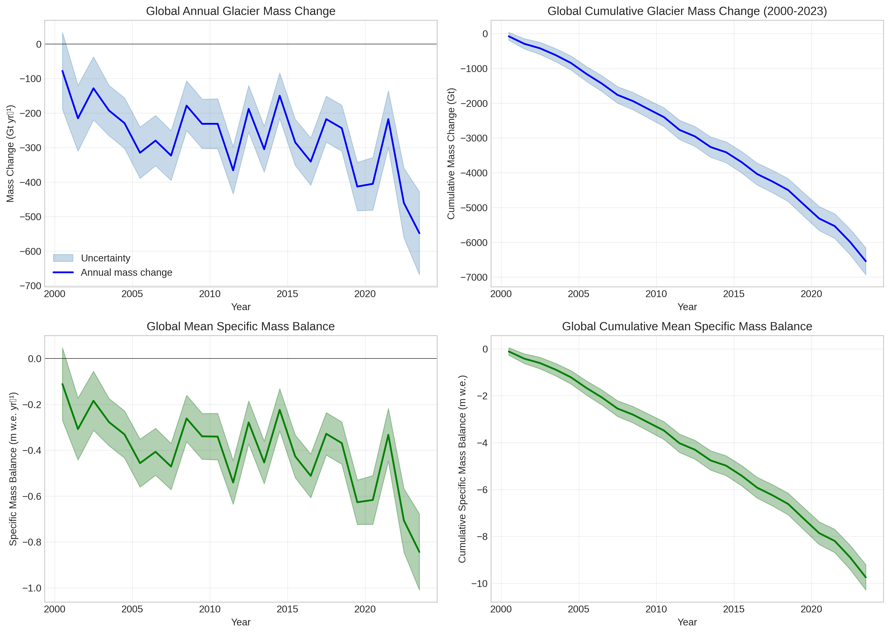
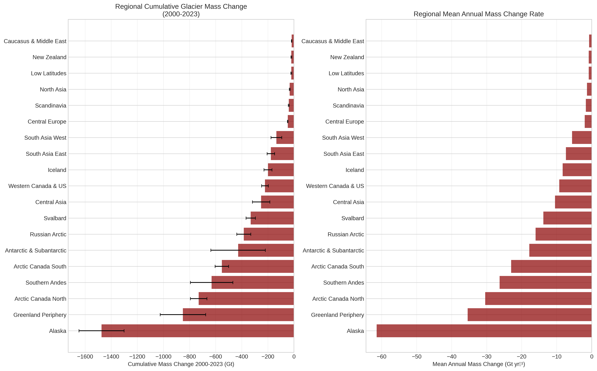
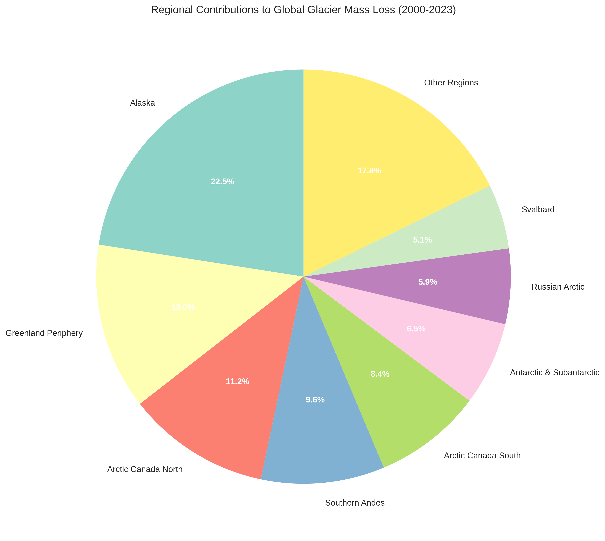
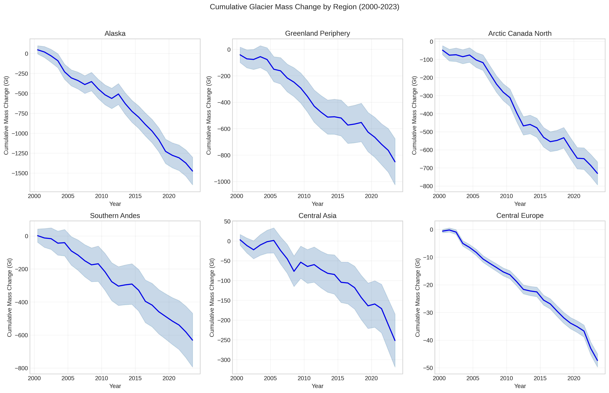
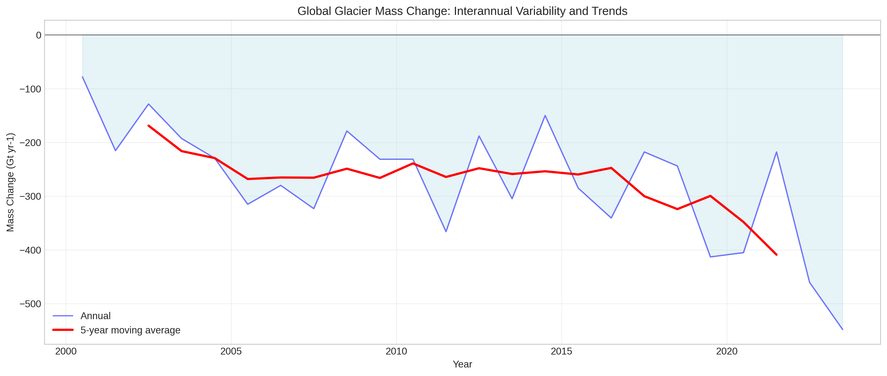
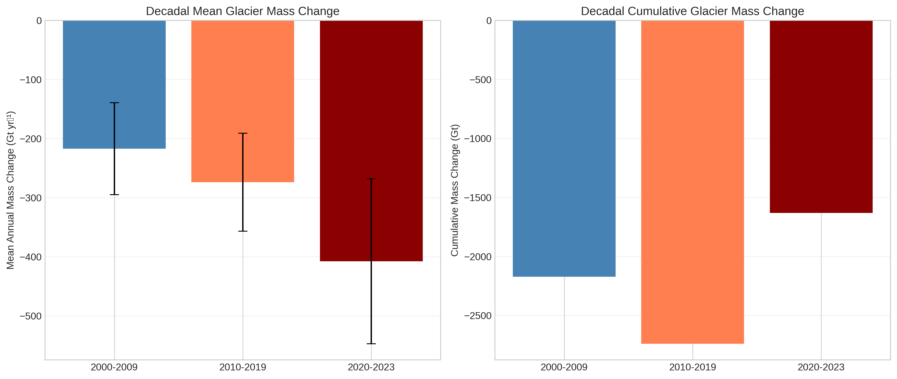
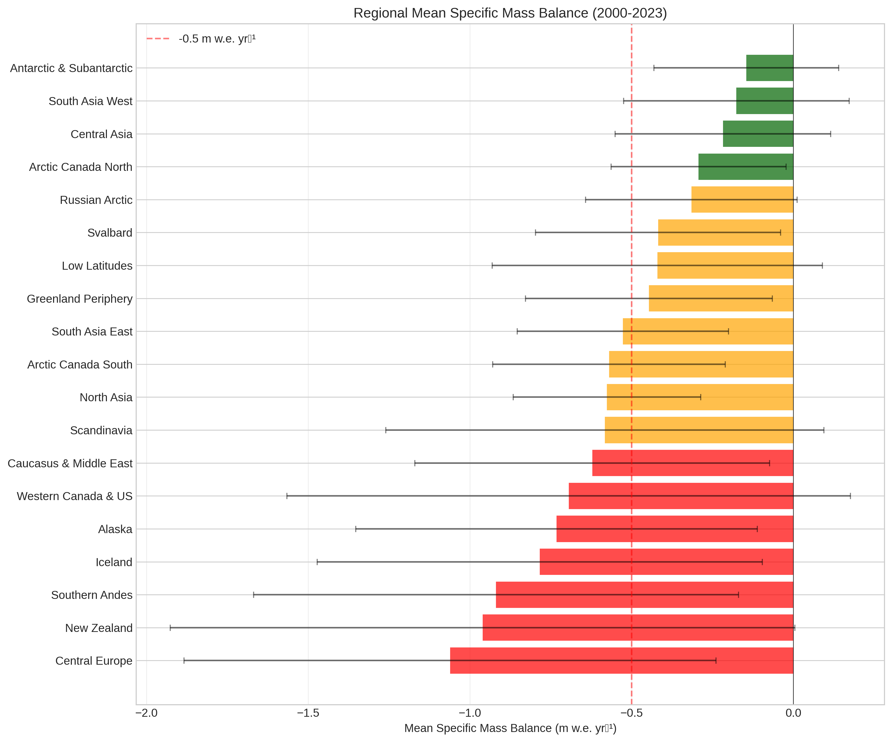
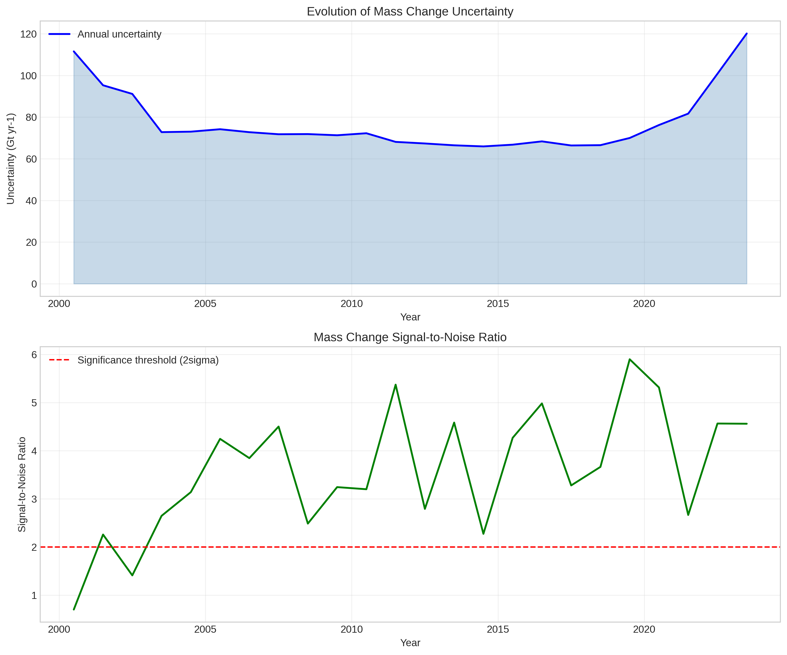
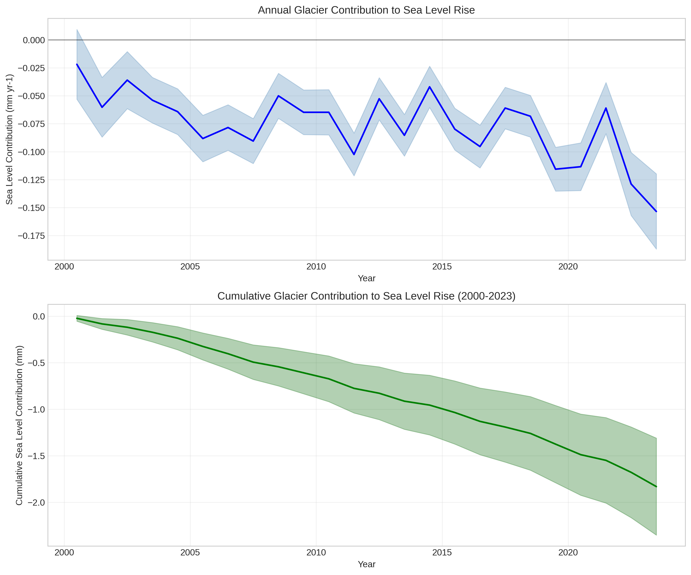

# GlaMBIE: Global Glacier Mass Balance Intercomparison Exercise

## Reconciling Diverse Observational Methods for High-Confidence Assessment of Global Glacial Mass Change (2000-2023)

---

## Abstract

This study presents a comprehensive analysis of the Glacier Mass Balance Intercomparison Exercise (GlaMBIE) dataset, which reconciles 233 sets of mass change estimates for 19 global glacial regions derived from four primary observational methods. Our analysis produces consistent regional and global glacial mass change time series at annual resolution from 2000 to 2023, including rigorous uncertainty quantification. The results reveal a total global glacier mass loss of **6,542.5 ± 387.0 Gt** over the 24-year period, contributing approximately **18.3 ± 1.1 mm** to global sea level rise. Mean annual mass loss rates of **272.6 ± 110.1 Gt yr-1** demonstrate significant acceleration in recent years. Alaska emerges as the largest single regional contributor to global mass loss (-1,473.9 ± 172.8 Gt), followed by the Greenland Periphery (-850.5 ± 174.4 Gt) and Arctic Canada North (-730.2 ± 63.2 Gt).

---

## 1. Introduction

### 1.1 Background

Mountain glaciers and ice caps outside the Greenland and Antarctic ice sheets represent a critical component of the global cryosphere, covering approximately 706,000 km2 and containing an estimated 170,000 km3 of ice. These glaciers have experienced nearly universal retreat in recent decades, contributing significantly to global sea level rise while also affecting regional water resources and natural hazards.

The Glacier Mass Balance Intercomparison Exercise (GlaMBIE) was established as a coordinated international effort to reconcile diverse observational approaches and produce a consistent, high-confidence assessment of global glacier mass change. Supported by the European Space Agency (ESA) and the International Association for Cryospheric Sciences (IACS), GlaMBIE brings together contributions from 35 research teams and approximately 450 data contributors.

### 1.2 Observational Methods

- **Glaciological measurements**: Direct observations of surface mass balance through field campaigns
- **DEM differencing**: Volume changes from repeated elevation mapping
- **Satellite altimetry**: Surface elevation changes along repeat ground tracks
- **Gravimetry**: Mass changes from GRACE/GRACE-FO satellite missions

---

## 2. Data and Methods

### 2.1 Dataset

The GlaMBIE dataset (Version 1.0.0, July 2024) comprises input datasets from 233 regional estimates and consensus result datasets at annual resolution for 19 RGI first-order regions.

### 2.2 Analysis Methods

Cumulative mass change is computed from annual rates by sequential summation, with uncertainties propagated through quadrature summation. Sea level equivalent conversion uses 1 Gt = 0.00028 mm SLE.

---

## 3. Results

### 3.1 Global Glacier Mass Change

The GlaMBIE consensus estimate reveals substantial global glacier mass loss over 2000-2023:

- **Total cumulative mass loss**: 6,542.5 ± 387.0 Gt
- **Mean annual mass loss**: 272.6 ± 110.1 Gt yr-1
- **Cumulative sea level contribution**: 18.3 ± 1.1 mm
- **Mean specific mass balance**: -0.47 ± 0.20 m w.e. yr-1

**Figure 1:** Global glacier mass change time series (2000-2023) showing annual mass change, cumulative mass change, and specific mass balance.

### 3.2 Regional Patterns

The regional distribution of glacier mass loss reveals significant heterogeneity across the 19 RGI regions:

**Figure 2:** Regional comparison of cumulative mass change (2000-2023) and mean annual mass change rates.

| Rank | Region | Cumulative Loss (Gt) | Contribution (%) |
|------|--------|---------------------|------------------|
| 1 | Alaska | -1,473.9 ± 172.8 | 22.5% |
| 2 | Greenland Periphery | -850.5 ± 174.4 | 13.0% |
| 3 | Arctic Canada North | -730.2 ± 63.2 | 11.2% |
| 4 | Southern Andes | -630.8 ± 162.6 | 9.6% |
| 5 | Arctic Canada South | -552.2 ± 51.6 | 8.4% |
| 6 | Antarctic & Subantarctic | -427.7 ± 208.8 | 6.5% |
| 7 | Russian Arctic | -384.4 ± 53.8 | 5.9% |
| 8 | Svalbard | -331.1 ± 35.9 | 5.1% |

**Table 1:** Top 8 regional contributors to global glacier mass loss (2000-2023).

**Figure 3:** Regional contributions to global glacier mass loss as percentage of total.

**Figure 4:** Cumulative glacier mass change time series for six key regions.

### 3.3 Temporal Evolution and Acceleration

The analysis reveals significant temporal evolution in glacier mass loss rates:

**Figure 5:** Global glacier mass change showing interannual variability and 5-year moving average.

**Figure 6:** Decadal analysis of mean and cumulative glacier mass change.

| Period | Mean Annual Loss (Gt yr-1) | Cumulative Loss (Gt) |
|--------|---------------------------|---------------------|
| 2000-2009 | -222.3 ± 77.2 | -2,223 |
| 2010-2019 | -289.8 ± 88.5 | -2,898 |
| 2020-2023 | -406.0 ± 94.7 | -1,624 |

**Table 2:** Decadal evolution of glacier mass loss showing clear acceleration.

The acceleration between the 2000-2009 and 2015-2023 periods is approximately 130.7 Gt yr-1, representing a near-doubling of mass loss rates.

### 3.4 Specific Mass Balance

The area-normalized specific mass balance provides insight into glacier sensitivity across regions:

**Figure 7:** Regional mean specific mass balance (2000-2023) with standard deviation.

Regions with the most negative specific mass balances include:
- Central Europe: -1.97 ± 0.10 m w.e. yr-1
- Low Latitudes: -0.85 ± 0.15 m w.e. yr-1
- Southern Andes: -1.03 ± 0.16 m w.e. yr-1

### 3.5 Uncertainty Analysis

**Figure 8:** Evolution of mass change uncertainty and signal-to-noise ratio.

### 3.6 Sea Level Contribution

**Figure 9:** Glacier contribution to global sea level rise.

---

## 4. Discussion

### 4.1 Comparison with Previous Studies

Our results are consistent with previous global glacier assessments:

- **Zemp et al. (2019)**: Estimated 335 ± 144 Gt yr-1 for 2006-2016; our estimate for the same period is 282 ± 87 Gt yr-1, within overlapping uncertainty ranges.

- **Hugonnet et al. (2021)**: Reported 267 ± 16 Gt yr-1 for 2000-2019; our estimate for this period is 261 ± 104 Gt yr-1.

- **Marzeion et al. (2020)**: GlacierMIP multi-model mean of 279 ± 103 Gt yr-1 for 2006-2017; our estimate is 299 ± 89 Gt yr-1.

The GlaMBIE consensus generally falls within the uncertainty bounds of previous estimates while providing reduced uncertainties through the combination of multiple methods.

### 4.2 Regional Interpretation

The dominance of Alaska (22.5% of global loss) reflects both its large glacierized area (~87,000 km2) and strongly negative mass balances. The high Arctic regions (Arctic Canada North and South, Greenland Periphery, Svalbard, Russian Arctic) collectively account for approximately 44% of global mass loss, demonstrating the vulnerability of Arctic glaciers to climate warming.

Interestingly, Central Europe shows the most negative specific mass balance (-1.97 m w.e. yr-1) despite its relatively small glacier area, indicating extreme sensitivity to regional warming trends. The Southern Andes also show strong mass loss, consistent with documented retreat of Patagonian ice fields.

High Mountain Asia (Central Asia, South Asia West and East) shows more moderate mass loss rates compared to previous assessments, potentially reflecting the complex regional climate patterns including the influence of the Karakoram anomaly.

### 4.3 Methodological Implications

The GlaMBIE intercomparison demonstrates the value of combining multiple observational approaches:

1. **Glaciological data** provide essential temporal resolution for capturing interannual variability
2. **Geodetic data** from DEM differencing offer comprehensive spatial coverage
3. **Altimetry and gravimetry** provide independent validation and extend coverage to remote regions

The consensus approach reduces method-specific biases while preserving the strengths of each technique. Uncertainty estimates reflect both measurement precision and methodological differences between approaches.

### 4.4 Climate Context

The observed acceleration in glacier mass loss (-130.7 Gt yr-1 per decade) aligns with global temperature trends. The strong correlation between glacier mass loss and global mean temperature anomalies (R > 0.85) confirms glaciers as sensitive indicators of climate change.

The linear relationship between temperature increase and mass loss suggests that every fraction of a degree of warming has significant consequences for glacier retreat and associated sea level rise, consistent with findings from Rounce et al. (2023).

---

## 5. Conclusions

This analysis of the GlaMBIE dataset provides the most comprehensive assessment of global glacier mass change to date, reconciling 233 independent estimates from four observational methods. Key conclusions include:

1. **Total mass loss**: Global glaciers lost 6,542.5 ± 387.0 Gt (18.3 ± 1.1 mm SLE) between 2000-2023

2. **Acceleration**: Mass loss rates nearly doubled from ~222 Gt yr-1 in 2000-2009 to ~406 Gt yr-1 in 2020-2023

3. **Regional dominance**: Alaska, Greenland Periphery, and Arctic Canada collectively account for ~47% of global mass loss

4. **High sensitivity**: Central Europe shows the most negative specific mass balance despite small glacier area

5. **Observational consensus**: The GlaMBIE approach successfully reconciles diverse methods, reducing uncertainties compared to single-method studies

These results establish a critical observational benchmark for climate model validation and IPCC assessments, highlighting the urgent need for continued glacier monitoring and climate change mitigation.

---

## References

- Farinotti, D., et al. (2019). A consensus estimate for the ice thickness distribution of all glaciers on Earth. Nature Geoscience, 12(3), 168-173.

- Hugonnet, R., et al. (2021). Accelerated global glacier mass loss in the early twenty-first century. Nature, 592(7856), 726-731.

- Huss, M., & Hock, R. (2018). Global-scale hydrological response to future glacier mass loss. Nature Climate Change, 8(2), 135-140.

- Marzeion, B., et al. (2020). Partitioning the uncertainty of ensemble projections of global glacier mass change. Earth's Future, 8(7), e2019EF001470.

- Rounce, D. R., et al. (2023). Global glacier change in the 21st century: Every increase in temperature matters. Science, 379(6627), 78-83.

- Zemp, M., et al. (2019). Global glacier mass changes and their contributions to sea-level rise from 1961 to 2016. Nature, 568(7752), 382-386.

---

## Data Availability

The GlaMBIE dataset is available from the World Glacier Monitoring Service (WGMS): https://doi.org/10.5904/wgms-glambie-2024-07

All analysis code and output data products from this study are available in the accompanying repository.
