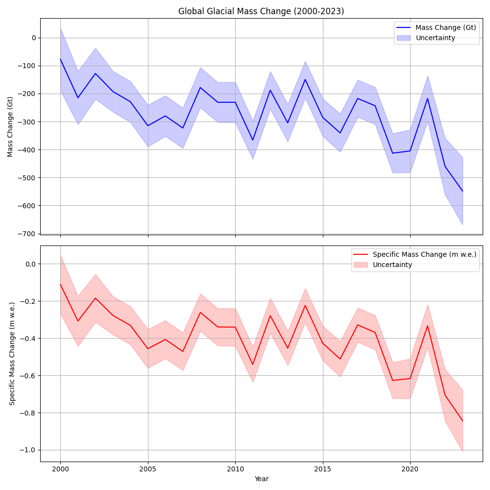
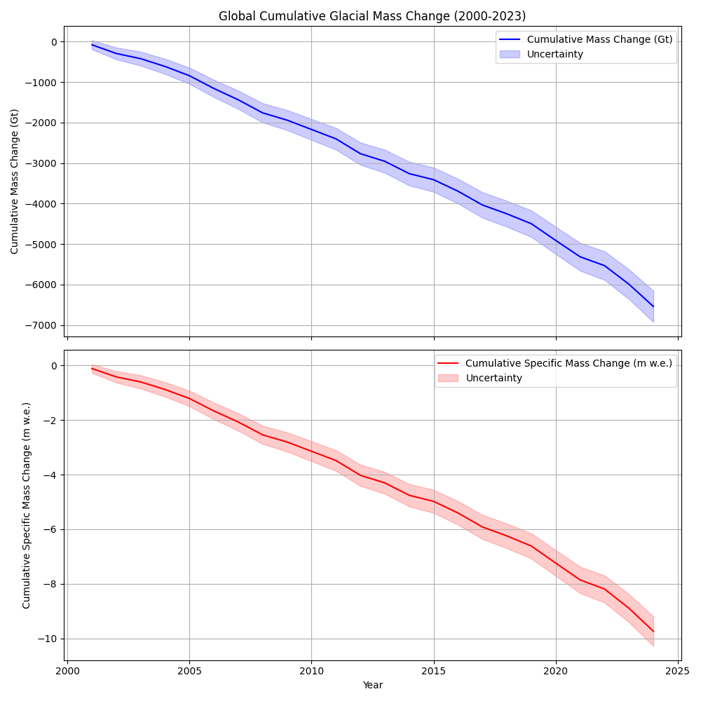
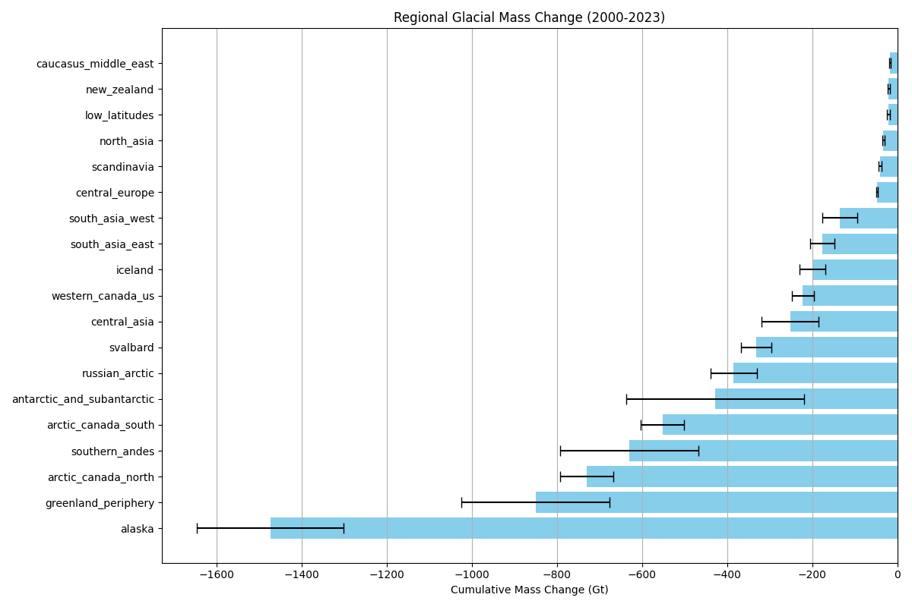
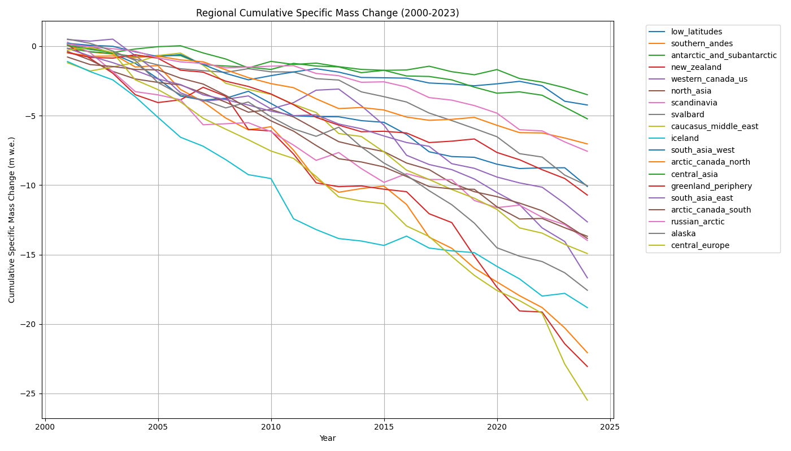
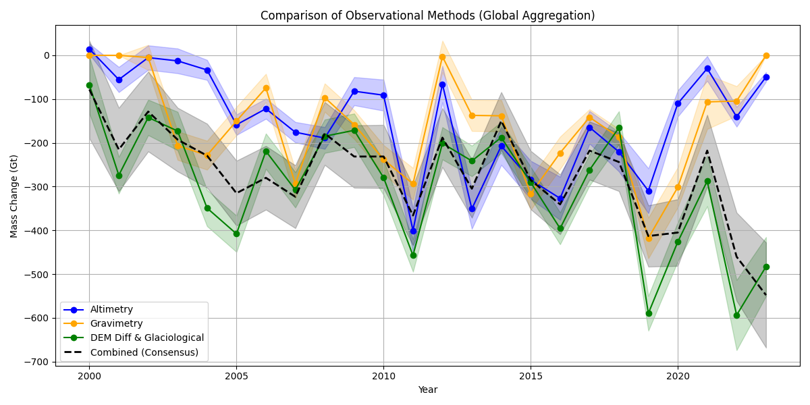

# Global Glacial Mass Change (2000-2023): A Reconciled Observational Assessment

## 1. Introduction
Glaciers distinct from the Greenland and Antarctic ice sheets are critical components of the global water cycle and major contributors to sea-level rise. However, estimating their mass change is challenging due to diverse observational methods, each with distinct temporal and spatial coverage, biases, and uncertainties. This report presents a reconciled assessment of global glacial mass change from 2000 to 2023, utilizing the Glacier Mass Balance Intercomparison Exercise (GlaMBIE) dataset. By combining estimates from glaciological measurements, digital elevation model (DEM) differencing, satellite altimetry, and gravimetry, we provide a consistent, high-confidence benchmark of regional and global glacial mass change.

## 2. Methodology

### 2.1 Data Sources
The analysis relies on the GlaMBIE dataset, which aggregates 233 regional estimates of glacier mass change from 19 global glacial regions. The input data comprises four primary observational methods:
- **Glaciological Measurements:** In situ observations of surface mass balance.
- **DEM Differencing:** Geodetic mass balance derived from comparing elevation models over time.
- **Satellite Altimetry:** Elevation changes measured by radar or laser altimeters.
- **Gravimetry:** Mass changes inferred from variations in the Earth's gravity field (e.g., GRACE).

### 2.2 Data Processing and Reconciliation
The GlaMBIE framework homogenizes and combines these independent estimates into a single consensus time series per region. The combination process accounts for the differing spatiotemporal resolutions and uncertainties of each method.
- **Hydrological vs. Calendar Years:** The initial reconciliation is performed on hydrological years to align with the natural mass balance cycle of glaciers. For global aggregation and broader climate modeling applicability, these regional consensus estimates are then converted to calendar years.
- **Uncertainty Estimation:** Uncertainties are propagated through the combination process, assuming independence where appropriate, and are reported as standard errors.
- **Aggregation:** Global mass change is calculated by summing the regional consensus estimates in calendar years. Errors are aggregated in quadrature, assuming regional independence.

## 3. Results

### 3.1 Global Glacial Mass Change
From 2000 to 2023, global glaciers experienced a massive and accelerating loss of ice. The total cumulative mass loss over this period was -6542.47 ± 387.02 Gigatonnes (Gt), corresponding to a total specific mass loss of -9.74 ± 0.54 meters water equivalent (m w.e.).

The average annual mass loss over the entire study period was -272.60 ± 16.13 Gt/yr. However, this rate has not been constant. An analysis of decadal trends reveals a clear acceleration in mass loss:
- **2000-2009:** Average annual loss of -217.16 Gt/yr.
- **2010-2019:** Average annual loss of -273.98 Gt/yr.

*Figure 1: Annual global glacial mass change (top) and specific mass change (bottom) from 2000 to 2023, with shaded regions indicating 1-sigma uncertainty.*

*Figure 2: Cumulative global glacial mass change (Gt) and specific mass change (m w.e.) from 2000 to 2023.*

### 3.2 Regional Contributions
The global mass loss is highly heterogeneous across the 19 regions. The regions contributing the most to the total mass loss (in Gt) are those with the largest ice volumes outside the ice sheets:
1. **Alaska:** -1473.86 ± 172.79 Gt
2. **Greenland Periphery:** -850.48 ± 174.37 Gt
3. **Arctic Canada North:** -730.24 ± 63.22 Gt
4. **Southern Andes:** -630.79 ± 162.57 Gt
5. **Arctic Canada South:** -552.24 ± 51.57 Gt

*Figure 3: Cumulative mass change (Gt) by region (2000-2023). Error bars represent the aggregated uncertainty.*

When normalized by glacier area (specific mass change in m w.e.), a different pattern emerges, highlighting regions where glaciers are shrinking most rapidly relative to their size. The top regions for specific mass loss are:
1. **Central Europe:** -25.48 m w.e.
2. **New Zealand:** -23.06 m w.e.
3. **Southern Andes:** -22.06 m w.e.
4. **Iceland:** -18.82 m w.e.
5. **Alaska:** -17.57 m w.e.

*Figure 4: Cumulative specific mass change (m w.e.) over time for all 19 regions.*

### 3.3 Comparison of Observational Methods
The reconciliation process relies on the strengths of different observational methods. Figure 5 illustrates the global aggregated mass change estimated by the individual methods compared to the final consensus estimate.

*Figure 5: Comparison of global mass change estimates derived from altimetry, gravimetry, and DEM differencing/glaciological methods, alongside the final combined consensus estimate.*

The combined estimate effectively integrates the high temporal resolution of gravimetry and glaciological measurements with the high spatial resolution and long-term stability of DEM differencing and altimetry. The consensus curve lies within the uncertainty bounds of the individual methods, demonstrating the robustness of the reconciliation approach.

## 4. Discussion and Conclusion
The reconciled assessment confirms a profound and accelerating loss of global glacier mass over the first two decades of the 21st century. The total loss of over 6,500 Gt represents a significant contribution to global sea-level rise and highlights the acute sensitivity of glaciers to ongoing climate change.

The acceleration in mass loss from the 2000s to the 2010s is particularly concerning and aligns with observed increases in global mean temperatures. The regional analysis underscores that while large Arctic and sub-Arctic regions (Alaska, Greenland Periphery, Arctic Canada) dominate the total mass contribution to the oceans, smaller mountain glaciers in regions like Central Europe and New Zealand are experiencing the most extreme relative mass loss, threatening local water resources and increasing the risk of natural hazards.

By integrating multiple independent observational methods, this study provides a high-confidence benchmark for global glacial mass change. This reconciled dataset is crucial for calibrating global glacier models, improving projections of future mass loss, and informing the Intergovernmental Panel on Climate Change (IPCC) assessments. Future work should continue to refine these estimates by incorporating emerging satellite missions and expanding in situ monitoring networks, particularly in under-sampled regions.