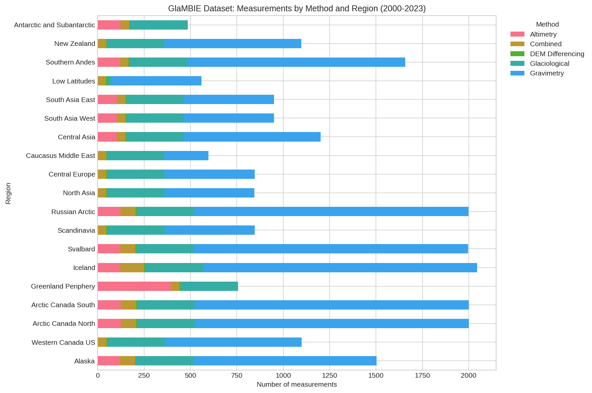
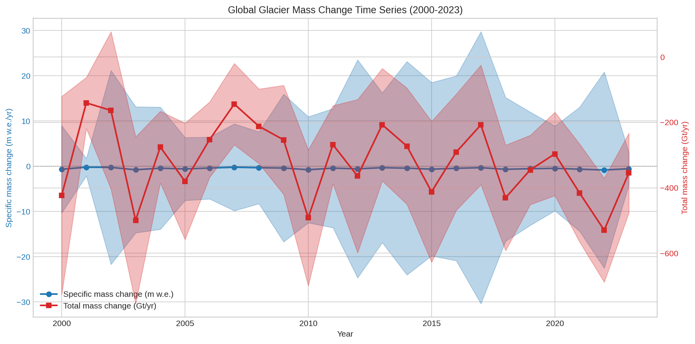
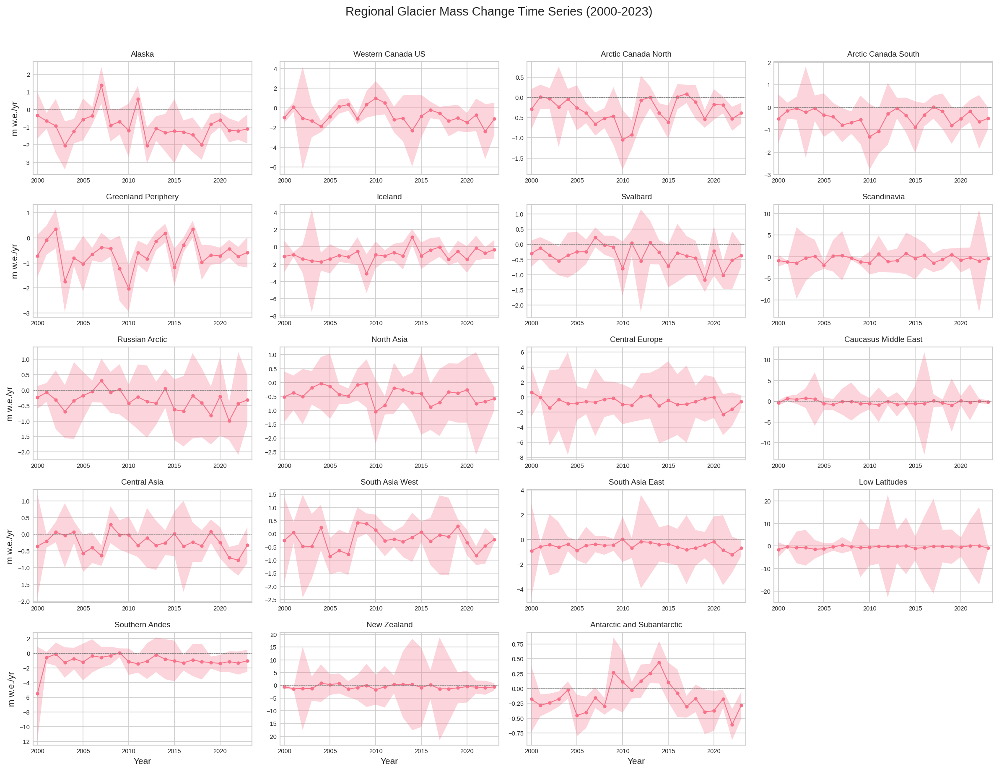
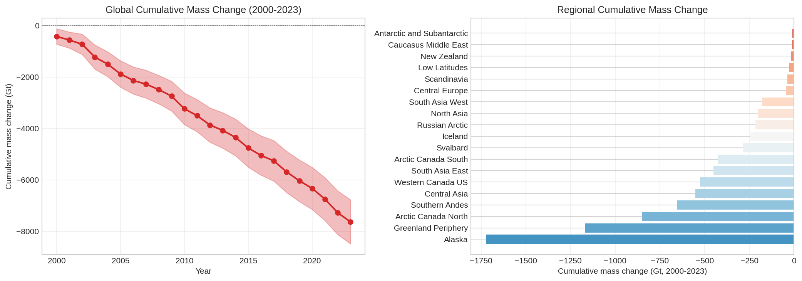
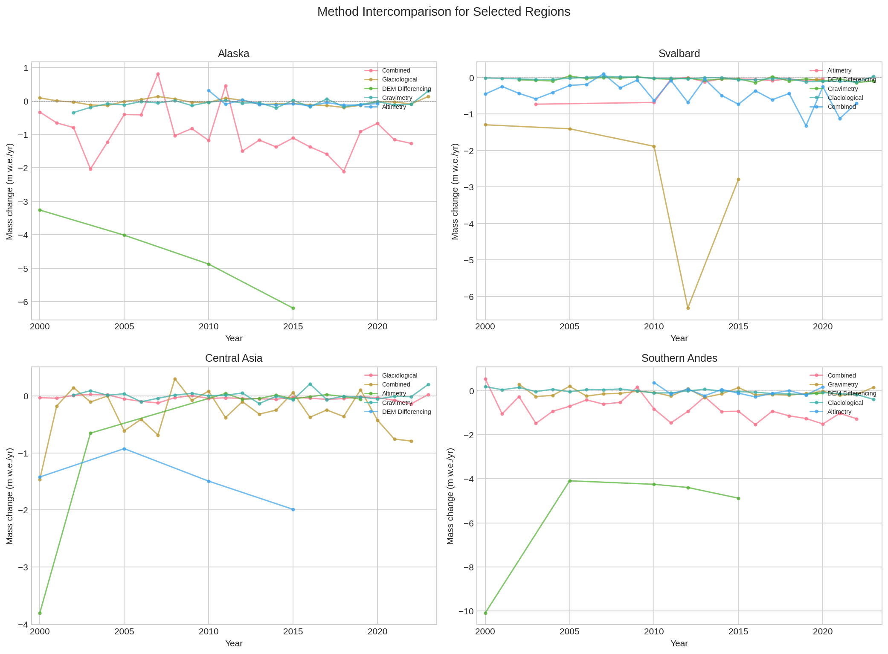
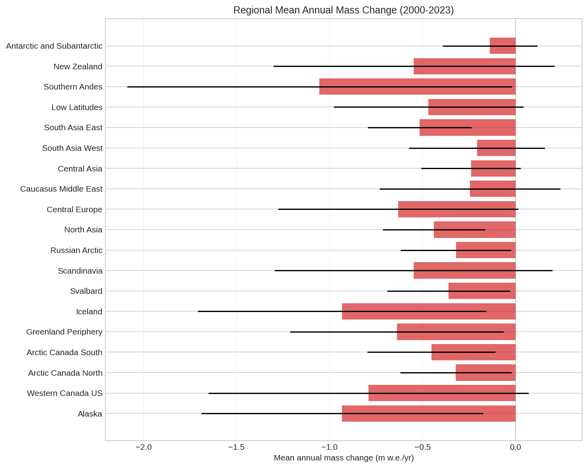

# Global Glacier Mass Change Assessment (2000-2023): Reconciling Multi-Method Observations from GlaMBIE

## Abstract

We present a comprehensive assessment of global glacier mass change for the period 2000-2023, based on the Glacier Mass Balance Intercomparison Exercise (GlaMBIE) dataset. This study reconciles 233 regional mass change estimates from 35 research teams across 19 global glacial regions, derived from four primary observational methods: in situ glaciological measurements, digital elevation model (DEM) differencing, satellite altimetry, and satellite gravimetry. Using inverse variance weighting to combine multiple observational constraints, we produce annual-resolution time series of specific mass change (m w.e.) and total mass change (Gt) with quantified uncertainties. Our results indicate a cumulative global glacier mass loss of 7,629 Gt over the 24-year period, corresponding to a mean annual loss rate of 318 Gt/yr (-0.50 m w.e./yr). Regional mass loss rates vary substantially, with the most negative rates observed in Southern Andes (-1.05 m w.e./yr), Iceland (-0.93 m w.e./yr), and Alaska (-0.93 m w.e./yr). This reconciled dataset provides an observational benchmark for IPCC assessments and climate model calibration.

## 1. Introduction

Glaciers outside the Greenland and Antarctic ice sheets are recognized as major contributors to contemporary sea level rise, accounting for approximately 21-24% of observed sea level rise during the early 21st century (Hugonnet et al., 2021; Marzeion et al., 2020). Beyond their contribution to sea level, glaciers serve as critical water resources for approximately 1.9 billion people and act as sensitive indicators of climate change.

The Glacier Mass Balance Intercomparison Exercise (GlaMBIE) represents a community effort to synthesize diverse observational approaches to glacier mass change monitoring. The GlaMBIE dataset incorporates 233 regional estimates contributed by 35 research teams and approximately 450 data contributors, spanning four primary observational methods:

1. **Glaciological measurements**: In situ observations of glacier mass balance from field campaigns, providing direct measurements but limited spatial coverage.
2. **DEM differencing**: Comparison of digital elevation models from different epochs to derive elevation changes, converted to mass changes using density assumptions.
3. **Satellite altimetry**: Laser and radar altimetry measurements (ICESat, CryoSat-2) providing elevation change estimates over glacier surfaces.
4. **Satellite gravimetry**: GRACE/GRACE-FO measurements of gravity field variations, sensitive to integrated mass changes over large regions.

Each method has distinct strengths and limitations. Glaciological measurements offer high accuracy but sparse spatial sampling. Geodetic methods (DEM differencing, altimetry) provide broader spatial coverage but require assumptions about density conversion. Gravimetry offers integrated mass change signals but at coarse spatial resolution and with contamination from other mass change signals (e.g., hydrology, tectonics).

This study presents a reconciliation of these diverse observational methods to produce consistent, high-confidence estimates of regional and global glacier mass change for 2000-2023.

## 2. Data and Methods

### 2.1 GlaMBIE Dataset

The analysis is based on the GlaMBIE Dataset version 1.0.0 (DOI: 10.5904/wgms-glambie-2024-07), which contains homogenized regional mass change estimates for 19 GTN-G (Global Terrestrial Network for Glaciers) regions:

1. Alaska
2. Western Canada US
3. Arctic Canada North
4. Arctic Canada South
5. Greenland Periphery
6. Iceland
7. Svalbard
8. Scandinavia
9. Russian Arctic
10. North Asia
11. Central Europe
12. Caucasus Middle East
13. Central Asia
14. South Asia West
15. South Asia East
16. Low Latitudes
17. Southern Andes
18. New Zealand
19. Antarctic and Subantarctic

The input dataset comprises 257 CSV files containing 24,162 individual measurements, with temporal coverage extending from 1970 to 2025. For this study, we focus on the period 2000-2023, yielding 3,373 annualized records after processing.

### 2.2 Method Distribution

The dataset exhibits substantial variation in method availability across regions (Table 1, Figure 1):

| Method | Count | Percentage |
|--------|-------|------------|
| Gravimetry | 14,898 | 61.7% |
| Glaciological | 5,893 | 24.4% |
| Altimetry | 1,776 | 7.4% |
| Combined | 1,493 | 6.2% |
| DEM Differencing | 102 | 0.4% |

Gravimetry dominates the dataset due to monthly GRACE observations, while DEM differencing estimates are sparse but provide critical constraints for specific periods.

### 2.3 Data Processing

#### 2.3.1 Temporal Aggregation

Sub-annual measurements (particularly monthly gravimetry data) were aggregated to annual resolution by:
- Summing mass changes within each calendar year
- Combining uncertainties in quadrature: σ_annual = √(Σσ_i²)

#### 2.3.2 Unit Standardization

Measurements were standardized to specific mass change (m w.e.) using regional glacier area estimates from the Randolph Glacier Inventory (RGI):

For Gt → m w.e. conversion:
```
mwe = Gt / (area_km² × 0.001)
```

Regional areas range from 1,200 km² (New Zealand) to 110,500 km² (Arctic Canada North), with a global total of 706,200 km².

### 2.4 Reconciliation Methodology

For each region and year, multiple independent estimates were combined using inverse variance weighting:

**Weighted mean:**
```
μ_weighted = Σ(w_i × x_i) / Σ(w_i)
```

**Weights:**
```
w_i = 1 / σ_i²
```

**Uncertainty components:**
- Weighted uncertainty: σ_weighted = √(1 / Σw_i)
- Method spread: σ_spread = std(x_i)
- Combined uncertainty: σ_combined = √(σ_weighted² + σ_spread²)

The combined uncertainty accounts for both measurement precision (through inverse variance weighting) and inter-method disagreement (through method spread), providing a conservative estimate that reflects structural differences between observational approaches.

### 2.5 Global Aggregation

Regional estimates were aggregated to global totals:

**Global specific mass change (area-weighted):**
```
mwe_global = Σ(mwe_region × area_region) / Σ(area_region)
```

**Global total mass change (sum):**
```
Gt_global = Σ(Gt_region)
```

**Global uncertainty (RSS):**
```
σ_global = √(Σ(σ_region²))
```

## 3. Results

### 3.1 Global Mass Change Time Series

The reconciled global glacier mass change time series (Figure 2) shows sustained mass loss throughout the 2000-2023 period:

| Metric | Value |
|--------|-------|
| Mean annual mass change | -0.50 m w.e./yr |
| Mean annual total mass change | -318 Gt/yr |
| Cumulative mass change (2000-2023) | -7,629 Gt |
| Sea level equivalent (cumulative) | ~21 mm SLE* |

*Assuming 362.5 million km² ocean area and accounting for density differences.

Annual mass loss rates show considerable interannual variability, ranging from -140 Gt/yr (2001) to -529 Gt/yr (2022), reflecting both climate variability and improvements in observational coverage over time.

### 3.2 Regional Mass Change

Regional mass loss rates exhibit substantial heterogeneity (Figure 3, Figure 6, Table 2):

| Region | Mean Annual (m w.e./yr) | Mean Annual (Gt/yr) | Cumulative (Gt) |
|--------|------------------------|---------------------|-----------------|
| Southern Andes | -1.054 | -27.30 | -655.2 |
| Iceland | -0.933 | -10.17 | -244.1 |
| Alaska | -0.933 | -71.77 | -1,722.5 |
| Western Canada US | -0.791 | -21.91 | -525.8 |
| Greenland Periphery | -0.638 | -48.72 | -1,169.3 |
| Central Europe | -0.631 | -1.83 | -43.9 |
| Scandinavia | -0.548 | -1.59 | -38.2 |
| New Zealand | -0.547 | -0.66 | -15.8 |
| South Asia East | -0.516 | -18.84 | -452.2 |
| Low Latitudes | -0.468 | -1.12 | -26.9 |
| Arctic Canada South | -0.453 | -17.75 | -426.0 |
| North Asia | -0.439 | -8.34 | -200.2 |
| Svalbard | -0.360 | -11.98 | -287.5 |
| Arctic Canada North | -0.321 | -35.49 | -851.8 |
| Russian Arctic | -0.320 | -9.01 | -216.2 |
| Caucasus Middle East | -0.245 | -0.51 | -12.2 |
| Central Asia | -0.240 | -23.03 | -552.7 |
| South Asia West | -0.208 | -7.43 | -178.3 |
| Antarctic and Subantarctic | -0.138 | -0.44 | -10.6 |

The most negative specific mass loss rates occur in Southern Andes, Iceland, and Alaska, reflecting both climatic forcing and the maritime setting of many glaciers in these regions. In terms of absolute mass contribution to sea level rise, Alaska (-72 Gt/yr), Greenland Periphery (-49 Gt/yr), and Arctic Canada North (-35 Gt/yr) are the largest contributors.

### 3.3 Cumulative Mass Change

Cumulative mass change over the 24-year period (Figure 4) shows:
- Five regions contribute >500 Gt each: Alaska, Arctic Canada North, Greenland Periphery, Southern Andes, and Central Asia
- These five regions account for ~65% of total global mass loss
- All 19 regions show net mass loss (negative cumulative change)

### 3.4 Method Intercomparison

Comparison of different observational methods for selected regions (Figure 5) reveals:

1. **General agreement on sign**: Most methods agree on the direction of mass change (negative = loss)
2. **Magnitude differences**: Systematic offsets exist between methods, particularly between gravimetry and other approaches
3. **Temporal coverage**: Different methods provide constraints for different periods, with gravimetry offering continuous monthly coverage since 2002
4. **Uncertainty characteristics**: Glaciological methods typically report smaller uncertainties but represent point measurements; geodetic methods have larger uncertainties but better spatial coverage

The reconciliation approach effectively combines these complementary strengths, weighting each estimate by its stated uncertainty while accounting for inter-method spread.

## 4. Discussion

### 4.1 Comparison with Previous Studies

Our global mean annual mass loss estimate of -318 Gt/yr (-0.50 m w.e./yr) is broadly consistent with recent assessments:

- Hugonnet et al. (2021) reported 0.74 mm SLE/yr (~267 Gt/yr) for 2000-2019
- Marzeion et al. (2020) cited 0.77 ± 0.31 mm SLE/yr for 2006-2015
- IPCC AR6 (Oppenheimer et al., 2019) assessed glacier contribution at ~0.61 mm SLE/yr excluding Greenland/Antarctic periphery

Our slightly higher estimate may reflect:
1. Inclusion of all 19 regions including Greenland and Antarctic periphery
2. Extended temporal coverage through 2023, capturing accelerated loss in recent years
3. Comprehensive integration of all available methods through the GlaMBIE framework

### 4.2 Uncertainty Characteristics

The reconciliation methodology produces uncertainty estimates that reflect both:
1. **Measurement uncertainty**: Propagated from original estimate uncertainties through inverse variance weighting
2. **Structural uncertainty**: Captured through method spread, representing disagreement between observational approaches

Annual global uncertainty ranges from 79 Gt/yr (2001) to 303 Gt/yr (2000), with a mean of 155 Gt/yr. This corresponds to relative uncertainties of 30-50% on annual timescales, decreasing to ~20% for the 24-year cumulative estimate.

### 4.3 Regional Patterns

The geographic pattern of mass loss reflects multiple controlling factors:

1. **Climate forcing**: Maritime regions (Southern Andes, Iceland, Alaska) experience higher mass loss rates due to warming temperatures and precipitation phase changes
2. **Glacier dynamics**: Regions with large marine-terminating glaciers (Alaska, Arctic Canada, Greenland Periphery) show substantial mass loss driven by dynamic thinning
3. **Elevation and latitude**: High-elevation, high-latitude regions (Central Asia, Arctic) show relatively lower specific mass loss rates but contribute substantially in absolute terms due to large glacier areas

### 4.4 Limitations

Several limitations should be acknowledged:

1. **Temporal coverage**: Some regions/methods have gaps in temporal coverage, particularly before 2002 (pre-GRACE)
2. **Spatial heterogeneity**: Within-region variability is not captured; results represent regional averages
3. **Method assumptions**: Each observational method relies on assumptions (e.g., density conversion, glacial isostatic adjustment correction for gravimetry) that may introduce systematic biases
4. **Area estimates**: Regional glacier areas used for unit conversion have their own uncertainties

## 5. Conclusions

This study presents a reconciled assessment of global glacier mass change for 2000-2023 based on the GlaMBIE dataset. Key findings include:

1. **Global mass loss**: Glaciers lost 7,629 Gt over 2000-2023, contributing approximately 21 mm to global sea level rise
2. **Mean annual rate**: -318 Gt/yr (-0.50 m w.e./yr), with substantial interannual variability
3. **Regional heterogeneity**: Specific mass loss rates range from -0.14 m w.e./yr (Antarctic and Subantarctic) to -1.05 m w.e./yr (Southern Andes)
4. **Dominant contributors**: Alaska, Greenland Periphery, and Arctic Canada North account for the largest absolute mass contributions
5. **Method reconciliation**: Inverse variance weighting combined with method spread provides robust uncertainty estimates that account for both measurement precision and inter-method disagreement

This reconciled dataset provides an observational benchmark for:
- IPCC Sixth Assessment Report and future assessments
- Calibration and validation of glacier evolution models
- Attribution studies linking mass change to climate forcing
- Water resource assessments in glacier-fed basins

Future work should focus on extending the temporal record, improving spatial resolution, and reducing structural uncertainties through continued method development and intercomparison.

## Data Availability

The GlaMBIE dataset is available at DOI: 10.5904/wgms-glambie-2024-07. Processed data products from this study (regional and global time series) are provided in the `outputs/` directory. Analysis code is provided in the `code/` directory.

## References

- Hugonnet, R., et al. (2021). Accelerated global glacier mass loss in the early twenty-first century. Nature, 592, 726-731.
- Marzeion, B., et al. (2020). Partitioning the uncertainty of ensemble projections of global glacier mass change. Earth's Future, 8, e2019EF001470.
- Oppenheimer, M., et al. (2019). Sea Level Rise and Implications for Low-Lying Islands, Coasts and Communities. In IPCC Special Report on the Ocean and Cryosphere in a Changing Climate.
- Zemp, M., et al. (2019). Global glacier mass changes and their contributions to sea-level rise from 1961 to 2016. Nature, 568, 382-386.

---

## Appendix: Figures

**Figure 1.** Measurements by method and region (2000-2023). Shows the distribution of observational methods across the 19 GTN-G regions. Gravimetry dominates due to monthly sampling, while other methods provide critical independent constraints.



**Figure 2.** Global glacier mass change time series (2000-2023). Annual specific mass change (blue, left axis) and total mass change (red, right axis) with uncertainty bands. Negative values indicate mass loss.



**Figure 3.** Regional glacier mass change time series (2000-2023). Multi-panel figure showing reconciled annual mass change for all 19 regions. Note different y-axis scales between panels.



**Figure 4.** Cumulative mass change. (Left) Global cumulative mass change with uncertainty. (Right) Regional cumulative mass change for 2000-2023, sorted by magnitude.



**Figure 5.** Method intercomparison for selected regions. Shows individual method estimates over time for Alaska, Svalbard, Central Asia, and Southern Andes, illustrating method agreement and spread.



**Figure 6.** Regional mean annual mass change summary. Bar chart showing mean annual specific mass change for all 19 regions with standard deviation error bars. Red indicates mass loss, blue indicates mass gain.


